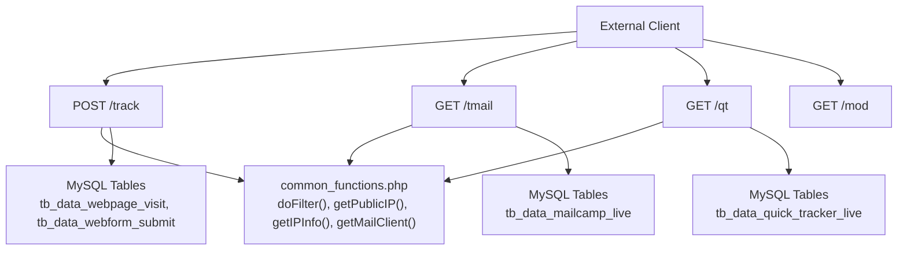
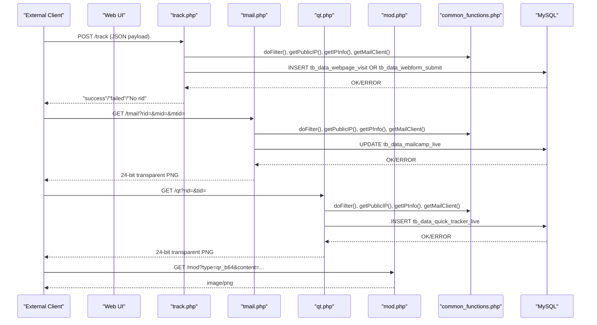
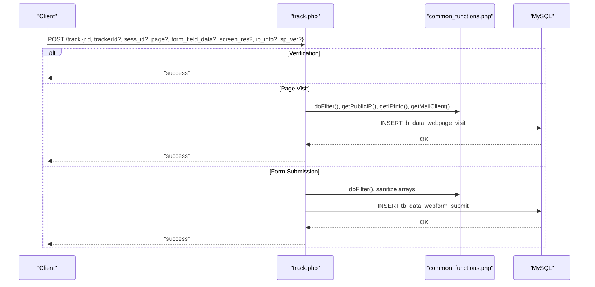
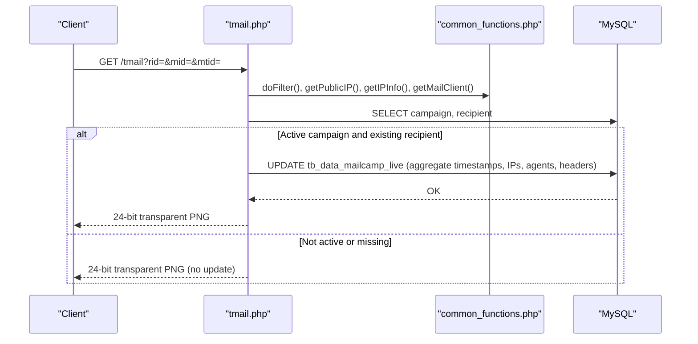
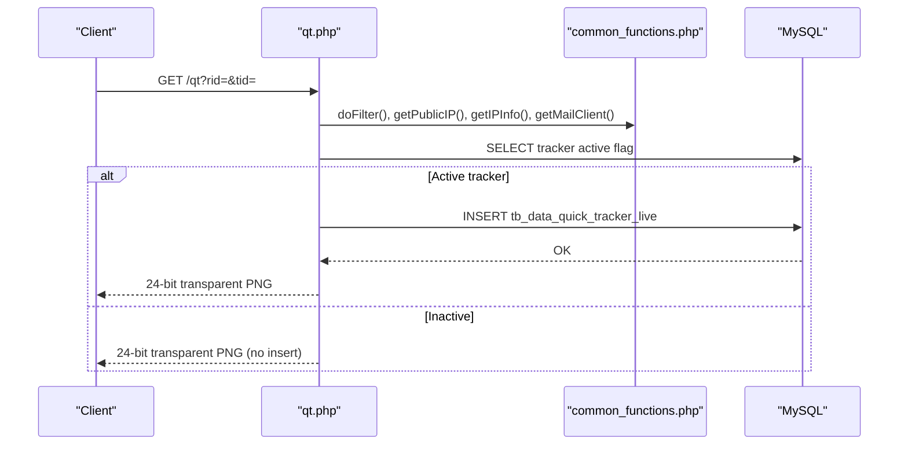
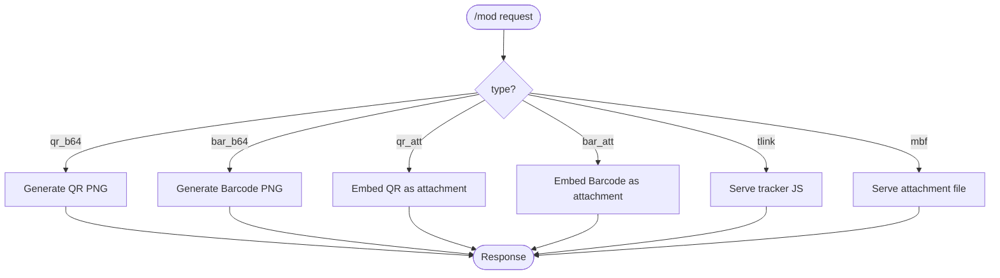
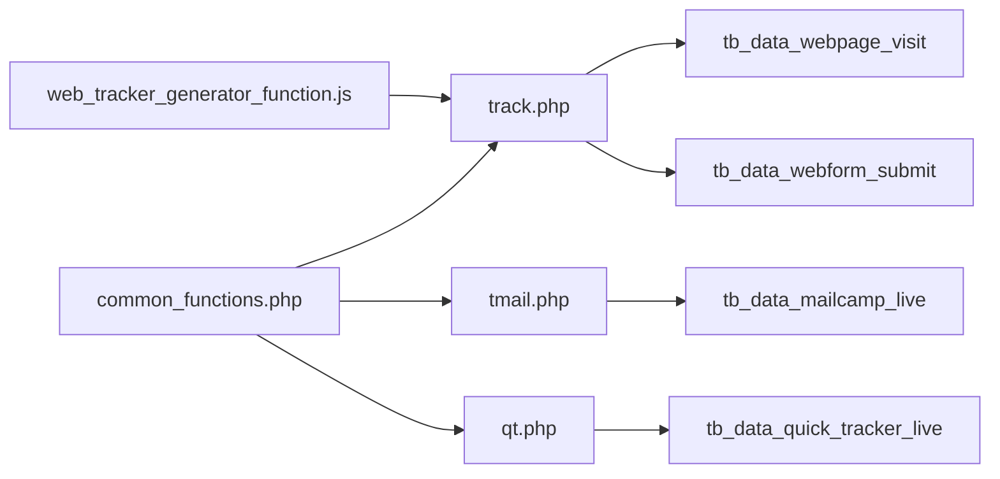
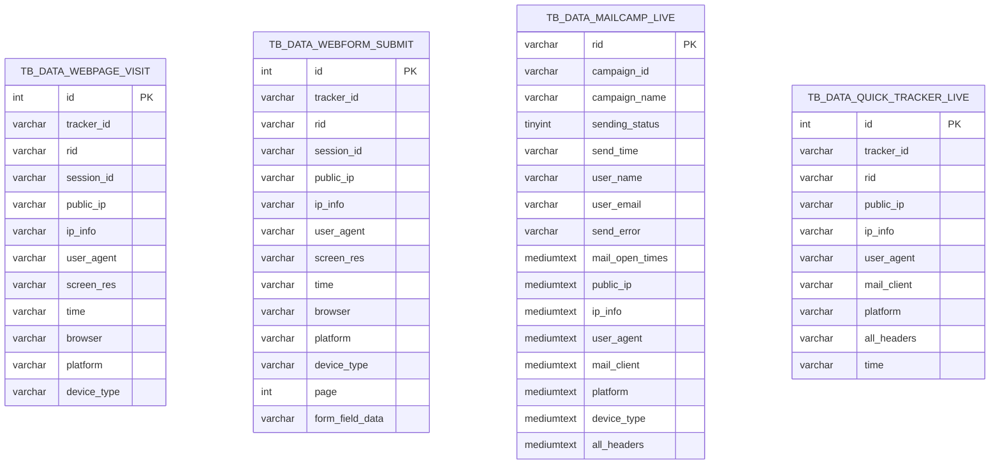

# API Reference

<cite>
**Referenced Files in This Document**
- [track.php](file://track.php)
- [tmail.php](file://tmail.php)
- [qt.php](file://qt.php)
- [mod.php](file://mod.php)
- [common_functions.php](file://spear/manager/common_functions.php)
- [web_tracker_generator_function.js](file://spear/js/web_tracker_generator_function.js)
- [install_manager.php](file://install_manager.php)
- [README.md](file://README.md)
</cite>

## Table of Contents
1. [Introduction](#introduction)
2. [Project Structure](#project-structure)
3. [Core Components](#core-components)
4. [Architecture Overview](#architecture-overview)
5. [Detailed Component Analysis](#detailed-component-analysis)
6. [Dependency Analysis](#dependency-analysis)
7. [Performance Considerations](#performance-considerations)
8. [Troubleshooting Guide](#troubleshooting-guide)
9. [Conclusion](#conclusion)
10. [Appendices](#appendices)

## Introduction
This document describes the SniperPhish webhook endpoints and internal APIs used for tracking web visits, form submissions, email opens, and quick tracker events. It focuses on HTTP methods, URL patterns, request/response schemas, and integration protocols. It also covers authentication considerations, validation, and operational guidance for integrating external systems.

## Project Structure
The API surface relevant to this document comprises four primary endpoints:
- Web tracking webhook: POST /track
- Email tracking and delivery: GET /tmail
- Quick tracker: GET /qt
- Module utilities and assets: GET /mod

These endpoints rely on shared utilities for filtering, IP enrichment, browser detection, and validation.

**Diagram sources**
- [track.php:1-88](file://track.php#L1-L88)
- [tmail.php:1-148](file://tmail.php#L1-L148)
- [qt.php:1-63](file://qt.php#L1-L63)
- [mod.php:1-73](file://mod.php#L1-L73)
- [common_functions.php:447-458](file://spear/manager/common_functions.php#L447-L458)
- [install_manager.php:335-415](file://install_manager.php#L335-L415)

**Section sources**
- [README.md:11-86](file://README.md#L11-L86)
- [track.php:1-88](file://track.php#L1-L88)
- [tmail.php:1-148](file://tmail.php#L1-L148)
- [qt.php:1-63](file://qt.php#L1-L63)
- [mod.php:1-73](file://mod.php#L1-L73)
- [common_functions.php:257-331](file://spear/manager/common_functions.php#L257-L331)
- [install_manager.php:335-415](file://install_manager.php#L335-L415)

## Core Components
- Web Tracking Endpoint (/track)
  - Method: POST
  - Purpose: Record page visits and form submissions for a given tracker and user.
  - Authentication: None enforced by the endpoint itself; includes a verification handshake via a special field.
  - Validation: Input filtered to alphanumeric identifiers; IP info enriched via external service when not provided.
  - Responses: "success" or "failed"; "No rid" on missing required identifier.

- Email Tracking Endpoint (/tmail)
  - Method: GET
  - Purpose: Log email open events and update metadata for a recipient in a campaign.
  - Authentication: None enforced by the endpoint itself; campaign and recipient validated via database checks.
  - Validation: Recipient ID, campaign ID, and template ID parsed and sanitized.
  - Responses: Inline image rendering; updates stored in live campaign data.

- Quick Tracker Endpoint (/qt)
  - Method: GET
  - Purpose: Record a quick tracker event for a given tracker and user.
  - Authentication: None enforced by the endpoint itself; tracker activation checked via database.
  - Validation: Tracker ID and user ID sanitized; IP info optionally enriched.
  - Responses: Inline image rendering; inserts a row into the quick tracker live table.

- Module Utilities (/mod)
  - Methods: GET
  - Purpose: Serve QR/Barcode images, embedded tracker JavaScript, and attachment files.
  - Authentication: None enforced by the endpoint itself.
  - Validation: Parameters validated and sanitized before use.

**Section sources**
- [track.php:9-88](file://track.php#L9-L88)
- [tmail.php:7-148](file://tmail.php#L7-L148)
- [qt.php:7-63](file://qt.php#L7-L63)
- [mod.php:7-73](file://mod.php#L7-L73)

## Architecture Overview
The endpoints integrate with a MySQL backend to persist tracking data. Shared utilities handle input sanitization, IP enrichment, and browser identification. The UI provides a verification mechanism for webhook endpoints.

**Diagram sources**
- [track.php:19-83](file://track.php#L19-L83)
- [tmail.php:28-108](file://tmail.php#L28-L108)
- [qt.php:21-42](file://qt.php#L21-L42)
- [mod.php:29-43](file://mod.php#L29-L43)
- [common_functions.php:257-331](file://spear/manager/common_functions.php#L257-L331)
- [install_manager.php:335-415](file://install_manager.php#L335-L415)

## Detailed Component Analysis

### Web Tracking Endpoint (/track)
- HTTP Method: POST
- URL Pattern: /track
- Purpose: Accepts tracking events for page visits and form submissions.
- Request Schema (JSON):
  - Required:
    - rid: alphanumeric user/session identifier
  - Conditional:
    - sess_id: alphanumeric session identifier (optional)
    - trackerId: alphanumeric tracker identifier (optional)
    - page: integer page index for form submissions; zero indicates visit
    - form_field_data: array of field values (for form submissions)
    - screen_res: string screen resolution (optional)
    - ip_info: object with IP details (optional; otherwise auto-enriched)
    - sp_ver: string "test" for verification handshake
- Response:
  - "success" on successful insert
  - "failed" on database insert failure
  - "No rid" if rid is missing
  - "success" for verification handshake
- Validation and Sanitization:
  - Identifiers sanitized to alphanumeric via shared filter
  - User agent and headers sanitized
  - IP info auto-enriched if not provided
- Error Handling:
  - Missing rid returns "No rid"
  - Tracker paused returns no-op
  - Database errors return "failed"
- Security Considerations:
  - No built-in authentication; use external controls (e.g., network ACLs, reverse proxy auth)
  - Input is sanitized; consider rate limiting and request size limits
- Integration Notes:
  - Verification flow supported via sp_ver field
  - Form submissions require page index and sanitized field data

**Diagram sources**
- [track.php:9-83](file://track.php#L9-L83)
- [common_functions.php:447-458](file://spear/manager/common_functions.php#L447-L458)
- [install_manager.php:399-415](file://install_manager.php#L399-L415)

**Section sources**
- [track.php:9-88](file://track.php#L9-L88)
- [common_functions.php:447-458](file://spear/manager/common_functions.php#L447-L458)
- [install_manager.php:399-415](file://install_manager.php#L399-L415)

### Email Tracking Endpoint (/tmail)
- HTTP Method: GET
- URL Pattern: /tmail?rid={RID}&mid={CAMPAIGN_ID}&mtid={TEMPLATE_ID}
- Purpose: Logs email open events and aggregates metadata for a recipient in a campaign.
- Request Schema:
  - rid: alphanumeric recipient identifier
  - mid: alphanumeric campaign identifier
  - mtid: alphanumeric template identifier prefix (expects format "mtid_<random>")
- Response:
  - 24-bit transparent PNG image rendered inline
  - Updates live campaign data for the recipient
- Validation and Sanitization:
  - All IDs sanitized to alphanumeric
  - Campaign and recipient existence verified via database
  - IP info, user agent, platform, device type, and headers aggregated
- Error Handling:
  - Non-active campaign or missing recipient yields no update
- Security Considerations:
  - No built-in authentication; protect via network controls and referer policies
  - Template ID parsing supports only numeric suffix extraction
- Integration Notes:
  - Embed the endpoint URL as a 1x1 transparent GIF in email templates
  - Use mtid parameter to associate with a specific template

**Diagram sources**
- [tmail.php:7-148](file://tmail.php#L7-L148)
- [common_functions.php:257-331](file://spear/manager/common_functions.php#L257-L331)
- [install_manager.php:335-352](file://install_manager.php#L335-L352)

**Section sources**
- [tmail.php:7-148](file://tmail.php#L7-L148)
- [common_functions.php:292-331](file://spear/manager/common_functions.php#L292-L331)
- [install_manager.php:335-352](file://install_manager.php#L335-L352)

### Quick Tracker Endpoint (/qt)
- HTTP Method: GET
- URL Pattern: /qt?rid={RID}&tid={TRACKER_ID}
- Purpose: Records a quick tracker event for a given tracker and user.
- Request Schema:
  - rid: alphanumeric user identifier
  - tid: alphanumeric tracker identifier
- Response:
  - 24-bit transparent PNG image rendered inline
  - Inserts a row into the quick tracker live table
- Validation and Sanitization:
  - Tracker activation checked via database
  - IP info optionally enriched; headers captured
- Error Handling:
  - Inactive tracker yields no insert
- Security Considerations:
  - No built-in authentication; protect via network controls
- Integration Notes:
  - Embed the endpoint URL as a 1x1 transparent GIF in emails or web pages
  - Use tracker ID generated by the system

**Diagram sources**
- [qt.php:7-63](file://qt.php#L7-L63)
- [common_functions.php:257-331](file://spear/manager/common_functions.php#L257-L331)
- [install_manager.php:360-371](file://install_manager.php#L360-L371)

**Section sources**
- [qt.php:7-63](file://qt.php#L7-L63)
- [common_functions.php:257-331](file://spear/manager/common_functions.php#L257-L331)
- [install_manager.php:360-371](file://install_manager.php#L360-L371)

### Module Utilities (/mod)
- HTTP Method: GET
- URL Pattern: /mod?type={qr_b64|bar_b64|qr_att|bar_att}&content=...&options=...
- Purpose: Provides QR/Barcode images, embedded tracker JavaScript, and attachment files.
- Supported Types:
  - qr_b64, bar_b64: Base64-encoded images embedded in HTML
  - qr_att, bar_att: Attachments embedded in outbound messages
  - tlink: Embedded tracker JavaScript for a given tracker ID
  - mbf: Attachment file retrieval by numeric suffix
- Response:
  - image/png for QR/Barcode
  - application/javascript for tracker code
  - Binary stream for attachments
- Validation and Sanitization:
  - Parameters validated and sanitized before use
- Security Considerations:
  - No built-in authentication; restrict access via network controls
- Integration Notes:
  - Use tlink to inject tracker code into landing pages
  - Use mbf to serve attachments securely

**Diagram sources**
- [mod.php:7-73](file://mod.php#L7-L73)

**Section sources**
- [mod.php:7-73](file://mod.php#L7-L73)

## Dependency Analysis
- Endpoint-to-Utility Dependencies:
  - track.php, tmail.php, qt.php depend on common_functions.php for filtering, IP enrichment, and browser detection.
- Endpoint-to-Database Dependencies:
  - track.php writes to tb_data_webpage_visit and tb_data_webform_submit.
  - tmail.php updates tb_data_mailcamp_live.
  - qt.php writes to tb_data_quick_tracker_live.
- UI Integration:
  - The UI provides a verification flow for /track via a dedicated client-side function.

**Diagram sources**
- [common_functions.php:447-458](file://spear/manager/common_functions.php#L447-L458)
- [track.php:55-83](file://track.php#L55-L83)
- [tmail.php:105-108](file://tmail.php#L105-L108)
- [qt.php:39-42](file://qt.php#L39-L42)
- [install_manager.php:335-415](file://install_manager.php#L335-L415)
- [web_tracker_generator_function.js:852-881](file://spear/js/web_tracker_generator_function.js#L852-L881)

**Section sources**
- [common_functions.php:257-331](file://spear/manager/common_functions.php#L257-L331)
- [install_manager.php:335-415](file://install_manager.php#L335-L415)
- [web_tracker_generator_function.js:852-881](file://spear/js/web_tracker_generator_function.js#L852-L881)

## Performance Considerations
- Rate Limiting: Apply rate limits at the web server or reverse proxy level to prevent abuse of endpoints.
- Request Size Limits: Enforce reasonable limits on JSON payload sizes for /track.
- Database Writes: Batch or throttle frequent writes if integrating high-volume clients.
- IP Enrichment: External IP lookup adds latency; cache results where appropriate.
- Image Rendering: /tmail and /qt render lightweight images; ensure efficient serving.

## Troubleshooting Guide
- Webhook Verification Failure:
  - Ensure the /track endpoint is reachable and responds to {"sp_ver":"test"} with "success".
  - Confirm the UI verification flow completes without errors.
- Missing Tracking Data:
  - Verify rid is present and matches expected format.
  - Confirm tracker is active and not paused.
  - Check database connectivity and table permissions.
- Email Open Tracking Not Recorded:
  - Confirm campaign status indicates in-progress.
  - Ensure recipient exists for the given campaign.
  - Validate mtid format and template association.
- Quick Tracker Not Recorded:
  - Confirm tracker is active.
  - Validate tracker and user IDs.
- Image Not Displaying:
  - Confirm endpoint returns 24-bit transparent PNG.
  - Check content-type headers and network restrictions.

**Section sources**
- [web_tracker_generator_function.js:852-881](file://spear/js/web_tracker_generator_function.js#L852-L881)
- [track.php:15-22](file://track.php#L15-L22)
- [tmail.php:28-108](file://tmail.php#L28-L108)
- [qt.php:21-42](file://qt.php#L21-L42)

## Conclusion
The SniperPhish API provides lightweight, stateless endpoints for web and email tracking, along with quick tracker and module utilities. While the endpoints themselves do not enforce authentication, they incorporate input sanitization and IP enrichment. Secure deployments should apply network-level controls, rate limiting, and monitoring to protect these endpoints.

## Appendices

### API Definitions

- POST /track
  - Headers: Content-Type: application/json
  - Body Fields:
    - rid (required, alphanumeric)
    - sess_id (optional, alphanumeric)
    - trackerId (optional, alphanumeric)
    - page (optional, integer; zero for visit, positive for form submission)
    - form_field_data (optional, array of strings)
    - screen_res (optional, string)
    - ip_info (optional, object)
    - sp_ver (optional, string "test")
  - Responses:
    - "success" on success
    - "failed" on database error
    - "No rid" if missing required identifier
    - "success" for verification handshake

- GET /tmail
  - Query Parameters:
    - rid (required, alphanumeric)
    - mid (required, alphanumeric)
    - mtid (required, format "mtid_<random>")
  - Responses:
    - 24-bit transparent PNG
    - Updates live campaign data for the recipient

- GET /qt
  - Query Parameters:
    - rid (required, alphanumeric)
    - tid (required, alphanumeric)
  - Responses:
    - 24-bit transparent PNG
    - Inserts quick tracker event

- GET /mod
  - Query Parameters:
    - type (required, one of qr_b64, bar_b64, qr_att, bar_att, tlink, mbf)
    - content (required for qr_b64, bar_b64, qr_att, bar_att)
    - options (optional for qr_b64, bar_b64)
    - tlink (required for tlink)
    - mbf (required for mbf)
  - Responses:
    - image/png for QR/Barcode
    - application/javascript for tracker code
    - Binary stream for attachments

### Data Models

**Diagram sources**
- [install_manager.php:335-415](file://install_manager.php#L335-L415)

### Integration Patterns

- Custom Tracking Integrations:
  - Use POST /track to record page visits and form submissions.
  - Embed verification handshake to confirm endpoint accessibility.
- Automated Campaign Management:
  - Use GET /tmail to log email opens; ensure campaign is active and recipient exists.
  - Use GET /qt for lightweight tracking without full web campaign infrastructure.
- Third-Party System Integration:
  - Utilize GET /mod to embed QR/Barcode images or tracker JavaScript.
  - Serve attachments via GET /mod?mbf=... for secure delivery.

**Section sources**
- [README.md:46-67](file://README.md#L46-L67)
- [web_tracker_generator_function.js:852-881](file://spear/js/web_tracker_generator_function.js#L852-L881)