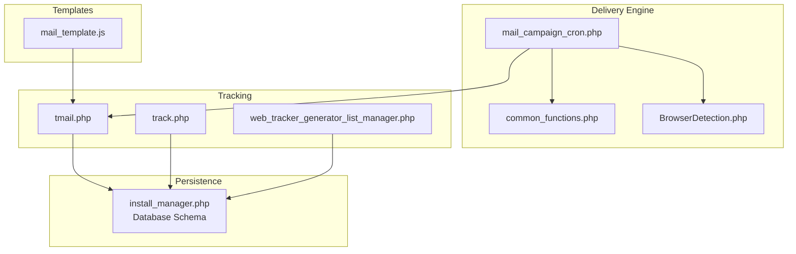
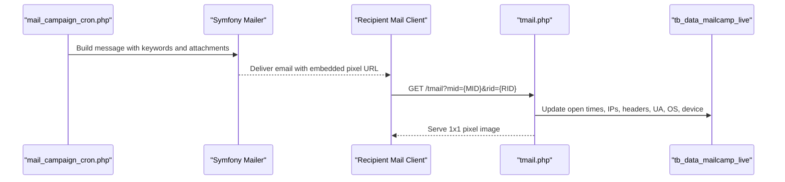
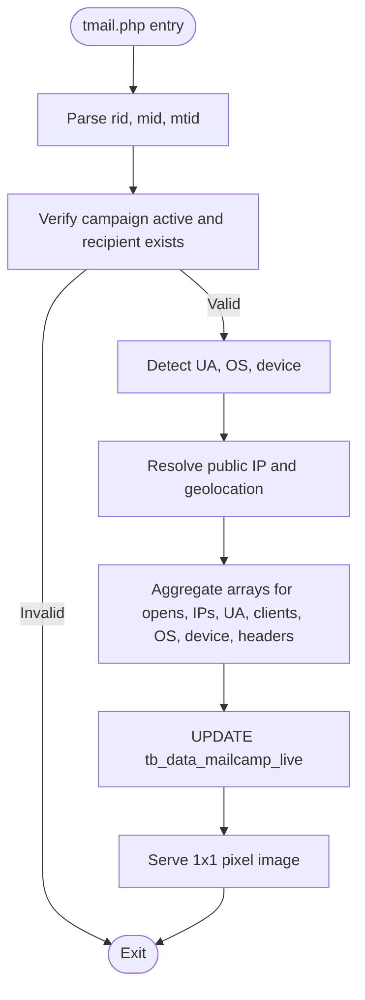
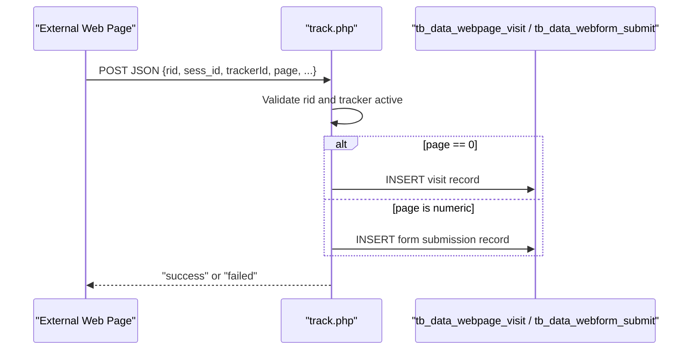
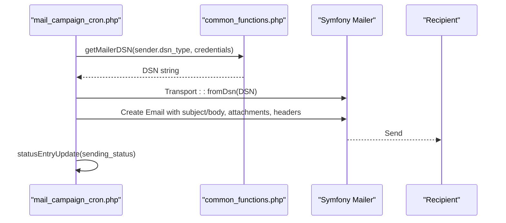
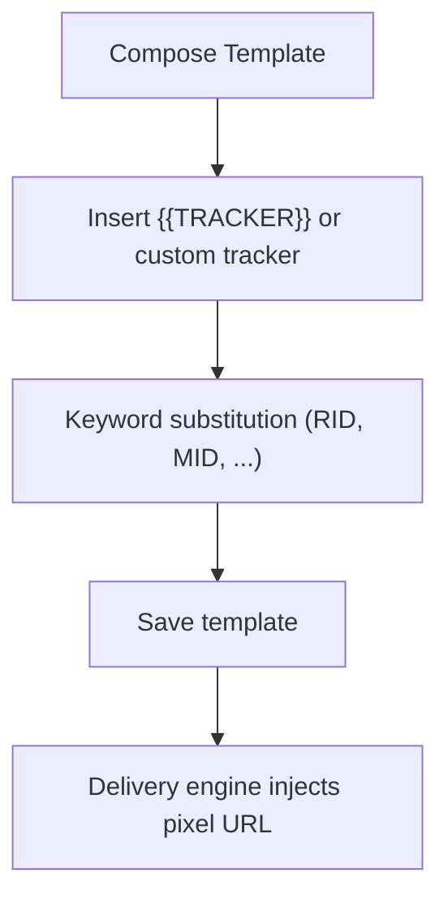
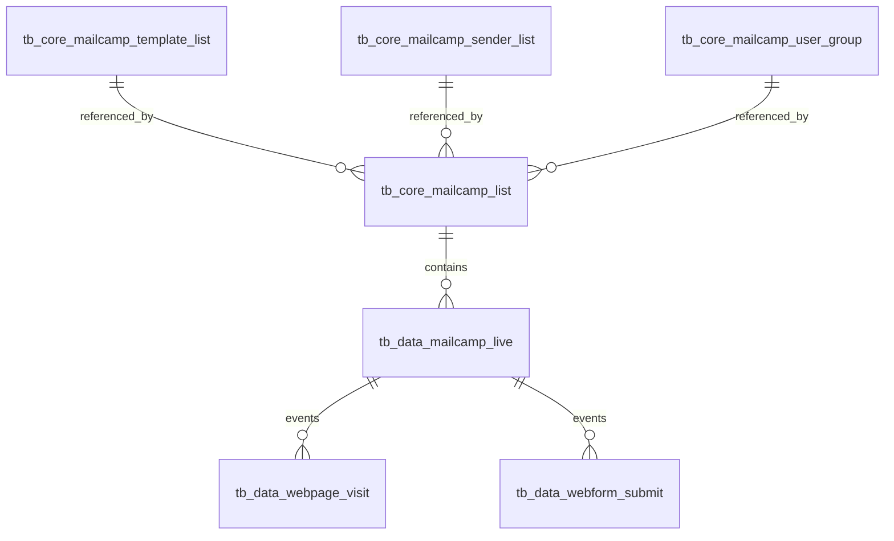
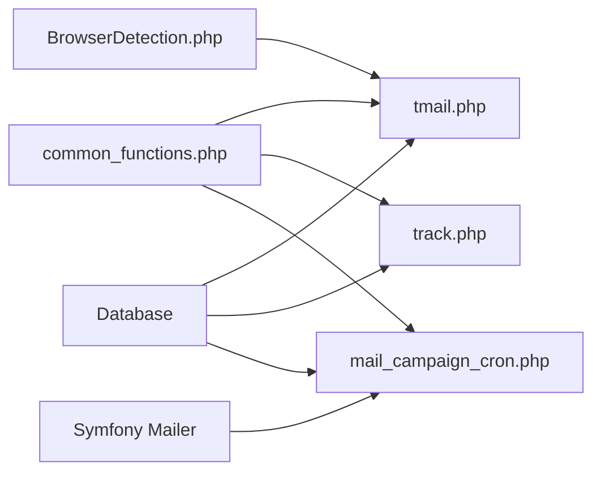

# Email Tracking API

<cite>
**Referenced Files in This Document**
- [tmail.php](file://tmail.php)
- [track.php](file://track.php)
- [mail_campaign_cron.php](file://spear/core/mail_campaign_cron.php)
- [common_functions.php](file://spear/manager/common_functions.php)
- [BrowserDetection.php](file://spear/libs/browser_detect/BrowserDetection.php)
- [web_tracker_generator_list_manager.php](file://spear/manager/web_tracker_generator_list_manager.php)
- [mail_template.js](file://spear/js/mail_template.js)
- [install_manager.php](file://install_manager.php)
</cite>

## Table of Contents
1. [Introduction](#introduction)
2. [Project Structure](#project-structure)
3. [Core Components](#core-components)
4. [Architecture Overview](#architecture-overview)
5. [Detailed Component Analysis](#detailed-component-analysis)
6. [Dependency Analysis](#dependency-analysis)
7. [Performance Considerations](#performance-considerations)
8. [Troubleshooting Guide](#troubleshooting-guide)
9. [Conclusion](#conclusion)
10. [Appendices](#appendices)

## Introduction
This document describes the email tracking system focused on the tmail.php endpoint and the associated delivery and tracking webhook interface. It explains how email campaigns are orchestrated with Symfony Mailer, how tracking pixels and web trackers collect engagement metrics, and how tracking data is stored and reported. It also covers authentication, rate limiting, error handling, and security considerations.

## Project Structure
The email tracking system spans several modules:
- Delivery orchestration and template processing with Symfony Mailer
- Email open tracking via a pixel served by tmail.php
- Web tracking via a webhook endpoint track.php
- Utilities for IP geolocation, browser detection, DSN generation, and keyword filtering
- Database schema for storing live campaign data and web tracker events

**Diagram sources**
- [mail_campaign_cron.php:1-364](file://spear/core/mail_campaign_cron.php#L1-L364)
- [common_functions.php:1-595](file://spear/manager/common_functions.php#L1-L595)
- [BrowserDetection.php:158-800](file://spear/libs/browser_detect/BrowserDetection.php#L158-L800)
- [tmail.php:1-148](file://tmail.php#L1-L148)
- [track.php:1-88](file://track.php#L1-L88)
- [web_tracker_generator_list_manager.php:1-220](file://spear/manager/web_tracker_generator_list_manager.php#L1-L220)
- [mail_template.js:135-178](file://spear/js/mail_template.js#L135-L178)
- [install_manager.php:213-583](file://install_manager.php#L213-L583)

**Section sources**
- [mail_campaign_cron.php:1-364](file://spear/core/mail_campaign_cron.php#L1-L364)
- [tmail.php:1-148](file://tmail.php#L1-L148)
- [track.php:1-88](file://track.php#L1-L88)
- [common_functions.php:145-159](file://spear/manager/common_functions.php#L145-L159)
- [install_manager.php:213-583](file://install_manager.php#L213-L583)

## Core Components
- tmail.php: Serves a 1x1 tracking pixel and records open events, including user agent, device type, OS, IP info, and headers. It validates campaign status and recipient before updating tb_data_mailcamp_live.
- track.php: Accepts webhook events from web trackers, validates presence of required identifiers, checks tracker activation, and logs page visits and form submissions to dedicated tables.
- mail_campaign_cron.php: Orchestrates email delivery using Symfony Mailer, builds messages with keyword substitution, attaches assets, supports signing/encryption, and updates campaign and per-recipient statuses.
- common_functions.php: Provides utilities for DSN generation, keyword filtering, QR/barcode embedding, IP geolocation, browser detection, and anti-flood controls.
- BrowserDetection.php: Detects browser, OS, and device type from user agents.
- web_tracker_generator_list_manager.php: Manages web trackers and exposes endpoints for validating webhook URLs and retrieving base URLs.
- mail_template.js: Integrates tracker insertion into templates and manages custom tracker images.

**Section sources**
- [tmail.php:7-108](file://tmail.php#L7-L108)
- [track.php:9-83](file://track.php#L9-L83)
- [mail_campaign_cron.php:99-294](file://spear/core/mail_campaign_cron.php#L99-L294)
- [common_functions.php:145-159](file://spear/manager/common_functions.php#L145-L159)
- [BrowserDetection.php:158-800](file://spear/libs/browser_detect/BrowserDetection.php#L158-L800)
- [web_tracker_generator_list_manager.php:14-43](file://spear/manager/web_tracker_generator_list_manager.php#L14-L43)
- [mail_template.js:135-178](file://spear/js/mail_template.js#L135-L178)

## Architecture Overview
The system integrates three primary flows:
- Email delivery pipeline with Symfony Mailer and keyword substitution
- Pixel-based open tracking via tmail.php
- Web-based behavioral tracking via track.php

**Diagram sources**
- [mail_campaign_cron.php:194-214](file://spear/core/mail_campaign_cron.php#L194-L214)
- [tmail.php:27-108](file://tmail.php#L27-L108)
- [install_manager.php:332-352](file://install_manager.php#L332-L352)

## Detailed Component Analysis

### tmail.php: Email Open Tracking Endpoint
- Request parameters:
  - rid: Recipient identifier (validated alphanumeric)
  - mid: Campaign identifier (validated alphanumeric)
  - mtid: Optional template identifier suffix used to select a custom tracker image
- Behavior:
  - Validates campaign activity and recipient existence
  - Detects browser, OS, device type, public IP, and IP geolocation
  - Aggregates arrays for open times, IPs, user agents, clients, platforms, device types, and raw headers
  - Updates tb_data_mailcamp_live atomically with all collected metadata
  - Serves a 1x1 pixel image selected from default or uploaded tracker images

**Diagram sources**
- [tmail.php:7-108](file://tmail.php#L7-L108)
- [tmail.php:110-121](file://tmail.php#L110-L121)

**Section sources**
- [tmail.php:7-108](file://tmail.php#L7-L108)
- [tmail.php:110-121](file://tmail.php#L110-L121)

### track.php: Web Tracking Webhook
- Accepts POST JSON with fields:
  - rid: Recipient identifier (validated alphanumeric)
  - sess_id: Session identifier (validated alphanumeric)
  - trackerId: Web tracker identifier (validated alphanumeric)
  - ip_info: Optional IP info payload (JSON-encoded)
  - screen_res: Optional screen resolution string
  - page: Page visit indicator or numeric page index
  - form_field_data: Optional array of form field entries
- Behavior:
  - Validates presence of rid
  - Checks tracker active state
  - Logs page visits or form submissions with device and browser metadata
  - Responds with success or failure

**Diagram sources**
- [track.php:9-83](file://track.php#L9-L83)

**Section sources**
- [track.php:9-83](file://track.php#L9-L83)

### mail_campaign_cron.php: Delivery Orchestration with Symfony Mailer
- Loads campaign, user group, template, sender, and configuration
- Generates unique rid per recipient
- Substitutes keywords (RID, MID, NAME, EMAIL, TRACKINGURL, TRACKER, BASEURL, etc.)
- Builds Symfony Email with subject/body, attachments, and custom headers
- Sends via DSN derived from sender configuration
- Records per-recipient status and handles retries and anti-flood pauses
- Adds Message-ID for reply correlation

**Diagram sources**
- [mail_campaign_cron.php:99-294](file://spear/core/mail_campaign_cron.php#L99-L294)
- [common_functions.php:145-159](file://spear/manager/common_functions.php#L145-L159)

**Section sources**
- [mail_campaign_cron.php:99-294](file://spear/core/mail_campaign_cron.php#L99-L294)
- [common_functions.php:145-159](file://spear/manager/common_functions.php#L145-L159)

### Email Template Processing and Tracker Insertion
- Templates support keyword substitution and embedded trackers
- Default tracker insertion adds an image tag referencing tmail.php with MID and RID
- Custom tracker images can be uploaded and embedded with unique mtid suffixes

**Diagram sources**
- [mail_template.js:135-178](file://spear/js/mail_template.js#L135-L178)
- [mail_campaign_cron.php:194-214](file://spear/core/mail_campaign_cron.php#L194-L214)

**Section sources**
- [mail_template.js:135-178](file://spear/js/mail_template.js#L135-L178)
- [mail_campaign_cron.php:194-214](file://spear/core/mail_campaign_cron.php#L194-L214)

### Database Storage and Reporting
- Live email campaign data stored in tb_data_mailcamp_live with fields for open timestamps, IPs, geolocation, user agents, clients, platforms, device types, and raw headers.
- Web tracking data stored in tb_data_webpage_visit and tb_data_webform_submit.
- Campaign lifecycle and configuration are stored in tb_core_mailcamp_list, tb_core_mailcamp_config, tb_core_mailcamp_template_list, tb_core_mailcamp_sender_list, and tb_core_mailcamp_user_group.

**Diagram sources**
- [install_manager.php:232-282](file://install_manager.php#L232-L282)
- [install_manager.php:332-352](file://install_manager.php#L332-L352)
- [install_manager.php:529-532](file://install_manager.php#L529-L532)

**Section sources**
- [install_manager.php:232-282](file://install_manager.php#L232-L282)
- [install_manager.php:332-352](file://install_manager.php#L332-L352)
- [install_manager.php:529-532](file://install_manager.php#L529-L532)

## Dependency Analysis
- tmail.php depends on:
  - common_functions.php for filtering, IP geolocation, browser detection, and public IP extraction
  - BrowserDetection.php for UA parsing
  - Database connectivity for campaign and recipient validation and updates
- track.php depends on:
  - common_functions.php for filtering and IP geolocation
  - Database connectivity for tracker activation and event logging
- mail_campaign_cron.php depends on:
  - common_functions.php for DSN generation, keyword filtering, QR/barcode embedding, and anti-flood controls
  - Symfony Mailer for SMTP/DSN transport and message sending
  - Database connectivity for campaign, template, sender, and user group retrieval

**Diagram sources**
- [tmail.php:1-10](file://tmail.php#L1-L10)
- [track.php:1-6](file://track.php#L1-L6)
- [mail_campaign_cron.php:1-14](file://spear/core/mail_campaign_cron.php#L1-L14)
- [common_functions.php:1-7](file://spear/manager/common_functions.php#L1-L7)

**Section sources**
- [tmail.php:1-10](file://tmail.php#L1-L10)
- [track.php:1-6](file://track.php#L1-L6)
- [mail_campaign_cron.php:1-14](file://spear/core/mail_campaign_cron.php#L1-L14)
- [common_functions.php:1-7](file://spear/manager/common_functions.php#L1-L7)

## Performance Considerations
- Anti-flood control: mail_campaign_cron.php pauses transport periodically based on configuration limits and intervals to reduce provider throttling risk.
- Per-message delays: randomized sleep between sends to smooth traffic.
- Database writes: tmail.php aggregates arrays and performs a single UPDATE; track.php inserts records per event.
- IP geolocation: External API calls are cached via database lookups to avoid repeated network calls.

[No sources needed since this section provides general guidance]

## Troubleshooting Guide
- Authentication and access:
  - Access to web tracker endpoints can be validated using a simple verification payload sent to the webhook URL’s track endpoint.
- Delivery failures:
  - mail_campaign_cron.php updates per-recipient status and captures exceptions during send attempts, retrying up to configured limits.
- Tracking not recorded:
  - Ensure tmail.php receives rid and mid parameters and that the campaign is active.
  - Confirm the pixel URL in the email matches the base URL and that recipients’ clients load remote content.
- Webhook validation:
  - Use the built-in validator to confirm the webhook URL responds to the verification request.

**Section sources**
- [web_tracker_generator_list_manager.php:852-879](file://spear/manager/web_tracker_generator_list_manager.php#L852-L879)
- [mail_campaign_cron.php:266-277](file://spear/core/mail_campaign_cron.php#L266-L277)
- [tmail.php:27-108](file://tmail.php#L27-L108)

## Conclusion
The email tracking system integrates Symfony Mailer for robust delivery, a pixel-based open tracker for engagement insights, and a webhook-driven behavioral tracking mechanism. Data is persisted in structured tables enabling campaign analytics and compliance-aware logging. Proper configuration of DSNs, rate limits, and validation ensures reliable operation and scalability.

[No sources needed since this section summarizes without analyzing specific files]

## Appendices

### API Definitions

- tmail.php (Open Tracking)
  - Method: GET
  - Path: /tmail
  - Query parameters:
    - rid (required): Recipient identifier
    - mid (required): Campaign identifier
    - mtid (optional): Template identifier suffix for custom tracker image selection
  - Response: 1x1 pixel image; side effects include updating tb_data_mailcamp_live with open metadata

- track.php (Web Tracking Webhook)
  - Method: POST
  - Path: /track
  - Content-Type: application/json
  - Body fields:
    - rid (required): Recipient identifier
    - sess_id (optional): Session identifier
    - trackerId (required): Web tracker identifier
    - ip_info (optional): JSON-encoded IP info
    - screen_res (optional): Screen resolution string
    - page (required): 0 for page visit, numeric for form submission
    - form_field_data (optional): Array of form field entries
  - Response: "success" or "failed"

- Validation Endpoint (Web Tracker Generator)
  - Method: POST
  - Path: manager/web_tracker_generator_list_manager?action_type=get_SP_base_URL
  - Response: JSON containing base URL for constructing tracker links

**Section sources**
- [tmail.php:7-108](file://tmail.php#L7-L108)
- [track.php:9-83](file://track.php#L9-L83)
- [web_tracker_generator_list_manager.php:14-43](file://spear/manager/web_tracker_generator_list_manager.php#L14-L43)

### Security Considerations
- Email validation and sanitization:
  - Input filtering for identifiers (rid, mid, trackerId) prevents injection.
  - Email addresses are validated before sending; invalid addresses are logged as errors.
- Spam prevention:
  - Keyword substitution and Message-ID standardization help with deliverability.
  - Custom headers and DSN configuration allow provider-specific settings.
- Tracking data privacy:
  - IP geolocation is resolved via external APIs; consider local caching and retention policies.
  - Headers and device metadata are stored; ensure compliance with applicable regulations.

**Section sources**
- [common_functions.php:447-469](file://spear/manager/common_functions.php#L447-L469)
- [mail_campaign_cron.php:215-225](file://spear/core/mail_campaign_cron.php#L215-L225)
- [tmail.php:94-103](file://tmail.php#L94-L103)

### Rate Limiting and Anti-Flood Controls
- mail_campaign_cron.php enforces:
  - Randomized delays between sends
  - Periodic transport stops and pauses based on configured limits

**Section sources**
- [mail_campaign_cron.php:283-287](file://spear/core/mail_campaign_cron.php#L283-L287)