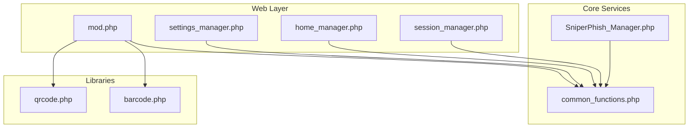
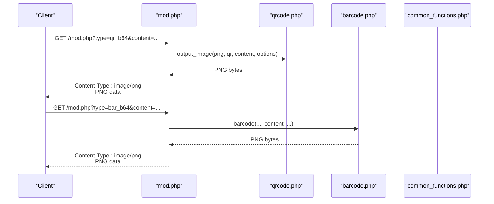
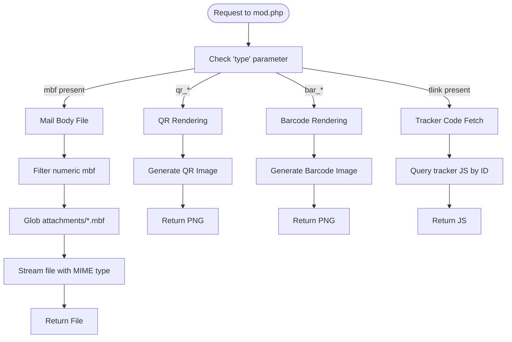
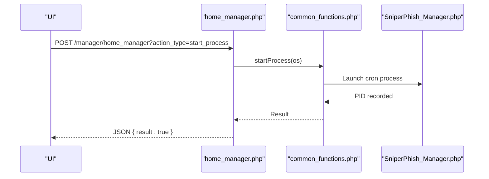
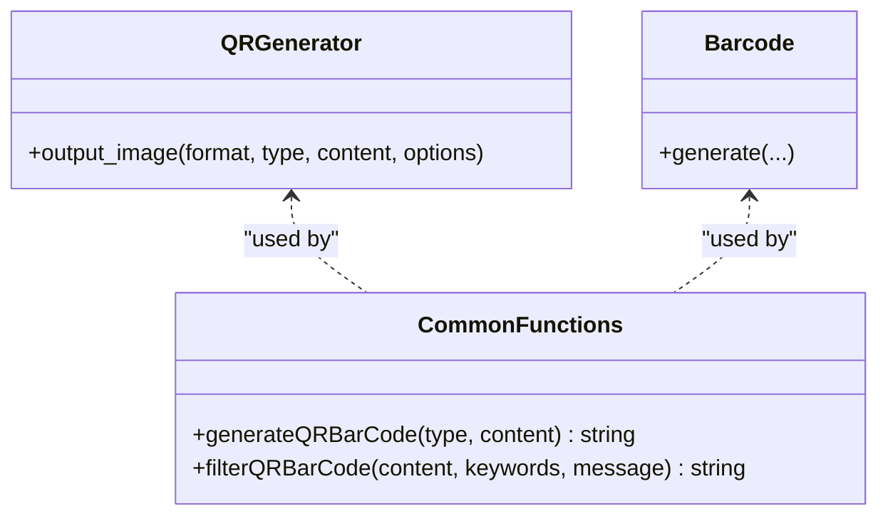
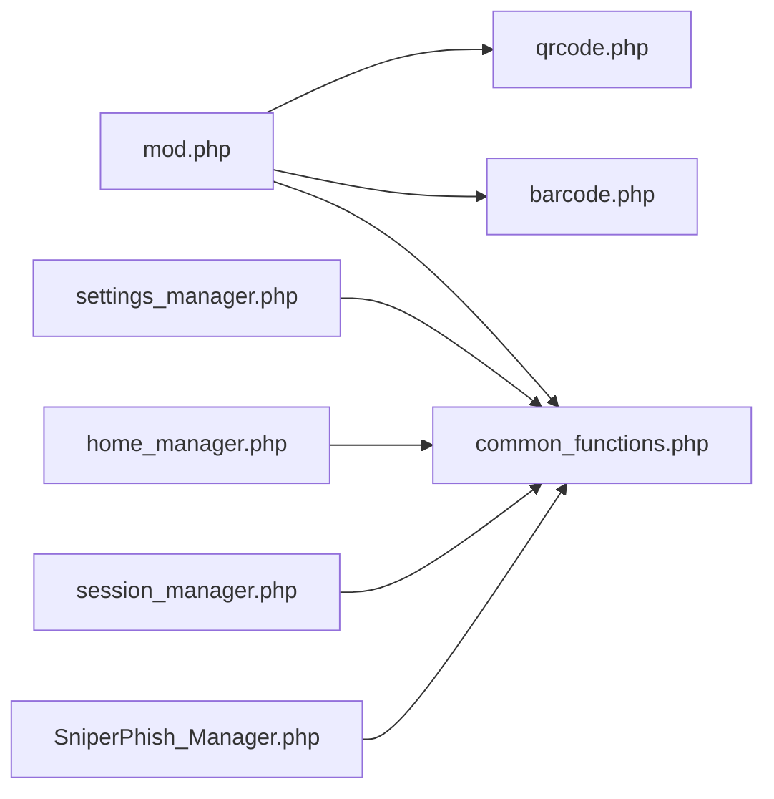

# Module Management API

<cite>
**Referenced Files in This Document**
- [mod.php](file://mod.php)
- [SniperPhish_Manager.php](file://spear/core/SniperPhish_Manager.php)
- [common_functions.php](file://spear/manager/common_functions.php)
- [settings_manager.php](file://spear/manager/settings_manager.php)
- [home_manager.php](file://spear/manager/home_manager.php)
- [session_manager.php](file://spear/manager/session_manager.php)
- [qrcode.php](file://spear/libs/qr_barcode/qrcode.php)
- [barcode.php](file://spear/libs/qr_barcode/barcode.php)
</cite>

## Table of Contents
1. [Introduction](#introduction)
2. [Project Structure](#project-structure)
3. [Core Components](#core-components)
4. [Architecture Overview](#architecture-overview)
5. [Detailed Component Analysis](#detailed-component-analysis)
6. [Dependency Analysis](#dependency-analysis)
7. [Performance Considerations](#performance-considerations)
8. [Troubleshooting Guide](#troubleshooting-guide)
9. [Conclusion](#conclusion)
10. [Appendices](#appendices)

## Introduction
This document describes the module management system centered on the mod.php endpoint and the broader manager architecture used for dynamic module loading and management in the application. It explains module discovery and initialization, registration, dependency resolution, and runtime configuration. It also documents the integration with the manager pattern, component loading mechanisms, and the API endpoints for module status checking, configuration updates, and feature toggles. The document outlines the relationship between modules and core system components, including plugin architecture and extensibility patterns, and provides examples of extending functionality, custom feature integration, and system customization workflows. Security considerations for module validation, sandboxing mechanisms, and access control for administrative operations are addressed, along with guidelines for developing custom modules and integrating third-party extensions.

## Project Structure
The module management system spans several manager endpoints and core services:
- mod.php: Dynamic QR/Barcode generation and tracker code retrieval endpoints.
- Manager pattern endpoints: settings_manager.php, home_manager.php, session_manager.php.
- Core services: common_functions.php (shared utilities), SniperPhish_Manager.php (cron and process lifecycle).
- QR/Barcode libraries: qrcode.php, barcode.php.

**Diagram sources**
- [mod.php:1-73](file://mod.php#L1-L73)
- [settings_manager.php:1-474](file://spear/manager/settings_manager.php#L1-L474)
- [home_manager.php:1-120](file://spear/manager/home_manager.php#L1-L120)
- [session_manager.php:1-244](file://spear/manager/session_manager.php#L1-L244)
- [common_functions.php:1-595](file://spear/manager/common_functions.php#L1-L595)
- [SniperPhish_Manager.php:1-46](file://spear/core/SniperPhish_Manager.php#L1-L46)
- [qrcode.php](file://spear/libs/qr_barcode/qrcode.php)
- [barcode.php](file://spear/libs/qr_barcode/barcode.php)

**Section sources**
- [mod.php:1-73](file://mod.php#L1-L73)
- [SniperPhish_Manager.php:1-46](file://spear/core/SniperPhish_Manager.php#L1-L46)
- [common_functions.php:1-595](file://spear/manager/common_functions.php#L1-L595)
- [settings_manager.php:1-474](file://spear/manager/settings_manager.php#L1-L474)
- [home_manager.php:1-120](file://spear/manager/home_manager.php#L1-L120)
- [session_manager.php:1-244](file://spear/manager/session_manager.php#L1-L244)

## Core Components
- mod.php: Provides dynamic QR and Barcode image generation, tracker code retrieval, and mail body file serving. It routes requests based on query parameters and invokes internal functions to render content.
- Manager endpoints:
  - settings_manager.php: Handles user management, logs, timestamps, and store data retrieval.
  - home_manager.php: Manages dashboard graphs and process lifecycle (start/check).
  - session_manager.php: Validates sessions, manages public access tokens, and controls dashboard access.
- Core services:
  - common_functions.php: Shared utilities for OS detection, process lifecycle, mailer configuration, QR/Barcode generation, IP and client parsing, logging, and data formatting.
- Core process:
  - SniperPhish_Manager.php: Single-instance cron controller that schedules and executes campaigns.

Key responsibilities:
- Dynamic rendering and content delivery via mod.php.
- Administrative configuration and operational control via managers.
- Shared utilities and infrastructure via common_functions.php.
- Campaign scheduling and execution via SniperPhish_Manager.php.

**Section sources**
- [mod.php:7-73](file://mod.php#L7-L73)
- [settings_manager.php:13-50](file://spear/manager/settings_manager.php#L13-L50)
- [home_manager.php:9-21](file://spear/manager/home_manager.php#L9-L21)
- [session_manager.php:35-44](file://spear/manager/session_manager.php#L35-L44)
- [common_functions.php:23-92](file://spear/manager/common_functions.php#L23-L92)
- [SniperPhish_Manager.php:10-28](file://spear/core/SniperPhish_Manager.php#L10-L28)

## Architecture Overview
The module management architecture follows a manager pattern with modular endpoints and shared utilities. Requests flow from the web layer to manager endpoints, which delegate to common functions for cross-cutting concerns. The mod.php endpoint acts as a specialized renderer for QR/Barcode and tracker assets.

**Diagram sources**
- [mod.php:29-43](file://mod.php#L29-L43)
- [qrcode.php](file://spear/libs/qr_barcode/qrcode.php)
- [barcode.php](file://spear/libs/qr_barcode/barcode.php)
- [common_functions.php:232-244](file://spear/manager/common_functions.php#L232-L244)

## Detailed Component Analysis

### mod.php: Dynamic Module Rendering
Purpose:
- Serve QR and Barcode images.
- Retrieve tracker JavaScript code by ID.
- Stream mail body files by ID.

Behavior:
- Reads query parameters to select rendering mode.
- Uses barcode generator for QR/Barcode outputs.
- Executes database queries to fetch tracker code.
- Filters numeric identifiers for safe file access.

Endpoints:
- QR rendering:
  - Type: qr_ir, qr_b64, qr_att
  - Content: query parameter content
  - Output: PNG image or embedded attachment
- Barcode rendering:
  - Type: bar_ir, bar_b64, bar_att
  - Content: query parameter content
  - Output: PNG image or embedded attachment
- Tracker code:
  - tlink: tracker identifier
  - Output: application/javascript
- Mail body file:
  - mbf: numeric file identifier
  - Output: MIME type based on file

Security considerations:
- Numeric filtering for mbf to prevent path traversal.
- Strict MIME type checks for streaming media.
- No user-controlled SQL injection vectors observed in the targeted code paths.

Operational flow:

**Diagram sources**
- [mod.php:7-73](file://mod.php#L7-L73)
- [common_functions.php:447-458](file://spear/manager/common_functions.php#L447-L458)

**Section sources**
- [mod.php:7-73](file://mod.php#L7-L73)

### Manager Pattern Integration
Managers encapsulate domain-specific operations and coordinate with shared utilities:
- settings_manager.php: User CRUD, logs, timestamps, and store data retrieval.
- home_manager.php: Dashboard graphs and process lifecycle.
- session_manager.php: Session validation, public access control, and re-login.

**Diagram sources**
- [home_manager.php:105-119](file://spear/manager/home_manager.php#L105-L119)
- [common_functions.php:78-85](file://spear/manager/common_functions.php#L78-L85)
- [SniperPhish_Manager.php:18-22](file://spear/core/SniperPhish_Manager.php#L18-L22)

**Section sources**
- [settings_manager.php:13-50](file://spear/manager/settings_manager.php#L13-L50)
- [home_manager.php:9-21](file://spear/manager/home_manager.php#L9-L21)
- [session_manager.php:35-44](file://spear/manager/session_manager.php#L35-L44)
- [common_functions.php:37-92](file://spear/manager/common_functions.php#L37-L92)
- [SniperPhish_Manager.php:10-28](file://spear/core/SniperPhish_Manager.php#L10-L28)

### QR/Barcode Generation Utilities
The system integrates QR and Barcode generation through dedicated libraries and shared helpers:
- qrcode.php: Generates QR images.
- barcode.php: Generates barcode images.
- common_functions.php: Centralized generation and embedding logic.

**Diagram sources**
- [qrcode.php](file://spear/libs/qr_barcode/qrcode.php)
- [barcode.php](file://spear/libs/qr_barcode/barcode.php)
- [common_functions.php:232-244](file://spear/manager/common_functions.php#L232-L244)

**Section sources**
- [common_functions.php:206-244](file://spear/manager/common_functions.php#L206-L244)

### API Endpoints and Workflows

#### Status and Lifecycle Management
- Endpoint: POST /manager/home_manager
- Actions:
  - get_home_graphs_data: Returns campaign and tracker metrics with timezone conversions.
  - check_process: Checks if the SniperPhish process is running.
  - start_process: Starts the SniperPhish process if not running.

Example usage:
- Start process: POST with action_type=start_process.
- Check process: POST with action_type=check_process.
- Graph data: POST with action_type=get_home_graphs_data.

**Section sources**
- [home_manager.php:12-87](file://spear/manager/home_manager.php#L12-L87)

#### Configuration and Feature Toggles
- Endpoint: POST /manager/settings_manager
- Actions:
  - get_user_list, add_account, modify_account, delete_account.
  - get_current_user.
  - modify_timestamp_settings, get_timestamp_settings, get_date_time_display.
  - modify_SP_base_URL, clear_junk_SP_data.
  - get_logs, download_logs, clear_log.
  - get_store_list (mail_sender, mail_template).

Example usage:
- Modify timestamp settings: POST with action_type=modify_timestamp_settings and time_zone/time_format.
- Get logs: POST with action_type=get_logs and pagination/search parameters.

**Section sources**
- [settings_manager.php:16-49](file://spear/manager/settings_manager.php#L16-L49)

#### Session and Access Control
- Endpoint: POST /manager/session_manager
- Actions:
  - manage_dashboard_access: Enable/disable public dashboard access with tk_id and campaign/tracker IDs.
  - get_access_info: Retrieve current public access state.
  - re_login: Re-authenticate with credentials.
  - terminate_session: End current session.

Example usage:
- Manage access: POST with action_type=manage_dashboard_access and ctrl_val.
- Get access info: POST with action_type=get_access_info.

**Section sources**
- [session_manager.php:117-195](file://spear/manager/session_manager.php#L117-L195)

#### Dynamic Module Rendering (mod.php)
- Endpoint: GET /mod.php
- Types:
  - qr_ir, qr_b64, qr_att: QR image rendering.
  - bar_ir, bar_b64, bar_att: Barcode image rendering.
- Parameters:
  - content: data to encode.
  - tlink: tracker identifier for JavaScript retrieval.
  - mbf: numeric mail body file identifier.

Example usage:
- QR image: GET /mod.php?type=qr_b64&content=...
- Tracker code: GET /mod.php?tlink=...
- Mail body file: GET /mod.php?mbf=...

**Section sources**
- [mod.php:7-73](file://mod.php#L7-L73)

## Dependency Analysis
The system exhibits a layered dependency model:
- Web endpoints depend on manager files.
- Managers depend on common_functions.php for shared utilities.
- mod.php depends on QR/Barcode libraries and common_functions.php.
- Core process (SniperPhish_Manager.php) depends on common_functions.php for process lifecycle.

**Diagram sources**
- [mod.php:1-6](file://mod.php#L1-L6)
- [settings_manager.php:1-5](file://spear/manager/settings_manager.php#L1-L5)
- [home_manager.php:1-5](file://spear/manager/home_manager.php#L1-L5)
- [session_manager.php:1-12](file://spear/manager/session_manager.php#L1-L12)
- [common_functions.php:1-10](file://spear/manager/common_functions.php#L1-L10)
- [SniperPhish_Manager.php:1-6](file://spear/core/SniperPhish_Manager.php#L1-L6)

**Section sources**
- [mod.php:1-6](file://mod.php#L1-L6)
- [common_functions.php:1-10](file://spear/manager/common_functions.php#L1-L10)
- [SniperPhish_Manager.php:1-6](file://spear/core/SniperPhish_Manager.php#L1-L6)

## Performance Considerations
- QR/Barcode generation: Buffered output avoids blocking and reduces overhead.
- Process lifecycle: Single-instance enforcement prevents resource contention.
- Database queries: Minimal, targeted queries for tracker code and logs.
- Logging: Efficient insertion with minimal overhead.

[No sources needed since this section provides general guidance]

## Troubleshooting Guide
Common issues and resolutions:
- Access denied or session invalid:
  - Verify session validity via session_manager.php and ensure proper login.
- Process not running:
  - Use home_manager.php to check and start the SniperPhish process.
- QR/Barcode rendering failures:
  - Confirm type and content parameters; ensure content encoding is supported.
- Mail body file streaming:
  - Validate numeric mbf and MIME type compatibility.

**Section sources**
- [session_manager.php:35-44](file://spear/manager/session_manager.php#L35-L44)
- [home_manager.php:89-119](file://spear/manager/home_manager.php#L89-L119)
- [mod.php:29-73](file://mod.php#L29-L73)

## Conclusion
The module management system leverages a clean manager pattern with shared utilities to provide dynamic rendering, configuration, and lifecycle control. The mod.php endpoint serves as a specialized renderer for QR/Barcode and tracker assets, while manager endpoints handle administrative tasks and operational visibility. The architecture supports extensibility through modular endpoints and shared utilities, with built-in safeguards for session control and process management.

[No sources needed since this section summarizes without analyzing specific files]

## Appendices

### Security Considerations
- Input validation:
  - Numeric filtering for mbf to mitigate path traversal.
  - Strict MIME type checks for streamed files.
- Access control:
  - Session validation for all manager endpoints.
  - Public access control via tk_id and campaign/tracker IDs.
- Process isolation:
  - Single-instance enforcement for cron to prevent duplication.

**Section sources**
- [common_functions.php:447-458](file://spear/manager/common_functions.php#L447-L458)
- [session_manager.php:35-44](file://spear/manager/session_manager.php#L35-L44)
- [SniperPhish_Manager.php:10-15](file://spear/core/SniperPhish_Manager.php#L10-L15)

### Guidelines for Developing Custom Modules
- Follow the manager pattern:
  - Create a new manager endpoint under spear/manager/ with action routing.
  - Use common_functions.php for shared utilities.
- Integrate with mod.php:
  - Add new types to mod.php for dynamic rendering if applicable.
- Maintain security:
  - Validate and sanitize inputs.
  - Enforce session checks and access control.
- Extensibility:
  - Use database-backed configuration for feature toggles.
  - Provide logging for auditability.

[No sources needed since this section provides general guidance]