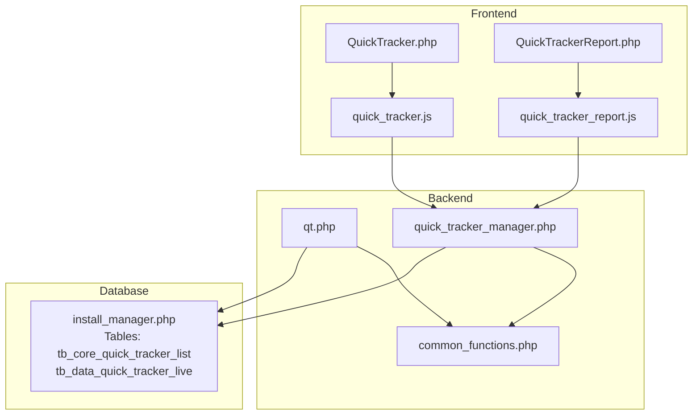
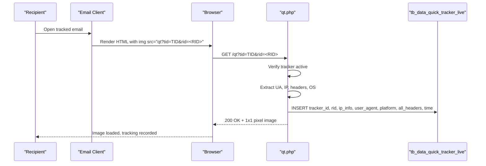
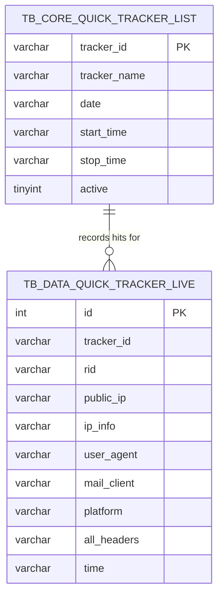
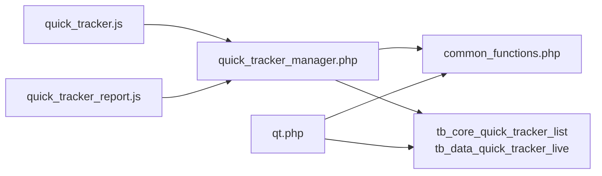

# Quick Tracker API

<cite>
**Referenced Files in This Document**
- [qt.php](file://qt.php)
- [quick_tracker_manager.php](file://spear/manager/quick_tracker_manager.php)
- [quick_tracker.js](file://spear/js/quick_tracker.js)
- [quick_tracker_report.js](file://spear/js/quick_tracker_report.js)
- [QuickTracker.php](file://spear/QuickTracker.php)
- [QuickTrackerReport.php](file://spear/QuickTrackerReport.php)
- [common_functions.php](file://spear/manager/common_functions.php)
- [install_manager.php](file://install_manager.php)
</cite>

## Table of Contents
1. [Introduction](#introduction)
2. [Project Structure](#project-structure)
3. [Core Components](#core-components)
4. [Architecture Overview](#architecture-overview)
5. [Detailed Component Analysis](#detailed-component-analysis)
6. [Dependency Analysis](#dependency-analysis)
7. [Performance Considerations](#performance-considerations)
8. [Troubleshooting Guide](#troubleshooting-guide)
9. [Conclusion](#conclusion)
10. [Appendices](#appendices)

## Introduction
This document describes the Quick Tracker API used to rapidly deploy single-use tracking links for immediate threat assessment and incident response. The system enables:
- Rapid creation of temporary tracking campaigns
- Single-use tracking pixels embedded in emails or websites
- Real-time data collection and live monitoring
- Lightweight reporting and export capabilities
- Integration with the broader web/email tracking ecosystem

The primary endpoint for tracking is qt.php, which records hits and serves a tracking pixel. The management layer exposes CRUD and reporting APIs via quick_tracker_manager.php, while the frontend integrates via quick_tracker.js and quick_tracker_report.js.

## Project Structure
The Quick Tracker feature spans:
- Frontend pages: QuickTracker.php and QuickTrackerReport.php
- Client-side scripts: quick_tracker.js and quick_tracker_report.js
- Backend endpoint: qt.php
- Management API: quick_tracker_manager.php
- Shared utilities: common_functions.php
- Database schema: install_manager.php

**Diagram sources**
- [QuickTracker.php:1-199](file://spear/QuickTracker.php#L1-L199)
- [QuickTrackerReport.php:1-268](file://spear/QuickTrackerReport.php#L1-L268)
- [quick_tracker.js:1-208](file://spear/js/quick_tracker.js#L1-L208)
- [quick_tracker_report.js:1-196](file://spear/js/quick_tracker_report.js#L1-L196)
- [qt.php:1-63](file://qt.php#L1-L63)
- [quick_tracker_manager.php:1-298](file://spear/manager/quick_tracker_manager.php#L1-L298)
- [common_functions.php:1-595](file://spear/manager/common_functions.php#L1-L595)
- [install_manager.php:298-371](file://install_manager.php#L298-L371)

**Section sources**
- [QuickTracker.php:1-199](file://spear/QuickTracker.php#L1-L199)
- [QuickTrackerReport.php:1-268](file://spear/QuickTrackerReport.php#L1-L268)
- [quick_tracker.js:1-208](file://spear/js/quick_tracker.js#L1-L208)
- [quick_tracker_report.js:1-196](file://spear/js/quick_tracker_report.js#L1-L196)
- [qt.php:1-63](file://qt.php#L1-L63)
- [quick_tracker_manager.php:1-298](file://spear/manager/quick_tracker_manager.php#L1-L298)
- [common_functions.php:1-595](file://spear/manager/common_functions.php#L1-L595)
- [install_manager.php:298-371](file://install_manager.php#L298-L371)

## Core Components
- qt.php: Single-use tracking endpoint that validates a tracker, collects visitor metadata, and writes to the live tracking table. It returns a small tracking pixel image.
- quick_tracker_manager.php: JSON API for managing trackers (create/update/delete), toggling activity, retrieving lists, fetching live data, and exporting reports.
- quick_tracker.js: Frontend logic to generate tracking HTML, manage tracker lifecycle, and control tracking status.
- quick_tracker_report.js: Live monitoring and export pipeline for tracker hits.
- common_functions.php: Shared utilities for IP detection, browser identification, filtering, and time formatting.
- Database schema: Two tables define the core data model for quick trackers and live hits.

Key responsibilities:
- Endpoint validation and hit recording
- Tracker lifecycle management
- Real-time data retrieval and export
- IP geolocation and device/browser detection

**Section sources**
- [qt.php:1-63](file://qt.php#L1-L63)
- [quick_tracker_manager.php:1-298](file://spear/manager/quick_tracker_manager.php#L1-L298)
- [quick_tracker.js:1-208](file://spear/js/quick_tracker.js#L1-L208)
- [quick_tracker_report.js:1-196](file://spear/js/quick_tracker_report.js#L1-L196)
- [common_functions.php:256-331](file://spear/manager/common_functions.php#L256-L331)
- [install_manager.php:298-371](file://install_manager.php#L298-L371)

## Architecture Overview
The Quick Tracker API follows a thin-client architecture:
- Frontend generates a tracking HTML snippet embedding qt.php with tracker identifiers.
- On each visit, qt.php verifies the tracker’s active status, extracts metadata, and inserts a record.
- Management API provides CRUD and reporting operations backed by MySQL tables.

**Diagram sources**
- [qt.php:7-42](file://qt.php#L7-L42)
- [common_functions.php:256-331](file://spear/manager/common_functions.php#L256-L331)
- [install_manager.php:358-371](file://install_manager.php#L358-L371)

## Detailed Component Analysis

### qt.php: Single-Use Tracking Endpoint
Purpose:
- Validate tracker activity
- Collect visitor metadata (IP, headers, OS, browser)
- Insert a live hit record
- Serve a small tracking pixel

Behavior:
- Reads and sanitizes tracker and recipient identifiers from query parameters.
- Verifies tracker is active against the core tracker list.
- Detects browser/platform and geolocates IP if needed.
- Inserts a row into the live tracking table with collected data.
- Returns a 1x1 pixel image with cache-control headers.

Security and validation:
- Input filtered to alphanumeric characters for identifiers.
- Active status checked before logging.

Response:
- HTTP 200 with image payload and cache-control headers.

Operational notes:
- Uses millisecond-resolution timestamps.
- Stores raw HTTP headers as a string for later inspection.

**Section sources**
- [qt.php:1-63](file://qt.php#L1-L63)
- [common_functions.php:256-331](file://spear/manager/common_functions.php#L256-L331)
- [install_manager.php:358-371](file://install_manager.php#L358-L371)

### quick_tracker_manager.php: Management API
Endpoints (action_type):
- save_quick_tracker: Create or update a tracker definition.
- get_quick_tracker_list: List all trackers with status and timing.
- delete_quick_tracker: Remove a tracker and associated data.
- delete_quick_tracker_data: Clear only live hit data for a tracker.
- pause_stop_quick_tracker_tracking: Toggle active state and record start/stop times.
- get_quick_tracker_from_id: Retrieve a tracker definition.
- get_quick_tracker_data: Paginated, searchable, sortable live data for reporting.
- download_report: Export live data to CSV/PDF/HTML.

Data model:
- Core tracker list: tracker_id, tracker_name, dates, start/stop times, active flag.
- Live hits: id, tracker_id, rid, ip_info, user_agent, mail_client, platform, all_headers, time.

Response formats:
- JSON for management operations.
- Binary stream for exports.

Operational notes:
- Uses prepared statements to prevent SQL injection.
- Supports DataTables server-side processing for efficient reporting.

**Section sources**
- [quick_tracker_manager.php:1-298](file://spear/manager/quick_tracker_manager.php#L1-L298)
- [install_manager.php:298-371](file://install_manager.php#L298-L371)

### quick_tracker.js: Frontend Integration
Responsibilities:
- Generates tracking HTML snippet with placeholders for tracker ID and recipient ID.
- Saves tracker definitions via the management API.
- Controls tracker activation/deactivation.
- Deletes trackers and clears hit data.

Integration pattern:
- Constructs img tag pointing to qt.php with tid and rid parameters.
- Calls quick_tracker_manager endpoints to manage lifecycle.

**Section sources**
- [quick_tracker.js:1-208](file://spear/js/quick_tracker.js#L1-L208)

### quick_tracker_report.js: Live Monitoring and Export
Responsibilities:
- Lists trackers and allows selection.
- Loads live hits via server-side DataTables processing.
- Allows selecting columns and exporting to CSV/PDF/HTML.

Integration pattern:
- Sends action_type=get_quick_tracker_data with pagination and sorting parameters.
- Uses XMLHttpRequest for binary export downloads.

**Section sources**
- [quick_tracker_report.js:1-196](file://spear/js/quick_tracker_report.js#L1-L196)

### Database Schema
Core tables:
- tb_core_quick_tracker_list: Stores tracker definitions and status.
- tb_data_quick_tracker_live: Stores live hits for each tracker.

**Diagram sources**
- [install_manager.php:298-371](file://install_manager.php#L298-L371)

**Section sources**
- [install_manager.php:298-371](file://install_manager.php#L298-L371)

## Dependency Analysis
- qt.php depends on common_functions for IP detection, browser identification, and request header extraction.
- quick_tracker_manager.php depends on common_functions for time formatting, IP geolocation fallback, and shared utilities.
- Frontend scripts depend on the management API for all operations.

**Diagram sources**
- [quick_tracker.js:1-208](file://spear/js/quick_tracker.js#L1-L208)
- [quick_tracker_report.js:1-196](file://spear/js/quick_tracker_report.js#L1-L196)
- [quick_tracker_manager.php:1-298](file://spear/manager/quick_tracker_manager.php#L1-L298)
- [common_functions.php:1-595](file://spear/manager/common_functions.php#L1-L595)
- [qt.php:1-63](file://qt.php#L1-L63)
- [install_manager.php:298-371](file://install_manager.php#L298-L371)

**Section sources**
- [quick_tracker.js:1-208](file://spear/js/quick_tracker.js#L1-L208)
- [quick_tracker_report.js:1-196](file://spear/js/quick_tracker_report.js#L1-L196)
- [quick_tracker_manager.php:1-298](file://spear/manager/quick_tracker_manager.php#L1-L298)
- [common_functions.php:1-595](file://spear/manager/common_functions.php#L1-L595)
- [qt.php:1-63](file://qt.php#L1-L63)
- [install_manager.php:298-371](file://install_manager.php#L298-L371)

## Performance Considerations
- Minimal overhead: qt.php performs a single SELECT and INSERT per hit.
- Prepared statements: All database operations use prepared statements to reduce parsing overhead and mitigate injection risks.
- Efficient reporting: quick_tracker_manager.php uses server-side DataTables processing to limit payload sizes.
- IP geolocation: Falls back to external API only when local history lacks IP info, minimizing repeated network calls.

[No sources needed since this section provides general guidance]

## Troubleshooting Guide
Common issues and resolutions:
- Tracker not active: Ensure the tracker is active via the management UI/API before expecting hits.
- No hits recorded: Confirm the img src points to qt.php with correct tid and rid parameters.
- IP info missing: The system attempts to reuse existing IP info; if absent, it falls back to external geolocation service.
- Export fails: Verify the tracker has data and the selected columns are valid.

Operational checks:
- Verify database connectivity and table existence.
- Confirm time zone and time formatting settings are correct for accurate timestamps.
- Ensure the web server allows requests to qt.php and that .htaccess rules permit clean URLs.

**Section sources**
- [quick_tracker_manager.php:137-213](file://spear/manager/quick_tracker_manager.php#L137-L213)
- [common_functions.php:256-331](file://spear/manager/common_functions.php#L256-L331)
- [qt.php:20-42](file://qt.php#L20-L42)

## Conclusion
The Quick Tracker API provides a streamlined mechanism for deploying single-use tracking links with minimal setup. It integrates cleanly with the broader web/email tracking system, offering real-time monitoring and flexible export options. By combining a lightweight endpoint with robust management APIs and frontend tooling, it supports rapid incident response and targeted assessments.

[No sources needed since this section summarizes without analyzing specific files]

## Appendices

### API Reference: qt.php
- Method: GET
- URL: /qt?tid=TID&rid=<RID>
- Validation: TID must exist and be active in tb_core_quick_tracker_list.
- Behavior: Records a hit with IP, headers, OS, browser, and timestamp; returns a 1x1 pixel image.
- Security: Identifiers sanitized to alphanumeric.

**Section sources**
- [qt.php:7-42](file://qt.php#L7-L42)

### API Reference: quick_tracker_manager.php
- Method: POST
- Content-Type: application/json
- action_type values:
  - save_quick_tracker: { tracker_id, quick_tracker_name }
  - get_quick_tracker_list: {}
  - delete_quick_tracker: { tracker_id }
  - delete_quick_tracker_data: { tracker_id }
  - pause_stop_quick_tracker_tracking: { tracker_id, active }
  - get_quick_tracker_from_id: { tracker_id }
  - get_quick_tracker_data: { tracker_id, start, length, draw, order, columns, search, selected_col }
  - download_report: { tracker_id, selected_col, dic_all_col, file_name, file_format }

Responses:
- JSON for CRUD and listing operations.
- Binary stream for CSV/PDF/HTML exports.

**Section sources**
- [quick_tracker_manager.php:13-35](file://spear/manager/quick_tracker_manager.php#L13-L35)
- [quick_tracker_manager.php:137-285](file://spear/manager/quick_tracker_manager.php#L137-L285)

### Example Workflows

- Incident Response
  - Create a tracker via the UI or API.
  - Embed the generated img tag in a test email.
  - Monitor live hits and export data for analysis.

- Targeted Phishing Simulation
  - Generate a tracker with a descriptive name.
  - Send the tracked email to a controlled group.
  - Review hits and export to CSV/PDF for reporting.

- Temporary Monitoring Deployment
  - Start the tracker, monitor in real time.
  - Stop the tracker when the window closes.
  - Export final dataset for review.

[No sources needed since this section provides general guidance]

### Security Considerations
- Access Control: All management endpoints require a valid session; unauthorized access is blocked.
- Input Sanitization: Identifiers are filtered to alphanumeric characters.
- Token Handling: While single-use tokens are not enforced at the endpoint level, the system relies on tracker IDs and active status for access control.
- Data Retention: Use pause/stop and delete endpoints to control data lifecycle; data can be purged per tracker or per hit.

**Section sources**
- [quick_tracker_manager.php:6-7](file://spear/manager/quick_tracker_manager.php#L6-L7)
- [qt.php:7-15](file://qt.php#L7-L15)

### Relationship to Standard Web Tracking System
- Quick trackers share the same live data table (tb_data_quick_tracker_live) as web trackers, enabling unified reporting and export pipelines.
- Differences:
  - Quick trackers are single-use, ephemeral, and managed via a simplified UI/API.
  - Web trackers support richer content and multi-step flows; quick trackers focus on minimal, fast deployment.

**Section sources**
- [install_manager.php:314-327](file://install_manager.php#L314-L327)
- [install_manager.php:358-371](file://install_manager.php#L358-L371)