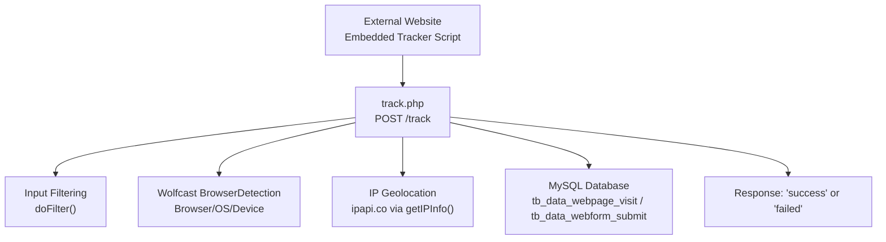
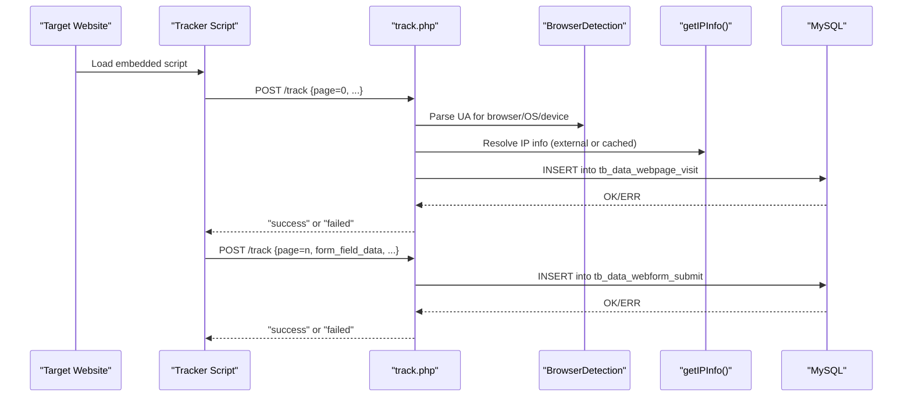
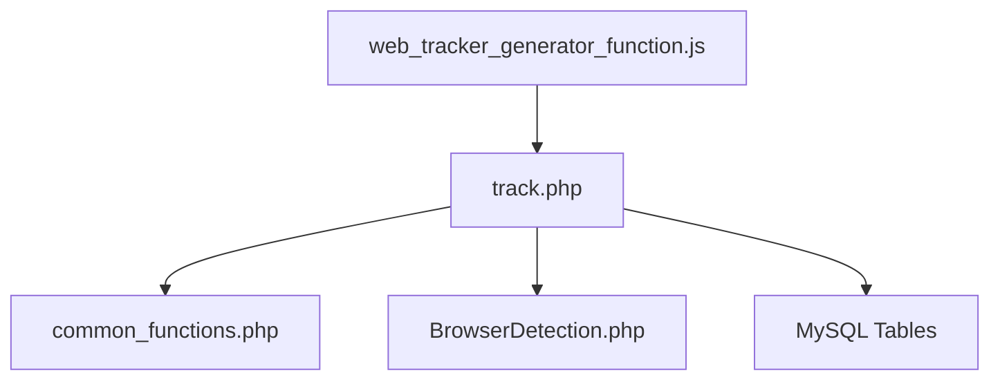

# Webhook Endpoints

<cite>
**Referenced Files in This Document**
- [track.php](file://track.php)
- [README.md](file://README.md)
- [web_tracker_generator_function.js](file://spear/js/web_tracker_generator_function.js)
- [common_functions.php](file://spear/manager/common_functions.php)
- [BrowserDetection.php](file://spear/libs/browser_detect/BrowserDetection.php)
- [web_tracker_generator_list_manager.php](file://spear/manager/web_tracker_generator_list_manager.php)
- [install_manager.php](file://install_manager.php)
</cite>

## Table of Contents
1. [Introduction](#introduction)
2. [Project Structure](#project-structure)
3. [Core Components](#core-components)
4. [Architecture Overview](#architecture-overview)
5. [Detailed Component Analysis](#detailed-component-analysis)
6. [Dependency Analysis](#dependency-analysis)
7. [Performance Considerations](#performance-considerations)
8. [Troubleshooting Guide](#troubleshooting-guide)
9. [Conclusion](#conclusion)
10. [Appendices](#appendices)

## Introduction
This document provides comprehensive API documentation for the SniperPhish webhook endpoint that powers the track.php integration system. It focuses on the POST endpoint used for web tracking, covering request/response schemas, parameter semantics, browser and IP detection, validation, authentication verification, and database insertion patterns. Practical integration examples and security considerations are included to help developers deploy and monitor tracking reliably.

## Project Structure
The webhook endpoint is implemented as a single PHP script that integrates with the SniperPhish backend. Tracking requests originate from a JavaScript tracker embedded on target websites and are sent to the webhook endpoint. The endpoint validates and sanitizes inputs, performs browser and IP geolocation, checks tracker activation state, and inserts records into dedicated database tables.

**Diagram sources**
- [track.php:1-88](file://track.php#L1-L88)
- [web_tracker_generator_function.js:520-646](file://spear/js/web_tracker_generator_function.js#L520-L646)
- [common_functions.php:257-290](file://spear/manager/common_functions.php#L257-L290)
- [BrowserDetection.php:158-640](file://spear/libs/browser_detect/BrowserDetection.php#L158-L640)

**Section sources**
- [track.php:1-88](file://track.php#L1-L88)
- [README.md:46-67](file://README.md#L46-L67)

## Core Components
- Endpoint: POST /track
- Purpose: Accept tracking events for page visits and form submissions
- Inputs: JSON payload with required and optional parameters
- Outputs: String response "success" or "failed"
- Behavior:
  - Verifies webhook accessibility via sp_ver parameter
  - Validates and filters identifiers (rid, sess_id, trackerId)
  - Detects browser, OS, and device type
  - Resolves IP geolocation (external service or cached)
  - Inserts data into appropriate database table based on page value

**Section sources**
- [track.php:9-16](file://track.php#L9-L16)
- [track.php:19-32](file://track.php#L19-L32)
- [track.php:34-46](file://track.php#L34-L46)
- [track.php:62-83](file://track.php#L62-L83)

## Architecture Overview
The webhook endpoint orchestrates request validation, enrichment, and persistence. The embedded tracker script prepares and sends structured payloads to the endpoint, which then executes conditional logic to handle page visits versus form submissions.

**Diagram sources**
- [web_tracker_generator_function.js:541-551](file://spear/js/web_tracker_generator_function.js#L541-L551)
- [web_tracker_generator_function.js:631-646](file://spear/js/web_tracker_generator_function.js#L631-L646)
- [track.php:34-46](file://track.php#L34-L46)
- [track.php:62-83](file://track.php#L62-L83)

## Detailed Component Analysis

### Endpoint Definition: POST /track
- Method: POST
- Content-Type: application/json
- Path: /track
- Origin: Embedded tracker script on target websites

Behavior highlights:
- Authentication verification: Responds immediately with "success" when sp_ver is present
- Request filtering: Uses doFilter() to sanitize identifiers
- Tracker activation check: Queries tb_core_web_tracker_list to ensure the tracker is active
- Dual-purpose routing: page=0 for visits; numeric page for form submissions
- Response: "success" or "failed"

**Section sources**
- [track.php:9-16](file://track.php#L9-L16)
- [track.php:19-32](file://track.php#L19-L32)
- [track.php:54-60](file://track.php#L54-L60)
- [track.php:62-83](file://track.php#L62-L83)

### Request Schema
Required parameters:
- rid: Unique visitor identifier (filtered to alphanumeric)
- sess_id: Session identifier (filtered to alphanumeric; defaults to "Failed" if absent)
- trackerId: Tracker identifier (filtered to alphanumeric; defaults to "Failed" if absent)

Optional parameters:
- page: Numeric page index for form submissions; 0 for initial page visit
- screen_res: Screen resolution string; sanitized; defaults to "Failed" if absent
- ip_info: Client-provided IP info object; if omitted, resolved via getIPInfo()
- form_field_data: Array of field values; sanitized before insertion

Notes:
- The tracker script constructs payloads and sets webhook URL dynamically during generation.

**Section sources**
- [track.php:19-32](file://track.php#L19-L32)
- [track.php:43-52](file://track.php#L43-L52)
- [web_tracker_generator_function.js:541-551](file://spear/js/web_tracker_generator_function.js#L541-L551)
- [web_tracker_generator_function.js:631-646](file://spear/js/web_tracker_generator_function.js#L631-L646)

### Response Schema
- Success: "success"
- Failure: "failed"
- Early verification: "success" when sp_ver is present

Validation outcomes:
- Immediate success for sp_ver verification
- Execution errors or database failures return "failed"

**Section sources**
- [track.php:15-16](file://track.php#L15-L16)
- [track.php:66-69](file://track.php#L66-L69)
- [track.php:79-82](file://track.php#L79-L82)

### Browser Detection Integration
- Library: Wolfcast BrowserDetection
- Fields derived:
  - browser: Name and version
  - platform: OS family and version
  - device_type: "Mobile" or "Desktop"
- User-Agent: Extracted from HTTP headers and passed to the detector

**Section sources**
- [track.php:34-42](file://track.php#L34-L42)
- [BrowserDetection.php:158-640](file://spear/libs/browser_detect/BrowserDetection.php#L158-L640)

### IP Geolocation Services
- External service: ipapi.co
- Resolution order:
  - If ip_info is not provided, endpoint queries tb_data_webpage_visit and tb_data_mailcamp_live for cached info
  - If not cached, performs HTTPS GET to ipapi.co and caches normalized fields
- Crafted fields include country, city, zip, ISP, timezone, and coordinates

**Section sources**
- [track.php:43-46](file://track.php#L43-L46)
- [common_functions.php:257-290](file://spear/manager/common_functions.php#L257-L290)

### Data Validation and Sanitization
- Identifiers: doFilter() strips non-alphanumeric characters for rid, sess_id, trackerId
- Form field data: Each element is sanitized via htmlspecialchars before insertion
- Tracker activation: Active state checked against tb_core_web_tracker_list

**Section sources**
- [track.php:24-32](file://track.php#L24-L32)
- [track.php:72-74](file://track.php#L72-L74)
- [track.php:54-60](file://track.php#L54-L60)
- [common_functions.php:447-458](file://spear/manager/common_functions.php#L447-L458)

### Database Insertion Patterns
Tables:
- tb_data_webpage_visit: Records page visits
- tb_data_webform_submit: Records form submissions

Fields mapped per record type:
- Shared fields: tracker_id, session_id, rid, public_ip, ip_info, user_agent, screen_res, time, browser, platform, device_type
- Visit-specific: None additional
- Form-specific: page, form_field_data

Normalization:
- time stored as Unix timestamp (milliseconds)
- ip_info normalized and JSON-encoded

**Section sources**
- [track.php:64-66](file://track.php#L64-L66)
- [track.php:77-79](file://track.php#L77-L79)
- [install_manager.php:379-394](file://install_manager.php#L379-L394)
- [install_manager.php:402-410](file://install_manager.php#L402-L410)

### Webhook Authentication Verification
- Mechanism: Send a POST with sp_ver set to any value
- Expected response: "success" indicates endpoint accessibility and basic health
- Frontend integration: The admin interface triggers this verification against the configured webhook URL

**Section sources**
- [track.php:15-16](file://track.php#L15-L16)
- [web_tracker_generator_function.js:860-879](file://spear/js/web_tracker_generator_function.js#L860-L879)

### Request Filtering and Security Considerations
- Identifier filtering: Only alphanumeric characters retained for rid, sess_id, trackerId
- Input sanitization: htmlspecialchars applied to user-supplied strings and form field data arrays
- Tracker activation gate: Prevents processing when tracker is paused/stopped
- CORS headers: Access-Control-Allow-Origin and Access-Control-Allow-Headers set for cross-origin requests

Operational safeguards:
- External IP service calls bypass peer verification flags to maximize availability
- Public IP extraction considers forwarded headers and REMOTE_ADDR

**Section sources**
- [track.php:19-32](file://track.php#L19-L32)
- [track.php:72-74](file://track.php#L72-L74)
- [track.php:2-3](file://track.php#L2-L3)
- [common_functions.php:268-277](file://spear/manager/common_functions.php#L268-L277)
- [common_functions.php:323-331](file://spear/manager/common_functions.php#L323-L331)

### Practical Integration Examples

#### Example 1: Initial Page Visit
Payload structure:
- page: 0
- trackerId: Provided by tracker configuration
- sess_id: Provided by tracker configuration
- rid: Provided by tracker configuration
- screen_res: Optional
- ip_info: Optional; if omitted, endpoint resolves via ipapi.co

Expected outcome:
- Insert into tb_data_webpage_visit
- Response: "success" or "failed"

**Section sources**
- [web_tracker_generator_function.js:541-551](file://spear/js/web_tracker_generator_function.js#L541-L551)
- [track.php:62-70](file://track.php#L62-L70)

#### Example 2: Form Submission
Payload structure:
- page: Numeric page index
- trackerId: Provided by tracker configuration
- sess_id: Provided by tracker configuration
- rid: Provided by tracker configuration
- form_field_data: Array of field values
- screen_res: Optional
- ip_info: Optional; if omitted, endpoint resolves via ipapi.co

Expected outcome:
- Insert into tb_data_webform_submit
- Response: "success" or "failed"

**Section sources**
- [web_tracker_generator_function.js:631-646](file://spear/js/web_tracker_generator_function.js#L631-L646)
- [track.php:71-83](file://track.php#L71-L83)

#### Example 3: Webhook Accessibility Verification
- Send POST with sp_ver set
- Expect "success" response

**Section sources**
- [track.php:15-16](file://track.php#L15-L16)
- [web_tracker_generator_function.js:860-879](file://spear/js/web_tracker_generator_function.js#L860-L879)

### Common Integration Scenarios
- Custom landing page tracking:
  - Embed tracker script on the landing page
  - Ensure page=0 is sent on initial load
  - Verify sp_ver endpoint access from the admin panel

- Multi-page form monitoring:
  - Configure form fields to track in the tracker generator
  - On submit, send page=n and form_field_data
  - Ensure next-page navigation appends rid for continuity

- Real-time analytics integration:
  - Use trackerId to correlate events across sessions
  - Monitor tb_data_webpage_visit and tb_data_webform_submit for live dashboards

**Section sources**
- [README.md:46-67](file://README.md#L46-L67)
- [web_tracker_generator_function.js:589-627](file://spear/js/web_tracker_generator_function.js#L589-L627)
- [web_tracker_generator_list_manager.php:139-143](file://spear/manager/web_tracker_generator_list_manager.php#L139-L143)

## Dependency Analysis
Key dependencies and relationships:
- track.php depends on:
  - Database connection (via db.php)
  - Common functions (doFilter, getIPInfo, getPublicIP)
  - Wolfcast BrowserDetection for environment parsing
- Embedded tracker script generates payloads and posts to the endpoint
- Admin interface verifies webhook accessibility via sp_ver

**Diagram sources**
- [web_tracker_generator_function.js:520-646](file://spear/js/web_tracker_generator_function.js#L520-L646)
- [track.php:4-6](file://track.php#L4-L6)
- [common_functions.php:257-290](file://spear/manager/common_functions.php#L257-L290)
- [BrowserDetection.php:158-640](file://spear/libs/browser_detect/BrowserDetection.php#L158-L640)

**Section sources**
- [track.php:4-6](file://track.php#L4-L6)
- [web_tracker_generator_function.js:520-646](file://spear/js/web_tracker_generator_function.js#L520-L646)
- [common_functions.php:257-290](file://spear/manager/common_functions.php#L257-L290)
- [BrowserDetection.php:158-640](file://spear/libs/browser_detect/BrowserDetection.php#L158-L640)

## Performance Considerations
- Asynchronous vs synchronous posting:
  - Initial visit uses asynchronous POST; form submission uses synchronous POST
- External IP service latency:
  - ipapi.co calls are best-effort; fallback occurs on failure
- Database writes:
  - Prepared statements minimize overhead; ensure proper indexing on tracker_id and time fields

[No sources needed since this section provides general guidance]

## Troubleshooting Guide
Common issues and resolutions:
- "failed" response:
  - Verify tracker is active in tb_core_web_tracker_list
  - Confirm database connectivity and table existence
  - Check for malformed payloads or missing required fields

- No rid:
  - Ensure the page is opened with rid appended; the documentation specifies this requirement

- Webhook verification fails:
  - Confirm endpoint responds to sp_ver verification
  - Check CORS headers and network accessibility

- IP info missing:
  - Ensure ipapi.co is reachable or provide ip_info in the payload

**Section sources**
- [track.php:22-22](file://track.php#L22-L22)
- [track.php:59-60](file://track.php#L59-L60)
- [README.md:63-63](file://README.md#L63-L63)
- [web_tracker_generator_function.js:860-879](file://spear/js/web_tracker_generator_function.js#L860-L879)
- [common_functions.php:268-277](file://spear/manager/common_functions.php#L268-L277)

## Conclusion
The track.php webhook endpoint provides a robust foundation for capturing page visits and form submissions from embedded trackers. By leveraging Wolfcast BrowserDetection and ipapi.co, it enriches events with browser, OS, device, and geolocation data. With strict input filtering, tracker activation checks, and clear response semantics, it supports reliable integration for custom landing pages, multi-page forms, and real-time analytics dashboards.

[No sources needed since this section summarizes without analyzing specific files]

## Appendices

### Appendix A: Request/Response Reference

- Endpoint: POST /track
- Headers: Content-Type: application/json
- Required parameters:
  - rid
  - trackerId
- Optional parameters:
  - sess_id
  - page
  - screen_res
  - ip_info
  - form_field_data

Responses:
- "success"
- "failed"
- "success" for sp_ver verification

**Section sources**
- [track.php:9-16](file://track.php#L9-L16)
- [track.php:19-32](file://track.php#L19-L32)
- [track.php:43-52](file://track.php#L43-L52)
- [track.php:62-83](file://track.php#L62-L83)

### Appendix B: Database Schema References
- tb_data_webpage_visit: visit records
- tb_data_webform_submit: form submission records

Fields include tracker_id, session_id, rid, public_ip, ip_info, user_agent, screen_res, time, browser, platform, device_type, page, form_field_data.

**Section sources**
- [install_manager.php:379-394](file://install_manager.php#L379-L394)
- [install_manager.php:402-410](file://install_manager.php#L402-L410)