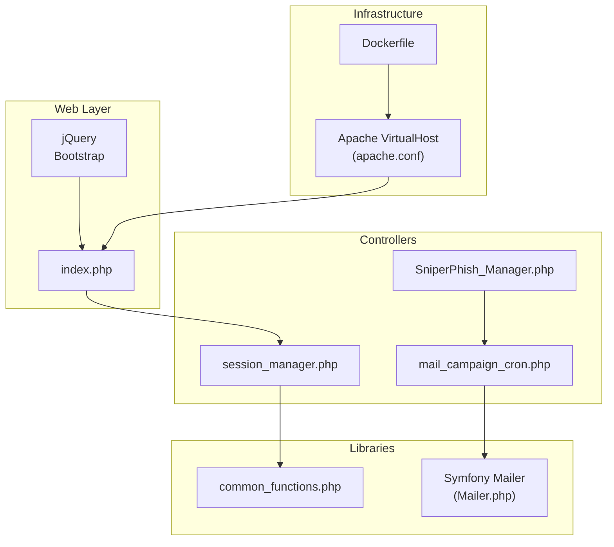
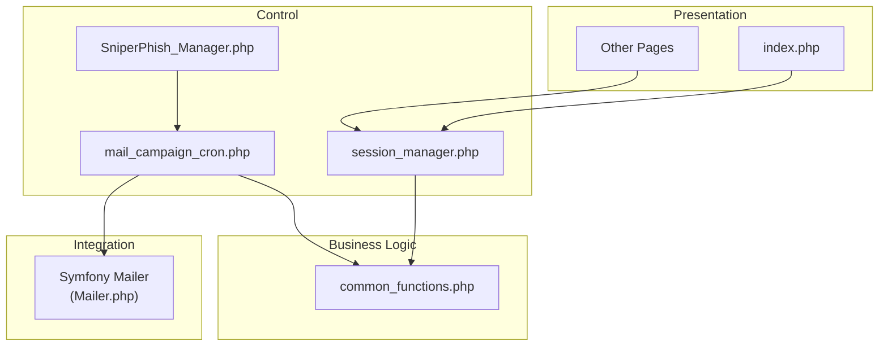
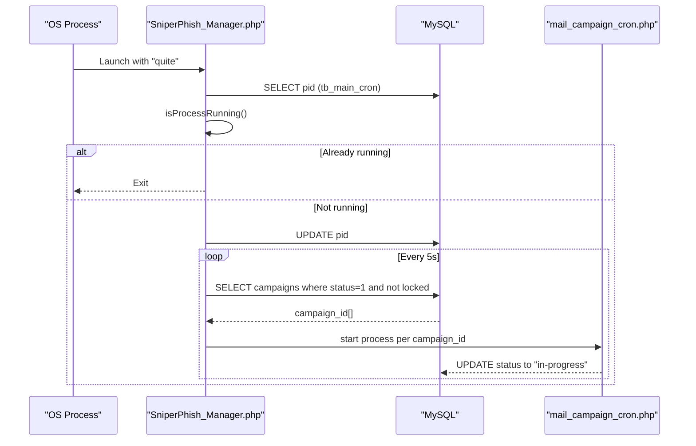
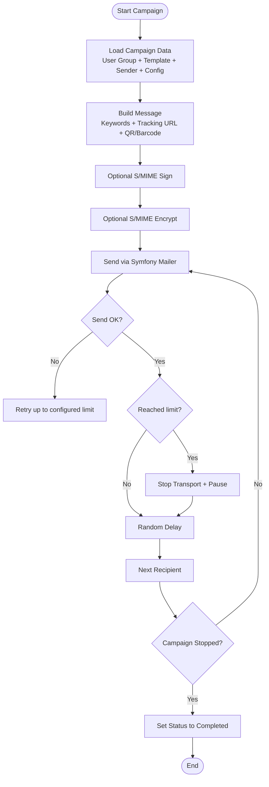
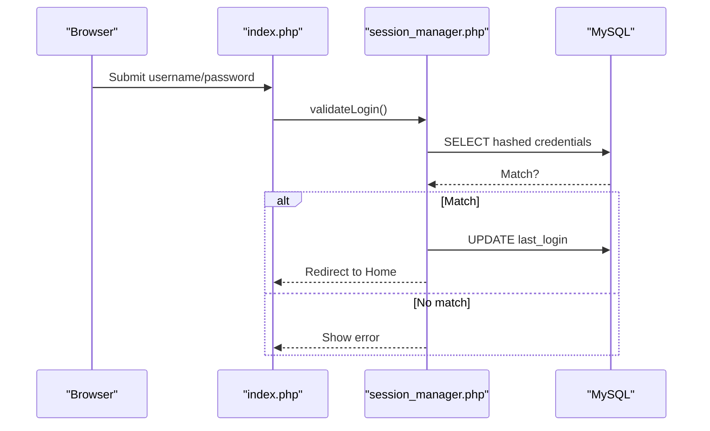
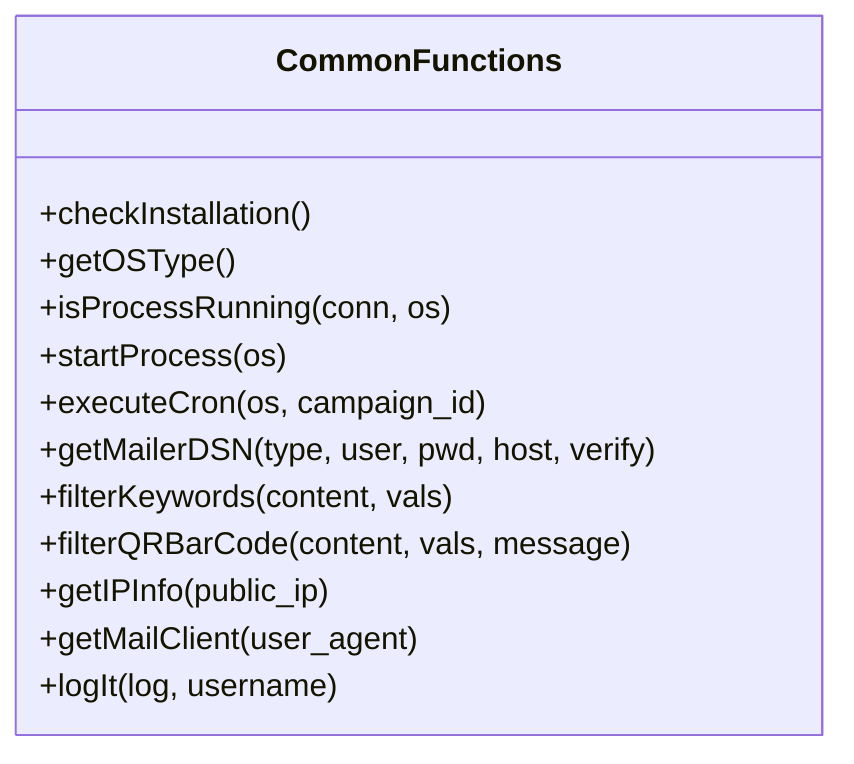
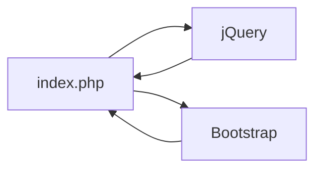
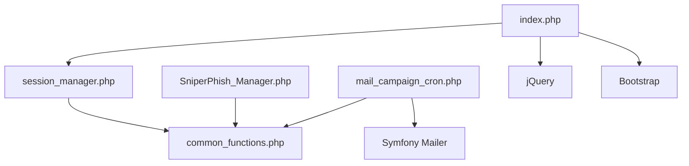

# Architecture Overview

<cite>
**Referenced Files in This Document**
- [SniperPhish_Manager.php](file://spear/core/SniperPhish_Manager.php)
- [mail_campaign_cron.php](file://spear/core/mail_campaign_cron.php)
- [session_manager.php](file://spear/manager/session_manager.php)
- [common_functions.php](file://spear/manager/common_functions.php)
- [index.php](file://spear/index.php)
- [Mailer.php](file://spear/libs/symfony/symfony/mailer/Mailer.php)
- [bootstrap.min.js](file://spear/js/libs/bootstrap.min.js)
- [jquery-3.6.0.min.js](file://spear/js/libs/jquery/jquery-3.6.0.min.js)
- [Dockerfile](file://docker/Dockerfile)
- [apache.conf](file://docker/apache.conf)
</cite>

## Table of Contents
1. [Introduction](#introduction)
2. [Project Structure](#project-structure)
3. [Core Components](#core-components)
4. [Architecture Overview](#architecture-overview)
5. [Detailed Component Analysis](#detailed-component-analysis)
6. [Dependency Analysis](#dependency-analysis)
7. [Performance Considerations](#performance-considerations)
8. [Troubleshooting Guide](#troubleshooting-guide)
9. [Conclusion](#conclusion)
10. [Appendices](#appendices)

## Introduction
This document describes the high-level architecture of SniperPhish, focusing on the traditional Model-View-Controller (MVC) pattern augmented by a Manager pattern. The system orchestrates email campaigns through a central controller that coordinates background cron processes, manages sessions, and integrates with Symfony Mailer for robust email delivery. The frontend leverages jQuery for interactivity and Bootstrap for responsive design. Infrastructure-wise, the project targets PHP 8.1+ with Apache and MySQL, with Docker configurations provided for containerized deployment.

## Project Structure
The application is organized into feature-centric folders with clear separation of concerns:
- spear/core: Central orchestration and cron execution
- spear/manager: Session and shared utilities
- spear/js: Frontend libraries (jQuery, Bootstrap)
- spear/css: Styles and icon sets
- spear/libs: Third-party libraries (Symfony Mailer)
- docker: Containerization assets for Apache and PHP

**Diagram sources**
- [index.php](file://spear/index.php)
- [session_manager.php](file://spear/manager/session_manager.php)
- [SniperPhish_Manager.php](file://spear/core/SniperPhish_Manager.php)
- [mail_campaign_cron.php](file://spear/core/mail_campaign_cron.php)
- [common_functions.php](file://spear/manager/common_functions.php)
- [Mailer.php](file://spear/libs/symfony/symfony/mailer/Mailer.php)
- [apache.conf](file://docker/apache.conf)
- [Dockerfile](file://docker/Dockerfile)

**Section sources**
- [index.php](file://spear/index.php)
- [session_manager.php](file://spear/manager/session_manager.php)
- [SniperPhish_Manager.php](file://spear/core/SniperPhish_Manager.php)
- [mail_campaign_cron.php](file://spear/core/mail_campaign_cron.php)
- [common_functions.php](file://spear/manager/common_functions.php)
- [Mailer.php](file://spear/libs/symfony/symfony/mailer/Mailer.php)
- [Dockerfile](file://docker/Dockerfile)
- [apache.conf](file://docker/apache.conf)

## Core Components
- Central Controller (SniperPhish_Manager.php): Single-instance process monitor, campaign scheduler, and background job launcher.
- Campaign Executor (mail_campaign_cron.php): Loads campaign data, constructs messages, applies signing/encryption, and sends emails with anti-flood controls.
- Session Manager (session_manager.php): Handles login, session lifecycle, cookies, and public access controls.
- Shared Utilities (common_functions.php): Cross-cutting concerns including process management, DSN generation, keyword filtering, QR/Barcode embedding, IP info, and logging.
- Frontend Libraries (jQuery, Bootstrap): Lightweight DOM manipulation and responsive UI framework.
- Symfony Mailer (Mailer.php): Transport abstraction and message sending pipeline.

**Section sources**
- [SniperPhish_Manager.php](file://spear/core/SniperPhish_Manager.php)
- [mail_campaign_cron.php](file://spear/core/mail_campaign_cron.php)
- [session_manager.php](file://spear/manager/session_manager.php)
- [common_functions.php](file://spear/manager/common_functions.php)
- [Mailer.php](file://spear/libs/symfony/symfony/mailer/Mailer.php)
- [jquery-3.6.0.min.js](file://spear/js/libs/jquery/jquery-3.6.0.min.js)
- [bootstrap.min.js](file://spear/js/libs/bootstrap.min.js)

## Architecture Overview
The system follows an MVC-like structure:
- Views: PHP pages under spear/ (e.g., index.php, dashboard pages) render HTML and delegate AJAX actions to managers.
- Controllers: session_manager.php and core scripts (SniperPhish_Manager.php, mail_campaign_cron.php) coordinate requests and orchestrate workflows.
- Managers: session_manager.php and common_functions.php encapsulate business logic and shared utilities.
- Data Access: Database queries are executed via mysqli prepared statements within managers and cron scripts.
- Email Delivery: Symfony Mailer abstracts SMTP transports and supports optional S/MIME signing and encryption.

**Diagram sources**
- [index.php](file://spear/index.php)
- [session_manager.php](file://spear/manager/session_manager.php)
- [SniperPhish_Manager.php](file://spear/core/SniperPhish_Manager.php)
- [mail_campaign_cron.php](file://spear/core/mail_campaign_cron.php)
- [common_functions.php](file://spear/manager/common_functions.php)
- [Mailer.php](file://spear/libs/symfony/symfony/mailer/Mailer.php)

## Detailed Component Analysis

### Central Controller: SniperPhish_Manager.php
Responsibilities:
- Prevents multiple instances of the cron runner.
- Registers current PID in the database.
- Polls scheduled campaigns and spawns per-campaign background processes.

**Diagram sources**
- [SniperPhish_Manager.php](file://spear/core/SniperPhish_Manager.php)
- [mail_campaign_cron.php](file://spear/core/mail_campaign_cron.php)

**Section sources**
- [SniperPhish_Manager.php](file://spear/core/SniperPhish_Manager.php)

### Campaign Execution: mail_campaign_cron.php
Responsibilities:
- Load campaign, user group, template, sender, and configuration.
- Build templated messages with keyword substitution and embedded QR/Barcode.
- Apply S/MIME signing/encryption when configured.
- Send via Symfony Mailer with retry and anti-flood controls.
- Track per-recipient status and completion.

**Diagram sources**
- [mail_campaign_cron.php](file://spear/core/mail_campaign_cron.php)
- [Mailer.php](file://spear/libs/symfony/symfony/mailer/Mailer.php)

**Section sources**
- [mail_campaign_cron.php](file://spear/core/mail_campaign_cron.php)
- [Mailer.php](file://spear/libs/symfony/symfony/mailer/Mailer.php)

### Session Management: session_manager.php
Responsibilities:
- Validate credentials and create secure sessions with regenerated IDs.
- Manage login/logout history and audit logs.
- Provide public access controls for dashboards and trackers.
- Set secure cookie attributes and enforce session expiration.

**Diagram sources**
- [index.php](file://spear/index.php)
- [session_manager.php](file://spear/manager/session_manager.php)

**Section sources**
- [session_manager.php](file://spear/manager/session_manager.php)
- [index.php](file://spear/index.php)

### Shared Utilities: common_functions.php
Responsibilities:
- Process lifecycle management (single-instance enforcement, background execution).
- DSN construction for various SMTP providers.
- Keyword replacement and QR/Barcode generation/embedding.
- IP geolocation and browser detection.
- Logging and time zone conversions.

**Diagram sources**
- [common_functions.php](file://spear/manager/common_functions.php)

**Section sources**
- [common_functions.php](file://spear/manager/common_functions.php)

### Frontend Interactions: jQuery and Bootstrap
- jQuery: Used for form submission, toggling loaders, and AJAX interactions (e.g., password reset).
- Bootstrap: Provides responsive layout, components, and modal/dialog scaffolding.

**Diagram sources**
- [index.php](file://spear/index.php)
- [jquery-3.6.0.min.js](file://spear/js/libs/jquery/jquery-3.6.0.min.js)
- [bootstrap.min.js](file://spear/js/libs/bootstrap.min.js)

**Section sources**
- [index.php](file://spear/index.php)
- [jquery-3.6.0.min.js](file://spear/js/libs/jquery/jquery-3.6.0.min.js)
- [bootstrap.min.js](file://spear/js/libs/bootstrap.min.js)

## Dependency Analysis
High-level dependencies:
- session_manager.php depends on common_functions.php and database connectivity.
- SniperPhish_Manager.php depends on common_functions.php and database for PID and campaign scheduling.
- mail_campaign_cron.php depends on common_functions.php, Symfony Mailer, and database for campaign data and status updates.
- Frontend relies on jQuery and Bootstrap assets served by Apache.

**Diagram sources**
- [session_manager.php](file://spear/manager/session_manager.php)
- [common_functions.php](file://spear/manager/common_functions.php)
- [SniperPhish_Manager.php](file://spear/core/SniperPhish_Manager.php)
- [mail_campaign_cron.php](file://spear/core/mail_campaign_cron.php)
- [Mailer.php](file://spear/libs/symfony/symfony/mailer/Mailer.php)
- [index.php](file://spear/index.php)
- [jquery-3.6.0.min.js](file://spear/js/libs/jquery/jquery-3.6.0.min.js)
- [bootstrap.min.js](file://spear/js/libs/bootstrap.min.js)

**Section sources**
- [session_manager.php](file://spear/manager/session_manager.php)
- [common_functions.php](file://spear/manager/common_functions.php)
- [SniperPhish_Manager.php](file://spear/core/SniperPhish_Manager.php)
- [mail_campaign_cron.php](file://spear/core/mail_campaign_cron.php)
- [Mailer.php](file://spear/libs/symfony/symfony/mailer/Mailer.php)
- [index.php](file://spear/index.php)
- [jquery-3.6.0.min.js](file://spear/js/libs/jquery/jquery-3.6.0.min.js)
- [bootstrap.min.js](file://spear/js/libs/bootstrap.min.js)

## Performance Considerations
- Background execution: Cron jobs are launched per campaign to avoid blocking the central controller.
- Anti-flood: Campaigns pause transport and sleep after a configurable batch size to respect provider limits.
- Random delays: Per-message randomized sleep reduces detection risk.
- Prepared statements: All database queries use prepared statements to mitigate injection and improve performance predictability.
- Lightweight frontend: jQuery and Bootstrap are minimal and widely cached.

[No sources needed since this section provides general guidance]

## Troubleshooting Guide
Common areas to inspect:
- Authentication failures: Verify credentials hashing and session creation in session_manager.php.
- Cron conflicts: Check PID registration and single-instance enforcement in common_functions.php and SniperPhish_Manager.php.
- Email delivery issues: Review Symfony Mailer DSN construction and provider-specific settings in common_functions.php; inspect send exceptions in mail_campaign_cron.php.
- Frontend AJAX errors: Confirm jQuery usage and endpoint handlers in index.php and related managers.

**Section sources**
- [session_manager.php](file://spear/manager/session_manager.php)
- [SniperPhish_Manager.php](file://spear/core/SniperPhish_Manager.php)
- [common_functions.php](file://spear/manager/common_functions.php)
- [mail_campaign_cron.php](file://spear/core/mail_campaign_cron.php)
- [index.php](file://spear/index.php)

## Conclusion
SniperPhish employs a pragmatic MVC-style architecture with a strong Manager pattern. The central controller coordinates background email campaigns, while shared utilities handle cross-cutting concerns. Symfony Mailer provides a robust and extensible foundation for email delivery, and the frontend remains lightweight with jQuery and Bootstrap. The Docker and Apache configurations enable straightforward deployment on PHP 8.1+ with Apache and MySQL.

[No sources needed since this section summarizes without analyzing specific files]

## Appendices

### Technology Stack
- Backend: PHP 8.1+, MySQL, Apache
- Email: Symfony Mailer
- Frontend: jQuery, Bootstrap
- Containerization: Dockerfile, Apache VirtualHost

**Section sources**
- [Dockerfile](file://docker/Dockerfile)
- [apache.conf](file://docker/apache.conf)
- [Mailer.php](file://spear/libs/symfony/symfony/mailer/Mailer.php)
- [jquery-3.6.0.min.js](file://spear/js/libs/jquery/jquery-3.6.0.min.js)
- [bootstrap.min.js](file://spear/js/libs/bootstrap.min.js)