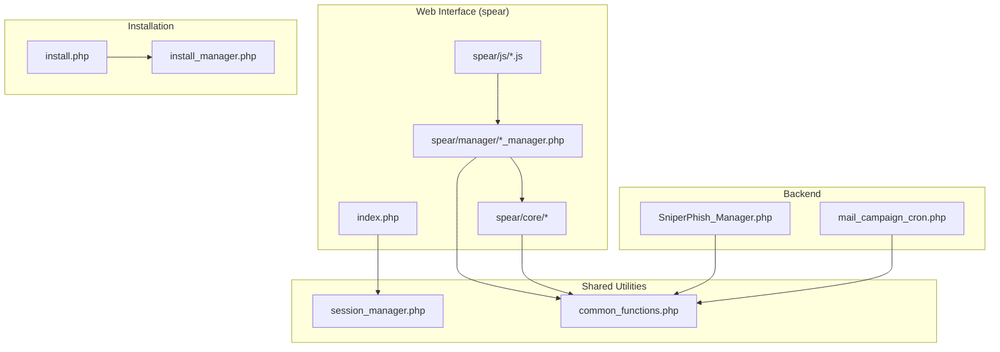
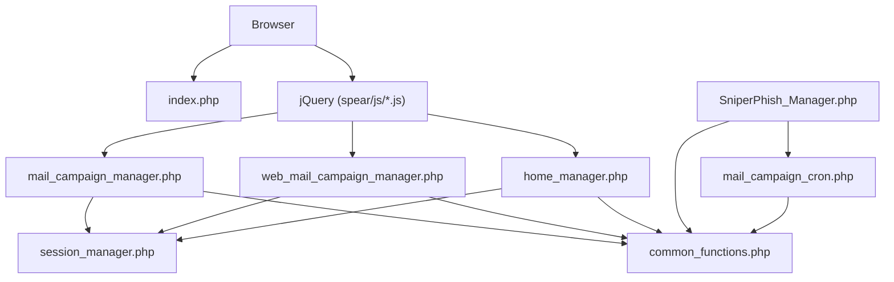
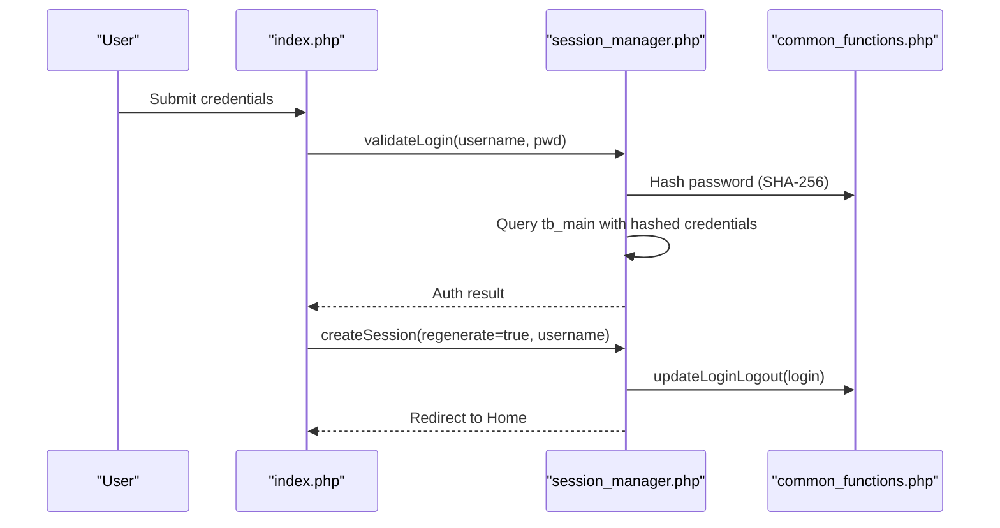
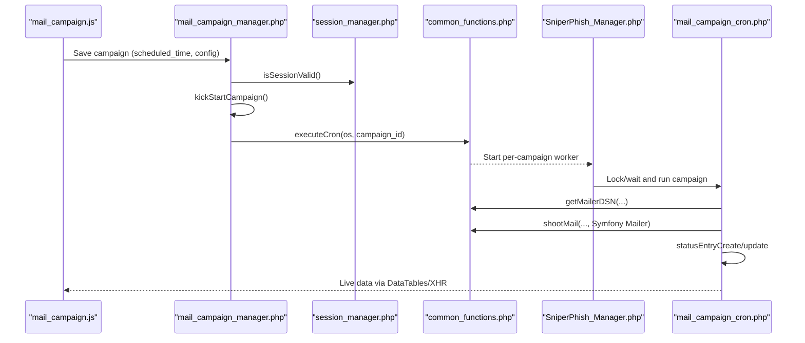
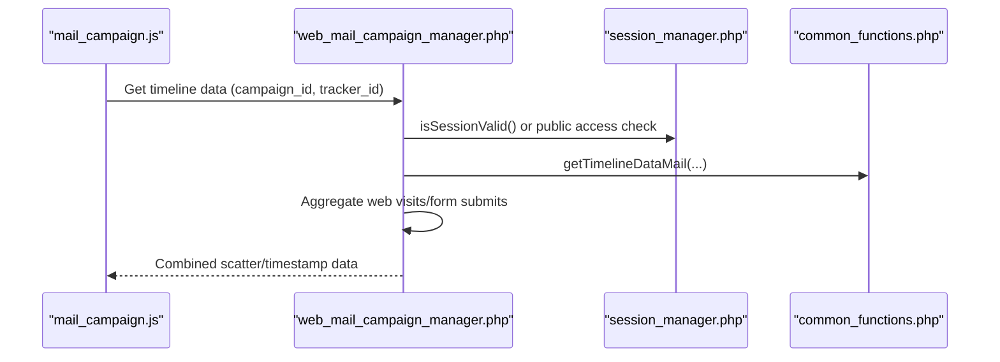
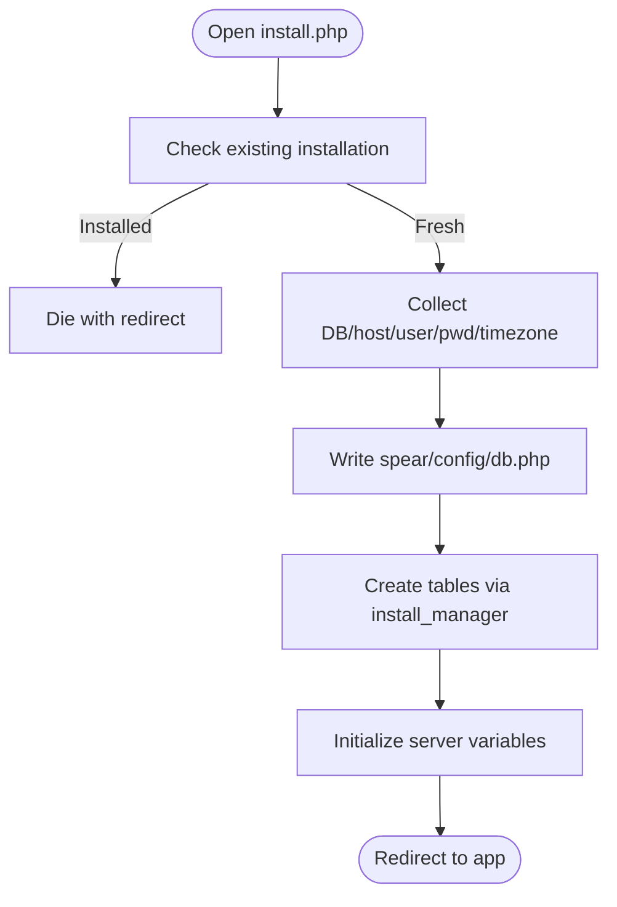
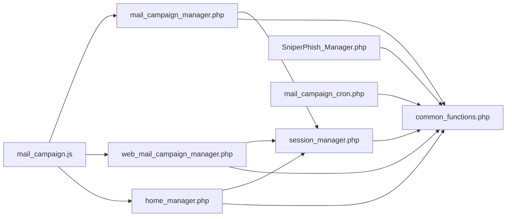

# Component Relationships

<cite>
**Referenced Files in This Document**
- [session_manager.php](file://spear/manager/session_manager.php)
- [common_functions.php](file://spear/manager/common_functions.php)
- [SniperPhish_Manager.php](file://spear/core/SniperPhish_Manager.php)
- [mail_campaign_cron.php](file://spear/core/mail_campaign_cron.php)
- [mail_campaign_manager.php](file://spear/manager/mail_campaign_manager.php)
- [web_mail_campaign_manager.php](file://spear/manager/web_mail_campaign_manager.php)
- [home_manager.php](file://spear/manager/home_manager.php)
- [mail_campaign.js](file://spear/js/mail_campaign.js)
- [index.php](file://spear/index.php)
- [install.php](file://install.php)
- [install_manager.php](file://install_manager.php)
- [sniperhost_manager.php](file://spear/sniperhost/manager/sniperhost_manager.php)
</cite>

## Table of Contents
1. [Introduction](#introduction)
2. [Project Structure](#project-structure)
3. [Core Components](#core-components)
4. [Architecture Overview](#architecture-overview)
5. [Detailed Component Analysis](#detailed-component-analysis)
6. [Dependency Analysis](#dependency-analysis)
7. [Performance Considerations](#performance-considerations)
8. [Troubleshooting Guide](#troubleshooting-guide)
9. [Conclusion](#conclusion)

## Introduction
This document explains how SniperPhish’s components interact and depend on each other. It focuses on the foundational session management, shared utilities, database connectivity, and the coordination between the web interface and backend processing. It also documents integration points with Symfony Mailer, jQuery, and Bootstrap, and outlines how circular dependencies are avoided through layered abstractions.

## Project Structure
SniperPhish organizes functionality into:
- Web interface under spear/: HTML pages, CSS, JS, and manager PHP files
- Backend processing under spear/core/: long-running manager and per-campaign cron
- Shared utilities under spear/manager/: reusable functions and session handling
- Installation and configuration under project root and spear/config/

**Diagram sources**
- [index.php:1-188](file://spear/index.php#L1-L188)
- [session_manager.php:1-244](file://spear/manager/session_manager.php#L1-L244)
- [common_functions.php:1-595](file://spear/manager/common_functions.php#L1-L595)
- [SniperPhish_Manager.php:1-46](file://spear/core/SniperPhish_Manager.php#L1-L46)
- [mail_campaign_cron.php:1-364](file://spear/core/mail_campaign_cron.php#L1-L364)
- [install.php:1-200](file://install.php#L1-L200)
- [install_manager.php:139-171](file://install_manager.php#L139-L171)

**Section sources**
- [index.php:1-188](file://spear/index.php#L1-L188)
- [session_manager.php:1-244](file://spear/manager/session_manager.php#L1-L244)
- [common_functions.php:1-595](file://spear/manager/common_functions.php#L1-L595)
- [SniperPhish_Manager.php:1-46](file://spear/core/SniperPhish_Manager.php#L1-L46)
- [mail_campaign_cron.php:1-364](file://spear/core/mail_campaign_cron.php#L1-L364)
- [install.php:1-200](file://install.php#L1-L200)
- [install_manager.php:139-171](file://install_manager.php#L139-L171)

## Core Components
- session_manager.php: Initializes sessions, validates credentials, manages login/logout, sets cookies, and controls public access to dashboards and trackers. It depends on database connectivity and shared utilities.
- common_functions.php: Provides shared utilities including OS/process detection, Symfony Mailer DSN construction, email sending, QR/Barcode generation, IP/geolocation, time formatting, logging, and campaign helpers. It also integrates with Symfony Mailer.
- mail_campaign_manager.php: Frontend-to-backend bridge for email campaigns. Handles CRUD, scheduling, live data retrieval, and report exports. It validates sessions and enforces public access rules.
- web_mail_campaign_manager.php: Coordinates web/email combined analytics and live data for dashboards, including timeline and graph data aggregation.
- home_manager.php: Returns dashboard summary data and controls the long-running SniperPhish process lifecycle.
- mail_campaign_cron.php: Executes scheduled email campaigns, builds messages, attaches assets, signs/encrypts, sends via Symfony Mailer, and updates live tracking tables.
- SniperPhish_Manager.php: Long-running orchestrator that polls scheduled campaigns and spawns per-campaign cron workers.

**Section sources**
- [session_manager.php:1-244](file://spear/manager/session_manager.php#L1-L244)
- [common_functions.php:1-595](file://spear/manager/common_functions.php#L1-L595)
- [mail_campaign_manager.php:1-547](file://spear/manager/mail_campaign_manager.php#L1-L547)
- [web_mail_campaign_manager.php:1-689](file://spear/manager/web_mail_campaign_manager.php#L1-L689)
- [home_manager.php:1-120](file://spear/manager/home_manager.php#L1-L120)
- [mail_campaign_cron.php:1-364](file://spear/core/mail_campaign_cron.php#L1-L364)
- [SniperPhish_Manager.php:1-46](file://spear/core/SniperPhish_Manager.php#L1-L46)

## Architecture Overview
The system follows a layered pattern:
- Presentation Layer: HTML pages and JS in spear/
- Manager Layer: PHP managers in spear/manager/ handle HTTP requests, enforce sessions, and orchestrate data flows
- Backend Processing Layer: spear/core/ runs long-lived and per-campaign jobs
- Shared Utilities Layer: spear/manager/common_functions.php centralizes cross-cutting concerns
- Database: Managed via mysqli connections initialized in managers and referenced by shared utilities

**Diagram sources**
- [index.php:1-188](file://spear/index.php#L1-L188)
- [mail_campaign.js:1-436](file://spear/js/mail_campaign.js#L1-L436)
- [mail_campaign_manager.php:1-547](file://spear/manager/mail_campaign_manager.php#L1-L547)
- [web_mail_campaign_manager.php:1-689](file://spear/manager/web_mail_campaign_manager.php#L1-L689)
- [home_manager.php:1-120](file://spear/manager/home_manager.php#L1-L120)
- [session_manager.php:1-244](file://spear/manager/session_manager.php#L1-L244)
- [common_functions.php:1-595](file://spear/manager/common_functions.php#L1-L595)
- [SniperPhish_Manager.php:1-46](file://spear/core/SniperPhish_Manager.php#L1-L46)
- [mail_campaign_cron.php:1-364](file://spear/core/mail_campaign_cron.php#L1-L364)

## Detailed Component Analysis

### Session Management and Authentication Flow
The authentication flow starts at the login page and coordinates through session initialization, credential validation, and session creation.

**Diagram sources**
- [index.php:8-14](file://spear/index.php#L8-L14)
- [session_manager.php:17-33](file://spear/manager/session_manager.php#L17-L33)
- [common_functions.php:114-143](file://spear/manager/common_functions.php#L114-L143)

**Section sources**
- [index.php:8-14](file://spear/index.php#L8-L14)
- [session_manager.php:17-33](file://spear/manager/session_manager.php#L17-L33)
- [common_functions.php:114-143](file://spear/manager/common_functions.php#L114-L143)

### Email Campaign Processing Workflow
This sequence covers scheduling, orchestration, and execution of email campaigns.

**Diagram sources**
- [mail_campaign.js:168-193](file://spear/js/mail_campaign.js#L168-L193)
- [mail_campaign_manager.php:236-251](file://spear/manager/mail_campaign_manager.php#L236-L251)
- [common_functions.php:87-92](file://spear/manager/common_functions.php#L87-L92)
- [SniperPhish_Manager.php:23-28](file://spear/core/SniperPhish_Manager.php#L23-L28)
- [mail_campaign_cron.php:325-361](file://spear/core/mail_campaign_cron.php#L325-L361)

**Section sources**
- [mail_campaign.js:168-193](file://spear/js/mail_campaign.js#L168-L193)
- [mail_campaign_manager.php:236-251](file://spear/manager/mail_campaign_manager.php#L236-L251)
- [SniperPhish_Manager.php:23-28](file://spear/core/SniperPhish_Manager.php#L23-L28)
- [mail_campaign_cron.php:325-361](file://spear/core/mail_campaign_cron.php#L325-L361)

### Tracking Data Collection and Dashboard Aggregation
Live tracking data is collected and aggregated for combined web/email dashboards.

**Diagram sources**
- [web_mail_campaign_manager.php:114-168](file://spear/manager/web_mail_campaign_manager.php#L114-L168)
- [session_manager.php:96-144](file://spear/manager/session_manager.php#L96-L144)
- [common_functions.php:334-366](file://spear/manager/common_functions.php#L334-L366)

**Section sources**
- [web_mail_campaign_manager.php:114-168](file://spear/manager/web_mail_campaign_manager.php#L114-L168)
- [session_manager.php:96-144](file://spear/manager/session_manager.php#L96-L144)
- [common_functions.php:334-366](file://spear/manager/common_functions.php#L334-L366)

### Installation and Database Initialization
Installation writes configuration and creates tables, ensuring database connectivity is available before managers rely on it.

**Diagram sources**
- [install.php:3-5](file://install.php#L3-L5)
- [install.php:188-200](file://install.php#L188-L200)
- [install_manager.php:139-171](file://install_manager.php#L139-L171)

**Section sources**
- [install.php:3-5](file://install.php#L3-L5)
- [install.php:188-200](file://install.php#L188-L200)
- [install_manager.php:139-171](file://install_manager.php#L139-L171)

## Dependency Analysis
Key dependency relationships:
- session_manager.php depends on database configuration and common_functions.php for shared utilities and Symfony Mailer integration
- mail_campaign_manager.php and web_mail_campaign_manager.php depend on session_manager.php for session checks and on common_functions.php for shared helpers
- SniperPhish_Manager.php and mail_campaign_cron.php depend on common_functions.php for OS/process detection, DSN construction, and email sending
- Frontend JS (mail_campaign.js) communicates with managers via AJAX endpoints

**Diagram sources**
- [session_manager.php:1-244](file://spear/manager/session_manager.php#L1-L244)
- [common_functions.php:1-595](file://spear/manager/common_functions.php#L1-L595)
- [mail_campaign_manager.php:1-547](file://spear/manager/mail_campaign_manager.php#L1-L547)
- [web_mail_campaign_manager.php:1-689](file://spear/manager/web_mail_campaign_manager.php#L1-L689)
- [home_manager.php:1-120](file://spear/manager/home_manager.php#L1-L120)
- [SniperPhish_Manager.php:1-46](file://spear/core/SniperPhish_Manager.php#L1-L46)
- [mail_campaign_cron.php:1-364](file://spear/core/mail_campaign_cron.php#L1-L364)
- [mail_campaign.js:1-436](file://spear/js/mail_campaign.js#L1-L436)

**Section sources**
- [session_manager.php:1-244](file://spear/manager/session_manager.php#L1-L244)
- [common_functions.php:1-595](file://spear/manager/common_functions.php#L1-L595)
- [mail_campaign_manager.php:1-547](file://spear/manager/mail_campaign_manager.php#L1-L547)
- [web_mail_campaign_manager.php:1-689](file://spear/manager/web_mail_campaign_manager.php#L1-L689)
- [home_manager.php:1-120](file://spear/manager/home_manager.php#L1-L120)
- [SniperPhish_Manager.php:1-46](file://spear/core/SniperPhish_Manager.php#L1-L46)
- [mail_campaign_cron.php:1-364](file://spear/core/mail_campaign_cron.php#L1-L364)
- [mail_campaign.js:1-436](file://spear/js/mail_campaign.js#L1-L436)

## Performance Considerations
- Long-running orchestration: SniperPhish_Manager.php runs continuously and spawns per-campaign workers; ensure anti-flood and retry logic are tuned to provider limits.
- Database queries: Managers often fetch large datasets for reports; consider pagination and filtering to reduce payload sizes.
- Email throughput: Per-campaign delays and anti-flood pauses are implemented; adjust intervals to balance speed and deliverability.
- Frontend rendering: DataTables with server-side processing helps manage large live datasets efficiently.

## Troubleshooting Guide
Common issues and mitigations:
- Session errors: Verify session_start() and cookie settings; ensure session_manager.php is included before any output.
- Authentication failures: Confirm hashed credentials match stored values and that tb_main exists with correct schema.
- Email delivery failures: Validate DSN construction and SMTP credentials; review Symfony Mailer exceptions and logs.
- Public access denials: Ensure tb_access_ctrl entries exist for requested campaign/tracker IDs and tokens are valid.
- Installation problems: Check directory permissions and .htaccess configuration; confirm db.php is written and tables created.

**Section sources**
- [session_manager.php:215-243](file://spear/manager/session_manager.php#L215-L243)
- [common_functions.php:114-143](file://spear/manager/common_functions.php#L114-L143)
- [install.php:172-185](file://install.php#L172-L185)
- [install_manager.php:139-171](file://install_manager.php#L139-L171)

## Conclusion
SniperPhish’s architecture cleanly separates presentation, orchestration, and processing through a small set of cohesive managers and shared utilities. session_manager.php anchors authentication and session lifecycle; common_functions.php centralizes cross-cutting concerns including email delivery and data transformations. The web interface communicates with managers over AJAX, while backend workers handle long-running tasks. Circular dependencies are avoided by enforcing unidirectional dependencies: managers depend on shared utilities, which depend on core libraries, and workers depend on shared utilities.