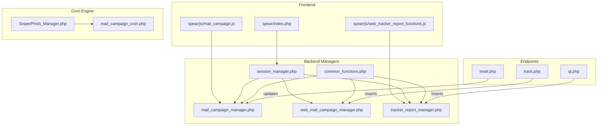
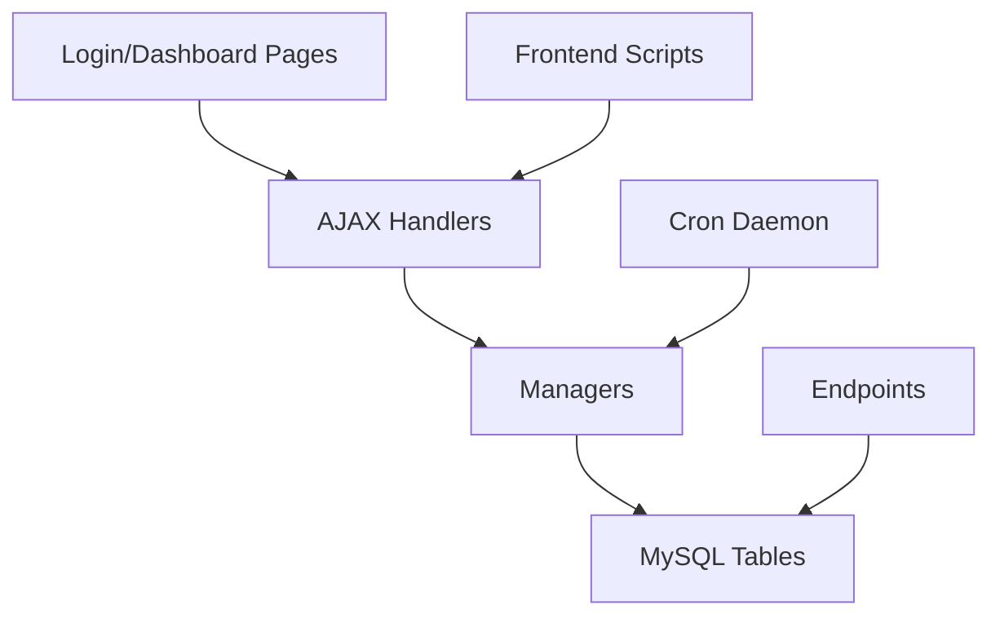
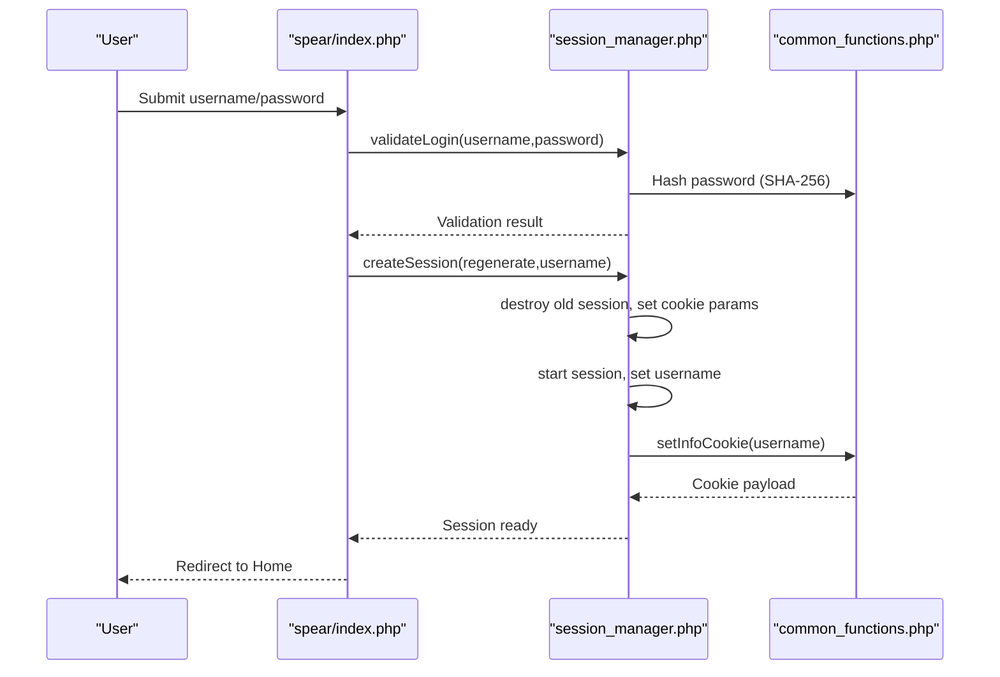
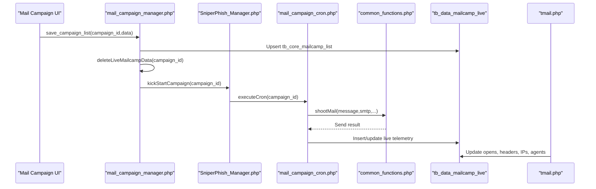
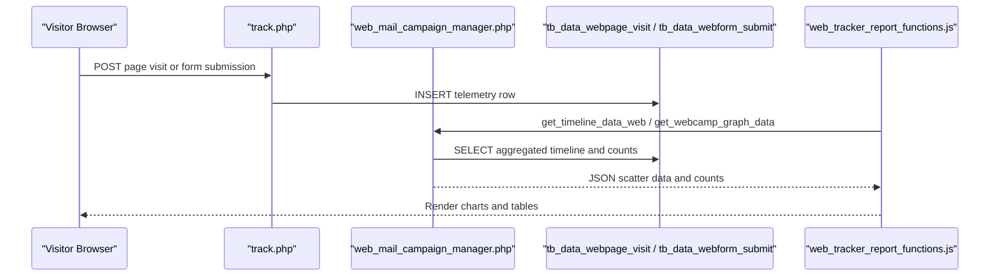
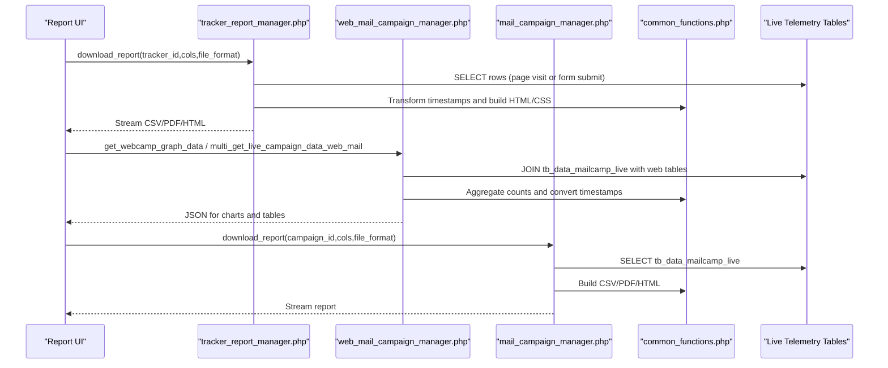
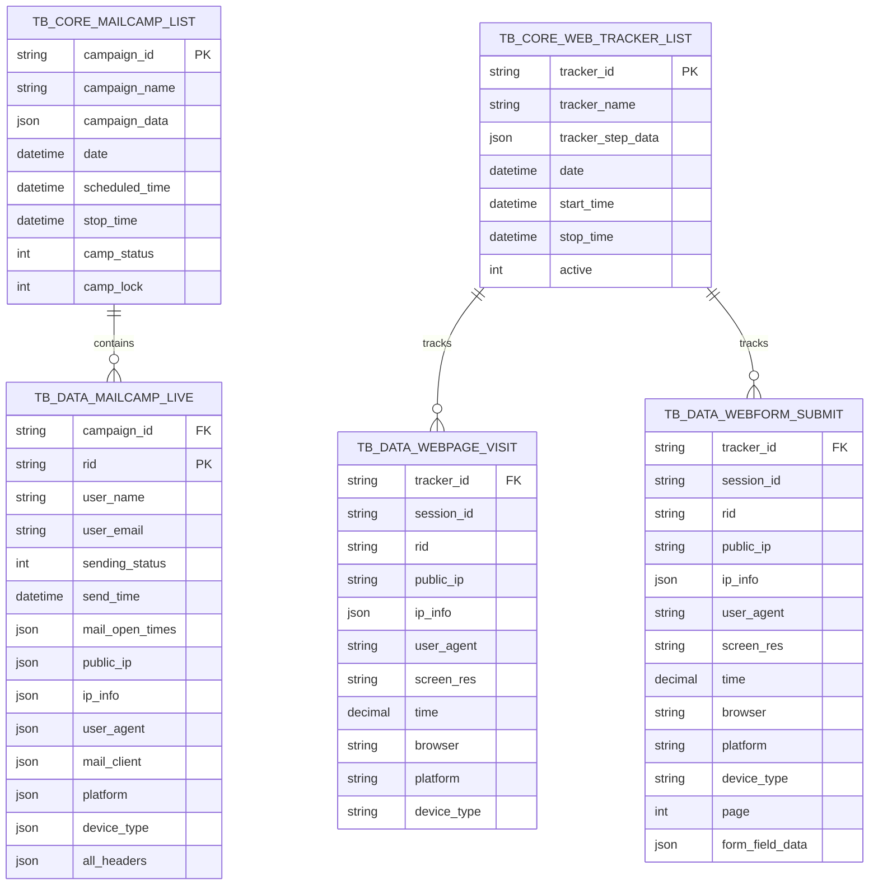
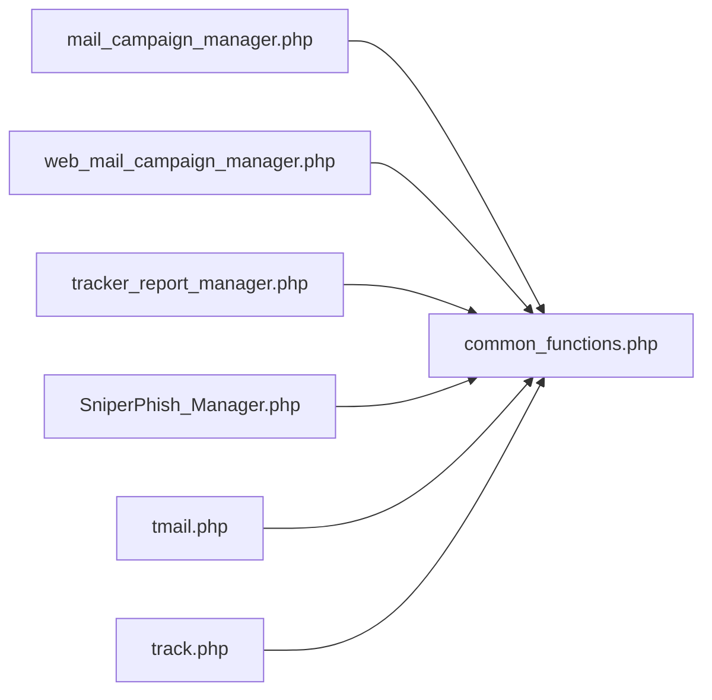

# Data Flow Diagrams

<cite>
**Referenced Files in This Document**
- [spear/index.php](file://spear/index.php)
- [spear/manager/session_manager.php](file://spear/manager/session_manager.php)
- [spear/manager/common_functions.php](file://spear/manager/common_functions.php)
- [spear/core/SniperPhish_Manager.php](file://spear/core/SniperPhish_Manager.php)
- [spear/core/mail_campaign_cron.php](file://spear/core/mail_campaign_cron.php)
- [spear/manager/mail_campaign_manager.php](file://spear/manager/mail_campaign_manager.php)
- [spear/manager/web_mail_campaign_manager.php](file://spear/manager/web_mail_campaign_manager.php)
- [spear/manager/tracker_report_manager.php](file://spear/manager/tracker_report_manager.php)
- [spear/js/mail_campaign.js](file://spear/js/mail_campaign.js)
- [spear/js/web_tracker_report_functions.js](file://spear/js/web_tracker_report_functions.js)
- [tmail.php](file://tmail.php)
- [track.php](file://track.php)
- [qt.php](file://qt.php)
</cite>

## Table of Contents
1. [Introduction](#introduction)
2. [Project Structure](#project-structure)
3. [Core Components](#core-components)
4. [Architecture Overview](#architecture-overview)
5. [Detailed Component Analysis](#detailed-component-analysis)
6. [Dependency Analysis](#dependency-analysis)
7. [Performance Considerations](#performance-considerations)
8. [Troubleshooting Guide](#troubleshooting-guide)
9. [Conclusion](#conclusion)

## Introduction
This document presents comprehensive data flow diagrams for SniperPhish, focusing on how data moves across the system for:
- User authentication (login → session creation → dashboard access)
- Email campaign processing (template creation → user selection → SMTP processing → delivery → tracking)
- Web tracking (page load → JavaScript execution → data collection → database storage → dashboard update)
- Reporting (data aggregation → analytics processing → visualization generation)

It also details the relationships among key runtime tables: tb_data_mailcamp_live, tb_data_webpage_visit, tb_core_web_tracker_list, and tb_core_mailcamp_list, and documents validation, transformation, and security measures at each stage.

## Project Structure
The system comprises:
- Frontend pages and scripts (login, campaign management, web tracker reports)
- Backend managers handling AJAX requests and orchestrating operations
- Cron-driven engine for scheduled email campaigns
- Webhook endpoints for tracking pixel and JavaScript-based telemetry
- Shared common functions for filtering, validation, time conversion, and mailer integration

**Diagram sources**
- [spear/index.php:1-188](file://spear/index.php#L1-L188)
- [spear/manager/session_manager.php:1-244](file://spear/manager/session_manager.php#L1-L244)
- [spear/manager/common_functions.php:1-595](file://spear/manager/common_functions.php#L1-L595)
- [spear/core/SniperPhish_Manager.php:1-46](file://spear/core/SniperPhish_Manager.php#L1-L46)
- [spear/core/mail_campaign_cron.php](file://spear/core/mail_campaign_cron.php)
- [spear/manager/mail_campaign_manager.php:1-547](file://spear/manager/mail_campaign_manager.php#L1-L547)
- [spear/manager/web_mail_campaign_manager.php:1-689](file://spear/manager/web_mail_campaign_manager.php#L1-L689)
- [spear/manager/tracker_report_manager.php:1-223](file://spear/manager/tracker_report_manager.php#L1-L223)
- [tmail.php:1-148](file://tmail.php#L1-L148)
- [track.php:1-88](file://track.php#L1-L88)
- [qt.php:1-63](file://qt.php#L1-L63)

**Section sources**
- [spear/index.php:1-188](file://spear/index.php#L1-L188)
- [spear/manager/session_manager.php:1-244](file://spear/manager/session_manager.php#L1-L244)
- [spear/manager/common_functions.php:1-595](file://spear/manager/common_functions.php#L1-L595)
- [spear/core/SniperPhish_Manager.php:1-46](file://spear/core/SniperPhish_Manager.php#L1-L46)
- [spear/core/mail_campaign_cron.php](file://spear/core/mail_campaign_cron.php)
- [spear/manager/mail_campaign_manager.php:1-547](file://spear/manager/mail_campaign_manager.php#L1-L547)
- [spear/manager/web_mail_campaign_manager.php:1-689](file://spear/manager/web_mail_campaign_manager.php#L1-L689)
- [spear/manager/tracker_report_manager.php:1-223](file://spear/manager/tracker_report_manager.php#L1-L223)
- [tmail.php:1-148](file://tmail.php#L1-L148)
- [track.php:1-88](file://track.php#L1-L88)
- [qt.php:1-63](file://qt.php#L1-L63)

## Core Components
- Authentication and session management: Validates credentials, creates sessions, sets cookies, and enforces access control for public dashboards.
- Email campaign orchestration: Manages campaign lifecycle, schedules, and triggers background mail sending via cron.
- Web tracking pipeline: Captures page visits and form submissions, stores telemetry, and supports cross-platform analytics.
- Reporting engine: Aggregates data from live telemetry tables, transforms timestamps, and generates CSV/PDF/HTML exports.
- Endpoint handlers: Pixel-based open tracking and JavaScript-based telemetry endpoints persist data into appropriate live tables.

Key runtime tables involved:
- tb_data_mailcamp_live: Live email campaign telemetry (opens, headers, IPs, agents, clients, platforms, devices)
- tb_data_webpage_visit: Live web tracker page visit telemetry
- tb_core_web_tracker_list: Web tracker metadata and activation state
- tb_core_mailcamp_list: Email campaign metadata and scheduling

**Section sources**
- [spear/manager/session_manager.php:17-94](file://spear/manager/session_manager.php#L17-L94)
- [spear/manager/common_functions.php:346-366](file://spear/manager/common_functions.php#L346-L366)
- [spear/manager/mail_campaign_manager.php:62-86](file://spear/manager/mail_campaign_manager.php#L62-L86)
- [spear/manager/web_mail_campaign_manager.php:114-168](file://spear/manager/web_mail_campaign_manager.php#L114-L168)
- [spear/manager/tracker_report_manager.php:25-109](file://spear/manager/tracker_report_manager.php#L25-L109)
- [tmail.php:105-108](file://tmail.php#L105-L108)
- [track.php:64-83](file://track.php#L64-L83)

## Architecture Overview
The system follows a layered architecture:
- Presentation layer: HTML pages and JavaScript widgets
- Application layer: PHP managers handling AJAX and report generation
- Business logic layer: Shared functions for validation, filtering, mailer DSN, and time conversions
- Persistence layer: MySQL tables storing campaign metadata and live telemetry
- Execution layer: Cron daemon and per-request endpoint handlers

**Diagram sources**
- [spear/index.php:1-188](file://spear/index.php#L1-L188)
- [spear/manager/session_manager.php:1-244](file://spear/manager/session_manager.php#L1-L244)
- [spear/manager/mail_campaign_manager.php:1-547](file://spear/manager/mail_campaign_manager.php#L1-L547)
- [spear/manager/web_mail_campaign_manager.php:1-689](file://spear/manager/web_mail_campaign_manager.php#L1-L689)
- [spear/manager/tracker_report_manager.php:1-223](file://spear/manager/tracker_report_manager.php#L1-L223)
- [spear/core/SniperPhish_Manager.php:1-46](file://spear/core/SniperPhish_Manager.php#L1-L46)
- [tmail.php:1-148](file://tmail.php#L1-L148)
- [track.php:1-88](file://track.php#L1-L88)

## Detailed Component Analysis

### Authentication Flow: Login → Session Creation → Dashboard Access
This flow covers credential validation, session regeneration, cookie population, and redirection to the dashboard.

Security and validation highlights:
- Password hashing via SHA-256 before DB lookup
- Session cookie configured with HttpOnly and SameSite Strict
- Session regeneration on re-login to mitigate fixation
- Timezone-aware client time formatting for UI

**Diagram sources**
- [spear/index.php:8-14](file://spear/index.php#L8-L14)
- [spear/manager/session_manager.php:17-33](file://spear/manager/session_manager.php#L17-L33)
- [spear/manager/session_manager.php:198-213](file://spear/manager/session_manager.php#L198-L213)
- [spear/manager/session_manager.php:215-234](file://spear/manager/session_manager.php#L215-L234)
- [spear/manager/common_functions.php:447-458](file://spear/manager/common_functions.php#L447-L458)

**Section sources**
- [spear/index.php:8-14](file://spear/index.php#L8-L14)
- [spear/manager/session_manager.php:17-33](file://spear/manager/session_manager.php#L17-L33)
- [spear/manager/session_manager.php:198-234](file://spear/manager/session_manager.php#L198-L234)
- [spear/manager/common_functions.php:447-458](file://spear/manager/common_functions.php#L447-L458)

### Email Campaign Processing: Template → User Selection → SMTP → Delivery → Tracking
This flow spans campaign definition, scheduling, background sending, and live telemetry updates.

Data validation and transformation:
- Campaign data stored as JSON in tb_core_mailcamp_list.campaign_data
- Live telemetry normalized into arrays for IPs, agents, clients, platforms, devices, and headers
- Timestamps converted to client timezone for display

**Diagram sources**
- [spear/manager/mail_campaign_manager.php:62-86](file://spear/manager/mail_campaign_manager.php#L62-L86)
- [spear/core/SniperPhish_Manager.php:23-28](file://spear/core/SniperPhish_Manager.php#L23-L28)
- [spear/core/mail_campaign_cron.php](file://spear/core/mail_campaign_cron.php)
- [spear/manager/common_functions.php:114-143](file://spear/manager/common_functions.php#L114-L143)
- [tmail.php:105-108](file://tmail.php#L105-L108)

**Section sources**
- [spear/manager/mail_campaign_manager.php:62-86](file://spear/manager/mail_campaign_manager.php#L62-L86)
- [spear/core/SniperPhish_Manager.php:23-28](file://spear/core/SniperPhish_Manager.php#L23-L28)
- [spear/manager/common_functions.php:114-143](file://spear/manager/common_functions.php#L114-L143)
- [tmail.php:105-108](file://tmail.php#L105-L108)

### Web Tracking: Page Load → JavaScript Execution → Data Collection → Database Storage → Dashboard Update
This flow captures page visits and form submissions, persists telemetry, and aggregates timeline data.

Data validation and transformation:
- Input filtered to alphanumeric identifiers for safety
- IP info resolved via local cache or external API
- Timeline timestamps converted to client timezone for display
- Cross-table joins between tb_data_mailcamp_live and tb_data_webpage_visit for combined views

**Diagram sources**
- [track.php:19-83](file://track.php#L19-L83)
- [spear/manager/web_mail_campaign_manager.php:114-168](file://spear/manager/web_mail_campaign_manager.php#L114-L168)
- [spear/manager/web_mail_campaign_manager.php:239-438](file://spear/manager/web_mail_campaign_manager.php#L239-L438)
- [spear/js/web_tracker_report_functions.js:69-200](file://spear/js/web_tracker_report_functions.js#L69-L200)

**Section sources**
- [track.php:19-83](file://track.php#L19-L83)
- [spear/manager/web_mail_campaign_manager.php:114-168](file://spear/manager/web_mail_campaign_manager.php#L114-L168)
- [spear/manager/web_mail_campaign_manager.php:239-438](file://spear/manager/web_mail_campaign_manager.php#L239-L438)
- [spear/js/web_tracker_report_functions.js:69-200](file://spear/js/web_tracker_report_functions.js#L69-L200)

### Reporting: Data Aggregation → Analytics Processing → Visualization Generation
This flow aggregates live telemetry, transforms timestamps, and produces downloadable reports.

Validation and security:
- Input sanitization for column names and filters
- JSON responses with UTF-8 handling
- Access control via session validation and public access tokens

**Diagram sources**
- [spear/manager/tracker_report_manager.php:25-109](file://spear/manager/tracker_report_manager.php#L25-L109)
- [spear/manager/web_mail_campaign_manager.php:170-236](file://spear/manager/web_mail_campaign_manager.php#L170-L236)
- [spear/manager/web_mail_campaign_manager.php:440-687](file://spear/manager/web_mail_campaign_manager.php#L440-L687)
- [spear/manager/mail_campaign_manager.php:410-546](file://spear/manager/mail_campaign_manager.php#L410-L546)
- [spear/manager/common_functions.php:535-574](file://spear/manager/common_functions.php#L535-L574)

**Section sources**
- [spear/manager/tracker_report_manager.php:25-109](file://spear/manager/tracker_report_manager.php#L25-L109)
- [spear/manager/web_mail_campaign_manager.php:170-236](file://spear/manager/web_mail_campaign_manager.php#L170-L236)
- [spear/manager/web_mail_campaign_manager.php:440-687](file://spear/manager/web_mail_campaign_manager.php#L440-L687)
- [spear/manager/mail_campaign_manager.php:410-546](file://spear/manager/mail_campaign_manager.php#L410-L546)
- [spear/manager/common_functions.php:535-574](file://spear/manager/common_functions.php#L535-L574)

### Data Model Relationships
The following diagram maps the relationships among key runtime tables and how they participate in the flows.

**Diagram sources**
- [spear/manager/mail_campaign_manager.php:107-151](file://spear/manager/mail_campaign_manager.php#L107-L151)
- [spear/manager/web_mail_campaign_manager.php:49-78](file://spear/manager/web_mail_campaign_manager.php#L49-L78)
- [track.php:64-83](file://track.php#L64-L83)
- [tmail.php:105-108](file://tmail.php#L105-L108)

**Section sources**
- [spear/manager/mail_campaign_manager.php:107-151](file://spear/manager/mail_campaign_manager.php#L107-L151)
- [spear/manager/web_mail_campaign_manager.php:49-78](file://spear/manager/web_mail_campaign_manager.php#L49-L78)
- [track.php:64-83](file://track.php#L64-L83)
- [tmail.php:105-108](file://tmail.php#L105-L108)

### Data Validation, Transformation, and Security Measures
- Input filtering: Alphanumeric-only identifiers sanitized for RID, campaign/tracker IDs
- Timestamp normalization: Microsecond timestamps converted to client timezone for display
- Data shaping: Arrays for repeated telemetry (IPs, agents, headers) stored as JSON
- Security:
  - SHA-256 hashed passwords
  - HttpOnly and SameSite Strict session cookies
  - Access control via session validation and public access tokens
  - CSRF-safe AJAX endpoints with action_type routing

**Section sources**
- [spear/manager/common_functions.php:447-458](file://spear/manager/common_functions.php#L447-L458)
- [spear/manager/common_functions.php:486-520](file://spear/manager/common_functions.php#L486-L520)
- [spear/manager/session_manager.php:215-234](file://spear/manager/session_manager.php#L215-L234)
- [spear/manager/web_mail_campaign_manager.php:146-175](file://spear/manager/web_mail_campaign_manager.php#L146-L175)

## Dependency Analysis
The managers depend on shared functions for:
- Timezone and timestamp conversions
- Mailer configuration via DSN
- IP info resolution and client detection
- Filtering and validation utilities

**Diagram sources**
- [spear/manager/mail_campaign_manager.php:1-10](file://spear/manager/mail_campaign_manager.php#L1-L10)
- [spear/manager/web_mail_campaign_manager.php:1-10](file://spear/manager/web_mail_campaign_manager.php#L1-L10)
- [spear/manager/tracker_report_manager.php:1-10](file://spear/manager/tracker_report_manager.php#L1-L10)
- [spear/core/SniperPhish_Manager.php:1-10](file://spear/core/SniperPhish_Manager.php#L1-L10)
- [tmail.php:1-10](file://tmail.php#L1-L10)
- [track.php:1-10](file://track.php#L1-L10)

**Section sources**
- [spear/manager/mail_campaign_manager.php:1-10](file://spear/manager/mail_campaign_manager.php#L1-L10)
- [spear/manager/web_mail_campaign_manager.php:1-10](file://spear/manager/web_mail_campaign_manager.php#L1-L10)
- [spear/manager/tracker_report_manager.php:1-10](file://spear/manager/tracker_report_manager.php#L1-L10)
- [spear/core/SniperPhish_Manager.php:1-10](file://spear/core/SniperPhish_Manager.php#L1-L10)
- [tmail.php:1-10](file://tmail.php#L1-L10)
- [track.php:1-10](file://track.php#L1-L10)

## Performance Considerations
- Batch operations: Use server-side DataTables pagination and sorting to limit payload sizes
- Indexing: Ensure primary and foreign keys are indexed on live telemetry tables
- Minimize JSON parsing: Defer decoding until needed; cache IP info where possible
- Cron scheduling: Avoid overlapping executions; single-instance guard prevents duplication
- Timezone conversions: Perform conversions server-side to reduce client overhead

## Troubleshooting Guide
Common issues and remedies:
- Authentication failures: Verify SHA-256 hashing and session cookie settings; confirm session regeneration on re-login
- Missing live telemetry: Confirm endpoint handlers are reachable and tracker/activity flags are active
- Report generation delays: Check server-side pagination parameters and JSON encoding options
- Mail delivery errors: Inspect DSN configuration and SMTP credentials; review mailer exceptions

**Section sources**
- [spear/manager/session_manager.php:198-234](file://spear/manager/session_manager.php#L198-L234)
- [spear/manager/common_functions.php:114-143](file://spear/manager/common_functions.php#L114-L143)
- [track.php:54-61](file://track.php#L54-L61)
- [spear/manager/tracker_report_manager.php:68-109](file://spear/manager/tracker_report_manager.php#L68-L109)

## Conclusion
SniperPhish implements a robust, layered data flow architecture supporting secure authentication, automated email campaigns, comprehensive web tracking, and flexible reporting. The design emphasizes safe input handling, standardized timestamp conversions, and modular managers that encapsulate business logic and persistence concerns.