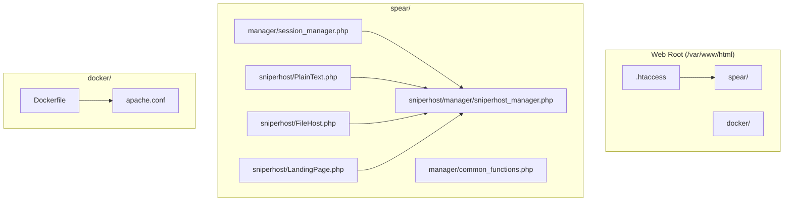
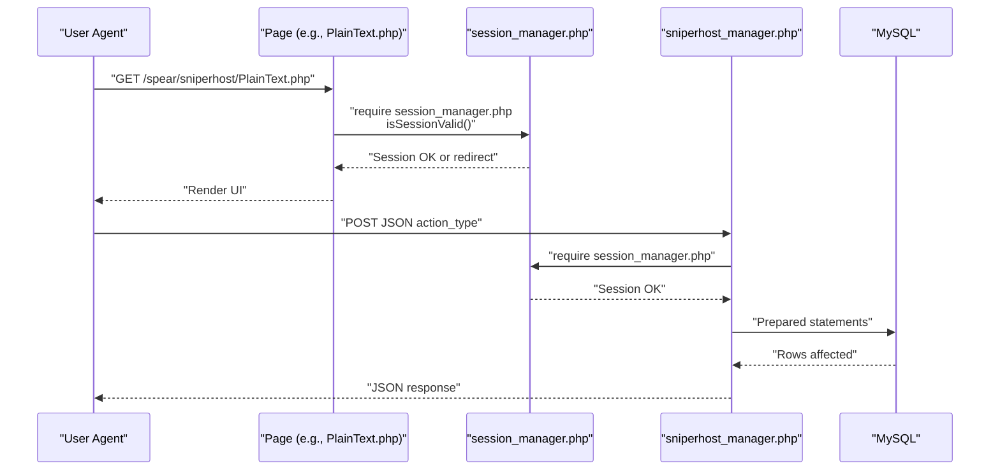
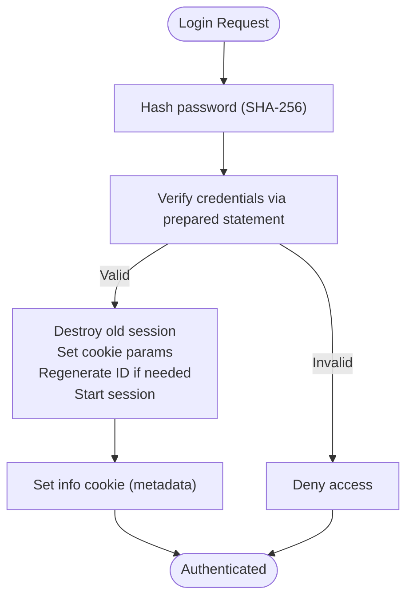
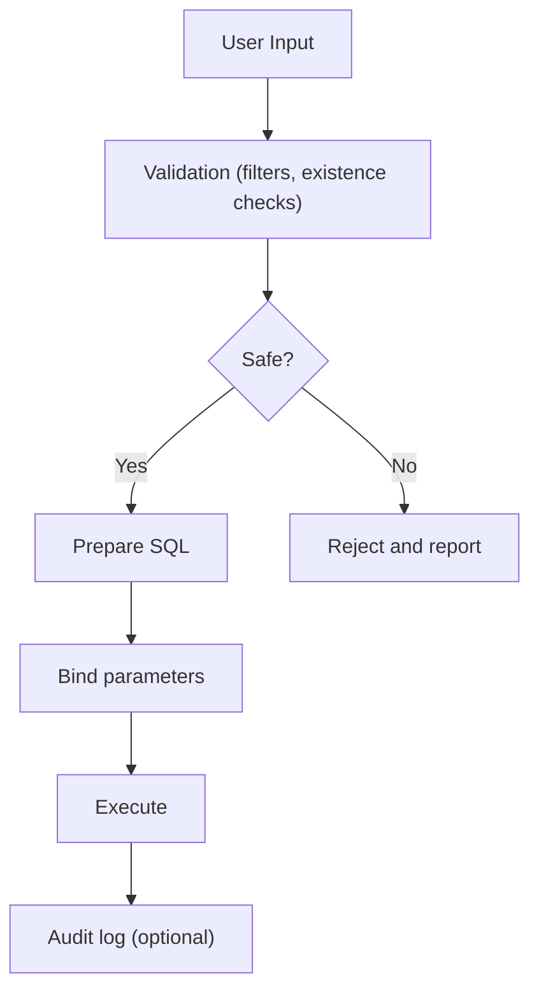
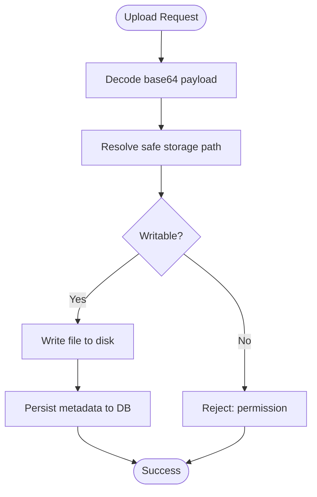
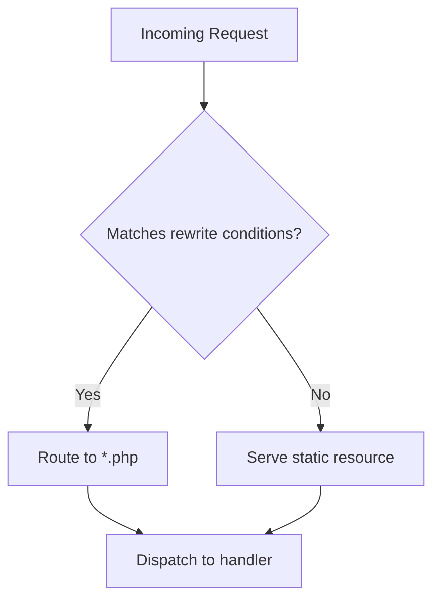
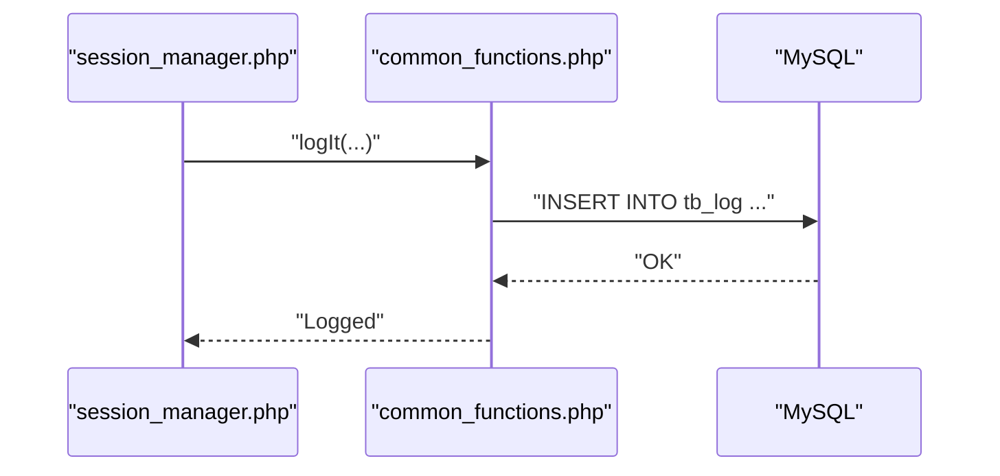
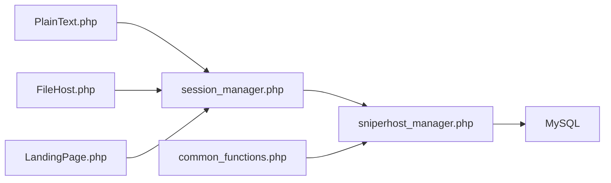

# Security Architecture

<cite>
**Referenced Files in This Document**
- [.htaccess](file://.htaccess)
- [docker/apache.conf](file://docker/apache.conf)
- [docker/Dockerfile](file://docker/Dockerfile)
- [spear/manager/session_manager.php](file://spear/manager/session_manager.php)
- [spear/manager/common_functions.php](file://spear/manager/common_functions.php)
- [spear/sniperhost/PlainText.php](file://spear/sniperhost/PlainText.php)
- [spear/sniperhost/FileHost.php](file://spear/sniperhost/FileHost.php)
- [spear/sniperhost/LandingPage.php](file://spear/sniperhost/LandingPage.php)
- [spear/sniperhost/manager/sniperhost_manager.php](file://spear/sniperhost/manager/sniperhost_manager.php)
</cite>

## Table of Contents
1. [Introduction](#introduction)
2. [Project Structure](#project-structure)
3. [Core Components](#core-components)
4. [Architecture Overview](#architecture-overview)
5. [Detailed Component Analysis](#detailed-component-analysis)
6. [Dependency Analysis](#dependency-analysis)
7. [Performance Considerations](#performance-considerations)
8. [Troubleshooting Guide](#troubleshooting-guide)
9. [Conclusion](#conclusion)
10. [Appendices](#appendices)

## Introduction
This document presents SniperPhish’s security architecture with a focus on multi-layered protections across session management, database interactions, file handling, network controls, encryption, and operational security. It synthesizes the current implementation details present in the repository to provide actionable guidance for hardening, deployment, auditing, and incident response.

## Project Structure
The application is a PHP-based web toolkit with a frontend and backend split:
- Frontend pages under spear/ (HTML/JS/CSS) and spear/sniperhost/ (specialized hosting pages)
- Backend managers under spear/manager/ and spear/sniperhost/manager/
- Docker packaging under docker/ for containerized deployment
- Apache configuration and .htaccess for URL rewriting and directory controls

**Diagram sources**
- [.htaccess:1-5](file://.htaccess#L1-L5)
- [docker/Dockerfile:1-10](file://docker/Dockerfile#L1-L10)
- [docker/apache.conf:1-13](file://docker/apache.conf#L1-L13)
- [spear/manager/session_manager.php:1-244](file://spear/manager/session_manager.php#L1-L244)
- [spear/manager/common_functions.php:1-595](file://spear/manager/common_functions.php#L1-L595)
- [spear/sniperhost/PlainText.php:1-308](file://spear/sniperhost/PlainText.php#L1-L308)
- [spear/sniperhost/FileHost.php:1-228](file://spear/sniperhost/FileHost.php#L1-L228)
- [spear/sniperhost/LandingPage.php:1-320](file://spear/sniperhost/LandingPage.php#L1-L320)
- [spear/sniperhost/manager/sniperhost_manager.php:1-314](file://spear/sniperhost/manager/sniperhost_manager.php#L1-L314)

**Section sources**
- [.htaccess:1-5](file://.htaccess#L1-L5)
- [docker/Dockerfile:1-10](file://docker/Dockerfile#L1-L10)
- [docker/apache.conf:1-13](file://docker/apache.conf#L1-L13)
- [spear/manager/session_manager.php:1-244](file://spear/manager/session_manager.php#L1-L244)
- [spear/manager/common_functions.php:1-595](file://spear/manager/common_functions.php#L1-L595)
- [spear/sniperhost/PlainText.php:1-308](file://spear/sniperhost/PlainText.php#L1-L308)
- [spear/sniperhost/FileHost.php:1-228](file://spear/sniperhost/FileHost.php#L1-L228)
- [spear/sniperhost/LandingPage.php:1-320](file://spear/sniperhost/LandingPage.php#L1-L320)
- [spear/sniperhost/manager/sniperhost_manager.php:1-314](file://spear/sniperhost/manager/sniperhost_manager.php#L1-L314)

## Core Components
- Session Manager: Centralizes session lifecycle, cookie policy, and login/logout tracking.
- Common Functions: Provides shared utilities including logging, filtering, mail transport, and IP/geolocation helpers.
- SniperHost Managers: Handle plaintext, file, and landing page hosting with database-backed persistence and filesystem writes.
- Network Controls: Apache .htaccess and Docker configs define URL rewriting and directory overrides.

Key security-relevant responsibilities:
- Session security: cookie parameters, session lifetime, regeneration, and termination.
- Database security: prepared statements, input checks, and access control records.
- Upload security: filesystem permissions, base64 decoding, and storage paths.
- Network security: URL rewriting, directory indexing, and Apache override settings.
- Logging and audit: centralized logging function and access logs via Apache.

**Section sources**
- [spear/manager/session_manager.php:17-244](file://spear/manager/session_manager.php#L17-L244)
- [spear/manager/common_functions.php:576-586](file://spear/manager/common_functions.php#L576-L586)
- [spear/sniperhost/manager/sniperhost_manager.php:1-314](file://spear/sniperhost/manager/sniperhost_manager.php#L1-L314)
- [.htaccess:1-5](file://.htaccess#L1-L5)
- [docker/apache.conf:1-13](file://docker/apache.conf#L1-L13)

## Architecture Overview
The runtime flow integrates frontend pages with backend managers and database operations. Authentication is enforced at the page level via session validation, while backend actions are protected by the same session guard.

**Diagram sources**
- [spear/sniperhost/PlainText.php:1-4](file://spear/sniperhost/PlainText.php#L1-L4)
- [spear/manager/session_manager.php:35-44](file://spear/manager/session_manager.php#L35-L44)
- [spear/sniperhost/manager/sniperhost_manager.php:1-51](file://spear/sniperhost/manager/sniperhost_manager.php#L1-L51)

## Detailed Component Analysis

### Session Security
- Cookie policy: HttpOnly and SameSite=Strict are applied to a non-HttpOnly cookie carrying user metadata. While this improves CSRF resilience, the non-HttpOnly flag increases XSS risk exposure.
- Session lifetime: Configured to 1 day with HttpOnly and SameSite=Strict; Secure=false indicates unencrypted transmission is permitted.
- Regeneration: On re-login, the session is regenerated to mitigate fixation risks.
- Termination: Explicit session destruction and optional redirect to the home page.

Recommendations:
- Set Secure=true for cookies in HTTPS deployments to prevent leakage over plaintext channels.
- Avoid storing sensitive data in non-HttpOnly cookies; prefer session storage for tokens and metadata.
- Enforce SameSite=Lax or Strict for CSRF protection and consider CSRF tokens for cross-site forms.

**Diagram sources**
- [spear/manager/session_manager.php:17-33](file://spear/manager/session_manager.php#L17-L33)
- [spear/manager/session_manager.php:215-234](file://spear/manager/session_manager.php#L215-L234)

**Section sources**
- [spear/manager/session_manager.php:46-56](file://spear/manager/session_manager.php#L46-L56)
- [spear/manager/session_manager.php:215-234](file://spear/manager/session_manager.php#L215-L234)
- [spear/manager/session_manager.php:236-243](file://spear/manager/session_manager.php#L236-L243)

### Database Security
- Prepared statements: Used consistently for all user-driven inserts/updates/deletes across managers.
- Input checks: Existence checks and whitelisting via filters before filesystem operations.
- Access control: Dedicated table and API for managing dashboard/public access per campaign/tracker.

**Diagram sources**
- [spear/sniperhost/manager/sniperhost_manager.php:99-111](file://spear/sniperhost/manager/sniperhost_manager.php#L99-L111)
- [spear/manager/common_functions.php:447-458](file://spear/manager/common_functions.php#L447-L458)

**Section sources**
- [spear/sniperhost/manager/sniperhost_manager.php:100-106](file://spear/sniperhost/manager/sniperhost_manager.php#L100-L106)
- [spear/sniperhost/manager/sniperhost_manager.php:172-174](file://spear/sniperhost/manager/sniperhost_manager.php#L172-L174)
- [spear/manager/common_functions.php:447-458](file://spear/manager/common_functions.php#L447-L458)

### File Upload Security
- Plaintext hosting: Stores base64-encoded content to disk and persists metadata to the database.
- File hosting: Accepts base64 data, decodes, and writes to a controlled path; validates directory writability.
- Landing page hosting: Writes base64-decoded HTML content to a controlled path.
- Storage paths: Guarded by directory existence and writability checks prior to file operations.

Recommendations:
- Validate MIME types and file signatures server-side before writing.
- Store uploaded files outside the web root or restrict access via .htaccess.
- Apply least privilege to the upload directories and sanitize filenames.
- Consider virus scanning integration at ingestion points.

**Diagram sources**
- [spear/sniperhost/manager/sniperhost_manager.php:194-197](file://spear/sniperhost/manager/sniperhost_manager.php#L194-L197)
- [spear/sniperhost/manager/sniperhost_manager.php:247-254](file://spear/sniperhost/manager/sniperhost_manager.php#L247-L254)

**Section sources**
- [spear/sniperhost/manager/sniperhost_manager.php:88-97](file://spear/sniperhost/manager/sniperhost_manager.php#L88-L97)
- [spear/sniperhost/manager/sniperhost_manager.php:167-171](file://spear/sniperhost/manager/sniperhost_manager.php#L167-L171)
- [spear/sniperhost/manager/sniperhost_manager.php:249-252](file://spear/sniperhost/manager/sniperhost_manager.php#L249-L252)

### Network Security
- URL rewriting: .htaccess enables rewriting rules to route requests to .php files without explicit suffix.
- Directory indexing: Disabled via Options -Indexes.
- Apache override: docker/apache.conf sets AllowOverride All for the document root, enabling .htaccess to take effect.

Recommendations:
- Restrict Apache directives to production-safe defaults.
- Harden .htaccess rules to deny sensitive paths and enforce HTTPS redirects.
- Use robots.txt and denylists to limit crawling of administrative areas.

**Diagram sources**
- [.htaccess:2-5](file://.htaccess#L2-L5)
- [docker/apache.conf](file://docker/apache.conf#L6)

**Section sources**
- [.htaccess:1-5](file://.htaccess#L1-L5)
- [docker/apache.conf:1-13](file://docker/apache.conf#L1-L13)

### Data Encryption and Password Hashing
- Password hashing: SHA-256 is used for credential verification. This is weak by modern standards; consider bcrypt or Argon2.
- Encoding algorithms: The plaintext hosting supports multiple encoding transforms (base64, base32, base85, rot13, urlencode) for output formatting.

Recommendations:
- Replace SHA-256 with a memory-hard, salted password hashing scheme (bcrypt, Argon2).
- Avoid relying solely on encoding for confidentiality; use encryption for sensitive stored data.

**Section sources**
- [spear/manager/session_manager.php:19-22](file://spear/manager/session_manager.php#L19-L22)
- [spear/sniperhost/manager/sniperhost_manager.php:55-78](file://spear/sniperhost/manager/sniperhost_manager.php#L55-L78)

### Secure Communication Protocols
- Cookie Secure flag: Currently Secure=false. For HTTPS deployments, set Secure=true to prevent transmission over plaintext networks.
- TLS enforcement: Deploy behind a reverse proxy or load balancer with TLS termination and enforce HTTPS redirects.

**Section sources**
- [spear/manager/session_manager.php:218-223](file://spear/manager/session_manager.php#L218-L223)

### Security Audit Logging and Intrusion Detection
- Centralized logging: A dedicated log function records username, event, IP, and timestamp into a database table.
- Access logs: Apache access/error logs are enabled in the Docker configuration.

Recommendations:
- Forward logs to SIEM or centralized logging systems.
- Monitor for anomalies (failed logins, repeated invalid actions, unusual file sizes).
- Add rate limiting and WAF rules for common attack vectors.

**Diagram sources**
- [spear/manager/common_functions.php:576-586](file://spear/manager/common_functions.php#L576-L586)

**Section sources**
- [spear/manager/common_functions.php:576-586](file://spear/manager/common_functions.php#L576-L586)
- [docker/apache.conf:10-12](file://docker/apache.conf#L10-L12)

### Compliance Considerations
- Data minimization: Limit stored personal data and retention periods.
- Access control: Use the built-in access control table to restrict dashboard visibility per campaign/tracker.
- Auditability: Maintain logs and ensure integrity (e.g., append-only storage).

**Section sources**
- [spear/sniperhost/manager/sniperhost_manager.php:146-195](file://spear/sniperhost/manager/sniperhost_manager.php#L146-L195)

## Dependency Analysis
High-level dependencies among security-critical components:

**Diagram sources**
- [spear/manager/session_manager.php:1-14](file://spear/manager/session_manager.php#L1-L14)
- [spear/sniperhost/manager/sniperhost_manager.php:1-10](file://spear/sniperhost/manager/sniperhost_manager.php#L1-L10)
- [spear/sniperhost/PlainText.php:1-4](file://spear/sniperhost/PlainText.php#L1-L4)
- [spear/sniperhost/FileHost.php:1-4](file://spear/sniperhost/FileHost.php#L1-L4)
- [spear/sniperhost/LandingPage.php:1-4](file://spear/sniperhost/LandingPage.php#L1-L4)

**Section sources**
- [spear/manager/session_manager.php:1-14](file://spear/manager/session_manager.php#L1-L14)
- [spear/sniperhost/manager/sniperhost_manager.php:1-10](file://spear/sniperhost/manager/sniperhost_manager.php#L1-L10)
- [spear/sniperhost/PlainText.php:1-4](file://spear/sniperhost/PlainText.php#L1-L4)
- [spear/sniperhost/FileHost.php:1-4](file://spear/sniperhost/FileHost.php#L1-L4)
- [spear/sniperhost/LandingPage.php:1-4](file://spear/sniperhost/LandingPage.php#L1-L4)

## Performance Considerations
- Prepared statements reduce parsing overhead and improve throughput for repeated queries.
- Avoid heavy synchronous operations in request handlers; offload to background jobs where feasible.
- Minimize filesystem writes by batching and validating early.

## Troubleshooting Guide
Common issues and mitigations:
- Session lock errors: The session manager starts and immediately closes the session to prevent concurrent access locks.
- Missing database configuration: The session manager checks for db.php presence and instructs installation if absent.
- Upload failures: Ensure target directories exist and are writable; verify base64 payload integrity.
- Apache overrides not taking effect: Confirm AllowOverride All is set for the document root.

**Section sources**
- [spear/manager/session_manager.php:2-11](file://spear/manager/session_manager.php#L2-L11)
- [spear/manager/session_manager.php:5-6](file://spear/manager/session_manager.php#L5-L6)
- [docker/apache.conf](file://docker/apache.conf#L6)

## Conclusion
SniperPhish implements layered security with session guards, prepared statements, and centralized logging. Strengths include strict session cookie policies, robust prepared statements, and structured access control. Areas for improvement include cookie transport security, password hashing, MIME validation, and hardened Apache defaults. Adopting the recommendations herein will strengthen defenses, improve auditability, and support compliance.

## Appendices

### Secure Deployment Guidelines
- Enforce HTTPS and set Secure=true for session cookies.
- Rotate secrets regularly and restrict database privileges to least privilege.
- Store uploads outside the web root or protect via .htaccess.
- Harden Apache and .htaccess rules; disable unnecessary modules.
- Enable WAF rules and rate limiting for common attack vectors.

### Vulnerability Assessment Checklist
- Authentication: Verify password hashing, session regeneration, and CSRF protections.
- Authorization: Confirm access control records and session validation on all endpoints.
- Input validation: Review filters and sanitization for all user-supplied data.
- Storage: Validate MIME checks, virus scanning, and secure file permissions.
- Logging: Ensure audit logs are captured and monitored.

### Incident Response Procedures
- Isolate affected systems and revoke compromised sessions.
- Review logs for attack vectors and indicators of compromise.
- Rotate secrets and re-validate access controls.
- Notify stakeholders and document remediation steps.