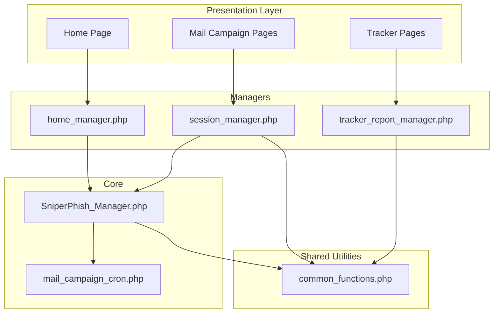
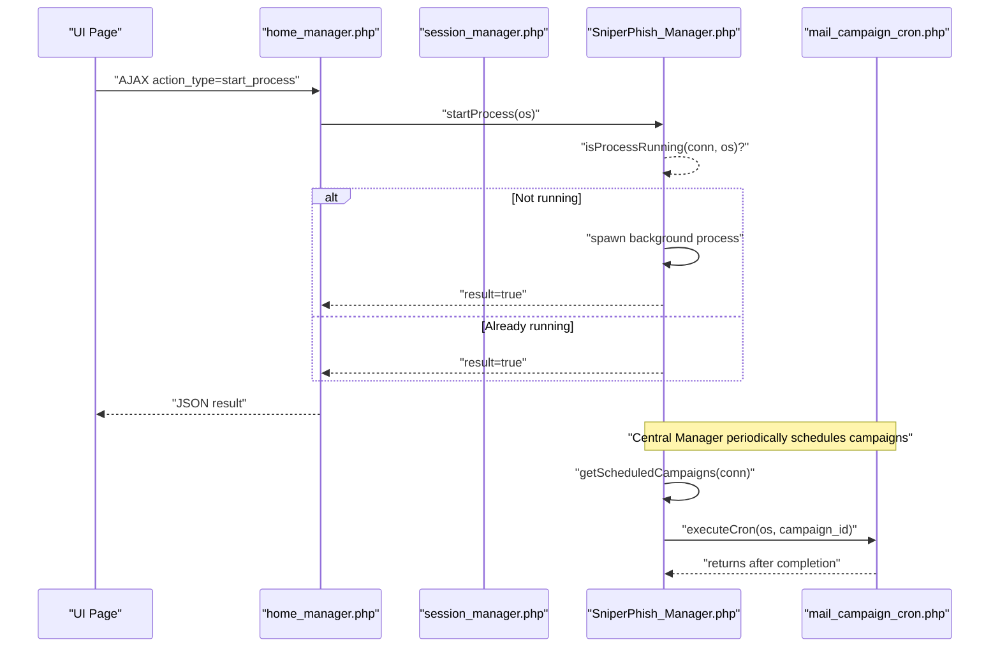
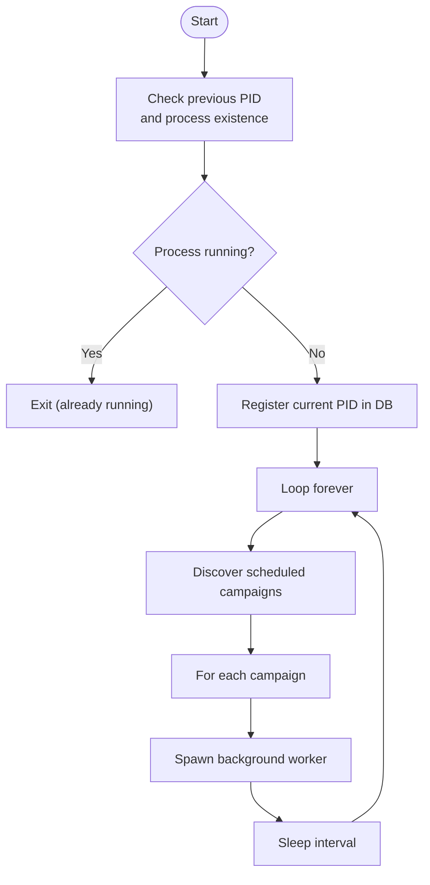
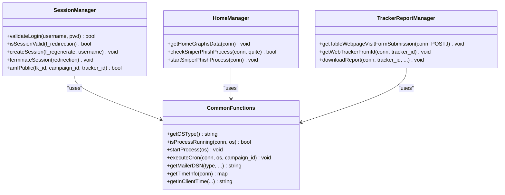
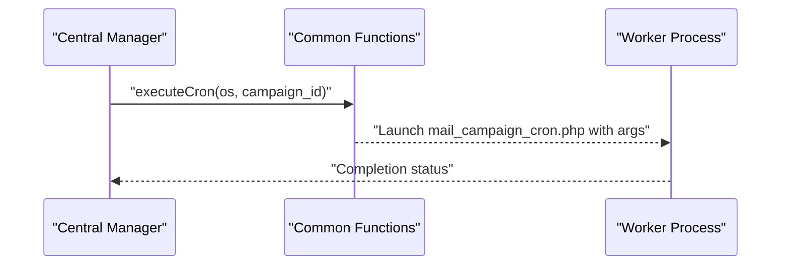
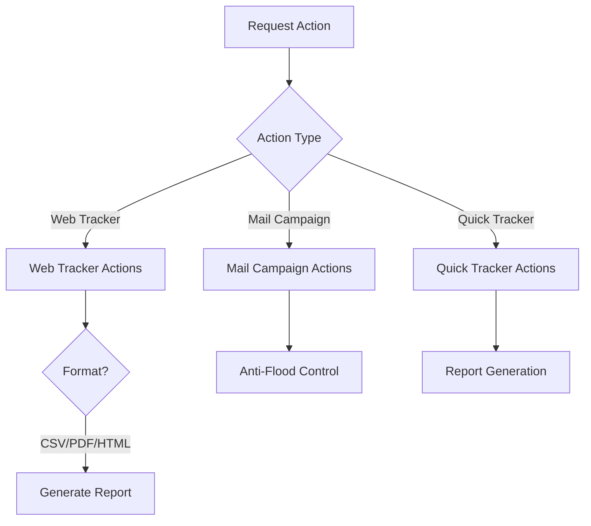
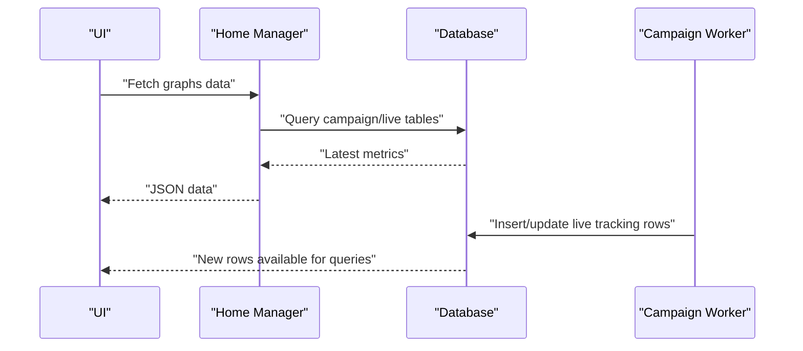
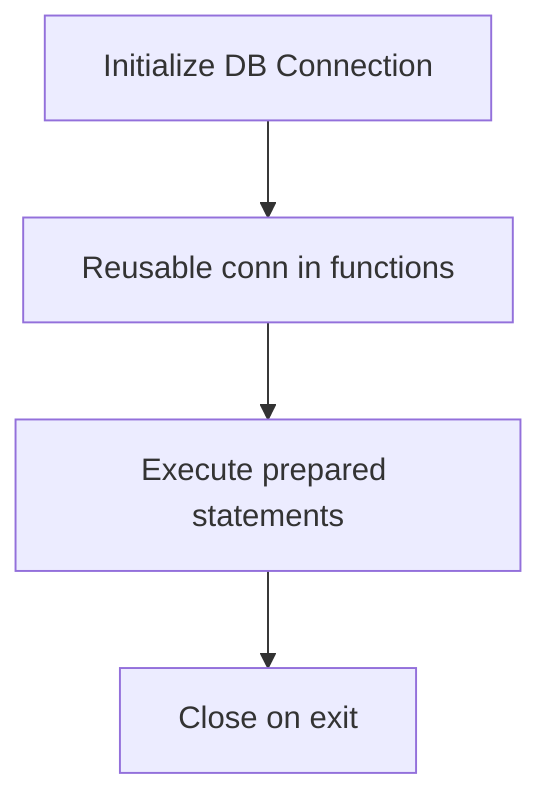
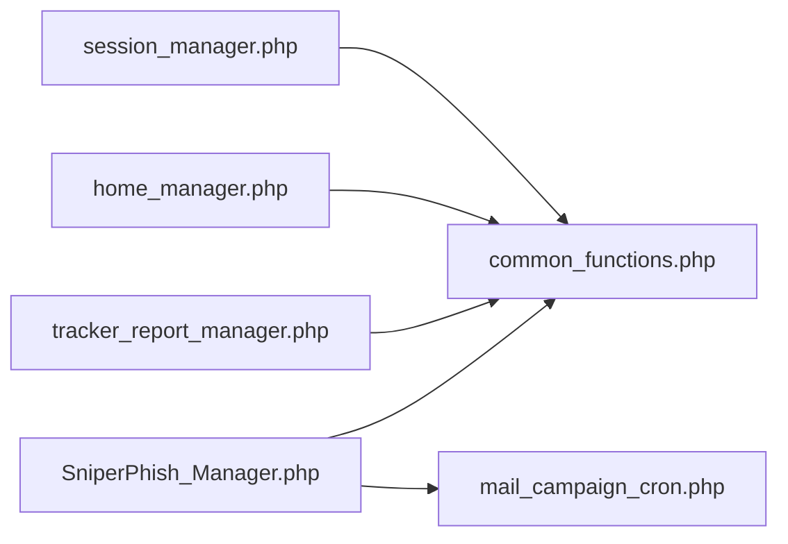

# System Design Patterns

<cite>
**Referenced Files in This Document**
- [SniperPhish_Manager.php](file://spear/core/SniperPhish_Manager.php)
- [mail_campaign_cron.php](file://spear/core/mail_campaign_cron.php)
- [common_functions.php](file://spear/manager/common_functions.php)
- [session_manager.php](file://spear/manager/session_manager.php)
- [home_manager.php](file://spear/manager/home_manager.php)
- [tracker_report_manager.php](file://spear/manager/tracker_report_manager.php)
</cite>

## Table of Contents
1. [Introduction](#introduction)
2. [Project Structure](#project-structure)
3. [Core Components](#core-components)
4. [Architecture Overview](#architecture-overview)
5. [Detailed Component Analysis](#detailed-component-analysis)
6. [Dependency Analysis](#dependency-analysis)
7. [Performance Considerations](#performance-considerations)
8. [Troubleshooting Guide](#troubleshooting-guide)
9. [Conclusion](#conclusion)

## Introduction
This document explains SniperPhish’s system design patterns with a focus on architectural patterns and implementation strategies. It details how the platform organizes business logic, coordinates background processes, and scales tracking capabilities. The analysis covers:
- Traditional MVC with Manager pattern
- Central controller coordination of cron jobs and background processes
- Singleton-like database connection usage
- Factory-style dynamic process launching
- Strategy-like selection of tracking/reporting behaviors
- Observer-like event-driven updates for real-time tracking

The goal is to help both developers and stakeholders understand how the system stays maintainable and extensible while handling asynchronous mail campaigns and real-time tracking.

## Project Structure
SniperPhish follows a layered structure:
- Presentation/UI: PHP pages under the root and Spear module (e.g., Home, MailCampaignList)
- Managers: Request handlers that encapsulate business logic and orchestrate operations
- Core: Long-running background processes and cron coordination
- Shared utilities: Common functions for OS detection, process management, mailer DSN generation, and reporting helpers

**Diagram sources**
- [SniperPhish_Manager.php](file://spear/core/SniperPhish_Manager.php)
- [mail_campaign_cron.php](file://spear/core/mail_campaign_cron.php)
- [common_functions.php](file://spear/manager/common_functions.php)
- [session_manager.php](file://spear/manager/session_manager.php)
- [home_manager.php](file://spear/manager/home_manager.php)
- [tracker_report_manager.php](file://spear/manager/tracker_report_manager.php)

**Section sources**
- [SniperPhish_Manager.php](file://spear/core/SniperPhish_Manager.php)
- [mail_campaign_cron.php](file://spear/core/mail_campaign_cron.php)
- [common_functions.php](file://spear/manager/common_functions.php)
- [session_manager.php](file://spear/manager/session_manager.php)
- [home_manager.php](file://spear/manager/home_manager.php)
- [tracker_report_manager.php](file://spear/manager/tracker_report_manager.php)

## Core Components
This section outlines the primary components and their roles in implementing the design patterns.

- Central Controller (SniperPhish_Manager.php)
  - Orchestrates long-running cron loop
  - Schedules and launches per-campaign background processes
  - Enforces single-instance execution and PID registration

- Background Process (mail_campaign_cron.php)
  - Executes a single mail campaign end-to-end
  - Handles templating, keyword replacement, QR/Barcode embedding, signing/encryption, anti-flood, retries, and status updates

- Manager Layer (session_manager.php, home_manager.php, tracker_report_manager.php)
  - Encapsulate request handling and business logic
  - Coordinate with shared utilities and database

- Shared Utilities (common_functions.php)
  - OS detection, process lifecycle, mailer DSN generation, time formatting, IP info, report helpers, logging

Benefits:
- Separation of concerns: UI pages delegate to managers; managers coordinate core tasks
- Extensibility: New managers and processes can be added without changing the central controller
- Maintainability: Shared utilities consolidate cross-cutting concerns

**Section sources**
- [SniperPhish_Manager.php](file://spear/core/SniperPhish_Manager.php)
- [mail_campaign_cron.php](file://spear/core/mail_campaign_cron.php)
- [common_functions.php](file://spear/manager/common_functions.php)
- [session_manager.php](file://spear/manager/session_manager.php)
- [home_manager.php](file://spear/manager/home_manager.php)
- [tracker_report_manager.php](file://spear/manager/tracker_report_manager.php)

## Architecture Overview
The system uses a hybrid MVC with Manager pattern:
- Controllers are thin request handlers (managers)
- Business logic is centralized in managers and shared utilities
- Core processes handle long-running tasks independently
- Managers coordinate via shared utilities and database state

**Diagram sources**
- [home_manager.php](file://spear/manager/home_manager.php)
- [session_manager.php](file://spear/manager/session_manager.php)
- [SniperPhish_Manager.php](file://spear/core/SniperPhish_Manager.php)
- [mail_campaign_cron.php](file://spear/core/mail_campaign_cron.php)

## Detailed Component Analysis

### Central Controller Pattern (Traditional MVC with Manager)
The central controller coordinates scheduling and execution of background processes. It enforces single-instance execution, registers PID, and loops through scheduled campaigns.

Key responsibilities:
- Single-instance enforcement via PID stored in database
- Periodic discovery of campaigns ready to start
- Launching per-campaign background workers
- Loop sleep to control CPU usage

**Diagram sources**
- [SniperPhish_Manager.php](file://spear/core/SniperPhish_Manager.php)

**Section sources**
- [SniperPhish_Manager.php](file://spear/core/SniperPhish_Manager.php)

### Manager Pattern Implementation
Managers encapsulate business logic and act as controllers for specific features:
- Session manager handles authentication, sessions, and public access controls
- Home manager fetches dashboard graphs and manages the central process
- Tracker report manager handles report generation and data retrieval

**Diagram sources**
- [session_manager.php](file://spear/manager/session_manager.php)
- [home_manager.php](file://spear/manager/home_manager.php)
- [tracker_report_manager.php](file://spear/manager/tracker_report_manager.php)
- [common_functions.php](file://spear/manager/common_functions.php)

**Section sources**
- [session_manager.php](file://spear/manager/session_manager.php)
- [home_manager.php](file://spear/manager/home_manager.php)
- [tracker_report_manager.php](file://spear/manager/tracker_report_manager.php)
- [common_functions.php](file://spear/manager/common_functions.php)

### Background Process Orchestration (Factory Pattern)
The central controller dynamically spawns per-campaign workers. This resembles a factory pattern where the orchestrator creates and dispatches specialized workers based on campaign identifiers.

**Diagram sources**
- [SniperPhish_Manager.php](file://spear/core/SniperPhish_Manager.php)
- [common_functions.php](file://spear/manager/common_functions.php)
- [mail_campaign_cron.php](file://spear/core/mail_campaign_cron.php)

**Section sources**
- [SniperPhish_Manager.php](file://spear/core/SniperPhish_Manager.php)
- [common_functions.php](file://spear/manager/common_functions.php)
- [mail_campaign_cron.php](file://spear/core/mail_campaign_cron.php)

### Strategy Pattern for Tracking Methods
Different tracking/reporting behaviors are selected via request actions and internal logic:
- Web tracker vs. mail campaign vs. quick tracker
- Report formats (CSV/PDF/HTML)
- Timezone and date formatting strategies

**Diagram sources**
- [tracker_report_manager.php](file://spear/manager/tracker_report_manager.php)
- [common_functions.php](file://spear/manager/common_functions.php)

**Section sources**
- [tracker_report_manager.php](file://spear/manager/tracker_report_manager.php)
- [common_functions.php](file://spear/manager/common_functions.php)

### Observer Pattern for Real-Time Updates
Real-time tracking updates occur through periodic polling and event-driven triggers:
- Campaign status transitions trigger updates
- Worker processes update live tables upon open events
- Managers poll or rely on UI-driven refresh to present latest data

**Diagram sources**
- [home_manager.php](file://spear/manager/home_manager.php)
- [mail_campaign_cron.php](file://spear/core/mail_campaign_cron.php)

**Section sources**
- [home_manager.php](file://spear/manager/home_manager.php)
- [mail_campaign_cron.php](file://spear/core/mail_campaign_cron.php)

### Singleton Pattern for Database Connections
Database connections are established per-process and reused across functions. While not a strict singleton class, the pattern is applied by globally exposing a connection resource and reusing it throughout the script lifecycle.

- Connection initialization occurs in included files
- Functions accept the connection as a parameter or use the global resource
- Benefits: reduced overhead, consistent transaction boundaries

**Diagram sources**
- [SniperPhish_Manager.php](file://spear/core/SniperPhish_Manager.php)
- [mail_campaign_cron.php](file://spear/core/mail_campaign_cron.php)
- [common_functions.php](file://spear/manager/common_functions.php)

**Section sources**
- [SniperPhish_Manager.php](file://spear/core/SniperPhish_Manager.php)
- [mail_campaign_cron.php](file://spear/core/mail_campaign_cron.php)
- [common_functions.php](file://spear/manager/common_functions.php)

## Dependency Analysis
The managers depend on shared utilities and database state. The central controller depends on managers for process lifecycle and on shared utilities for OS/process handling.

**Diagram sources**
- [session_manager.php](file://spear/manager/session_manager.php)
- [home_manager.php](file://spear/manager/home_manager.php)
- [tracker_report_manager.php](file://spear/manager/tracker_report_manager.php)
- [SniperPhish_Manager.php](file://spear/core/SniperPhish_Manager.php)
- [mail_campaign_cron.php](file://spear/core/mail_campaign_cron.php)
- [common_functions.php](file://spear/manager/common_functions.php)

**Section sources**
- [session_manager.php](file://spear/manager/session_manager.php)
- [home_manager.php](file://spear/manager/home_manager.php)
- [tracker_report_manager.php](file://spear/manager/tracker_report_manager.php)
- [SniperPhish_Manager.php](file://spear/core/SniperPhish_Manager.php)
- [mail_campaign_cron.php](file://spear/core/mail_campaign_cron.php)
- [common_functions.php](file://spear/manager/common_functions.php)

## Performance Considerations
- Central controller loop sleeps between iterations to reduce CPU usage
- Workers implement anti-flood controls and retry logic to balance throughput and provider limits
- Prepared statements and JSON decoding minimize overhead
- Timezone/date conversions are computed once per request and cached where appropriate

## Troubleshooting Guide
- Central controller not starting
  - Verify single-instance enforcement and PID registration
  - Confirm OS-specific process detection and spawning
- Campaign not sending
  - Check campaign status transitions and locking
  - Review retry counters and transport exceptions
- Reports not generated
  - Validate selected columns and format selection
  - Ensure timezone and date format configurations are set

**Section sources**
- [SniperPhish_Manager.php](file://spear/core/SniperPhish_Manager.php)
- [mail_campaign_cron.php](file://spear/core/mail_campaign_cron.php)
- [common_functions.php](file://spear/manager/common_functions.php)
- [tracker_report_manager.php](file://spear/manager/tracker_report_manager.php)

## Conclusion
SniperPhish’s architecture blends traditional MVC with a Manager pattern to achieve clear separation of concerns. The central controller coordinates long-running tasks, while managers encapsulate feature-specific logic. Shared utilities provide reusable cross-cutting capabilities. The design supports scalability through factory-style process spawning and extensibility via strategy-like selection of behaviors. These patterns collectively improve maintainability and adaptability as the system evolves.