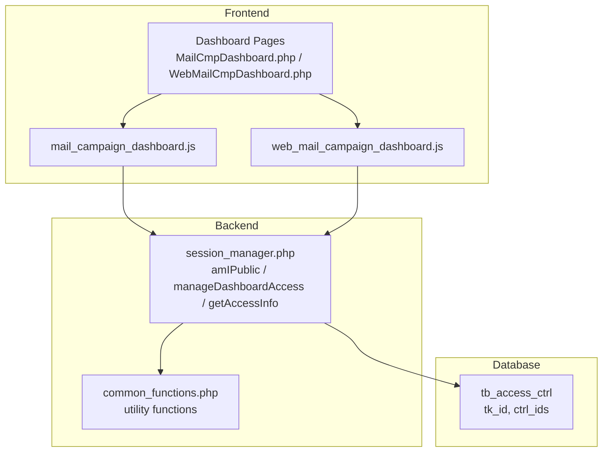
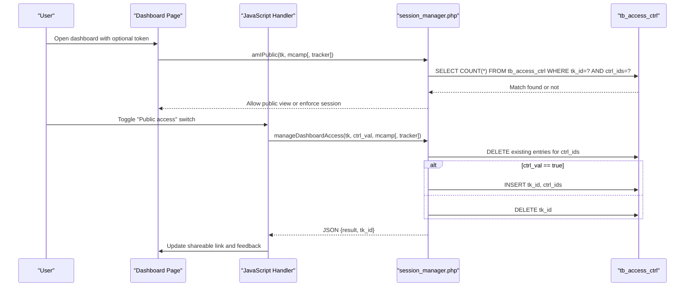
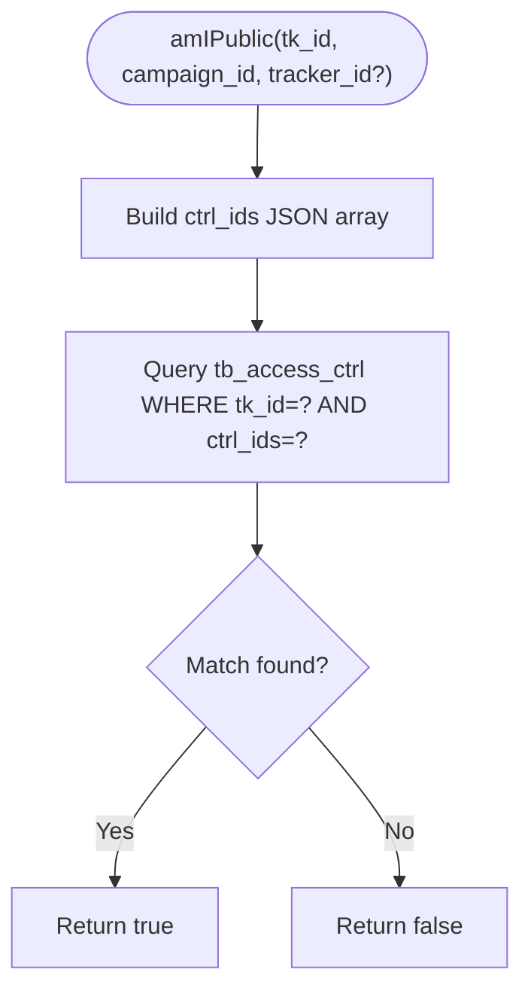
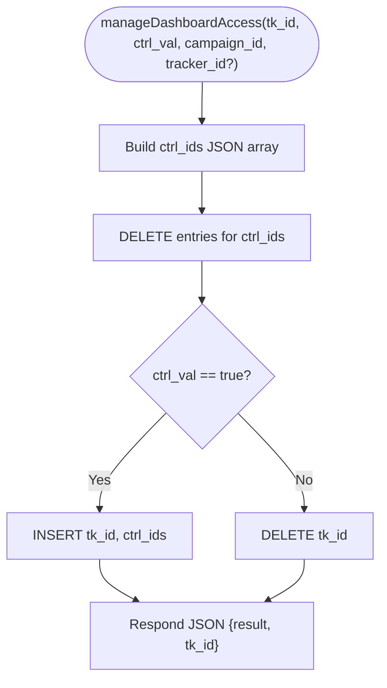
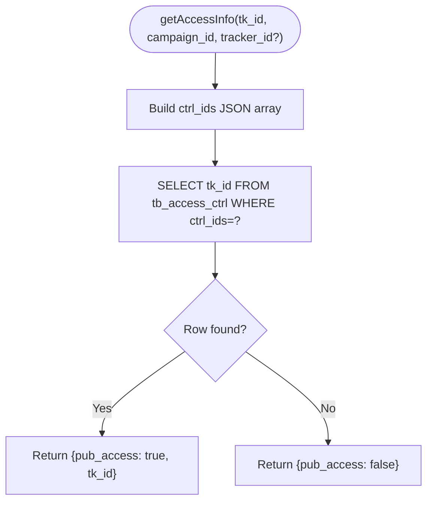
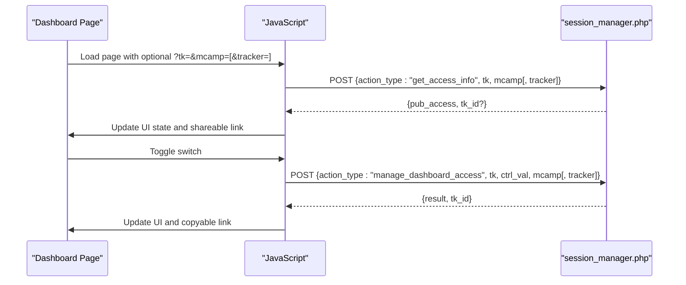
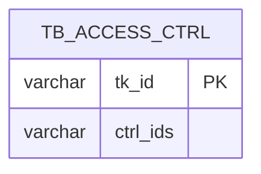
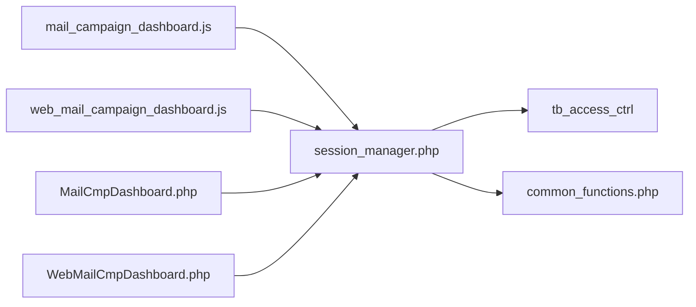

# Access Control and Public Access

<cite>
**Referenced Files in This Document**
- [session_manager.php](file://spear/manager/session_manager.php)
- [mail_campaign_dashboard.js](file://spear/js/mail_campaign_dashboard.js)
- [web_mail_campaign_dashboard.js](file://spear/js/web_mail_campaign_dashboard.js)
- [MailCmpDashboard.php](file://spear/MailCmpDashboard.php)
- [WebMailCmpDashboard.php](file://spear/WebMailCmpDashboard.php)
- [install_manager.php](file://install_manager.php)
- [common_functions.php](file://spear/manager/common_functions.php)
</cite>

## Table of Contents
1. [Introduction](#introduction)
2. [Project Structure](#project-structure)
3. [Core Components](#core-components)
4. [Architecture Overview](#architecture-overview)
5. [Detailed Component Analysis](#detailed-component-analysis)
6. [Dependency Analysis](#dependency-analysis)
7. [Performance Considerations](#performance-considerations)
8. [Troubleshooting Guide](#troubleshooting-guide)
9. [Conclusion](#conclusion)

## Introduction
This document explains the access control and public sharing mechanism for dashboards in the application. It focuses on:
- How public access is validated via the amIPublic function
- How administrators enable or disable public access using manageDashboardAccess
- How current access state is retrieved via getAccessInfo
- The integration with the tb_access_ctrl table for managing access control IDs
- The AJAX-driven workflow for configuring and validating access
- Security considerations and best practices for protecting resources

## Project Structure
The access control system spans frontend JavaScript, backend PHP, and database schema:
- Frontend: Dashboard pages and JavaScript handlers for toggling public access and rendering shareable links
- Backend: Session manager that validates tokens, manages access entries, and exposes JSON endpoints
- Database: A dedicated table for storing access control records keyed by tokens

**Diagram sources**
- [MailCmpDashboard.php:413-421](file://spear/MailCmpDashboard.php#L413-L421)
- [WebMailCmpDashboard.php:639-647](file://spear/WebMailCmpDashboard.php#L639-L647)
- [mail_campaign_dashboard.js:854-884](file://spear/js/mail_campaign_dashboard.js#L854-L884)
- [web_mail_campaign_dashboard.js:1459-1490](file://spear/js/web_mail_campaign_dashboard.js#L1459-L1490)
- [session_manager.php:97-195](file://spear/manager/session_manager.php#L97-L195)
- [install_manager.php:208-214](file://install_manager.php#L208-L214)

**Section sources**
- [MailCmpDashboard.php:413-421](file://spear/MailCmpDashboard.php#L413-L421)
- [WebMailCmpDashboard.php:639-647](file://spear/WebMailCmpDashboard.php#L639-L647)
- [mail_campaign_dashboard.js:854-884](file://spear/js/mail_campaign_dashboard.js#L854-L884)
- [web_mail_campaign_dashboard.js:1459-1490](file://spear/js/web_mail_campaign_dashboard.js#L1459-L1490)
- [session_manager.php:97-195](file://spear/manager/session_manager.php#L97-L195)
- [install_manager.php:208-214](file://install_manager.php#L208-L214)

## Core Components
- amIPublic(tk_id, campaign_id, tracker_id?): Validates whether a given token grants access to a specific campaign and optional tracker.
- manageDashboardAccess(tk_id, ctrl_val, campaign_id, tracker_id?): Enables or disables public access by inserting/removing entries in tb_access_ctrl.
- getAccessInfo(tk_id, campaign_id, tracker_id?): Returns whether public access is currently enabled for the given identifiers and the associated token.
- tb_access_ctrl: Stores access control records with a unique token and a serialized control identifier array.

These components work together to provide a JSON-based access management interface backed by AJAX requests from the dashboard pages.

**Section sources**
- [session_manager.php:97-195](file://spear/manager/session_manager.php#L97-L195)
- [install_manager.php:208-214](file://install_manager.php#L208-L214)

## Architecture Overview
The access control workflow integrates user authentication, session validation, and public access management:

**Diagram sources**
- [MailCmpDashboard.php:413-421](file://spear/MailCmpDashboard.php#L413-L421)
- [WebMailCmpDashboard.php:639-647](file://spear/WebMailCmpDashboard.php#L639-L647)
- [mail_campaign_dashboard.js:854-884](file://spear/js/mail_campaign_dashboard.js#L854-L884)
- [web_mail_campaign_dashboard.js:1459-1490](file://spear/js/web_mail_campaign_dashboard.js#L1459-L1490)
- [session_manager.php:97-195](file://spear/manager/session_manager.php#L97-L195)

## Detailed Component Analysis

### amIPublic Function
Purpose: Determine if a token grants access to a campaign (and optionally a tracker). It constructs a control identifier array, serializes it, and queries tb_access_ctrl for a matching record.

Key behaviors:
- Accepts a token and campaign identifier; optional tracker identifier
- Serializes identifiers into a single control string
- Performs a database lookup to check existence of a matching record
- Returns a boolean indicating access granted

**Diagram sources**
- [session_manager.php:97-113](file://spear/manager/session_manager.php#L97-L113)

**Section sources**
- [session_manager.php:97-113](file://spear/manager/session_manager.php#L97-L113)

### manageDashboardAccess Function
Purpose: Enable or disable public access for a campaign and optional tracker by manipulating tb_access_ctrl.

Key behaviors:
- Accepts a token, a boolean flag, campaign identifier, and optional tracker identifier
- Deletes any existing entries for the same control identifiers
- If enabling access, inserts a new record with the token and control identifiers
- If disabling access, deletes the record for the token
- Returns a JSON result with operation outcome and the token used

**Diagram sources**
- [session_manager.php:146-175](file://spear/manager/session_manager.php#L146-L175)

**Section sources**
- [session_manager.php:146-175](file://spear/manager/session_manager.php#L146-L175)

### getAccessInfo Function
Purpose: Retrieve the current public access state for a given token and identifiers.

Key behaviors:
- Accepts a token and campaign identifier; optional tracker identifier
- Builds the control identifiers and queries tb_access_ctrl for any token bound to those identifiers
- Returns a JSON object indicating whether public access is enabled and the associated token

**Diagram sources**
- [session_manager.php:177-195](file://spear/manager/session_manager.php#L177-L195)

**Section sources**
- [session_manager.php:177-195](file://spear/manager/session_manager.php#L177-L195)

### Frontend Integration and AJAX Workflow
- Dashboard pages render a “Public access” toggle switch and a shareable link area.
- On toggle change, JavaScript sends an AJAX POST to the session manager with action_type manage_dashboard_access.
- On page load, JavaScript calls get_access_info to pre-check and reflect current state.
- When accessed publicly, the page hides private UI elements and displays only the public dashboard.

**Diagram sources**
- [mail_campaign_dashboard.js:854-906](file://spear/js/mail_campaign_dashboard.js#L854-L906)
- [web_mail_campaign_dashboard.js:1459-1513](file://spear/js/web_mail_campaign_dashboard.js#L1459-L1513)
- [MailCmpDashboard.php:413-421](file://spear/MailCmpDashboard.php#L413-L421)
- [WebMailCmpDashboard.php:639-647](file://spear/WebMailCmpDashboard.php#L639-L647)

**Section sources**
- [mail_campaign_dashboard.js:854-906](file://spear/js/mail_campaign_dashboard.js#L854-L906)
- [web_mail_campaign_dashboard.js:1459-1513](file://spear/js/web_mail_campaign_dashboard.js#L1459-L1513)
- [MailCmpDashboard.php:413-421](file://spear/MailCmpDashboard.php#L413-L421)
- [WebMailCmpDashboard.php:639-647](file://spear/WebMailCmpDashboard.php#L639-L647)

### Database Schema and Access Control ID Management
- Table: tb_access_ctrl
  - Columns: tk_id (unique token), ctrl_ids (serialized control identifiers)
  - Purpose: Store which tokens are authorized for specific campaigns and trackers
- Access control ID management:
  - Control identifiers are JSON arrays containing campaign_id and optionally tracker_id
  - Entries are keyed by tk_id for per-token access and by ctrl_ids for cross-token lookup during info retrieval

**Diagram sources**
- [install_manager.php:208-214](file://install_manager.php#L208-L214)

**Section sources**
- [install_manager.php:208-214](file://install_manager.php#L208-L214)
- [session_manager.php:146-195](file://spear/manager/session_manager.php#L146-L195)

## Dependency Analysis
- Frontend depends on:
  - Dashboard pages for rendering UI and initial state
  - JavaScript handlers for AJAX interactions and UI updates
- Backend depends on:
  - Database connectivity and tb_access_ctrl schema
  - Utility functions for filtering and validation
- Coupling and cohesion:
  - Functions are cohesive around access control operations
  - Minimal coupling to external systems; relies on JSON endpoints and database

**Diagram sources**
- [mail_campaign_dashboard.js:854-906](file://spear/js/mail_campaign_dashboard.js#L854-L906)
- [web_mail_campaign_dashboard.js:1459-1513](file://spear/js/web_mail_campaign_dashboard.js#L1459-L1513)
- [session_manager.php:97-195](file://spear/manager/session_manager.php#L97-L195)
- [MailCmpDashboard.php:413-421](file://spear/MailCmpDashboard.php#L413-L421)
- [WebMailCmpDashboard.php:639-647](file://spear/WebMailCmpDashboard.php#L639-L647)
- [common_functions.php:447-458](file://spear/manager/common_functions.php#L447-L458)

**Section sources**
- [session_manager.php:97-195](file://spear/manager/session_manager.php#L97-L195)
- [common_functions.php:447-458](file://spear/manager/common_functions.php#L447-L458)

## Performance Considerations
- Database queries are lightweight (COUNT and single-row SELECT/INSERT/DELETE) and indexed by tk_id
- JSON serialization of control identifiers is O(n) with small n (typically 1–2 identifiers)
- Minimize repeated AJAX calls by caching tk_id and only updating on toggle or regeneration
- Ensure database connections are reused and statements prepared to reduce overhead

## Troubleshooting Guide
Common issues and resolutions:
- Token mismatch or expired token:
  - Verify the token passed in the URL corresponds to the intended campaign/tracker
  - Regenerate the token using the “Regenerate Link” action in the UI
- Public access not applying:
  - Confirm manageDashboardAccess returned success and updated tk_id
  - Check that the control identifiers (campaign_id and optional tracker_id) match the intended scope
- Access state not reflected:
  - Ensure getAccessInfo is called on page load and after toggling
  - Verify the page logic that hides private UI elements when public access is detected
- Database integrity:
  - Confirm tb_access_ctrl exists and is properly initialized during installation
  - Clean orphaned entries if campaign/tracker IDs are removed by re-syncing control identifiers

Security considerations:
- Authorization checks:
  - Always validate tokens against tb_access_ctrl before serving public content
  - Enforce session validation for administrative actions and sensitive operations
- Prevent unauthorized access:
  - Do not expose administrative endpoints without prior authentication
  - Sanitize and validate identifiers to prevent injection attacks
- Session hygiene:
  - Use secure, HttpOnly cookies with SameSite policies
  - Rotate session IDs after login and on sensitive operations

**Section sources**
- [session_manager.php:97-195](file://spear/manager/session_manager.php#L97-L195)
- [MailCmpDashboard.php:413-421](file://spear/MailCmpDashboard.php#L413-L421)
- [WebMailCmpDashboard.php:639-647](file://spear/WebMailCmpDashboard.php#L639-L647)

## Conclusion
The access control system provides a robust, JSON-backed mechanism for managing public dashboard access. By combining token-based validation, serialized control identifiers, and AJAX-driven UI updates, it enables flexible sharing while maintaining clear authorization boundaries. Proper session validation, input sanitization, and database integrity checks are essential to prevent unauthorized access and ensure reliable operation.