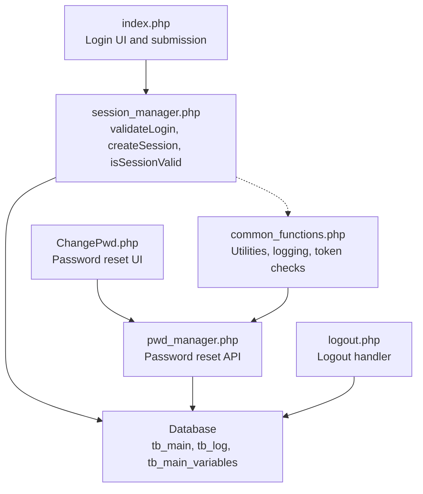
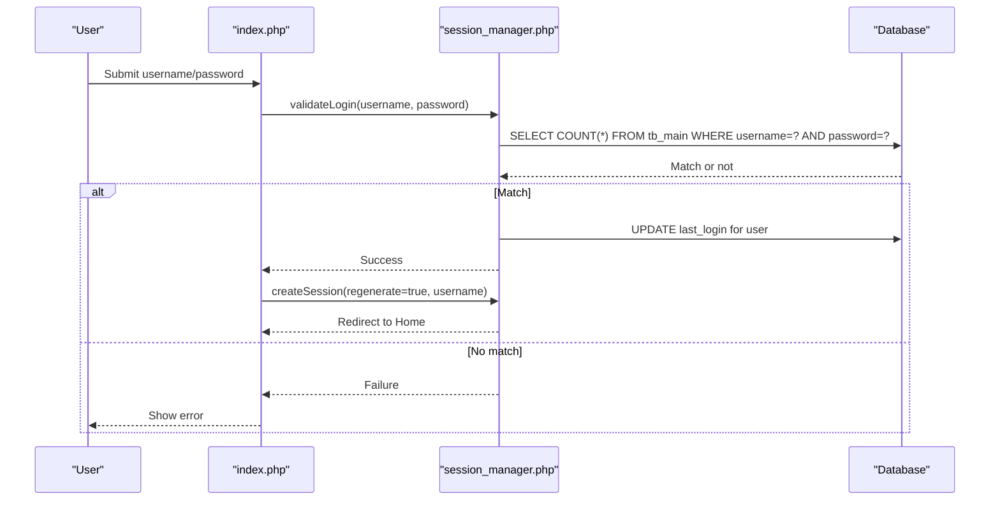
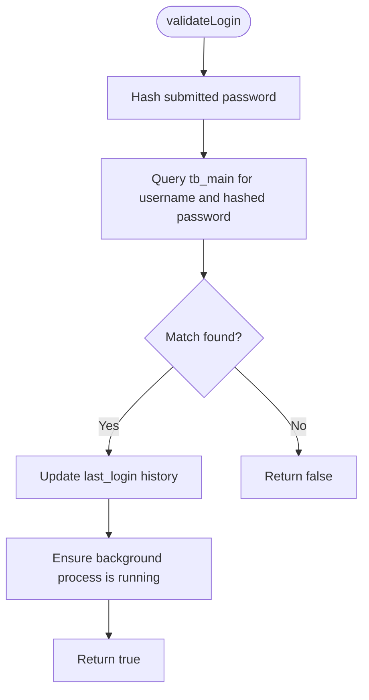
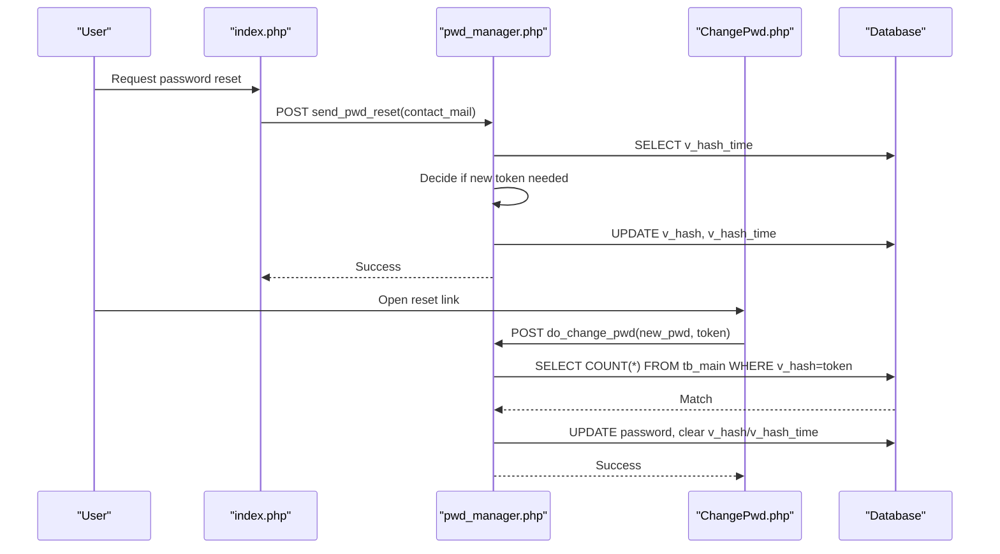
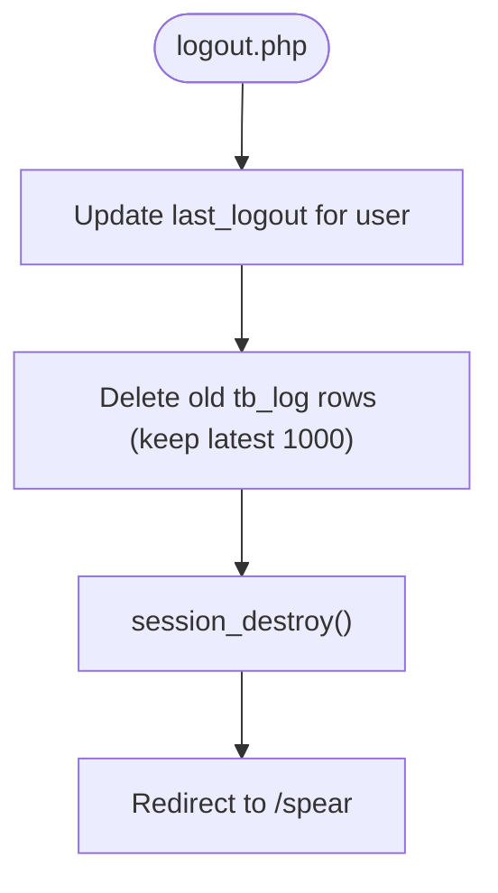
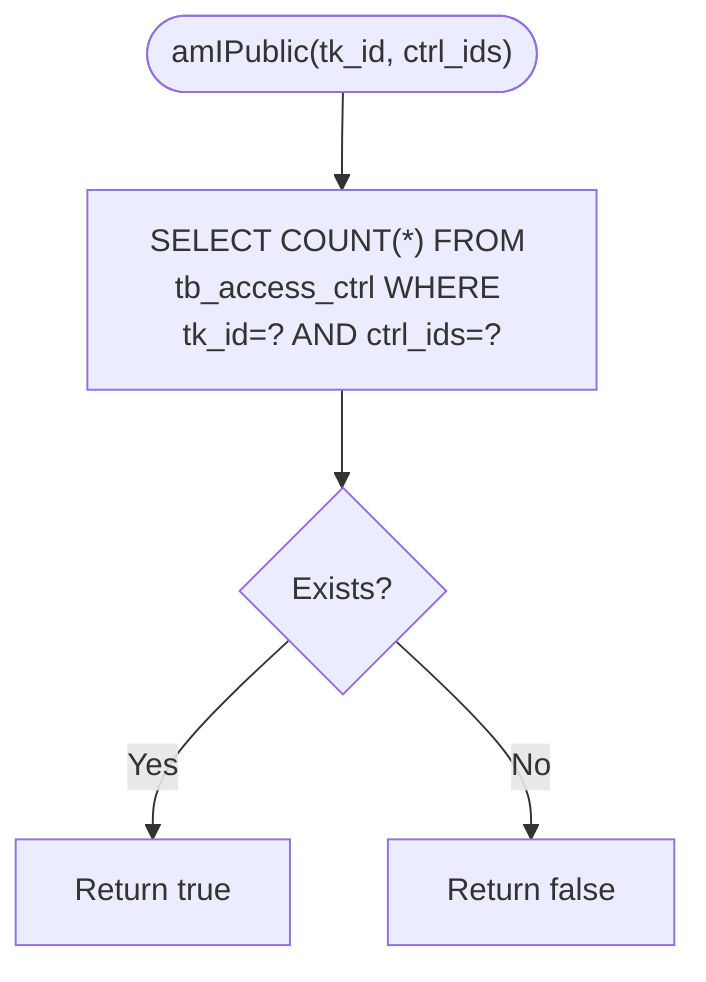
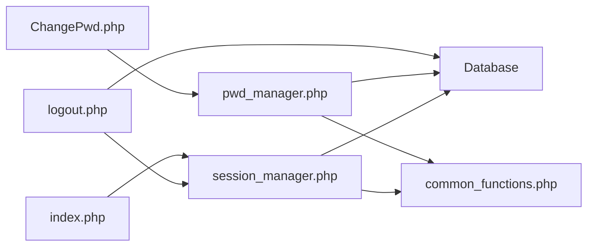

# Authentication and Session Management

<cite>
**Referenced Files in This Document**
- [session_manager.php](file://spear/manager/session_manager.php)
- [pwd_manager.php](file://spear/manager/pwd_manager.php)
- [index.php](file://spear/index.php)
- [logout.php](file://spear/logout.php)
- [ChangePwd.php](file://ChangePwd.php)
- [common_functions.php](file://spear/manager/common_functions.php)
- [install_manager.php](file://install_manager.php)
</cite>

## Table of Contents
1. [Introduction](#introduction)
2. [Project Structure](#project-structure)
3. [Core Components](#core-components)
4. [Architecture Overview](#architecture-overview)
5. [Detailed Component Analysis](#detailed-component-analysis)
6. [Dependency Analysis](#dependency-analysis)
7. [Performance Considerations](#performance-considerations)
8. [Troubleshooting Guide](#troubleshooting-guide)
9. [Conclusion](#conclusion)

## Introduction
This document explains the authentication and session management subsystem of the application, focusing on user authentication flow, session security, and password management. It details how sessions are validated, created, and terminated; how passwords are reset securely; and how access control integrates with session state. It also documents the relationship with database authentication tables and session storage mechanisms, and addresses common security concerns such as session hijacking prevention, CSRF protection, and secure password handling.

## Project Structure
The authentication and session management logic spans several files:
- Login and session orchestration: session_manager.php
- Password reset flow: pwd_manager.php and ChangePwd.php
- Logout handler: logout.php
- Entry point and login UI: index.php
- Shared utilities and helpers: common_functions.php
- Database schema for authentication and logs: install_manager.php

**Diagram sources**
- [index.php](file://spear/index.php)
- [session_manager.php](file://spear/manager/session_manager.php)
- [pwd_manager.php](file://spear/manager/pwd_manager.php)
- [ChangePwd.php](file://ChangePwd.php)
- [logout.php](file://spear/logout.php)
- [common_functions.php](file://spear/manager/common_functions.php)
- [install_manager.php](file://install_manager.php)

**Section sources**
- [index.php](file://spear/index.php)
- [session_manager.php](file://spear/manager/session_manager.php)
- [pwd_manager.php](file://spear/manager/pwd_manager.php)
- [ChangePwd.php](file://ChangePwd.php)
- [logout.php](file://spear/logout.php)
- [common_functions.php](file://spear/manager/common_functions.php)
- [install_manager.php](file://install_manager.php)

## Core Components
- session_manager.php
  - Validates credentials against the database using a hashed password comparison.
  - Creates and regenerates sessions with secure cookie parameters.
  - Tracks login/logout history per user.
  - Provides public access control utilities for dashboards.
- pwd_manager.php
  - Implements password reset initiation and completion via a token mechanism.
  - Sends reset emails and updates the user’s password after validation.
- ChangePwd.php
  - Provides the user-facing UI to submit a new password using a token.
- logout.php
  - Updates logout history, cleans up old logs, and destroys the session.
- common_functions.php
  - Supplies shared utilities including token validity checks, logging, and server variable helpers.
- install_manager.php
  - Defines the database schema for authentication and logging, including the main user table and related variables/logs.

**Section sources**
- [session_manager.php](file://spear/manager/session_manager.php)
- [pwd_manager.php](file://spear/manager/pwd_manager.php)
- [ChangePwd.php](file://ChangePwd.php)
- [logout.php](file://spear/logout.php)
- [common_functions.php](file://spear/manager/common_functions.php)
- [install_manager.php](file://install_manager.php)

## Architecture Overview
The authentication subsystem follows a layered approach:
- Presentation layer: index.php handles login UI and posts credentials.
- Session management: session_manager.php validates credentials, creates/refreshes sessions, and tracks access.
- Password reset: pwd_manager.php orchestrates token-based resets; ChangePwd.php renders the reset UI.
- Cleanup: logout.php updates logs and terminates sessions.
- Utilities: common_functions.php centralizes shared helpers.
- Persistence: install_manager.php defines the schema for tb_main, tb_log, and tb_main_variables.

**Diagram sources**
- [index.php](file://spear/index.php)
- [session_manager.php](file://spear/manager/session_manager.php)
- [install_manager.php](file://install_manager.php)

## Detailed Component Analysis

### session_manager.php: Login Validation, Session Creation, and Automatic Logout
- Session lifecycle
  - Ensures session is started and closed early to prevent locks.
  - Provides isSessionValid to refresh session expiry and redirect if not authenticated.
  - createSession manages cookie parameters, optional session regeneration, and sets a user info cookie.
  - terminateSession destroys the session and optionally redirects to the home page.
- Login validation
  - validateLogin hashes the submitted password and compares with stored hash.
  - On success, updates login history and starts a background process if not running.
- Cookie management
  - setInfoCookie stores user metadata in a cookie with SameSite=Strict and HttpOnly=false.
- Public access control
  - amIPublic and related functions manage dashboard access controls using a control ID mapping.

**Diagram sources**
- [session_manager.php](file://spear/manager/session_manager.php)
- [install_manager.php](file://install_manager.php)

**Section sources**
- [session_manager.php](file://spear/manager/session_manager.php)

### pwd_manager.php: Password Changes and Security Policies
- Password reset initiation
  - sendPwdReset checks if a user exists by email, decides whether to generate a new reset token based on expiration, updates v_hash and v_hash_time, and sends a reset email.
- Token validity and reset
  - isTokenValid checks token presence and freshness (two-day window).
  - doChangePwd verifies the token, hashes the new password, and updates tb_main with the new password and clears the token fields.
- Frontend integration
  - ChangePwd.php renders a form to submit the new password and token, then posts to pwd_manager.php.

**Diagram sources**
- [pwd_manager.php](file://spear/manager/pwd_manager.php)
- [ChangePwd.php](file://ChangePwd.php)
- [common_functions.php](file://spear/manager/common_functions.php)
- [install_manager.php](file://install_manager.php)

**Section sources**
- [pwd_manager.php](file://spear/manager/pwd_manager.php)
- [ChangePwd.php](file://ChangePwd.php)
- [common_functions.php](file://spear/manager/common_functions.php)

### logout.php: Logout Process and Session Cleanup
- Updates logout history for the current user.
- Cleans up tb_log by keeping only the latest 1000 entries.
- Destroys the session and redirects to the application root.

**Diagram sources**
- [logout.php](file://spear/logout.php)
- [install_manager.php](file://install_manager.php)

**Section sources**
- [logout.php](file://spear/logout.php)

### Access Control and Public Dashboards
- amIPublic checks whether a given tokenized control ID allows public access to a dashboard.
- manageDashboardAccess toggles access by inserting/deleting records in tb_access_ctrl.
- getAccessInfo retrieves the current access state for a given control ID.

**Diagram sources**
- [session_manager.php](file://spear/manager/session_manager.php)
- [install_manager.php](file://install_manager.php)

**Section sources**
- [session_manager.php](file://spear/manager/session_manager.php)

## Dependency Analysis
- session_manager.php depends on:
  - Database connection via db.php (resolved at runtime).
  - common_functions.php for shared utilities (e.g., logging, time conversions).
  - tb_main for credential verification and login/logout tracking.
  - tb_log for audit trails.
- pwd_manager.php depends on:
  - session_manager.php for session context.
  - common_functions.php for token validity and server variable retrieval.
  - tb_main for user existence, token storage, and password updates.
- logout.php depends on:
  - session_manager.php for updateLoginLogout.
  - tb_log cleanup logic.
- ChangePwd.php depends on:
  - pwd_manager.php for the reset endpoint.
  - common_functions.php for token validation.

**Diagram sources**
- [session_manager.php](file://spear/manager/session_manager.php)
- [pwd_manager.php](file://spear/manager/pwd_manager.php)
- [logout.php](file://spear/logout.php)
- [index.php](file://spear/index.php)
- [ChangePwd.php](file://ChangePwd.php)
- [common_functions.php](file://spear/manager/common_functions.php)
- [install_manager.php](file://install_manager.php)

**Section sources**
- [session_manager.php](file://spear/manager/session_manager.php)
- [pwd_manager.php](file://spear/manager/pwd_manager.php)
- [logout.php](file://spear/logout.php)
- [index.php](file://spear/index.php)
- [ChangePwd.php](file://ChangePwd.php)
- [common_functions.php](file://spear/manager/common_functions.php)
- [install_manager.php](file://install_manager.php)

## Performance Considerations
- Session handling
  - Early closing of the session after start prevents concurrent write locks and improves scalability under load.
  - Optional session regeneration during re-authentication reduces session fixation risk.
- Database queries
  - Use prepared statements consistently to mitigate SQL injection and improve performance with query plan caching.
  - Limit log retention to a fixed number of entries to keep tb_log compact and queries fast.
- Password reset
  - Token generation and reuse policy avoids unnecessary writes and ensures controlled reset windows.

[No sources needed since this section provides general guidance]

## Troubleshooting Guide
- Login fails immediately
  - Verify database connectivity and that tb_main contains the expected user record with a matching hashed password.
  - Confirm validateLogin is invoked with correct credentials and that hashing matches the stored scheme.
- Session not persisting
  - Ensure cookies are not blocked and SameSite/Secure/HttpOnly settings are compatible with deployment (note: session cookie is configured with secure=false).
  - Check that session_start is called before any output and that session_write_close is used appropriately.
- Password reset link invalid
  - Confirm token freshness via isTokenValid and that the token exists in tb_main with a recent v_hash_time.
  - Verify email delivery and that the reset UI receives the token from the URL.
- Logout not cleaning up logs
  - Ensure the cleanup query executes and that permissions allow DELETE on tb_log.

**Section sources**
- [session_manager.php](file://spear/manager/session_manager.php)
- [pwd_manager.php](file://spear/manager/pwd_manager.php)
- [logout.php](file://spear/logout.php)
- [common_functions.php](file://spear/manager/common_functions.php)
- [install_manager.php](file://install_manager.php)

## Conclusion
The authentication and session management subsystem implements a straightforward, database-backed login flow with session lifecycle controls, secure cookie parameters, and a token-based password reset mechanism. By leveraging prepared statements, session regeneration, and strict log retention, it balances usability with security. For production hardening, consider enabling HTTPS for secure cookies, adding CSRF protections, enforcing stronger password policies, and integrating rate limiting for login attempts.