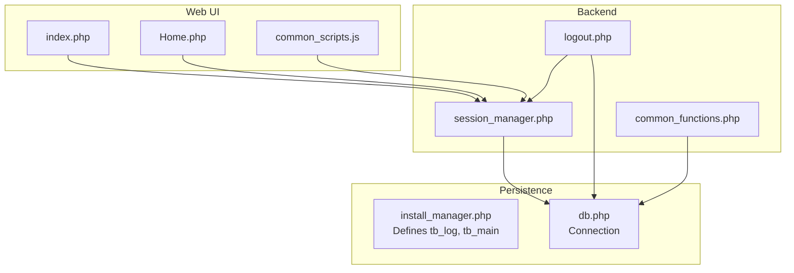
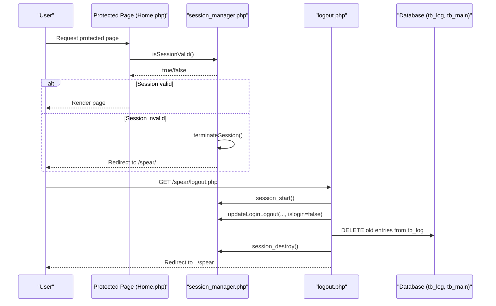
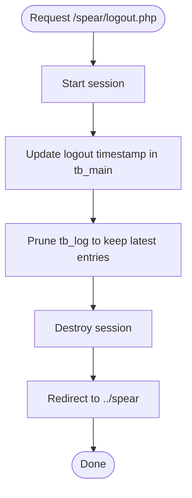
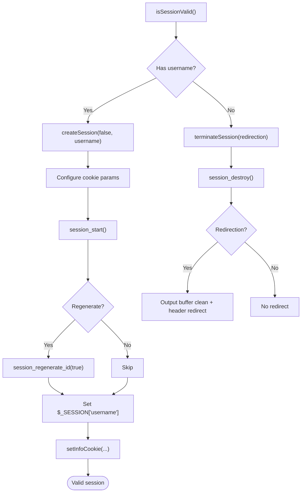
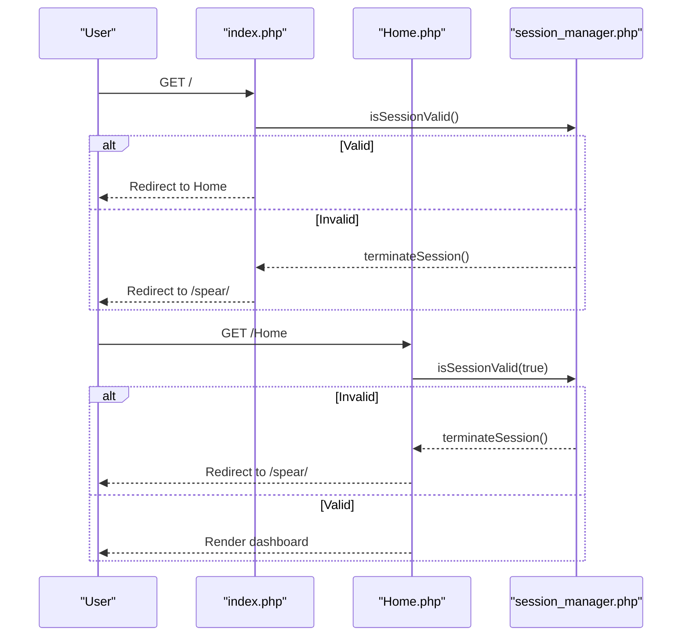
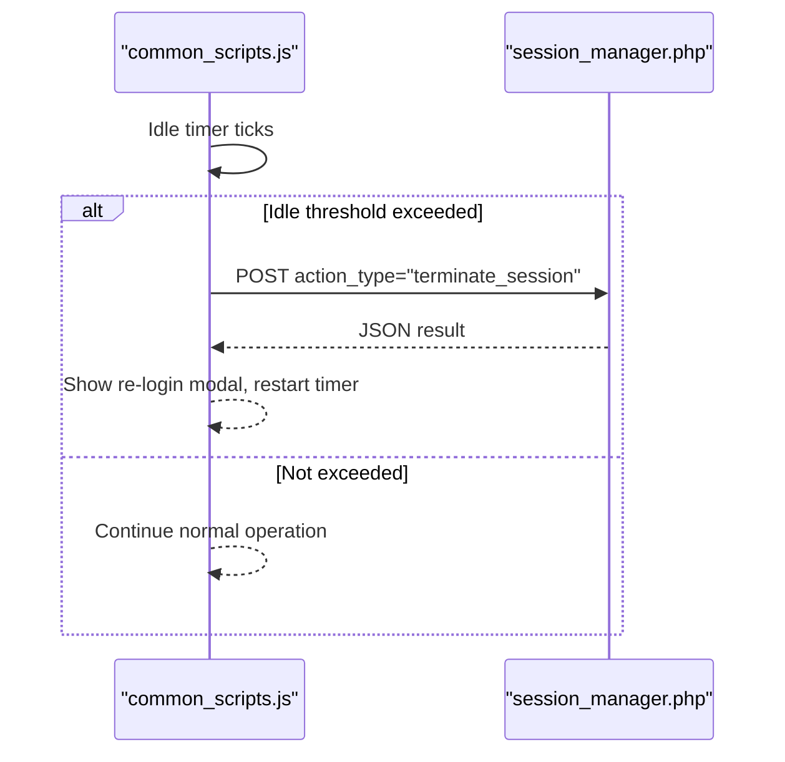
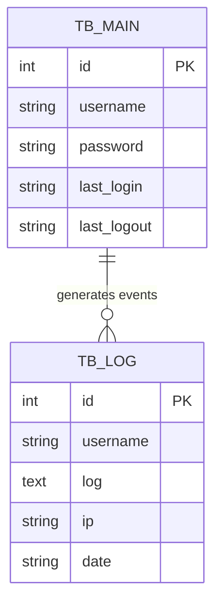
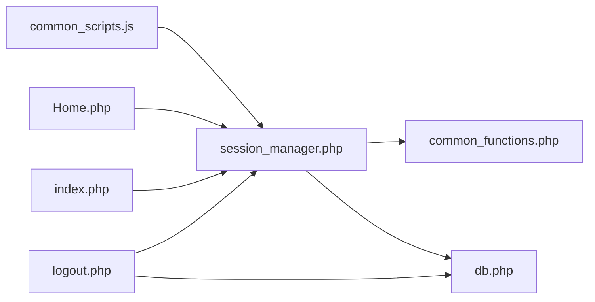

# Logout and Session Cleanup

<cite>
**Referenced Files in This Document**
- [logout.php](file://spear/logout.php)
- [session_manager.php](file://spear/manager/session_manager.php)
- [index.php](file://spear/index.php)
- [Home.php](file://spear/Home.php)
- [common_scripts.js](file://spear/js/common_scripts.js)
- [install_manager.php](file://install_manager.php)
- [install.php](file://install.php)
- [db.php](file://spear/config/db.php)
- [common_functions.php](file://spear/manager/common_functions.php)
</cite>

## Table of Contents
1. [Introduction](#introduction)
2. [Project Structure](#project-structure)
3. [Core Components](#core-components)
4. [Architecture Overview](#architecture-overview)
5. [Detailed Component Analysis](#detailed-component-analysis)
6. [Dependency Analysis](#dependency-analysis)
7. [Performance Considerations](#performance-considerations)
8. [Troubleshooting Guide](#troubleshooting-guide)
9. [Conclusion](#conclusion)
10. [Appendices](#appendices)

## Introduction
This document explains the logout and session cleanup mechanisms in the application. It focuses on how sessions are terminated, how cookies are cleared, and how the system ensures users cannot access protected resources after logout. It also covers automatic session cleanup triggered by inactivity, security considerations such as preventing session fixation, and best practices for robust logout UX.

## Project Structure
The logout flow spans a small set of files:
- A dedicated logout endpoint that terminates the session and redirects.
- A centralized session manager that handles session creation, validation, and termination.
- Protected pages that enforce session validity.
- An idle timeout mechanism that triggers logout via AJAX.
- Installation and database schema that define persistent storage for logs and user activity.

**Diagram sources**
- [index.php:1-15](file://spear/index.php#L1-L15)
- [Home.php:1-5](file://spear/Home.php#L1-L5)
- [common_scripts.js:255-301](file://spear/js/common_scripts.js#L255-L301)
- [logout.php:1-19](file://spear/logout.php#L1-L19)
- [session_manager.php:1-244](file://spear/manager/session_manager.php#L1-L244)
- [install_manager.php:465-491](file://install_manager.php#L465-L491)
- [db.php](file://spear/config/db.php)

**Section sources**
- [index.php:1-15](file://spear/index.php#L1-L15)
- [Home.php:1-5](file://spear/Home.php#L1-L5)
- [common_scripts.js:255-301](file://spear/js/common_scripts.js#L255-L301)
- [logout.php:1-19](file://spear/logout.php#L1-L19)
- [session_manager.php:1-244](file://spear/manager/session_manager.php#L1-L244)
- [install_manager.php:465-491](file://install_manager.php#L465-L491)
- [db.php](file://spear/config/db.php)

## Core Components
- logout.php: Terminates the current session, updates logout timestamps, prunes old logs, and redirects to the home area.
- session_manager.php: Provides session lifecycle functions including validation, creation, regeneration, and termination; also manages a user info cookie.
- index.php and Home.php: Enforce session validity for protected pages.
- common_scripts.js: Triggers automatic logout after inactivity via AJAX to the session manager.
- install_manager.php and db.php: Define database schema and connection used by session and logging functions.

Key responsibilities:
- Proper session termination and cookie cleanup.
- Preventing session fixation by regenerating session identifiers when appropriate.
- Ensuring access control denies access to protected pages when sessions are invalid.
- Automatic cleanup of stale logs and safe redirection after logout.

**Section sources**
- [logout.php:1-19](file://spear/logout.php#L1-L19)
- [session_manager.php:35-44](file://spear/manager/session_manager.php#L35-L44)
- [session_manager.php:215-243](file://spear/manager/session_manager.php#L215-L243)
- [index.php:1-15](file://spear/index.php#L1-L15)
- [Home.php:1-5](file://spear/Home.php#L1-L5)
- [common_scripts.js:255-301](file://spear/js/common_scripts.js#L255-L301)
- [install_manager.php:465-491](file://install_manager.php#L465-L491)
- [db.php](file://spear/config/db.php)

## Architecture Overview
The logout architecture integrates frontend and backend components to ensure secure and consistent session termination.

**Diagram sources**
- [Home.php:1-5](file://spear/Home.php#L1-L5)
- [session_manager.php:35-44](file://spear/manager/session_manager.php#L35-L44)
- [session_manager.php:236-243](file://spear/manager/session_manager.php#L236-L243)
- [logout.php:1-19](file://spear/logout.php#L1-L19)
- [install_manager.php:465-491](file://install_manager.php#L465-L491)

## Detailed Component Analysis

### logout.php: Manual Logout Endpoint
- Starts the session and records logout metadata.
- Prunes older log entries to keep the log table bounded.
- Destroys the session and redirects to the application root.

**Diagram sources**
- [logout.php:1-19](file://spear/logout.php#L1-L19)
- [session_manager.php:58-73](file://spear/manager/session_manager.php#L58-L73)
- [install_manager.php:465-491](file://install_manager.php#L465-L491)

**Section sources**
- [logout.php:1-19](file://spear/logout.php#L1-L19)

### session_manager.php: Session Lifecycle and Termination
- Session validation: Refreshes session expiry and invokes termination if invalid.
- Session creation: Configures cookie parameters, starts/stops session, optionally regenerates the session identifier, sets user info cookie, and stores user metadata.
- Termination: Destroys the session and optionally redirects to the home area.

**Diagram sources**
- [session_manager.php:35-44](file://spear/manager/session_manager.php#L35-L44)
- [session_manager.php:215-243](file://spear/manager/session_manager.php#L215-L243)
- [session_manager.php:46-56](file://spear/manager/session_manager.php#L46-L56)

**Section sources**
- [session_manager.php:35-44](file://spear/manager/session_manager.php#L35-L44)
- [session_manager.php:215-243](file://spear/manager/session_manager.php#L215-L243)
- [session_manager.php:46-56](file://spear/manager/session_manager.php#L46-L56)

### Access Control: Protected Pages
- index.php and Home.php call session validation at load time.
- If the session is invalid, the system terminates it and redirects to the application root.

**Diagram sources**
- [index.php:1-15](file://spear/index.php#L1-L15)
- [Home.php:1-5](file://spear/Home.php#L1-L5)
- [session_manager.php:35-44](file://spear/manager/session_manager.php#L35-L44)

**Section sources**
- [index.php:1-15](file://spear/index.php#L1-L15)
- [Home.php:1-5](file://spear/Home.php#L1-L5)
- [session_manager.php:35-44](file://spear/manager/session_manager.php#L35-L44)

### Automatic Session Cleanup (Idle Timeout)
- The frontend tracks user activity and triggers a logout after extended inactivity via AJAX.
- The AJAX call invokes the session manager’s termination endpoint, which destroys the session without redirecting in this mode.

**Diagram sources**
- [common_scripts.js:255-301](file://spear/js/common_scripts.js#L255-L301)
- [session_manager.php:117-144](file://spear/manager/session_manager.php#L117-L144)

**Section sources**
- [common_scripts.js:255-301](file://spear/js/common_scripts.js#L255-L301)
- [session_manager.php:117-144](file://spear/manager/session_manager.php#L117-L144)

### Database Schema and Logging
- The schema defines tables used by session and logging functions, including tb_log for audit trails and tb_main for user credentials and timestamps.
- The logout endpoint prunes tb_log to maintain a bounded history.

**Diagram sources**
- [install_manager.php:465-491](file://install_manager.php#L465-L491)
- [install_manager.php:465-471](file://install_manager.php#L465-L471)

**Section sources**
- [install_manager.php:465-491](file://install_manager.php#L465-L491)
- [install_manager.php:465-471](file://install_manager.php#L465-L471)

## Dependency Analysis
- logout.php depends on session_manager.php for session operations and on db.php for database connectivity.
- session_manager.php depends on common_functions.php for shared utilities and on db.php for persistence.
- Protected pages depend on session_manager.php for access control.
- Frontend scripts depend on session_manager.php for AJAX-driven logout and re-authentication.

**Diagram sources**
- [logout.php:1-3](file://spear/logout.php#L1-L3)
- [session_manager.php:1-14](file://spear/manager/session_manager.php#L1-L14)
- [common_functions.php:1-5](file://spear/manager/common_functions.php#L1-L5)
- [index.php:1-2](file://spear/index.php#L1-L2)
- [Home.php:1-2](file://spear/Home.php#L1-L2)
- [common_scripts.js:255-301](file://spear/js/common_scripts.js#L255-L301)

**Section sources**
- [logout.php:1-3](file://spear/logout.php#L1-L3)
- [session_manager.php:1-14](file://spear/manager/session_manager.php#L1-L14)
- [common_functions.php:1-5](file://spear/manager/common_functions.php#L1-L5)
- [index.php:1-2](file://spear/index.php#L1-L2)
- [Home.php:1-2](file://spear/Home.php#L1-L2)
- [common_scripts.js:255-301](file://spear/js/common_scripts.js#L255-L301)

## Performance Considerations
- Session cleanup is lightweight and occurs synchronously during logout and idle-triggered termination.
- Log pruning limits table growth by keeping only the most recent entries, reducing I/O overhead.
- Cookie parameters are configured to minimize cross-site tracking risk and improve security.

[No sources needed since this section provides general guidance]

## Troubleshooting Guide
Common issues and resolutions:
- Session not terminating across tabs:
  - Ensure the session is destroyed server-side and that the client does not retain stale session cookies. The session manager’s termination function destroys the session; verify that no subsequent requests reuse the same session ID.
- Redirect loops after logout:
  - Confirm that index.php checks session validity and redirects appropriately when a valid session exists. Also verify that logout.php performs a redirect after destroying the session.
- Idle logout not triggering:
  - Verify that the frontend idle timer is active and that AJAX calls to the session manager succeed. Check browser console/network tab for errors.
- Database connectivity errors:
  - Ensure db.php is present and properly configured. The session manager and logout endpoint rely on a working database connection.

**Section sources**
- [session_manager.php:236-243](file://spear/manager/session_manager.php#L236-L243)
- [logout.php:1-19](file://spear/logout.php#L1-L19)
- [index.php:1-15](file://spear/index.php#L1-L15)
- [common_scripts.js:255-301](file://spear/js/common_scripts.js#L255-L301)

## Conclusion
The logout and session cleanup system combines a manual logout endpoint with centralized session management and access control enforcement. It ensures sessions are terminated securely, prevents session fixation by regenerating identifiers when needed, and maintains access control so users cannot access protected resources after logout. Automatic idle logout complements manual logout to enhance security. Following the best practices outlined here will help maintain a robust and secure logout experience.

[No sources needed since this section summarizes without analyzing specific files]

## Appendices

### Security Best Practices for Logout
- Always destroy the session server-side and clear any associated cookies.
- Regenerate the session identifier when creating a new session to prevent fixation.
- Enforce session validation at the beginning of protected pages.
- Use HTTPS and secure cookie attributes to protect session integrity.
- Implement automatic logout after inactivity to reduce exposure windows.
- Ensure consistent UX: notify users upon logout and guide them to re-authenticate when necessary.

[No sources needed since this section provides general guidance]