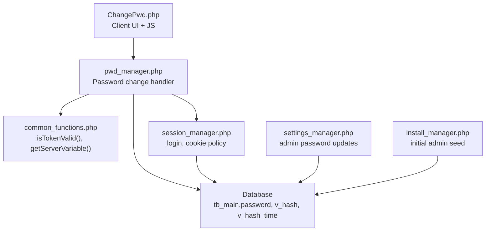
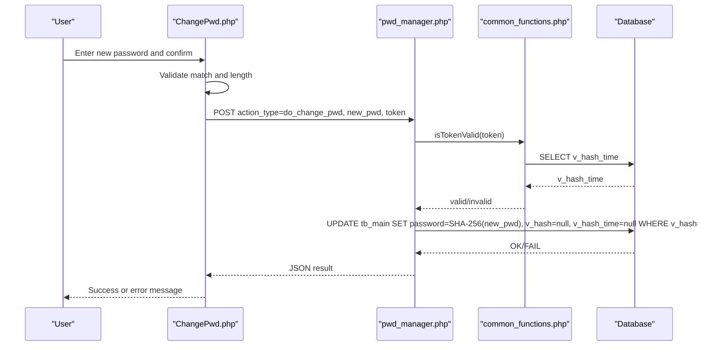
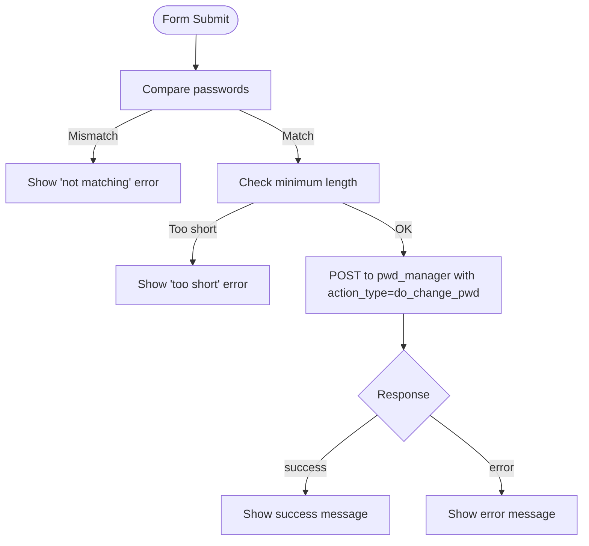
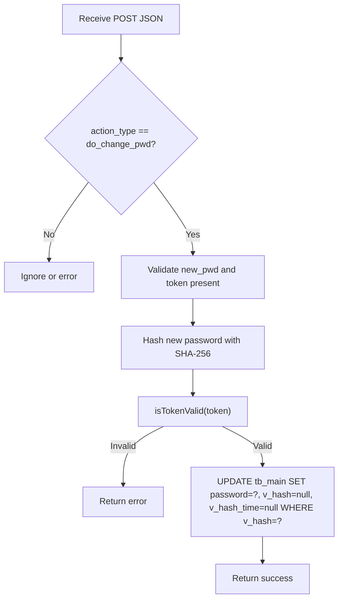
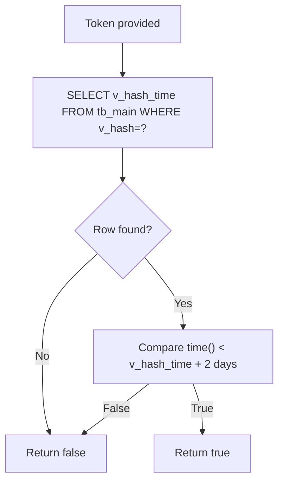
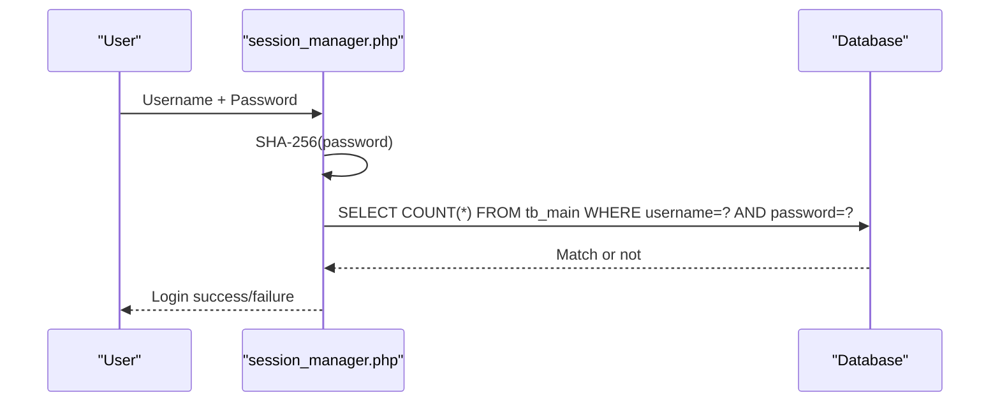
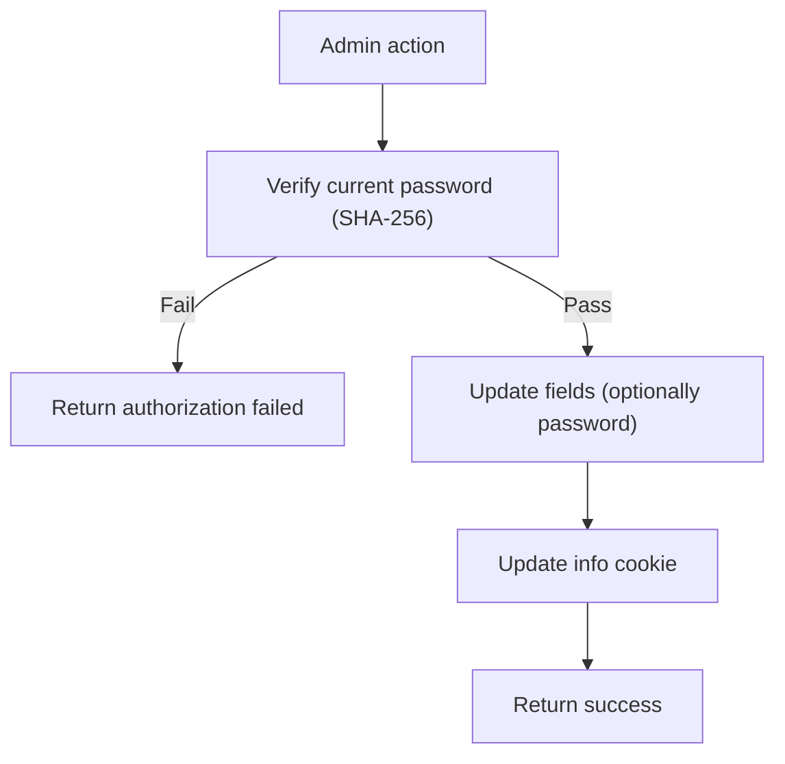
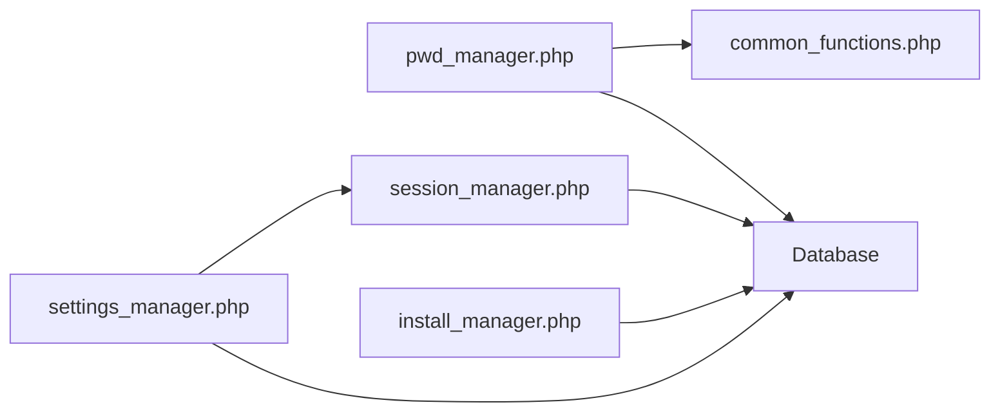

# Password Management

<cite>
**Referenced Files in This Document**
- [ChangePwd.php](file://ChangePwd.php)
- [pwd_manager.php](file://spear/manager/pwd_manager.php)
- [session_manager.php](file://spear/manager/session_manager.php)
- [common_functions.php](file://spear/manager/common_functions.php)
- [settings_manager.php](file://spear/manager/settings_manager.php)
- [install_manager.php](file://install_manager.php)
</cite>

## Table of Contents
1. [Introduction](#introduction)
2. [Project Structure](#project-structure)
3. [Core Components](#core-components)
4. [Architecture Overview](#architecture-overview)
5. [Detailed Component Analysis](#detailed-component-analysis)
6. [Dependency Analysis](#dependency-analysis)
7. [Performance Considerations](#performance-considerations)
8. [Troubleshooting Guide](#troubleshooting-guide)
9. [Conclusion](#conclusion)

## Introduction
This document explains the password management system in the project, focusing on password change functionality, security policies, and user password handling. It covers:
- How password resets are initiated and validated
- How SHA-256 hashing is applied to passwords
- How hashed passwords are stored and verified during login
- Security measures including token-based reset links, basic client-side validation, and session cookie policies
- Integration with session management and post-change workflows
- Error handling and user feedback mechanisms

## Project Structure
The password management functionality spans several modules:
- Frontend password change page and client-side validation
- Backend password change handler
- Session management for login and cookie policies
- Common utilities for token validation and server variables
- Settings manager for administrative password updates
- Installation script that seeds the initial admin password hash

**Diagram sources**
- [ChangePwd.php:110-135](file://ChangePwd.php#L110-L135)
- [pwd_manager.php:79-98](file://spear/manager/pwd_manager.php#L79-L98)
- [common_functions.php:101-112](file://spear/manager/common_functions.php#L101-L112)
- [session_manager.php:17-33](file://spear/manager/session_manager.php#L17-L33)
- [settings_manager.php:88-132](file://spear/manager/settings_manager.php#L88-L132)
- [install_manager.php:172](file://install_manager.php#L172)

**Section sources**
- [ChangePwd.php:110-135](file://ChangePwd.php#L110-L135)
- [pwd_manager.php:79-98](file://spear/manager/pwd_manager.php#L79-L98)
- [common_functions.php:101-112](file://spear/manager/common_functions.php#L101-L112)
- [session_manager.php:17-33](file://spear/manager/session_manager.php#L17-L33)
- [settings_manager.php:88-132](file://spear/manager/settings_manager.php#L88-L132)
- [install_manager.php:172](file://install_manager.php#L172)

## Core Components
- Password change UI and client-side checks: Validates password match and minimum length before submission.
- Password change handler: Accepts a token and new password, hashes the password with SHA-256, and updates the user record.
- Token validation: Ensures the reset token exists and is within the allowed time window.
- Login and session management: Uses SHA-256 for password comparison and sets secure cookies.
- Administrative password updates: Enforces current-password verification and stores SHA-256 hashes.
- Initial admin seeding: Inserts a predefined SHA-256 hash for the admin account during installation.

**Section sources**
- [ChangePwd.php:110-135](file://ChangePwd.php#L110-L135)
- [pwd_manager.php:79-98](file://spear/manager/pwd_manager.php#L79-L98)
- [common_functions.php:101-112](file://spear/manager/common_functions.php#L101-L112)
- [session_manager.php:17-33](file://spear/manager/session_manager.php#L17-L33)
- [settings_manager.php:88-132](file://spear/manager/settings_manager.php#L88-L132)
- [install_manager.php:172](file://install_manager.php#L172)

## Architecture Overview
The password change flow integrates frontend validation, backend processing, database updates, and session handling.

**Diagram sources**
- [ChangePwd.php:110-135](file://ChangePwd.php#L110-L135)
- [pwd_manager.php:79-98](file://spear/manager/pwd_manager.php#L79-L98)
- [common_functions.php:101-112](file://spear/manager/common_functions.php#L101-L112)

## Detailed Component Analysis

### Password Change UI and Validation (ChangePwd.php)
- Client-side checks:
  - Confirms that the two password fields match.
  - Enforces a minimum length requirement.
- Submission:
  - Sends a POST request to the password manager endpoint with action type, new password, and token.
- Feedback:
  - Displays success or error messages based on the response.

**Diagram sources**
- [ChangePwd.php:110-135](file://ChangePwd.php#L110-L135)

**Section sources**
- [ChangePwd.php:110-135](file://ChangePwd.php#L110-L135)

### Password Change Handler (pwd_manager.php)
- Endpoint accepts JSON via POST.
- Action type handling:
  - do_change_pwd:
    - Validates presence of new password and token.
    - Hashes the new password using SHA-256.
    - Verifies token existence and validity via token validation.
    - Updates the user’s password, clears the token fields, and responds with success or failure.

**Diagram sources**
- [pwd_manager.php:79-98](file://spear/manager/pwd_manager.php#L79-L98)
- [common_functions.php:101-112](file://spear/manager/common_functions.php#L101-L112)

**Section sources**
- [pwd_manager.php:79-98](file://spear/manager/pwd_manager.php#L79-L98)
- [common_functions.php:101-112](file://spear/manager/common_functions.php#L101-L112)

### Token Validation (common_functions.php)
- Retrieves the token’s stored timestamp.
- Compares the current time with the stored timestamp to ensure the token is still valid (window of two days).
- Returns true/false accordingly.

**Diagram sources**
- [common_functions.php:101-112](file://spear/manager/common_functions.php#L101-L112)

**Section sources**
- [common_functions.php:101-112](file://spear/manager/common_functions.php#L101-L112)

### Login and Password Verification (session_manager.php)
- On login attempts, the submitted password is hashed with SHA-256 and compared to the stored hash.
- Session creation sets HttpOnly, SameSite, and lifetime policies for the session cookie.

**Diagram sources**
- [session_manager.php:17-33](file://spear/manager/session_manager.php#L17-L33)

**Section sources**
- [session_manager.php:17-33](file://spear/manager/session_manager.php#L17-L33)

### Administrative Password Changes (settings_manager.php)
- Requires the current password to be correct (SHA-256 comparison).
- Optionally updates the password to a new value (SHA-256 stored).
- Updates associated user info cookie after successful changes.

**Diagram sources**
- [settings_manager.php:88-132](file://spear/manager/settings_manager.php#L88-L132)

**Section sources**
- [settings_manager.php:88-132](file://spear/manager/settings_manager.php#L88-L132)

### Initial Admin Seed (install_manager.php)
- During installation, the admin account is seeded with a predefined SHA-256 hash for the initial password.

**Section sources**
- [install_manager.php:172](file://install_manager.php#L172)

## Dependency Analysis
- pwd_manager depends on:
  - session_manager for session context
  - common_functions for token validation
  - Database for reading/writing user records
- session_manager depends on:
  - Database for login verification and session metadata
  - common_functions for shared utilities
- settings_manager depends on:
  - session_manager for session validation
  - common_functions for utilities
  - Database for user updates

**Diagram sources**
- [pwd_manager.php:1-20](file://spear/manager/pwd_manager.php#L1-L20)
- [session_manager.php:1-15](file://spear/manager/session_manager.php#L1-L15)
- [settings_manager.php:1-10](file://spear/manager/settings_manager.php#L1-L10)
- [install_manager.php:160-178](file://install_manager.php#L160-L178)

**Section sources**
- [pwd_manager.php:1-20](file://spear/manager/pwd_manager.php#L1-L20)
- [session_manager.php:1-15](file://spear/manager/session_manager.php#L1-L15)
- [settings_manager.php:1-10](file://spear/manager/settings_manager.php#L1-L10)
- [install_manager.php:160-178](file://install_manager.php#L160-L178)

## Performance Considerations
- SHA-256 hashing is fast and suitable for server-side password comparisons.
- Token validation uses a single database lookup per reset attempt.
- Session cookie settings minimize exposure risks by setting HttpOnly and SameSite attributes.

[No sources needed since this section provides general guidance]

## Troubleshooting Guide
Common issues and remedies:
- Invalid request or missing parameters:
  - Ensure the request includes both the new password and token.
- Token invalid or expired:
  - Tokens are valid for two days; regenerate a reset link if expired.
- Password change failed:
  - Confirm database connectivity and permissions; verify the update query executes successfully.
- Login fails after password change:
  - Ensure the new password is hashed consistently using SHA-256 before comparison.

**Section sources**
- [pwd_manager.php:80-81](file://spear/manager/pwd_manager.php#L80-L81)
- [pwd_manager.php:96](file://spear/manager/pwd_manager.php#L96)
- [common_functions.php:101-112](file://spear/manager/common_functions.php#L101-L112)
- [session_manager.php:17-33](file://spear/manager/session_manager.php#L17-L33)

## Conclusion
The system implements a straightforward password change workflow:
- Secure hashing with SHA-256
- Token-based reset with time-bound validation
- Client-side validation for user experience
- Session cookie policies to reduce exposure risks
- Administrative controls with current-password verification

For production hardening, consider adopting stronger password hashing (e.g., bcrypt or PBKDF2), adding rate limiting, enforcing stronger password policies, and ensuring HTTPS to protect transmissions.