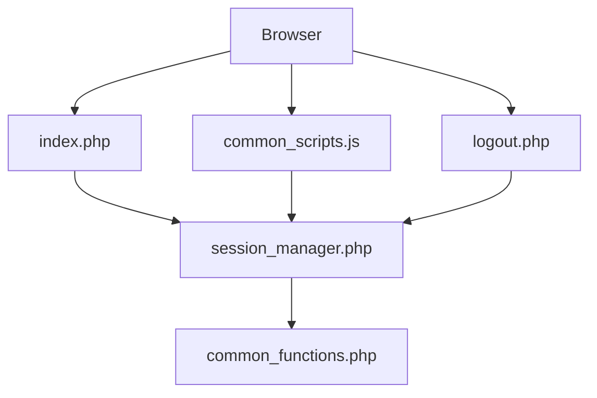
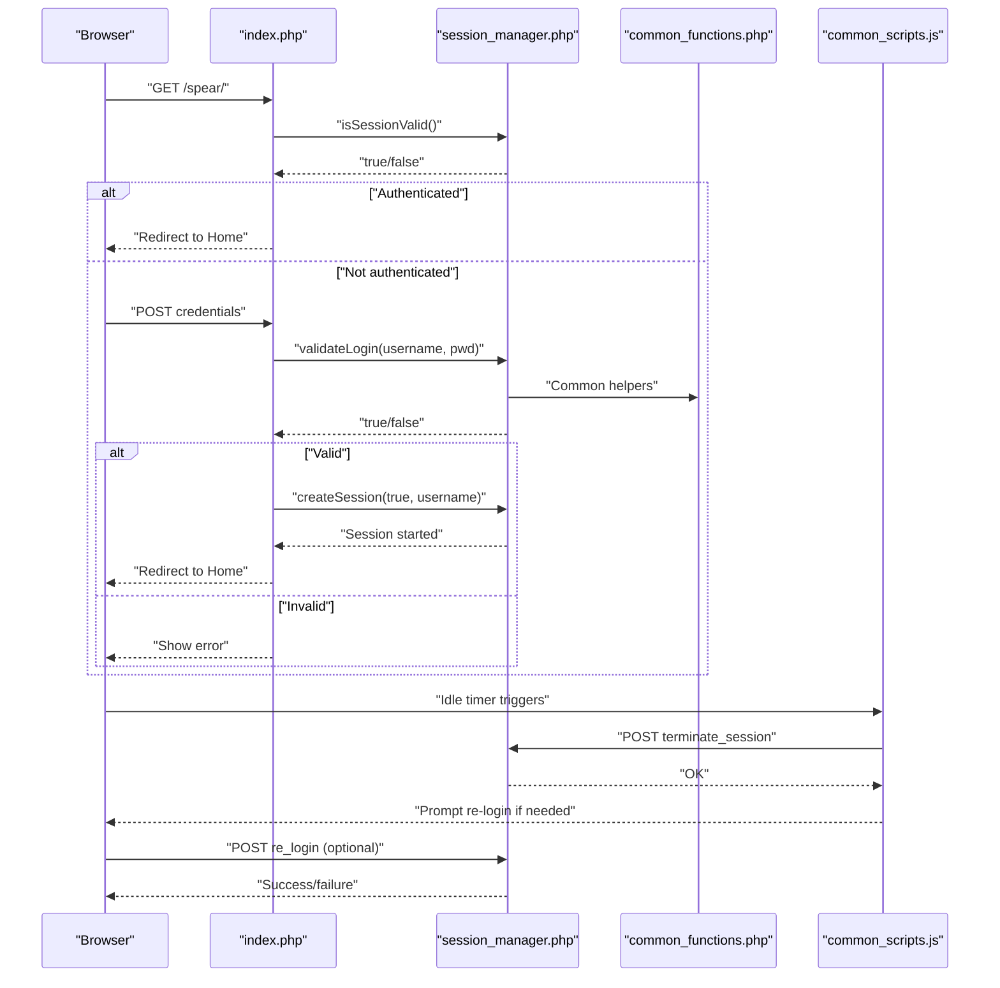
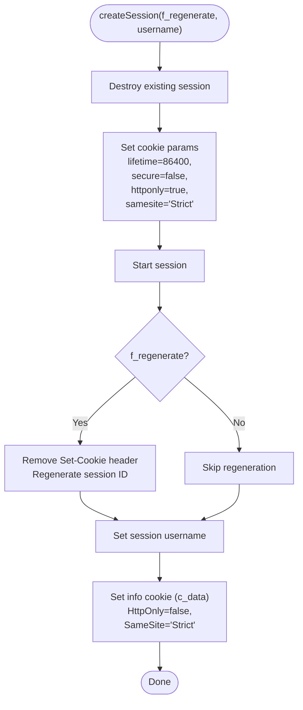
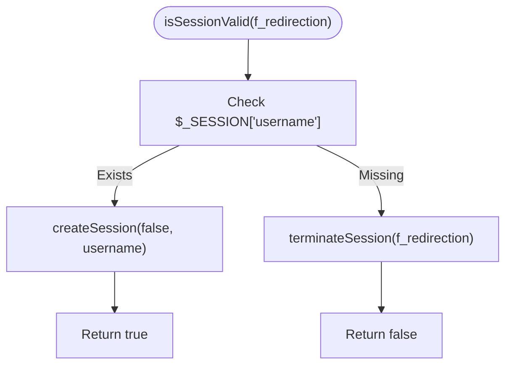
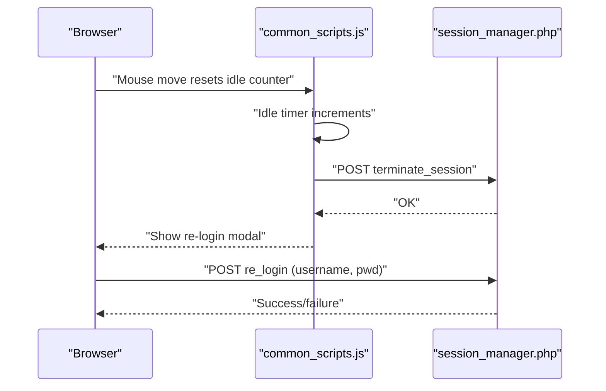
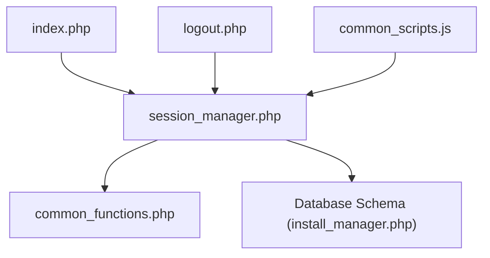

# Session Security Measures

<cite>
**Referenced Files in This Document**
- [session_manager.php](file://spear/manager/session_manager.php)
- [index.php](file://spear/index.php)
- [logout.php](file://spear/logout.php)
- [common_scripts.js](file://spear/js/common_scripts.js)
- [common_functions.php](file://spear/manager/common_functions.php)
- [install_manager.php](file://install_manager.php)
</cite>

## Table of Contents
1. [Introduction](#introduction)
2. [Project Structure](#project-structure)
3. [Core Components](#core-components)
4. [Architecture Overview](#architecture-overview)
5. [Detailed Component Analysis](#detailed-component-analysis)
6. [Dependency Analysis](#dependency-analysis)
7. [Performance Considerations](#performance-considerations)
8. [Troubleshooting Guide](#troubleshooting-guide)
9. [Conclusion](#conclusion)

## Introduction
This document focuses on session security measures implemented in the application, covering session lifecycle management, cookie configuration, and security best practices. It explains the createSession function (including session regeneration), cookie parameter configuration (lifetime, secure, HttpOnly, SameSite), session validation and renewal via isSessionValid, and session destruction/recreation processes. It also documents automatic logout handling, session hijacking prevention strategies, session fixation protection, secure cookie handling, and the relationship between session security and application access control.

## Project Structure
The session security implementation spans several files:
- Session manager: central logic for session creation, validation, renewal, and termination
- Login entry point: redirects authenticated users and initiates sessions
- Logout handler: cleans up session state and logs activity
- Frontend idle timer: triggers automatic logout and optional re-authentication
- Common utilities: shared helpers used by session manager
- Database schema: defines storage for user credentials and audit logs

**Diagram sources**
- [index.php](file://spear/index.php)
- [session_manager.php](file://spear/manager/session_manager.php)
- [common_functions.php](file://spear/manager/common_functions.php)
- [logout.php](file://spear/logout.php)
- [common_scripts.js](file://spear/js/common_scripts.js)

**Section sources**
- [session_manager.php](file://spear/manager/session_manager.php)
- [index.php](file://spear/index.php)
- [logout.php](file://spear/logout.php)
- [common_scripts.js](file://spear/js/common_scripts.js)
- [common_functions.php](file://spear/manager/common_functions.php)

## Core Components
- Session creation and renewal: createSession manages cookie parameters, optional session regeneration, and sets session data
- Session validation and auto-renewal: isSessionValid checks session presence and refreshes expiration by recreating the session
- Cookie management: setInfoCookie stores non-sensitive user metadata in a cookie with HttpOnly and SameSite attributes
- Automatic logout and re-login: frontend idle timer posts to terminate_session and optionally re-login endpoint
- Session termination: terminateSession destroys the session and optionally redirects to the login page

Key implementation references:
- Session creation and cookie parameters: [session_manager.php](file://spear/manager/session_manager.php)
- Session validation and renewal: [session_manager.php](file://spear/manager/session_manager.php)
- Cookie configuration and HttpOnly/SameSite: [session_manager.php](file://spear/manager/session_manager.php)
- Automatic logout and re-login flow: [common_scripts.js](file://spear/js/common_scripts.js)
- Session termination: [session_manager.php](file://spear/manager/session_manager.php)

**Section sources**
- [session_manager.php](file://spear/manager/session_manager.php)
- [common_scripts.js](file://spear/js/common_scripts.js)

## Architecture Overview
The session security architecture integrates backend PHP session management with frontend idle detection and optional re-authentication.

**Diagram sources**
- [index.php](file://spear/index.php)
- [session_manager.php](file://spear/manager/session_manager.php)
- [common_functions.php](file://spear/manager/common_functions.php)
- [common_scripts.js](file://spear/js/common_scripts.js)

## Detailed Component Analysis

### Session Creation and Renewal: createSession
Purpose:
- Destroy any existing session to prevent fixation
- Configure cookie parameters (lifetime, secure, HttpOnly, SameSite)
- Optionally regenerate the session identifier for security
- Initialize a fresh session with the authenticated username
- Set a user info cookie containing non-sensitive metadata

Security controls:
- Session regeneration: removes the Set-Cookie header produced by session_start and regenerates the session ID with a cryptographic token
- Cookie parameters:
  - lifetime: 86400 seconds (1 day)
  - secure: false (not enforced over HTTPS)
  - httponly: true (mitigates XSS)
  - samesite: Strict (mitigates CSRF)

Lifecycle steps:
1. Destroy current session
2. Set cookie parameters
3. Start session
4. Regenerate session ID if requested
5. Store username in session
6. Set info cookie with user metadata

**Diagram sources**
- [session_manager.php](file://spear/manager/session_manager.php)

**Section sources**
- [session_manager.php](file://spear/manager/session_manager.php)

### Session Validation and Auto-Renewal: isSessionValid
Purpose:
- Verify if a session exists and is valid
- Automatically refresh session expiration by recreating the session
- Terminate session and optionally redirect to the login page if invalid

Behavior:
- If session username exists, recreate the session to refresh expiry
- Otherwise, terminate session and redirect based on flag

**Diagram sources**
- [session_manager.php](file://spear/manager/session_manager.php)

**Section sources**
- [session_manager.php](file://spear/manager/session_manager.php)

### Cookie Management: setInfoCookie
Purpose:
- Store non-sensitive user metadata in a cookie for convenience
- Apply HttpOnly and SameSite attributes to mitigate XSS and CSRF risks
- Note: The cookie is not marked HttpOnly in this implementation

Configuration highlights:
- path: "/"
- SameSite: "Strict"
- HttpOnly: false (may increase XSS risk)

Recommendation:
- Mark HttpOnly true for cookies carrying sensitive or semi-sensitive data

**Section sources**
- [session_manager.php](file://spear/manager/session_manager.php)

### Automatic Logout and Re-Authentication: Frontend Idle Timer
Purpose:
- Detect user inactivity and automatically terminate the session
- Prompt for re-authentication to renew the session securely

Mechanism:
- Idle timer runs client-side
- On expiry, posts to terminate_session endpoint
- Displays modal prompting for username/password
- On successful re-login, resumes normal operation

**Diagram sources**
- [common_scripts.js](file://spear/js/common_scripts.js)
- [session_manager.php](file://spear/manager/session_manager.php)

**Section sources**
- [common_scripts.js](file://spear/js/common_scripts.js)
- [session_manager.php](file://spear/manager/session_manager.php)

### Session Termination: terminateSession
Purpose:
- Destroy the session and optionally redirect to the login page
- Ensures clean state and prevents session fixation

Behavior:
- Destroys session
- Optionally clears output buffer and redirects to the login path

**Section sources**
- [session_manager.php](file://spear/manager/session_manager.php)

### Login Entry Point and Redirects
Purpose:
- Prevent authenticated users from accessing the login page
- Authenticate credentials and initiate a secure session

Behavior:
- If session is valid, redirect to Home
- On successful login, create a new session and redirect to Home

**Section sources**
- [index.php](file://spear/index.php)
- [session_manager.php](file://spear/manager/session_manager.php)

### Logout Handler
Purpose:
- Record logout activity
- Clean up session state
- Redirect to application root

Behavior:
- Update logout history
- Clean old log entries
- Destroy session and redirect

**Section sources**
- [logout.php](file://spear/logout.php)
- [session_manager.php](file://spear/manager/session_manager.php)

## Dependency Analysis
High-level dependencies among session security components:

**Diagram sources**
- [session_manager.php](file://spear/manager/session_manager.php)
- [index.php](file://spear/index.php)
- [logout.php](file://spear/logout.php)
- [common_scripts.js](file://spear/js/common_scripts.js)
- [common_functions.php](file://spear/manager/common_functions.php)
- [install_manager.php](file://install_manager.php)

**Section sources**
- [session_manager.php](file://spear/manager/session_manager.php)
- [index.php](file://spear/index.php)
- [logout.php](file://spear/logout.php)
- [common_scripts.js](file://spear/js/common_scripts.js)
- [common_functions.php](file://spear/manager/common_functions.php)
- [install_manager.php](file://install_manager.php)

## Performance Considerations
- Session regeneration adds minimal overhead but improves security; ensure it is performed only when necessary
- Cookie parameter updates occur per-session initialization; keep cookie payload small to reduce bandwidth
- Idle timer frequency should balance responsiveness with client CPU usage; adjust intervals as needed
- Database writes for login/logout history should be optimized; consider indexing relevant columns

## Troubleshooting Guide
Common issues and resolutions:
- Session not persisting:
  - Verify cookie parameters and SameSite compatibility across browsers
  - Confirm session_start is called before any output
- Secure flag mismatch:
  - secure=false allows cookies over HTTP; enable HTTPS to enforce secure transport
- HttpOnly attribute not applied:
  - Ensure cookie creation uses proper flags; review setInfoCookie configuration
- Automatic logout timing:
  - Adjust idleMax and timerInterval in the frontend idle timer to suit user behavior
- Session fixation concerns:
  - Ensure session_regenerate_id is invoked during login and renewal flows

**Section sources**
- [session_manager.php](file://spear/manager/session_manager.php)
- [common_scripts.js](file://spear/js/common_scripts.js)

## Conclusion
The application implements a layered session security model:
- Backend session creation and renewal with configurable cookie parameters and optional regeneration
- Frontend idle detection and automatic logout with optional re-authentication
- Session validation and termination routines to maintain secure state transitions

Recommended enhancements:
- Enforce secure cookies over HTTPS
- Mark info cookie as HttpOnly
- Strengthen session timeout policies and consider rolling renewal
- Add IP or user-agent binding for additional anti-fixation protections
- Integrate CSRF tokens for form submissions and AJAX endpoints