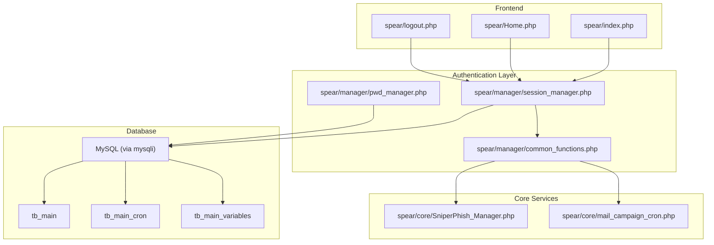
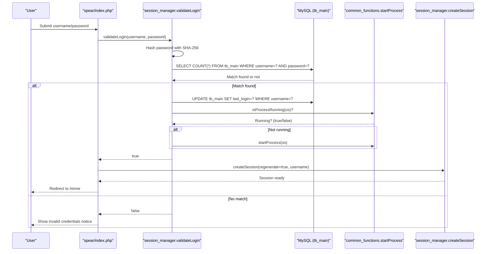
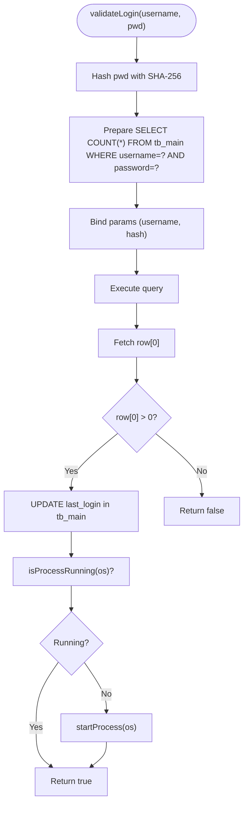
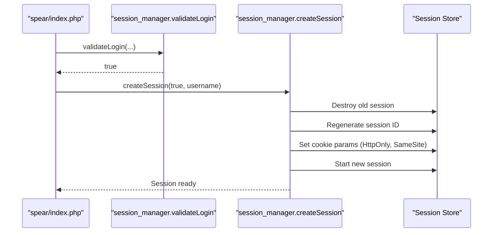
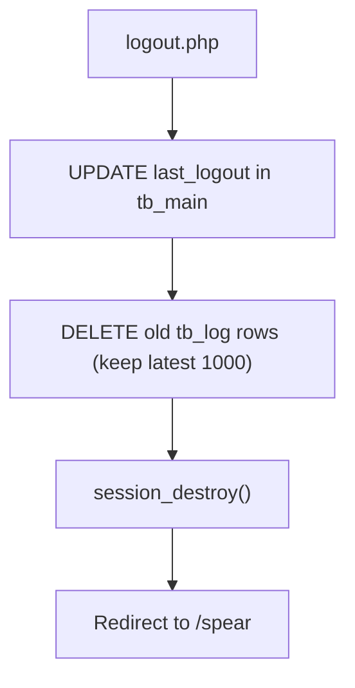
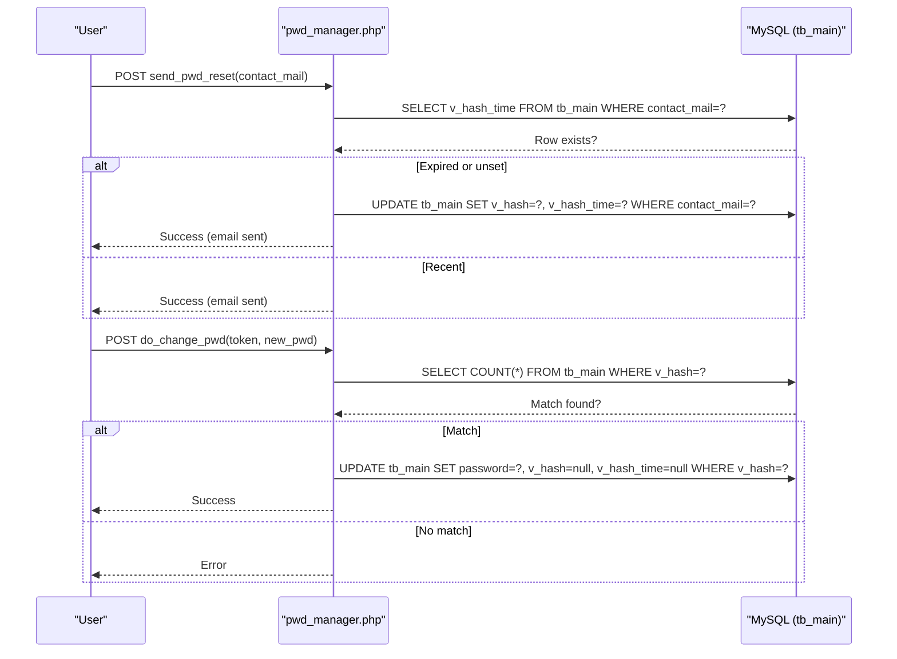
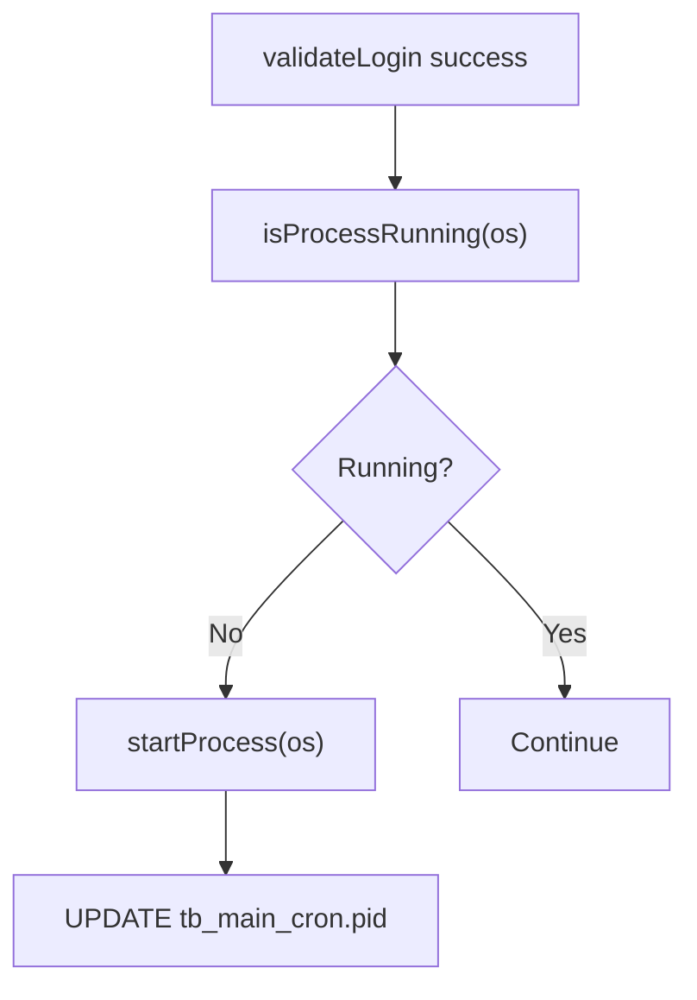
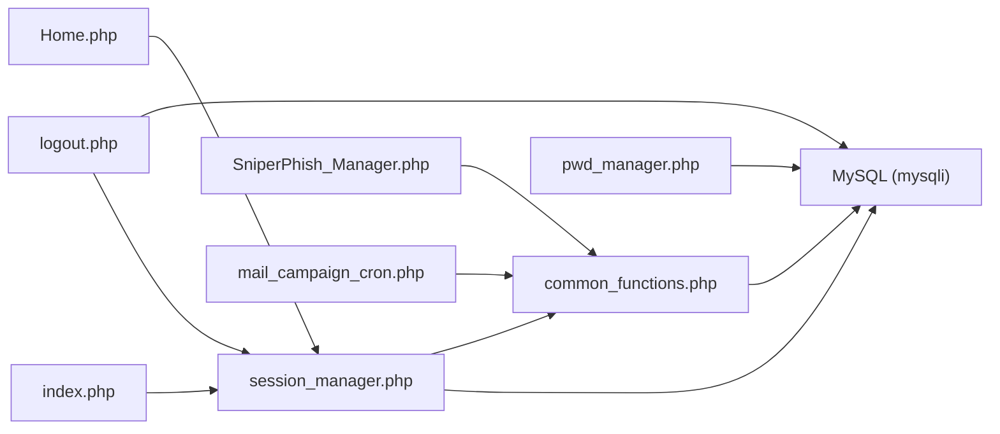

# User Authentication Flow

<cite>
**Referenced Files in This Document**
- [index.php](file://spear/index.php)
- [session_manager.php](file://spear/manager/session_manager.php)
- [common_functions.php](file://spear/manager/common_functions.php)
- [pwd_manager.php](file://spear/manager/pwd_manager.php)
- [logout.php](file://spear/logout.php)
- [install_manager.php](file://install_manager.php)
- [SniperPhish_Manager.php](file://spear/core/SniperPhish_Manager.php)
- [mail_campaign_cron.php](file://spear/core/mail_campaign_cron.php)
- [Home.php](file://spear/Home.php)
</cite>

## Table of Contents
1. [Introduction](#introduction)
2. [Project Structure](#project-structure)
3. [Core Components](#core-components)
4. [Architecture Overview](#architecture-overview)
5. [Detailed Component Analysis](#detailed-component-analysis)
6. [Dependency Analysis](#dependency-analysis)
7. [Performance Considerations](#performance-considerations)
8. [Troubleshooting Guide](#troubleshooting-guide)
9. [Conclusion](#conclusion)

## Introduction
This document explains the complete user authentication flow in the application, focusing on the validateLogin function and the end-to-end login validation process. It covers SHA-256 password hashing, database verification via prepared statements, session initialization, and automatic process startup for authenticated users. It also documents error handling for invalid credentials, security considerations (password hashing, SQL injection prevention, session security), and the relationship between authentication and the main application tables (tb_main).

## Project Structure
The authentication system spans several modules:
- Frontend login page and form submission
- Session and authentication logic
- Password reset workflow
- Logout and session termination
- Background process management triggered after login

**Diagram sources**
- [index.php](file://spear/index.php)
- [session_manager.php](file://spear/manager/session_manager.php)
- [common_functions.php](file://spear/manager/common_functions.php)
- [pwd_manager.php](file://spear/manager/pwd_manager.php)
- [logout.php](file://spear/logout.php)
- [SniperPhish_Manager.php](file://spear/core/SniperPhish_Manager.php)
- [install_manager.php](file://install_manager.php)

**Section sources**
- [index.php](file://spear/index.php)
- [session_manager.php](file://spear/manager/session_manager.php)
- [common_functions.php](file://spear/manager/common_functions.php)
- [pwd_manager.php](file://spear/manager/pwd_manager.php)
- [logout.php](file://spear/logout.php)
- [install_manager.php](file://install_manager.php)

## Core Components
- validateLogin: Performs SHA-256 hashing of the submitted password, executes a prepared statement against tb_main to verify username and hashed password, updates login history, and starts the background process if not already running.
- createSession: Destroys any existing session, regenerates the session ID, sets secure cookie parameters, initializes a new session, and stores user information in cookies.
- isSessionValid: Validates session freshness and redirects unauthenticated users.
- updateLoginLogout: Updates last_login or last_logout timestamps in tb_main.
- startProcess and isProcessRunning: Manage a single-instance background process controlled by tb_main_cron.
- Password reset workflow: Generates a temporary token stored in tb_main and sends a reset link via email.

Security highlights:
- SHA-256 hashing for password storage
- Prepared statements with bound parameters to prevent SQL injection
- Secure cookie configuration with HttpOnly and SameSite
- Session regeneration to mitigate fixation risks

**Section sources**
- [session_manager.php](file://spear/manager/session_manager.php)
- [common_functions.php](file://spear/manager/common_functions.php)
- [pwd_manager.php](file://spear/manager/pwd_manager.php)

## Architecture Overview
The authentication flow integrates frontend, backend, and database layers. On successful login, the system updates user login records, initializes a secure session, and ensures a background process is running.

**Diagram sources**
- [index.php](file://spear/index.php)
- [session_manager.php](file://spear/manager/session_manager.php)
- [common_functions.php](file://spear/manager/common_functions.php)

## Detailed Component Analysis

### validateLogin Implementation
- Hashing: The submitted password is hashed using SHA-256 before comparison.
- Database query: A prepared statement checks username and hashed password in tb_main.
- Session update: On success, last_login is updated in tb_main.
- Process management: If the background process is not running, it is started automatically.
- Return: Boolean indicating success or failure.

**Diagram sources**
- [session_manager.php](file://spear/manager/session_manager.php)
- [common_functions.php](file://spear/manager/common_functions.php)

**Section sources**
- [session_manager.php](file://spear/manager/session_manager.php)

### Session Initialization and Management
- createSession:
  - Destroys previous session and regenerates ID to prevent fixation.
  - Sets cookie parameters: lifetime, secure flag, HttpOnly, SameSite.
  - Starts a new session and stores user info in a cookie for convenience.
- isSessionValid:
  - Checks session presence and refreshes session expiry.
  - Redirects to login if invalid.

**Diagram sources**
- [session_manager.php](file://spear/manager/session_manager.php)
- [index.php](file://spear/index.php)

**Section sources**
- [session_manager.php](file://spear/manager/session_manager.php)

### Logout and Cleanup
- logout.php:
  - Records logout in tb_main.
  - Maintains tb_log by keeping the latest 1000 entries and deleting older ones.
  - Destroys the session and redirects to the login page.

**Diagram sources**
- [logout.php](file://spear/logout.php)
- [session_manager.php](file://spear/manager/session_manager.php)

**Section sources**
- [logout.php](file://spear/logout.php)
- [session_manager.php](file://spear/manager/session_manager.php)

### Password Reset Workflow
- pwd_manager.php:
  - sendPwdReset: Validates contact_mail existence, generates a token, stores it in tb_main with timestamp, and emails the reset link.
  - doChangePwd: Verifies token validity, hashes the new password, and updates tb_main.

**Diagram sources**
- [pwd_manager.php](file://spear/manager/pwd_manager.php)
- [common_functions.php](file://spear/manager/common_functions.php)

**Section sources**
- [pwd_manager.php](file://spear/manager/pwd_manager.php)
- [common_functions.php](file://spear/manager/common_functions.php)

### Background Process Startup After Login
- After a successful login, the system checks whether the background process is running via tb_main_cron.
- If not running, it starts the process and updates the PID in tb_main_cron.

**Diagram sources**
- [session_manager.php](file://spear/manager/session_manager.php)
- [common_functions.php](file://spear/manager/common_functions.php)
- [SniperPhish_Manager.php](file://spear/core/SniperPhish_Manager.php)

**Section sources**
- [session_manager.php](file://spear/manager/session_manager.php)
- [common_functions.php](file://spear/manager/common_functions.php)
- [SniperPhish_Manager.php](file://spear/core/SniperPhish_Manager.php)

## Dependency Analysis
Key dependencies and relationships:
- session_manager.php depends on mysqli connection and common_functions.php for OS detection and process management.
- validateLogin relies on tb_main for credential verification and on tb_main_cron for process state.
- createSession depends on session functions and cookie configuration.
- logout.php updates tb_main and tb_log and cleans up sessions.
- Password reset uses tb_main for token and timestamp storage.

**Diagram sources**
- [session_manager.php](file://spear/manager/session_manager.php)
- [common_functions.php](file://spear/manager/common_functions.php)
- [pwd_manager.php](file://spear/manager/pwd_manager.php)
- [logout.php](file://spear/logout.php)
- [Home.php](file://spear/Home.php)
- [index.php](file://spear/index.php)
- [SniperPhish_Manager.php](file://spear/core/SniperPhish_Manager.php)
- [mail_campaign_cron.php](file://spear/core/mail_campaign_cron.php)

**Section sources**
- [session_manager.php](file://spear/manager/session_manager.php)
- [common_functions.php](file://spear/manager/common_functions.php)
- [pwd_manager.php](file://spear/manager/pwd_manager.php)
- [logout.php](file://spear/logout.php)
- [Home.php](file://spear/Home.php)
- [index.php](file://spear/index.php)
- [SniperPhish_Manager.php](file://spear/core/SniperPhish_Manager.php)
- [mail_campaign_cron.php](file://spear/core/mail_campaign_cron.php)

## Performance Considerations
- Prepared statements minimize parsing overhead and improve security.
- SHA-256 hashing is fast but consider stronger password hashing (e.g., bcrypt) for production-grade security.
- Session regeneration occurs only on successful login to reduce overhead.
- Background process startup is guarded by a single-instance check to avoid duplication.

## Troubleshooting Guide
Common issues and resolutions:
- Invalid credentials:
  - Symptom: Error message displayed on the login page.
  - Cause: validateLogin returns false when username/password mismatch.
  - Resolution: Verify credentials and ensure tb_main contains the correct hashed password.
- Session not persisting:
  - Symptom: Redirected to login after initial success.
  - Cause: Cookie parameters or session configuration issues.
  - Resolution: Confirm secure, HttpOnly, and SameSite settings; ensure session_start() is called before output.
- Background process not starting:
  - Symptom: No automated tasks after login.
  - Cause: isProcessRunning reports running or startProcess fails.
  - Resolution: Check OS-specific commands availability and permissions; verify tb_main_cron PID updates.
- Password reset not received:
  - Symptom: No reset email.
  - Cause: Email delivery failure or expired token.
  - Resolution: Confirm mail configuration and token validity window; check tb_main v_hash and v_hash_time.

**Section sources**
- [session_manager.php](file://spear/manager/session_manager.php)
- [pwd_manager.php](file://spear/manager/pwd_manager.php)
- [logout.php](file://spear/logout.php)
- [common_functions.php](file://spear/manager/common_functions.php)

## Conclusion
The authentication system provides a clear, secure login flow using SHA-256 hashing, prepared statements, and robust session management. It integrates with a background process and supports password reset via tokens. For enhanced security, consider upgrading to bcrypt for password hashing and enabling HTTPS to protect cookies with secure flags.