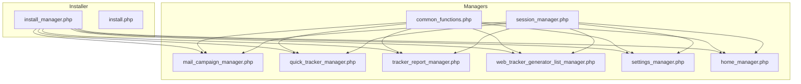
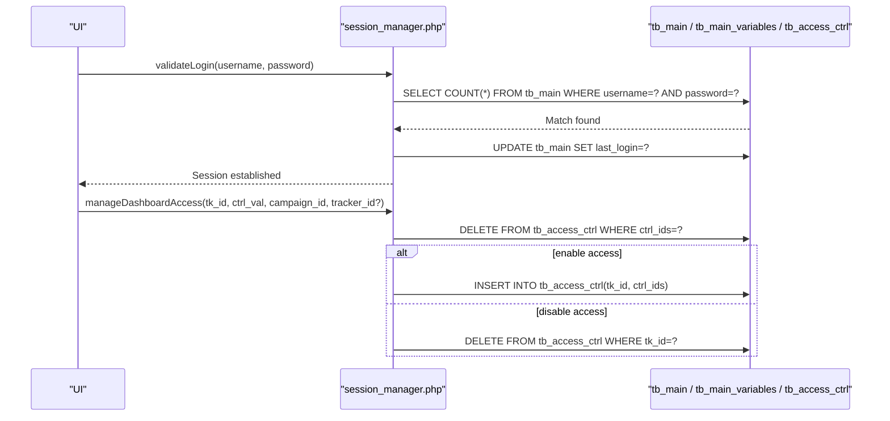
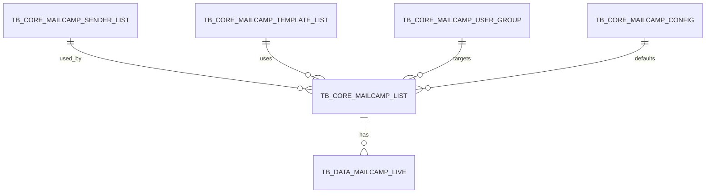
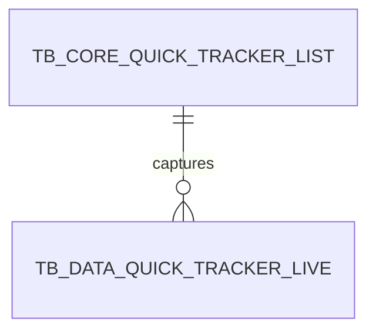
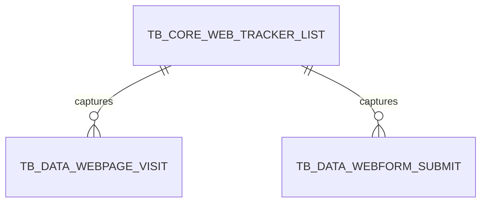
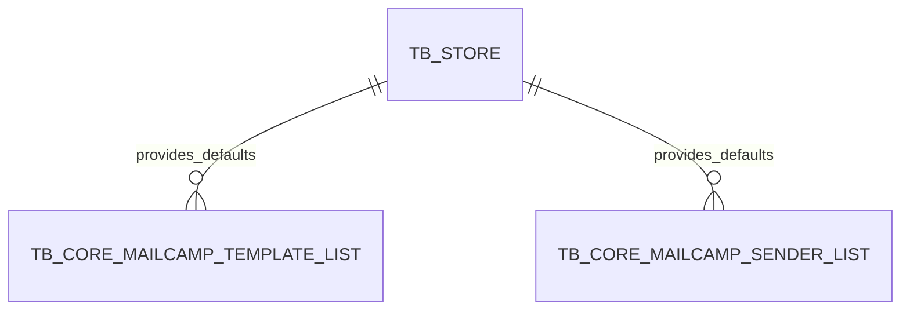
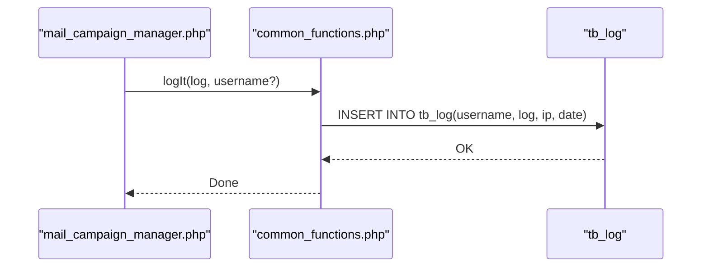
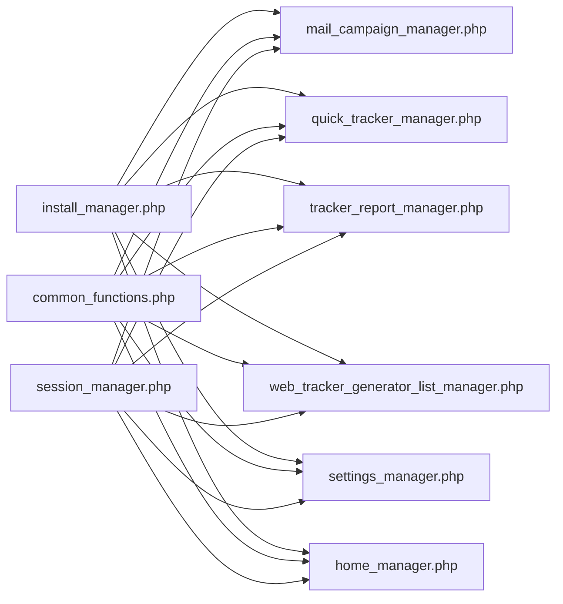

# Database Schema Design

<cite>
**Referenced Files in This Document**
- [install_manager.php](file://install_manager.php)
- [install.php](file://install.php)
- [common_functions.php](file://spear/manager/common_functions.php)
- [session_manager.php](file://spear/manager/session_manager.php)
- [mail_campaign_manager.php](file://spear/manager/mail_campaign_manager.php)
- [quick_tracker_manager.php](file://spear/manager/quick_tracker_manager.php)
- [tracker_report_manager.php](file://spear/manager/tracker_report_manager.php)
- [web_tracker_generator_list_manager.php](file://spear/manager/web_tracker_generator_list_manager.php)
- [settings_manager.php](file://spear/manager/settings_manager.php)
- [home_manager.php](file://spear/manager/home_manager.php)
</cite>

## Table of Contents
1. [Introduction](#introduction)
2. [Project Structure](#project-structure)
3. [Core Components](#core-components)
4. [Architecture Overview](#architecture-overview)
5. [Detailed Component Analysis](#detailed-component-analysis)
6. [Dependency Analysis](#dependency-analysis)
7. [Performance Considerations](#performance-considerations)
8. [Troubleshooting Guide](#troubleshooting-guide)
9. [Conclusion](#conclusion)
10. [Appendices](#appendices)

## Introduction
This document describes the complete database schema for SniperPhish, focusing on entity relationships, table structures, and data flow patterns. It covers core tracking tables, user management schemas, campaign data models, and configuration storage. It also documents primary/foreign key relationships, indexing strategies, constraints, validation rules, referential integrity, caching strategies, performance optimizations, data lifecycle management, security considerations, and migration/versioning practices.

## Project Structure
The database schema is initialized during installation via a dedicated installer and manager. The schema is defined as a set of SQL DDL statements and seed data, then consumed by manager classes that encapsulate CRUD and reporting logic.

**Diagram sources**
- [install_manager.php:180-782](file://install_manager.php#L180-L782)
- [install.php:144-229](file://install.php#L144-L229)
- [mail_campaign_manager.php:1-547](file://spear/manager/mail_campaign_manager.php#L1-L547)
- [quick_tracker_manager.php:1-298](file://spear/manager/quick_tracker_manager.php#L1-L298)
- [tracker_report_manager.php:1-223](file://spear/manager/tracker_report_manager.php#L1-L223)
- [web_tracker_generator_list_manager.php:1-220](file://spear/manager/web_tracker_generator_list_manager.php#L1-L220)
- [settings_manager.php:1-474](file://spear/manager/settings_manager.php#L1-L474)
- [home_manager.php:1-120](file://spear/manager/home_manager.php#L1-L120)
- [common_functions.php:170-185](file://spear/manager/common_functions.php#L170-L185)
- [session_manager.php:1-244](file://spear/manager/session_manager.php#L1-L244)

**Section sources**
- [install_manager.php:180-782](file://install_manager.php#L180-L782)
- [install.php:144-229](file://install.php#L144-L229)

## Core Components
This section outlines the core database schema, including all tables, primary keys, indexes, and constraints. The schema supports:
- User management and session control
- Campaign orchestration (email and web trackers)
- Live tracking data for emails, quick trackers, and web forms
- Configuration and templates
- Logging and auditing
- Store for reusable configurations

Key schema elements:
- Primary keys are explicitly defined for all tables
- Unique constraints are applied where appropriate
- Auto-increment is used for integer auto-numbering
- Medium-sized text fields accommodate JSON and HTML content
- Timestamps stored as strings with microsecond precision

**Section sources**
- [install_manager.php:207-721](file://install_manager.php#L207-L721)

## Architecture Overview
The database architecture centers around three categories:
- Configuration and metadata tables (core definitions)
- Live tracking tables (real-time data ingestion)
- Audit and administrative tables (logs, user accounts)

```mermaid
erDiagram
TB_MAIN {
int id PK
string name
string username
string password
string contact_mail
string dp_name
string v_hash
string v_hash_time
string date
string last_login
string last_logout
}
TB_MAIN_VARIABLES {
int id PK
string server_protocol
string domain
string baseurl
string time_zone
string time_format
}
TB_ACCESS_CTRL {
string tk_id PK
string ctrl_ids
}
TB_CORE_MAILCAMP_LIST {
string campaign_id PK
}
TB_CORE_MAILCAMP_CONFIG {
string mconfig_id PK
}
TB_CORE_MAILCAMP_SENDER_LIST {
string sender_list_id PK
}
TB_CORE_MAILCAMP_TEMPLATE_LIST {
string mail_template_id PK
}
TB_CORE_MAILCAMP_USER_GROUP {
string user_group_id PK
}
TB_CORE_QUICK_TRACKER_LIST {
string tracker_id PK
}
TB_CORE_WEB_TRACKER_LIST {
string tracker_id PK
}
TB_DATA_MAILCAMP_LIVE {
string rid PK
}
TB_DATA_QUICK_TRACKER_LIVE {
int id PK
}
TB_DATA_WEBPAGE_VISIT {
int id PK
}
TB_DATA_WEBFORM_SUBMIT {
int id PK
}
TB_LOG {
int id PK
}
TB_STORE {
string name PK
}
TB_HF_LIST {
string hf_id PK
}
TB_HT_LIST {
string ht_id PK
}
TB_PL_LIST {
string pl_id PK
}
TB_HLAND_PAGE_LIST {
string hlp_id PK
}
TB_MAIN ||--o{ TB_LOG : "audit"
TB_MAIN ||--o{ TB_ACCESS_CTRL : "controls"
TB_CORE_MAILCAMP_LIST ||--o{ TB_DATA_MAILCAMP_LIVE : "produces"
TB_CORE_WEB_TRACKER_LIST ||--o{ TB_DATA_WEBPAGE_VISIT : "produces"
TB_CORE_WEB_TRACKER_LIST ||--o{ TB_DATA_WEBFORM_SUBMIT : "produces"
TB_CORE_QUICK_TRACKER_LIST ||--o{ TB_DATA_QUICK_TRACKER_LIVE : "produces"
```

**Diagram sources**
- [install_manager.php:207-721](file://install_manager.php#L207-L721)

## Detailed Component Analysis

### User Management and Access Control
- tb_main: Stores admin and user accounts with hashed passwords, profile info, and timestamps for login history.
- tb_main_variables: Global settings for server protocol, domain, base URL, and time zone/time format.
- tb_access_ctrl: Grants public access tokens to specific campaigns and trackers.

**Diagram sources**
- [session_manager.php:17-94](file://spear/manager/session_manager.php#L17-L94)
- [session_manager.php:146-195](file://spear/manager/session_manager.php#L146-L195)

**Section sources**
- [session_manager.php:17-94](file://spear/manager/session_manager.php#L17-L94)
- [session_manager.php:146-195](file://spear/manager/session_manager.php#L146-L195)
- [common_functions.php:170-185](file://spear/manager/common_functions.php#L170-L185)

### Campaign Data Model (Email Tracking)
- tb_core_mailcamp_list: Campaign definition with scheduling, status, and lock flags.
- tb_core_mailcamp_config: Default configuration for mail campaigns.
- tb_core_mailcamp_sender_list: Sender profiles with SMTP/IMAP settings.
- tb_core_mailcamp_template_list: Email templates with subject, content, attachments, and metadata.
- tb_core_mailcamp_user_group: Recipient groups with encoded user data.
- tb_data_mailcamp_live: Real-time delivery and engagement metrics per recipient.

**Diagram sources**
- [install_manager.php:222-294](file://install_manager.php#L222-L294)
- [install_manager.php:335-352](file://install_manager.php#L335-L352)

**Section sources**
- [install_manager.php:222-294](file://install_manager.php#L222-L294)
- [install_manager.php:335-352](file://install_manager.php#L335-L352)
- [mail_campaign_manager.php:62-176](file://spear/manager/mail_campaign_manager.php#L62-L176)
- [mail_campaign_manager.php:261-285](file://spear/manager/mail_campaign_manager.php#L261-L285)

### Quick Tracker Data Model
- tb_core_quick_tracker_list: Quick tracker definitions with activation and timing.
- tb_data_quick_tracker_live: Real-time visitor data captured by quick trackers.

**Diagram sources**
- [install_manager.php:299-310](file://install_manager.php#L299-L310)
- [install_manager.php:360-371](file://install_manager.php#L360-L371)

**Section sources**
- [install_manager.php:299-310](file://install_manager.php#L299-L310)
- [install_manager.php:360-371](file://install_manager.php#L360-L371)
- [quick_tracker_manager.php:38-116](file://spear/manager/quick_tracker_manager.php#L38-L116)

### Web Tracker Data Model
- tb_core_web_tracker_list: Web tracker definitions with HTML/JS payloads and step data.
- tb_data_webpage_visit: Page visit events.
- tb_data_webform_submit: Form submission events.

**Diagram sources**
- [install_manager.php:317-327](file://install_manager.php#L317-L327)
- [install_manager.php:399-415](file://install_manager.php#L399-L415)
- [install_manager.php:379-394](file://install_manager.php#L379-L394)

**Section sources**
- [install_manager.php:317-327](file://install_manager.php#L317-L327)
- [install_manager.php:399-415](file://install_manager.php#L399-L415)
- [install_manager.php:379-394](file://install_manager.php#L379-L394)
- [web_tracker_generator_list_manager.php:44-69](file://spear/manager/web_tracker_generator_list_manager.php#L44-L69)
- [tracker_report_manager.php:25-109](file://spear/manager/tracker_report_manager.php#L25-L109)

### Configuration Storage and Templates
- tb_store: Reusable configurations for mail senders and templates.
- tb_hf_list, tb_ht_list, tb_pl_list, tb_hland_page_list: Asset catalogs for host files, text files, payloads, and landing pages.

**Diagram sources**
- [install_manager.php:537-545](file://install_manager.php#L537-L545)
- [install_manager.php:423-442](file://install_manager.php#L423-L442)
- [install_manager.php:450-457](file://install_manager.php#L450-L457)
- [install_manager.php:525-532](file://install_manager.php#L525-L532)
- [install_manager.php:437-442](file://install_manager.php#L437-L442)

**Section sources**
- [install_manager.php:537-545](file://install_manager.php#L537-L545)
- [install_manager.php:423-442](file://install_manager.php#L423-L442)
- [install_manager.php:450-457](file://install_manager.php#L450-L457)
- [install_manager.php:525-532](file://install_manager.php#L525-L532)
- [settings_manager.php:320-356](file://spear/manager/settings_manager.php#L320-L356)

### Logging and Auditing
- tb_log: Centralized audit log with username, log message, IP, and timestamp.

**Diagram sources**
- [mail_campaign_manager.php:54-57](file://spear/manager/mail_campaign_manager.php#L54-L57)
- [common_functions.php:576-586](file://spear/manager/common_functions.php#L576-L586)

**Section sources**
- [common_functions.php:576-586](file://spear/manager/common_functions.php#L576-L586)
- [settings_manager.php:358-414](file://spear/manager/settings_manager.php#L358-L414)

## Dependency Analysis
- Installation initializes all tables and seeds default data.
- Managers depend on common functions for DB connectivity, logging, and utilities.
- Campaign managers coordinate with cron processes to start campaigns.
- Report managers aggregate data from live tracking tables.

**Diagram sources**
- [install_manager.php:180-782](file://install_manager.php#L180-L782)
- [mail_campaign_manager.php:1-547](file://spear/manager/mail_campaign_manager.php#L1-L547)
- [quick_tracker_manager.php:1-298](file://spear/manager/quick_tracker_manager.php#L1-L298)
- [tracker_report_manager.php:1-223](file://spear/manager/tracker_report_manager.php#L1-L223)
- [web_tracker_generator_list_manager.php:1-220](file://spear/manager/web_tracker_generator_list_manager.php#L1-L220)
- [settings_manager.php:1-474](file://spear/manager/settings_manager.php#L1-L474)
- [home_manager.php:1-120](file://spear/manager/home_manager.php#L1-L120)
- [common_functions.php:1-595](file://spear/manager/common_functions.php#L1-L595)
- [session_manager.php:1-244](file://spear/manager/session_manager.php#L1-L244)

**Section sources**
- [install_manager.php:180-782](file://install_manager.php#L180-L782)
- [common_functions.php:37-99](file://spear/manager/common_functions.php#L37-L99)

## Performance Considerations
- Data types and sizes:
  - Use of varchar/mediumtext accommodates JSON and HTML payloads; consider partitioning large datasets by date/time ranges for tb_data_* tables.
- Indexing:
  - Primary keys are defined; consider adding composite indexes on frequently filtered columns (e.g., campaign_id, tracker_id, time) for live tracking tables to improve report queries.
- Query patterns:
  - Managers use prepared statements and limit/offset for pagination; ensure appropriate indexes exist on sort/filter columns.
- Caching:
  - No explicit in-app caching layer is evident; consider Redis/Memcached for frequently accessed configuration and templates if scale increases.
- Concurrency:
  - Single-instance enforcement for the cron process prevents race conditions; ensure filesystem permissions are correct for upload directories.

[No sources needed since this section provides general guidance]

## Troubleshooting Guide
Common issues and resolutions:
- Installation failures:
  - Verify DB credentials and that the database is empty or force-empty via installer.
  - Check directory permissions for uploads and config write access.
- Session and access control:
  - Confirm tb_main credentials and session cookie settings.
  - Use tb_access_ctrl to verify public access grants.
- Report generation:
  - Ensure tb_data_* tables have records for the requested campaign/tracker.
  - Validate time zone and time format settings in tb_main_variables.
- Cron process:
  - Confirm single-instance enforcement and OS-specific command availability.

**Section sources**
- [install.php:144-229](file://install.php#L144-L229)
- [session_manager.php:17-94](file://spear/manager/session_manager.php#L17-L94)
- [session_manager.php:146-195](file://spear/manager/session_manager.php#L146-L195)
- [common_functions.php:37-99](file://spear/manager/common_functions.php#L37-L99)

## Conclusion
The SniperPhish database schema is designed to support robust campaign management and real-time tracking across email, quick, and web trackers. It emphasizes clear entity separation, strong primary keys, and flexible configuration storage. With proper indexing and operational hygiene, the schema scales to moderate workloads. Future enhancements could include partitioning for large live tables, optional caching, and stricter referential constraints.

[No sources needed since this section summarizes without analyzing specific files]

## Appendices

### Schema Definition Reference
- Core configuration and metadata:
  - tb_main, tb_main_variables, tb_access_ctrl
- Campaign definitions:
  - tb_core_mailcamp_list, tb_core_mailcamp_config, tb_core_mailcamp_sender_list, tb_core_mailcamp_template_list, tb_core_mailcamp_user_group
- Tracking data:
  - tb_data_mailcamp_live, tb_data_quick_tracker_live, tb_data_webpage_visit, tb_data_webform_submit
- Assets and templates:
  - tb_store, tb_hf_list, tb_ht_list, tb_pl_list, tb_hland_page_list
- Audit and logs:
  - tb_log

**Section sources**
- [install_manager.php:207-721](file://install_manager.php#L207-L721)

### Data Lifecycle Management
- Campaign data retention:
  - Use campaign status and stop_time fields to mark completion; clear tb_data_mailcamp_live after campaign deletion or stop.
- Tracking data archiving:
  - Periodically export reports and truncate tb_data_* tables; maintain historical snapshots externally if needed.
- Cleanup procedures:
  - Use settings manager’s junk data cleanup to remove orphaned assets and stale access control entries.

**Section sources**
- [mail_campaign_manager.php:153-164](file://spear/manager/mail_campaign_manager.php#L153-L164)
- [quick_tracker_manager.php:108-116](file://spear/manager/quick_tracker_manager.php#L108-L116)
- [web_tracker_generator_list_manager.php:193-204](file://spear/manager/web_tracker_generator_list_manager.php#L193-L204)
- [settings_manager.php:206-317](file://spear/manager/settings_manager.php#L206-L317)

### Security Considerations
- Sensitive information handling:
  - Passwords are hashed; keep DB credentials secret and restrict file permissions.
  - Store sensitive SMTP/IMAP credentials in templates and avoid logging raw credentials.
- Access control:
  - Use tb_access_ctrl for controlled dashboards; enforce session validation in all managers.
- Audit trail:
  - tb_log captures user actions; retain logs per policy and export periodically.

**Section sources**
- [session_manager.php:17-94](file://spear/manager/session_manager.php#L17-L94)
- [session_manager.php:146-195](file://spear/manager/session_manager.php#L146-L195)
- [common_functions.php:576-586](file://spear/manager/common_functions.php#L576-L586)

### Migration and Version Management
- Schema evolution:
  - Use ALTER TABLE to add/remove columns and indexes; maintain backward compatibility.
  - Seed default configurations via tb_store and tb_core_mailcamp_config.
- Installer-driven updates:
  - The installer drops and recreates tables when forced; preserve data externally before upgrades.

**Section sources**
- [install_manager.php:180-782](file://install_manager.php#L180-L782)
- [install.php:144-229](file://install.php#L144-L229)