# Code Architecture and Patterns

<cite>
**Referenced Files in This Document**
- [common_functions.php](file://spear/manager/common_functions.php)
- [SniperPhish_Manager.php](file://spear/core/SniperPhish_Manager.php)
- [mail_campaign_cron.php](file://spear/core/mail_campaign_cron.php)
- [session_manager.php](file://spear/manager/session_manager.php)
- [home_manager.php](file://spear/manager/home_manager.php)
- [index.php](file://spear/index.php)
- [Home.php](file://spear/Home.php)
- [pwd_manager.php](file://spear/manager/pwd_manager.php)
- [settings_manager.php](file://spear/manager/settings_manager.php)
- [quick_tracker_manager.php](file://spear/manager/quick_tracker_manager.php)
- [tracker_report_manager.php](file://spear/manager/tracker_report_manager.php)
- [z_menu.php](file://spear/z_menu.php)
- [z_footer.php](file://spear/z_footer.php)
</cite>

## Table of Contents
1. [Introduction](#introduction)
2. [Project Structure](#project-structure)
3. [Core Components](#core-components)
4. [Architecture Overview](#architecture-overview)
5. [Detailed Component Analysis](#detailed-component-analysis)
6. [Dependency Analysis](#dependency-analysis)
7. [Performance Considerations](#performance-considerations)
8. [Troubleshooting Guide](#troubleshooting-guide)
9. [Conclusion](#conclusion)

## Introduction
This document explains the SniperPhish codebase architecture and design patterns with a focus on:
- The centralized utility library pattern implemented via common_functions.php
- The modular manager pattern, where each feature has a dedicated manager class
- The separation of concerns between presentation (PHP views), business logic (managers), and data access
- Examples of manager interactions with the database, session handling, and cross-component coordination
- Design patterns observed: singleton-like database connection usage, factory-like dynamic component loading, and strategy-like DSN selection for mail transport

## Project Structure
The application follows a layered, feature-based organization:
- Presentation layer: PHP view files (e.g., Home.php, z_menu.php, z_footer.php) render HTML and orchestrate client-side scripts
- Business logic layer: Manager classes under spear/manager/ implement feature-specific workflows
- Data access: Managers issue SQL queries and manipulate data via prepared statements
- Core services: spear/core contains long-running services and cron jobs
- Shared utilities: spear/manager/common_functions.php centralizes reusable helpers

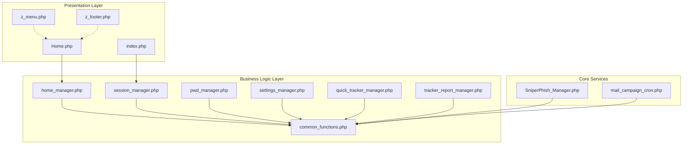

**Diagram sources**
- [index.php:1-188](file://spear/index.php#L1-L188)
- [Home.php:1-169](file://spear/Home.php#L1-L169)
- [z_menu.php:1-166](file://spear/z_menu.php#L1-L166)
- [z_footer.php:1-3](file://spear/z_footer.php#L1-L3)
- [session_manager.php:1-244](file://spear/manager/session_manager.php#L1-L244)
- [home_manager.php:1-120](file://spear/manager/home_manager.php#L1-L120)
- [common_functions.php:1-595](file://spear/manager/common_functions.php#L1-L595)
- [pwd_manager.php:1-99](file://spear/manager/pwd_manager.php#L1-L99)
- [settings_manager.php:1-474](file://spear/manager/settings_manager.php#L1-L474)
- [quick_tracker_manager.php:1-298](file://spear/manager/quick_tracker_manager.php#L1-L298)
- [tracker_report_manager.php:1-223](file://spear/manager/tracker_report_manager.php#L1-L223)
- [SniperPhish_Manager.php:1-46](file://spear/core/SniperPhish_Manager.php#L1-L46)
- [mail_campaign_cron.php:1-364](file://spear/core/mail_campaign_cron.php#L1-L364)

**Section sources**
- [index.php:1-188](file://spear/index.php#L1-L188)
- [Home.php:1-169](file://spear/Home.php#L1-L169)
- [z_menu.php:1-166](file://spear/z_menu.php#L1-L166)
- [z_footer.php:1-3](file://spear/z_footer.php#L1-L3)
- [session_manager.php:1-244](file://spear/manager/session_manager.php#L1-L244)
- [home_manager.php:1-120](file://spear/manager/home_manager.php#L1-L120)
- [common_functions.php:1-595](file://spear/manager/common_functions.php#L1-L595)
- [pwd_manager.php:1-99](file://spear/manager/pwd_manager.php#L1-L99)
- [settings_manager.php:1-474](file://spear/manager/settings_manager.php#L1-L474)
- [quick_tracker_manager.php:1-298](file://spear/manager/quick_tracker_manager.php#L1-L298)
- [tracker_report_manager.php:1-223](file://spear/manager/tracker_report_manager.php#L1-L223)
- [SniperPhish_Manager.php:1-46](file://spear/core/SniperPhish_Manager.php#L1-L46)
- [mail_campaign_cron.php:1-364](file://spear/core/mail_campaign_cron.php#L1-L364)

## Core Components
- Centralized utilities: common_functions.php provides:
  - OS-aware process management and single-instance enforcement
  - Mail transport configuration via DSN strategy
  - Data filtering, QR/Barcode generation, IP geolocation, and time zone conversions
  - Generic database helpers and logging
- Session manager: handles login, session lifecycle, cookies, and public access controls
- Feature managers: encapsulate business logic per feature (home, settings, quick tracker, tracker reports, password reset)
- Core services: long-running scheduler and mail campaign executor

Key responsibilities:
- Presentation: renders views and loads assets
- Business logic: orchestrates workflows, validates actions, and coordinates data access
- Data access: executes prepared statements and manages result sets

**Section sources**
- [common_functions.php:1-595](file://spear/manager/common_functions.php#L1-L595)
- [session_manager.php:1-244](file://spear/manager/session_manager.php#L1-L244)
- [home_manager.php:1-120](file://spear/manager/home_manager.php#L1-L120)
- [settings_manager.php:1-474](file://spear/manager/settings_manager.php#L1-L474)
- [quick_tracker_manager.php:1-298](file://spear/manager/quick_tracker_manager.php#L1-L298)
- [tracker_report_manager.php:1-223](file://spear/manager/tracker_report_manager.php#L1-L223)
- [SniperPhish_Manager.php:1-46](file://spear/core/SniperPhish_Manager.php#L1-L46)
- [mail_campaign_cron.php:1-364](file://spear/core/mail_campaign_cron.php#L1-L364)

## Architecture Overview
The system adheres to a layered MVC-like separation:
- Model: Managed via prepared statements inside managers and shared helpers
- View: PHP templates (e.g., Home.php) with embedded HTML and client-side scripts
- Controller: Manager classes act as controllers, parsing requests, invoking business logic, and returning JSON responses

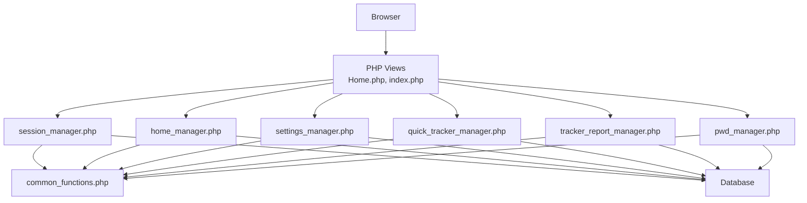

**Diagram sources**
- [index.php:1-188](file://spear/index.php#L1-L188)
- [Home.php:1-169](file://spear/Home.php#L1-L169)
- [session_manager.php:1-244](file://spear/manager/session_manager.php#L1-L244)
- [home_manager.php:1-120](file://spear/manager/home_manager.php#L1-L120)
- [settings_manager.php:1-474](file://spear/manager/settings_manager.php#L1-L474)
- [quick_tracker_manager.php:1-298](file://spear/manager/quick_tracker_manager.php#L1-L298)
- [tracker_report_manager.php:1-223](file://spear/manager/tracker_report_manager.php#L1-L223)
- [pwd_manager.php:1-99](file://spear/manager/pwd_manager.php#L1-L99)
- [common_functions.php:1-595](file://spear/manager/common_functions.php#L1-L595)

## Detailed Component Analysis

### Centralized Utility Library: common_functions.php
- Provides OS detection and process control for single-instance enforcement and background execution
- Implements a DSN strategy for mail transport configuration supporting multiple providers
- Offers keyword filtering, QR/Barcode generation, and generic database helpers
- Supplies time zone conversion and logging utilities

Design pattern highlights:
- Strategy pattern: getMailerDSN selects transport DSN based on provider type
- Factory-like usage: dynamic component loading via autoload and require_once in core services

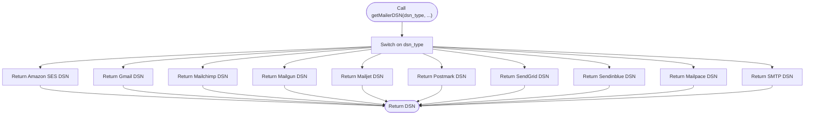

**Diagram sources**
- [common_functions.php:145-159](file://spear/manager/common_functions.php#L145-L159)

**Section sources**
- [common_functions.php:1-595](file://spear/manager/common_functions.php#L1-L595)

### Session Management: session_manager.php
- Validates login credentials, updates login/logout history, and starts/stops the core scheduler
- Manages session creation, regeneration, termination, and cookie population
- Supports public access control tokens for dashboards

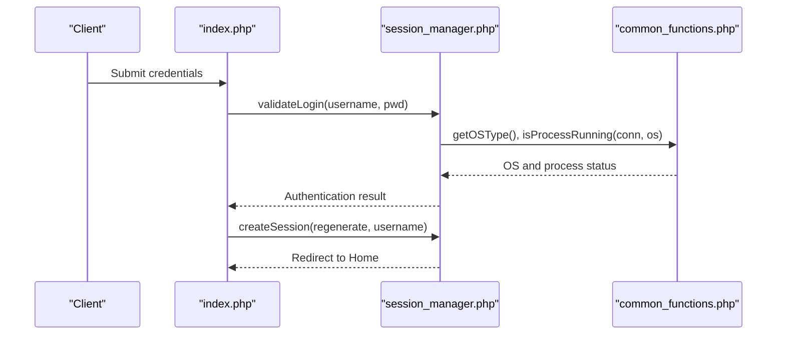

**Diagram sources**
- [index.php:1-188](file://spear/index.php#L1-L188)
- [session_manager.php:1-244](file://spear/manager/session_manager.php#L1-L244)
- [common_functions.php:1-595](file://spear/manager/common_functions.php#L1-L595)

**Section sources**
- [session_manager.php:1-244](file://spear/manager/session_manager.php#L1-L244)
- [index.php:1-188](file://spear/index.php#L1-L188)

### Home Dashboard: home_manager.php
- Aggregates campaign statistics and timeline data for charts
- Checks and starts the core scheduler process

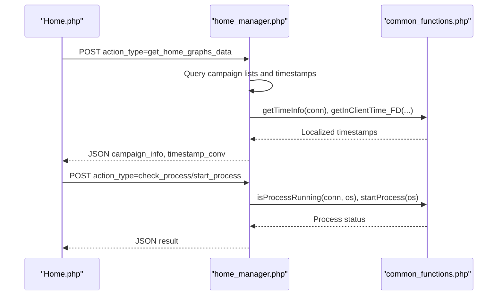

**Diagram sources**
- [Home.php:1-169](file://spear/Home.php#L1-L169)
- [home_manager.php:1-120](file://spear/manager/home_manager.php#L1-L120)
- [common_functions.php:1-595](file://spear/manager/common_functions.php#L1-L595)

**Section sources**
- [home_manager.php:1-120](file://spear/manager/home_manager.php#L1-L120)
- [Home.php:1-169](file://spear/Home.php#L1-L169)

### Password Reset: pwd_manager.php
- Handles password reset initiation and execution with token validation and expiry checks
- Updates user records and sends reset emails

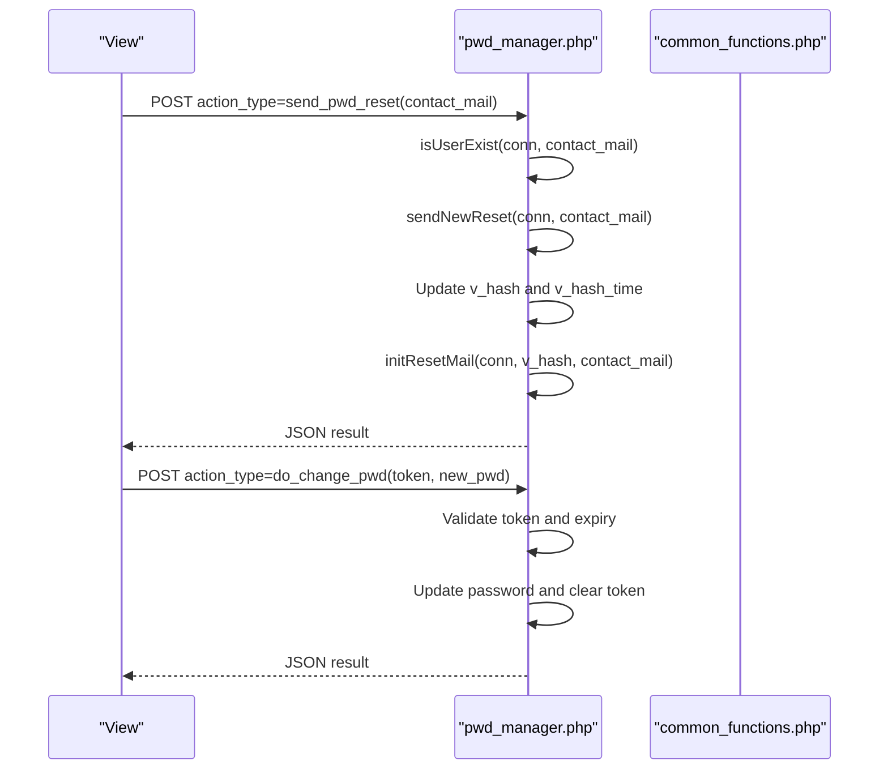

**Diagram sources**
- [pwd_manager.php:1-99](file://spear/manager/pwd_manager.php#L1-L99)
- [common_functions.php:1-595](file://spear/manager/common_functions.php#L1-L595)

**Section sources**
- [pwd_manager.php:1-99](file://spear/manager/pwd_manager.php#L1-L99)

### Settings: settings_manager.php
- Manages user accounts, timestamp/timezone settings, logs retrieval and export, and cleanup tasks
- Uses TCPDF for PDF exports and generic HTML rendering for CSV/HTML

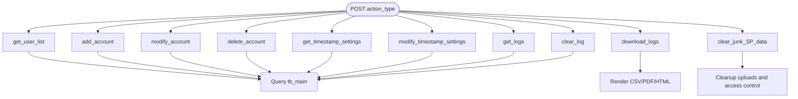

**Diagram sources**
- [settings_manager.php:1-474](file://spear/manager/settings_manager.php#L1-L474)

**Section sources**
- [settings_manager.php:1-474](file://spear/manager/settings_manager.php#L1-L474)

### Quick Tracker: quick_tracker_manager.php
- CRUD operations for quick trackers and live data reporting
- Supports DataTables-style pagination, filtering, and export to CSV/PDF/HTML

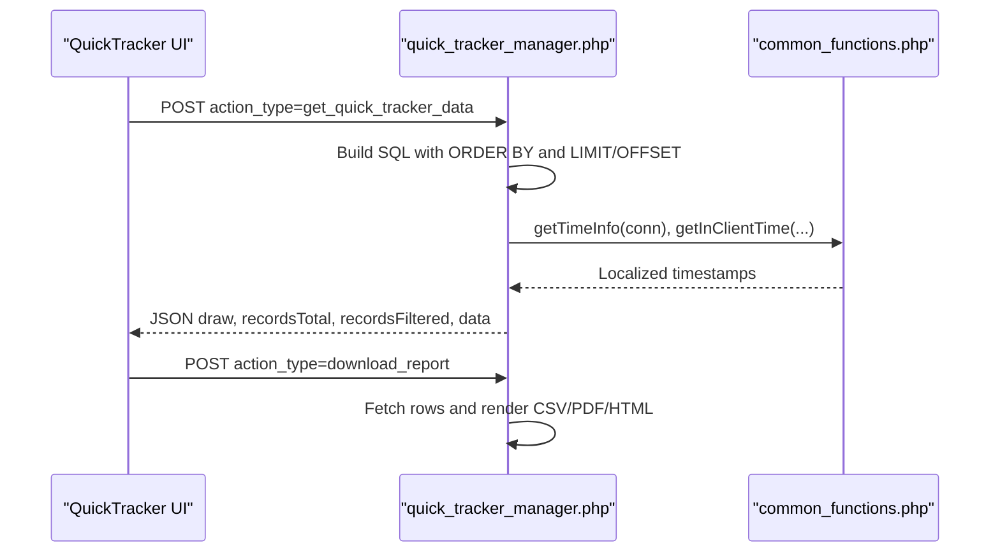

**Diagram sources**
- [quick_tracker_manager.php:1-298](file://spear/manager/quick_tracker_manager.php#L1-L298)
- [common_functions.php:1-595](file://spear/manager/common_functions.php#L1-L595)

**Section sources**
- [quick_tracker_manager.php:1-298](file://spear/manager/quick_tracker_manager.php#L1-L298)

### Tracker Reports: tracker_report_manager.php
- Retrieves and exports web tracker visits and form submissions
- Supports filtering and export formats similar to quick tracker

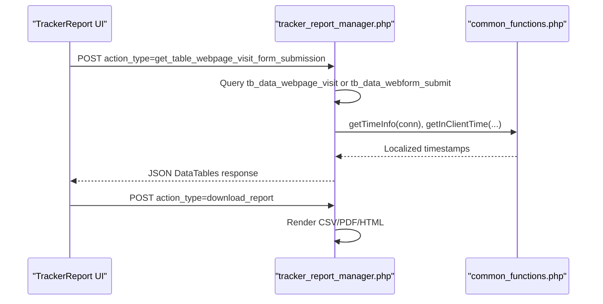

**Diagram sources**
- [tracker_report_manager.php:1-223](file://spear/manager/tracker_report_manager.php#L1-L223)
- [common_functions.php:1-595](file://spear/manager/common_functions.php#L1-L595)

**Section sources**
- [tracker_report_manager.php:1-223](file://spear/manager/tracker_report_manager.php#L1-L223)

### Core Scheduler and Mail Campaign Executor
- SniperPhish_Manager.php runs continuously, checking for scheduled campaigns and spawning mail_campaign_cron.php instances
- mail_campaign_cron.php initializes and executes email campaigns, applying anti-flood controls and retry logic

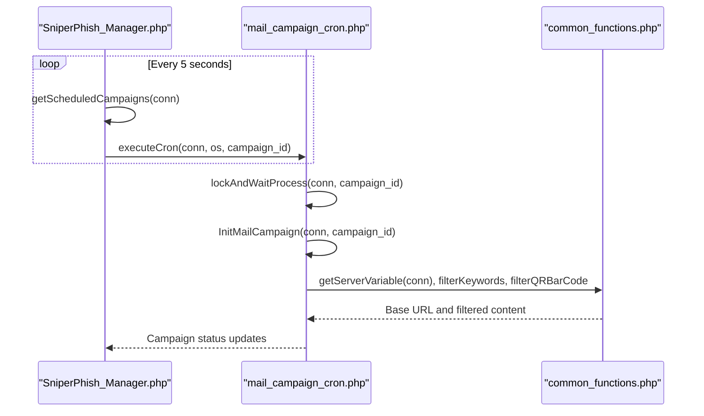

**Diagram sources**
- [SniperPhish_Manager.php:1-46](file://spear/core/SniperPhish_Manager.php#L1-L46)
- [mail_campaign_cron.php:1-364](file://spear/core/mail_campaign_cron.php#L1-L364)
- [common_functions.php:1-595](file://spear/manager/common_functions.php#L1-L595)

**Section sources**
- [SniperPhish_Manager.php:1-46](file://spear/core/SniperPhish_Manager.php#L1-L46)
- [mail_campaign_cron.php:1-364](file://spear/core/mail_campaign_cron.php#L1-L364)

## Dependency Analysis
- Managers depend on common_functions.php for shared utilities
- Core services depend on common_functions.php for DSN strategy and process control
- Views depend on managers for JSON endpoints and on z_menu.php/z_footer.php for layout
- Database access is centralized within managers via prepared statements

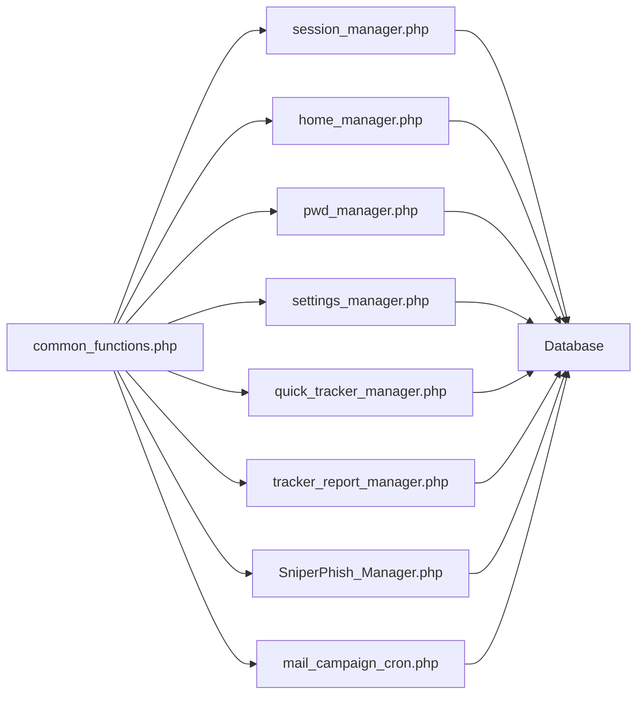

**Diagram sources**
- [common_functions.php:1-595](file://spear/manager/common_functions.php#L1-L595)
- [session_manager.php:1-244](file://spear/manager/session_manager.php#L1-L244)
- [home_manager.php:1-120](file://spear/manager/home_manager.php#L1-L120)
- [pwd_manager.php:1-99](file://spear/manager/pwd_manager.php#L1-L99)
- [settings_manager.php:1-474](file://spear/manager/settings_manager.php#L1-L474)
- [quick_tracker_manager.php:1-298](file://spear/manager/quick_tracker_manager.php#L1-L298)
- [tracker_report_manager.php:1-223](file://spear/manager/tracker_report_manager.php#L1-L223)
- [SniperPhish_Manager.php:1-46](file://spear/core/SniperPhish_Manager.php#L1-L46)
- [mail_campaign_cron.php:1-364](file://spear/core/mail_campaign_cron.php#L1-L364)

**Section sources**
- [common_functions.php:1-595](file://spear/manager/common_functions.php#L1-L595)
- [session_manager.php:1-244](file://spear/manager/session_manager.php#L1-L244)
- [home_manager.php:1-120](file://spear/manager/home_manager.php#L1-L120)
- [pwd_manager.php:1-99](file://spear/manager/pwd_manager.php#L1-L99)
- [settings_manager.php:1-474](file://spear/manager/settings_manager.php#L1-L474)
- [quick_tracker_manager.php:1-298](file://spear/manager/quick_tracker_manager.php#L1-L298)
- [tracker_report_manager.php:1-223](file://spear/manager/tracker_report_manager.php#L1-L223)
- [SniperPhish_Manager.php:1-46](file://spear/core/SniperPhish_Manager.php#L1-L46)
- [mail_campaign_cron.php:1-364](file://spear/core/mail_campaign_cron.php#L1-L364)

## Performance Considerations
- Prepared statements minimize SQL injection risk and improve performance for repeated queries
- Anti-flood controls in mail_campaign_cron.php throttle outbound traffic to respect provider limits
- Single-instance enforcement prevents redundant background processes
- Time zone conversions and localized formatting reduce client-server discrepancies

## Troubleshooting Guide
- Session issues: Verify session validity and process status; ensure isProcessRunning returns expected values
- Mail delivery failures: Review DSN configuration and peer verification settings; inspect retry counters and error messages
- Logging: Use logIt to record user actions and diagnose issues; export logs via settings manager for analysis
- Scheduler not starting: Confirm OS-specific binary path resolution and background execution commands

**Section sources**
- [session_manager.php:1-244](file://spear/manager/session_manager.php#L1-L244)
- [mail_campaign_cron.php:1-364](file://spear/core/mail_campaign_cron.php#L1-L364)
- [common_functions.php:1-595](file://spear/manager/common_functions.php#L1-L595)
- [settings_manager.php:1-474](file://spear/manager/settings_manager.php#L1-L474)

## Conclusion
SniperPhish employs a robust modular manager pattern with a centralized utility library, clearly separating presentation, business logic, and data access. The design leverages strategies for mail transport, factories for dynamic component loading, and practical session and scheduler management. This architecture supports maintainability, scalability, and predictable behavior across features like email campaigns, quick trackers, and web trackers.