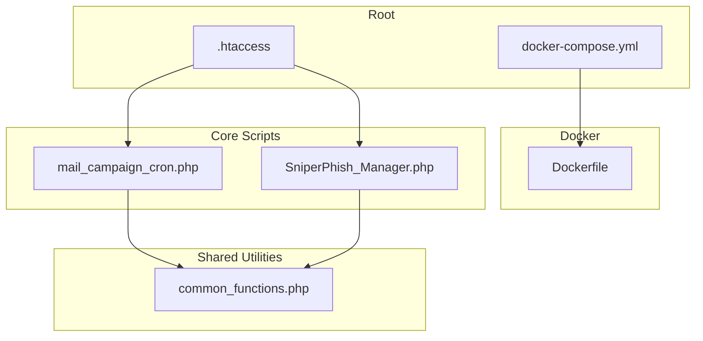
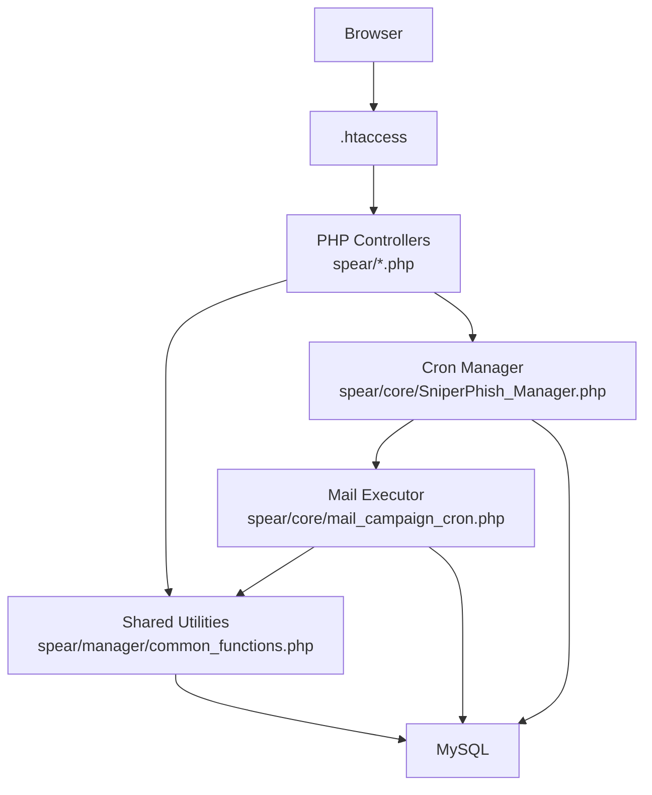
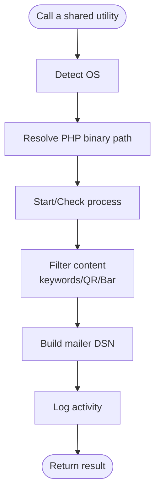
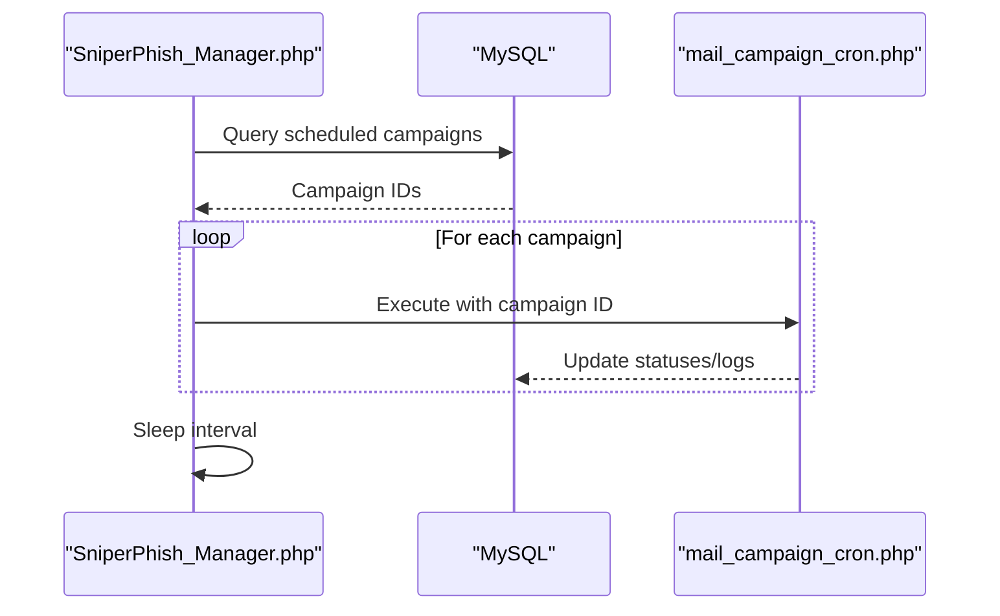
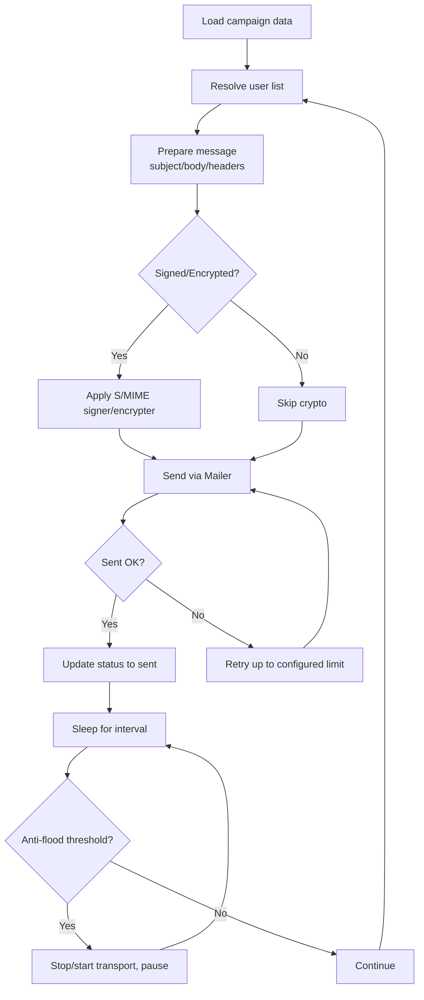
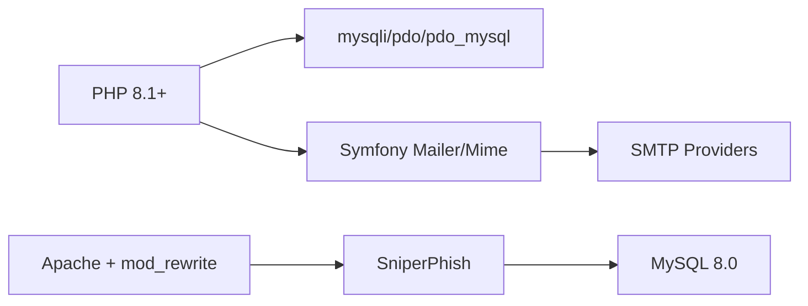
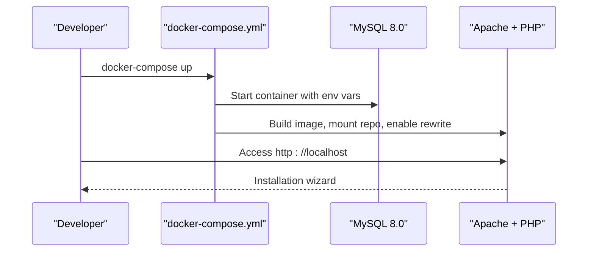

# Contributing Guidelines

<cite>
**Referenced Files in This Document**
- [README.md](file://README.md)
- [common_functions.php](file://spear/manager/common_functions.php)
- [SniperPhish_Manager.php](file://spear/core/SniperPhish_Manager.php)
- [mail_campaign_cron.php](file://spear/core/mail_campaign_cron.php)
- [Dockerfile](file://docker/Dockerfile)
- [docker-compose.yml](file://docker-compose.yml)
- [.htaccess](file://.htaccess)
</cite>

## Table of Contents
1. [Introduction](#introduction)
2. [Project Structure](#project-structure)
3. [Core Components](#core-components)
4. [Architecture Overview](#architecture-overview)
5. [Detailed Component Analysis](#detailed-component-analysis)
6. [Dependency Analysis](#dependency-analysis)
7. [Performance Considerations](#performance-considerations)
8. [Troubleshooting Guide](#troubleshooting-guide)
9. [Development Environment Setup](#development-environment-setup)
10. [Coding Standards](#coding-standards)
11. [Testing Procedures](#testing-procedures)
12. [Pull Request Workflow](#pull-request-workflow)
13. [Documentation Requirements](#documentation-requirements)
14. [Common Pitfalls and How to Avoid Them](#common-pitfalls-and-how-to-avoid-them)
15. [Conclusion](#conclusion)

## Introduction
This document provides comprehensive contributing guidelines for SniperPhish development. It focuses on coding standards, testing procedures, and the pull request process, grounded in the established conventions and patterns demonstrated in the repository’s core files. Contributions should emphasize maintainability, backward compatibility, and robustness, especially given the project’s role in security-aware phishing simulations.

## Project Structure
SniperPhish is a PHP-based web application with a modular frontend and backend. Key areas include:
- spear/manager: Shared PHP utilities and helpers used across the application.
- spear/core: Long-running cron and campaign execution scripts.
- spear: Frontend assets, JavaScript, and PHP controllers.
- docker: Containerization configuration for local development.
- Root-level configuration and routing via .htaccess.

**Diagram sources**
- [.htaccess:1-5](file://.htaccess#L1-L5)
- [docker-compose.yml:1-38](file://docker-compose.yml#L1-L38)
- [Dockerfile:1-10](file://docker/Dockerfile#L1-L10)
- [mail_campaign_cron.php:1-364](file://spear/core/mail_campaign_cron.php#L1-L364)
- [SniperPhish_Manager.php:1-46](file://spear/core/SniperPhish_Manager.php#L1-L46)
- [common_functions.php:1-595](file://spear/manager/common_functions.php#L1-L595)

**Section sources**
- [README.md:1-86](file://README.md#L1-L86)
- [.htaccess:1-5](file://.htaccess#L1-L5)
- [docker-compose.yml:1-38](file://docker-compose.yml#L1-L38)
- [Dockerfile:1-10](file://docker/Dockerfile#L1-L10)

## Core Components
- Shared utilities: Centralized helpers for OS detection, process management, mailer DSN construction, keyword filtering, QR/Barcode generation, IP and client parsing, logging, and time formatting.
- Cron manager: Single-instance enforcement and periodic campaign scheduling.
- Mail campaign executor: End-to-end orchestration of email campaigns, including templating, attachments, signing/encryption, anti-flood controls, and retry logic.

Key implementation patterns:
- Global initialization and timezone management.
- Strict database interaction via prepared statements.
- Extensive use of Symfony Mailer and Mime components.
- Robust error handling with JSON-encoded responses and logging.

**Section sources**
- [common_functions.php:1-595](file://spear/manager/common_functions.php#L1-L595)
- [SniperPhish_Manager.php:1-46](file://spear/core/SniperPhish_Manager.php#L1-L46)
- [mail_campaign_cron.php:1-364](file://spear/core/mail_campaign_cron.php#L1-L364)

## Architecture Overview
The application follows a classic PHP web architecture with CLI-driven tasks:
- Web requests route through .htaccess to PHP entry points.
- Controllers in spear/ handle UI flows.
- Shared logic resides in spear/manager/common_functions.php.
- Long-running tasks are executed via spear/core scripts, orchestrated by the cron manager.

**Diagram sources**
- [.htaccess:1-5](file://.htaccess#L1-L5)
- [common_functions.php:1-595](file://spear/manager/common_functions.php#L1-L595)
- [SniperPhish_Manager.php:1-46](file://spear/core/SniperPhish_Manager.php#L1-L46)
- [mail_campaign_cron.php:1-364](file://spear/core/mail_campaign_cron.php#L1-L364)

## Detailed Component Analysis

### Shared Utilities: common_functions.php
Highlights:
- OS abstraction and process lifecycle management.
- Mailer DSN builder supporting multiple providers.
- Content filtering and templating helpers.
- QR/Barcode generation and inline embedding.
- IP geolocation and user agent parsing.
- Logging and time zone conversions.

**Diagram sources**
- [common_functions.php:23-92](file://spear/manager/common_functions.php#L23-L92)
- [common_functions.php:145-159](file://spear/manager/common_functions.php#L145-L159)
- [common_functions.php:187-230](file://spear/manager/common_functions.php#L187-L230)
- [common_functions.php:576-586](file://spear/manager/common_functions.php#L576-L586)

**Section sources**
- [common_functions.php:1-595](file://spear/manager/common_functions.php#L1-L595)

### Cron Manager: SniperPhish_Manager.php
Responsibilities:
- Enforce single-instance execution.
- Periodically discover scheduled campaigns and spawn per-campaign workers.

**Diagram sources**
- [SniperPhish_Manager.php:23-28](file://spear/core/SniperPhish_Manager.php#L23-L28)
- [SniperPhish_Manager.php:31-45](file://spear/core/SniperPhish_Manager.php#L31-L45)
- [mail_campaign_cron.php:325-350](file://spear/core/mail_campaign_cron.php#L325-L350)

**Section sources**
- [SniperPhish_Manager.php:1-46](file://spear/core/SniperPhish_Manager.php#L1-L46)

### Mail Campaign Executor: mail_campaign_cron.php
Responsibilities:
- Load campaign, user group, template, sender, and configuration.
- Build personalized messages with keyword substitution and embedded assets.
- Apply optional S/MIME signing and encryption.
- Enforce anti-flood and retry policies.
- Update live tracking tables and campaign status.

**Diagram sources**
- [mail_campaign_cron.php:99-294](file://spear/core/mail_campaign_cron.php#L99-L294)
- [mail_campaign_cron.php:266-287](file://spear/core/mail_campaign_cron.php#L266-L287)

**Section sources**
- [mail_campaign_cron.php:1-364](file://spear/core/mail_campaign_cron.php#L1-L364)

## Dependency Analysis
- Runtime dependencies:
  - PHP 8.1+ with mysqli/pdo/pdo_mysql enabled.
  - Apache with mod_rewrite.
  - MySQL 8.0.
- Composer-less Symfony components vendored under spear/libs/symfony.
- Optional external mail providers via DSN-based configuration.

**Diagram sources**
- [Dockerfile:1-10](file://docker/Dockerfile#L1-L10)
- [docker-compose.yml:4-19](file://docker-compose.yml#L4-L19)
- [mail_campaign_cron.php:8-13](file://spear/core/mail_campaign_cron.php#L8-L13)

**Section sources**
- [Dockerfile:1-10](file://docker/Dockerfile#L1-L10)
- [docker-compose.yml:1-38](file://docker-compose.yml#L1-L38)
- [README.md:14-18](file://README.md#L14-L18)

## Performance Considerations
- Campaign execution uses microsecond sleeps and randomized intervals to balance throughput and rate limits.
- Anti-flood control periodically stops and restarts the transport to respect provider quotas.
- Prepared statements and batched updates minimize SQL overhead.
- Avoid long-running synchronous operations in web requests; use CLI workers for heavy tasks.

[No sources needed since this section provides general guidance]

## Troubleshooting Guide
Common areas to inspect:
- Process conflicts: Ensure single-instance enforcement is respected; check PID storage and process existence checks.
- Mail delivery failures: Review JSON-encoded error responses and logs; verify DSN correctness and credentials.
- Timezone and timestamps: Confirm client time zone and format conversions are applied consistently.
- IMAP reply tracking: Validate mailbox credentials and search criteria for reply detection.

**Section sources**
- [SniperPhish_Manager.php:11-15](file://spear/core/SniperPhish_Manager.php#L11-L15)
- [mail_campaign_cron.php:266-277](file://spear/core/mail_campaign_cron.php#L266-L277)
- [common_functions.php:471-520](file://spear/manager/common_functions.php#L471-L520)

## Development Environment Setup
Recommended approach:
- Use the provided Docker Compose stack to provision MySQL and Apache with PHP.
- Mount the repository root into the web container.
- Enable mod_rewrite and set the document root as configured.

**Diagram sources**
- [docker-compose.yml:1-38](file://docker-compose.yml#L1-L38)
- [Dockerfile:1-10](file://docker/Dockerfile#L1-L10)

**Section sources**
- [docker-compose.yml:1-38](file://docker-compose.yml#L1-L38)
- [Dockerfile:1-10](file://docker/Dockerfile#L1-L10)
- [README.md:19-24](file://README.md#L19-L24)

## Coding Standards
Adopt these conventions observed in the codebase:
- PHP
  - Prefer strict equality checks and explicit type handling.
  - Use prepared statements for all dynamic queries.
  - Centralize shared logic in common_functions.php to reduce duplication.
  - Keep functions small and single-purpose; group related helpers logically.
  - Use meaningful variable names and consistent casing (camelCase for functions, snake_case for constants).
- Naming patterns
  - Functions: camelCase (e.g., getOSType, filterKeywords).
  - Constants: UPPER_SNAKE_CASE (e.g., BASEURL).
  - Classes: PascalCase (e.g., SMimeSigner).
- Architecture
  - CLI workers for long-running tasks; keep web requests responsive.
  - Clear separation between UI controllers, shared utilities, and core schedulers/executors.
  - Use DSN-based mailer configuration to support multiple providers.
- Security
  - Sanitize inputs and escape outputs where applicable.
  - Validate email addresses and enforce secure peer verification settings.
  - Avoid echoing raw exceptions; return structured JSON responses.

**Section sources**
- [common_functions.php:1-595](file://spear/manager/common_functions.php#L1-L595)
- [mail_campaign_cron.php:1-364](file://spear/core/mail_campaign_cron.php#L1-L364)
- [SniperPhish_Manager.php:1-46](file://spear/core/SniperPhish_Manager.php#L1-L46)

## Testing Procedures
Guidelines for ensuring quality:
- Unit-like tests for shared utilities
  - Validate filtering functions (keyword replacement, QR/Bar generation).
  - Test DSN construction against supported providers.
  - Verify time conversion helpers with various formats/time zones.
- Integration tests for mail campaigns
  - Provision a test MySQL instance and Apache container.
  - Configure a lightweight SMTP relay for safe testing.
  - Execute mail_campaign_cron.php with a minimal campaign payload and assert:
    - Status transitions in live tracking tables.
    - Retry behavior under transient failures.
    - Anti-flood pauses and transport restarts.
- End-to-end tests
  - Simulate a full web-email campaign: create tracker, template, sender, and user group.
  - Trigger the cron manager and verify delivered messages and open-tracking behavior.
- Logging and observability
  - Confirm log entries are written on actions and errors.
  - Verify error payloads are JSON-encoded and actionable.

[No sources needed since this section provides general guidance]

## Pull Request Workflow
Proposed process:
- Branch naming
  - feature/short-description
  - fix/issue-reference
  - docs/update-guidelines
- Commit messages
  - Use imperative mood: “Add support for…” / “Fix validation in…” / “Improve logging for…”
  - Reference issue numbers when applicable.
- Code review
  - Ensure adherence to coding standards and architectural boundaries.
  - Verify tests cover new logic and regressions are unlikely.
  - Confirm backward compatibility for public APIs and persisted data structures.
- Quality gates
  - Linting and static checks (if configured).
  - Successful local Docker-based tests.
  - Minimal diff focused on the problem/solution.

[No sources needed since this section provides general guidance]

## Documentation Requirements
- New features
  - Update README with usage notes and screenshots where helpful.
  - Document configuration options and environment prerequisites.
- API changes
  - Describe parameter changes, return values, and error payloads.
- Internal changes
  - Add comments for complex logic and cross-module dependencies.
  - Keep shared function documentation concise and accurate.

[No sources needed since this section provides general guidance]

## Common Pitfalls and How to Avoid Them
- Running multiple instances of the cron manager
  - Rely on single-instance enforcement; avoid manual parallel runs.
- Ignoring anti-flood settings
  - Respect provider rate limits; do not bypass transport restarts.
- Unsafe string interpolation
  - Always use prepared statements and parameter binding.
- Incorrect time zone handling
  - Use provided helpers to convert and format timestamps consistently.
- Overlooking logging
  - Ensure critical events and errors are logged for auditability.

**Section sources**
- [SniperPhish_Manager.php:11-15](file://spear/core/SniperPhish_Manager.php#L11-L15)
- [mail_campaign_cron.php:283-287](file://spear/core/mail_campaign_cron.php#L283-L287)
- [common_functions.php:486-520](file://spear/manager/common_functions.php#L486-L520)

## Conclusion
By following these guidelines, contributors can deliver reliable, maintainable enhancements to SniperPhish. Focus on modular design, robust error handling, and thorough testing—especially around mail delivery and campaign execution—to uphold the project’s integrity and usability.