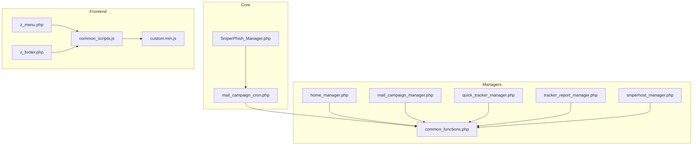
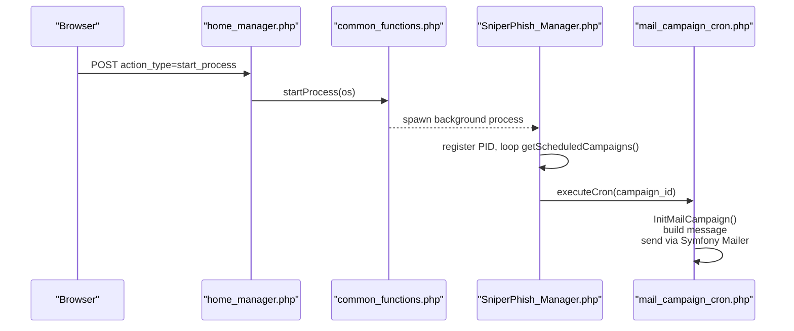
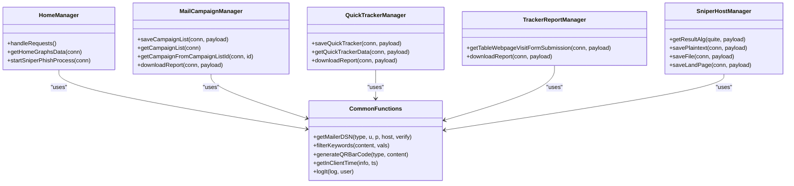
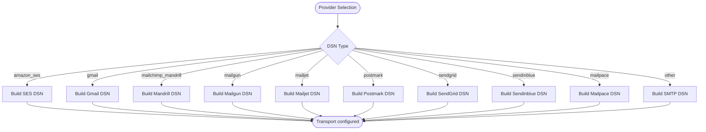
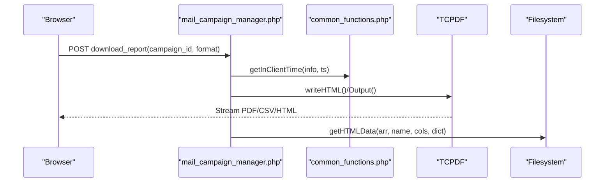
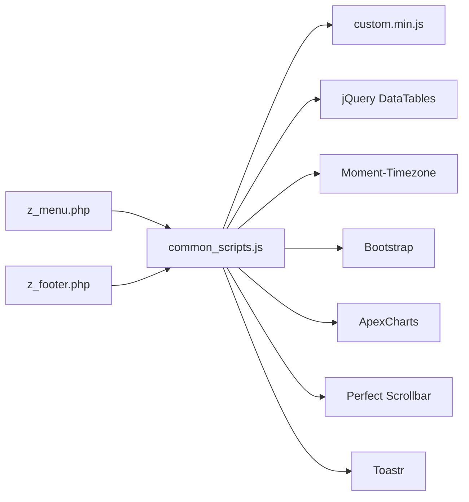
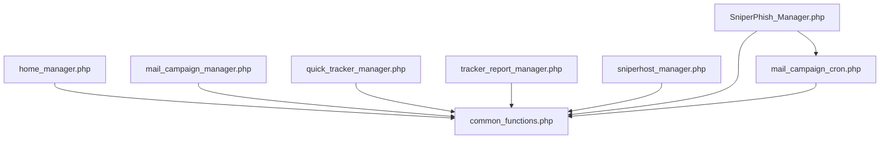

# Development and Customization

<cite>
**Referenced Files in This Document**
- [README.md](file://README.md)
- [SniperPhish_Manager.php](file://spear/core/SniperPhish_Manager.php)
- [mail_campaign_cron.php](file://spear/core/mail_campaign_cron.php)
- [common_functions.php](file://spear/manager/common_functions.php)
- [home_manager.php](file://spear/manager/home_manager.php)
- [mail_campaign_manager.php](file://spear/manager/mail_campaign_manager.php)
- [quick_tracker_manager.php](file://spear/manager/quick_tracker_manager.php)
- [tracker_report_manager.php](file://spear/manager/tracker_report_manager.php)
- [sniperhost_manager.php](file://spear/sniperhost/manager/sniperhost_manager.php)
- [common_scripts.js](file://spear/js/common_scripts.js)
- [custom.min.js](file://spear/js/libs/custom.min.js)
- [z_menu.php](file://spear/z_menu.php)
- [z_footer.php](file://spear/z_footer.php)
</cite>

## Table of Contents
1. [Introduction](#introduction)
2. [Project Structure](#project-structure)
3. [Core Components](#core-components)
4. [Architecture Overview](#architecture-overview)
5. [Detailed Component Analysis](#detailed-component-analysis)
6. [Dependency Analysis](#dependency-analysis)
7. [Performance Considerations](#performance-considerations)
8. [Troubleshooting Guide](#troubleshooting-guide)
9. [Conclusion](#conclusion)
10. [Appendices](#appendices)

## Introduction
This document provides comprehensive development and customization guidance for extending SniperPhish. It focuses on:
- Modular manager pattern and shared utilities
- Extension points for tracking methods, email providers, and reporting formats
- Practical examples for creating custom managers, integrating third-party libraries, and modifying existing functionality
- Frontend asset management, CSS/JS frameworks, and dependency injection patterns
- Code organization principles, naming conventions, and architectural patterns
- Plugin architecture and contribution workflow

## Project Structure
SniperPhish follows a layered, feature-based structure:
- Core runtime and scheduling: spear/core
- Managers (controllers): spear/manager
- Feature modules: spear/sniperhost
- Frontend assets: spear/css, spear/js, spear/images
- Shared utilities: spear/manager/common_functions.php
- Entry points and UI scaffolding: various PHP pages and includes

**Diagram sources**
- [SniperPhish_Manager.php:1-46](file://spear/core/SniperPhish_Manager.php#L1-L46)
- [mail_campaign_cron.php:1-364](file://spear/core/mail_campaign_cron.php#L1-L364)
- [common_functions.php:1-595](file://spear/manager/common_functions.php#L1-L595)
- [home_manager.php:1-120](file://spear/manager/home_manager.php#L1-L120)
- [mail_campaign_manager.php:1-547](file://spear/manager/mail_campaign_manager.php#L1-L547)
- [quick_tracker_manager.php:1-298](file://spear/manager/quick_tracker_manager.php#L1-L298)
- [tracker_report_manager.php:1-223](file://spear/manager/tracker_report_manager.php#L1-L223)
- [sniperhost_manager.php:1-314](file://spear/sniperhost/manager/sniperhost_manager.php#L1-L314)
- [common_scripts.js:1-323](file://spear/js/common_scripts.js#L1-L323)
- [custom.min.js:1-117](file://spear/js/libs/custom.min.js#L1-L117)
- [z_menu.php:1-166](file://spear/z_menu.php#L1-L166)
- [z_footer.php:1-3](file://spear/z_footer.php#L1-L3)

**Section sources**
- [README.md:1-86](file://README.md#L1-L86)
- [SniperPhish_Manager.php:1-46](file://spear/core/SniperPhish_Manager.php#L1-L46)
- [mail_campaign_cron.php:1-364](file://spear/core/mail_campaign_cron.php#L1-L364)
- [common_functions.php:1-595](file://spear/manager/common_functions.php#L1-L595)
- [home_manager.php:1-120](file://spear/manager/home_manager.php#L1-L120)
- [mail_campaign_manager.php:1-547](file://spear/manager/mail_campaign_manager.php#L1-L547)
- [quick_tracker_manager.php:1-298](file://spear/manager/quick_tracker_manager.php#L1-L298)
- [tracker_report_manager.php:1-223](file://spear/manager/tracker_report_manager.php#L1-L223)
- [sniperhost_manager.php:1-314](file://spear/sniperhost/manager/sniperhost_manager.php#L1-L314)
- [common_scripts.js:1-323](file://spear/js/common_scripts.js#L1-L323)
- [custom.min.js:1-117](file://spear/js/libs/custom.min.js#L1-L117)
- [z_menu.php:1-166](file://spear/z_menu.php#L1-L166)
- [z_footer.php:1-3](file://spear/z_footer.php#L1-L3)

## Core Components
- Modular Manager Pattern: Each feature area has a dedicated manager that handles requests, validates sessions, and orchestrates database operations and shared utilities.
- Shared Utilities Library: common_functions.php centralizes reusable logic for OS/process management, mailer DSN construction, keyword filtering, QR/Barcode generation, IP/geolocation, time formatting, logging, and reporting helpers.
- Core Scheduler: SniperPhish_Manager.php runs continuously, checks single-instance constraints, registers itself, and triggers per-campaign cron workers.
- Campaign Engine: mail_campaign_cron.php fetches campaign/user/template/sender/config, builds messages, applies filters and attachments, signs/encrypts, and sends with anti-flood controls.

Key responsibilities:
- Session validation and public access bypass for selected endpoints
- Data retrieval, transformation, and reporting
- Timezone-aware conversions and client-specific formatting
- Extensible mail provider selection via DSN types
- Reporting pipeline to CSV/PDF/HTML

**Section sources**
- [home_manager.php:1-120](file://spear/manager/home_manager.php#L1-L120)
- [mail_campaign_manager.php:1-547](file://spear/manager/mail_campaign_manager.php#L1-L547)
- [quick_tracker_manager.php:1-298](file://spear/manager/quick_tracker_manager.php#L1-L298)
- [tracker_report_manager.php:1-223](file://spear/manager/tracker_report_manager.php#L1-L223)
- [sniperhost_manager.php:1-314](file://spear/sniperhost/manager/sniperhost_manager.php#L1-L314)
- [common_functions.php:1-595](file://spear/manager/common_functions.php#L1-L595)
- [SniperPhish_Manager.php:1-46](file://spear/core/SniperPhish_Manager.php#L1-L46)
- [mail_campaign_cron.php:1-364](file://spear/core/mail_campaign_cron.php#L1-L364)

## Architecture Overview
The system uses a request-to-manager-to-utility-to-database pattern with a scheduler-driven engine.

**Diagram sources**
- [home_manager.php:105-119](file://spear/manager/home_manager.php#L105-L119)
- [common_functions.php:78-92](file://spear/manager/common_functions.php#L78-L92)
- [SniperPhish_Manager.php:18-28](file://spear/core/SniperPhish_Manager.php#L18-L28)
- [mail_campaign_cron.php:361-362](file://spear/core/mail_campaign_cron.php#L361-L362)

## Detailed Component Analysis

### Modular Manager Pattern
Managers encapsulate feature logic and enforce session checks. They accept JSON payloads, dispatch actions, and return JSON responses. Public endpoints are whitelisted for anonymous access in specific contexts.

**Diagram sources**
- [home_manager.php:1-120](file://spear/manager/home_manager.php#L1-L120)
- [mail_campaign_manager.php:1-547](file://spear/manager/mail_campaign_manager.php#L1-L547)
- [quick_tracker_manager.php:1-298](file://spear/manager/quick_tracker_manager.php#L1-L298)
- [tracker_report_manager.php:1-223](file://spear/manager/tracker_report_manager.php#L1-L223)
- [sniperhost_manager.php:1-314](file://spear/sniperhost/manager/sniperhost_manager.php#L1-L314)
- [common_functions.php:145-159](file://spear/manager/common_functions.php#L145-L159)

**Section sources**
- [home_manager.php:1-120](file://spear/manager/home_manager.php#L1-L120)
- [mail_campaign_manager.php:1-547](file://spear/manager/mail_campaign_manager.php#L1-L547)
- [quick_tracker_manager.php:1-298](file://spear/manager/quick_tracker_manager.php#L1-L298)
- [tracker_report_manager.php:1-223](file://spear/manager/tracker_report_manager.php#L1-L223)
- [sniperhost_manager.php:1-314](file://spear/sniperhost/manager/sniperhost_manager.php#L1-L314)
- [common_functions.php:1-595](file://spear/manager/common_functions.php#L1-L595)

### Email Provider Integration and DSN Types
The mailer supports multiple providers via DSN types. The getMailerDSN function maps provider identifiers to DSN strings, enabling flexible SMTP/SES integrations.

**Diagram sources**
- [common_functions.php:145-159](file://spear/manager/common_functions.php#L145-L159)

**Section sources**
- [common_functions.php:145-159](file://spear/manager/common_functions.php#L145-L159)

### Reporting Pipeline and Formats
Reporting supports CSV, PDF, and HTML outputs. Managers assemble datasets, transform timestamps and nested fields, and stream downloads.

**Diagram sources**
- [mail_campaign_manager.php:410-546](file://spear/manager/mail_campaign_manager.php#L410-L546)
- [common_functions.php:535-574](file://spear/manager/common_functions.php#L535-L574)

**Section sources**
- [mail_campaign_manager.php:410-546](file://spear/manager/mail_campaign_manager.php#L410-L546)
- [common_functions.php:535-574](file://spear/manager/common_functions.php#L535-L574)

### Frontend Asset Management and Dependency Injection
The frontend uses jQuery, Bootstrap, DataTables, ApexCharts, Moment.js, Toastr, and Perfect Scrollbar. Assets are included via minified bundles and individual libraries. The UI injects configuration and manages session lifecycle.

**Diagram sources**
- [z_menu.php:1-166](file://spear/z_menu.php#L1-L166)
- [z_footer.php:1-3](file://spear/z_footer.php#L1-L3)
- [common_scripts.js:1-323](file://spear/js/common_scripts.js#L1-L323)
- [custom.min.js:1-117](file://spear/js/libs/custom.min.js#L1-L117)

**Section sources**
- [z_menu.php:1-166](file://spear/z_menu.php#L1-L166)
- [z_footer.php:1-3](file://spear/z_footer.php#L1-L3)
- [common_scripts.js:1-323](file://spear/js/common_scripts.js#L1-L323)
- [custom.min.js:1-117](file://spear/js/libs/custom.min.js#L1-L117)

## Dependency Analysis
- Managers depend on common_functions.php for shared utilities.
- Core scheduler depends on common_functions.php for process and mailer helpers.
- Campaign engine depends on Symfony Mailer and QR/Barcode libraries.
- Frontend depends on jQuery ecosystem and UI frameworks.

**Diagram sources**
- [common_functions.php:1-595](file://spear/manager/common_functions.php#L1-L595)
- [home_manager.php:1-120](file://spear/manager/home_manager.php#L1-L120)
- [mail_campaign_manager.php:1-547](file://spear/manager/mail_campaign_manager.php#L1-L547)
- [quick_tracker_manager.php:1-298](file://spear/manager/quick_tracker_manager.php#L1-L298)
- [tracker_report_manager.php:1-223](file://spear/manager/tracker_report_manager.php#L1-L223)
- [sniperhost_manager.php:1-314](file://spear/sniperhost/manager/sniperhost_manager.php#L1-L314)
- [SniperPhish_Manager.php:1-46](file://spear/core/SniperPhish_Manager.php#L1-L46)
- [mail_campaign_cron.php:1-364](file://spear/core/mail_campaign_cron.php#L1-L364)

**Section sources**
- [common_functions.php:1-595](file://spear/manager/common_functions.php#L1-L595)
- [SniperPhish_Manager.php:1-46](file://spear/core/SniperPhish_Manager.php#L1-L46)
- [mail_campaign_cron.php:1-364](file://spear/core/mail_campaign_cron.php#L1-L364)

## Performance Considerations
- Anti-flood control: Campaign engine pauses transport periodically to respect provider limits.
- Batch processing: Managers use server-side DataTables pagination to limit dataset sizes.
- Timezone conversions: Precomputed timezone offsets reduce per-row conversion overhead.
- Logging: Centralized logging minimizes repeated DB writes.

[No sources needed since this section provides general guidance]

## Troubleshooting Guide
Common areas to inspect:
- Process management: Single-instance enforcement and PID registration
- Mailer failures: DSN configuration and peer verification settings
- Reporting errors: Missing attachments or malformed nested fields
- Frontend session timeouts: Idle timer and re-login modal flow

**Section sources**
- [SniperPhish_Manager.php:10-22](file://spear/core/SniperPhish_Manager.php#L10-L22)
- [mail_campaign_cron.php:283-288](file://spear/core/mail_campaign_cron.php#L283-L288)
- [common_scripts.js:246-323](file://spear/js/common_scripts.js#L246-L323)

## Conclusion
SniperPhish’s architecture cleanly separates concerns through managers, a shared utilities library, and a scheduler-driven engine. The system is extensible via DSN providers, reporting formats, and custom managers. Frontend asset management leverages established libraries with clear dependency injection patterns. Following the documented patterns enables safe and maintainable customizations.

[No sources needed since this section summarizes without analyzing specific files]

## Appendices

### Extension Points and Customization Patterns

- Adding a new email provider
  - Extend DSN mapping in the mailer utility
  - Reference: [common_functions.php:145-159](file://spear/manager/common_functions.php#L145-L159)
  - Example: Add a new case returning a provider-specific DSN string

- Integrating a third-party library
  - Place library files under spear/libs or feature-specific folders
  - Include autoloaders or require statements in the target manager
  - Example: Campaign engine includes Symfony Mailer autoload and QR generators
  - References:
    - [mail_campaign_cron.php:5-6](file://spear/core/mail_campaign_cron.php#L5-L6)
    - [mail_campaign_manager.php](file://spear/manager/mail_campaign_manager.php#L3)

- Creating a custom manager
  - Copy the session validation pattern from existing managers
  - Define action dispatch and JSON I/O
  - Use shared utilities for common tasks
  - References:
    - [home_manager.php:1-22](file://spear/manager/home_manager.php#L1-L22)
    - [quick_tracker_manager.php:1-11](file://spear/manager/quick_tracker_manager.php#L1-L11)

- Modifying UI components
  - Update z_menu.php or page-specific includes
  - Ensure scripts load after DOM ready
  - References:
    - [z_menu.php:110-166](file://spear/z_menu.php#L110-L166)
    - [common_scripts.js:1-323](file://spear/js/common_scripts.js#L1-L323)

- Extending reporting features
  - Add new format handlers in the reporting manager
  - Transform datasets using time formatting helpers
  - References:
    - [mail_campaign_manager.php:505-546](file://spear/manager/mail_campaign_manager.php#L505-L546)
    - [tracker_report_manager.php:68-109](file://spear/manager/tracker_report_manager.php#L68-L109)
    - [common_functions.php:535-574](file://spear/manager/common_functions.php#L535-L574)

### Coding Standards and Contribution Workflow
- Follow the existing file naming and directory conventions
- Keep managers thin: orchestrate, delegate to shared utilities
- Centralize cross-cutting concerns in common_functions.php
- Validate sessions early in managers; whitelist public endpoints carefully
- Use JSON for request/response payloads consistently
- Respect anti-flood and retry policies for outbound mail
- Provide clear error responses and logs

[No sources needed since this section provides general guidance]