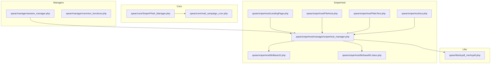
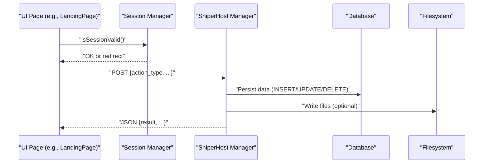
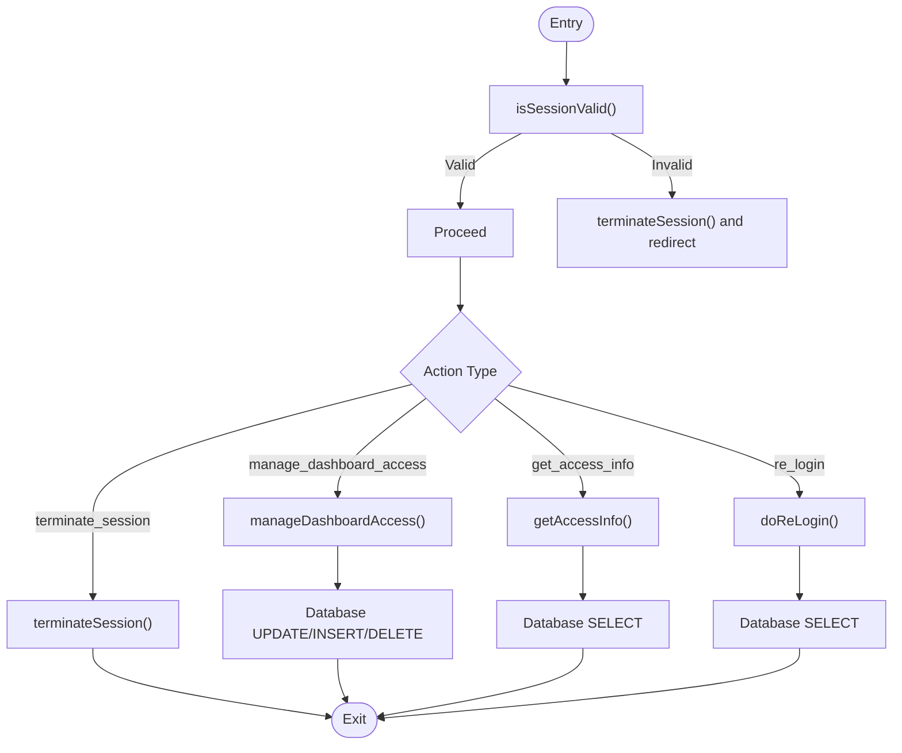
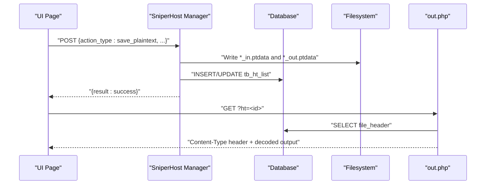
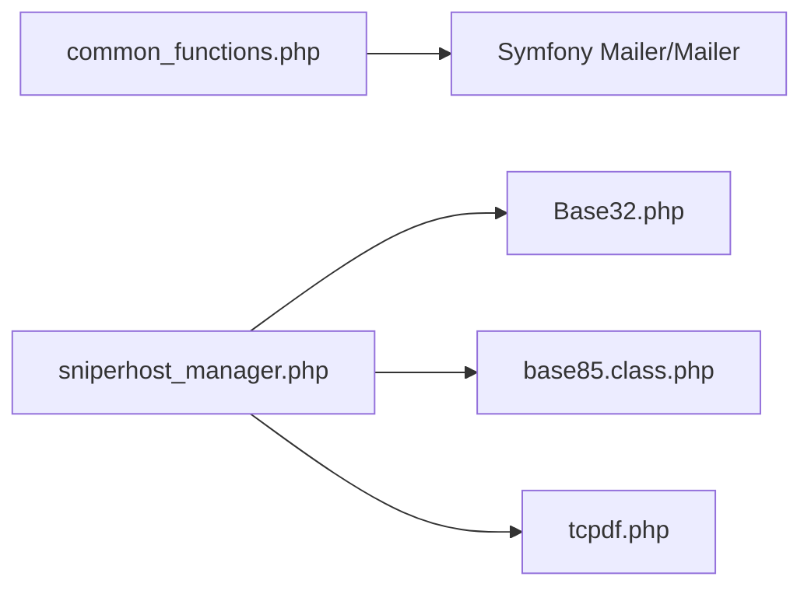
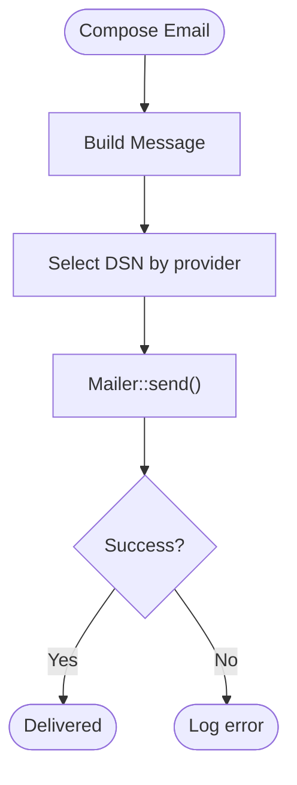
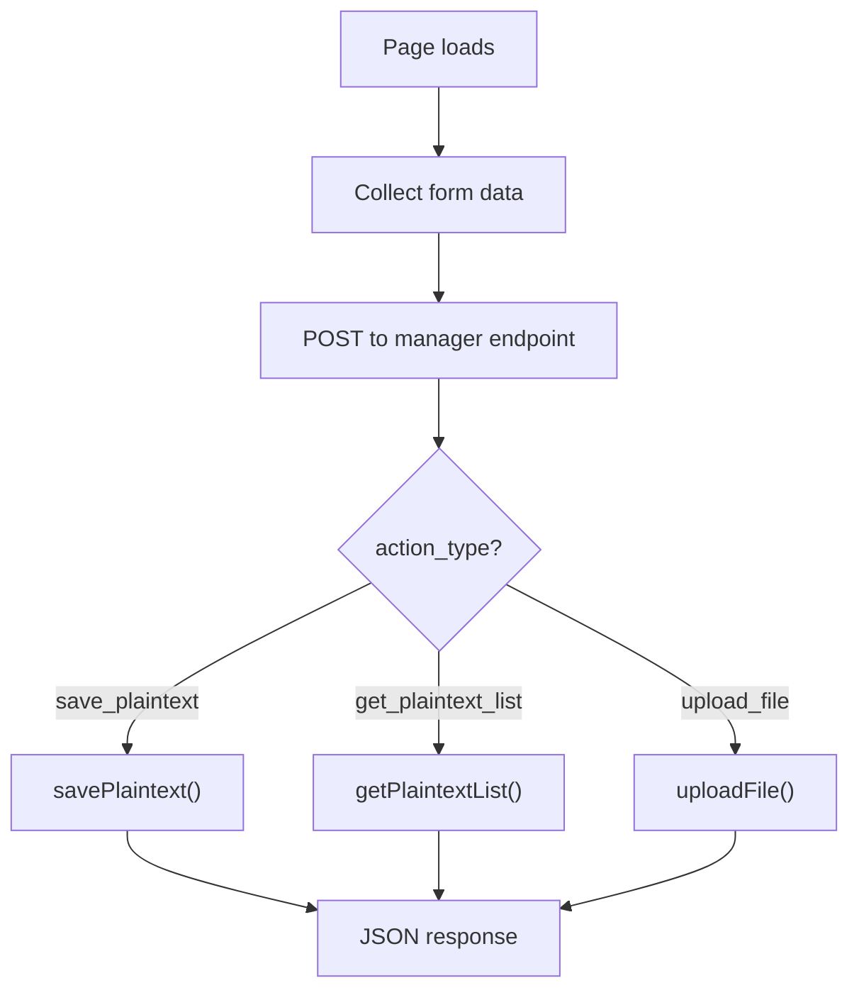
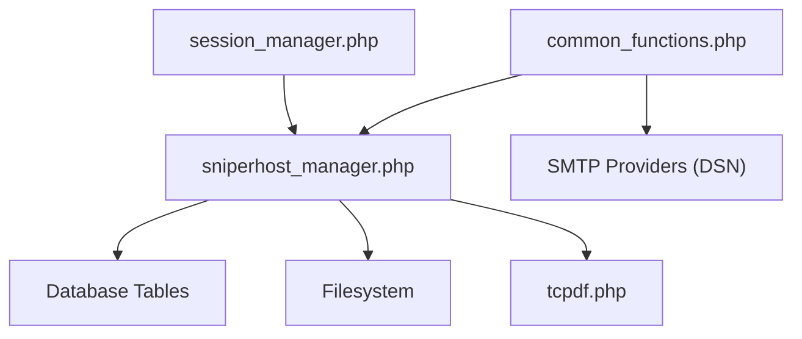

# Extension Development Guide

<cite>
**Referenced Files in This Document**
- [SniperPhish_Manager.php](file://spear/core/SniperPhish_Manager.php)
- [mail_campaign_cron.php](file://spear/core/mail_campaign_cron.php)
- [session_manager.php](file://spear/manager/session_manager.php)
- [common_functions.php](file://spear/manager/common_functions.php)
- [sniperhost_manager.php](file://spear/sniperhost/manager/sniperhost_manager.php)
- [Base32.php](file://spear/sniperhost/lib/Base32.php)
- [base85.class.php](file://spear/sniperhost/lib/base85.class.php)
- [LandingPage.php](file://spear/sniperhost/LandingPage.php)
- [FileHost.php](file://spear/sniperhost/FileHost.php)
- [PlainText.php](file://spear/sniperhost/PlainText.php)
- [out.php](file://spear/sniperhost/out.php)
- [tcpdf.php](file://spear/libs/tcpdf_min/tcpdf.php)
- [README.md](file://README.md)
</cite>

## Table of Contents
1. [Introduction](#introduction)
2. [Project Structure](#project-structure)
3. [Core Components](#core-components)
4. [Architecture Overview](#architecture-overview)
5. [Detailed Component Analysis](#detailed-component-analysis)
6. [Dependency Analysis](#dependency-analysis)
7. [Performance Considerations](#performance-considerations)
8. [Troubleshooting Guide](#troubleshooting-guide)
9. [Conclusion](#conclusion)
10. [Appendices](#appendices)

## Introduction
This guide explains how to extend SniperPhish with custom functionality. It focuses on:
- Creating custom manager classes following the established patterns
- Integrating third-party libraries from the libs/ directory and creating new library integrations
- Adding new tracking methods, custom email providers, and extended reporting capabilities
- Using the hook-like request routing pattern and dependency injection via autoloading and require_once
- Managing configuration for new features
- Practical examples for custom landing page hosting modules, additional tracking mechanisms, and specialized reporting formats
- The extension lifecycle from development to deployment

## Project Structure
SniperPhish is organized around:
- spear/core: background tasks and cron orchestration
- spear/manager: shared managers and common functions
- spear/sniperhost: landing page/file/plain-text hosting subsystem
- spear/libs: third-party libraries integrated into the project
- spear/js, spear/css, spear/images: frontend assets
- spear/uploads: attachments and images used in campaigns

**Diagram sources**
- [SniperPhish_Manager.php:1-46](file://spear/core/SniperPhish_Manager.php#L1-L46)
- [mail_campaign_cron.php](file://spear/core/mail_campaign_cron.php)
- [session_manager.php:1-244](file://spear/manager/session_manager.php#L1-L244)
- [common_functions.php:1-595](file://spear/manager/common_functions.php#L1-L595)
- [sniperhost_manager.php:1-314](file://spear/sniperhost/manager/sniperhost_manager.php#L1-L314)
- [LandingPage.php:1-200](file://spear/sniperhost/LandingPage.php#L1-L200)
- [FileHost.php:1-200](file://spear/sniperhost/FileHost.php#L1-L200)
- [PlainText.php:1-200](file://spear/sniperhost/PlainText.php#L1-L200)
- [out.php:1-38](file://spear/sniperhost/out.php#L1-L38)
- [Base32.php:1-147](file://spear/sniperhost/lib/Base32.php#L1-L147)
- [base85.class.php:1-104](file://spear/sniperhost/lib/base85.class.php#L1-L104)
- [tcpdf.php:1-200](file://spear/libs/tcpdf_min/tcpdf.php#L1-L200)

**Section sources**
- [README.md](file://README.md)

## Core Components
- Session manager: handles login, session lifecycle, dashboard access control, and cookie metadata
- Common functions: shared utilities for mail sending, QR/barcode generation, IP info, time formatting, logging, and cron orchestration
- SniperHost manager: orchestrates landing page, file, and plain-text hosting APIs with persistence and output routing
- Third-party libraries: TCPDF for PDF generation, Base32/Base85 encoders for hosting output

Key patterns:
- Managers accept JSON payloads via POST and return JSON responses
- Session validation is enforced at the top of managers
- Libraries are included locally within managers or pages where needed
- Cron orchestration runs background tasks for scheduled campaigns

**Section sources**
- [session_manager.php:1-244](file://spear/manager/session_manager.php#L1-L244)
- [common_functions.php:1-595](file://spear/manager/common_functions.php#L1-L595)
- [sniperhost_manager.php:1-314](file://spear/sniperhost/manager/sniperhost_manager.php#L1-L314)

## Architecture Overview
The extension architecture follows a request-to-manager pattern:
- Frontend pages (e.g., LandingPage.php, FileHost.php, PlainText.php) render UI and call manager endpoints
- Managers validate sessions, parse actions, and delegate to internal functions
- Functions persist data to database tables and write files to disk when needed
- Output endpoints (e.g., out.php) serve hosted content based on identifiers

**Diagram sources**
- [LandingPage.php:1-200](file://spear/sniperhost/LandingPage.php#L1-L200)
- [session_manager.php:35-44](file://spear/manager/session_manager.php#L35-L44)
- [sniperhost_manager.php:16-51](file://spear/sniperhost/manager/sniperhost_manager.php#L16-L51)

## Detailed Component Analysis

### Session Manager Pattern
The session manager enforces authentication and session lifecycle. It validates credentials, updates login/logout history, manages cookies, and controls dashboard access.

**Diagram sources**
- [session_manager.php:35-196](file://spear/manager/session_manager.php#L35-L196)

**Section sources**
- [session_manager.php:1-244](file://spear/manager/session_manager.php#L1-L244)

### SniperHost Manager Pattern
The SniperHost manager centralizes hosting operations:
- Plain-text hosting: encode/transform input with selected algorithms and persist metadata and outputs
- File hosting: persist uploaded files and metadata with content-type headers
- Landing page hosting: save HTML pages and retrieve content for serving
- Output routing: out.php serves hosted content based on identifiers

**Diagram sources**
- [sniperhost_manager.php:55-112](file://spear/sniperhost/manager/sniperhost_manager.php#L55-L112)
- [out.php:14-24](file://spear/sniperhost/out.php#L14-L24)

**Section sources**
- [sniperhost_manager.php:1-314](file://spear/sniperhost/manager/sniperhost_manager.php#L1-L314)
- [out.php:1-38](file://spear/sniperhost/out.php#L1-L38)

### Library Integration Patterns
- Local inclusion: managers include libraries directly (e.g., Base32, base85) to keep dependencies explicit
- Composer autoload: common functions import Symfony Mailer/Mailer for email delivery
- PDF generation: TCPDF is included and used for reporting

**Diagram sources**
- [common_functions.php:4-6](file://spear/manager/common_functions.php#L4-L6)
- [sniperhost_manager.php:6-7](file://spear/sniperhost/manager/sniperhost_manager.php#L6-L7)
- [Base32.php:1-147](file://spear/sniperhost/lib/Base32.php#L1-L147)
- [base85.class.php:1-104](file://spear/sniperhost/lib/base85.class.php#L1-L104)
- [tcpdf.php:110-122](file://spear/libs/tcpdf_min/tcpdf.php#L110-L122)

**Section sources**
- [common_functions.php:114-159](file://spear/manager/common_functions.php#L114-L159)
- [sniperhost_manager.php:6-7](file://spear/sniperhost/manager/sniperhost_manager.php#L6-L7)
- [Base32.php:1-147](file://spear/sniperhost/lib/Base32.php#L1-L147)
- [base85.class.php:1-104](file://spear/sniperhost/lib/base85.class.php#L1-L104)
- [tcpdf.php:1-200](file://spear/libs/tcpdf_min/tcpdf.php#L1-L200)

### Email Provider Integration
Email delivery uses Symfony Mailer with DSN selection supporting multiple providers. To add a provider:
- Extend the DSN mapping in the mailer utility
- Ensure credentials are stored securely and validated before use
- Use the shared mail sending function to deliver messages

**Diagram sources**
- [common_functions.php:114-159](file://spear/manager/common_functions.php#L114-L159)

**Section sources**
- [common_functions.php:145-159](file://spear/manager/common_functions.php#L145-L159)

### Reporting and PDF Generation
TCPDF is included to generate PDF reports. Integrate by:
- Loading the library in your manager or common functions
- Configuring report content and layout
- Returning downloadable content or storing generated PDFs

**Section sources**
- [tcpdf.php:110-122](file://spear/libs/tcpdf_min/tcpdf.php#L110-L122)

### Hook System and Request Routing
There is no centralized hook registry. Instead, the system uses a request-routing pattern:
- Pages dispatch actions via POST with an action_type field
- Managers switch on action_type and call corresponding functions
- Responses are returned as JSON

**Diagram sources**
- [sniperhost_manager.php:16-51](file://spear/sniperhost/manager/sniperhost_manager.php#L16-L51)

**Section sources**
- [sniperhost_manager.php:16-51](file://spear/sniperhost/manager/sniperhost_manager.php#L16-L51)

### Extension Lifecycle
- Development: create a new manager in spear/manager or spear/sniperhost/manager, define actions, and implement functions
- Testing: validate session enforcement, database writes, and filesystem operations
- Integration: wire UI pages to call the manager endpoint and handle JSON responses
- Deployment: ensure required libraries are present and permissions are configured for writable directories

## Dependency Analysis
- Managers depend on session validation and common functions
- SniperHost manager depends on local libraries and database tables
- Email delivery depends on Symfony Mailer and DSN configuration
- PDF generation depends on TCPDF

**Diagram sources**
- [session_manager.php:1-244](file://spear/manager/session_manager.php#L1-L244)
- [common_functions.php:1-595](file://spear/manager/common_functions.php#L1-L595)
- [sniperhost_manager.php:1-314](file://spear/sniperhost/manager/sniperhost_manager.php#L1-L314)
- [tcpdf.php:110-122](file://spear/libs/tcpdf_min/tcpdf.php#L110-L122)

**Section sources**
- [session_manager.php:1-244](file://spear/manager/session_manager.php#L1-L244)
- [common_functions.php:1-595](file://spear/manager/common_functions.php#L1-L595)
- [sniperhost_manager.php:1-314](file://spear/sniperhost/manager/sniperhost_manager.php#L1-L314)

## Performance Considerations
- Minimize synchronous filesystem writes; batch operations when possible
- Use database transactions for related inserts/updates
- Avoid heavy computations in request handlers; offload to background jobs
- Cache frequently accessed metadata (e.g., IP info) to reduce repeated lookups

## Troubleshooting Guide
Common issues and resolutions:
- Session errors: ensure session_start() is called and cookies are enabled; verify session validity checks
- Permission errors: confirm writable directories for hosting outputs and uploads
- Email failures: validate DSN configuration and credentials; inspect exception messages
- Cron not starting: verify single-instance logic and OS-specific process detection

**Section sources**
- [session_manager.php:2-14](file://spear/manager/session_manager.php#L2-L14)
- [common_functions.php:78-92](file://spear/manager/common_functions.php#L78-L92)
- [sniperhost_manager.php:91-94](file://spear/sniperhost/manager/sniperhost_manager.php#L91-L94)

## Conclusion
Extending SniperPhish involves adhering to the established manager pattern, enforcing session validation, and leveraging local or Composer-managed libraries. By following the request-routing model, you can integrate new tracking methods, email providers, and reporting formats while maintaining consistency with the existing architecture.

## Appendices

### Step-by-Step: Add a New Tracking Method
- Define a new action_type in your manager (e.g., "track_new_method")
- Implement a handler function that persists tracking data and returns JSON
- Wire UI to call the endpoint and display results

**Section sources**
- [sniperhost_manager.php:16-51](file://spear/sniperhost/manager/sniperhost_manager.php#L16-L51)

### Step-by-Step: Add a Custom Email Provider
- Extend the DSN mapping to include your provider
- Securely store credentials and validate them before sending
- Use the shared mail sending function for delivery

**Section sources**
- [common_functions.php:145-159](file://spear/manager/common_functions.php#L145-L159)

### Step-by-Step: Create a Specialized Reporting Format
- Load TCPDF in your manager or common functions
- Configure report content and layout
- Return downloadable content or persist generated artifacts

**Section sources**
- [tcpdf.php:110-122](file://spear/libs/tcpdf_min/tcpdf.php#L110-L122)

### Step-by-Step: Create a Custom Landing Page Hosting Module
- Add a new action_type for your hosting operation
- Implement persistence and output routing similar to existing modules
- Ensure proper session validation and JSON responses

**Section sources**
- [sniperhost_manager.php:1-314](file://spear/sniperhost/manager/sniperhost_manager.php#L1-L314)
- [out.php:1-38](file://spear/sniperhost/out.php#L1-L38)

### Step-by-Step: Integrate a Third-Party Library
- Place the library under libs/ or a dedicated subdirectory
- Include it in your manager or common functions
- Use namespaces/classes as needed and test integration

**Section sources**
- [Base32.php:1-147](file://spear/sniperhost/lib/Base32.php#L1-L147)
- [base85.class.php:1-104](file://spear/sniperhost/lib/base85.class.php#L1-L104)
- [tcpdf.php:110-122](file://spear/libs/tcpdf_min/tcpdf.php#L110-L122)