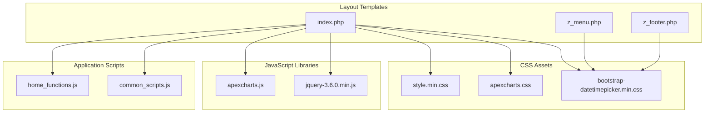
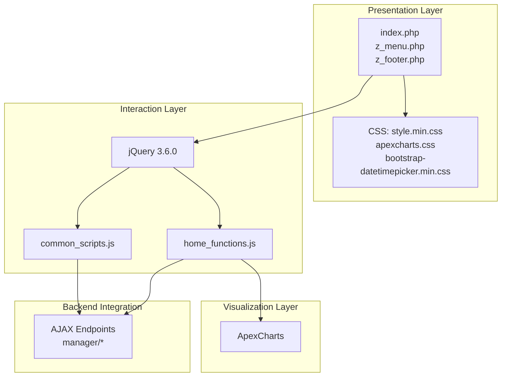
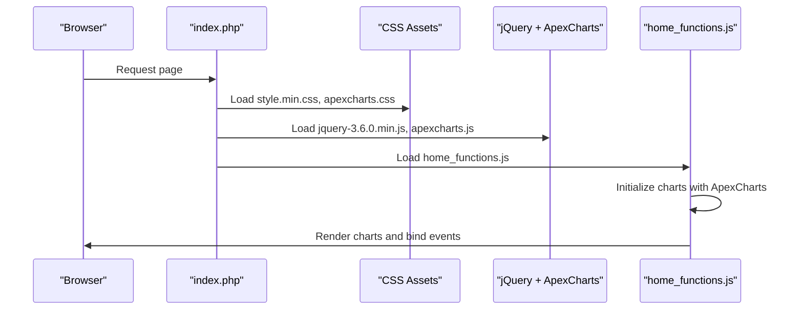
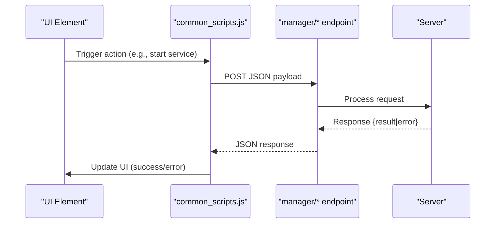
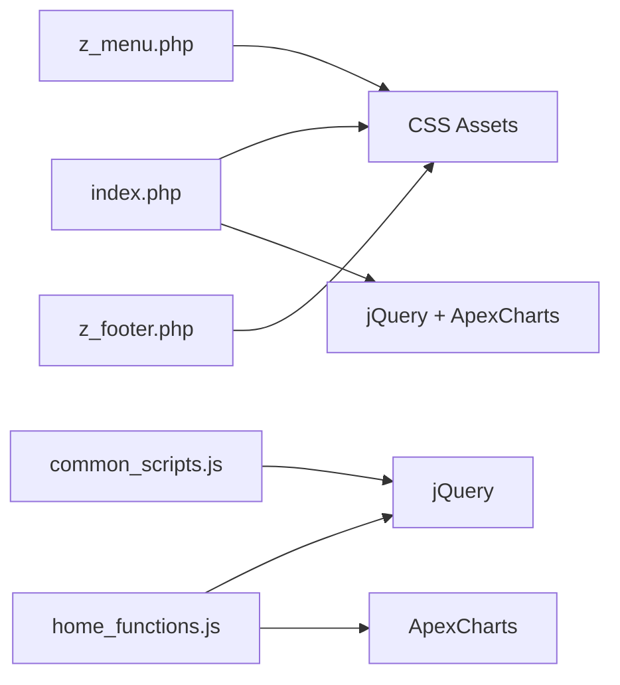

# Frontend Asset Management

<cite>
**Referenced Files in This Document**
- [index.php](file://spear/index.php)
- [z_menu.php](file://spear/z_menu.php)
- [z_footer.php](file://spear/z_footer.php)
- [bootstrap-datetimepicker.min.css](file://spear/css/bootstrap-datetimepicker.min.css)
- [apexcharts.css](file://spear/css/apexcharts.css)
- [jquery-3.6.0.min.js](file://spear/js/libs/jquery/jquery-3.6.0.min.js)
- [apexcharts.js](file://spear/js/libs/apexcharts.js)
- [common_scripts.js](file://spear/js/common_scripts.js)
- [home_functions.js](file://spear/js/home_functions.js)
</cite>

## Table of Contents
1. [Introduction](#introduction)
2. [Project Structure](#project-structure)
3. [Core Components](#core-components)
4. [Architecture Overview](#architecture-overview)
5. [Detailed Component Analysis](#detailed-component-analysis)
6. [Dependency Analysis](#dependency-analysis)
7. [Performance Considerations](#performance-considerations)
8. [Troubleshooting Guide](#troubleshooting-guide)
9. [Conclusion](#conclusion)

## Introduction
This document explains the frontend asset management strategy in SniperPhish, focusing on CSS frameworks, JavaScript libraries, and dependency injection patterns. It covers how stylesheets and scripts are organized, how Bootstrap and FontAwesome integrate with custom styling, how jQuery and ApexCharts power interactive dashboards, and how AJAX calls connect frontend components to backend services. It also provides guidance for extending functionality, adding new chart types, integrating additional libraries, and optimizing performance.

## Project Structure
The frontend assets are organized by type and responsibility:
- Stylesheets: located under spear/css, including framework-specific files (Bootstrap, FontAwesome, Material Design Icons), ApexCharts styling, and application-wide styles.
- JavaScript libraries: located under spear/js/libs, including jQuery, ApexCharts, Bootstrap plugins, and utility libraries.
- Application scripts: located under spear/js, including shared utilities and feature-specific scripts (e.g., dashboard charts).
- Layout templates: PHP includes for header/menu/footer provide consistent navigation and branding.

**Diagram sources**
- [index.php:28-29](file://spear/index.php#L28-L29)
- [bootstrap-datetimepicker.min.css:1-5](file://spear/css/bootstrap-datetimepicker.min.css#L1-L5)
- [apexcharts.css:1-667](file://spear/css/apexcharts.css#L1-L667)
- [jquery-3.6.0.min.js:1-3](file://spear/js/libs/jquery/jquery-3.6.0.min.js#L1-L3)
- [apexcharts.js:1-14](file://spear/js/libs/apexcharts.js#L1-L14)
- [common_scripts.js:1-323](file://spear/js/common_scripts.js#L1-L323)
- [home_functions.js:1-399](file://spear/js/home_functions.js#L1-L399)

**Section sources**
- [index.php:18-29](file://spear/index.php#L18-L29)
- [bootstrap-datetimepicker.min.css:1-5](file://spear/css/bootstrap-datetimepicker.min.css#L1-L5)
- [apexcharts.css:1-667](file://spear/css/apexcharts.css#L1-L667)
- [jquery-3.6.0.min.js:1-3](file://spear/js/libs/jquery/jquery-3.6.0.min.js#L1-L3)
- [apexcharts.js:1-14](file://spear/js/libs/apexcharts.js#L1-L14)
- [common_scripts.js:1-323](file://spear/js/common_scripts.js#L1-L323)
- [home_functions.js:1-399](file://spear/js/home_functions.js#L1-L399)

## Core Components
- CSS Frameworks and Icons
  - Bootstrap datetimepicker styling is included via a dedicated stylesheet for calendar/time pickers.
  - ApexCharts styling is loaded separately to support chart rendering and theming.
  - FontAwesome CSS is available under spear/css/icons/font-awesome for scalable vector icons.
  - Material Design Iconic Font is available under spear/css/icons/material-design-iconic-font for additional iconography.
  - Application-wide styles are bundled into a single minified stylesheet referenced in the layout template.

- JavaScript Libraries
  - jQuery 3.6.0 is included globally to support DOM manipulation, AJAX, and UI interactions.
  - ApexCharts is included to render interactive charts on the dashboard.
  - Additional libraries (e.g., Bootstrap plugins, DataTables, Moment.js) are present in the libs directory for optional use.

- Shared Utilities and Feature Scripts
  - common_scripts.js centralizes reusable helpers (AJAX, masking, alerts, idle timeout, file handling).
  - home_functions.js creates charts using ApexCharts and fetches dashboard data via AJAX.

- Layout and Navigation
  - index.php defines the login page and includes the main stylesheet and jQuery.
  - z_menu.php provides the top navigation and sidebar menu.
  - z_footer.php renders the page footer.

**Section sources**
- [index.php:28-29](file://spear/index.php#L28-L29)
- [bootstrap-datetimepicker.min.css:1-5](file://spear/css/bootstrap-datetimepicker.min.css#L1-L5)
- [apexcharts.css:1-667](file://spear/css/apexcharts.css#L1-L667)
- [jquery-3.6.0.min.js:1-3](file://spear/js/libs/jquery/jquery-3.6.0.min.js#L1-L3)
- [apexcharts.js:1-14](file://spear/js/libs/apexcharts.js#L1-L14)
- [common_scripts.js:1-323](file://spear/js/common_scripts.js#L1-L323)
- [home_functions.js:1-399](file://spear/js/home_functions.js#L1-L399)
- [z_menu.php:1-166](file://spear/z_menu.php#L1-L166)
- [z_footer.php:1-3](file://spear/z_footer.php#L1-L3)

## Architecture Overview
The frontend follows a layered architecture:
- Presentation layer: HTML templates (PHP) and static assets (CSS/JS).
- Interaction layer: jQuery-driven event handlers and AJAX calls.
- Visualization layer: ApexCharts for data visualization.
- Backend integration: AJAX endpoints in the manager namespace.

**Diagram sources**
- [index.php:28-29](file://spear/index.php#L28-L29)
- [bootstrap-datetimepicker.min.css:1-5](file://spear/css/bootstrap-datetimepicker.min.css#L1-L5)
- [apexcharts.css:1-667](file://spear/css/apexcharts.css#L1-L667)
- [jquery-3.6.0.min.js:1-3](file://spear/js/libs/jquery/jquery-3.6.0.min.js#L1-L3)
- [apexcharts.js:1-14](file://spear/js/libs/apexcharts.js#L1-L14)
- [common_scripts.js:1-323](file://spear/js/common_scripts.js#L1-L323)
- [home_functions.js:1-399](file://spear/js/home_functions.js#L1-L399)

## Detailed Component Analysis

### CSS Organization and Framework Integration
- Bootstrap datetimepicker
  - The datetimepicker widget uses a dedicated stylesheet to define dropdown menus, timepickers, and responsive behavior.
  - This ensures consistent styling for date/time selection across forms.

- ApexCharts
  - ApexCharts CSS provides theme-aware tooltips, legends, scrollbars, and crosshairs styling.
  - Charts benefit from built-in hover/focus filters and toolbar styling.

- FontAwesome and Material Design Icons
  - FontAwesome CSS is included for scalable vector icons used in navigation and buttons.
  - Material Design Iconic Font is available for additional icon sets.

- Custom application styles
  - The main application stylesheet is referenced in the layout template to apply global themes, typography, and component overrides.

**Section sources**
- [bootstrap-datetimepicker.min.css:1-5](file://spear/css/bootstrap-datetimepicker.min.css#L1-L5)
- [apexcharts.css:1-667](file://spear/css/apexcharts.css#L1-L667)
- [index.php:28-29](file://spear/index.php#L28-L29)

### JavaScript Library Ecosystem
- jQuery integration
  - jQuery is included globally and used extensively for DOM manipulation, event handling, and AJAX requests.
  - Common utilities leverage jQuery selectors and plugins.

- ApexCharts for data visualization
  - ApexCharts is included and used to render bar, range bar, and timeline charts on the dashboard.
  - Chart configurations are constructed dynamically and rendered on page load.

- Custom script organization
  - common_scripts.js centralizes shared functionality (AJAX, masking, alerts, idle timeout, file handling).
  - home_functions.js handles dashboard-specific chart rendering and data fetching.

**Section sources**
- [jquery-3.6.0.min.js:1-3](file://spear/js/libs/jquery/jquery-3.6.0.min.js#L1-L3)
- [apexcharts.js:1-14](file://spear/js/libs/apexcharts.js#L1-L14)
- [common_scripts.js:1-323](file://spear/js/common_scripts.js#L1-L323)
- [home_functions.js:1-399](file://spear/js/home_functions.js#L1-L399)

### Asset Loading Strategy and Dependency Injection
- Asset inclusion
  - Stylesheets are linked in the HTML head for immediate rendering.
  - jQuery is included early in the body to ensure DOM readiness for inline scripts.
  - ApexCharts is included alongside jQuery for chart rendering.

- Dependency injection patterns
  - jQuery is globally available for all scripts.
  - ApexCharts is instantiated per page feature (e.g., dashboard charts).
  - common_scripts.js exposes reusable helpers consumed by feature scripts.

**Diagram sources**
- [index.php:28-29](file://spear/index.php#L28-L29)
- [jquery-3.6.0.min.js:1-3](file://spear/js/libs/jquery/jquery-3.6.0.min.js#L1-L3)
- [apexcharts.js:1-14](file://spear/js/libs/apexcharts.js#L1-L14)
- [home_functions.js:1-399](file://spear/js/home_functions.js#L1-L399)

### AJAX Communication Patterns
- Shared AJAX utilities
  - common_scripts.js encapsulates AJAX calls for service checks, starting/stopping processes, and session management.
  - It uses jQuery.post with JSON payloads and handles success/error responses.

- Dashboard data fetching
  - home_functions.js fetches campaign and tracker statistics via AJAX and renders charts using ApexCharts.

**Diagram sources**
- [common_scripts.js:113-145](file://spear/js/common_scripts.js#L113-L145)
- [home_functions.js:10-67](file://spear/js/home_functions.js#L10-L67)

**Section sources**
- [common_scripts.js:113-145](file://spear/js/common_scripts.js#L113-L145)
- [home_functions.js:10-67](file://spear/js/home_functions.js#L10-L67)

### Extending JavaScript Functionality and Adding New Chart Types
- Extending existing functionality
  - Add new helpers in common_scripts.js for reusable logic (e.g., additional validations, file handling).
  - Extend feature scripts (e.g., home_functions.js) to incorporate new chart series or update existing chart options.

- Adding new chart types
  - Instantiate ApexCharts with a new chart type (e.g., line, area, pie) and configure series/data accordingly.
  - Reuse ApexCharts CSS and ensure proper container sizing.

- Integrating additional libraries
  - Place new libraries under spear/js/libs and include them in the layout template.
  - Follow dependency injection patterns: ensure jQuery loads before dependent libraries, and initialize components after DOM ready.

**Section sources**
- [apexcharts.js:1-14](file://spear/js/libs/apexcharts.js#L1-L14)
- [apexcharts.css:1-667](file://spear/css/apexcharts.css#L1-L667)
- [home_functions.js:140-229](file://spear/js/home_functions.js#L140-L229)

### Build Process, Minification, and Performance Optimization
- Minified assets
  - jQuery and ApexCharts are included as minified files to reduce payload size.
  - The main application stylesheet is referenced as a minified bundle.

- Performance recommendations
  - Keep jQuery and ApexCharts in separate bundles to enable selective loading where appropriate.
  - Lazy-load feature-specific scripts until needed to reduce initial bundle size.
  - Use CDN-hosted libraries when feasible to leverage caching and reduce server load.
  - Compress CSS/JS and enable gzip/brotli on the server for smaller transfers.

[No sources needed since this section provides general guidance]

## Dependency Analysis
The frontend relies on a small set of core dependencies with clear relationships:
- index.php depends on CSS and JS assets.
- common_scripts.js depends on jQuery and provides shared utilities.
- home_functions.js depends on jQuery and ApexCharts to render charts.
- z_menu.php and z_footer.php depend on CSS for consistent styling.

**Diagram sources**
- [index.php:28-29](file://spear/index.php#L28-L29)
- [jquery-3.6.0.min.js:1-3](file://spear/js/libs/jquery/jquery-3.6.0.min.js#L1-L3)
- [apexcharts.js:1-14](file://spear/js/libs/apexcharts.js#L1-L14)
- [common_scripts.js:1-323](file://spear/js/common_scripts.js#L1-L323)
- [home_functions.js:1-399](file://spear/js/home_functions.js#L1-L399)
- [z_menu.php:1-166](file://spear/z_menu.php#L1-L166)
- [z_footer.php:1-3](file://spear/z_footer.php#L1-L3)

**Section sources**
- [index.php:28-29](file://spear/index.php#L28-L29)
- [jquery-3.6.0.min.js:1-3](file://spear/js/libs/jquery/jquery-3.6.0.min.js#L1-L3)
- [apexcharts.js:1-14](file://spear/js/libs/apexcharts.js#L1-L14)
- [common_scripts.js:1-323](file://spear/js/common_scripts.js#L1-L323)
- [home_functions.js:1-399](file://spear/js/home_functions.js#L1-L399)
- [z_menu.php:1-166](file://spear/z_menu.php#L1-L166)
- [z_footer.php:1-3](file://spear/z_footer.php#L1-L3)

## Performance Considerations
- Bundle and minify CSS/JS to reduce HTTP requests and payload size.
- Defer non-critical JavaScript initialization until after the page is interactive.
- Use lazy-loading for charts and heavy widgets to improve initial page load.
- Cache static assets aggressively and leverage browser caching headers.
- Monitor chart rendering performance; consider reducing data volume or simplifying chart complexity for large datasets.

[No sources needed since this section provides general guidance]

## Troubleshooting Guide
- Charts not rendering
  - Verify ApexCharts CSS is loaded and the container element exists.
  - Ensure jQuery is loaded before ApexCharts and that chart options are valid.

- AJAX calls failing
  - Confirm endpoints are reachable and return JSON with expected keys.
  - Check browser console for network errors and CORS issues.

- jQuery conflicts
  - Ensure only one jQuery instance is loaded and avoid conflicting versions.
  - Wrap custom code in closures if necessary to prevent global pollution.

- Styling inconsistencies
  - Confirm the main application stylesheet is included and not overridden by local styles.
  - Validate icon fonts (FontAwesome/Material) are properly linked.

**Section sources**
- [apexcharts.css:1-667](file://spear/css/apexcharts.css#L1-L667)
- [jquery-3.6.0.min.js:1-3](file://spear/js/libs/jquery/jquery-3.6.0.min.js#L1-L3)
- [common_scripts.js:113-145](file://spear/js/common_scripts.js#L113-L145)
- [home_functions.js:140-229](file://spear/js/home_functions.js#L140-L229)

## Conclusion
SniperPhish employs a straightforward and maintainable frontend asset strategy: a minimal core of jQuery and ApexCharts, organized CSS bundles, and shared utilities for AJAX and UI behaviors. The architecture supports incremental feature development, clear separation of concerns, and straightforward extension patterns. Following the guidelines in this document will help maintain consistency and performance as new features are added.