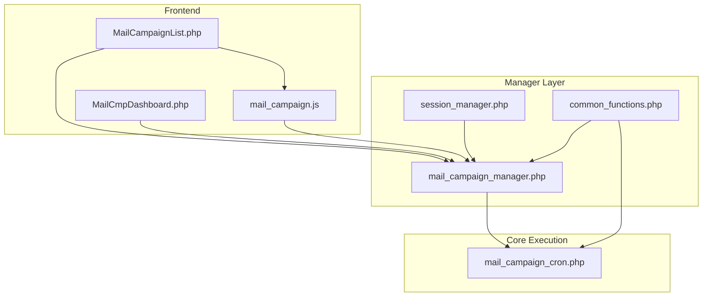
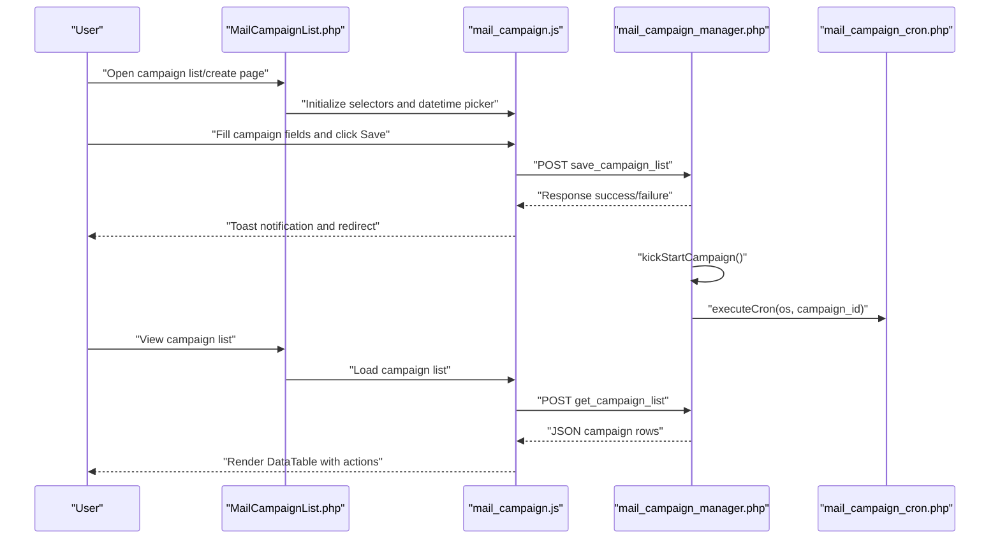
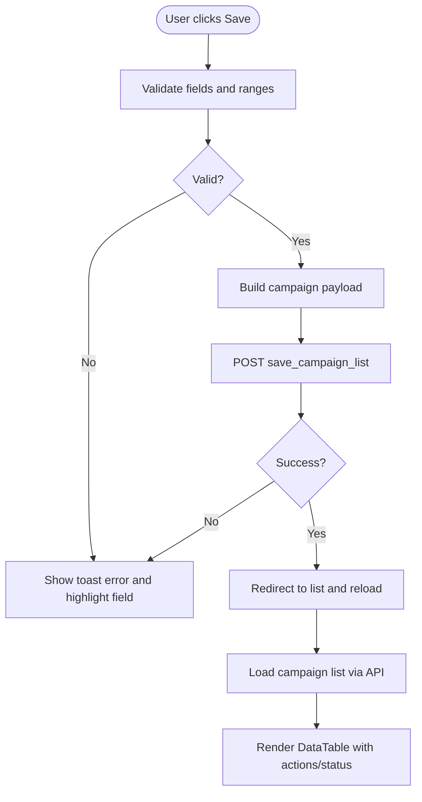
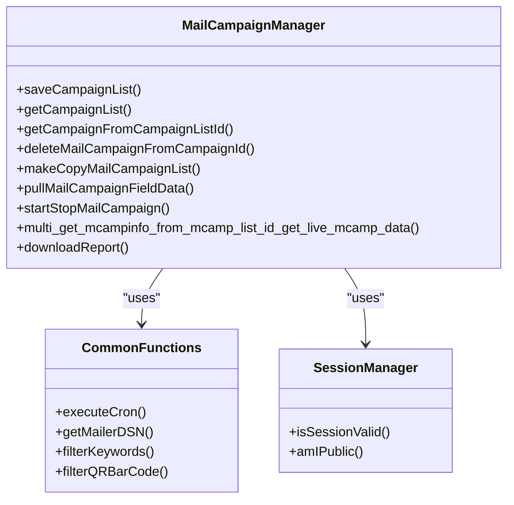
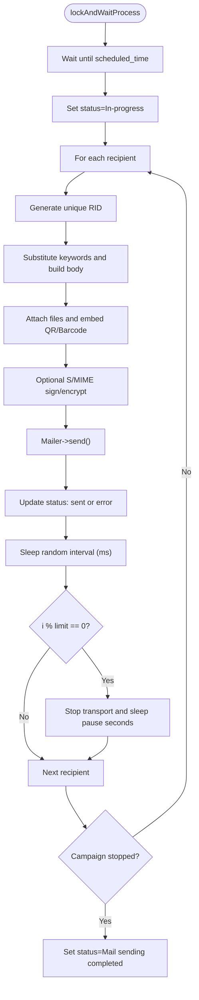
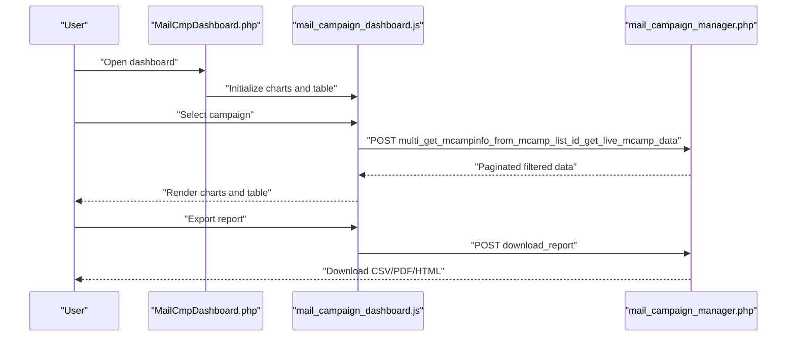
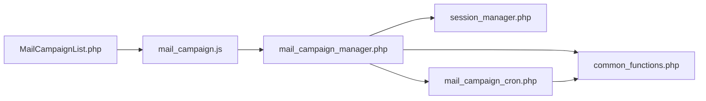

# Campaign Scheduling and Management

<cite>
**Referenced Files in This Document**
- [MailCampaignList.php](file://spear/MailCampaignList.php)
- [mail_campaign.js](file://spear/js/mail_campaign.js)
- [mail_campaign_cron.php](file://spear/core/mail_campaign_cron.php)
- [mail_campaign_manager.php](file://spear/manager/mail_campaign_manager.php)
- [MailCmpDashboard.php](file://spear/MailCmpDashboard.php)
- [common_functions.php](file://spear/manager/common_functions.php)
- [session_manager.php](file://spear/manager/session_manager.php)
</cite>

## Table of Contents
1. [Introduction](#introduction)
2. [Project Structure](#project-structure)
3. [Core Components](#core-components)
4. [Architecture Overview](#architecture-overview)
5. [Detailed Component Analysis](#detailed-component-analysis)
6. [Dependency Analysis](#dependency-analysis)
7. [Performance Considerations](#performance-considerations)
8. [Troubleshooting Guide](#troubleshooting-guide)
9. [Conclusion](#conclusion)

## Introduction
This document explains the email campaign scheduling and management system in SniperPhish. It covers the end-to-end workflow from campaign creation and scheduling to automated background processing, pause/resume operations, delivery tracking, and reporting. It also documents anti-flood mechanisms, delivery rate controls, failure handling, and retry logic. The focus areas include:
- Campaign creation and scheduling via the UI and JavaScript controller
- Backend management APIs and persistence
- Automated cron-driven processing and runtime controls
- Real-time dashboards and reporting

## Project Structure
The system is organized into:
- Frontend pages and scripts for campaign creation and management
- Manager APIs for backend operations
- Core cron script for automated campaign execution
- Session and common utilities for environment and runtime support

**Diagram sources**
- [MailCampaignList.php:1-331](file://spear/MailCampaignList.php#L1-L331)
- [mail_campaign.js:1-436](file://spear/js/mail_campaign.js#L1-L436)
- [mail_campaign_manager.php:1-547](file://spear/manager/mail_campaign_manager.php#L1-L547)
- [mail_campaign_cron.php:1-364](file://spear/core/mail_campaign_cron.php#L1-L364)
- [MailCmpDashboard.php:1-440](file://spear/MailCmpDashboard.php#L1-L440)
- [session_manager.php:1-244](file://spear/manager/session_manager.php#L1-L244)
- [common_functions.php:1-595](file://spear/manager/common_functions.php#L1-L595)

**Section sources**
- [MailCampaignList.php:1-331](file://spear/MailCampaignList.php#L1-L331)
- [mail_campaign.js:1-436](file://spear/js/mail_campaign.js#L1-L436)
- [mail_campaign_manager.php:1-547](file://spear/manager/mail_campaign_manager.php#L1-L547)
- [mail_campaign_cron.php:1-364](file://spear/core/mail_campaign_cron.php#L1-L364)
- [MailCmpDashboard.php:1-440](file://spear/MailCmpDashboard.php#L1-L440)
- [session_manager.php:1-244](file://spear/manager/session_manager.php#L1-L244)
- [common_functions.php:1-595](file://spear/manager/common_functions.php#L1-L595)

## Core Components
- Campaign creation and scheduling UI: Provides fields for campaign name, user group, template, sender, configuration, launch time, message interval, and retry count. It also supports immediate activation and saving.
- JavaScript controller: Handles UI interactions, validation, AJAX calls to manager APIs, and dynamic updates of campaign lists and statuses.
- Manager APIs: Persist and retrieve campaign metadata, start/stop campaigns, copy campaigns, and fetch live campaign data for reporting.
- Cron executor: Performs scheduled launches, enforces anti-flood controls, applies retry logic, and tracks per-recipient delivery status.
- Dashboard: Visualizes timeline, delivery statistics, open rates, and reply activity.

**Section sources**
- [MailCampaignList.php:120-223](file://spear/MailCampaignList.php#L120-L223)
- [mail_campaign.js:30-193](file://spear/js/mail_campaign.js#L30-L193)
- [mail_campaign_manager.php:33-105](file://spear/manager/mail_campaign_manager.php#L33-L105)
- [mail_campaign_cron.php:99-294](file://spear/core/mail_campaign_cron.php#L99-L294)
- [MailCmpDashboard.php:85-214](file://spear/MailCmpDashboard.php#L85-L214)

## Architecture Overview
The system follows a layered architecture:
- Presentation layer: HTML pages and JavaScript for user interactions
- Manager layer: PHP APIs for CRUD and orchestration
- Core layer: PHP cron script for background execution
- Utilities: Shared functions for environment, timing, and mail transport

**Diagram sources**
- [MailCampaignList.php:297-324](file://spear/MailCampaignList.php#L297-L324)
- [mail_campaign.js:30-193](file://spear/js/mail_campaign.js#L30-L193)
- [mail_campaign_manager.php:236-251](file://spear/manager/mail_campaign_manager.php#L236-L251)
- [common_functions.php:87-92](file://spear/manager/common_functions.php#L87-L92)
- [mail_campaign_cron.php:361-362](file://spear/core/mail_campaign_cron.php#L361-L362)

## Detailed Component Analysis

### Campaign Creation and Scheduling (UI and JS)
- Fields and controls:
  - Campaign name, user group, mail template, mail sender, campaign configuration
  - Launch time with a datetime picker
  - Message interval slider and text input (min-max range)
  - Retry count slider and text input
  - Activate on save toggle
- Validation and submission:
  - Client-side validation for required fields and ranges
  - On save, constructs campaign payload and posts to manager API
  - Immediate activation logic checks scheduled time vs current time
- Live list rendering:
  - Loads campaigns via API and renders a DataTable with status badges and action buttons
  - Supports start/stop, edit, delete, and copy actions

**Diagram sources**
- [MailCampaignList.php:120-223](file://spear/MailCampaignList.php#L120-L223)
- [mail_campaign.js:112-193](file://spear/js/mail_campaign.js#L112-L193)
- [mail_campaign.js:302-395](file://spear/js/mail_campaign.js#L302-L395)

**Section sources**
- [MailCampaignList.php:120-223](file://spear/MailCampaignList.php#L120-L223)
- [mail_campaign.js:30-193](file://spear/js/mail_campaign.js#L30-L193)
- [mail_campaign.js:302-395](file://spear/js/mail_campaign.js#L302-L395)

### Manager APIs: Campaign Lifecycle and Reporting
- Save/update campaign:
  - Persists campaign metadata and resets live data
  - Triggers kickStartCampaign to handle immediate or scheduled launch
- List and detail:
  - Returns campaign rows with formatted timestamps and status
  - Fetches live metrics (sent success/failure counts, open stats)
- Start/stop/copy/delete:
  - Updates status and stop time
  - Clears live data on schedule or delete
- Reporting:
  - Multi-get live campaign data with filtering and sorting
  - Download report in CSV/PDF/HTML formats

**Diagram sources**
- [mail_campaign_manager.php:33-547](file://spear/manager/mail_campaign_manager.php#L33-L547)
- [common_functions.php:87-159](file://spear/manager/common_functions.php#L87-L159)
- [session_manager.php:35-144](file://spear/manager/session_manager.php#L35-L144)

**Section sources**
- [mail_campaign_manager.php:33-105](file://spear/manager/mail_campaign_manager.php#L33-L105)
- [mail_campaign_manager.php:203-220](file://spear/manager/mail_campaign_manager.php#L203-L220)
- [mail_campaign_manager.php:311-408](file://spear/manager/mail_campaign_manager.php#L311-L408)
- [mail_campaign_manager.php:410-547](file://spear/manager/mail_campaign_manager.php#L410-L547)

### Cron Execution: Automated Processing, Anti-Flood, and Retries
- Lock and wait:
  - Locks campaign record and waits until scheduled time
  - Sets status to in-progress before execution
- Per-recipient processing:
  - Iterates recipients from user group
  - Generates unique RID per recipient
  - Applies keyword substitution and optional QR/Barcode embedding
  - Adds attachments and optional S/MIME signing/encryption
  - Sends via configured SMTP transport
  - Tracks per-recipient status and errors
- Delivery controls:
  - Randomized inter-message delay within configured min-max range
  - Anti-flood: after N messages, stops transport briefly to throttle
  - Retry on transport exceptions up to configured limit with 1-second backoff
- Graceful stop:
  - Checks campaign status periodically and exits early if stopped

**Diagram sources**
- [mail_campaign_cron.php:296-305](file://spear/core/mail_campaign_cron.php#L296-L305)
- [mail_campaign_cron.php:325-350](file://spear/core/mail_campaign_cron.php#L325-L350)
- [mail_campaign_cron.php:99-294](file://spear/core/mail_campaign_cron.php#L99-L294)

**Section sources**
- [mail_campaign_cron.php:99-294](file://spear/core/mail_campaign_cron.php#L99-L294)
- [mail_campaign_cron.php:296-305](file://spear/core/mail_campaign_cron.php#L296-L305)
- [mail_campaign_cron.php:325-350](file://spear/core/mail_campaign_cron.php#L325-L350)

### Dashboard and Reporting
- Dashboard displays:
  - Campaign name, status, and start time
  - Progress bar and charts for overview, sent, opened, and replied
  - Campaign timeline scatter plot
  - Detailed results table with selectable columns
- Export:
  - CSV/PDF/HTML export of selected columns
- Public access:
  - Token-based public access control for sharing dashboards

**Diagram sources**
- [MailCmpDashboard.php:85-214](file://spear/MailCmpDashboard.php#L85-L214)
- [mail_campaign_manager.php:311-408](file://spear/manager/mail_campaign_manager.php#L311-L408)
- [mail_campaign_manager.php:410-547](file://spear/manager/mail_campaign_manager.php#L410-L547)

**Section sources**
- [MailCmpDashboard.php:85-214](file://spear/MailCmpDashboard.php#L85-L214)
- [mail_campaign_manager.php:311-408](file://spear/manager/mail_campaign_manager.php#L311-L408)
- [mail_campaign_manager.php:410-547](file://spear/manager/mail_campaign_manager.php#L410-L547)

## Dependency Analysis
- UI depends on:
  - mail_campaign.js for interactions and AJAX
  - Manager APIs for persistence and reporting
- Manager APIs depend on:
  - Session manager for authentication and public access
  - Common functions for environment, mail transport DSN, and utilities
- Cron depends on:
  - Manager APIs for configuration and transport settings
  - Common functions for mail transport and keyword filtering

**Diagram sources**
- [MailCampaignList.php:297-324](file://spear/MailCampaignList.php#L297-L324)
- [mail_campaign.js:30-193](file://spear/js/mail_campaign.js#L30-L193)
- [mail_campaign_manager.php:1-547](file://spear/manager/mail_campaign_manager.php#L1-L547)
- [common_functions.php:1-595](file://spear/manager/common_functions.php#L1-L595)
- [session_manager.php:1-244](file://spear/manager/session_manager.php#L1-L244)
- [mail_campaign_cron.php:1-364](file://spear/core/mail_campaign_cron.php#L1-L364)

**Section sources**
- [mail_campaign_manager.php:1-547](file://spear/manager/mail_campaign_manager.php#L1-L547)
- [common_functions.php:1-595](file://spear/manager/common_functions.php#L1-L595)
- [session_manager.php:1-244](file://spear/manager/session_manager.php#L1-L244)
- [mail_campaign_cron.php:1-364](file://spear/core/mail_campaign_cron.php#L1-L364)

## Performance Considerations
- Anti-flood throttling:
  - Limits messages per batch and pauses transport to reduce server impact
- Randomized delays:
  - Smooths traffic and reduces detection risk
- Retry with backoff:
  - Reduces transient transport failures
- Efficient reporting:
  - Paginated and filtered queries minimize payload size
- Concurrency guard:
  - Single-instance process execution prevents duplicate runs

[No sources needed since this section provides general guidance]

## Troubleshooting Guide
- Campaign stuck in scheduled:
  - Verify scheduled time and that kickStartCampaign triggered executeCron
  - Check OS-specific PHP binary path resolution
- Delivery failures:
  - Review per-recipient status and error logs
  - Confirm SMTP credentials and DSN type
- Anti-flood throttling:
  - Adjust limit and pause values in campaign configuration
- Dashboard not loading:
  - Ensure session validity and public access tokens when applicable
  - Confirm manager API responses and pagination parameters

**Section sources**
- [mail_campaign_manager.php:236-251](file://spear/manager/mail_campaign_manager.php#L236-L251)
- [common_functions.php:87-92](file://spear/manager/common_functions.php#L87-L92)
- [mail_campaign_cron.php:266-277](file://spear/core/mail_campaign_cron.php#L266-L277)
- [session_manager.php:35-44](file://spear/manager/session_manager.php#L35-L44)

## Conclusion
The system provides a robust pipeline for creating, scheduling, and executing email campaigns with strong operational controls:
- Intuitive UI with validation and real-time feedback
- Secure manager APIs with session and public access controls
- Reliable cron-driven execution with anti-flood and retry logic
- Comprehensive dashboard and export capabilities for reporting

[No sources needed since this section summarizes without analyzing specific files]