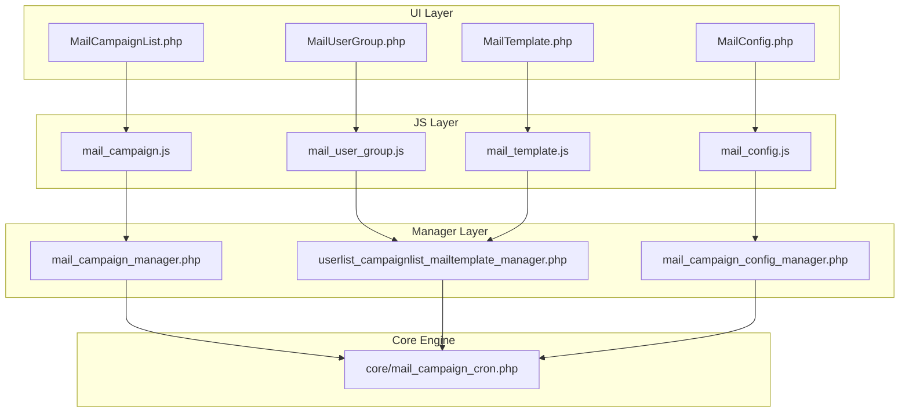
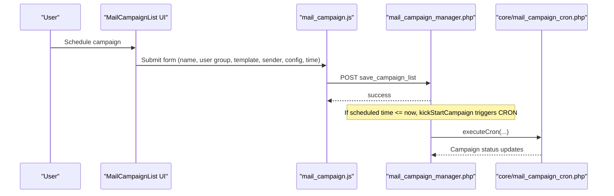
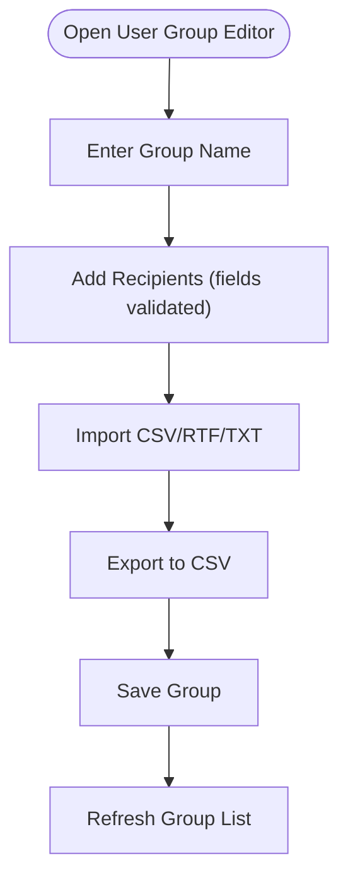
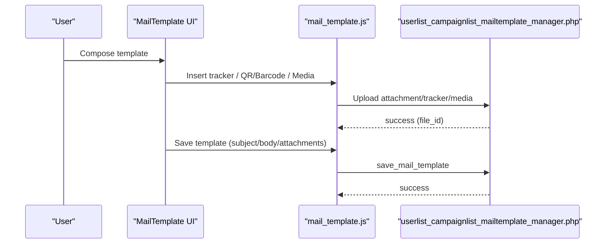
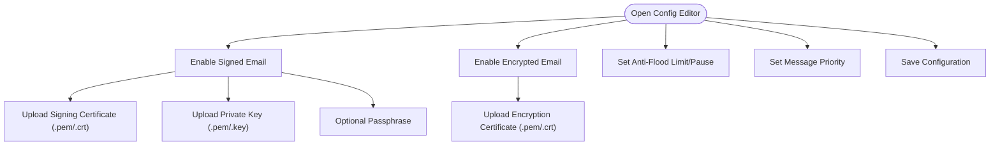
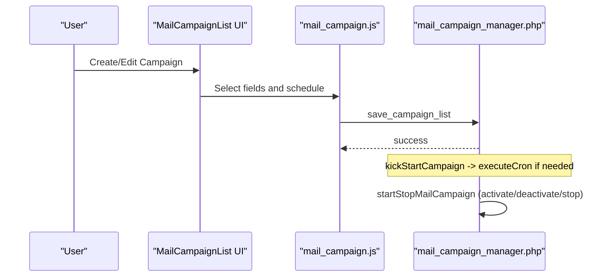
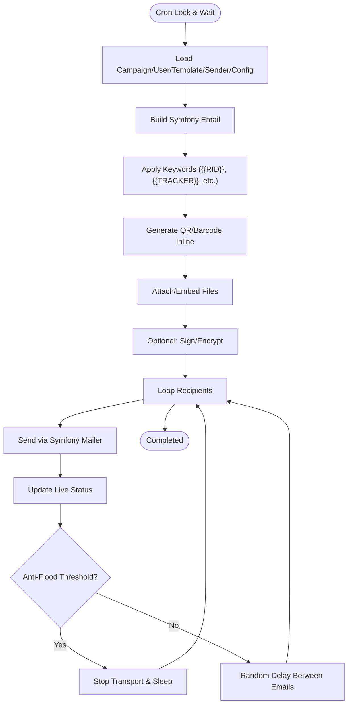
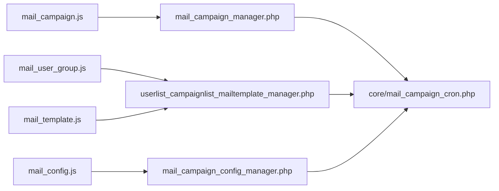

# Email Campaign Management

<cite>
**Referenced Files in This Document**
- [MailUserGroup.php](file://spear/MailUserGroup.php)
- [MailTemplate.php](file://spear/MailTemplate.php)
- [MailConfig.php](file://spear/MailConfig.php)
- [MailCampaignList.php](file://spear/MailCampaignList.php)
- [mail_campaign_cron.php](file://spear/core/mail_campaign_cron.php)
- [mail_user_group.js](file://spear/js/mail_user_group.js)
- [mail_template.js](file://spear/js/mail_template.js)
- [mail_config.js](file://spear/js/mail_config.js)
- [mail_campaign.js](file://spear/js/mail_campaign.js)
- [userlist_campaignlist_mailtemplate_manager.php](file://spear/manager/userlist_campaignlist_mailtemplate_manager.php)
- [mail_campaign_manager.php](file://spear/manager/mail_campaign_manager.php)
- [mail_campaign_config_manager.php](file://spear/manager/mail_campaign_config_manager.php)
</cite>

## Table of Contents
1. [Introduction](#introduction)
2. [Project Structure](#project-structure)
3. [Core Components](#core-components)
4. [Architecture Overview](#architecture-overview)
5. [Detailed Component Analysis](#detailed-component-analysis)
6. [Dependency Analysis](#dependency-analysis)
7. [Performance Considerations](#performance-considerations)
8. [Troubleshooting Guide](#troubleshooting-guide)
9. [Conclusion](#conclusion)

## Introduction
This document explains the email campaign management subsystem of the SniperPhish toolkit. It covers user group management, email template creation, SMTP configuration, and campaign scheduling. It also documents the automated mail-sending engine and its integration with the cron system, along with practical guidance for common operational issues such as SMTP authentication, attachment handling, and delivery rate limiting.

## Project Structure
The email campaign subsystem is organized around four primary UI pages and supporting JavaScript and PHP managers:
- User group management: MailUserGroup.php with mail_user_group.js
- Template management: MailTemplate.php with mail_template.js
- SMTP and campaign configuration: MailConfig.php with mail_config.js
- Campaign orchestration: MailCampaignList.php with mail_campaign.js
- Backend managers: userlist_campaignlist_mailtemplate_manager.php, mail_campaign_manager.php, mail_campaign_config_manager.php
- Automated processing: core/mail_campaign_cron.php

**Diagram sources**
- [MailUserGroup.php:1-356](file://spear/MailUserGroup.php#L1-L356)
- [MailTemplate.php:1-601](file://spear/MailTemplate.php#L1-L601)
- [MailConfig.php:1-367](file://spear/MailConfig.php#L1-L367)
- [MailCampaignList.php:1-331](file://spear/MailCampaignList.php#L1-L331)
- [mail_user_group.js:1-431](file://spear/js/mail_user_group.js#L1-L431)
- [mail_template.js:1-709](file://spear/js/mail_template.js#L1-L709)
- [mail_config.js:1-307](file://spear/js/mail_config.js#L1-L307)
- [mail_campaign.js:1-436](file://spear/js/mail_campaign.js#L1-L436)
- [userlist_campaignlist_mailtemplate_manager.php:1-709](file://spear/manager/userlist_campaignlist_mailtemplate_manager.php#L1-L709)
- [mail_campaign_manager.php:1-547](file://spear/manager/mail_campaign_manager.php#L1-L547)
- [mail_campaign_config_manager.php:1-85](file://spear/manager/mail_campaign_config_manager.php#L1-L85)
- [mail_campaign_cron.php:1-364](file://spear/core/mail_campaign_cron.php#L1-L364)

**Section sources**
- [MailUserGroup.php:1-356](file://spear/MailUserGroup.php#L1-L356)
- [MailTemplate.php:1-601](file://spear/MailTemplate.php#L1-L601)
- [MailConfig.php:1-367](file://spear/MailConfig.php#L1-L367)
- [MailCampaignList.php:1-331](file://spear/MailCampaignList.php#L1-L331)

## Core Components
- User groups: Create, import/export, and manage lists of recipients. Stored in database and edited via UI with client-side DataTables and AJAX.
- Email templates: Rich HTML/Plain text editing with keyword substitution, tracker insertion, attachments, and media embedding.
- SMTP configuration: Per-campaign configuration including TLS verification, signed/encrypted messages, anti-flood limits, and message priority.
- Campaign scheduler: Define user group, template, sender, configuration, launch time, intervals, retries, and activation.
- Automated engine: Cron-driven processing that respects anti-flood, schedules launches, applies keywords, attaches files, and tracks delivery.

**Section sources**
- [mail_user_group.js:1-431](file://spear/js/mail_user_group.js#L1-L431)
- [mail_template.js:1-709](file://spear/js/mail_template.js#L1-L709)
- [mail_config.js:1-307](file://spear/js/mail_config.js#L1-L307)
- [mail_campaign.js:1-436](file://spear/js/mail_campaign.js#L1-L436)
- [mail_campaign_cron.php:1-364](file://spear/core/mail_campaign_cron.php#L1-L364)

## Architecture Overview
The system uses a layered architecture:
- UI pages render forms and tables.
- JavaScript handles user interactions, validations, and AJAX requests.
- Managers receive JSON payloads, validate and sanitize inputs, and interact with the database.
- The cron script executes campaigns, applying configuration, keyword filtering, QR/Barcode generation, and delivery tracking.

**Diagram sources**
- [MailCampaignList.php:1-331](file://spear/MailCampaignList.php#L1-L331)
- [mail_campaign.js:122-193](file://spear/js/mail_campaign.js#L122-L193)
- [mail_campaign_manager.php:62-86](file://spear/manager/mail_campaign_manager.php#L62-L86)
- [mail_campaign_cron.php:325-361](file://spear/core/mail_campaign_cron.php#L325-L361)

## Detailed Component Analysis

### User Group Management (MailUserGroup.php)
- Purpose: Manage recipient lists per group with CRUD operations, bulk import/export, and real-time validation.
- Key UI elements:
  - Group list table with actions (copy/delete).
  - Group editor with fields for group name and recipient rows (first name, last name, email, notes).
  - Import from CSV/RTF/TXT and export to CSV.
- Client-side behavior:
  - Uses DataTables for server-side pagination/search.
  - Validates inputs and enforces allowed characters.
  - Uploads files via hidden inputs and FileReader API.
- Server-side behavior:
  - Stores user data as JSON arrays in the database.
  - Supports copying groups and deleting groups.

**Diagram sources**
- [MailUserGroup.php:70-206](file://spear/MailUserGroup.php#L70-L206)
- [mail_user_group.js:24-98](file://spear/js/mail_user_group.js#L24-L98)
- [userlist_campaignlist_mailtemplate_manager.php:80-126](file://spear/manager/userlist_campaignlist_mailtemplate_manager.php#L80-L126)

**Section sources**
- [MailUserGroup.php:1-356](file://spear/MailUserGroup.php#L1-L356)
- [mail_user_group.js:1-431](file://spear/js/mail_user_group.js#L1-L431)
- [userlist_campaignlist_mailtemplate_manager.php:80-332](file://spear/manager/userlist_campaignlist_mailtemplate_manager.php#L80-L332)

### Email Template Management (MailTemplate.php)
- Purpose: Create and manage email templates with keyword substitution, tracker insertion, attachments, and media embedding.
- Key UI elements:
  - Template list table with actions (copy/delete).
  - Rich text editor (Summernote) with extended toolbar for links, images, videos, QR/Barcode, and web trackers.
  - Attachment area with inline/embed toggles and display-name customization.
  - Keyword reference panel and hints for advanced usage.
- Client-side behavior:
  - Tracks tracker image presence (default/custom/none).
  - Uploads images, attachments, and media body files (mbf) with size checks.
  - Inserts {{KEYWORD}} placeholders and generates QR/Barcode images inline.
  - Sends test emails using configured sender credentials.
- Server-side behavior:
  - Stores template metadata and attachments as JSON.
  - Provides store templates and sample templates.

**Diagram sources**
- [MailTemplate.php:72-315](file://spear/MailTemplate.php#L72-L315)
- [mail_template.js:125-178](file://spear/js/mail_template.js#L125-L178)
- [mail_template.js:381-451](file://spear/js/mail_template.js#L381-L451)
- [mail_template.js:511-564](file://spear/js/mail_template.js#L511-L564)
- [userlist_campaignlist_mailtemplate_manager.php:345-494](file://spear/manager/userlist_campaignlist_mailtemplate_manager.php#L345-L494)

**Section sources**
- [MailTemplate.php:1-601](file://spear/MailTemplate.php#L1-L601)
- [mail_template.js:1-709](file://spear/js/mail_template.js#L1-L709)
- [userlist_campaignlist_mailtemplate_manager.php:345-494](file://spear/manager/userlist_campaignlist_mailtemplate_manager.php#L345-L494)

### SMTP and Campaign Configuration (MailConfig.php)
- Purpose: Configure per-campaign settings including TLS verification, signed/encrypted messages, anti-flood controls, and message priority.
- Key UI elements:
  - TLS peer verification toggle.
  - Recipient type selector (To/CC/BCC).
  - Signed email: upload certificate/private key; optional passphrase.
  - Encrypted email: upload certificate.
  - Anti-flood limit and pause duration.
  - Message priority selection.
- Client-side behavior:
  - Dynamically enables/disables upload areas based on toggles.
  - Validates file types and sizes for certificates.
  - Persists configuration to backend with save action.
- Server-side behavior:
  - Stores configuration as JSON in the database.
  - Prevents modification of default configuration.

**Diagram sources**
- [MailConfig.php:78-262](file://spear/MailConfig.php#L78-L262)
- [mail_config.js:28-46](file://spear/js/mail_config.js#L28-L46)
- [mail_config.js:73-112](file://spear/js/mail_config.js#L73-L112)
- [mail_config.js:130-194](file://spear/js/mail_config.js#L130-L194)
- [mail_campaign_config_manager.php:27-49](file://spear/manager/mail_campaign_config_manager.php#L27-L49)

**Section sources**
- [MailConfig.php:1-367](file://spear/MailConfig.php#L1-L367)
- [mail_config.js:1-307](file://spear/js/mail_config.js#L1-L307)
- [mail_campaign_config_manager.php:1-85](file://spear/manager/mail_campaign_config_manager.php#L1-L85)

### Campaign Creation and Scheduling (MailCampaignList.php)
- Purpose: Create campaigns by selecting user group, template, sender, and configuration; set launch time, intervals, and retries; activate/deactivate/start/stop campaigns.
- Key UI elements:
  - Campaign list table with status badges and action buttons.
  - Campaign editor with selectors for all components and scheduling widget.
  - Interval slider and retry counter.
  - Immediate launch warning and confirmation.
- Client-side behavior:
  - Loads field data from managers (user groups, templates, senders, configs).
  - Validates selections and times; saves campaign with optional immediate start.
  - Starts/stops campaigns and copies/deletes them.
- Server-side behavior:
  - Persists campaign data and status.
  - Triggers cron execution when scheduled time arrives or when activated.

**Diagram sources**
- [MailCampaignList.php:119-223](file://spear/MailCampaignList.php#L119-L223)
- [mail_campaign.js:30-57](file://spear/js/mail_campaign.js#L30-L57)
- [mail_campaign.js:122-193](file://spear/js/mail_campaign.js#L122-L193)
- [mail_campaign.js:195-239](file://spear/js/mail_campaign.js#L195-L239)
- [mail_campaign_manager.php:62-86](file://spear/manager/mail_campaign_manager.php#L62-L86)
- [mail_campaign_manager.php:203-220](file://spear/manager/mail_campaign_manager.php#L203-L220)

**Section sources**
- [MailCampaignList.php:1-331](file://spear/MailCampaignList.php#L1-L331)
- [mail_campaign.js:1-436](file://spear/js/mail_campaign.js#L1-L436)
- [mail_campaign_manager.php:1-547](file://spear/manager/mail_campaign_manager.php#L1-L547)

### Automated Mail Sending Engine (core/mail_campaign_cron.php)
- Purpose: Execute scheduled campaigns, apply keyword substitution, embed QR/Barcode, attach files, sign/encrypt messages, enforce anti-flood, and track delivery.
- Key responsibilities:
  - Load campaign, user group, template, sender, and configuration.
  - Build Symfony Mime messages with headers and recipients.
  - Apply anti-flood by stopping/restarting transport periodically.
  - Generate unique message identifiers and track per-recipient status.
  - Support signed and encrypted messages via SMime signer/encrypter.
- Delivery tracking:
  - Creates live records per recipient with timestamps and metadata.
  - Updates status on success/error and persists error messages.

**Diagram sources**
- [mail_campaign_cron.php:99-294](file://spear/core/mail_campaign_cron.php#L99-L294)
- [mail_campaign_cron.php:164-166](file://spear/core/mail_campaign_cron.php#L164-L166)
- [mail_campaign_cron.php:214-277](file://spear/core/mail_campaign_cron.php#L214-L277)
- [mail_campaign_cron.php:283-292](file://spear/core/mail_campaign_cron.php#L283-L292)

**Section sources**
- [mail_campaign_cron.php:1-364](file://spear/core/mail_campaign_cron.php#L1-L364)

## Dependency Analysis
- UI-to-JS-to-Manager-to-DB:
  - mail_user_group.js → userlist_campaignlist_mailtemplate_manager.php
  - mail_template.js → userlist_campaignlist_mailtemplate_manager.php
  - mail_config.js → mail_campaign_config_manager.php
  - mail_campaign.js → mail_campaign_manager.php
- Manager-to-Cron:
  - mail_campaign_manager.php → core/mail_campaign_cron.php (via OS-specific execution)
- Shared utilities:
  - common_functions.php (referenced by managers) provides helpers for time conversion, filtering, and DSN construction.

**Diagram sources**
- [mail_user_group.js:1-431](file://spear/js/mail_user_group.js#L1-L431)
- [mail_template.js:1-709](file://spear/js/mail_template.js#L1-L709)
- [mail_config.js:1-307](file://spear/js/mail_config.js#L1-L307)
- [mail_campaign.js:1-436](file://spear/js/mail_campaign.js#L1-L436)
- [userlist_campaignlist_mailtemplate_manager.php:1-709](file://spear/manager/userlist_campaignlist_mailtemplate_manager.php#L1-L709)
- [mail_campaign_manager.php:1-547](file://spear/manager/mail_campaign_manager.php#L1-L547)
- [mail_campaign_config_manager.php:1-85](file://spear/manager/mail_campaign_config_manager.php#L1-L85)
- [mail_campaign_cron.php:1-364](file://spear/core/mail_campaign_cron.php#L1-L364)

**Section sources**
- [mail_campaign_manager.php:236-251](file://spear/manager/mail_campaign_manager.php#L236-L251)
- [mail_campaign_cron.php:361-361](file://spear/core/mail_campaign_cron.php#L361-L361)

## Performance Considerations
- Anti-flood control: The engine stops the transport after a configurable number of messages and sleeps for a configured duration to avoid rate limits and server throttling.
- Randomized delays: A random microsecond sleep is applied between messages to mimic human pacing and reduce detection risk.
- Message priority: Sets priority for informational purposes; does not alter delivery behavior.
- Large attachments: Ensure attachment sizes are reasonable; the system validates file sizes before upload and during test sends.
- Database writes: Live status updates occur per recipient; keep polling intervals reasonable to avoid excessive queries.

[No sources needed since this section provides general guidance]

## Troubleshooting Guide
- SMTP authentication failures:
  - Verify sender credentials and mailbox accessibility via the “Verify” action in the sender list manager.
  - Confirm TLS peer verification settings match your environment (disable only for self-signed certs).
  - Check DSN type and port settings.
- Attachment handling:
  - Ensure attachments are uploaded to the correct directory and have write permissions.
  - For dynamic filenames, use keyword substitution (e.g., {{RID}}) inside the display name.
- Delivery rate limits:
  - Adjust anti-flood limit and pause duration in the configuration to comply with provider policies.
  - Reduce message interval range to introduce more randomness.
- Signed/encrypted emails:
  - Ensure PEM-encoded certificates and keys are uploaded with correct extensions.
  - Provide the private key passphrase if required.
- Tracker and QR/Barcode:
  - Use the editor’s “Insert Web Tracker” or QR/Barcode buttons to embed tracking and codes.
  - For custom tracker images, upload via the dedicated uploader and confirm size limits.
- Campaign status:
  - Use the dashboard to monitor live statuses and open events.
  - Stop campaigns gracefully to finalize status and avoid partial runs.

**Section sources**
- [userlist_campaignlist_mailtemplate_manager.php:584-609](file://spear/manager/userlist_campaignlist_mailtemplate_manager.php#L584-L609)
- [mail_campaign_cron.php:241-264](file://spear/core/mail_campaign_cron.php#L241-L264)
- [mail_config.js:73-112](file://spear/js/mail_config.js#L73-L112)
- [mail_template.js:125-178](file://spear/js/mail_template.js#L125-L178)

## Conclusion
The email campaign management subsystem integrates a robust UI layer with server-side managers and a powerful cron-driven engine. It supports comprehensive customization, secure messaging (signing/encryption), anti-flood controls, and detailed delivery tracking. By following the configuration guidelines and troubleshooting tips herein, operators can reliably orchestrate targeted email campaigns while maintaining compliance and performance.