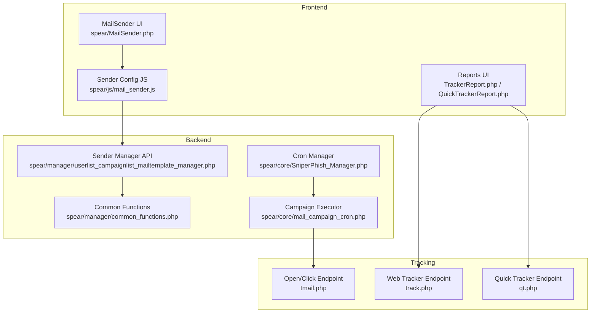
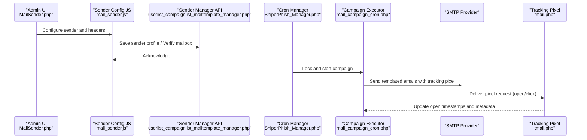
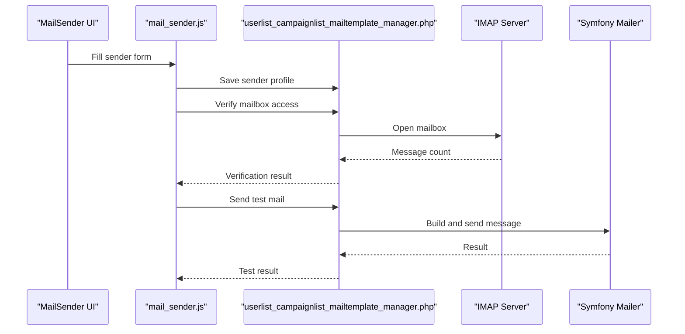
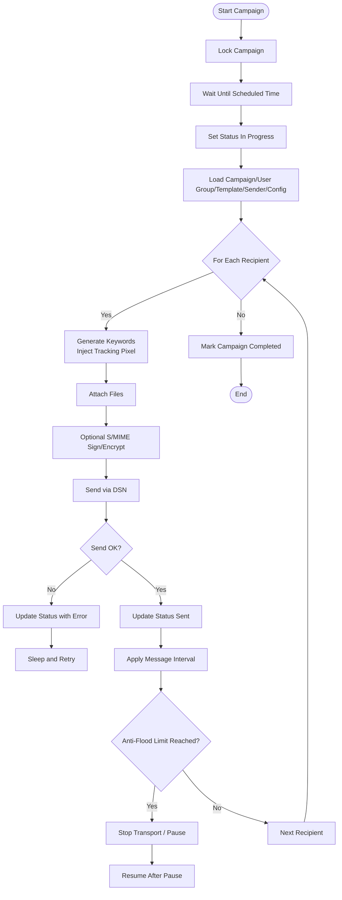
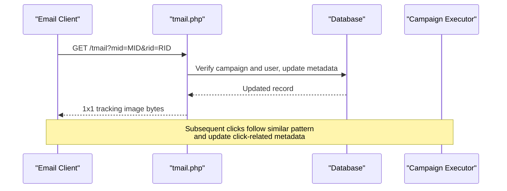
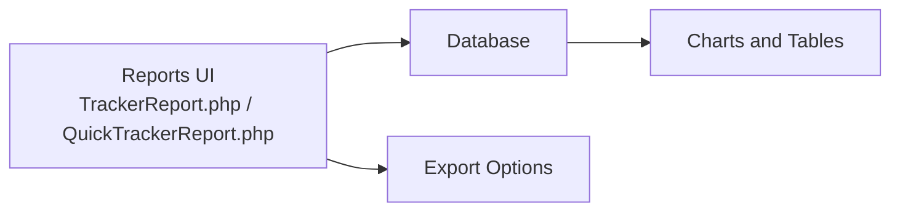
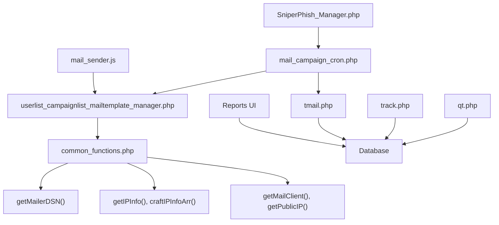

# Email Delivery and Tracking

<cite>
**Referenced Files in This Document**
- [tmail.php](file://tmail.php)
- [mail_sender.js](file://spear/js/mail_sender.js)
- [MailSender.php](file://spear/MailSender.php)
- [userlist_campaignlist_mailtemplate_manager.php](file://spear/manager/userlist_campaignlist_mailtemplate_manager.php)
- [common_functions.php](file://spear/manager/common_functions.php)
- [SniperPhish_Manager.php](file://spear/core/SniperPhish_Manager.php)
- [mail_campaign_cron.php](file://spear/core/mail_campaign_cron.php)
- [track.php](file://track.php)
- [qt.php](file://qt.php)
- [TrackerReport.php](file://spear/TrackerReport.php)
- [QuickTrackerReport.php](file://spear/QuickTrackerReport.php)
</cite>

## Table of Contents
1. [Introduction](#introduction)
2. [Project Structure](#project-structure)
3. [Core Components](#core-components)
4. [Architecture Overview](#architecture-overview)
5. [Detailed Component Analysis](#detailed-component-analysis)
6. [Dependency Analysis](#dependency-analysis)
7. [Performance Considerations](#performance-considerations)
8. [Troubleshooting Guide](#troubleshooting-guide)
9. [Conclusion](#conclusion)
10. [Appendices](#appendices)

## Introduction
This document explains the email delivery and tracking system with a focus on:
- Message preparation and delivery via the mail sender interface
- Real-time tracking of deliveries and user interactions
- Performance monitoring and bounce handling
- Integration with web tracking for combined web-email analytics
- Advanced tracking features such as geolocation, device identification, and user behavior analysis
- Common delivery issues, deliverability optimization strategies, and failure management

## Project Structure
The system comprises:
- Frontend UI for configuring senders and campaigns
- Backend APIs for managing senders, templates, and campaign orchestration
- Cron-driven mail campaign executor
- Tracking endpoints for open/click and quick tracker events
- Reporting dashboards for consolidated analytics

**Diagram sources**
- [MailSender.php:1-456](file://spear/MailSender.php#L1-L456)
- [mail_sender.js:1-579](file://spear/js/mail_sender.js#L1-L579)
- [userlist_campaignlist_mailtemplate_manager.php:1-709](file://spear/manager/userlist_campaignlist_mailtemplate_manager.php#L1-L709)
- [common_functions.php:1-595](file://spear/manager/common_functions.php#L1-L595)
- [SniperPhish_Manager.php:1-46](file://spear/core/SniperPhish_Manager.php#L1-L46)
- [mail_campaign_cron.php:1-364](file://spear/core/mail_campaign_cron.php#L1-L364)
- [tmail.php:1-148](file://tmail.php#L1-L148)
- [track.php:1-88](file://track.php#L1-L88)
- [qt.php:1-63](file://qt.php#L1-L63)
- [TrackerReport.php:1-257](file://spear/TrackerReport.php#L1-L257)
- [QuickTrackerReport.php:1-268](file://spear/QuickTrackerReport.php#L1-L268)

**Section sources**
- [MailSender.php:1-456](file://spear/MailSender.php#L1-L456)
- [mail_sender.js:1-579](file://spear/js/mail_sender.js#L1-L579)
- [userlist_campaignlist_mailtemplate_manager.php:1-709](file://spear/manager/userlist_campaignlist_mailtemplate_manager.php#L1-L709)
- [common_functions.php:1-595](file://spear/manager/common_functions.php#L1-L595)
- [SniperPhish_Manager.php:1-46](file://spear/core/SniperPhish_Manager.php#L1-L46)
- [mail_campaign_cron.php:1-364](file://spear/core/mail_campaign_cron.php#L1-L364)
- [tmail.php:1-148](file://tmail.php#L1-L148)
- [track.php:1-88](file://track.php#L1-L88)
- [qt.php:1-63](file://qt.php#L1-L63)
- [TrackerReport.php:1-257](file://spear/TrackerReport.php#L1-L257)
- [QuickTrackerReport.php:1-268](file://spear/QuickTrackerReport.php#L1-L268)

## Core Components
- Sender configuration and test delivery:
  - UI and JS manage sender profiles, custom headers, and mailbox verification
  - Backend API persists sender configurations and validates mailbox access
- Campaign orchestration:
  - Cron manager schedules and locks campaigns
  - Campaign executor prepares messages, injects tracking pixels, and sends via DSN
- Tracking endpoints:
  - Open/click tracking endpoint records opens and updates per-user metadata
  - Web tracker endpoint captures page visits and form submissions
  - Quick tracker endpoint logs mail client and IP info for quick insights
- Reporting:
  - Web tracker reports and quick tracker reports present consolidated analytics

**Section sources**
- [mail_sender.js:1-579](file://spear/js/mail_sender.js#L1-L579)
- [userlist_campaignlist_mailtemplate_manager.php:497-709](file://spear/manager/userlist_campaignlist_mailtemplate_manager.php#L497-L709)
- [SniperPhish_Manager.php:1-46](file://spear/core/SniperPhish_Manager.php#L1-L46)
- [mail_campaign_cron.php:1-364](file://spear/core/mail_campaign_cron.php#L1-L364)
- [tmail.php:1-148](file://tmail.php#L1-L148)
- [track.php:1-88](file://track.php#L1-L88)
- [qt.php:1-63](file://qt.php#L1-L63)
- [TrackerReport.php:1-257](file://spear/TrackerReport.php#L1-L257)
- [QuickTrackerReport.php:1-268](file://spear/QuickTrackerReport.php#L1-L268)

## Architecture Overview
The system integrates frontend configuration, backend orchestration, and tracking endpoints to deliver measurable email campaigns.

**Diagram sources**
- [MailSender.php:1-456](file://spear/MailSender.php#L1-L456)
- [mail_sender.js:1-579](file://spear/js/mail_sender.js#L1-L579)
- [userlist_campaignlist_mailtemplate_manager.php:497-709](file://spear/manager/userlist_campaignlist_mailtemplate_manager.php#L497-L709)
- [SniperPhish_Manager.php:1-46](file://spear/core/SniperPhish_Manager.php#L1-L46)
- [mail_campaign_cron.php:1-364](file://spear/core/mail_campaign_cron.php#L1-L364)
- [tmail.php:1-148](file://tmail.php#L1-L148)

## Detailed Component Analysis

### Mail Sender Functionality (UI, JS, and API)
- UI and JS:
  - Provides forms for SMTP server, credentials, From address, mailbox path, and custom headers
  - Supports sender templates and dynamic insertion of common provider configurations
  - Includes test delivery and mailbox verification flows
- API:
  - Persists sender profiles and custom headers
  - Validates mailbox access via IMAP
  - Generates and sends test emails using Symfony Mailer with DSN selection

**Diagram sources**
- [MailSender.php:1-456](file://spear/MailSender.php#L1-L456)
- [mail_sender.js:1-579](file://spear/js/mail_sender.js#L1-L579)
- [userlist_campaignlist_mailtemplate_manager.php:584-609](file://spear/manager/userlist_campaignlist_mailtemplate_manager.php#L584-L609)
- [userlist_campaignlist_mailtemplate_manager.php:613-635](file://spear/manager/userlist_campaignlist_mailtemplate_manager.php#L613-L635)

**Section sources**
- [MailSender.php:1-456](file://spear/MailSender.php#L1-L456)
- [mail_sender.js:1-579](file://spear/js/mail_sender.js#L1-L579)
- [userlist_campaignlist_mailtemplate_manager.php:497-709](file://spear/manager/userlist_campaignlist_mailtemplate_manager.php#L497-L709)

### Campaign Execution and Delivery Queue
- Scheduler:
  - Locks campaigns and waits until scheduled time
  - Sets campaign status to in-progress
- Executor:
  - Loads campaign, user group, template, sender, and configuration
  - Generates unique RID per recipient
  - Injects keyword placeholders including tracking pixel URL
  - Applies optional S/MIME signing/encryption
  - Sends with retry and anti-flood controls
  - Updates per-recipient status and error logs

**Diagram sources**
- [SniperPhish_Manager.php:1-46](file://spear/core/SniperPhish_Manager.php#L1-L46)
- [mail_campaign_cron.php:99-294](file://spear/core/mail_campaign_cron.php#L99-L294)

**Section sources**
- [SniperPhish_Manager.php:1-46](file://spear/core/SniperPhish_Manager.php#L1-L46)
- [mail_campaign_cron.php:1-364](file://spear/core/mail_campaign_cron.php#L1-L364)

### Tracking Mechanisms (Open Detection, Link Click Monitoring, Delivery Confirmation)
- Open/Click Tracking:
  - Endpoint validates campaign and user, extracts user agent, OS, device, IP, headers
  - Records opens with timestamps and aggregates metadata per user
  - Returns tracked image to confirm delivery
- Web Tracker:
  - Accepts page visit and form submission events with IP info, browser, OS, device
  - Stores session-scoped data for behavioral analysis
- Quick Tracker:
  - Logs mail client, platform, and IP info for quick insights

**Diagram sources**
- [tmail.php:1-148](file://tmail.php#L1-L148)
- [mail_campaign_cron.php:180-215](file://spear/core/mail_campaign_cron.php#L180-L215)

**Section sources**
- [tmail.php:1-148](file://tmail.php#L1-L148)
- [track.php:1-88](file://track.php#L1-L88)
- [qt.php:1-63](file://qt.php#L1-L63)
- [mail_campaign_cron.php:180-215](file://spear/core/mail_campaign_cron.php#L180-L215)

### Real-Time Delivery Monitoring and Reporting
- Web Tracker Reports:
  - Select tracker, choose columns, refresh and export results
  - Columns include user info, IP info, headers, and timestamps
- Quick Tracker Reports:
  - Dedicated UI for quick tracker results with export options

**Diagram sources**
- [TrackerReport.php:1-257](file://spear/TrackerReport.php#L1-L257)
- [QuickTrackerReport.php:1-268](file://spear/QuickTrackerReport.php#L1-L268)

**Section sources**
- [TrackerReport.php:1-257](file://spear/TrackerReport.php#L1-L257)
- [QuickTrackerReport.php:1-268](file://spear/QuickTrackerReport.php#L1-L268)

## Dependency Analysis
- UI depends on JS for AJAX actions and sender management
- JS communicates with backend API for persistence and verification
- API leverages common functions for DSN generation, keyword filtering, QR/barcode embedding, and IP enrichment
- Cron manager and executor depend on API for configuration and on Symfony Mailer for transport
- Tracking endpoints depend on common functions for IP enrichment and browser detection

**Diagram sources**
- [mail_sender.js:1-579](file://spear/js/mail_sender.js#L1-L579)
- [userlist_campaignlist_mailtemplate_manager.php:1-709](file://spear/manager/userlist_campaignlist_mailtemplate_manager.php#L1-L709)
- [common_functions.php:1-595](file://spear/manager/common_functions.php#L1-L595)
- [SniperPhish_Manager.php:1-46](file://spear/core/SniperPhish_Manager.php#L1-L46)
- [mail_campaign_cron.php:1-364](file://spear/core/mail_campaign_cron.php#L1-L364)
- [tmail.php:1-148](file://tmail.php#L1-L148)
- [track.php:1-88](file://track.php#L1-L88)
- [qt.php:1-63](file://qt.php#L1-L63)

**Section sources**
- [mail_sender.js:1-579](file://spear/js/mail_sender.js#L1-L579)
- [userlist_campaignlist_mailtemplate_manager.php:1-709](file://spear/manager/userlist_campaignlist_mailtemplate_manager.php#L1-L709)
- [common_functions.php:1-595](file://spear/manager/common_functions.php#L1-L595)
- [SniperPhish_Manager.php:1-46](file://spear/core/SniperPhish_Manager.php#L1-L46)
- [mail_campaign_cron.php:1-364](file://spear/core/mail_campaign_cron.php#L1-L364)
- [tmail.php:1-148](file://tmail.php#L1-L148)
- [track.php:1-88](file://track.php#L1-L88)
- [qt.php:1-63](file://qt.php#L1-L63)

## Performance Considerations
- Anti-flood control:
  - Campaign executor pauses transport periodically to respect provider limits
- Retry and jitter:
  - Transport exceptions trigger retries with small delays
- Per-message interval:
  - Randomized sleep between sends reduces detection risk
- Metadata aggregation:
  - Tracking endpoints append arrays of timestamps and attributes to support trend analysis

[No sources needed since this section provides general guidance]

## Troubleshooting Guide
- Sender configuration issues:
  - Use mailbox verification to confirm IMAP path and credentials
  - Ensure custom headers are valid and not blocked by providers
- Delivery failures:
  - Review per-recipient status updates and error logs generated during send attempts
  - Adjust retry count and intervals in campaign configuration
- Tracking not recorded:
  - Confirm tracking pixel URL injection in templates
  - Validate campaign status and user existence in live data
- Web tracker anomalies:
  - Check tracker active flag and ensure POST payload includes required fields

**Section sources**
- [userlist_campaignlist_mailtemplate_manager.php:584-609](file://spear/manager/userlist_campaignlist_mailtemplate_manager.php#L584-L609)
- [mail_campaign_cron.php:266-277](file://spear/core/mail_campaign_cron.php#L266-L277)
- [tmail.php:28-108](file://tmail.php#L28-L108)
- [track.php:54-61](file://track.php#L54-L61)

## Conclusion
The system provides a robust pipeline for preparing, sending, and tracking email campaigns, with integrated web tracking for combined analytics. It supports advanced features like S/MIME signing/encryption, anti-flood controls, and comprehensive metadata collection for geolocation, device identification, and user behavior analysis. Administrators can monitor performance, troubleshoot delivery issues, and optimize deliverability through configurable retry, intervals, and provider-specific DSN settings.

[No sources needed since this section summarizes without analyzing specific files]

## Appendices

### Delivery Workflows and Examples
- Example: Test delivery
  - Configure sender, enter test recipient, and trigger test mail
  - Validate success via toast notification and inbox
- Example: Scheduled campaign
  - Schedule campaign, wait for lock and start, observe per-recipient status updates
  - Confirm tracking pixel presence in delivered messages

**Section sources**
- [mail_sender.js:379-453](file://spear/js/mail_sender.js#L379-L453)
- [userlist_campaignlist_mailtemplate_manager.php:613-635](file://spear/manager/userlist_campaignlist_mailtemplate_manager.php#L613-L635)
- [SniperPhish_Manager.php:23-28](file://spear/core/SniperPhish_Manager.php#L23-L28)
- [mail_campaign_cron.php:99-120](file://spear/core/mail_campaign_cron.php#L99-L120)

### Tracking Capabilities
- Open detection:
  - Endpoint updates open timestamps and aggregates metadata per user
- Link click monitoring:
  - Clicks follow the same pixel delivery path; metadata stored for analysis
- Delivery confirmation:
  - Pixel delivery confirms message reached the client

**Section sources**
- [tmail.php:28-108](file://tmail.php#L28-L108)
- [mail_campaign_cron.php:180-215](file://spear/core/mail_campaign_cron.php#L180-L215)

### Integration with Web Tracking Systems
- Web tracker endpoint:
  - Captures page visits and form submissions with device and IP metadata
- Combined analytics:
  - Reports UI aggregates web and email events for unified analysis

**Section sources**
- [track.php:1-88](file://track.php#L1-L88)
- [TrackerReport.php:1-257](file://spear/TrackerReport.php#L1-L257)

### Advanced Tracking Features
- Geolocation detection:
  - IP enrichment via external API and stored in structured IP info
- Device identification:
  - Browser, OS, and device type derived from user agent and mobile detection
- User behavior analysis:
  - Aggregated timestamps and headers enable behavioral insights

**Section sources**
- [common_functions.php:257-331](file://spear/manager/common_functions.php#L257-L331)
- [tmail.php:24-42](file://tmail.php#L24-L42)
- [track.php:34-46](file://track.php#L34-L46)

### Delivery Performance Metrics and Bounce Handling
- Metrics:
  - Per-recipient status, send timestamps, open timestamps, error logs
- Bounce handling:
  - Transport exceptions recorded; retry logic applied; administrators can review and adjust configuration

**Section sources**
- [mail_campaign_cron.php:307-323](file://spear/core/mail_campaign_cron.php#L307-L323)
- [mail_campaign_cron.php:266-277](file://spear/core/mail_campaign_cron.php#L266-L277)

### Deliverability Optimization Strategies
- Provider-specific DSN:
  - Use pre-configured DSNs for major providers to improve compatibility
- Anti-flood and jitter:
  - Respect provider rate limits and reduce detection risk
- S/MIME signing/encryption:
  - Enhance trust and reduce filtering likelihood

**Section sources**
- [common_functions.php:145-159](file://spear/manager/common_functions.php#L145-L159)
- [mail_campaign_cron.php:283-288](file://spear/core/mail_campaign_cron.php#L283-L288)