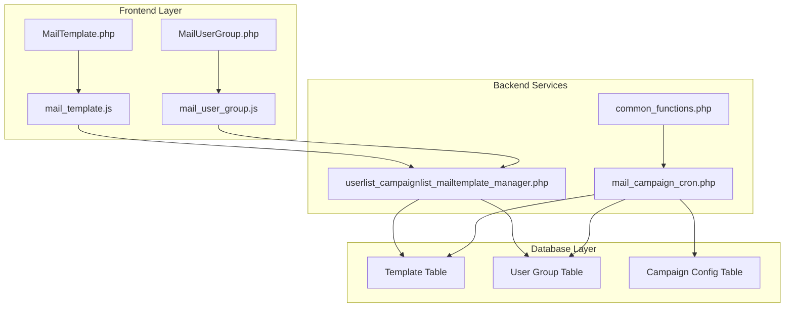
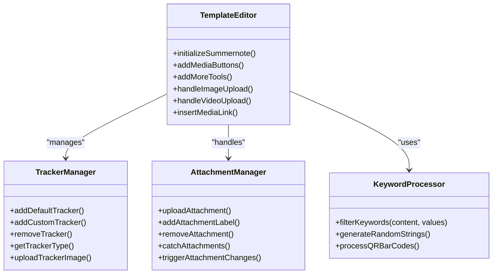
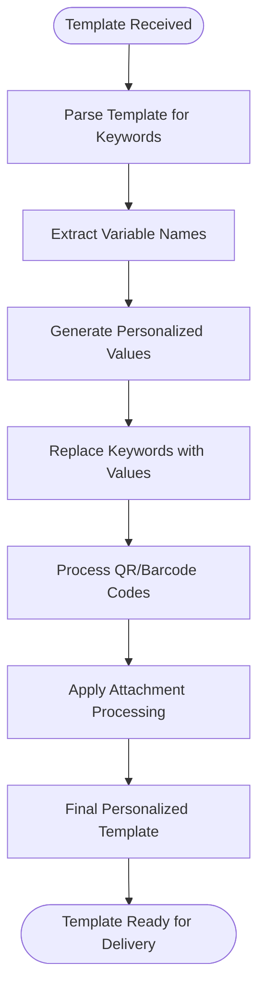
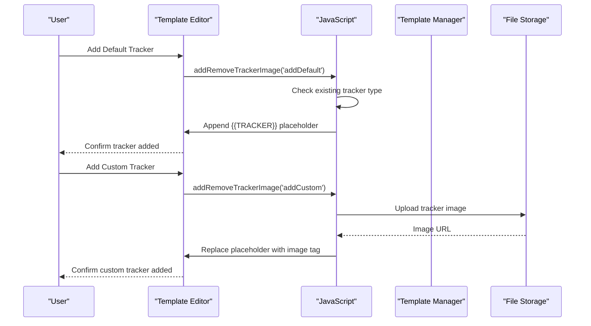
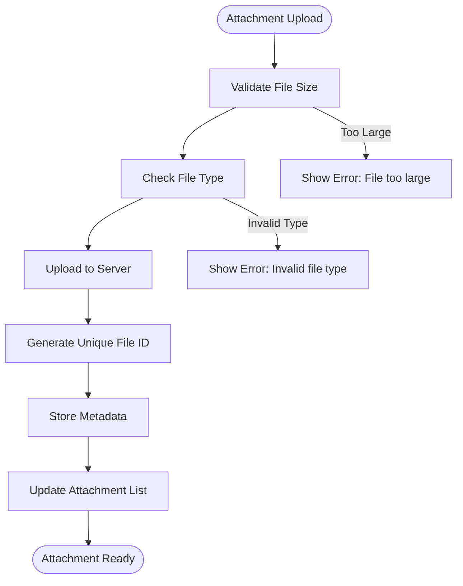
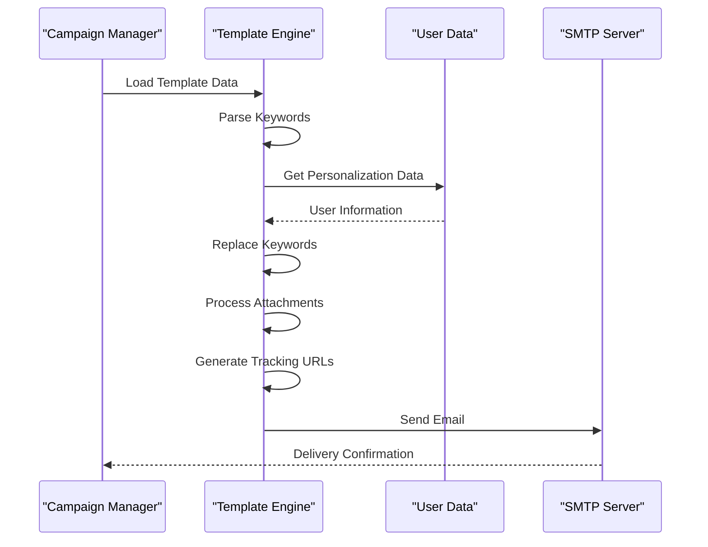
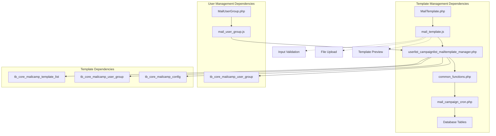

# Email Template Management

<cite>
**Referenced Files in This Document**
- [MailTemplate.php](file://spear/MailTemplate.php)
- [mail_template.js](file://spear/js/mail_template.js)
- [userlist_campaignlist_mailtemplate_manager.php](file://spear/manager/userlist_campaignlist_mailtemplate_manager.php)
- [mail_campaign_cron.php](file://spear/core/mail_campaign_cron.php)
- [common_functions.php](file://spear/manager/common_functions.php)
- [MailUserGroup.php](file://spear/MailUserGroup.php)
- [mail_user_group.js](file://spear/js/mail_user_group.js)
- [install_manager.php](file://install_manager.php)
</cite>

## Table of Contents
1. [Introduction](#introduction)
2. [Project Structure](#project-structure)
3. [Core Components](#core-components)
4. [Architecture Overview](#architecture-overview)
5. [Detailed Component Analysis](#detailed-component-analysis)
6. [Dependency Analysis](#dependency-analysis)
7. [Performance Considerations](#performance-considerations)
8. [Troubleshooting Guide](#troubleshooting-guide)
9. [Conclusion](#conclusion)

## Introduction
This document provides comprehensive documentation for the email template creation and management system within the SniperPhish toolkit. The system enables security professionals to design phishing email templates with embedded tracking capabilities, manage template libraries, and deliver targeted campaigns to user groups. The documentation covers the complete template lifecycle from creation through campaign execution, including HTML editor functionality, template preview, save operations, and dynamic content personalization.

## Project Structure
The email template management system is organized around several key components:

- **Frontend Interface**: HTML-based template editor with rich text editing capabilities
- **JavaScript Layer**: Client-side logic for template manipulation and user interactions
- **Backend Services**: PHP-based managers handling template storage, user groups, and campaign execution
- **Database Schema**: Structured storage for templates, user data, and campaign configurations



**Diagram sources**
- [MailTemplate.php:1-601](file://spear/MailTemplate.php#L1-L601)
- [mail_template.js:1-709](file://spear/js/mail_template.js#L1-L709)
- [userlist_campaignlist_mailtemplate_manager.php:1-709](file://spear/manager/userlist_campaignlist_mailtemplate_manager.php#L1-L709)

**Section sources**
- [MailTemplate.php:1-601](file://spear/MailTemplate.php#L1-L601)
- [mail_template.js:1-709](file://spear/js/mail_template.js#L1-L709)

## Core Components

### Template Editor Interface
The template editor provides a comprehensive WYSIWYG interface built on Summernote, offering:

- Rich text editing with formatting options
- Media insertion capabilities for images and videos
- Embedded tracking image management
- Attachment handling system
- Template keyword reference panel

### JavaScript Template Engine
The client-side JavaScript handles all template manipulation operations:

- Real-time template validation and preview
- Dynamic content updates based on user actions
- Tracker image insertion and management
- Attachment upload and processing
- Template keyword substitution

### Backend Template Management
The PHP backend manages template persistence and processing:

- Template CRUD operations
- User group integration
- Campaign execution pipeline
- Personalization data application

**Section sources**
- [MailTemplate.php:125-303](file://spear/MailTemplate.php#L125-L303)
- [mail_template.js:568-607](file://spear/js/mail_template.js#L568-L607)
- [userlist_campaignlist_mailtemplate_manager.php:345-426](file://spear/manager/userlist_campaignlist_mailtemplate_manager.php#L345-L426)

## Architecture Overview

The email template management system follows a layered architecture with clear separation of concerns:

```mermaid
sequenceDiagram
participant User as "User Interface"
participant Editor as "Template Editor"
participant JS as "JavaScript Handler"
participant Manager as "Template Manager"
participant DB as "Database"
participant Cron as "Campaign Executor"
User->>Editor : Create Template
Editor->>JS : Initialize Summernote
JS->>Manager : Upload Template Data
Manager->>DB : Store Template
DB-->>Manager : Confirmation
Manager-->>JS : Success Response
JS-->>Editor : Update UI
User->>Editor : Configure Campaign
Editor->>Manager : Get Template Data
Manager->>DB : Retrieve Template
DB-->>Manager : Template Content
Manager-->>JS : Template Data
JS->>Cron : Execute Campaign
Cron->>Manager : Process Personalization
Manager-->>Cron : Personalized Content
Cron-->>User : Delivery Status
```



**Diagram sources**
- [mail_template.js:190-227](file://spear/js/mail_template.js#L190-L227)
- [userlist_campaignlist_mailtemplate_manager.php:345-426](file://spear/manager/userlist_campaignlist_mailtemplate_manager.php#L345-L426)
- [mail_campaign_cron.php:99-294](file://spear/core/mail_campaign_cron.php#L99-L294)

## Detailed Component Analysis

### Template Creation and Editing

#### HTML Editor Implementation
The template editor utilizes Summernote with custom extensions:



**Diagram sources**
- [mail_template.js:568-607](file://spear/js/mail_template.js#L568-L607)
- [mail_template.js:125-178](file://spear/js/mail_template.js#L125-L178)
- [mail_template.js:381-452](file://spear/js/mail_template.js#L381-L452)

#### Template Storage and Retrieval
Templates are stored in a structured format with metadata:

| Field | Type | Description |
|-------|------|-------------|
| mail_template_id | varchar(111) | Unique template identifier |
| mail_template_name | varchar(111) | Template display name |
| mail_template_subject | varchar(1111) | Email subject line |
| mail_template_content | mediumtext | HTML content |
| timage_type | tinyint(1) | Tracker image type (0-none, 1-default, 2-custom) |
| mail_content_type | varchar(111) | Content type (text/html or text/plain) |
| attachment | varchar(1111) | JSON-encoded attachment list |
| date | varchar(111) | Creation timestamp |

**Section sources**
- [install_manager.php:269-281](file://install_manager.php#L269-L281)
- [userlist_campaignlist_mailtemplate_manager.php:345-426](file://spear/manager/userlist_campaignlist_mailtemplate_manager.php#L345-L426)

### Template Variables and Personalization

#### Available Template Keywords
The system supports extensive personalization through template keywords:

| Keyword | Description | Example Output |
|---------|-------------|----------------|
| {{RID}} | Remote user's unique ID | abc123def456 |
| {{MID}} | Mail campaign ID | campaign_789xyz |
| {{NAME}} | Full recipient name | John Doe |
| {{FNAME}} | First name | John |
| {{LNAME}} | Last name | Doe |
| {{NOTES}} | User notes | Employee |
| {{EMAIL}} | Recipient email | john.doe@example.com |
| {{FROM}} | Sender email address | sender@company.com |
| {{TRACKINGURL}} | Complete tracking URL | https://example.com/tmail?mid=campaign_789xyz&rid=abc123def456 |
| {{TRACKER}} | Complete tracking image HTML | `` |
| {{BASEURL}} | SniperPhish base URL | https://example.com/spear |
| {{MUSERNAME}} | Username part of email | john.doe |
| {{MDOMAIN}} | Domain part of email | example.com |
| {{RND}} | Random alphanumeric string | xyz789 |

#### Dynamic Content Processing
The keyword replacement system processes templates during campaign execution:



**Diagram sources**
- [common_functions.php:187-204](file://spear/manager/common_functions.php#L187-L204)
- [mail_campaign_cron.php:180-239](file://spear/core/mail_campaign_cron.php#L180-L239)

**Section sources**
- [MailTemplate.php:206-261](file://spear/MailTemplate.php#L206-L261)
- [common_functions.php:187-204](file://spear/manager/common_functions.php#L187-L204)
- [mail_campaign_cron.php:180-239](file://spear/core/mail_campaign_cron.php#L180-L239)

### Tracker Image Management

#### Default vs Custom Trackers
The system supports two types of tracking mechanisms:

1. **Default Tracker**: Predefined tracking image embedded automatically
2. **Custom Tracker**: User-uploaded tracking image with unique identifiers

#### Tracker Integration Process


**Diagram sources**
- [mail_template.js:125-178](file://spear/js/mail_template.js#L125-L178)
- [userlist_campaignlist_mailtemplate_manager.php:428-445](file://spear/manager/userlist_campaignlist_mailtemplate_manager.php#L428-L445)

**Section sources**
- [mail_template.js:125-178](file://spear/js/mail_template.js#L125-L178)
- [userlist_campaignlist_mailtemplate_manager.php:428-445](file://spear/manager/userlist_campaignlist_mailtemplate_manager.php#L428-L445)

### Attachment Management System

#### Attachment Types and Processing
The system handles both inline and regular attachments:

| Attachment Type | Processing Method | Use Case |
|----------------|-------------------|----------|
| Inline Attachment | `embedFromPath()` | Images, logos, documents |
| Regular Attachment | `attachFromPath()` | Files, documents, executables |
| Dynamic Naming | Keyword replacement | Personalized filenames |

#### Attachment Upload Workflow


**Diagram sources**
- [mail_template.js:381-404](file://spear/js/mail_template.js#L381-L404)
- [mail_template.js:428-445](file://spear/js/mail_template.js#L428-L445)

**Section sources**
- [mail_template.js:381-452](file://spear/js/mail_template.js#L381-L452)
- [userlist_campaignlist_mailtemplate_manager.php:447-494](file://spear/manager/userlist_campaignlist_mailtemplate_manager.php#L447-L494)

### User Group Integration

#### User Group Structure
User groups serve as the foundation for template personalization:

| Field | Type | Description |
|-------|------|-------------|
| user_group_id | varchar(111) | Unique group identifier |
| user_group_name | varchar(50) | Group display name |
| user_data | mediumtext | JSON-encoded user list |
| date | varchar(111) | Creation timestamp |

#### User Data Format
Each user record contains essential information for personalization:

```json
{
  "uid": "unique_user_id",
  "fname": "First Name",
  "lname": "Last Name", 
  "email": "user@example.com",
  "notes": "Additional information"
}
```

**Section sources**
- [install_manager.php:286-295](file://install_manager.php#L286-L295)
- [mail_user_group.js:240-267](file://spear/js/mail_user_group.js#L240-L267)

### Campaign Execution Pipeline

#### Template Processing During Delivery
The campaign execution process transforms templates into personalized emails:



**Diagram sources**
- [mail_campaign_cron.php:99-294](file://spear/core/mail_campaign_cron.php#L99-L294)
- [common_functions.php:187-230](file://spear/manager/common_functions.php#L187-L230)

**Section sources**
- [mail_campaign_cron.php:99-294](file://spear/core/mail_campaign_cron.php#L99-L294)
- [common_functions.php:187-230](file://spear/manager/common_functions.php#L187-L230)

## Dependency Analysis

The template management system exhibits clear dependency relationships:



**Diagram sources**
- [MailTemplate.php:579](file://spear/MailTemplate.php#L579)
- [mail_template.js:75-123](file://spear/js/mail_template.js#L75-L123)
- [userlist_campaignlist_mailtemplate_manager.php:17-77](file://spear/manager/userlist_campaignlist_mailtemplate_manager.php#L17-L77)

**Section sources**
- [MailTemplate.php:579](file://spear/MailTemplate.php#L579)
- [mail_template.js:75-123](file://spear/js/mail_template.js#L75-L123)
- [userlist_campaignlist_mailtemplate_manager.php:17-77](file://spear/manager/userlist_campaignlist_mailtemplate_manager.php#L17-L77)

## Performance Considerations

### Template Processing Optimization
- **Keyword Replacement**: Efficient string replacement using associative arrays
- **File Upload**: Asynchronous processing with progress indicators
- **Memory Management**: Proper cleanup of temporary files and resources
- **Database Queries**: Optimized queries with prepared statements

### Scalability Factors
- **Template Size Limits**: Configurable limits for HTML content and attachments
- **User Group Scaling**: Efficient handling of large user datasets
- **Concurrent Operations**: Thread-safe processing for multiple simultaneous campaigns
- **Resource Cleanup**: Automatic cleanup of temporary files and uploaded assets

## Troubleshooting Guide

### Common Template Issues

#### HTML Validation Problems
**Symptoms**: Template appears incorrectly formatted in email clients
**Solutions**:
- Use the built-in HTML validation features
- Test templates across multiple email clients
- Validate CSS compatibility with email client restrictions
- Ensure proper DOCTYPE declaration

#### Image Embedding Issues
**Symptoms**: Images not displaying in delivered emails
**Solutions**:
- Verify image file types are supported (JPEG, PNG, GIF)
- Check file size limitations (4MB default)
- Ensure proper MIME type detection
- Test with both inline and embedded images

#### Template Rendering Inconsistencies
**Symptoms**: Different appearance across email clients
**Solutions**:
- Use table-based layouts for better compatibility
- Avoid unsupported CSS properties
- Test with major email clients (Outlook, Gmail, Apple Mail)
- Implement fallback styles for older clients

### JavaScript Error Handling
The system includes comprehensive error handling:

| Error Type | Trigger | User Feedback |
|------------|---------|---------------|
| File Size Exceeded | 4MB limit | "File size exceeded. Max image size is 4MB" |
| Invalid File Type | Non-image files | "File is not an image" |
| Template Save Failure | Database errors | "Error saving data!" |
| Upload Failure | Network issues | "Error uploading file!" |

**Section sources**
- [mail_template.js:151-178](file://spear/js/mail_template.js#L151-L178)
- [mail_template.js:381-404](file://spear/js/mail_template.js#L381-L404)

### Database and Session Management
- **Session Timeout**: Automatic logout after 1 hour of inactivity
- **Database Connection**: Persistent connections with proper cleanup
- **Transaction Safety**: Atomic operations for template updates
- **Backup Strategy**: Automatic backup of template data

**Section sources**
- [common_functions.php:243-323](file://spear/manager/common_functions.php#L243-L323)
- [mail_campaign_cron.php:325-361](file://spear/core/mail_campaign_cron.php#L325-L361)

## Conclusion

The SniperPhish email template management system provides a comprehensive solution for creating and managing phishing templates with advanced tracking capabilities. The system's modular architecture ensures maintainability while providing powerful features for security professionals.

Key strengths include:
- **Rich Text Editing**: Professional-grade HTML editor with extensive formatting options
- **Personalization Engine**: Comprehensive keyword replacement system supporting dynamic content
- **Tracking Integration**: Flexible tracking mechanisms with both default and custom options
- **User Management**: Robust user group handling with scalable data structures
- **Campaign Execution**: Automated delivery pipeline with error handling and monitoring

The system's design emphasizes security, scalability, and ease of use, making it suitable for both educational and professional security assessment scenarios. The comprehensive documentation and troubleshooting guide ensure effective deployment and maintenance across diverse environments.