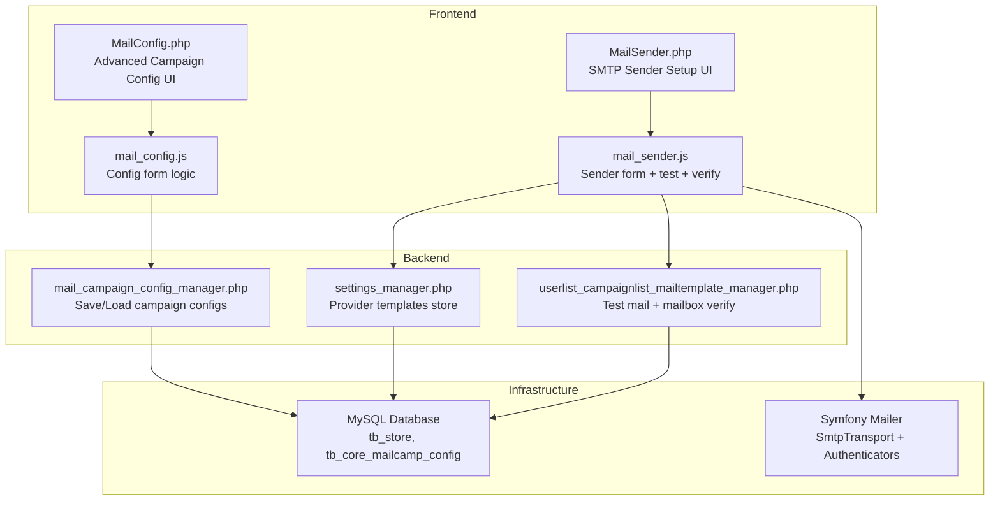
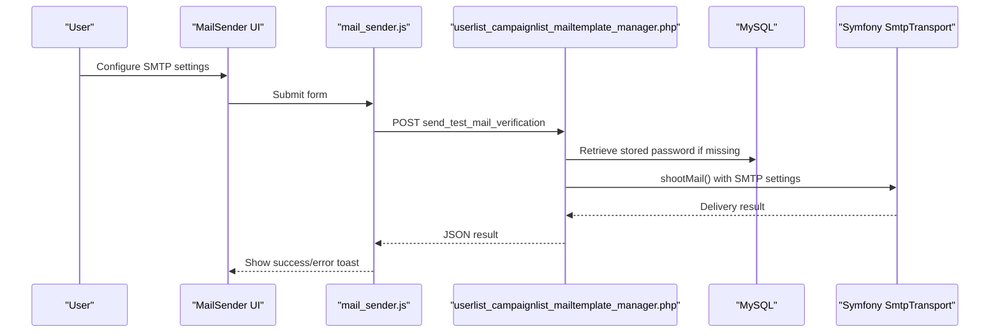
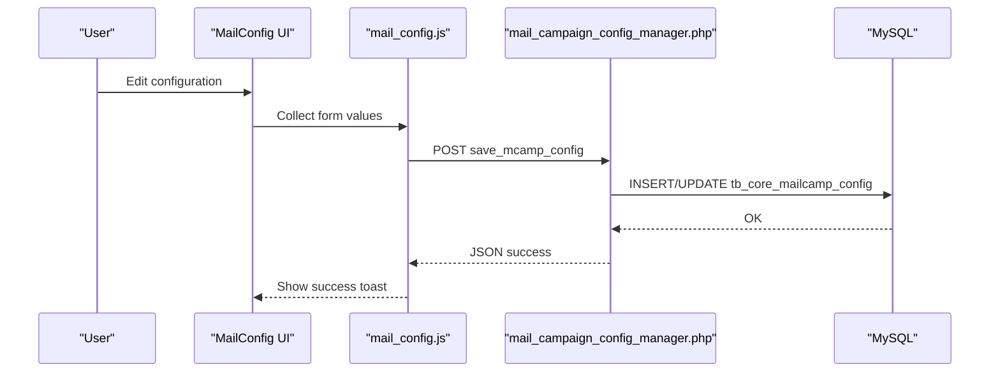
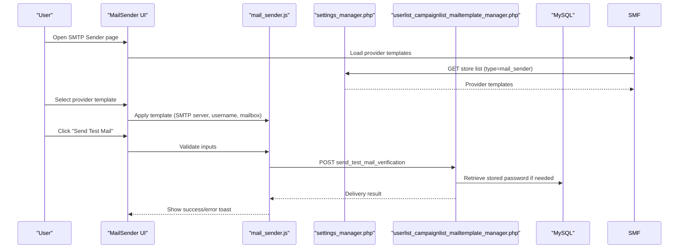
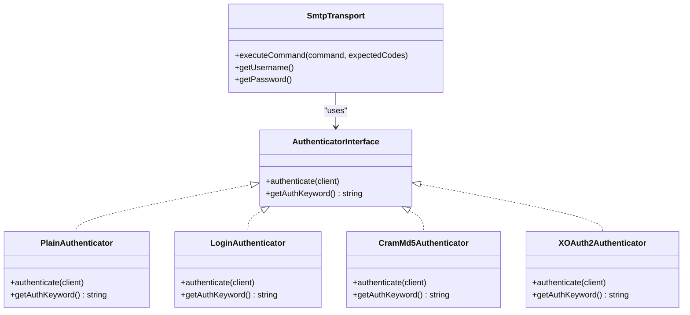
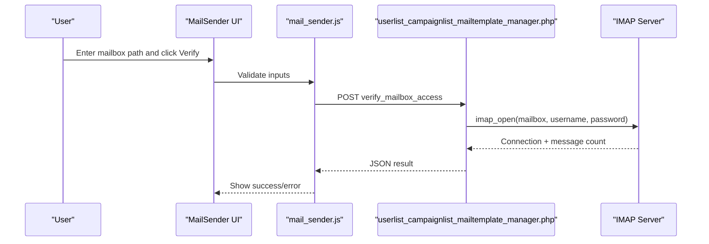
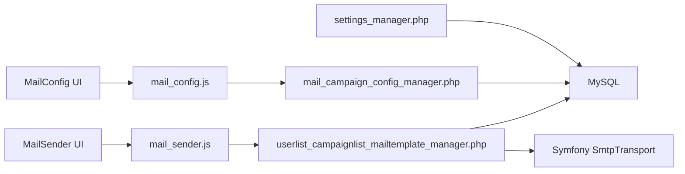

# SMTP Server Configuration

<cite>
**Referenced Files in This Document**
- [MailConfig.php](file://spear/MailConfig.php)
- [mail_config.js](file://spear/js/mail_config.js)
- [MailSender.php](file://spear/MailSender.php)
- [mail_sender.js](file://spear/js/mail_sender.js)
- [mail_campaign_config_manager.php](file://spear/manager/mail_campaign_config_manager.php)
- [settings_manager.php](file://spear/manager/settings_manager.php)
- [userlist_campaignlist_mailtemplate_manager.php](file://spear/manager/userlist_campaignlist_mailtemplate_manager.php)
- [install_manager.php](file://install_manager.php)
- [SmtpTransport.php](file://spear/libs/symfony/symfony/mailer/Transport/Smtp/SmtpTransport.php)
- [AuthenticatorInterface.php](file://spear/libs/symfony/symfony/mailer/Transport/Smtp/Auth/AuthenticatorInterface.php)
- [PlainAuthenticator.php](file://spear/libs/symfony/symfony/mailer/Transport/Smtp/Auth/PlainAuthenticator.php)
- [LoginAuthenticator.php](file://spear/libs/symfony/symfony/mailer/Transport/Smtp/Auth/LoginAuthenticator.php)
- [CramMd5Authenticator.php](file://spear/libs/symfony/symfony/mailer/Transport/Smtp/Auth/CramMd5Authenticator.php)
- [XOAuth2Authenticator.php](file://spear/libs/symfony/symfony/mailer/Transport/Smtp/Auth/XOAuth2Authenticator.php)
</cite>

## Table of Contents
1. [Introduction](#introduction)
2. [Project Structure](#project-structure)
3. [Core Components](#core-components)
4. [Architecture Overview](#architecture-overview)
5. [Detailed Component Analysis](#detailed-component-analysis)
6. [Dependency Analysis](#dependency-analysis)
7. [Performance Considerations](#performance-considerations)
8. [Troubleshooting Guide](#troubleshooting-guide)
9. [Conclusion](#conclusion)

## Introduction
This document explains the SMTP server configuration system used by the application to manage email delivery infrastructure. It covers the backend PHP configuration persistence, the frontend JavaScript forms for SMTP setup and testing, and the underlying Symfony Mailer transport and authentication mechanisms. It also provides practical examples for configuring popular email providers, guidance on security settings, and troubleshooting steps for common connection and authentication issues.

## Project Structure
The SMTP configuration spans three primary areas:
- Frontend configuration UI and validation logic
- Backend configuration persistence and retrieval
- Provider templates and SMTP testing/validation

**Diagram sources**
- [MailConfig.php:1-367](file://spear/MailConfig.php#L1-L367)
- [mail_config.js:1-307](file://spear/js/mail_config.js#L1-L307)
- [MailSender.php:1-456](file://spear/MailSender.php#L1-L456)
- [mail_sender.js:1-579](file://spear/js/mail_sender.js#L1-L579)
- [mail_campaign_config_manager.php:1-85](file://spear/manager/mail_campaign_config_manager.php#L1-L85)
- [settings_manager.php:320-356](file://spear/manager/settings_manager.php#L320-L356)
- [userlist_campaignlist_mailtemplate_manager.php:584-643](file://spear/manager/userlist_campaignlist_mailtemplate_manager.php#L584-L643)
- [install_manager.php:746-763](file://install_manager.php#L746-L763)

**Section sources**
- [MailConfig.php:1-367](file://spear/MailConfig.php#L1-L367)
- [MailSender.php:1-456](file://spear/MailSender.php#L1-L456)
- [mail_config.js:1-307](file://spear/js/mail_config.js#L1-L307)
- [mail_sender.js:1-579](file://spear/js/mail_sender.js#L1-L579)
- [mail_campaign_config_manager.php:1-85](file://spear/manager/mail_campaign_config_manager.php#L1-L85)
- [settings_manager.php:320-356](file://spear/manager/settings_manager.php#L320-L356)
- [userlist_campaignlist_mailtemplate_manager.php:584-643](file://spear/manager/userlist_campaignlist_mailtemplate_manager.php#L584-L643)
- [install_manager.php:746-763](file://install_manager.php#L746-L763)

## Core Components
- Advanced Campaign Configuration UI (MailConfig.php) manages per-campaign signing, encryption, TLS peer verification, recipient type, and anti-flood controls. The frontend logic (mail_config.js) serializes these settings and persists them via AJAX to the backend.
- SMTP Sender Setup UI (MailSender.php) allows administrators to define SMTP credentials, From address, optional mailbox path, custom headers, and to test delivery and verify mailbox access.
- Backend managers handle persistence and retrieval of campaign configurations and provider templates, and perform SMTP test deliveries and IMAP mailbox verification.
- Symfony Mailer transport and authenticators provide the underlying SMTP client and authentication mechanisms.

Key configuration fields include:
- TLS Peer Verification: toggles peer certificate verification for SMTP connections.
- Recipient Type: selects whether recipients appear in To, CC, or BCC.
- Signed Email: enables S/MIME signing with uploaded certificate and private key.
- Encrypted Email: enables S/MIME encryption with uploaded certificate.
- AntiFlood Control: limits messages per connection and sets pause duration.
- Message Priority: sets message priority indicator.
- SMTP Sender: SMTP server host:port, username, password, From address, optional mailbox path, and custom headers.

**Section sources**
- [MailConfig.php:88-246](file://spear/MailConfig.php#L88-L246)
- [mail_config.js:130-194](file://spear/js/mail_config.js#L130-L194)
- [MailSender.php:154-234](file://spear/MailSender.php#L154-L234)
- [mail_sender.js:109-195](file://spear/js/mail_sender.js#L109-L195)

## Architecture Overview
The configuration architecture follows a layered pattern:
- UI layer: HTML forms and JavaScript for user input and validation.
- API layer: PHP endpoints that persist and retrieve configuration data.
- Persistence layer: MySQL tables storing provider templates and campaign configurations.
- Transport layer: Symfony Mailer SMTP client with pluggable authenticators.

**Diagram sources**
- [mail_sender.js:431-453](file://spear/js/mail_sender.js#L431-L453)
- [userlist_campaignlist_mailtemplate_manager.php:613-635](file://spear/manager/userlist_campaignlist_mailtemplate_manager.php#L613-L635)
- [SmtpTransport.php:1-40](file://spear/libs/symfony/symfony/mailer/Transport/Smtp/SmtpTransport.php#L1-L40)

**Section sources**
- [mail_sender.js:431-453](file://spear/js/mail_sender.js#L431-L453)
- [userlist_campaignlist_mailtemplate_manager.php:613-635](file://spear/manager/userlist_campaignlist_mailtemplate_manager.php#L613-L635)
- [SmtpTransport.php:1-40](file://spear/libs/symfony/symfony/mailer/Transport/Smtp/SmtpTransport.php#L1-L40)

## Detailed Component Analysis

### Campaign Configuration Management
The campaign configuration system stores per-campaign preferences such as TLS verification, recipient type, signing/encryption settings, anti-flood limits, and message priority. The frontend collects these values and sends them to the backend for storage.

**Diagram sources**
- [mail_config.js:130-194](file://spear/js/mail_config.js#L130-L194)
- [mail_campaign_config_manager.php:27-49](file://spear/manager/mail_campaign_config_manager.php#L27-L49)
- [MailConfig.php:88-246](file://spear/MailConfig.php#L88-L246)

**Section sources**
- [mail_config.js:130-194](file://spear/js/mail_config.js#L130-L194)
- [mail_campaign_config_manager.php:27-49](file://spear/manager/mail_campaign_config_manager.php#L27-L49)
- [MailConfig.php:88-246](file://spear/MailConfig.php#L88-L246)

### SMTP Sender Setup and Testing
The SMTP sender setup allows defining SMTP server, credentials, From address, mailbox path, and custom headers. Users can test delivery to a target email and verify mailbox access via IMAP.

**Diagram sources**
- [mail_sender.js:525-568](file://spear/js/mail_sender.js#L525-L568)
- [settings_manager.php:320-356](file://spear/manager/settings_manager.php#L320-L356)
- [MailSender.php:383-406](file://spear/MailSender.php#L383-L406)
- [mail_sender.js:431-453](file://spear/js/mail_sender.js#L431-L453)
- [userlist_campaignlist_mailtemplate_manager.php:613-635](file://spear/manager/userlist_campaignlist_mailtemplate_manager.php#L613-L635)

**Section sources**
- [mail_sender.js:525-568](file://spear/js/mail_sender.js#L525-L568)
- [settings_manager.php:320-356](file://spear/manager/settings_manager.php#L320-L356)
- [MailSender.php:383-406](file://spear/MailSender.php#L383-L406)
- [mail_sender.js:431-453](file://spear/js/mail_sender.js#L431-L453)
- [userlist_campaignlist_mailtemplate_manager.php:613-635](file://spear/manager/userlist_campaignlist_mailtemplate_manager.php#L613-L635)

### Authentication Mechanisms
The system leverages Symfony Mailer authenticators for SMTP authentication. Supported mechanisms include PLAIN, LOGIN, CRAM-MD5, and XOAUTH2. The transport executes the appropriate AUTH command sequence based on the configured credentials.

**Diagram sources**
- [SmtpTransport.php:1-40](file://spear/libs/symfony/symfony/mailer/Transport/Smtp/SmtpTransport.php#L1-L40)
- [AuthenticatorInterface.php:1-35](file://spear/libs/symfony/symfony/mailer/Transport/Smtp/Auth/AuthenticatorInterface.php#L1-L35)
- [PlainAuthenticator.php:1-35](file://spear/libs/symfony/symfony/mailer/Transport/Smtp/Auth/PlainAuthenticator.php#L1-L35)
- [LoginAuthenticator.php:1-37](file://spear/libs/symfony/symfony/mailer/Transport/Smtp/Auth/LoginAuthenticator.php#L1-L37)
- [CramMd5Authenticator.php:1-47](file://spear/libs/symfony/symfony/mailer/Transport/Smtp/Auth/CramMd5Authenticator.php#L1-L47)
- [XOAuth2Authenticator.php:1-37](file://spear/libs/symfony/symfony/mailer/Transport/Smtp/Auth/XOAuth2Authenticator.php#L1-L37)

**Section sources**
- [SmtpTransport.php:1-40](file://spear/libs/symfony/symfony/mailer/Transport/Smtp/SmtpTransport.php#L1-L40)
- [AuthenticatorInterface.php:1-35](file://spear/libs/symfony/symfony/mailer/Transport/Smtp/Auth/AuthenticatorInterface.php#L1-L35)
- [PlainAuthenticator.php:1-35](file://spear/libs/symfony/symfony/mailer/Transport/Smtp/Auth/PlainAuthenticator.php#L1-L35)
- [LoginAuthenticator.php:1-37](file://spear/libs/symfony/symfony/mailer/Transport/Smtp/Auth/LoginAuthenticator.php#L1-L37)
- [CramMd5Authenticator.php:1-47](file://spear/libs/symfony/symfony/mailer/Transport/Smtp/Auth/CramMd5Authenticator.php#L1-L47)
- [XOAuth2Authenticator.php:1-37](file://spear/libs/symfony/symfony/mailer/Transport/Smtp/Auth/XOAuth2Authenticator.php#L1-L37)

### Security Settings and TLS/SSL
Security settings include:
- TLS Peer Verification: Controls whether the SMTP client verifies the server certificate. Disabling it is discouraged except for self-signed certificates.
- S/MIME Signing and Encryption: Optional message signing and encryption using uploaded PEM-encoded certificate and private key.
- Private Key Passphrase: Optional passphrase for protected private keys.

These settings are persisted in the campaign configuration and applied during message processing.

**Section sources**
- [MailConfig.php:88-182](file://spear/MailConfig.php#L88-L182)
- [mail_config.js:165-170](file://spear/js/mail_config.js#L165-L170)

### Connection Testing and Validation
Connection testing is performed via:
- Test Mail Delivery: Sends a test message to a specified recipient using the configured SMTP settings.
- Mailbox Access Verification: Opens an IMAP mailbox path with the provided credentials to verify connectivity and count messages.

**Diagram sources**
- [mail_sender.js:455-522](file://spear/js/mail_sender.js#L455-L522)
- [userlist_campaignlist_mailtemplate_manager.php:584-609](file://spear/manager/userlist_campaignlist_mailtemplate_manager.php#L584-L609)

**Section sources**
- [mail_sender.js:455-522](file://spear/js/mail_sender.js#L455-L522)
- [userlist_campaignlist_mailtemplate_manager.php:584-609](file://spear/manager/userlist_campaignlist_mailtemplate_manager.php#L584-L609)

### Provider Templates and Examples
Provider templates are stored in the database and include pre-configured SMTP settings for common services. These templates populate the SMTP server, username, mailbox path, and other fields.

Examples available in templates:
- Gmail (gmail.com): Requires an app-specific password; IMAP path preset.
- Microsoft (Outlook/Office365): Preset SMTP host/port and IMAP path.
- Yahoo (SSL/TLS): Preset SMTP host/port and IMAP path variants.
- SendGrid, Mailgun, Mailjet, Postmark, MailPace: Special handling for API-based authentication.

**Section sources**
- [install_manager.php:746-763](file://install_manager.php#L746-L763)
- [settings_manager.php:320-356](file://spear/manager/settings_manager.php#L320-L356)
- [mail_sender.js:551-568](file://spear/js/mail_sender.js#L551-L568)

## Dependency Analysis
The configuration system depends on:
- Database tables for storing provider templates and campaign configurations.
- Symfony Mailer for SMTP transport and authentication.
- Frontend libraries for UI interactions and validation.

**Diagram sources**
- [mail_sender.js:1-579](file://spear/js/mail_sender.js#L1-L579)
- [userlist_campaignlist_mailtemplate_manager.php:584-643](file://spear/manager/userlist_campaignlist_mailtemplate_manager.php#L584-L643)
- [mail_config.js:1-307](file://spear/js/mail_config.js#L1-L307)
- [mail_campaign_config_manager.php:1-85](file://spear/manager/mail_campaign_config_manager.php#L1-L85)
- [settings_manager.php:320-356](file://spear/manager/settings_manager.php#L320-L356)

**Section sources**
- [mail_sender.js:1-579](file://spear/js/mail_sender.js#L1-L579)
- [userlist_campaignlist_mailtemplate_manager.php:584-643](file://spear/manager/userlist_campaignlist_mailtemplate_manager.php#L584-L643)
- [mail_config.js:1-307](file://spear/js/mail_config.js#L1-L307)
- [mail_campaign_config_manager.php:1-85](file://spear/manager/mail_campaign_config_manager.php#L1-L85)
- [settings_manager.php:320-356](file://spear/manager/settings_manager.php#L320-L356)

## Performance Considerations
- AntiFlood Control: Limits messages per SMTP connection and introduces a pause to avoid rate limits and improve reliability.
- Connection Reuse: The transport maintains persistent connections where supported to reduce handshake overhead.
- Asynchronous Operations: Test mail and mailbox verification are asynchronous to keep the UI responsive.

[No sources needed since this section provides general guidance]

## Troubleshooting Guide
Common issues and resolutions:
- TLS/SSL Certificate Errors: Enable TLS Peer Verification unless using self-signed certificates. Adjust server certificate chain or use trusted CA certificates.
- Authentication Failures:
  - Verify SMTP username/password or API key/token.
  - For OAuth2 (e.g., Gmail), ensure the correct mechanism is selected and tokens are valid.
  - Some providers require app-specific passwords or enabled less-secure apps.
- Port and Firewall:
  - Use provider-specific ports (e.g., 465/587) and ensure outbound SMTP access is permitted.
  - For IMAP verification, ensure inbound IMAP access is allowed.
- Rate Limiting:
  - Reduce message burst size and increase pause duration via AntiFlood settings.
- Test Delivery:
  - Use the built-in "Send Test Mail" feature to validate SMTP configuration.
  - For mailbox verification, ensure the IMAP path matches provider guidelines.

**Section sources**
- [MailConfig.php:187-222](file://spear/MailConfig.php#L187-L222)
- [mail_sender.js:431-453](file://spear/js/mail_sender.js#L431-L453)
- [userlist_campaignlist_mailtemplate_manager.php:584-609](file://spear/manager/userlist_campaignlist_mailtemplate_manager.php#L584-L609)

## Conclusion
The SMTP configuration system combines a robust frontend for capturing settings, secure backend persistence, and a flexible Symfony Mailer transport with multiple authentication mechanisms. Provider templates streamline setup for major services, while built-in testing and verification capabilities help ensure reliable email delivery. Proper attention to TLS settings, authentication methods, and rate-limiting controls is essential for production stability.