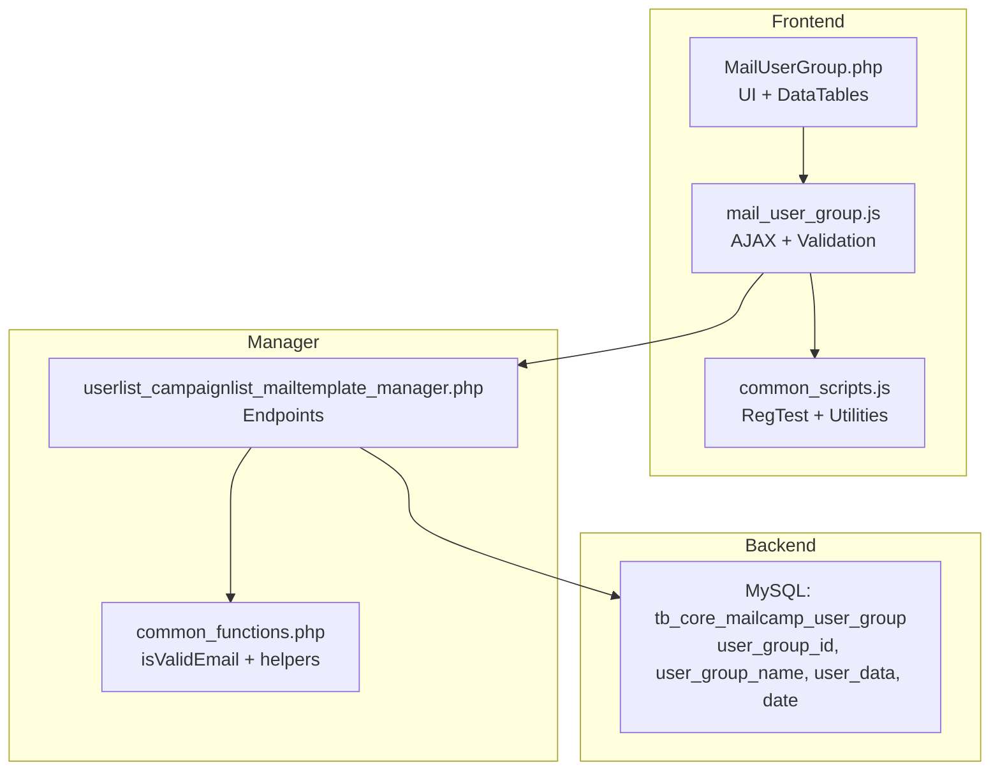
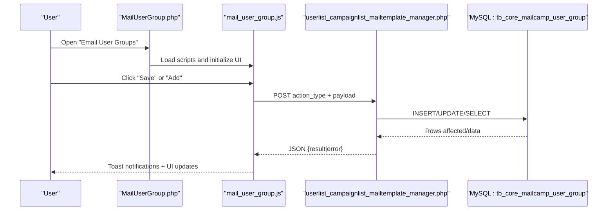
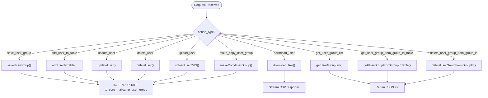
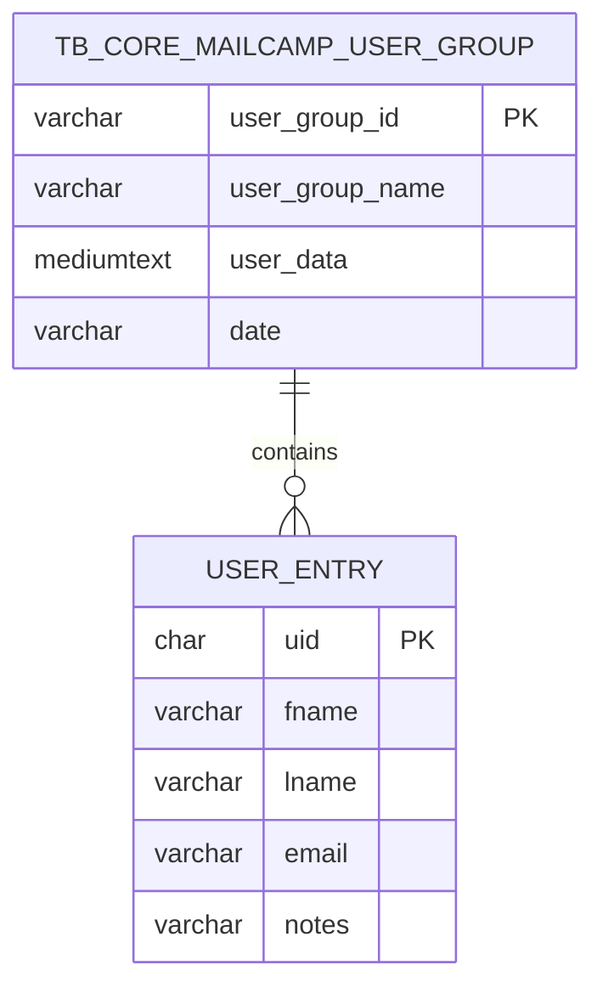
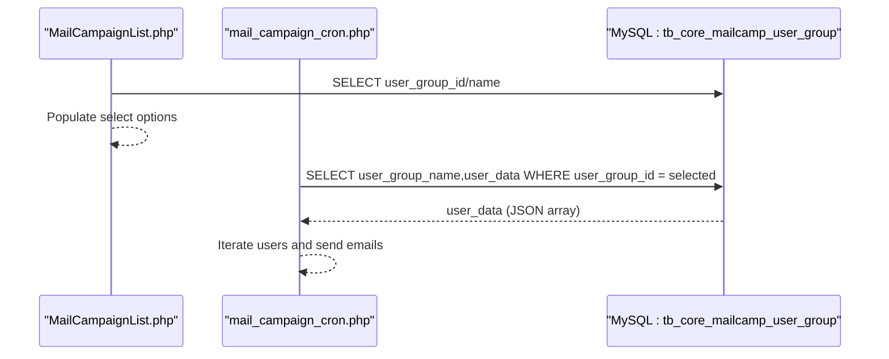
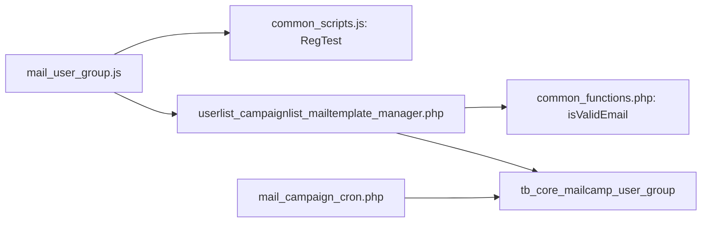

# User Groups Management

<cite>
**Referenced Files in This Document**
- [MailUserGroup.php](file://spear/MailUserGroup.php)
- [mail_user_group.js](file://spear/js/mail_user_group.js)
- [userlist_campaignlist_mailtemplate_manager.php](file://spear/manager/userlist_campaignlist_mailtemplate_manager.php)
- [common_scripts.js](file://spear/js/common_scripts.js)
- [common_functions.php](file://spear/manager/common_functions.php)
- [MailCampaignList.php](file://spear/MailCampaignList.php)
- [mail_campaign_cron.php](file://spear/core/mail_campaign_cron.php)
- [install_manager.php](file://install_manager.php)
</cite>

## Table of Contents
1. [Introduction](#introduction)
2. [Project Structure](#project-structure)
3. [Core Components](#core-components)
4. [Architecture Overview](#architecture-overview)
5. [Detailed Component Analysis](#detailed-component-analysis)
6. [Dependency Analysis](#dependency-analysis)
7. [Performance Considerations](#performance-considerations)
8. [Troubleshooting Guide](#troubleshooting-guide)
9. [Conclusion](#conclusion)

## Introduction
This document explains the user groups management system used to create, organize, and manage email recipient lists. It covers the backend PHP implementation for user group creation, persistence, import/export, and the frontend JavaScript interactions for dynamic table operations, modal dialogs, and bulk actions. It also documents user data fields (first name, last name, email, notes), validation rules, and how user groups integrate with email campaign creation and execution.

## Project Structure
The user groups feature spans three layers:
- Frontend: HTML/JS for user interface and interactions
- Manager: PHP service endpoints handling CRUD and import/export
- Backend storage: MySQL table storing user group metadata and serialized user records

**Diagram sources**
- [MailUserGroup.php:1-356](file://spear/MailUserGroup.php#L1-L356)
- [mail_user_group.js:1-431](file://spear/js/mail_user_group.js#L1-L431)
- [userlist_campaignlist_mailtemplate_manager.php:1-709](file://spear/manager/userlist_campaignlist_mailtemplate_manager.php#L1-L709)
- [common_functions.php:460-469](file://spear/manager/common_functions.php#L460-L469)
- [install_manager.php:289-294](file://install_manager.php#L289-L294)

**Section sources**
- [MailUserGroup.php:1-356](file://spear/MailUserGroup.php#L1-L356)
- [mail_user_group.js:1-431](file://spear/js/mail_user_group.js#L1-L431)
- [userlist_campaignlist_mailtemplate_manager.php:1-709](file://spear/manager/userlist_campaignlist_mailtemplate_manager.php#L1-L709)
- [common_functions.php:460-469](file://spear/manager/common_functions.php#L460-L469)
- [install_manager.php:289-294](file://install_manager.php#L289-L294)

## Core Components
- User group UI and forms: [MailUserGroup.php:71-206](file://spear/MailUserGroup.php#L71-L206)
- Frontend interactions and AJAX: [mail_user_group.js:1-431](file://spear/js/mail_user_group.js#L1-L431)
- Backend endpoints and persistence: [userlist_campaignlist_mailtemplate_manager.php:17-77](file://spear/manager/userlist_campaignlist_mailtemplate_manager.php#L17-L77)
- Validation utilities: [common_scripts.js:230-240](file://spear/js/common_scripts.js#L230-L240), [common_functions.php:460-469](file://spear/manager/common_functions.php#L460-L469)
- Campaign integration: [MailCampaignList.php:133-139](file://spear/MailCampaignList.php#L133-L139), [mail_campaign_cron.php:118-119](file://spear/core/mail_campaign_cron.php#L118-L119)

Key responsibilities:
- Create/update user groups and individual user entries
- Import users via CSV/TXT/LST/RTF
- Export user lists as CSV
- Duplicate user groups
- Select user groups during campaign creation and execution

**Section sources**
- [MailUserGroup.php:71-206](file://spear/MailUserGroup.php#L71-L206)
- [mail_user_group.js:240-383](file://spear/js/mail_user_group.js#L240-L383)
- [userlist_campaignlist_mailtemplate_manager.php:80-332](file://spear/manager/userlist_campaignlist_mailtemplate_manager.php#L80-L332)
- [MailCampaignList.php:133-139](file://spear/MailCampaignList.php#L133-L139)
- [mail_campaign_cron.php:118-119](file://spear/core/mail_campaign_cron.php#L118-L119)

## Architecture Overview
The system uses a client-server model:
- The UI posts actions to the manager endpoint
- The manager validates inputs, persists data, and returns structured JSON responses
- The campaign engine reads persisted user groups during email delivery

**Diagram sources**
- [MailUserGroup.php:324-354](file://spear/MailUserGroup.php#L324-L354)
- [mail_user_group.js:77-98](file://spear/js/mail_user_group.js#L77-L98)
- [userlist_campaignlist_mailtemplate_manager.php:17-77](file://spear/manager/userlist_campaignlist_mailtemplate_manager.php#L17-L77)
- [install_manager.php:289-294](file://install_manager.php#L289-L294)

## Detailed Component Analysis

### Backend: User Group Persistence and Operations
The manager endpoint routes requests to dedicated handlers. It supports:
- Saving a user group (create/update)
- Adding a single user to a group
- Updating/deleting a user
- Uploading CSV/TXT/LST/RTF
- Exporting CSV
- Listing groups and paginated user tables
- Deleting a group and copying a group

Implementation highlights:
- Data persistence uses a MySQL table with a serialized JSON field for user records
- Duplicate detection during import merges arrays and relies on unique identifiers
- Email validation uses a robust regex and filter function

**Diagram sources**
- [userlist_campaignlist_mailtemplate_manager.php:17-77](file://spear/manager/userlist_campaignlist_mailtemplate_manager.php#L17-L77)
- [userlist_campaignlist_mailtemplate_manager.php:112-126](file://spear/manager/userlist_campaignlist_mailtemplate_manager.php#L112-L126)
- [userlist_campaignlist_mailtemplate_manager.php:80-110](file://spear/manager/userlist_campaignlist_mailtemplate_manager.php#L80-L110)
- [userlist_campaignlist_mailtemplate_manager.php:223-267](file://spear/manager/userlist_campaignlist_mailtemplate_manager.php#L223-L267)
- [userlist_campaignlist_mailtemplate_manager.php:181-205](file://spear/manager/userlist_campaignlist_mailtemplate_manager.php#L181-L205)
- [userlist_campaignlist_mailtemplate_manager.php:207-221](file://spear/manager/userlist_campaignlist_mailtemplate_manager.php#L207-L221)
- [userlist_campaignlist_mailtemplate_manager.php:269-309](file://spear/manager/userlist_campaignlist_mailtemplate_manager.php#L269-L309)
- [userlist_campaignlist_mailtemplate_manager.php:311-320](file://spear/manager/userlist_campaignlist_mailtemplate_manager.php#L311-L320)
- [userlist_campaignlist_mailtemplate_manager.php:322-332](file://spear/manager/userlist_campaignlist_mailtemplate_manager.php#L322-L332)

**Section sources**
- [userlist_campaignlist_mailtemplate_manager.php:17-77](file://spear/manager/userlist_campaignlist_mailtemplate_manager.php#L17-L77)
- [userlist_campaignlist_mailtemplate_manager.php:80-332](file://spear/manager/userlist_campaignlist_mailtemplate_manager.php#L80-L332)
- [install_manager.php:289-294](file://install_manager.php#L289-L294)

### Frontend: Dynamic UI and Interactions
The frontend script manages:
- Form validation using RegTest patterns
- DataTable initialization for server-side pagination
- Modal dialogs for editing/deleting/copying
- File selection and CSV parsing
- AJAX calls to manager endpoints
- Navigation prevention for unsaved edits

Key flows:
- Save user group: [saveUserGroup:240-267](file://spear/js/mail_user_group.js#L240-L267)
- Add user: [addUserToTable:51-98](file://spear/js/mail_user_group.js#L51-L98)
- Edit user: [editRow:129-137](file://spear/js/mail_user_group.js#L129-L137), [editRowAction:139-181](file://spear/js/mail_user_group.js#L139-L181)
- Delete user: [deleteRow:100-103](file://spear/js/mail_user_group.js#L100-L103), [deleteRowAction:105-127](file://spear/js/mail_user_group.js#L105-L127)
- Import users: [addUserFromFile:183-192](file://spear/js/mail_user_group.js#L183-L192), [FileReader:194-238](file://spear/js/mail_user_group.js#L194-L238)
- Export users: [exportUserAction:24-49](file://spear/js/mail_user_group.js#L24-L49)
- Load user table: [getUserGroupFromGroupId:269-320](file://spear/js/mail_user_group.js#L269-L320)
- Copy group: [promptUserGroupCopy:350-353](file://spear/js/mail_user_group.js#L350-L353), [UserGroupCopy:355-383](file://spear/js/mail_user_group.js#L355-L383)
- Delete group: [promptUserGroupDeletion:324-327](file://spear/js/mail_user_group.js#L324-L327), [userGroupDeletionAction:329-348](file://spear/js/mail_user_group.js#L329-L348)

Validation patterns:
- COMMON: [RegTest COMMON:235-236](file://spear/js/common_scripts.js#L235-L236)
- EMAIL: [RegTest EMAIL:237-237](file://spear/js/common_scripts.js#L237-L237)

**Section sources**
- [mail_user_group.js:1-431](file://spear/js/mail_user_group.js#L1-L431)
- [common_scripts.js:230-240](file://spear/js/common_scripts.js#L230-L240)

### Data Model and Fields
The user group table stores:
- user_group_id: Unique identifier
- user_group_name: Display name
- user_data: Serialized JSON array of users
- date: Creation timestamp

Each user record includes:
- uid: Unique per-user identifier
- fname: First name
- lname: Last name
- email: Email address
- notes: Optional notes

**Diagram sources**
- [install_manager.php:289-294](file://install_manager.php#L289-L294)
- [userlist_campaignlist_mailtemplate_manager.php:80-110](file://spear/manager/userlist_campaignlist_mailtemplate_manager.php#L80-L110)

**Section sources**
- [install_manager.php:289-294](file://install_manager.php#L289-L294)
- [userlist_campaignlist_mailtemplate_manager.php:80-110](file://spear/manager/userlist_campaignlist_mailtemplate_manager.php#L80-L110)

### Campaign Integration
User groups are selectable during campaign creation and consumed by the campaign engine:
- Selection UI: [MailCampaignList.php:133-139](file://spear/MailCampaignList.php#L133-L139)
- Campaign runtime retrieval: [mail_campaign_cron.php:118-119](file://spear/core/mail_campaign_cron.php#L118-L119)

**Diagram sources**
- [MailCampaignList.php:133-139](file://spear/MailCampaignList.php#L133-L139)
- [mail_campaign_cron.php:118-119](file://spear/core/mail_campaign_cron.php#L118-L119)
- [install_manager.php:289-294](file://install_manager.php#L289-L294)

**Section sources**
- [MailCampaignList.php:133-139](file://spear/MailCampaignList.php#L133-L139)
- [mail_campaign_cron.php:118-119](file://spear/core/mail_campaign_cron.php#L118-L119)

## Dependency Analysis
- Frontend depends on:
  - RegTest for validation: [RegTest:230-240](file://spear/js/common_scripts.js#L230-L240)
  - DataTables for server-side rendering: [getUserGroupFromGroupId:269-320](file://spear/js/mail_user_group.js#L269-L320)
- Manager depends on:
  - isValidEmail for import validation: [isValidEmail:460-469](file://spear/manager/common_functions.php#L460-L469)
  - Database schema: [install_manager.php:289-294](file://install_manager.php#L289-L294)
- Campaign engine depends on:
  - User group retrieval: [mail_campaign_cron.php:118-119](file://spear/core/mail_campaign_cron.php#L118-L119)

**Diagram sources**
- [mail_user_group.js:269-320](file://spear/js/mail_user_group.js#L269-L320)
- [common_scripts.js:230-240](file://spear/js/common_scripts.js#L230-L240)
- [userlist_campaignlist_mailtemplate_manager.php:223-267](file://spear/manager/userlist_campaignlist_mailtemplate_manager.php#L223-L267)
- [common_functions.php:460-469](file://spear/manager/common_functions.php#L460-L469)
- [install_manager.php:289-294](file://install_manager.php#L289-L294)
- [mail_campaign_cron.php:118-119](file://spear/core/mail_campaign_cron.php#L118-L119)

**Section sources**
- [mail_user_group.js:269-320](file://spear/js/mail_user_group.js#L269-L320)
- [userlist_campaignlist_mailtemplate_manager.php:223-267](file://spear/manager/userlist_campaignlist_mailtemplate_manager.php#L223-L267)
- [common_functions.php:460-469](file://spear/manager/common_functions.php#L460-L469)
- [mail_campaign_cron.php:118-119](file://spear/core/mail_campaign_cron.php#L118-L119)

## Performance Considerations
- Server-side DataTables: The user table uses server-side processing to handle large datasets efficiently. See [getUserGroupFromGroupId:269-320](file://spear/js/mail_user_group.js#L269-L320).
- Serialization overhead: user_data is stored as JSON; consider indexing or partitioning if groups grow very large.
- Import batching: For large CSV files, consider chunked processing on the server to avoid timeouts.
- Validation cost: Email validation occurs on both client and server; keep patterns efficient and avoid excessive reflows.

[No sources needed since this section provides general guidance]

## Troubleshooting Guide
Common issues and resolutions:
- Email format validation failures
  - Symptom: Red input border and error toast when adding/editing users.
  - Cause: Non-compliant email format.
  - Resolution: Ensure the email matches the EMAIL pattern used by RegTest and isValidEmail.
  - References: [RegTest EMAIL:237-237](file://spear/js/common_scripts.js#L237-L237), [isValidEmail:460-469](file://spear/manager/common_functions.php#L460-L469)

- Duplicate entries during import
  - Behavior: Import merges arrays and deduplicates using array_unique.
  - Reference: [addUserToTable:94-94](file://spear/manager/userlist_campaignlist_mailtemplate_manager.php#L94-L94)
  - Tip: Ensure unique identifiers are generated per row.

- Unsupported file type during import
  - Symptom: Error toast indicating unsupported file type.
  - Cause: File extension not in accepted list.
  - Resolution: Use .csv, .txt, .lst, or .rtf.
  - Reference: [FileReader handler:204-208](file://spear/js/mail_user_group.js#L204-L208)

- Empty/invalid group name
  - Symptom: Validation error for group name.
  - Cause: COMMON pattern mismatch.
  - Resolution: Provide a valid group name.
  - References: [RegTest COMMON:235-236](file://spear/js/common_scripts.js#L235-L236), [saveUserGroup:240-247](file://spear/js/mail_user_group.js#L240-L247)

- Export fails
  - Symptom: Error toast when exporting.
  - Cause: Group not found or empty user_data.
  - Resolution: Verify group exists and contains users.
  - Reference: [downloadUser:181-205](file://spear/manager/userlist_campaignlist_mailtemplate_manager.php#L181-L205)

- Navigation prevented
  - Behavior: Confirmation dialog appears when leaving unsaved edits.
  - Mechanism: onbeforeunload with g_deny_navigation.
  - Reference: [common_scripts.js:243-245](file://spear/js/common_scripts.js#L243-L245)

**Section sources**
- [mail_user_group.js:51-98](file://spear/js/mail_user_group.js#L51-L98)
- [common_scripts.js:230-240](file://spear/js/common_scripts.js#L230-L240)
- [userlist_campaignlist_mailtemplate_manager.php:80-110](file://spear/manager/userlist_campaignlist_mailtemplate_manager.php#L80-L110)
- [common_functions.php:460-469](file://spear/manager/common_functions.php#L460-L469)

## Conclusion
The user groups management system provides a robust foundation for building and maintaining email recipient lists. It combines a clean frontend UI with server-side validation and persistence, enabling efficient import/export, duplication, and seamless integration with email campaigns. By following the validation rules and understanding the data model, administrators can reliably manage large recipient sets and automate targeted email campaigns.