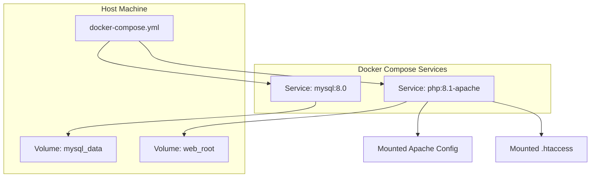
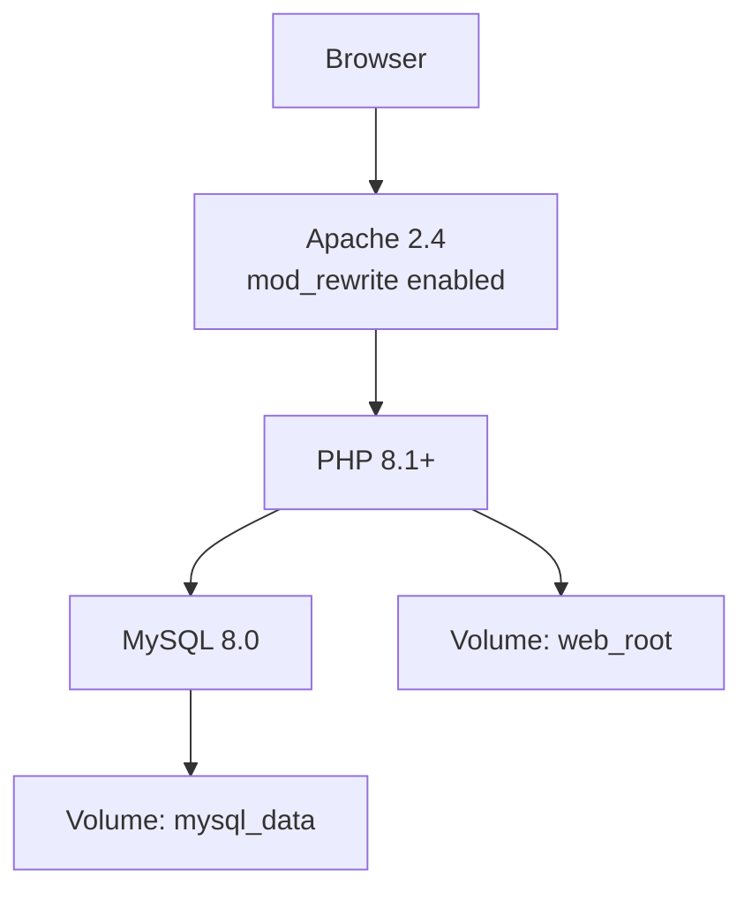
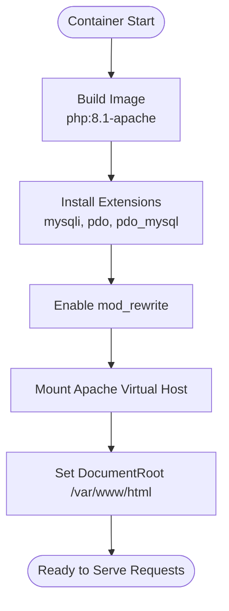
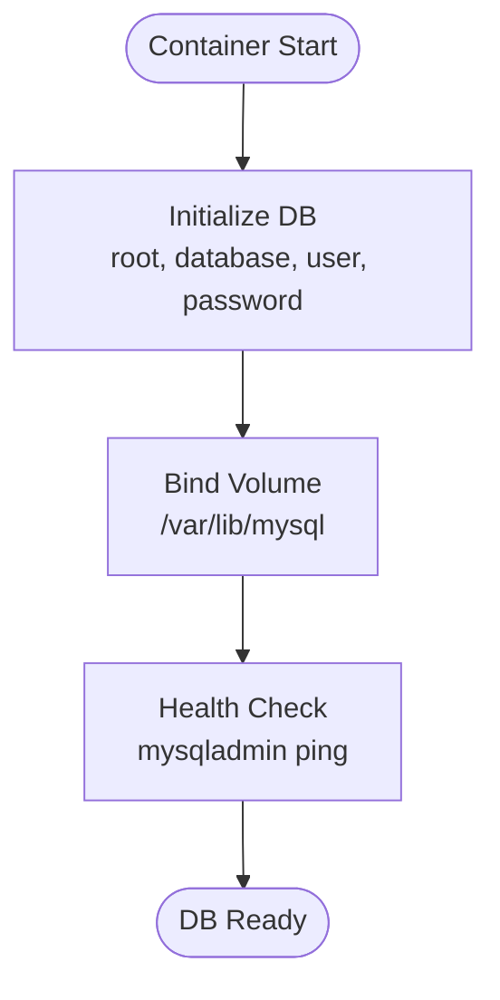
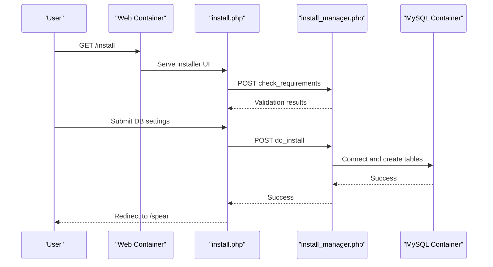
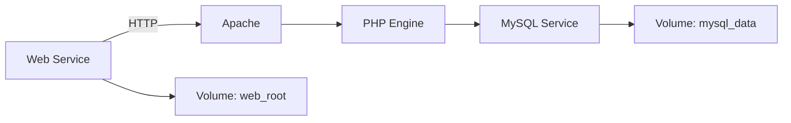

# Docker Deployment

<cite>
**Referenced Files in This Document**
- [Dockerfile](file://docker/Dockerfile)
- [docker-compose.yml](file://docker-compose.yml)
- [apache.conf](file://docker/apache.conf)
- [.htaccess](file://.htaccess)
- [README.md](file://README.md)
- [install.php](file://install.php)
- [install_manager.php](file://install_manager.php)
- [common_functions.php](file://spear/manager/common_functions.php)
</cite>

## Table of Contents
1. [Introduction](#introduction)
2. [Project Structure](#project-structure)
3. [Core Components](#core-components)
4. [Architecture Overview](#architecture-overview)
5. [Detailed Component Analysis](#detailed-component-analysis)
6. [Dependency Analysis](#dependency-analysis)
7. [Performance Considerations](#performance-considerations)
8. [Troubleshooting Guide](#troubleshooting-guide)
9. [Conclusion](#conclusion)
10. [Appendices](#appendices)

## Introduction
This document provides a complete guide to deploying SniperPhish using Docker and docker-compose. It covers the containerized installation, including the Dockerfile configuration, Apache virtual host setup, URL rewriting rules, service orchestration, environment variables, networking, persistence, and operational procedures such as backups, updates, and troubleshooting. It also includes production-focused recommendations for resource allocation, security, and monitoring.

## Project Structure
The repository includes:
- A Dockerfile that builds a PHP 8.1 Apache image with required PHP extensions and enables URL rewriting.
- A docker-compose.yml that orchestrates two services: a MySQL 8.0 database and a PHP/Apache web application, with persistent volumes and health checks.
- An Apache virtual host configuration mounted into the web container.
- A .htaccess file enabling URL rewriting to remove .php extensions.
- Application entry points for installation and runtime logic.

**Diagram sources**
- [docker-compose.yml:1-38](file://docker-compose.yml#L1-L38)
- [Dockerfile:1-10](file://docker/Dockerfile#L1-L10)
- [apache.conf:1-13](file://docker/apache.conf#L1-L13)
- [.htaccess:1-5](file://.htaccess#L1-L5)

**Section sources**
- [docker-compose.yml:1-38](file://docker-compose.yml#L1-L38)
- [Dockerfile:1-10](file://docker/Dockerfile#L1-L10)
- [apache.conf:1-13](file://docker/apache.conf#L1-L13)
- [.htaccess:1-5](file://.htaccess#L1-L5)

## Core Components
- Web application container (php:8.1-apache)
  - Installs required PHP extensions (mysqli, pdo, pdo_mysql).
  - Enables Apache mod_rewrite for friendly URLs.
  - Mounts application code and Apache virtual host configuration.
  - Exposes port 80 and sets APACHE_DOCUMENT_ROOT via environment.
- Database container (mysql:8.0)
  - Initializes with root password, database name, and credentials.
  - Persists data under a named volume.
  - Health checks via mysqladmin ping.
- Orchestration (docker-compose)
  - Defines two services, their dependencies, port mappings, and volumes.
  - Ensures the web service starts only after the database is healthy.

Key configuration highlights:
- PHP 8.1+ and required extensions are installed in the web image.
- Apache rewrite engine is enabled and a virtual host is mounted to support clean URLs.
- URL rewriting rules are defined in .htaccess to remove .php extensions.

**Section sources**
- [Dockerfile:1-10](file://docker/Dockerfile#L1-L10)
- [docker-compose.yml:21-34](file://docker-compose.yml#L21-L34)
- [apache.conf:1-13](file://docker/apache.conf#L1-L13)
- [.htaccess:1-5](file://.htaccess#L1-L5)

## Architecture Overview
The deployment consists of two primary containers orchestrated by docker-compose:
- MySQL 8.0 container storing application data.
- PHP/Apache container serving the SniperPhish web interface and handling requests.

**Diagram sources**
- [docker-compose.yml:3-38](file://docker-compose.yml#L3-L38)
- [Dockerfile:1-10](file://docker/Dockerfile#L1-L10)
- [apache.conf:1-13](file://docker/apache.conf#L1-L13)

## Detailed Component Analysis

### Web Application Container (PHP/Apache)
- Base image and extensions
  - Uses php:8.1-apache.
  - Installs mysqli, pdo, pdo_mysql.
- Apache configuration
  - Enables mod_rewrite.
  - Virtual host mounts the default site configuration.
  - Sets DocumentRoot to /var/www/html.
- URL rewriting
  - .htaccess enables RewriteEngine and rewrites paths to append .php when appropriate.

**Diagram sources**
- [Dockerfile:1-10](file://docker/Dockerfile#L1-L10)
- [docker-compose.yml:21-34](file://docker-compose.yml#L21-L34)
- [apache.conf:1-13](file://docker/apache.conf#L1-L13)
- [.htaccess:1-5](file://.htaccess#L1-L5)

**Section sources**
- [Dockerfile:1-10](file://docker/Dockerfile#L1-L10)
- [docker-compose.yml:21-34](file://docker-compose.yml#L21-L34)
- [apache.conf:1-13](file://docker/apache.conf#L1-L13)
- [.htaccess:1-5](file://.htaccess#L1-L5)

### Database Container (MySQL 8.0)
- Initialization
  - Sets root password, database name, and user credentials.
- Persistence
  - Mounts a named volume for data directory (/var/lib/mysql).
- Health checking
  - Uses mysqladmin ping to verify readiness.

**Diagram sources**
- [docker-compose.yml:4-19](file://docker-compose.yml#L4-L19)

**Section sources**
- [docker-compose.yml:4-19](file://docker-compose.yml#L4-L19)

### Installation and Runtime Flow
- Initial setup
  - Access the installation wizard at /install.
  - The installer validates PHP version and extensions, and checks write permissions.
  - It writes database credentials to a config file and creates tables.
- Post-installation
  - The application reads server variables and redirects to the login page.

**Diagram sources**
- [install.php:144-229](file://install.php#L144-L229)
- [install_manager.php:22-87](file://install_manager.php#L22-L87)
- [install_manager.php:110-162](file://install_manager.php#L110-L162)
- [docker-compose.yml:31-34](file://docker-compose.yml#L31-L34)

**Section sources**
- [README.md:19-24](file://README.md#L19-L24)
- [install.php:144-229](file://install.php#L144-L229)
- [install_manager.php:22-87](file://install_manager.php#L22-L87)
- [install_manager.php:110-162](file://install_manager.php#L110-L162)
- [common_functions.php:8-20](file://spear/manager/common_functions.php#L8-L20)

## Dependency Analysis
- Service dependencies
  - The web service depends on the database being healthy before starting.
- Network and ports
  - Web service exposes port 80 on the host.
  - Database service exposes port 3306 on the host.
- Volumes
  - mysql_data persists MySQL data.
  - The application code is mounted into the web container.

**Diagram sources**
- [docker-compose.yml:21-38](file://docker-compose.yml#L21-L38)

**Section sources**
- [docker-compose.yml:21-38](file://docker-compose.yml#L21-L38)

## Performance Considerations
- Apache and PHP tuning
  - Adjust Apache MaxRequestWorkers and KeepAlive settings in the mounted Apache config for concurrent connections.
  - Tune PHP-FPM settings (when applicable) or increase Apache worker limits for CPU-bound workloads.
- Database performance
  - Use MySQL 8.0’s performance schema and slow query log inside the container for diagnostics.
  - Allocate sufficient memory to the MySQL container for buffer pool sizing.
- Static assets
  - Ensure static resources are served efficiently by Apache; leverage caching headers via Apache configuration.
- Resource limits
  - Set CPU and memory limits in docker-compose for both services to prevent resource contention.

[No sources needed since this section provides general guidance]

## Troubleshooting Guide
- Container logs
  - Inspect Apache error and access logs inside the web container.
  - View MySQL logs via container logs to diagnose connection issues.
- Network connectivity
  - Verify the web container can reach the database container by hostname and port.
  - Confirm port mappings on the host (80 for web, 3306 for MySQL).
- Volume permissions
  - Ensure the web container has read/write access to mounted directories.
  - Confirm the MySQL data directory ownership and permissions inside the mysql_data volume.
- Installation failures
  - Review the installer’s validation messages and fix missing PHP extensions or write permissions.
  - Confirm the database credentials and that the database is healthy before installing.

**Section sources**
- [docker-compose.yml:16-19](file://docker-compose.yml#L16-L19)
- [install_manager.php:22-87](file://install_manager.php#L22-L87)

## Conclusion
This Docker deployment provides a reproducible, containerized setup for SniperPhish using PHP 8.1+ and Apache with MySQL 8.0. By leveraging docker-compose, you gain predictable service orchestration, persistence, and health checks. Follow the step-by-step deployment and troubleshooting guidance to operate reliably in development and production environments.

[No sources needed since this section summarizes without analyzing specific files]

## Appendices

### Step-by-Step Deployment Instructions
- Prerequisites
  - Install Docker and docker-compose on the target host.
- Build and start services
  - Run the compose stack to build the web image and start both containers.
- Initial configuration
  - Open the installation wizard in a browser and follow the prompts to configure database settings and initialize the schema.
- Access the application
  - Navigate to the login page after installation completes.

**Section sources**
- [README.md:19-24](file://README.md#L19-L24)
- [docker-compose.yml:21-34](file://docker-compose.yml#L21-L34)

### Environment Variables and Configuration
- Web service
  - APACHE_DOCUMENT_ROOT controls the Apache DocumentRoot.
  - Mounted Apache virtual host overrides default site configuration.
- Database service
  - MYSQL_ROOT_PASSWORD, MYSQL_DATABASE, MYSQL_USER, MYSQL_PASSWORD define database initialization.

**Section sources**
- [docker-compose.yml:29-34](file://docker-compose.yml#L29-L34)
- [docker-compose.yml:7-11](file://docker-compose.yml#L7-L11)

### Networking and Port Mapping
- Web service
  - Host port 80 mapped to container port 80.
- Database service
  - Host port 3306 mapped to container port 3306.

**Section sources**
- [docker-compose.yml:24-25](file://docker-compose.yml#L24-L25)
- [docker-compose.yml:12-13](file://docker-compose.yml#L12-L13)

### Volume Management and Backups
- Persistent volumes
  - mysql_data stores MySQL data.
  - The application code is mounted into the web container.
- Backup strategy
  - Back up the mysql_data volume regularly.
  - Snapshot or export the web root mount for application code backups.

**Section sources**
- [docker-compose.yml:14-15](file://docker-compose.yml#L14-L15)
- [docker-compose.yml:26-28](file://docker-compose.yml#L26-L28)

### Security Hardening Checklist
- Network
  - Restrict external access to ports 80 and 3306 using firewall rules.
- Secrets
  - Replace default database credentials with strong passwords.
- Apache
  - Add security headers and disable unnecessary modules in the mounted Apache config.
- PHP
  - Disable risky functions and set appropriate PHP ini directives in the web container.
- Updates
  - Regularly update base images and review security advisories.

[No sources needed since this section provides general guidance]