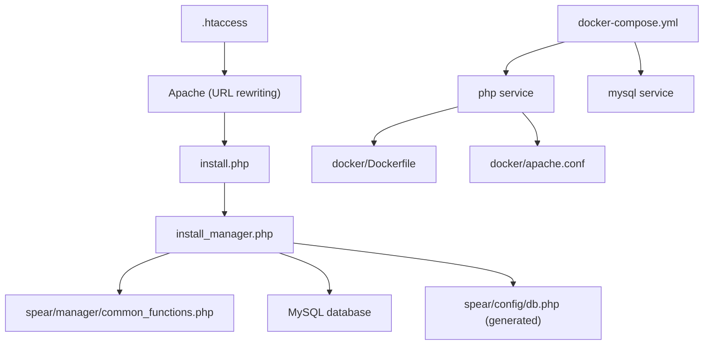
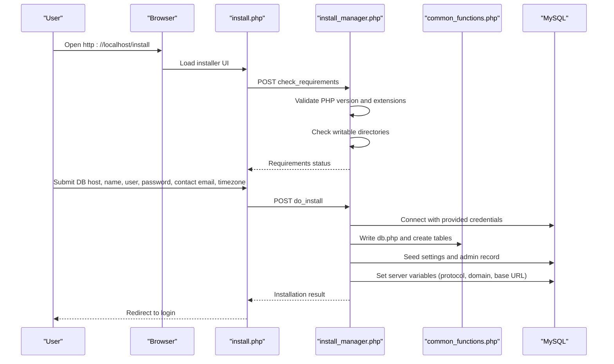
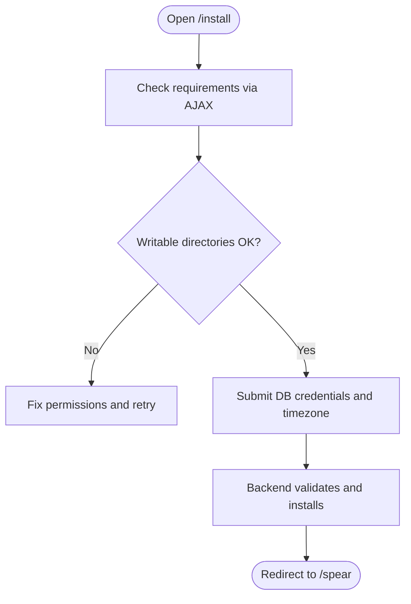
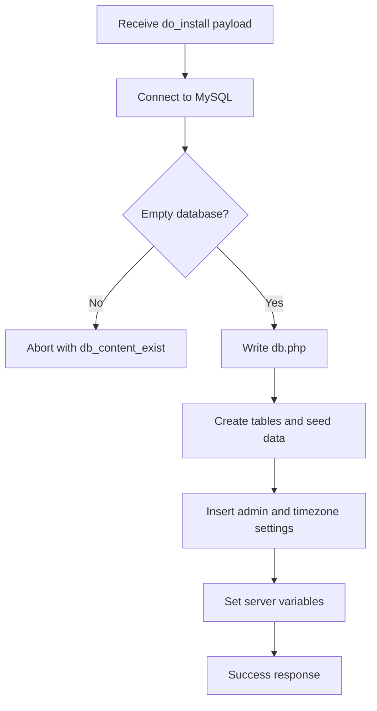
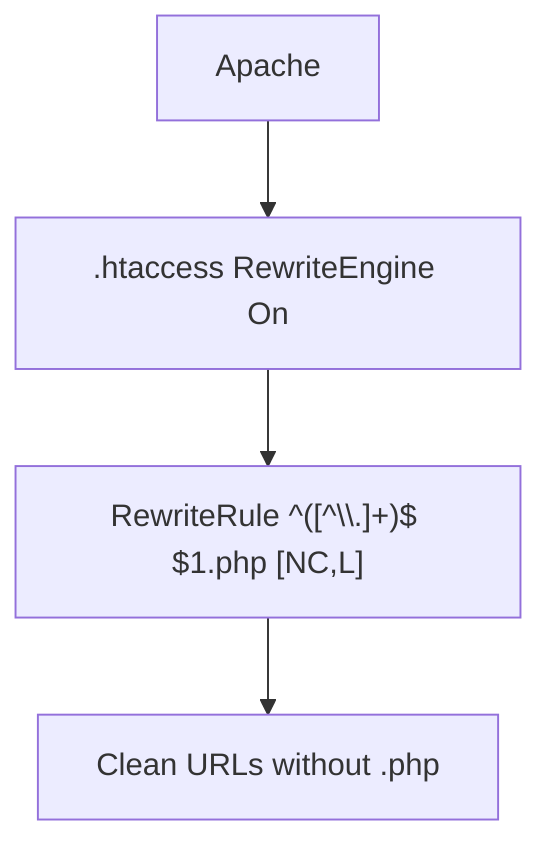
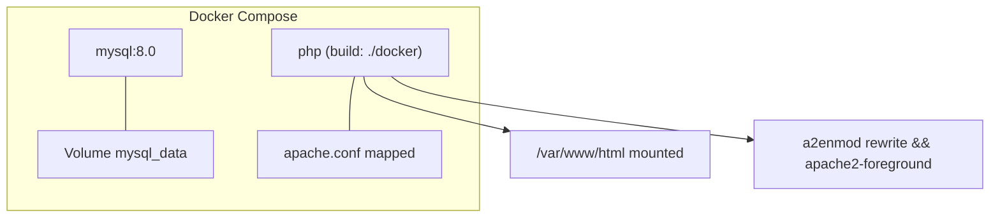
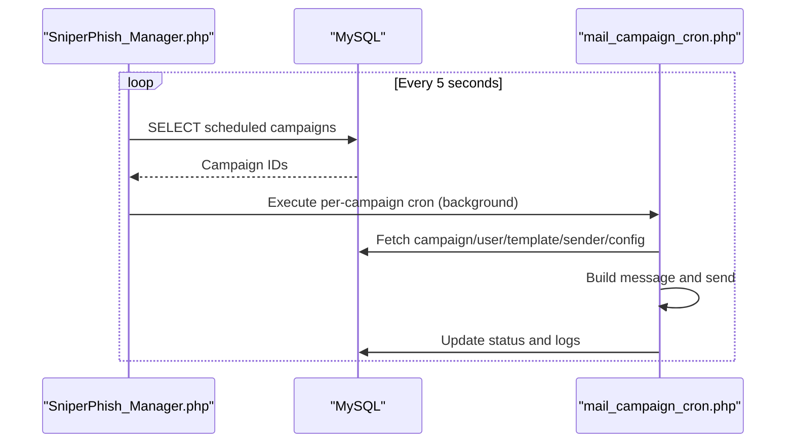
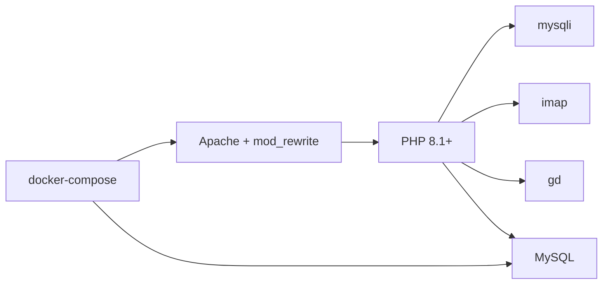

# Installation and Setup

<cite>
**Referenced Files in This Document**
- [README.md](file://README.md)
- [install.php](file://install.php)
- [install_manager.php](file://install_manager.php)
- [.htaccess](file://.htaccess)
- [docker/Dockerfile](file://docker/Dockerfile)
- [docker-compose.yml](file://docker-compose.yml)
- [docker/apache.conf](file://docker/apache.conf)
- [spear/manager/common_functions.php](file://spear/manager/common_functions.php)
- [spear/core/SniperPhish_Manager.php](file://spear/core/SniperPhish_Manager.php)
- [spear/core/mail_campaign_cron.php](file://spear/core/mail_campaign_cron.php)
</cite>

## Table of Contents
1. [Introduction](#introduction)
2. [Project Structure](#project-structure)
3. [Core Components](#core-components)
4. [Architecture Overview](#architecture-overview)
5. [Detailed Component Analysis](#detailed-component-analysis)
6. [Dependency Analysis](#dependency-analysis)
7. [Performance Considerations](#performance-considerations)
8. [Troubleshooting Guide](#troubleshooting-guide)
9. [Conclusion](#conclusion)
10. [Appendices](#appendices)

## Introduction
This document provides comprehensive installation and setup guidance for SniperPhish. It covers system requirements, manual installation from repository cloning to database configuration and initial admin setup, the automated installation wizard, Docker deployment with Apache optimization and docker-compose, troubleshooting common issues, verification steps, and security considerations for production readiness.

## Project Structure
SniperPhish is a PHP-based web application with a modular frontend under the spear directory and a dedicated installer and configuration logic. The repository includes:
- Web installer and backend logic for installation
- Docker assets for containerized deployment
- Apache configuration for containerized environments
- Core cron and mail campaign logic
- Shared utilities and database configuration placeholders

**Diagram sources**
- [install.php:1-451](file://install.php#L1-L451)
- [install_manager.php:1-784](file://install_manager.php#L1-L784)
- [.htaccess:1-5](file://.htaccess#L1-L5)
- [docker-compose.yml:1-38](file://docker-compose.yml#L1-L38)
- [docker/Dockerfile:1-10](file://docker/Dockerfile#L1-L10)
- [docker/apache.conf:1-13](file://docker/apache.conf#L1-L13)

**Section sources**
- [README.md:14-25](file://README.md#L14-L25)
- [docker-compose.yml:1-38](file://docker-compose.yml#L1-L38)

## Core Components
- Installer front-end: A browser-based wizard that checks requirements and collects database credentials to initialize the system.
- Installer back-end: Validates PHP and extensions, checks filesystem permissions, writes database configuration, creates tables, seeds initial settings, and sets server variables.
- Web server requirements: Apache with mod_rewrite and .htaccess support to remove .php suffixes from URLs.
- Docker stack: Provides a ready-to-use Apache + PHP 8.1 with mysqli and PDO MySQL extensions plus MySQL 8.0.
- Cron and mail campaign engine: Background processes for scheduling and sending campaigns.

Key responsibilities:
- Requirement validation and permission checks
- Database initialization and seeding
- Initial admin account creation
- Server variable population for base URL and protocol
- Containerized deployment with optimized Apache configuration

**Section sources**
- [install.php:62-115](file://install.php#L62-L115)
- [install_manager.php:22-87](file://install_manager.php#L22-L87)
- [install_manager.php:110-162](file://install_manager.php#L110-L162)
- [spear/manager/common_functions.php:8-20](file://spear/manager/common_functions.php#L8-L20)
- [docker/Dockerfile:1-10](file://docker/Dockerfile#L1-L10)
- [docker-compose.yml:21-34](file://docker-compose.yml#L21-L34)

## Architecture Overview
The installation flow integrates a browser-based UI with a PHP backend that performs checks, writes configuration, initializes the database, and seeds default data. Docker deployment encapsulates Apache, PHP, and MySQL with an optimized Apache virtual host configuration.

**Diagram sources**
- [install.php:144-229](file://install.php#L144-L229)
- [install_manager.php:14-19](file://install_manager.php#L14-L19)
- [install_manager.php:22-87](file://install_manager.php#L22-L87)
- [install_manager.php:110-162](file://install_manager.php#L110-L162)
- [spear/manager/common_functions.php:8-20](file://spear/manager/common_functions.php#L8-L20)

## Detailed Component Analysis

### Manual Installation Wizard
The wizard performs:
- Requirements check: PHP version, mysqli, imap, gd, OS-dependent process commands, and writable directories.
- Permission reporting: Lists directories requiring write access.
- Submission handling: Sends DB credentials, contact email, and timezone to the backend.
- Force re-installation: Prompts to drop existing tables when installing into a non-empty database.

**Diagram sources**
- [install.php:144-186](file://install.php#L144-L186)
- [install.php:188-229](file://install.php#L188-L229)
- [install_manager.php:22-87](file://install_manager.php#L22-L87)

**Section sources**
- [install.php:48-115](file://install.php#L48-L115)
- [install_manager.php:22-87](file://install_manager.php#L22-L87)

### Backend Installation Logic
The backend:
- Verifies installation state and prevents duplicate runs.
- Establishes a MySQL connection using provided credentials.
- Writes the database configuration file.
- Creates tables and seeds default data.
- Inserts initial admin account and timezone settings.
- Sets server variables (protocol, domain, base URL) based on the current request.

**Diagram sources**
- [install_manager.php:110-162](file://install_manager.php#L110-L162)
- [install_manager.php:180-782](file://install_manager.php#L180-L782)
- [spear/manager/common_functions.php:177-185](file://spear/manager/common_functions.php#L177-L185)

**Section sources**
- [install_manager.php:110-162](file://install_manager.php#L110-L162)
- [install_manager.php:180-782](file://install_manager.php#L180-L782)
- [spear/manager/common_functions.php:8-20](file://spear/manager/common_functions.php#L8-L20)

### Web Server Requirements and .htaccess
- Apache with mod_rewrite enabled.
- .htaccess removes .php suffixes from URLs for clean routing.
- The installer also detects .htaccess availability and configuration status.

**Diagram sources**
- [.htaccess:1-5](file://.htaccess#L1-L5)
- [install.php:177-184](file://install.php#L177-L184)

**Section sources**
- [.htaccess:1-5](file://.htaccess#L1-L5)
- [install.php:177-184](file://install.php#L177-L184)

### Docker Deployment
The Docker setup provides:
- PHP 8.1 Apache with mysqli and PDO MySQL extensions.
- Apache mod_rewrite enabled.
- MySQL 8.0 with a dedicated service and volume.
- A PHP service mounting the project and overriding Apache’s default site with a configuration that allows .htaccess overrides.

**Diagram sources**
- [docker-compose.yml:1-38](file://docker-compose.yml#L1-L38)
- [docker/Dockerfile:1-10](file://docker/Dockerfile#L1-L10)
- [docker/apache.conf:1-13](file://docker/apache.conf#L1-L13)

**Section sources**
- [docker-compose.yml:1-38](file://docker-compose.yml#L1-L38)
- [docker/Dockerfile:1-10](file://docker/Dockerfile#L1-L10)
- [docker/apache.conf:1-13](file://docker/apache.conf#L1-L13)

### Cron and Mail Campaign Engine
- Single-instance enforcement ensures only one cron process runs.
- The manager periodically checks for scheduled campaigns and spawns per-campaign workers.
- The mail campaign worker fetches campaign data, builds messages, applies anti-flood controls, and updates statuses.

**Diagram sources**
- [spear/core/SniperPhish_Manager.php:10-28](file://spear/core/SniperPhish_Manager.php#L10-L28)
- [spear/core/mail_campaign_cron.php:17-83](file://spear/core/mail_campaign_cron.php#L17-L83)
- [spear/core/mail_campaign_cron.php:325-350](file://spear/core/mail_campaign_cron.php#L325-L350)

**Section sources**
- [spear/core/SniperPhish_Manager.php:10-28](file://spear/core/SniperPhish_Manager.php#L10-L28)
- [spear/core/mail_campaign_cron.php:17-83](file://spear/core/mail_campaign_cron.php#L17-L83)
- [spear/core/mail_campaign_cron.php:325-350](file://spear/core/mail_campaign_cron.php#L325-L350)

## Dependency Analysis
- PHP runtime: Minimum 8.1 with mysqli, imap, and gd extensions.
- MySQL database: Used for storing configuration, campaign data, and logs.
- Apache: Requires mod_rewrite and .htaccess support for URL rewriting.
- Docker: Encapsulates Apache, PHP, and MySQL with preconfigured extensions and virtual host.

**Diagram sources**
- [install_manager.php:28-54](file://install_manager.php#L28-L54)
- [docker/Dockerfile:1-10](file://docker/Dockerfile#L1-L10)
- [docker-compose.yml:1-38](file://docker-compose.yml#L1-L38)

**Section sources**
- [install_manager.php:28-54](file://install_manager.php#L28-L54)
- [docker/Dockerfile:1-10](file://docker/Dockerfile#L1-L10)
- [docker-compose.yml:1-38](file://docker-compose.yml#L1-L38)

## Performance Considerations
- Anti-flood controls: Configurable limits and pause intervals reduce SMTP server load.
- Background processing: Per-campaign mail workers prevent blocking the main manager loop.
- Logging and status updates: Minimal overhead with indexed tables for campaign and live data.

[No sources needed since this section provides general guidance]

## Troubleshooting Guide
Common installation issues and resolutions:
- PHP version or extensions missing
  - Verify PHP 8.1+ and mysqli, imap, gd are loaded.
  - In Docker, the provided image installs mysqli and enables mod_rewrite.
- Directory permissions
  - Ensure write access to spear/config, spear/uploads, and sniperhost directories.
  - The installer reports required writable paths.
- Database connectivity
  - Confirm host, database name, username, and password are correct.
  - Check network accessibility and firewall rules if MySQL is external.
- .htaccess or URL rewriting
  - The installer detects misconfiguration and suggests enabling .htaccess support.
  - In Docker, the default Apache site is overridden to allow overrides.
- Existing database content
  - The installer aborts if tables exist; use the force option to drop tables before reinstalling.
- Initial admin credentials
  - Default login after installation is admin with a temporary password; change immediately.

Verification steps:
- Access the installer at /install and confirm all requirements pass.
- Complete installation and navigate to /spear to log in.
- Confirm the presence of database tables and initial records.
- Test sending a small campaign to verify mail configuration.

Security considerations:
- Change the default admin password post-installation.
- Restrict file permissions on spear/config and upload directories.
- Use HTTPS in production and enforce secure cookies.
- Limit Apache exposure; bind only required ports.
- Regularly back up the MySQL database and application files.

**Section sources**
- [install_manager.php:22-87](file://install_manager.php#L22-L87)
- [install_manager.php:110-162](file://install_manager.php#L110-L162)
- [install.php:177-184](file://install.php#L177-L184)
- [docker-compose.yml:21-34](file://docker-compose.yml#L21-L34)

## Conclusion
SniperPhish offers a straightforward manual installation process with an interactive wizard and robust backend validation, alongside a convenient Docker-based deployment. By meeting PHP and MySQL requirements, ensuring proper permissions and Apache configuration, and following the verification and security recommendations, you can deploy a reliable phishing simulation platform tailored for security training and awareness.

[No sources needed since this section summarizes without analyzing specific files]

## Appendices

### Step-by-Step Manual Installation Checklist
- Prepare a MySQL 8.0 database and credentials.
- Place the application in your web root.
- Open http://localhost/install and review requirements.
- Fill in DB host, name, user, password, contact email, and timezone.
- Complete installation and note the redirect to /spear.
- Log in and change the default admin password.

**Section sources**
- [README.md:19-24](file://README.md#L19-L24)
- [install.php:62-115](file://install.php#L62-L115)

### Docker Deployment Checklist
- Build and start services with docker-compose.
- Access the application at http://localhost.
- Confirm MySQL service health and Apache rewrite enablement.
- Persist MySQL data using the named volume.

**Section sources**
- [docker-compose.yml:1-38](file://docker-compose.yml#L1-L38)
- [docker/Dockerfile:1-10](file://docker/Dockerfile#L1-L10)
- [docker/apache.conf:1-13](file://docker/apache.conf#L1-L13)