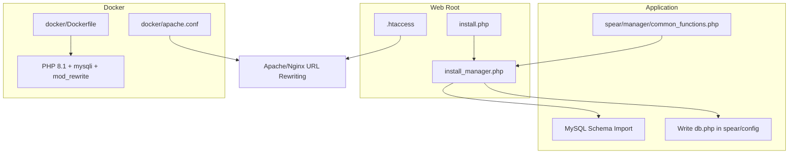
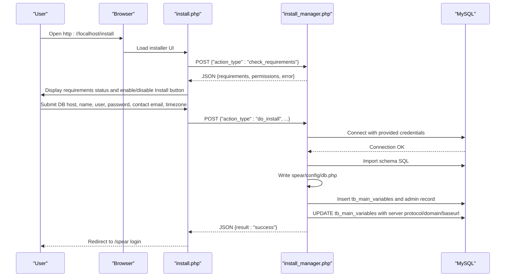
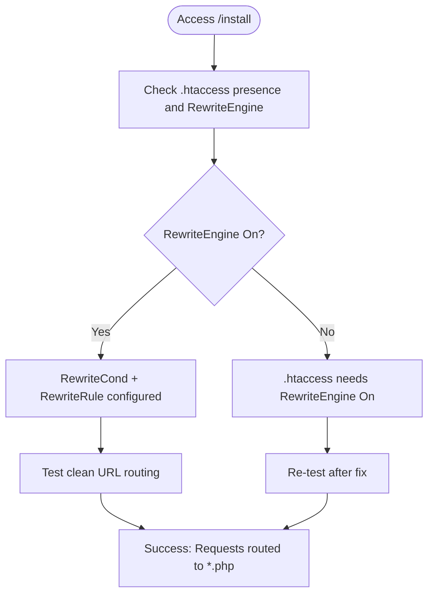
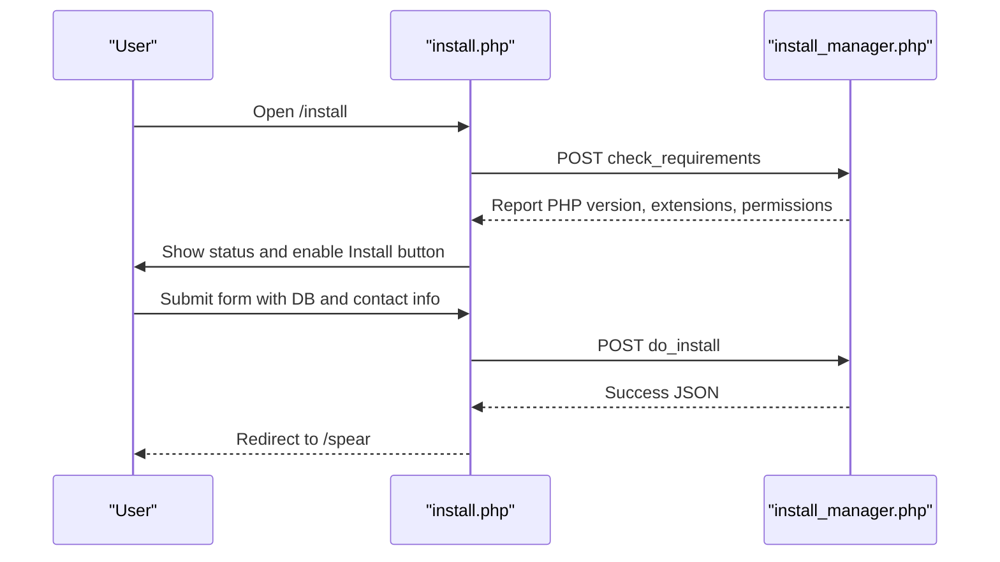
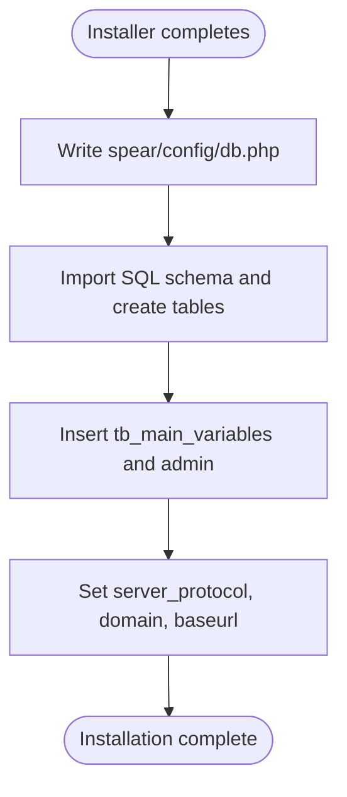
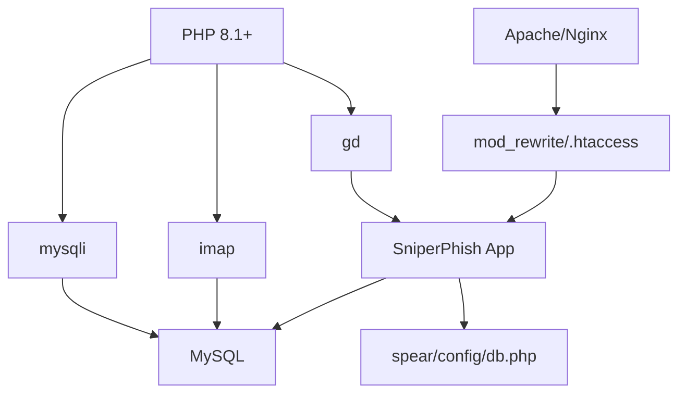

# Manual Installation

<cite>
**Referenced Files in This Document**
- [README.md](file://README.md)
- [.htaccess](file://.htaccess)
- [install.php](file://install.php)
- [install_manager.php](file://install_manager.php)
- [common_functions.php](file://spear/manager/common_functions.php)
- [docker.conf](file://docker/apache.conf)
- [Dockerfile](file://docker/Dockerfile)
</cite>

## Table of Contents
1. [Introduction](#introduction)
2. [Project Structure](#project-structure)
3. [Core Components](#core-components)
4. [Architecture Overview](#architecture-overview)
5. [Detailed Component Analysis](#detailed-component-analysis)
6. [Dependency Analysis](#dependency-analysis)
7. [Performance Considerations](#performance-considerations)
8. [Troubleshooting Guide](#troubleshooting-guide)
9. [Conclusion](#conclusion)
10. [Appendices](#appendices)

## Introduction
This manual installation guide walks you through installing SniperPhish from repository cloning to a fully configured system. It covers:
- Cloning or downloading the repository
- Extracting files to the web root
- Setting file permissions and ownership
- Configuring MySQL database connectivity
- Importing the schema and writing configuration files
- Web server configuration for URL rewriting
- Using the installation wizard to create the initial admin account
- Verification steps and common troubleshooting

The goal is to provide a clear, step-by-step procedure suitable for both beginners and experienced administrators.

## Project Structure
SniperPhish is a PHP-based application with a web root containing the installer and the main application under a spear directory. Key elements for installation include:
- Web root files: .htaccess, install.php, install_manager.php
- Application code under spear/
- Docker configuration for Apache and PHP environment

**Diagram sources**
- [.htaccess:1-5](file://.htaccess#L1-L5)
- [install.php:1-451](file://install.php#L1-L451)
- [install_manager.php:1-784](file://install_manager.php#L1-L784)
- [common_functions.php:1-595](file://spear/manager/common_functions.php#L1-L595)
- [docker.conf:1-13](file://docker/apache.conf#L1-L13)
- [Dockerfile:1-10](file://docker/Dockerfile#L1-L10)

**Section sources**
- [README.md:19-24](file://README.md#L19-L24)
- [.htaccess:1-5](file://.htaccess#L1-L5)
- [install.php:1-451](file://install.php#L1-L451)
- [install_manager.php:1-784](file://install_manager.php#L1-L784)
- [common_functions.php:1-595](file://spear/manager/common_functions.php#L1-L595)
- [docker.conf:1-13](file://docker/apache.conf#L1-L13)
- [Dockerfile:1-10](file://docker/Dockerfile#L1-L10)

## Core Components
- Installer front-end: A browser-based wizard that validates requirements and performs installation.
- Installer back-end: A JSON-driven handler that checks PHP extensions, permissions, connects to MySQL, writes configuration, creates tables, seeds initial data, and sets server variables.
- Common functions: Shared utilities including installation checks, OS detection, process management helpers, and server variable configuration.
- URL rewriting: .htaccess enables clean URLs by routing requests without .php suffixes.
- Docker configuration: Provides a ready-to-use Apache/PHP 8.1 stack with required PHP extensions and mod_rewrite enabled.

Key responsibilities:
- install.php: Presents the installation UI, collects DB credentials and contact email, selects timezone, and triggers installation via AJAX.
- install_manager.php: Implements requirement checks, DB connectivity test, schema import, config file generation, admin account creation, and server variable population.
- common_functions.php: Contains installation guard logic, permission checks, and server variable setters used during installation.
- .htaccess: Enables Apache URL rewriting for clean URLs.
- docker/*: Demonstrates a working Apache/PHP environment with mysqli and mod_rewrite.

**Section sources**
- [README.md:19-24](file://README.md#L19-L24)
- [install.php:62-114](file://install.php#L62-L114)
- [install_manager.php:15-16](file://install_manager.php#L15-L16)
- [common_functions.php:8-20](file://spear/manager/common_functions.php#L8-L20)
- [.htaccess:1-5](file://.htaccess#L1-L5)
- [docker.conf:1-13](file://docker/apache.conf#L1-L13)
- [Dockerfile:1-10](file://docker/Dockerfile#L1-L10)

## Architecture Overview
The installation flow is initiated by accessing the installer page, validated by the front-end, executed by the back-end, and finalized by writing configuration and database schema.

**Diagram sources**
- [install.php:144-229](file://install.php#L144-L229)
- [install_manager.php:15-162](file://install_manager.php#L15-L162)
- [common_functions.php:177-185](file://spear/manager/common_functions.php#L177-L185)

## Detailed Component Analysis

### Step 1: Prepare the Web Root and Permissions
- Place the repository contents in your web server’s document root.
- Ensure the web server user has write permissions to:
  - spear/config
  - spear/uploads
  - spear/payloads/uploads (if present)
  - spear/sniperhost/hf_files
  - spear/sniperhost/ht_files
  - spear/sniperhost/lp_pages
- Ownership should belong to the web server user (for example, www-data on Debian/Ubuntu or IIS_IUSRS on Windows).

Verification tip:
- Run a directory permission check after extraction to confirm writable paths.

**Section sources**
- [install_manager.php:89-108](file://install_manager.php#L89-L108)

### Step 2: Configure the Web Server for URL Rewriting
- Apache: Ensure mod_rewrite is enabled and AllowOverride allows .htaccess to override settings. The provided Apache virtual host demonstrates AllowOverride All and Options with FollowSymLinks.
- Nginx: Enable rewrite support and configure try_files to route requests to .php files when applicable.
- .htaccess: The repository includes a rewrite rule that routes requests ending without .php to append .php, enabling clean URLs.

**Diagram sources**
- [.htaccess:1-5](file://.htaccess#L1-L5)
- [docker.conf:4-7](file://docker/apache.conf#L4-L7)

**Section sources**
- [.htaccess:1-5](file://.htaccess#L1-L5)
- [docker.conf:4-7](file://docker/apache.conf#L4-L7)

### Step 3: Prepare the MySQL Database
- Create a new MySQL database and a dedicated user with full privileges on that database.
- Ensure the database user has permission to CREATE, ALTER, INSERT, SELECT, UPDATE, DELETE, and DROP.
- Confirm the database is empty before installation (the installer will drop existing tables if forced, but it is safer to start fresh).

Notes:
- The installer connects using mysqli and imports a comprehensive schema with multiple tables and initial seed data.

**Section sources**
- [install_manager.php:120-124](file://install_manager.php#L120-L124)
- [install_manager.php:180-782](file://install_manager.php#L180-L782)

### Step 4: Launch the Installation Wizard
- Open the installer in your browser: http://localhost/install
- The wizard validates:
  - PHP version (>= 8.1)
  - Required PHP extensions (mysqli, imap, gd)
  - Directory permissions for writable paths
  - Web server rewrite capability (.htaccess accessibility)
- Fill in:
  - MySQL DB Name
  - MySQL DB Host
  - DB Username
  - DB User Password
  - Your Contact Email
  - Timezone

**Diagram sources**
- [install.php:144-229](file://install.php#L144-L229)
- [install_manager.php:15-16](file://install_manager.php#L15-L16)

**Section sources**
- [README.md:19-24](file://README.md#L19-L24)
- [install.php:62-114](file://install.php#L62-L114)
- [install_manager.php:22-87](file://install_manager.php#L22-L87)

### Step 5: Post-Installation Configuration
- The installer writes the database configuration file to spear/config/db.php with the provided credentials.
- It creates all required tables and inserts initial records, including:
  - tb_main_variables with timezone and default time format
  - Initial admin user with a predefined hashed password
- It updates server variables (protocol, domain, base URL) based on the current request.

**Diagram sources**
- [install_manager.php:126-160](file://install_manager.php#L126-L160)
- [install_manager.php:164-178](file://install_manager.php#L164-L178)
- [install_manager.php:177-185](file://install_manager.php#L177-L185)

**Section sources**
- [install_manager.php:126-160](file://install_manager.php#L126-L160)
- [install_manager.php:164-178](file://install_manager.php#L164-L178)
- [install_manager.php:177-185](file://install_manager.php#L177-L185)

### Step 6: Access the Application
- After installation, the wizard redirects to the login page: http://localhost/spear
- Default credentials:
  - Username: admin
  - Password: sniperphish

Security note:
- Immediately change the default admin password after first login.

**Section sources**
- [README.md:24-24](file://README.md#L24-L24)
- [install_manager.php:172-177](file://install_manager.php#L172-L177)

## Dependency Analysis
The installation relies on:
- PHP 8.1+ with mysqli, imap, and gd extensions
- MySQL server connectivity
- Apache/Nginx with URL rewriting support
- Proper file permissions for writable directories

**Diagram sources**
- [install_manager.php:28-54](file://install_manager.php#L28-L54)
- [.htaccess:1-5](file://.htaccess#L1-L5)
- [install_manager.php:126-133](file://install_manager.php#L126-L133)

**Section sources**
- [install_manager.php:28-54](file://install_manager.php#L28-L54)
- [.htaccess:1-5](file://.htaccess#L1-L5)
- [install_manager.php:126-133](file://install_manager.php#L126-L133)

## Performance Considerations
- Use a modern PHP 8.1+ runtime with OPcache enabled for improved performance.
- Ensure MySQL is tuned for concurrent connections and appropriate buffer sizes.
- Keep the web server rewrite rules minimal to reduce overhead.
- Store uploads and payload directories on fast storage if handling large volumes.

[No sources needed since this section provides general guidance]

## Troubleshooting Guide

Common issues and resolutions:
- Permission errors preventing installation:
  - Symptom: Installer reports missing write permissions for spear/config, spear/uploads, or related directories.
  - Resolution: Grant write permissions to the web server user for the listed directories. Re-run the installer after fixing permissions.
  - Reference: [getWritePermissionInfo:89-108](file://install_manager.php#L89-L108)

- Database connection failures:
  - Symptom: “Connection failed” message during installation.
  - Resolution: Verify DB host, name, username, and password. Ensure the user has privileges on the database and network access is allowed. Confirm mysqli extension is loaded.
  - References:
    - [DB connection test:120-124](file://install_manager.php#L120-L124)
    - [PHP extensions check:28-54](file://install_manager.php#L28-L54)

- Missing or misconfigured .htaccess:
  - Symptom: Installer indicates .htaccess is missing, incorrectly configured, or rewrite support disabled.
  - Resolution: Ensure .htaccess exists in the web root with RewriteEngine On and RewriteRule configured. For Apache, enable mod_rewrite and AllowOverride All.
  - References:
    - [Installer error handling for .htaccess:177-184](file://install.php#L177-L184)
    - [.htaccess content:1-5](file://.htaccess#L1-L5)
    - [Apache virtual host example:4-7](file://docker/apache.conf#L4-L7)

- PHP extension problems:
  - Symptom: Installer reports missing mysqli, imap, or gd extensions.
  - Resolution: Install and enable the required PHP extensions. Use the Dockerfile as a reference for a working PHP 8.1 environment with mysqli and PDO drivers.
  - References:
    - [Extension checks:28-54](file://install_manager.php#L28-L54)
    - [Dockerfile with mysqli and PDO:3-4](file://docker/Dockerfile#L3-L4)

- Empty database requirement:
  - Symptom: Installer refuses to proceed if the database is not empty.
  - Resolution: Drop existing tables or use a fresh database. Alternatively, use the “force” option in the installer to drop existing tables (use with caution).
  - References:
    - [Empty DB check and force behavior:135-145](file://install_manager.php#L135-L145)

Verification checklist:
- Confirm the installer runs and displays green checks for PHP version and extensions.
- Verify spear/config/db.php was created with correct credentials.
- Log in to the application using admin/sniperphish and change the default password.
- Validate that clean URLs work (e.g., /install and /spear resolve without .php).

**Section sources**
- [install_manager.php:89-108](file://install_manager.php#L89-L108)
- [install_manager.php:120-124](file://install_manager.php#L120-L124)
- [install_manager.php:135-145](file://install_manager.php#L135-L145)
- [install.php:177-184](file://install.php#L177-L184)
- [.htaccess:1-5](file://.htaccess#L1-L5)
- [docker.conf:4-7](file://docker/apache.conf#L4-L7)
- [Dockerfile:3-4](file://docker/Dockerfile#L3-L4)

## Conclusion
By following this guide, you will have installed SniperPhish with a properly configured web server, database, and initial admin account. The installer automates most steps, but ensuring correct permissions, URL rewriting, and database credentials is essential for a smooth deployment.

[No sources needed since this section summarizes without analyzing specific files]

## Appendices

### Appendix A: Step-by-Step Installation Checklist
- Clone or download the repository to your web root.
- Ensure Apache/Nginx supports URL rewriting and .htaccess overrides.
- Create a MySQL database and user with full privileges.
- Run the installer at http://localhost/install and follow prompts.
- Verify spear/config/db.php exists and contains correct credentials.
- Log in to http://localhost/spear and change the default admin password.

**Section sources**
- [README.md:19-24](file://README.md#L19-L24)
- [.htaccess:1-5](file://.htaccess#L1-L5)
- [install.php:62-114](file://install.php#L62-L114)