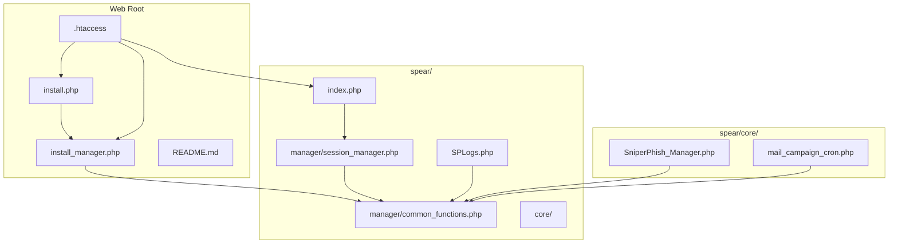
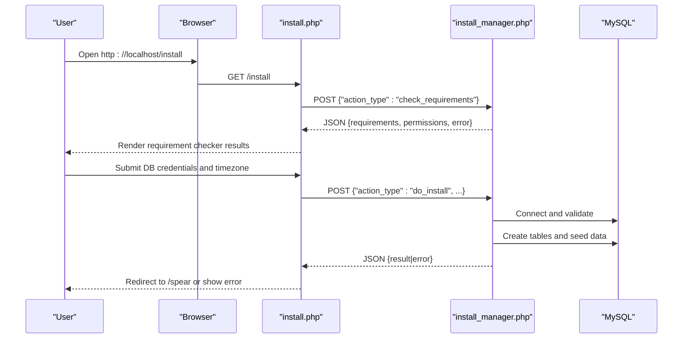
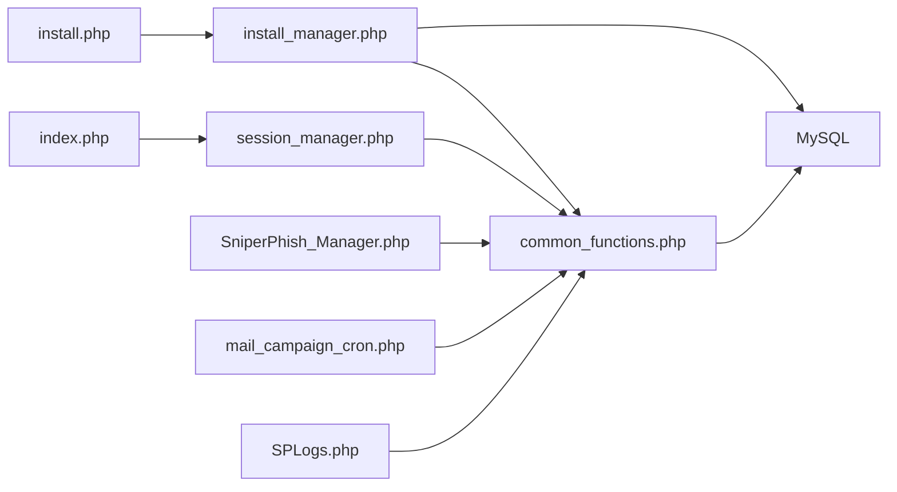

# Post-Installation Verification

<cite>
**Referenced Files in This Document**
- [install.php](file://install.php)
- [install_manager.php](file://install_manager.php)
- [README.md](file://README.md)
- [common_functions.php](file://spear/manager/common_functions.php)
- [session_manager.php](file://spear/manager/session_manager.php)
- [SniperPhish_Manager.php](file://spear/core/SniperPhish_Manager.php)
- [mail_campaign_cron.php](file://spear/core/mail_campaign_cron.php)
- [.htaccess](file://.htaccess)
- [SPLogs.php](file://spear/SPLogs.php)
- [index.php](file://spear/index.php)
</cite>

## Table of Contents
1. [Introduction](#introduction)
2. [Project Structure](#project-structure)
3. [Core Components](#core-components)
4. [Architecture Overview](#architecture-overview)
5. [Detailed Component Analysis](#detailed-component-analysis)
6. [Dependency Analysis](#dependency-analysis)
7. [Performance Considerations](#performance-considerations)
8. [Troubleshooting Guide](#troubleshooting-guide)
9. [Conclusion](#conclusion)
10. [Appendices](#appendices)

## Introduction
This document provides a comprehensive post-installation verification guide for SniperPhish. It focuses on validating successful installation and configuration, including database connectivity, file permissions, core functionality, and system health checks. It also explains how to interpret the installation wizard’s requirement checker results, perform the initial login and admin account validation, verify email sending capability, web tracking functionality, and reporting access, and access system logs for troubleshooting. Finally, it covers common post-installation issues and provides guidance on performance benchmarking and optimization.

## Project Structure
The SniperPhish application is organized around a web-accessible frontend under the spear directory and a backend installer and core services. The installer and health checks are exposed via the web root, while runtime services (cron and mail campaign engine) reside under spear/core.

**Diagram sources**
- [install.php:1-451](file://install.php#L1-L451)
- [install_manager.php:1-784](file://install_manager.php#L1-L784)
- [.htaccess:1-5](file://.htaccess#L1-L5)
- [index.php:1-188](file://spear/index.php#L1-L188)
- [session_manager.php:1-244](file://spear/manager/session_manager.php#L1-L244)
- [common_functions.php:1-595](file://spear/manager/common_functions.php#L1-L595)
- [SPLogs.php:1-203](file://spear/SPLogs.php#L1-L203)
- [SniperPhish_Manager.php:1-46](file://spear/core/SniperPhish_Manager.php#L1-L46)
- [mail_campaign_cron.php:1-364](file://spear/core/mail_campaign_cron.php#L1-L364)

**Section sources**
- [install.php:1-451](file://install.php#L1-L451)
- [install_manager.php:1-784](file://install_manager.php#L1-L784)
- [README.md:1-86](file://README.md#L1-L86)
- [.htaccess:1-5](file://.htaccess#L1-L5)

## Core Components
- Installation Wizard and Requirement Checker: Validates PHP version, required extensions, directory permissions, and OS commands availability.
- Installer Backend: Creates database configuration file, initializes database tables, seeds default data, and sets server variables.
- Session and Authentication: Manages login, session lifecycle, and admin account validation.
- Logging: Provides centralized logging of user actions and system events.
- Cron and Mail Engine: Background processes for campaign scheduling and sending.
- Web Tracking and Reporting: Core runtime features for tracking visits and form submissions.

**Section sources**
- [install_manager.php:22-87](file://install_manager.php#L22-L87)
- [install_manager.php:110-162](file://install_manager.php#L110-L162)
- [common_functions.php:8-20](file://spear/manager/common_functions.php#L8-L20)
- [session_manager.php:17-33](file://spear/manager/session_manager.php#L17-L33)
- [SPLogs.php:1-203](file://spear/SPLogs.php#L1-L203)
- [SniperPhish_Manager.php:1-46](file://spear/core/SniperPhish_Manager.php#L1-L46)
- [mail_campaign_cron.php:1-364](file://spear/core/mail_campaign_cron.php#L1-L364)

## Architecture Overview
The post-installation verification workflow spans the installer, configuration persistence, authentication, and runtime systems.

**Diagram sources**
- [install.php:144-229](file://install.php#L144-L229)
- [install_manager.php:15-16](file://install_manager.php#L15-L16)
- [install_manager.php:110-162](file://install_manager.php#L110-L162)

## Detailed Component Analysis

### Installation Wizard Requirement Checker
- Purpose: Validates PHP version, required extensions (mysqli, imap, gd), directory write permissions, and OS commands availability.
- Interpretation:
  - Success: Green checkmarks indicate satisfied requirements.
  - Failure: Red X marks with popover tooltips indicate missing extensions or permission issues.
  - Communication errors: Indicates misconfiguration of .htaccess or inability to reach the installer endpoint.

Verification checklist:
- PHP version meets minimum requirement.
- Required PHP extensions are loaded.
- Directory permissions for configuration and upload areas are writable.
- OS commands required for process management are available.

**Section sources**
- [install.php:144-186](file://install.php#L144-L186)
- [install_manager.php:22-87](file://install_manager.php#L22-L87)
- [install_manager.php:89-108](file://install_manager.php#L89-L108)

### Initial Installation and Database Initialization
- Installer writes database configuration file and creates tables.
- Seeds default mail sender configurations and templates.
- Sets server protocol, domain, and base URL in the database.

Verification checklist:
- Database configuration file is created.
- Database tables are present and seeded.
- Server variables are set based on current HTTP request.

**Section sources**
- [install_manager.php:110-162](file://install_manager.php#L110-L162)
- [install_manager.php:180-782](file://install_manager.php#L180-L782)
- [common_functions.php:177-185](file://spear/manager/common_functions.php#L177-L185)

### Initial Login and Admin Account Validation
- Default admin credentials are created during installation.
- Login page validates credentials against the database and starts a secure session.
- Session cookie stores user metadata for dashboard use.

Verification checklist:
- Default admin account exists and is accessible.
- Successful login redirects to the home page.
- Session persists and displays user info.

**Section sources**
- [README.md:24-24](file://README.md#L24-L24)
- [install_manager.php:164-178](file://install_manager.php#L164-L178)
- [index.php:1-15](file://spear/index.php#L1-L15)
- [session_manager.php:17-33](file://spear/manager/session_manager.php#L17-L33)
- [session_manager.php:215-234](file://spear/manager/session_manager.php#L215-L234)

### System Health Checks
- PHP configuration verification: Confirm PHP version and required extensions.
- Database connection testing: Verify mysqli connectivity and table presence.
- Extension validation: Confirm imap and gd are loaded.
- Permission validation: Ensure writable directories for configuration, uploads, payloads, and host files.

Verification checklist:
- PHP version and extensions validated by the installer.
- Writable directories identified and corrected.
- Database connectivity confirmed via installer and runtime.

**Section sources**
- [install_manager.php:22-87](file://install_manager.php#L22-L87)
- [install_manager.php:89-108](file://install_manager.php#L89-L108)
- [common_functions.php:8-20](file://spear/manager/common_functions.php#L8-L20)

### Email Sending Capability
- Mail engine uses Symfony Mailer with DSN-based transports.
- Supports multiple providers and custom SMTP.
- Campaigns are scheduled and executed by a background process.

Verification checklist:
- Configure a mail sender (IMAP mailbox and SMTP) in the system.
- Test sending a single test email via the mail sender interface.
- Monitor logs for delivery outcomes.

**Section sources**
- [mail_campaign_cron.php:1-364](file://spear/core/mail_campaign_cron.php#L1-L364)
- [common_functions.php:114-159](file://spear/manager/common_functions.php#L114-L159)

### Web Tracking Functionality
- Generates tracker code for websites and forms.
- Captures visits and form submissions with IP geolocation and device/browser detection.
- Stores tracking data in database tables for reporting.

Verification checklist:
- Create a web tracker and embed the generated code in a test page.
- Trigger a visit and form submission.
- Confirm data appears in tracking tables and reports.

**Section sources**
- [mail_campaign_cron.php:1-364](file://spear/core/mail_campaign_cron.php#L1-L364)
- [common_functions.php:257-290](file://spear/manager/common_functions.php#L257-L290)

### Reporting System Access
- Provides dashboards and reports for email campaigns and web trackers.
- Uses logged-in session to render protected views.

Verification checklist:
- Access the reporting dashboards after login.
- Validate that campaign and tracker reports are populated.

**Section sources**
- [index.php:1-15](file://spear/index.php#L1-L15)
- [session_manager.php:35-44](file://spear/manager/session_manager.php#L35-L44)

### Accessing System Logs for Troubleshooting
- Centralized logging of user actions and system events.
- Access logs via the Logs page and export options.

Verification checklist:
- Navigate to the Logs page.
- Review recent entries and export logs if needed.

**Section sources**
- [SPLogs.php:1-203](file://spear/SPLogs.php#L1-L203)
- [common_functions.php:576-586](file://spear/manager/common_functions.php#L576-L586)

### Installer Endpoint and .htaccess Behavior
- The installer communicates with install_manager.php via AJAX.
- .htaccess rewrites requests to remove .php suffix, ensuring clean URLs.

Verification checklist:
- Installer requirement checker renders without communication errors.
- .htaccess rewrite rules are effective and supported by the server.

**Section sources**
- [install.php:177-184](file://install.php#L177-L184)
- [.htaccess:1-5](file://.htaccess#L1-L5)

## Dependency Analysis
The post-installation verification relies on the interplay between the installer, configuration persistence, authentication, and runtime services.

**Diagram sources**
- [install.php:1-451](file://install.php#L1-L451)
- [install_manager.php:1-784](file://install_manager.php#L1-L784)
- [common_functions.php:1-595](file://spear/manager/common_functions.php#L1-L595)
- [index.php:1-188](file://spear/index.php#L1-L188)
- [session_manager.php:1-244](file://spear/manager/session_manager.php#L1-L244)
- [SniperPhish_Manager.php:1-46](file://spear/core/SniperPhish_Manager.php#L1-L46)
- [mail_campaign_cron.php:1-364](file://spear/core/mail_campaign_cron.php#L1-L364)
- [SPLogs.php:1-203](file://spear/SPLogs.php#L1-L203)

**Section sources**
- [install_manager.php:1-784](file://install_manager.php#L1-L784)
- [common_functions.php:1-595](file://spear/manager/common_functions.php#L1-L595)
- [session_manager.php:1-244](file://spear/manager/session_manager.php#L1-L244)
- [SniperPhish_Manager.php:1-46](file://spear/core/SniperPhish_Manager.php#L1-L46)
- [mail_campaign_cron.php:1-364](file://spear/core/mail_campaign_cron.php#L1-L364)
- [SPLogs.php:1-203](file://spear/SPLogs.php#L1-L203)

## Performance Considerations
- PHP and MySQL tuning: Ensure PHP memory limits and MySQL timeouts are appropriate for campaign volume.
- IMAP polling intervals: Adjust cron sleep intervals and anti-flood controls to balance throughput and provider rate limits.
- Logging overhead: Limit excessive logging in production environments to reduce I/O load.
- Static asset caching: Enable server-side caching for static assets to improve UI responsiveness.

[No sources needed since this section provides general guidance]

## Troubleshooting Guide

Common post-installation issues and diagnostics:
- Login failures
  - Symptom: Incorrect username/password prompt.
  - Diagnostics:
    - Verify admin account exists and password hash matches.
    - Confirm database connectivity and table presence.
    - Check session cookie settings and SameSite policy.
  - Remediation:
    - Recreate admin account via installer if corrupted.
    - Fix database connection and restart web server.

- Database connection problems
  - Symptom: Installer reports connection failure or empty database content.
  - Diagnostics:
    - Validate DB host, name, username, and password.
    - Confirm mysqli extension is loaded.
    - Check firewall and network access to MySQL.
  - Remediation:
    - Correct credentials and retry installation.
    - Enable mysqli extension and restart PHP.

- Feature unavailability (tracking, reporting)
  - Symptom: Tracking data not recorded or reports empty.
  - Diagnostics:
    - Verify cron process is running and registered.
    - Confirm server variables (protocol, domain, base URL) are set.
    - Check write permissions for upload and payload directories.
  - Remediation:
    - Start the cron process if not running.
    - Re-run installer to set server variables.
    - Fix directory permissions.

- Email sending failures
  - Symptom: Campaigns fail to send or show transport exceptions.
  - Diagnostics:
    - Validate mail sender configuration (IMAP mailbox and SMTP).
    - Check provider-specific DSN settings and peer verification.
    - Inspect logs for detailed error messages.
  - Remediation:
    - Update mail sender settings and test credentials.
    - Adjust anti-flood settings and retry.

- Installer communication errors
  - Symptom: Requirement checker shows communication error.
  - Diagnostics:
    - Confirm .htaccess rewrite rules are active.
    - Ensure web server supports .htaccess overrides.
  - Remediation:
    - Fix .htaccess and server configuration.
    - Restart web server.

**Section sources**
- [session_manager.php:17-33](file://spear/manager/session_manager.php#L17-L33)
- [common_functions.php:8-20](file://spear/manager/common_functions.php#L8-L20)
- [SniperPhish_Manager.php:7-15](file://spear/core/SniperPhish_Manager.php#L7-L15)
- [common_functions.php:177-185](file://spear/manager/common_functions.php#L177-L185)
- [install_manager.php:120-124](file://install_manager.php#L120-L124)
- [install.php:177-184](file://install.php#L177-L184)

## Conclusion
This verification guide ensures that SniperPhish is correctly installed, configured, and operating as expected. By validating the installer’s requirement checker, confirming database connectivity and permissions, verifying the initial login and admin account, and testing core features such as email sending, web tracking, and reporting, administrators can confidently proceed with operational use. Use the logs and troubleshooting steps to diagnose and resolve issues quickly.

[No sources needed since this section summarizes without analyzing specific files]

## Appendices

### Verification Checklist Summary
- Installer requirement checker: PHP version, extensions, permissions, OS commands.
- Database initialization: Configuration file, tables, seeding, server variables.
- Initial login: Default admin credentials, session creation.
- Core features:
  - Email sending: Provider configuration and test delivery.
  - Web tracking: Embedding and data capture.
  - Reporting: Dashboards and data visibility.
- Logs: Access and export capabilities.
- .htaccess: Clean URL rewriting and endpoint accessibility.

[No sources needed since this section provides general guidance]