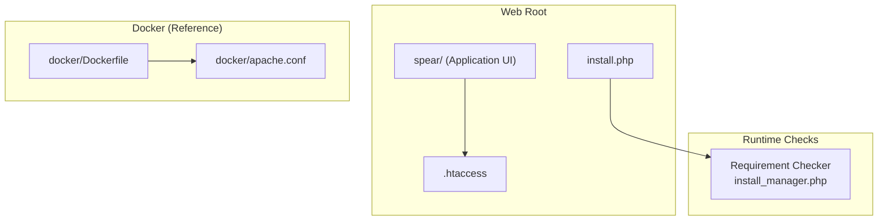
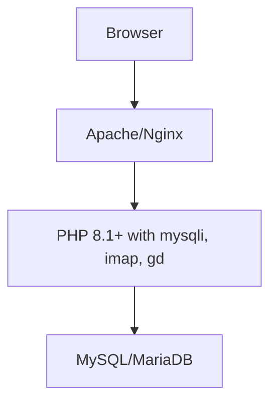
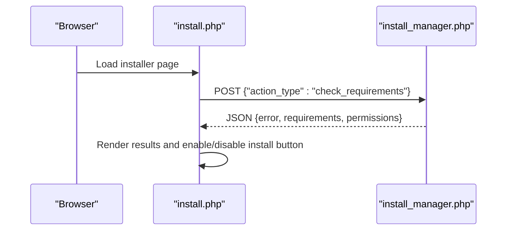
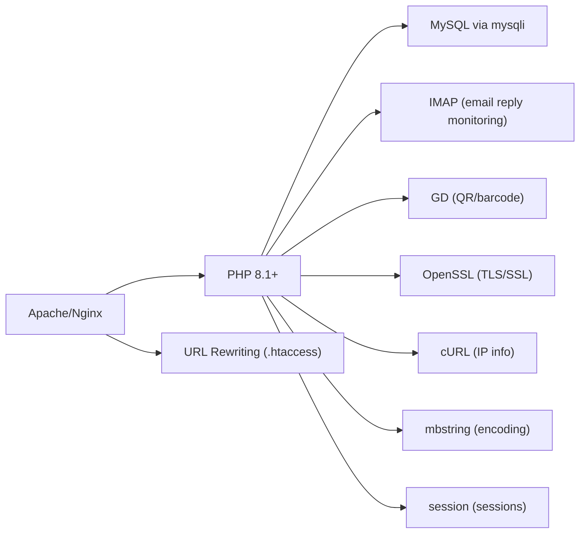

# System Requirements

<cite>
**Referenced Files in This Document**
- [README.md](file://README.md)
- [install.php](file://install.php)
- [install_manager.php](file://install_manager.php)
- [.htaccess](file://.htaccess)
- [docker/Dockerfile](file://docker/Dockerfile)
- [docker/apache.conf](file://docker/apache.conf)
- [spear/manager/common_functions.php](file://spear/manager/common_functions.php)
</cite>

## Table of Contents
1. [Introduction](#introduction)
2. [Project Structure](#project-structure)
3. [Core Components](#core-components)
4. [Architecture Overview](#architecture-overview)
5. [Detailed Component Analysis](#detailed-component-analysis)
6. [Dependency Analysis](#dependency-analysis)
7. [Performance Considerations](#performance-considerations)
8. [Troubleshooting Guide](#troubleshooting-guide)
9. [Conclusion](#conclusion)

## Introduction
This document defines the system requirements for installing and operating SniperPhish. It consolidates hardware and software prerequisites, supported platforms, required PHP extensions, database and web server configurations, and compatibility guidance. It also explains how to verify requirements using the built-in installation wizard’s requirement checker.

## Project Structure
SniperPhish is a PHP-based web application with a straightforward deployment model:
- Web root exposes the installer and the application frontend under the “spear” directory.
- The installer performs runtime checks for PHP version, extensions, and filesystem permissions.
- A Docker configuration demonstrates a ready-to-use stack with Apache, PHP 8.1, and required PHP extensions.

**Diagram sources**
- [install.php:144-186](file://install.php#L144-L186)
- [install_manager.php:22-87](file://install_manager.php#L22-L87)
- [.htaccess:1-5](file://.htaccess#L1-L5)
- [docker/Dockerfile:1-10](file://docker/Dockerfile#L1-L10)
- [docker/apache.conf:1-13](file://docker/apache.conf#L1-L13)

**Section sources**
- [README.md:14-24](file://README.md#L14-L24)
- [install.php:144-186](file://install.php#L144-L186)
- [install_manager.php:22-87](file://install_manager.php#L22-L87)
- [.htaccess:1-5](file://.htaccess#L1-L5)
- [docker/Dockerfile:1-10](file://docker/Dockerfile#L1-L10)
- [docker/apache.conf:1-13](file://docker/apache.conf#L1-L13)

## Core Components
- PHP runtime and extensions: The installer validates PHP 8.1+ and essential extensions.
- Database: MySQL via mysqli; the installer attempts a connection and creates tables.
- Web server: Apache with .htaccess URL rewriting or equivalent.
- Permissions: Writable directories for configuration, uploads, payloads, and generated files.
- Optional OS-specific commands: Used by the installer to validate environment capabilities.

Key requirement checks performed by the installer:
- PHP version >= 8.1
- PHP extensions: mysqli, imap, gd
- Directory write permissions for configuration and upload areas
- OS command availability for process detection and filtering

**Section sources**
- [install_manager.php:22-87](file://install_manager.php#L22-L87)
- [install.php:150-172](file://install.php#L150-L172)
- [README.md:14-18](file://README.md#L14-L18)

## Architecture Overview
The system requirements center on three pillars:
- Runtime environment: PHP 8.1+ with required extensions and IMAP/GD support.
- Data plane: MySQL connectivity and schema initialization.
- Control plane: Web server with URL rewriting and virtual host configuration.

**Diagram sources**
- [install_manager.php:28-54](file://install_manager.php#L28-L54)
- [install_manager.php:119-124](file://install_manager.php#L119-L124)
- [docker/Dockerfile:1-10](file://docker/Dockerfile#L1-L10)

**Section sources**
- [install_manager.php:28-54](file://install_manager.php#L28-L54)
- [install_manager.php:119-124](file://install_manager.php#L119-L124)
- [docker/Dockerfile:1-10](file://docker/Dockerfile#L1-L10)

## Detailed Component Analysis

### PHP Runtime and Extensions
- Minimum PHP version: 8.1+
- Required extensions validated by the installer:
  - mysqli (database connectivity)
  - imap (email reply monitoring)
  - gd (image generation for QR/barcodes)
- Additional extensions used by the application:
  - mbstring (multibyte string handling)
  - session (session management)
  - openssl (TLS/SSL operations)
  - curl (external IP info lookup)
  - pdo, pdo_mysql (database abstraction and MySQL driver)

Verification method:
- The installer posts a “check_requirements” action to the backend, which enumerates loaded extensions and reports missing ones.

Operational notes:
- The application uses Symfony Mailer with DSN-based transports, indicating OpenSSL and related crypto libraries are required for secure connections.
- Image generation relies on GD for QR/barcode rendering.

**Section sources**
- [install_manager.php:28-54](file://install_manager.php#L28-L54)
- [install_manager.php:145-159](file://install_manager.php#L145-L159)
- [spear/manager/common_functions.php:232-244](file://spear/manager/common_functions.php#L232-L244)
- [spear/manager/common_functions.php:268-277](file://spear/manager/common_functions.php#L268-L277)

### Database Requirements
- Database engine: MySQL (tested with MariaDB 10.4 in included schema).
- Driver: mysqli (validated by installer).
- Schema: Installer creates all required tables during setup.
- Connection: The installer attempts to connect using provided credentials and writes a configuration file for subsequent requests.

Storage and performance considerations:
- The schema includes several tables for campaign data, trackers, logs, and metadata. Storage needs scale with:
  - Number of campaigns and recipients
  - Attachment sizes and payload uploads
  - Logging and reporting data volume
- Connection limits: Configure MySQL max_connections and per-thread buffers according to expected concurrent users and mail-sending load.
- Performance: Use SSD-backed storage, enable appropriate indexes, and monitor slow query logs.

**Section sources**
- [install_manager.php:119-124](file://install_manager.php#L119-L124)
- [install_manager.php:180-782](file://install_manager.php#L180-L782)
- [README.md:17](file://README.md#L17)

### Web Server Requirements
- Supported servers: Apache 2.4+ or Nginx.
- URL rewriting: The application uses clean URLs and relies on .htaccess to ignore .php extensions.
- Virtual host: AllowOverride All is required to permit .htaccess directives.

Docker reference:
- The Dockerfile enables Apache rewrite module and installs mysqli/pdo/pdo_mysql.
- The Apache virtual host configuration sets AllowOverride All for the document root.

**Section sources**
- [README.md:16](file://README.md#L16)
- [.htaccess:1-5](file://.htaccess#L1-L5)
- [docker/Dockerfile:6-7](file://docker/Dockerfile#L6-L7)
- [docker/apache.conf:4-8](file://docker/apache.conf#L4-L8)

### Operating Systems and Compatibility
- Supported OS families:
  - Linux (primary target)
  - Windows (installer validates OS-specific commands)
  - macOS: Not verified by the project; not recommended for production use.
- The installer detects OS and conditionally checks for commands like tasklist/findstr (Windows) or ps/grep/awk (Linux).

**Section sources**
- [README.md:15](file://README.md#L15)
- [install_manager.php:61-84](file://install_manager.php#L61-L84)
- [spear/manager/common_functions.php:23-28](file://spear/manager/common_functions.php#L23-L28)

### Requirement Verification Workflow
The installer’s requirement checker performs:
- PHP version check
- Extension checks (mysqli, imap, gd)
- Directory write permission checks for configuration and upload directories
- OS command checks for process and filtering utilities

**Diagram sources**
- [install.php:144-186](file://install.php#L144-L186)
- [install_manager.php:22-87](file://install_manager.php#L22-L87)

**Section sources**
- [install.php:144-186](file://install.php#L144-L186)
- [install_manager.php:22-87](file://install_manager.php#L22-L87)

## Dependency Analysis
- PHP extensions dependency graph:
  - mysqli: database connectivity
  - imap: email reply monitoring
  - gd: QR/barcode image generation
  - mbstring, session, openssl, curl: general-purpose features
  - pdo/pdo_mysql: database abstraction and MySQL driver
- Web server dependency:
  - Apache rewrite module and .htaccess support for clean URLs
- Docker reference:
  - Demonstrates enabling rewrite and installing mysqli/pdo/pdo_mysql

**Diagram sources**
- [install_manager.php:28-54](file://install_manager.php#L28-L54)
- [docker/Dockerfile:1-10](file://docker/Dockerfile#L1-L10)
- [.htaccess:1-5](file://.htaccess#L1-L5)

**Section sources**
- [install_manager.php:28-54](file://install_manager.php#L28-L54)
- [docker/Dockerfile:1-10](file://docker/Dockerfile#L1-L10)
- [.htaccess:1-5](file://.htaccess#L1-L5)

## Performance Considerations
- Memory:
  - PHP-FPM pm settings should accommodate concurrent requests during mail sending and report generation.
  - Allocate sufficient memory for image processing (GD) and mail transport operations.
- CPU:
  - Image generation (QR/barcode) and mail sending can be CPU-intensive; provision accordingly for high-volume campaigns.
- Network:
  - SMTP outbound traffic depends on provider rate limits; configure anti-flood controls and queue appropriately.
  - External IP info lookups rely on cURL; ensure firewall allows outbound HTTPS to ipapi.co.
- Storage:
  - Monitor disk usage for uploaded attachments, payloads, and logs; configure retention policies.

[No sources needed since this section provides general guidance]

## Troubleshooting Guide
Common issues and resolutions:
- PHP version or extension errors:
  - The installer highlights missing extensions. Install and enable mysqli, imap, gd, mbstring, session, openssl, curl, pdo, pdo_mysql.
- .htaccess or URL rewriting problems:
  - The installer detects missing or misconfigured .htaccess and suggests correcting it to ignore .php extensions.
- MySQL connection failures:
  - Verify host, username, password, and database name; ensure the database exists and the user has privileges to create tables.
- Permission errors:
  - Ensure writable permissions for configuration and upload directories as reported by the installer.

**Section sources**
- [install.php:173-185](file://install.php#L173-L185)
- [install_manager.php:119-124](file://install_manager.php#L119-L124)
- [install_manager.php:89-108](file://install_manager.php#L89-L108)

## Conclusion
SniperPhish requires PHP 8.1+ with mysqli, imap, and gd, plus supporting extensions for mbstring, session, openssl, curl, pdo, and pdo_mysql. It connects to MySQL and expects Apache/Nginx with URL rewriting enabled. The installer automates verification of these requirements and provides actionable feedback. For reliable operation, tune PHP memory and CPU resources, manage network bandwidth for SMTP and external lookups, and monitor storage growth.