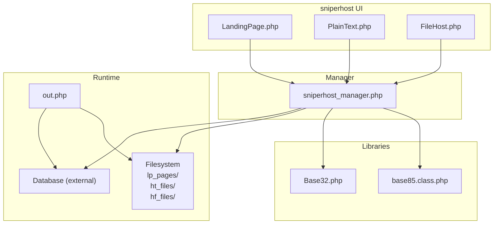
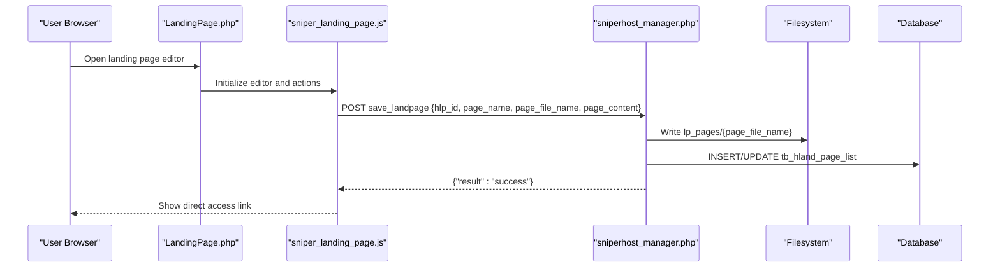
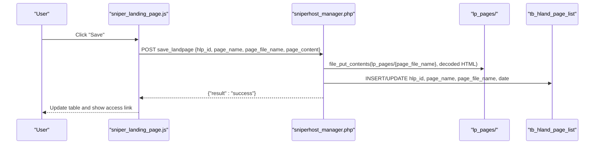
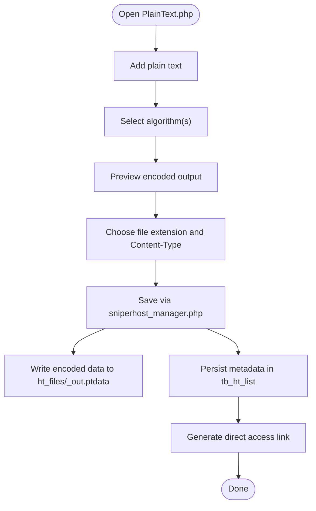
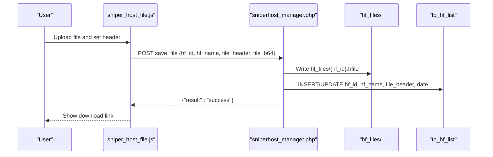
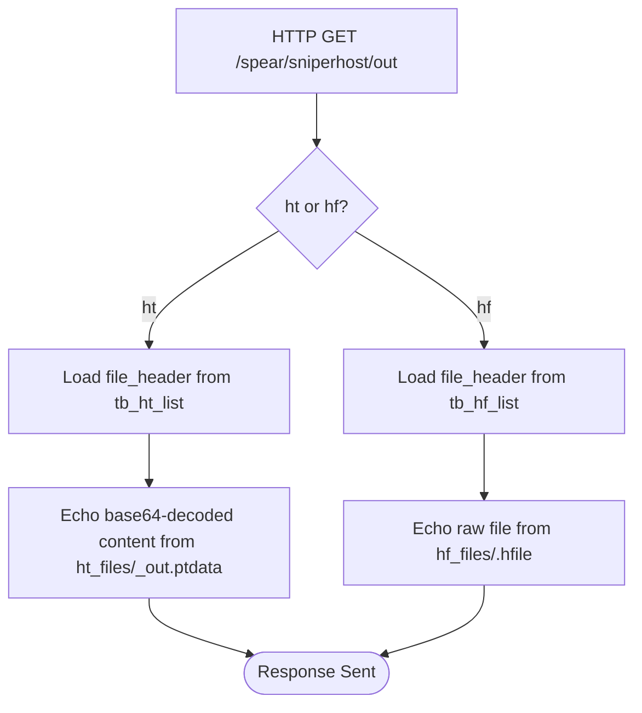
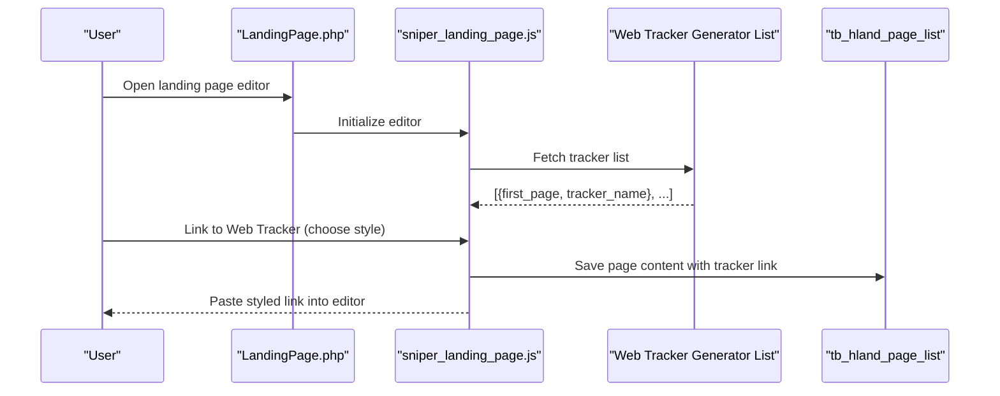
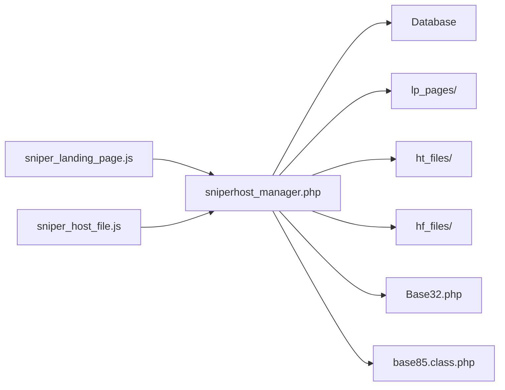

# Landing Page Hosting

<cite>
**Referenced Files in This Document**
- [LandingPage.php](file://spear/sniperhost/LandingPage.php)
- [sniperhost_manager.php](file://spear/sniperhost/manager/sniperhost_manager.php)
- [out.php](file://spear/sniperhost/out.php)
- [FileHost.php](file://spear/sniperhost/FileHost.php)
- [PlainText.php](file://spear/sniperhost/PlainText.php)
- [sniper_landing_page.js](file://spear/sniperhost/js/sniper_landing_page.js)
- [sniper_host_file.js](file://spear/sniperhost/js/sniper_host_file.js)
- [Base32.php](file://spear/sniperhost/lib/Base32.php)
- [base85.class.php](file://spear/sniperhost/lib/base85.class.php)
- [session_manager.php](file://spear/manager/session_manager.php)
- [install.php](file://install.php)
</cite>

## Table of Contents
1. [Introduction](#introduction)
2. [Project Structure](#project-structure)
3. [Core Components](#core-components)
4. [Architecture Overview](#architecture-overview)
5. [Detailed Component Analysis](#detailed-component-analysis)
6. [Dependency Analysis](#dependency-analysis)
7. [Performance Considerations](#performance-considerations)
8. [Troubleshooting Guide](#troubleshooting-guide)
9. [Conclusion](#conclusion)
10. [Appendices](#appendices)

## Introduction
This document explains the landing page hosting subsystem of the SniperPhish toolkit. It focuses on:
- Built-in web hosting capabilities for phishing landing pages
- HTML editor integration with media insertion and web tracker linking
- Lifecycle management of hosted pages via the sniperhost manager
- Serving hosted content through the out endpoint
- Relationship with the web tracker system for integrated tracking
- Practical guidance for customization, media management, access control, and security best practices

## Project Structure
The sniperhost subsystem is organized around three primary capabilities:
- Landing page hosting: HTML pages with rich editor and media support
- Plain-text hosting: Encoded/plain text with configurable headers and download links
- File hosting: Binary file hosting with configurable Content-Type headers

**Diagram sources**
- [LandingPage.php:1-320](file://spear/sniperhost/LandingPage.php#L1-L320)
- [PlainText.php:1-308](file://spear/sniperhost/PlainText.php#L1-L308)
- [FileHost.php:1-228](file://spear/sniperhost/FileHost.php#L1-L228)
- [sniperhost_manager.php:1-314](file://spear/sniperhost/manager/sniperhost_manager.php#L1-L314)
- [out.php:1-38](file://spear/sniperhost/out.php#L1-L38)
- [Base32.php:1-147](file://spear/sniperhost/lib/Base32.php#L1-L147)
- [base85.class.php:1-104](file://spear/sniperhost/lib/base85.class.php#L1-L104)

**Section sources**
- [LandingPage.php:1-320](file://spear/sniperhost/LandingPage.php#L1-L320)
- [PlainText.php:1-308](file://spear/sniperhost/PlainText.php#L1-L308)
- [FileHost.php:1-228](file://spear/sniperhost/FileHost.php#L1-L228)
- [sniperhost_manager.php:1-314](file://spear/sniperhost/manager/sniperhost_manager.php#L1-L314)
- [out.php:1-38](file://spear/sniperhost/out.php#L1-L38)

## Core Components
- LandingPage UI and Editor
  - Provides a rich HTML editor with media insertion (links, images, videos) and web tracker integration.
  - Generates direct access links to hosted HTML pages.
  - Manages page lifecycle (create, edit, delete) via the manager.

- PlainText Hosting
  - Allows adding raw text, selecting encoding/algorithm combinations, and generating downloadable links with custom headers.

- File Hosting
  - Supports uploading binary files, setting Content-Type headers, and generating direct download links.

- Manager (sniperhost_manager.php)
  - Implements CRUD operations for landing pages, plain-text entries, and file entries.
  - Handles filesystem writes to lp_pages, ht_files, and hf_files directories.
  - Uses Base32 and Base85 encoders for text transformations.

- Out Endpoint (out.php)
  - Serves hosted plain-text and files with appropriate Content-Type headers based on stored metadata.

**Section sources**
- [LandingPage.php:1-320](file://spear/sniperhost/LandingPage.php#L1-L320)
- [PlainText.php:1-308](file://spear/sniperhost/PlainText.php#L1-L308)
- [FileHost.php:1-228](file://spear/sniperhost/FileHost.php#L1-L228)
- [sniperhost_manager.php:1-314](file://spear/sniperhost/manager/sniperhost_manager.php#L1-L314)
- [out.php:1-38](file://spear/sniperhost/out.php#L1-L38)
- [Base32.php:1-147](file://spear/sniperhost/lib/Base32.php#L1-L147)
- [base85.class.php:1-104](file://spear/sniperhost/lib/base85.class.php#L1-L104)

## Architecture Overview
The sniperhost subsystem follows a layered architecture:
- Presentation Layer: LandingPage, PlainText, FileHost pages
- Interaction Layer: JavaScript modules (sniper_landing_page.js, sniper_host_file.js)
- Control Layer: sniperhost_manager.php
- Persistence Layer: Database (external) and filesystem (lp_pages, ht_files, hf_files)
- Serving Layer: out.php for plain-text and file downloads

**Diagram sources**
- [LandingPage.php:1-320](file://spear/sniperhost/LandingPage.php#L1-L320)
- [sniper_landing_page.js:161-191](file://spear/sniperhost/js/sniper_landing_page.js#L161-L191)
- [sniperhost_manager.php:246-269](file://spear/sniperhost/manager/sniperhost_manager.php#L246-L269)

**Section sources**
- [LandingPage.php:1-320](file://spear/sniperhost/LandingPage.php#L1-L320)
- [sniper_landing_page.js:1-359](file://spear/sniperhost/js/sniper_landing_page.js#L1-L359)
- [sniperhost_manager.php:1-314](file://spear/sniperhost/manager/sniperhost_manager.php#L1-L314)

## Detailed Component Analysis

### Landing Page Hosting (LandingPage.php + sniperhost_manager.php)
- HTML Editor Integration
  - Uses Summernote for rich HTML editing with custom toolbar buttons for media insertion and web tracker linking.
  - Supports inserting links, images, and videos directly into the editor.
  - Integrates with the web tracker generator list to embed tracker links with customizable styles.

- Page Lifecycle Management
  - Create/Edit/Delete operations handled by sniperhost_manager.php functions:
    - saveLandPage: Writes base64-decoded HTML content to lp_pages directory and updates tb_hland_page_list.
    - getLandPageDetailsFromId: Reads page content and metadata.
    - getLandPageList: Lists all landing pages with dates.
    - deleteLandPage: Removes records and associated files.

- Direct Access Link Generation
  - The UI constructs a direct link to the hosted HTML file under lp_pages.

**Diagram sources**
- [sniper_landing_page.js:161-191](file://spear/sniperhost/js/sniper_landing_page.js#L161-L191)
- [sniperhost_manager.php:246-269](file://spear/sniperhost/manager/sniperhost_manager.php#L246-L269)

**Section sources**
- [LandingPage.php:1-320](file://spear/sniperhost/LandingPage.php#L1-L320)
- [sniper_landing_page.js:1-359](file://spear/sniperhost/js/sniper_landing_page.js#L1-L359)
- [sniperhost_manager.php:246-313](file://spear/sniperhost/manager/sniperhost_manager.php#L246-L313)

### Plain Text Hosting (PlainText.php + sniperhost_manager.php)
- Workflow
  - Add plain text, select encoding/algorithm chain, preview output, choose file extension and Content-Type, then generate a direct access link.
  - The manager stores the original and encoded outputs in ht_files and persists metadata in tb_ht_list.

- Encoding Pipeline
  - Supports base64, base32, base85, rot13, urlencode.
  - Uses Base32 and Base85 libraries for encoding.

**Diagram sources**
- [PlainText.php:1-308](file://spear/sniperhost/PlainText.php#L1-L308)
- [sniperhost_manager.php:55-112](file://spear/sniperhost/manager/sniperhost_manager.php#L55-L112)
- [Base32.php:1-147](file://spear/sniperhost/lib/Base32.php#L1-L147)
- [base85.class.php:1-104](file://spear/sniperhost/lib/base85.class.php#L1-L104)

**Section sources**
- [PlainText.php:1-308](file://spear/sniperhost/PlainText.php#L1-L308)
- [sniperhost_manager.php:55-112](file://spear/sniperhost/manager/sniperhost_manager.php#L55-L112)
- [Base32.php:1-147](file://spear/sniperhost/lib/Base32.php#L1-L147)
- [base85.class.php:1-104](file://spear/sniperhost/lib/base85.class.php#L1-L104)

### File Hosting (FileHost.php + sniperhost_manager.php)
- Workflow
  - Upload a binary file, set Content-Type header (including custom), save metadata, and generate a direct download link.
  - The manager writes the file to hf_files/<id>.hfile and updates tb_hf_list.

- Serving
  - out.php serves the file with the stored Content-Type header when accessed via out?hf=<id>.

**Diagram sources**
- [FileHost.php:1-228](file://spear/sniperhost/FileHost.php#L1-L228)
- [sniper_host_file.js:41-80](file://spear/sniperhost/js/sniper_host_file.js#L41-L80)
- [sniperhost_manager.php:160-203](file://spear/sniperhost/manager/sniperhost_manager.php#L160-L203)

**Section sources**
- [FileHost.php:1-228](file://spear/sniperhost/FileHost.php#L1-L228)
- [sniper_host_file.js:1-228](file://spear/sniperhost/js/sniper_host_file.js#L1-L228)
- [sniperhost_manager.php:160-242](file://spear/sniperhost/manager/sniperhost_manager.php#L160-L242)

### Serving Hosted Content (out.php)
- Functionality
  - Accepts ht or hf query parameters to serve plain-text or file content respectively.
  - Reads stored Content-Type header from the database and applies it before echoing the content.
  - Uses safe extraction of IDs by trimming extensions.

**Diagram sources**
- [out.php:1-38](file://spear/sniperhost/out.php#L1-L38)

**Section sources**
- [out.php:1-38](file://spear/sniperhost/out.php#L1-L38)

### Relationship with Web Tracker System
- The landing page editor integrates with the web tracker generator list to embed tracker links with placeholders like {{RID}}.
- Users can choose display styles (with RID, without RID, or with custom text) and paste the link directly into the editor.

**Diagram sources**
- [LandingPage.php:1-320](file://spear/sniperhost/LandingPage.php#L1-L320)
- [sniper_landing_page.js:87-100](file://spear/sniperhost/js/sniper_landing_page.js#L87-L100)
- [sniper_landing_page.js:288-301](file://spear/sniperhost/js/sniper_landing_page.js#L288-L301)

**Section sources**
- [LandingPage.php:1-320](file://spear/sniperhost/LandingPage.php#L1-L320)
- [sniper_landing_page.js:87-100](file://spear/sniperhost/js/sniper_landing_page.js#L87-L100)
- [sniper_landing_page.js:288-301](file://spear/sniperhost/js/sniper_landing_page.js#L288-L301)

## Dependency Analysis
- Frontend-to-Backend Coupling
  - JavaScript modules depend on sniperhost_manager.php endpoints for persistence and retrieval.
  - Landing page editor depends on Summernote and custom toolbars; file host editor depends on drag-and-drop and base64 conversion.

- Backend Dependencies
  - sniperhost_manager.php depends on:
    - Database connectivity (external)
    - Filesystem write permissions for lp_pages, ht_files, hf_files
    - Base32 and Base85 libraries for text encoding

- Security and Access Control
  - Session validation is enforced at the top of sniperhost pages and manager endpoints.
  - Access control for public dashboards exists elsewhere but is not used by sniperhost endpoints.

**Diagram sources**
- [sniper_landing_page.js:1-359](file://spear/sniperhost/js/sniper_landing_page.js#L1-L359)
- [sniper_host_file.js:1-228](file://spear/sniperhost/js/sniper_host_file.js#L1-L228)
- [sniperhost_manager.php:1-314](file://spear/sniperhost/manager/sniperhost_manager.php#L1-L314)
- [Base32.php:1-147](file://spear/sniperhost/lib/Base32.php#L1-L147)
- [base85.class.php:1-104](file://spear/sniperhost/lib/base85.class.php#L1-L104)

**Section sources**
- [sniper_landing_page.js:1-359](file://spear/sniperhost/js/sniper_landing_page.js#L1-L359)
- [sniper_host_file.js:1-228](file://spear/sniperhost/js/sniper_host_file.js#L1-L228)
- [sniperhost_manager.php:1-314](file://spear/sniperhost/manager/sniperhost_manager.php#L1-L314)
- [Base32.php:1-147](file://spear/sniperhost/lib/Base32.php#L1-L147)
- [base85.class.php:1-104](file://spear/sniperhost/lib/base85.class.php#L1-L104)

## Performance Considerations
- File Size Limits
  - File hosting enforces a 15 MB upload limit to prevent excessive memory usage during base64 conversion and storage.
- Encoding Overhead
  - Plain-text encoding pipeline runs on the server; keep algorithm chains concise to minimize CPU overhead.
- Serving Efficiency
  - out.php reads small files directly from disk; ensure filesystem performance and adequate disk space for large binaries.

[No sources needed since this section provides general guidance]

## Troubleshooting Guide
- Access Denied
  - If sessions are invalid, sniperhost pages and manager endpoints enforce redirection to the login page. Verify session validity and credentials.

- Directory Permissions
  - The manager checks for existence and writability of lp_pages, ht_files, and hf_files. Ensure proper permissions for these directories.

- Missing Files or Headers
  - If a file is missing from disk, the manager returns an error. Re-upload or restore files to the expected locations.

- Installation Prerequisites
  - The installer checks environment requirements and directory permissions. Resolve any reported issues before using sniperhost features.

**Section sources**
- [session_manager.php:35-44](file://spear/manager/session_manager.php#L35-L44)
- [sniperhost_manager.php:88-94](file://spear/sniperhost/manager/sniperhost_manager.php#L88-L94)
- [install.php:150-185](file://install.php#L150-L185)

## Conclusion
The sniperhost subsystem provides a cohesive solution for hosting phishing landing pages, plain-text content, and binary files. Its modular design separates presentation, interaction, control, persistence, and serving concerns, enabling straightforward customization and secure operation when proper permissions and access controls are maintained.

[No sources needed since this section summarizes without analyzing specific files]

## Appendices

### Best Practices for Creating Effective Landing Pages
- Keep HTML minimal and avoid heavy external resources to reduce latency.
- Use embedded media where possible to avoid broken links.
- Leverage web tracker integration to monitor engagement and conversions.
- Regularly back up lp_pages content and database records.

[No sources needed since this section provides general guidance]