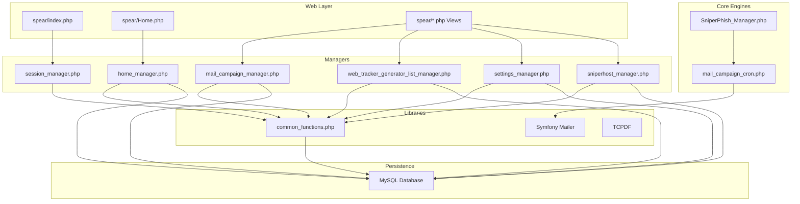
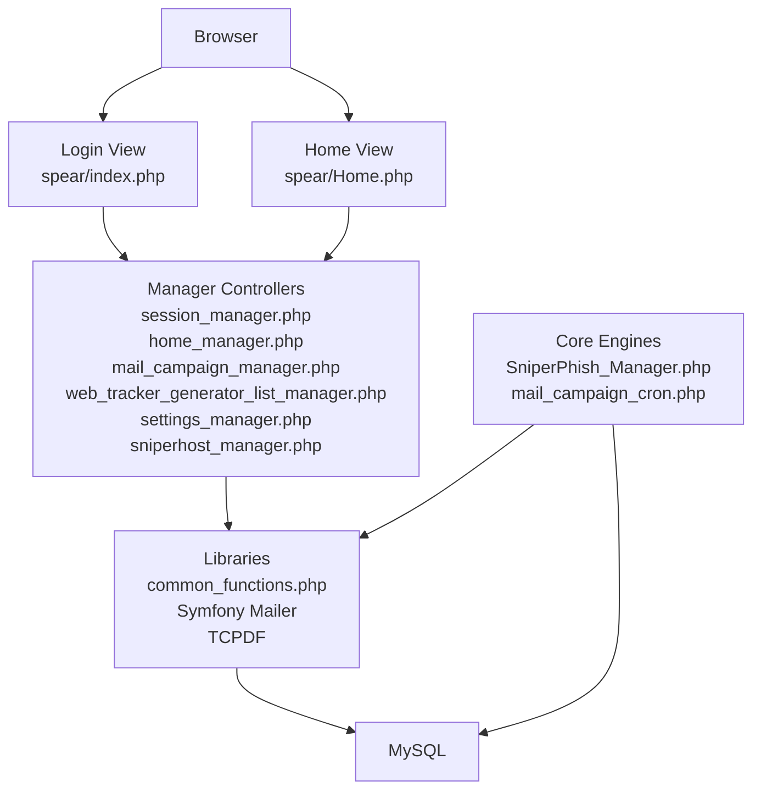
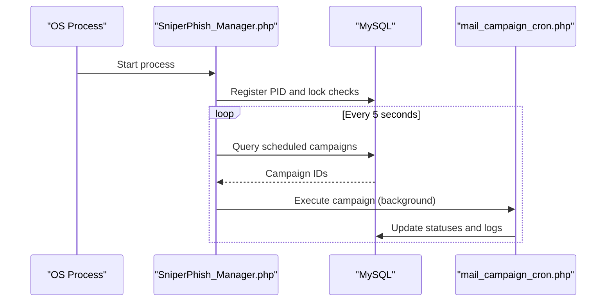
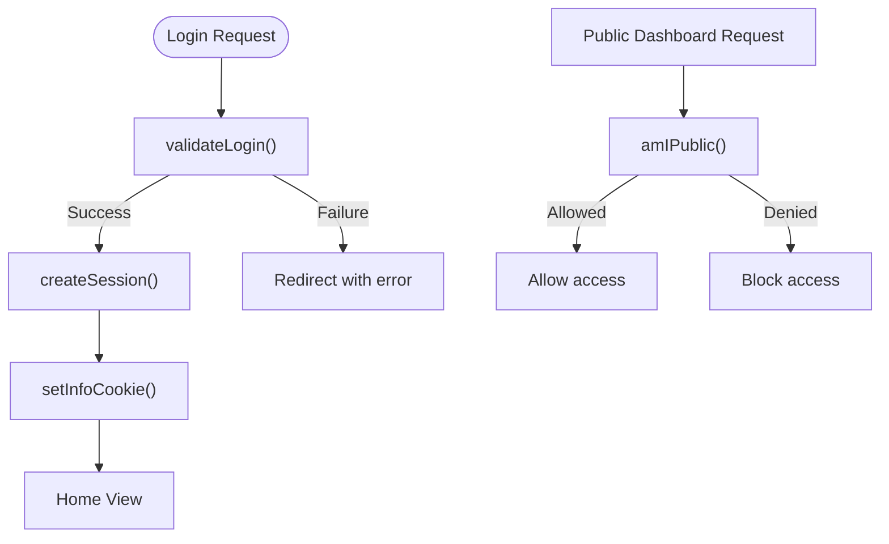
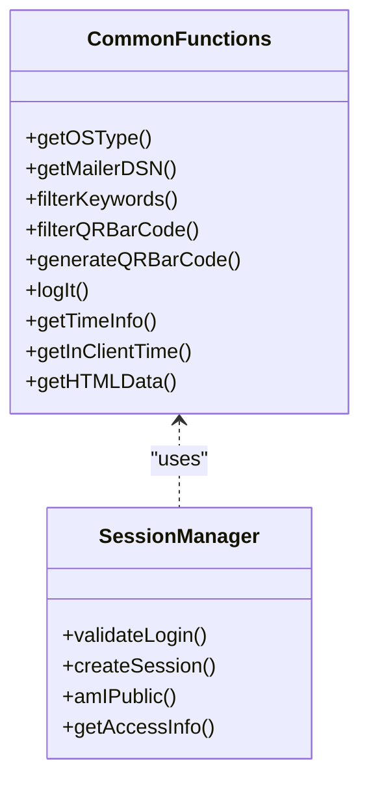
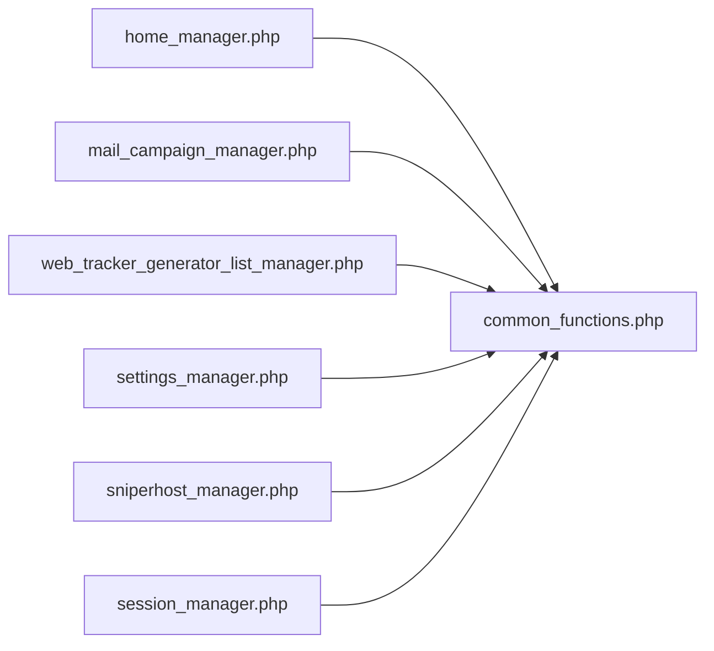
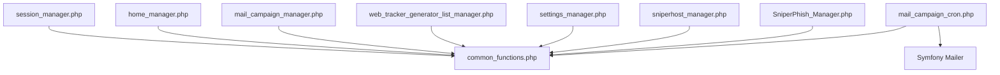
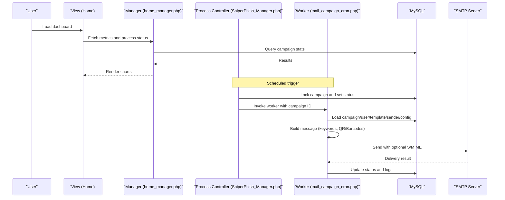

# Architecture Overview

<cite>
**Referenced Files in This Document**
- [README.md](file://README.md)
- [index.php](file://spear/index.php)
- [Home.php](file://spear/Home.php)
- [install.php](file://install.php)
- [SniperPhish_Manager.php](file://spear/core/SniperPhish_Manager.php)
- [mail_campaign_cron.php](file://spear/core/mail_campaign_cron.php)
- [session_manager.php](file://spear/manager/session_manager.php)
- [common_functions.php](file://spear/manager/common_functions.php)
- [home_manager.php](file://spear/manager/home_manager.php)
- [mail_campaign_manager.php](file://spear/manager/mail_campaign_manager.php)
- [settings_manager.php](file://spear/manager/settings_manager.php)
- [web_tracker_generator_list_manager.php](file://spear/manager/web_tracker_generator_list_manager.php)
- [sniperhost_manager.php](file://spear/sniperhost/manager/sniperhost_manager.php)
</cite>

## Table of Contents
1. [Introduction](#introduction)
2. [Project Structure](#project-structure)
3. [Core Components](#core-components)
4. [Architecture Overview](#architecture-overview)
5. [Detailed Component Analysis](#detailed-component-analysis)
6. [Dependency Analysis](#dependency-analysis)
7. [Performance Considerations](#performance-considerations)
8. [Security Considerations](#security-considerations)
9. [System Context and Data Flow](#system-context-and-data-flow)
10. [Troubleshooting Guide](#troubleshooting-guide)
11. [Conclusion](#conclusion)

## Introduction
This document presents the architectural overview of SniperPhish, a full-stack PHP web application designed for security-awareness training via web and email phishing simulations. The system follows a modular manager-based architecture layered over a MySQL backend. It integrates a central process controller for asynchronous mail campaign execution, a robust session and access control subsystem, a database abstraction layer implemented through prepared statements, and a front-end built with jQuery and Bootstrap.

Key goals:
- Provide a clear separation of concerns across presentation, business logic, and persistence.
- Support secure, scalable operations for scheduled mail campaigns and web trackers.
- Offer comprehensive reporting and logging capabilities.
- Maintain a clean MVC-like flow with manager controllers mediating between views and the database.

## Project Structure
The repository organizes code by feature and layer:
- spear/: Web-facing application, including views, scripts, styles, and managers.
- spear/core/: Core background processes and cron orchestration.
- spear/sniperhost/: Additional host utilities for landing pages and file hosting.
- Root-level installer and documentation.

**Diagram sources**
- [index.php:1-188](file://spear/index.php#L1-L188)
- [Home.php:1-169](file://spear/Home.php#L1-L169)
- [SniperPhish_Manager.php:1-46](file://spear/core/SniperPhish_Manager.php#L1-L46)
- [mail_campaign_cron.php:1-364](file://spear/core/mail_campaign_cron.php#L1-L364)
- [session_manager.php:1-244](file://spear/manager/session_manager.php#L1-L244)
- [common_functions.php:1-595](file://spear/manager/common_functions.php#L1-L595)
- [home_manager.php:1-120](file://spear/manager/home_manager.php#L1-L120)
- [mail_campaign_manager.php:1-547](file://spear/manager/mail_campaign_manager.php#L1-L547)
- [web_tracker_generator_list_manager.php:1-220](file://spear/manager/web_tracker_generator_list_manager.php#L1-L220)
- [settings_manager.php:1-474](file://spear/manager/settings_manager.php#L1-L474)
- [sniperhost_manager.php:1-314](file://spear/sniperhost/manager/sniperhost_manager.php#L1-L314)

**Section sources**
- [README.md:1-86](file://README.md#L1-L86)
- [index.php:1-188](file://spear/index.php#L1-L188)
- [Home.php:1-169](file://spear/Home.php#L1-L169)

## Core Components
- Central Process Controller: A long-running process orchestrator that schedules and supervises mail campaign executions.
- Manager Controllers: JSON API endpoints that encapsulate business logic for each functional area (home, mail campaigns, web trackers, settings, sniperhost).
- Session and Access Control: Centralized session management, login validation, and public access controls for dashboards.
- Database Abstraction: Prepared statements and helper functions for SQL operations, time zone conversions, and logging.
- Asynchronous Execution Engine: Per-campaign background workers invoked by the process controller.

**Section sources**
- [SniperPhish_Manager.php:1-46](file://spear/core/SniperPhish_Manager.php#L1-L46)
- [mail_campaign_cron.php:1-364](file://spear/core/mail_campaign_cron.php#L1-L364)
- [session_manager.php:1-244](file://spear/manager/session_manager.php#L1-L244)
- [common_functions.php:1-595](file://spear/manager/common_functions.php#L1-L595)
- [home_manager.php:1-120](file://spear/manager/home_manager.php#L1-L120)
- [mail_campaign_manager.php:1-547](file://spear/manager/mail_campaign_manager.php#L1-L547)
- [web_tracker_generator_list_manager.php:1-220](file://spear/manager/web_tracker_generator_list_manager.php#L1-L220)
- [settings_manager.php:1-474](file://spear/manager/settings_manager.php#L1-L474)
- [sniperhost_manager.php:1-314](file://spear/sniperhost/manager/sniperhost_manager.php#L1-L314)

## Architecture Overview
The system adheres to a layered architecture:
- Presentation Layer: PHP views and static assets (Bootstrap, jQuery).
- Business Logic Layer: Manager controllers handling request routing, validation, and orchestration.
- Persistence Layer: MySQL tables accessed via prepared statements and helper functions.
- Background Processing: Cron-style orchestration for mail campaigns.

**Diagram sources**
- [index.php:1-188](file://spear/index.php#L1-L188)
- [Home.php:1-169](file://spear/Home.php#L1-L169)
- [session_manager.php:1-244](file://spear/manager/session_manager.php#L1-L244)
- [home_manager.php:1-120](file://spear/manager/home_manager.php#L1-L120)
- [mail_campaign_manager.php:1-547](file://spear/manager/mail_campaign_manager.php#L1-L547)
- [web_tracker_generator_list_manager.php:1-220](file://spear/manager/web_tracker_generator_list_manager.php#L1-L220)
- [settings_manager.php:1-474](file://spear/manager/settings_manager.php#L1-L474)
- [sniperhost_manager.php:1-314](file://spear/sniperhost/manager/sniperhost_manager.php#L1-L314)
- [SniperPhish_Manager.php:1-46](file://spear/core/SniperPhish_Manager.php#L1-L46)
- [mail_campaign_cron.php:1-364](file://spear/core/mail_campaign_cron.php#L1-L364)
- [common_functions.php:1-595](file://spear/manager/common_functions.php#L1-L595)

## Detailed Component Analysis

### Central Process Controller (SniperPhish_Manager)
Responsibilities:
- Single-instance enforcement for the process controller.
- Periodic scanning of scheduled mail campaigns.
- Launching per-campaign workers and updating statuses.

**Diagram sources**
- [SniperPhish_Manager.php:1-46](file://spear/core/SniperPhish_Manager.php#L1-L46)
- [mail_campaign_cron.php:1-364](file://spear/core/mail_campaign_cron.php#L1-L364)

**Section sources**
- [SniperPhish_Manager.php:1-46](file://spear/core/SniperPhish_Manager.php#L1-L46)

### Session Management and Access Control
Responsibilities:
- Validate login credentials and maintain sessions.
- Enforce access control for public dashboards.
- Manage cookies and audit logging.

**Diagram sources**
- [session_manager.php:1-244](file://spear/manager/session_manager.php#L1-L244)

**Section sources**
- [session_manager.php:1-244](file://spear/manager/session_manager.php#L1-L244)

### Database Abstraction and Utilities
Responsibilities:
- Provide reusable helpers for time zone conversions, DSN construction, keyword filtering, QR/Barcode generation, and logging.
- Centralize prepared statement patterns and error handling.

**Diagram sources**
- [common_functions.php:1-595](file://spear/manager/common_functions.php#L1-L595)
- [session_manager.php:1-244](file://spear/manager/session_manager.php#L1-L244)

**Section sources**
- [common_functions.php:1-595](file://spear/manager/common_functions.php#L1-L595)

### Manager-Based Control Structure
Responsibilities:
- Home: Dashboard metrics and process control.
- Mail Campaigns: CRUD, scheduling, live status, replies, and report exports.
- Web Trackers: Tracker lifecycle and data export.
- Settings: Users, logs, timestamps, and cleanup.
- SniperHost: Payload and landing page management.

**Diagram sources**
- [home_manager.php:1-120](file://spear/manager/home_manager.php#L1-L120)
- [mail_campaign_manager.php:1-547](file://spear/manager/mail_campaign_manager.php#L1-L547)
- [web_tracker_generator_list_manager.php:1-220](file://spear/manager/web_tracker_generator_list_manager.php#L1-L220)
- [settings_manager.php:1-474](file://spear/manager/settings_manager.php#L1-L474)
- [sniperhost_manager.php:1-314](file://spear/sniperhost/manager/sniperhost_manager.php#L1-L314)
- [session_manager.php:1-244](file://spear/manager/session_manager.php#L1-L244)
- [common_functions.php:1-595](file://spear/manager/common_functions.php#L1-L595)

**Section sources**
- [home_manager.php:1-120](file://spear/manager/home_manager.php#L1-L120)
- [mail_campaign_manager.php:1-547](file://spear/manager/mail_campaign_manager.php#L1-L547)
- [web_tracker_generator_list_manager.php:1-220](file://spear/manager/web_tracker_generator_list_manager.php#L1-L220)
- [settings_manager.php:1-474](file://spear/manager/settings_manager.php#L1-L474)
- [sniperhost_manager.php:1-314](file://spear/sniperhost/manager/sniperhost_manager.php#L1-L314)

## Dependency Analysis
- Managers depend on common_functions.php for shared utilities.
- All managers depend on session_manager.php for authentication and access control.
- Core engines (SniperPhish_Manager and mail_campaign_cron) depend on common_functions.php and communicate with MySQL.
- mail_campaign_cron uses Symfony Mailer for SMTP transport and optional S/MIME signing/encryption.

**Diagram sources**
- [session_manager.php:1-244](file://spear/manager/session_manager.php#L1-L244)
- [common_functions.php:1-595](file://spear/manager/common_functions.php#L1-L595)
- [SniperPhish_Manager.php:1-46](file://spear/core/SniperPhish_Manager.php#L1-L46)
- [mail_campaign_cron.php:1-364](file://spear/core/mail_campaign_cron.php#L1-L364)

**Section sources**
- [mail_campaign_cron.php:1-364](file://spear/core/mail_campaign_cron.php#L1-L364)
- [common_functions.php:1-595](file://spear/manager/common_functions.php#L1-L595)

## Performance Considerations
- Asynchronous execution: Campaigns run in background processes to avoid blocking the web interface.
- Batch operations: Managers use prepared statements and efficient queries to minimize overhead.
- Anti-flood control: Configurable limits and pauses reduce load on SMTP servers.
- Time zone conversions: Centralized helpers prevent repeated conversions and improve accuracy.

[No sources needed since this section provides general guidance]

## Security Considerations
- Authentication: SHA-256 hashed passwords stored in the database; session regeneration on login.
- Session security: HttpOnly, SameSite Strict cookies; session lifetime configured.
- Access control: Public dashboard access controlled via access control records keyed by campaign/tracker identifiers.
- Transport security: Optional peer verification for SMTP connections; S/MIME signing and encryption supported.
- Logging: Comprehensive audit trail for administrative actions and campaign events.

**Section sources**
- [session_manager.php:1-244](file://spear/manager/session_manager.php#L1-L244)
- [mail_campaign_cron.php:1-364](file://spear/core/mail_campaign_cron.php#L1-L364)
- [settings_manager.php:1-474](file://spear/manager/settings_manager.php#L1-L474)

## System Context and Data Flow
High-level data flow:
- User authenticates via the login view and is redirected to the home dashboard.
- Managers handle AJAX requests to fetch metrics, manage campaigns, and export reports.
- The process controller periodically triggers campaign workers that:
  - Resolve campaign, user group, template, sender, and configuration data.
  - Construct messages with keyword substitution and optional QR/Barcodes.
  - Apply S/MIME signing/encryption when configured.
  - Send via Symfony Mailer with anti-flood controls.
  - Record delivery status and open events in the database.

**Diagram sources**
- [Home.php:1-169](file://spear/Home.php#L1-L169)
- [home_manager.php:1-120](file://spear/manager/home_manager.php#L1-L120)
- [SniperPhish_Manager.php:1-46](file://spear/core/SniperPhish_Manager.php#L1-L46)
- [mail_campaign_cron.php:1-364](file://spear/core/mail_campaign_cron.php#L1-L364)

## Troubleshooting Guide
- Installation prerequisites: Verify PHP 8.1+, MySQL, and web server configuration. Use the installer to validate permissions and requirements.
- Session issues: Confirm cookie settings and session regeneration behavior; ensure SameSite and HttpOnly flags are respected.
- Mail delivery failures: Review worker logs, SMTP credentials, and peer verification settings; check retry counts and anti-flood configuration.
- Public dashboard access: Validate access control records and ensure correct tk_id/campaign/tracker linkage.

**Section sources**
- [install.php:1-451](file://install.php#L1-L451)
- [session_manager.php:1-244](file://spear/manager/session_manager.php#L1-L244)
- [mail_campaign_cron.php:1-364](file://spear/core/mail_campaign_cron.php#L1-L364)
- [settings_manager.php:1-474](file://spear/manager/settings_manager.php#L1-L474)

## Conclusion
SniperPhish employs a clear, modular architecture centered around manager controllers and a dedicated process controller for asynchronous operations. The design emphasizes separation of concerns, robust session and access control, and a MySQL-backed persistence layer. With Symfony Mailer and TCPDF integrated for messaging and reporting, the system supports advanced features such as signed/encrypted mail, QR/Barcodes, and comprehensive analytics, all while maintaining security and scalability.