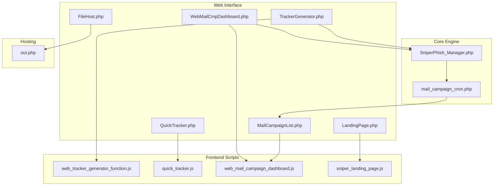
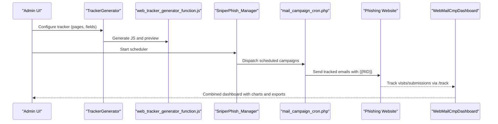
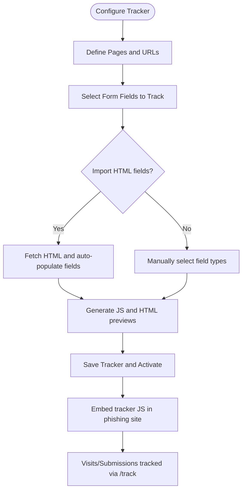
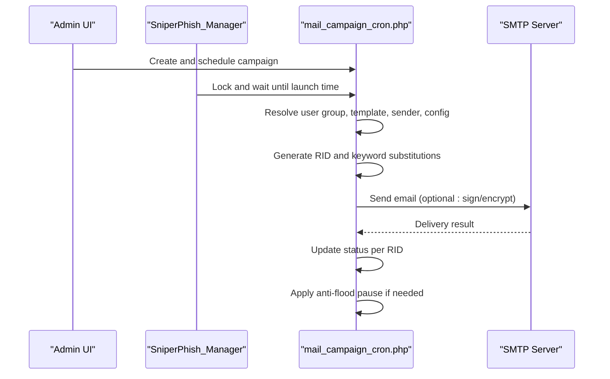
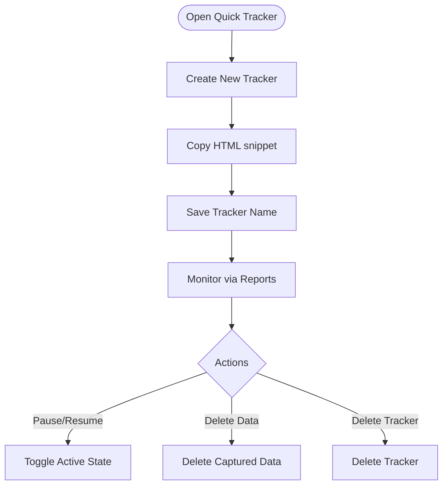
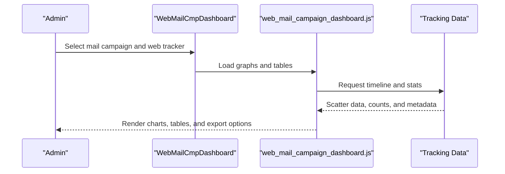
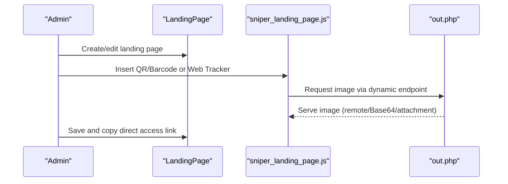
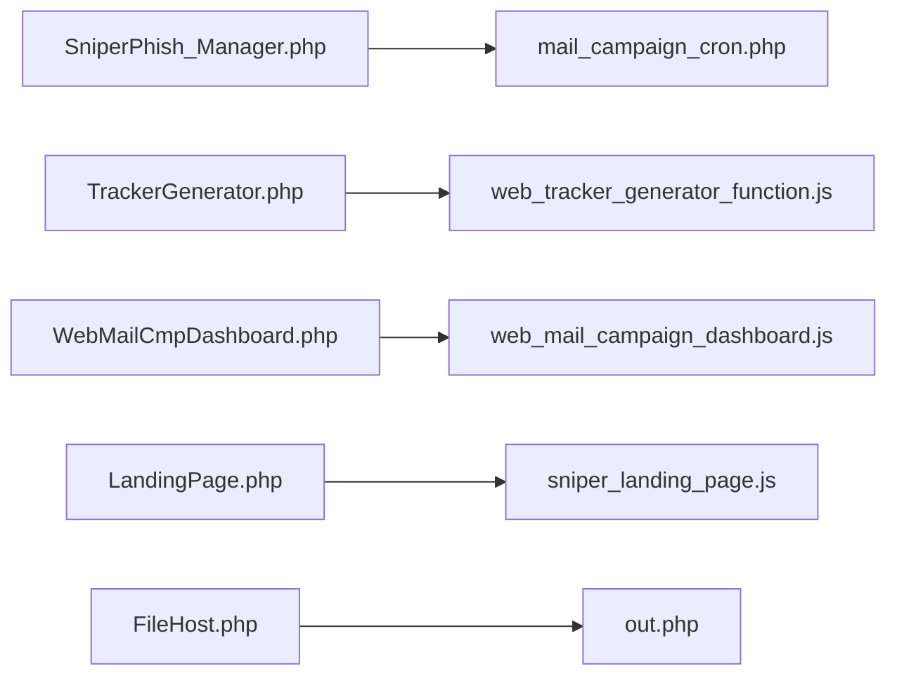

# Feature Overview

<cite>
**Referenced Files in This Document**
- [README.md](file://README.md)
- [SniperPhish_Manager.php](file://spear/core/SniperPhish_Manager.php)
- [mail_campaign_cron.php](file://spear/core/mail_campaign_cron.php)
- [TrackerGenerator.php](file://spear/TrackerGenerator.php)
- [web_tracker_generator_function.js](file://spear/js/web_tracker_generator_function.js)
- [QuickTracker.php](file://spear/QuickTracker.php)
- [quick_tracker.js](file://spear/js/quick_tracker.js)
- [MailCampaignList.php](file://spear/MailCampaignList.php)
- [WebMailCmpDashboard.php](file://spear/WebMailCmpDashboard.php)
- [web_mail_campaign_dashboard.js](file://spear/js/web_mail_campaign_dashboard.js)
- [LandingPage.php](file://spear/sniperhost/LandingPage.php)
- [sniper_landing_page.js](file://spear/sniperhost/js/sniper_landing_page.js)
- [FileHost.php](file://spear/sniperhost/FileHost.php)
- [out.php](file://spear/sniperhost/out.php)
</cite>

## Table of Contents
1. [Introduction](#introduction)
2. [Project Structure](#project-structure)
3. [Core Components](#core-components)
4. [Architecture Overview](#architecture-overview)
5. [Detailed Component Analysis](#detailed-component-analysis)
6. [Dependency Analysis](#dependency-analysis)
7. [Performance Considerations](#performance-considerations)
8. [Troubleshooting Guide](#troubleshooting-guide)
9. [Conclusion](#conclusion)

## Introduction
This document presents a comprehensive feature overview of SniperPhish, a phishing toolkit designed for security professionals to run realistic phishing simulations. It covers the major components and capabilities, including web tracker code generation, email campaign management with scheduling and automation, quick tracker functionality, and combined dashboard reporting for centralized monitoring. Advanced features such as QR/barcode support in emails, signed and encrypted mail capabilities, anti-flood controls, non-ASCII domain support, and the built-in landing page hosting system are documented with practical examples and technical implementation details.

## Project Structure
SniperPhish is organized around a PHP-based web interface with modular frontend and backend components:
- spear/: Core application, including UI pages, JavaScript logic, and backend PHP scripts
- spear/sniperhost/: Built-in landing page and file hosting system
- spear/core/: Scheduler and mail campaign engine
- spear/libs/: Third-party libraries (Symfony Mailer, QR/Barcode, TCPDF)

**Diagram sources**
- [SniperPhish_Manager.php:1-46](file://spear/core/SniperPhish_Manager.php#L1-L46)
- [mail_campaign_cron.php:1-364](file://spear/core/mail_campaign_cron.php#L1-L364)
- [TrackerGenerator.php:1-429](file://spear/TrackerGenerator.php#L1-L429)
- [web_tracker_generator_function.js:1-800](file://spear/js/web_tracker_generator_function.js#L1-L800)
- [QuickTracker.php:1-199](file://spear/QuickTracker.php#L1-L199)
- [quick_tracker.js:1-208](file://spear/js/quick_tracker.js#L1-L208)
- [MailCampaignList.php:1-331](file://spear/MailCampaignList.php#L1-L331)
- [WebMailCmpDashboard.php:1-666](file://spear/WebMailCmpDashboard.php#L1-L666)
- [web_mail_campaign_dashboard.js:1-800](file://spear/js/web_mail_campaign_dashboard.js#L1-L800)
- [LandingPage.php:1-320](file://spear/sniperhost/LandingPage.php#L1-L320)
- [sniper_landing_page.js:1-359](file://spear/sniperhost/js/sniper_landing_page.js#L1-L359)
- [FileHost.php:1-228](file://spear/sniperhost/FileHost.php#L1-L228)
- [out.php:1-38](file://spear/sniperhost/out.php#L1-L38)

**Section sources**
- [README.md:11-86](file://README.md#L11-L86)
- [SniperPhish_Manager.php:1-46](file://spear/core/SniperPhish_Manager.php#L1-L46)
- [mail_campaign_cron.php:1-364](file://spear/core/mail_campaign_cron.php#L1-L364)

## Core Components
- Web Tracker Code Generator: Generates client-side tracking code and preview pages for one or multiple web pages, enabling independent tracking of visits and form submissions.
- Email Campaign Manager: Provides user/group management, sender configuration, templates, scheduling, and automated sending with advanced options.
- Quick Tracker: Rapid deployment tracker for immediate email or web page visit tracking.
- Combined Dashboard: Centralized monitoring combining email and web tracking data with charts, timelines, and export capabilities.
- Landing Page Hosting: Built-in system to create, host, and share landing pages with integrated QR/Barcode insertion and web tracker linking.
- File Hosting: Securely hosts arbitrary files with configurable Content-Type headers and direct access links.

Practical example: Create a web tracker → Add the generated JS to your phishing site → Build an email template with a link to the tracked page → Schedule and launch the campaign → Monitor via the combined dashboard.

**Section sources**
- [README.md:46-67](file://README.md#L46-L67)
- [TrackerGenerator.php:1-429](file://spear/TrackerGenerator.php#L1-L429)
- [QuickTracker.php:1-199](file://spear/QuickTracker.php#L1-L199)
- [MailCampaignList.php:1-331](file://spear/MailCampaignList.php#L1-L331)
- [WebMailCmpDashboard.php:1-666](file://spear/WebMailCmpDashboard.php#L1-L666)
- [LandingPage.php:1-320](file://spear/sniperhost/LandingPage.php#L1-L320)
- [FileHost.php:1-228](file://spear/sniperhost/FileHost.php#L1-L228)

## Architecture Overview
The system orchestrates web and email tracking through a scheduler and mail engine, with UI-driven configuration and reporting.

**Diagram sources**
- [SniperPhish_Manager.php:23-28](file://spear/core/SniperPhish_Manager.php#L23-L28)
- [mail_campaign_cron.php:99-294](file://spear/core/mail_campaign_cron.php#L99-L294)
- [web_tracker_generator_function.js:427-666](file://spear/js/web_tracker_generator_function.js#L427-L666)
- [WebMailCmpDashboard.php:215-287](file://spear/WebMailCmpDashboard.php#L215-L287)

## Detailed Component Analysis

### Web Tracker Code Generation
- Purpose: Generate client-side tracking code and preview pages for multi-page phishing sites, capturing visits and form submissions.
- Key capabilities:
  - Define pages, URLs, and form fields (text, checkbox, radio, textarea, select, submit).
  - Automatic import of HTML fields from a live URL or raw HTML.
  - Preview generation and ZIP packaging for easy deployment.
  - Auto-activation option and webhook URL selection (SP base/current domain/custom).
- Implementation highlights:
  - Frontend wizard builds page/form metadata and generates tracker JS and HTML previews.
  - Tracker JS sets a session cookie, fetches IP info, posts to /track with page, form data, and RID.
  - On form submit, posts page index, form field values, and next page URL (if configured).

**Diagram sources**
- [web_tracker_generator_function.js:135-222](file://spear/js/web_tracker_generator_function.js#L135-L222)
- [web_tracker_generator_function.js:427-666](file://spear/js/web_tracker_generator_function.js#L427-L666)
- [TrackerGenerator.php:130-197](file://spear/TrackerGenerator.php#L130-L197)

**Section sources**
- [web_tracker_generator_function.js:1-800](file://spear/js/web_tracker_generator_function.js#L1-L800)
- [TrackerGenerator.php:1-429](file://spear/TrackerGenerator.php#L1-L429)

### Email Campaign Management and Automation
- Purpose: Create, schedule, and automate email campaigns with advanced configuration and delivery controls.
- Key capabilities:
  - User groups, sender configurations (SMTP), templates, and campaign settings.
  - Scheduling with launch time, message intervals, and retry attempts.
  - Anti-flood control with pause intervals and limits.
  - Signed and encrypted mail using S/MIME.
  - QR/Barcode insertion in emails (inline remote/Base64/attachment).
  - Non-ASCII domain support via DSN configuration.
  - Read receipts and recipient types (TO/CC/BCC).
- Implementation highlights:
  - Scheduler runs continuously, checks scheduled campaigns, locks execution, and starts sending.
  - Per-recipient keyword substitution (RID, MID, NAME, EMAIL, TRACKINGURL, BASEURL).
  - Status tracking per RID with sending status and errors.
  - Optional S/MIME signing and encryption using temporary certificate files.

**Diagram sources**
- [SniperPhish_Manager.php:23-28](file://spear/core/SniperPhish_Manager.php#L23-L28)
- [mail_campaign_cron.php:99-294](file://spear/core/mail_campaign_cron.php#L99-L294)

**Section sources**
- [MailCampaignList.php:1-331](file://spear/MailCampaignList.php#L1-L331)
- [mail_campaign_cron.php:1-364](file://spear/core/mail_campaign_cron.php#L1-L364)
- [README.md:26-40](file://README.md#L26-L40)

### Quick Tracker Functionality
- Purpose: Rapidly deploy a tracker for immediate email or web page visit monitoring.
- Key capabilities:
  - One-click creation of a tracker with a ready-to-use HTML snippet.
  - Save tracker with a name, pause/resume, and delete data or tracker.
  - Direct reporting access per tracker.
- Implementation highlights:
  - Generates an image-based tracker with tid and RID placeholders.
  - Backend manages tracker lifecycle and data deletion.

**Diagram sources**
- [quick_tracker.js:5-49](file://spear/js/quick_tracker.js#L5-L49)
- [QuickTracker.php:75-100](file://spear/QuickTracker.php#L75-L100)

**Section sources**
- [QuickTracker.php:1-199](file://spear/QuickTracker.php#L1-L199)
- [quick_tracker.js:1-208](file://spear/js/quick_tracker.js#L1-L208)

### Combined Dashboard Reporting
- Purpose: Centralized monitoring of both email and web tracking data with charts, timelines, and export options.
- Key capabilities:
  - Select mail campaign and web tracker pair.
  - Live timeline of sent/opened/page visits/form submissions.
  - Overview charts for sent/opened/replied and page visit/form submission statistics.
  - Configurable table columns and export to CSV/PDF/HTML.
  - Public dashboard link sharing with optional access control.
- Implementation highlights:
  - Aggregates data from mail and web sources, merges by RID, and renders interactive charts.
  - Supports “first entry only” vs “all entries” display modes.

**Diagram sources**
- [WebMailCmpDashboard.php:215-287](file://spear/WebMailCmpDashboard.php#L215-L287)
- [web_mail_campaign_dashboard.js:144-287](file://spear/js/web_mail_campaign_dashboard.js#L144-L287)

**Section sources**
- [WebMailCmpDashboard.php:1-666](file://spear/WebMailCmpDashboard.php#L1-L666)
- [web_mail_campaign_dashboard.js:1-800](file://spear/js/web_mail_campaign_dashboard.js#L1-L800)

### QR/Barcode Support in Emails
- Purpose: Embed QR and barcode images directly into email content for interactive links.
- Key capabilities:
  - Insert QR/Barcode inline (remote URL, Base64, or as attachment).
  - Landing page editor integrates QR/Barcode insertion with a dedicated toolbar.
- Implementation highlights:
  - Uses a unified endpoint to generate images dynamically and embeds them in emails or landing pages.

**Section sources**
- [sniper_landing_page.js:15-40](file://spear/sniperhost/js/sniper_landing_page.js#L15-L40)
- [LandingPage.php:101-123](file://spear/sniperhost/LandingPage.php#L101-L123)

### Signed and Encrypted Mail Capabilities
- Purpose: Enhance email authenticity and confidentiality using S/MIME.
- Key capabilities:
  - Optional signing with certificate and private key.
  - Optional encryption with recipient’s certificate.
  - Passphrase-protected private keys supported.
- Implementation highlights:
  - Reads base64-encoded certificates and keys, writes temporary files, and applies Symfony Mailer’s S/MIME signer/encrypter.

**Section sources**
- [mail_campaign_cron.php:241-264](file://spear/core/mail_campaign_cron.php#L241-L264)

### Anti-Flood Controls
- Purpose: Prevent delivery throttling by controlling send rate and applying pauses.
- Key capabilities:
  - Configure limit (messages per batch) and pause duration.
  - Automatic transport restart and sleep cycle.
- Implementation highlights:
  - Enforced during send loop; transport is stopped and restarted after batches.

**Section sources**
- [mail_campaign_cron.php:283-287](file://spear/core/mail_campaign_cron.php#L283-L287)

### Non-ASCII Domain Support
- Purpose: Enable internationalized domain names (IDN) in sender configuration.
- Key capabilities:
  - DSN-based SMTP configuration supports IDN domains.
- Implementation highlights:
  - DSN string is constructed with encoded credentials and server details.

**Section sources**
- [mail_campaign_cron.php:164-165](file://spear/core/mail_campaign_cron.php#L164-L165)

### Landing Page Hosting System
- Purpose: Create, host, and share landing pages with integrated QR/Barcode and web tracker linking.
- Key capabilities:
  - Rich text editor with media insertion and QR/Barcode tools.
  - Direct access links and copy-to-clipboard.
  - Manage multiple landing pages with file naming and timestamps.
- Implementation highlights:
  - Editor inserts QR/Barcode images via dynamic endpoint.
  - Links to web trackers with customizable display styles.

**Diagram sources**
- [LandingPage.php:101-123](file://spear/sniperhost/LandingPage.php#L101-L123)
- [sniper_landing_page.js:281-301](file://spear/sniperhost/js/sniper_landing_page.js#L281-L301)
- [out.php:14-36](file://spear/sniperhost/out.php#L14-L36)

**Section sources**
- [LandingPage.php:1-320](file://spear/sniperhost/LandingPage.php#L1-L320)
- [sniper_landing_page.js:1-359](file://spear/sniperhost/js/sniper_landing_page.js#L1-L359)
- [out.php:1-38](file://spear/sniperhost/out.php#L1-L38)

### File Hosting System
- Purpose: Securely host files with configurable Content-Type headers and direct access links.
- Key capabilities:
  - Upload files, set Content-Type, and generate access links.
  - Manage multiple hosted files with timestamps and actions.
- Implementation highlights:
  - Serves files via out.php with appropriate headers.

**Section sources**
- [FileHost.php:1-228](file://spear/sniperhost/FileHost.php#L1-L228)
- [out.php:26-36](file://spear/sniperhost/out.php#L26-L36)

## Dependency Analysis
- Scheduler and mail engine:
  - SniperPhish_Manager.php periodically queries scheduled campaigns and invokes mail_campaign_cron.php to execute them.
- Tracker generation:
  - TrackerGenerator.php delegates to web_tracker_generator_function.js for building and previewing tracker assets.
- Dashboard:
  - WebMailCmpDashboard.php relies on web_mail_campaign_dashboard.js to render charts and tables.
- Landing page and file hosting:
  - LandingPage.php and FileHost.php communicate with sniperhost_manager and out.php for persistence and serving.

**Diagram sources**
- [SniperPhish_Manager.php:23-28](file://spear/core/SniperPhish_Manager.php#L23-L28)
- [mail_campaign_cron.php:1-364](file://spear/core/mail_campaign_cron.php#L1-L364)
- [web_tracker_generator_function.js:1-800](file://spear/js/web_tracker_generator_function.js#L1-L800)
- [WebMailCmpDashboard.php:1-666](file://spear/WebMailCmpDashboard.php#L1-L666)
- [web_mail_campaign_dashboard.js:1-800](file://spear/js/web_mail_campaign_dashboard.js#L1-L800)
- [LandingPage.php:1-320](file://spear/sniperhost/LandingPage.php#L1-L320)
- [sniper_landing_page.js:1-359](file://spear/sniperhost/js/sniper_landing_page.js#L1-L359)
- [FileHost.php:1-228](file://spear/sniperhost/FileHost.php#L1-L228)
- [out.php:1-38](file://spear/sniperhost/out.php#L1-L38)

**Section sources**
- [SniperPhish_Manager.php:1-46](file://spear/core/SniperPhish_Manager.php#L1-L46)
- [mail_campaign_cron.php:1-364](file://spear/core/mail_campaign_cron.php#L1-L364)
- [web_tracker_generator_function.js:1-800](file://spear/js/web_tracker_generator_function.js#L1-L800)
- [web_mail_campaign_dashboard.js:1-800](file://spear/js/web_mail_campaign_dashboard.js#L1-L800)
- [sniper_landing_page.js:1-359](file://spear/sniperhost/js/sniper_landing_page.js#L1-L359)
- [out.php:1-38](file://spear/sniperhost/out.php#L1-L38)

## Performance Considerations
- Scheduler efficiency: The continuous loop checks for scheduled campaigns every few seconds and locks execution to prevent concurrent runs.
- Email throughput: Anti-flood controls and randomized delays between sends reduce the risk of throttling while maintaining steady delivery.
- Tracker overhead: Minimal client-side footprint with lightweight POST requests to /track; IP lookup is asynchronous and falls back gracefully.
- Dashboard rendering: Charts and tables are rendered client-side; large datasets may benefit from limiting “all entries” display mode.

[No sources needed since this section provides general guidance]

## Troubleshooting Guide
- Campaign not starting:
  - Verify scheduled time and status transitions; ensure the scheduler is running and the campaign is unlocked.
- Email delivery failures:
  - Review per-RID status updates and error messages; check SMTP credentials and peer verification settings.
- Tracker not recording submissions:
  - Confirm the tracker JS is included in the page head and the page URL includes the required RID parameter.
- QR/Barcode not appearing:
  - Ensure the dynamic endpoint is reachable and the correct insertion method is used (remote/Base64/attachment).
- Anti-flood pauses:
  - Adjust limits and pause durations to balance speed and reliability.

**Section sources**
- [SniperPhish_Manager.php:23-28](file://spear/core/SniperPhish_Manager.php#L23-L28)
- [mail_campaign_cron.php:307-323](file://spear/core/mail_campaign_cron.php#L307-L323)
- [web_tracker_generator_function.js:520-539](file://spear/js/web_tracker_generator_function.js#L520-L539)

## Conclusion
SniperPhish delivers a robust, integrated solution for designing and executing comprehensive phishing simulations. Its web tracker generator, automated email campaigns, quick tracker, and combined dashboard provide end-to-end visibility into user interactions across both web and email channels. Advanced features such as QR/Barcode insertion, S/MIME signing/encryption, anti-flood controls, and non-ASCII domain support further enhance realism and operational security. The built-in landing page and file hosting systems streamline content creation and distribution, enabling efficient and scalable phishing exercises.