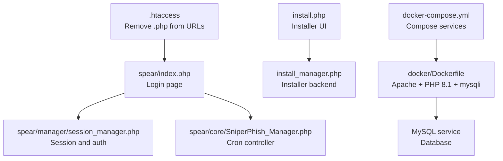
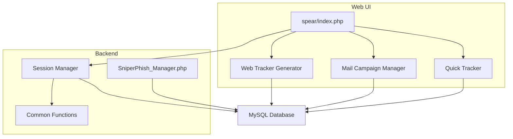
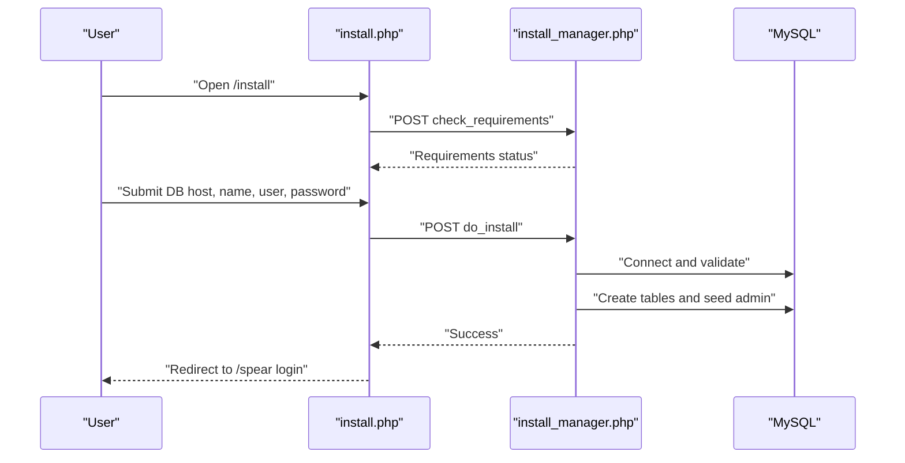
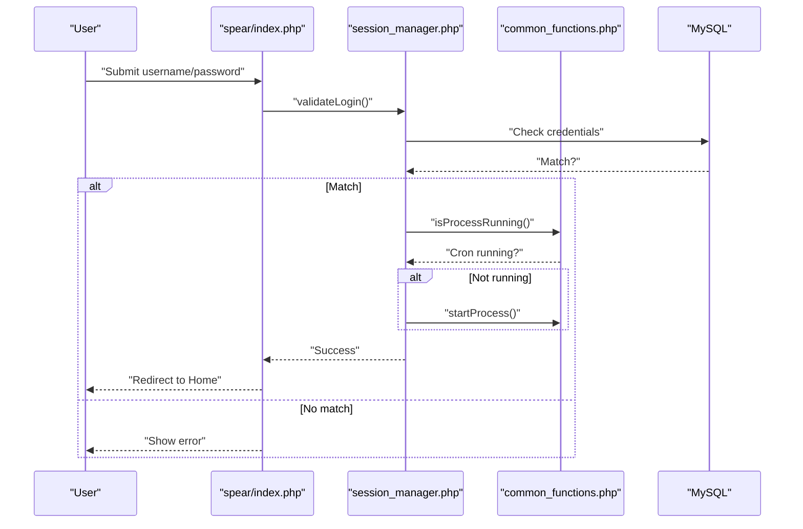
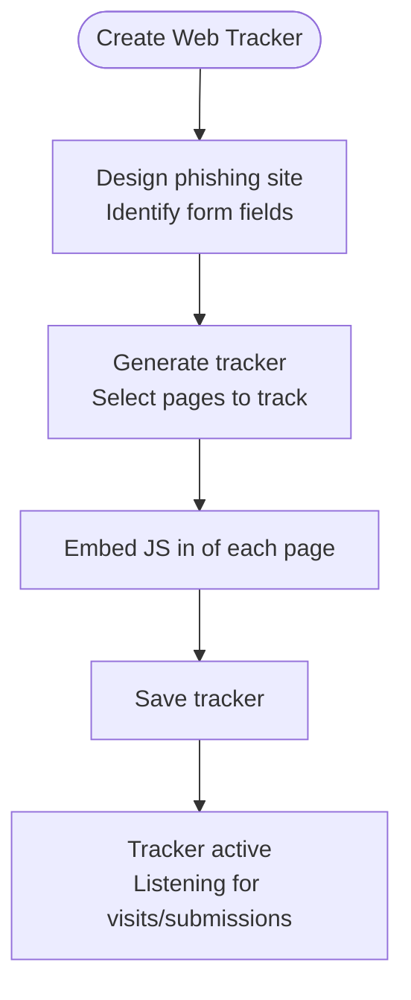
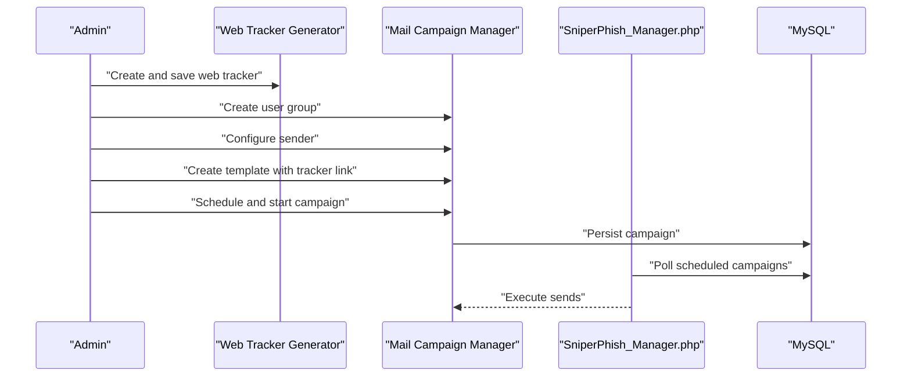
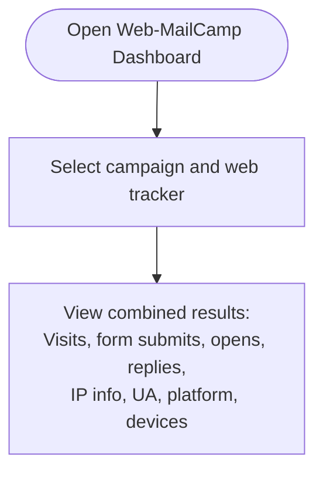
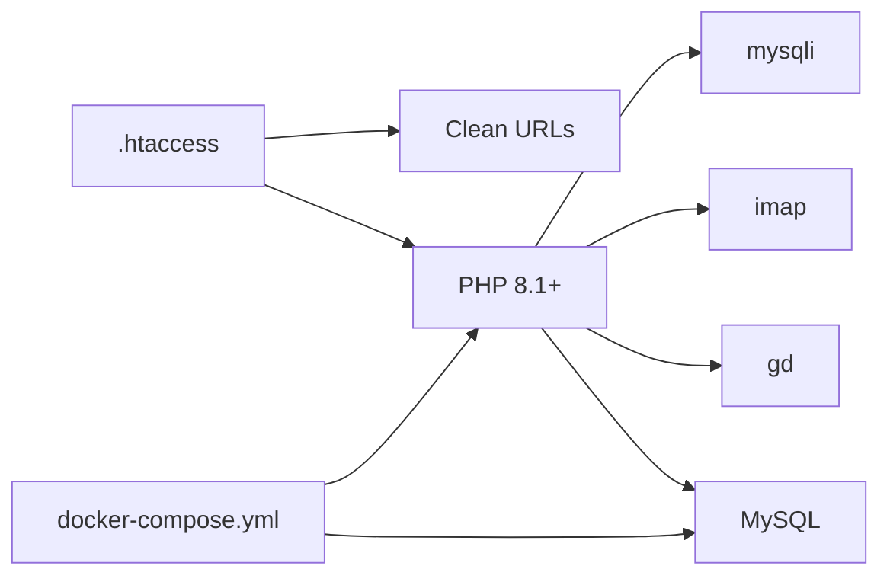

# Getting Started

<cite>
**Referenced Files in This Document**
- [README.md](file://README.md)
- [install.php](file://install.php)
- [install_manager.php](file://install_manager.php)
- [docker-compose.yml](file://docker-compose.yml)
- [docker/Dockerfile](file://docker/Dockerfile)
- [.htaccess](file://.htaccess)
- [spear/index.php](file://spear/index.php)
- [spear/manager/session_manager.php](file://spear/manager/session_manager.php)
- [spear/manager/common_functions.php](file://spear/manager/common_functions.php)
- [spear/core/SniperPhish_Manager.php](file://spear/core/SniperPhish_Manager.php)
- [spear/manager/web_tracker_generator_list_manager.php](file://spear/manager/web_tracker_generator_list_manager.php)
- [spear/manager/mail_campaign_manager.php](file://spear/manager/mail_campaign_manager.php)
- [spear/manager/quick_tracker_manager.php](file://spear/manager/quick_tracker_manager.php)
</cite>

## Table of Contents
1. [Introduction](#introduction)
2. [Project Structure](#project-structure)
3. [Core Components](#core-components)
4. [Architecture Overview](#architecture-overview)
5. [Detailed Component Analysis](#detailed-component-analysis)
6. [Dependency Analysis](#dependency-analysis)
7. [Performance Considerations](#performance-considerations)
8. [Troubleshooting Guide](#troubleshooting-guide)
9. [Conclusion](#conclusion)
10. [Appendices](#appendices)

## Introduction
This guide helps new users quickly set up and begin using SniperPhish to run phishing simulations. It covers prerequisites, installation via the built-in installer, initial login, and a quick-start workflow to create a web tracker, design a phishing site, launch a mail campaign, and view combined results.

## Project Structure
SniperPhish is organized around a web root with:
- A web-accessible UI under spear/
- Installer pages at the web root
- A Docker-based development stack for easy setup
- A .htaccess file to remove .php extensions from URLs

**Diagram sources**
- [.htaccess:1-5](file://.htaccess#L1-L5)
- [spear/index.php:1-188](file://spear/index.php#L1-L188)
- [spear/manager/session_manager.php:1-244](file://spear/manager/session_manager.php#L1-L244)
- [install.php:1-451](file://install.php#L1-L451)
- [install_manager.php:1-784](file://install_manager.php#L1-L784)
- [docker-compose.yml:1-38](file://docker-compose.yml#L1-L38)
- [docker/Dockerfile:1-10](file://docker/Dockerfile#L1-L10)
- [spear/core/SniperPhish_Manager.php:1-46](file://spear/core/SniperPhish_Manager.php#L1-L46)

**Section sources**
- [README.md:11-25](file://README.md#L11-L25)
- [.htaccess:1-5](file://.htaccess#L1-L5)
- [docker-compose.yml:1-38](file://docker-compose.yml#L1-L38)
- [docker/Dockerfile:1-10](file://docker/Dockerfile#L1-L10)

## Core Components
- Web tracker: Generates JavaScript and HTML to track visits and form submissions on your phishing site.
- Mail campaign: Manages user groups, templates, sender configurations, scheduling, and delivery.
- Combined dashboard: Correlates web and email events for unified reporting.
- Cron engine: Background process that executes scheduled mail campaigns.

Key terminology used consistently:
- Web tracker
- Mail campaign
- Phishing simulation

**Section sources**
- [README.md:26-40](file://README.md#L26-L40)
- [spear/manager/web_tracker_generator_list_manager.php:1-220](file://spear/manager/web_tracker_generator_list_manager.php#L1-L220)
- [spear/manager/mail_campaign_manager.php:1-547](file://spear/manager/mail_campaign_manager.php#L1-L547)
- [spear/core/SniperPhish_Manager.php:1-46](file://spear/core/SniperPhish_Manager.php#L1-L46)

## Architecture Overview
The system comprises:
- Frontend UI (spear/)
- Installer (root-level install.php and install_manager.php)
- Session and authentication (spear/manager/session_manager.php)
- Core cron controller (spear/core/SniperPhish_Manager.php)
- Database (MySQL)

**Diagram sources**
- [spear/index.php:1-188](file://spear/index.php#L1-L188)
- [spear/manager/session_manager.php:1-244](file://spear/manager/session_manager.php#L1-L244)
- [spear/manager/common_functions.php:1-595](file://spear/manager/common_functions.php#L1-L595)
- [spear/core/SniperPhish_Manager.php:1-46](file://spear/core/SniperPhish_Manager.php#L1-L46)
- [spear/manager/web_tracker_generator_list_manager.php:1-220](file://spear/manager/web_tracker_generator_list_manager.php#L1-L220)
- [spear/manager/mail_campaign_manager.php:1-547](file://spear/manager/mail_campaign_manager.php#L1-L547)
- [spear/manager/quick_tracker_manager.php:1-298](file://spear/manager/quick_tracker_manager.php#L1-L298)

## Detailed Component Analysis

### Installation and Setup
Follow these steps to install and launch SniperPhish:

1. Place the repository in your web server’s document root.
2. Ensure your web server supports removing .php from URLs via .htaccess.
3. Open the installation page in your browser and follow the prompts.
4. After successful installation, log in to the admin panel.

Initial credentials:
- Default admin account: Username: admin, Password: sniperphish

**Diagram sources**
- [install.php:144-229](file://install.php#L144-L229)
- [install_manager.php:22-87](file://install_manager.php#L22-L87)
- [install_manager.php:110-162](file://install_manager.php#L110-L162)
- [install_manager.php:164-178](file://install_manager.php#L164-L178)

**Section sources**
- [README.md:19-24](file://README.md#L19-L24)
- [install.php:1-451](file://install.php#L1-L451)
- [install_manager.php:1-784](file://install_manager.php#L1-L784)
- [.htaccess:1-5](file://.htaccess#L1-L5)

### Authentication and Login
- The login page validates credentials against the database and starts the cron process if not running.
- Sessions are managed with strict cookie settings and automatic cron startup.

**Diagram sources**
- [spear/index.php:8-14](file://spear/index.php#L8-L14)
- [spear/manager/session_manager.php:17-33](file://spear/manager/session_manager.php#L17-L33)
- [spear/manager/session_manager.php:27-28](file://spear/manager/session_manager.php#L27-L28)
- [spear/manager/common_functions.php:37-85](file://spear/manager/common_functions.php#L37-L85)

**Section sources**
- [spear/index.php:1-188](file://spear/index.php#L1-L188)
- [spear/manager/session_manager.php:1-244](file://spear/manager/session_manager.php#L1-L244)
- [spear/manager/common_functions.php:1-595](file://spear/manager/common_functions.php#L1-L595)

### Web Tracker Workflow
- Design your phishing site and identify form fields to track.
- Generate a web tracker and embed the provided JavaScript in each page head.
- Save the tracker; it becomes active and records visits and form submissions.

**Diagram sources**
- [README.md:46-54](file://README.md#L46-L54)
- [spear/manager/web_tracker_generator_list_manager.php:44-69](file://spear/manager/web_tracker_generator_list_manager.php#L44-L69)

**Section sources**
- [README.md:46-54](file://README.md#L46-L54)
- [spear/manager/web_tracker_generator_list_manager.php:1-220](file://spear/manager/web_tracker_generator_list_manager.php#L1-L220)

### Mail Campaign Workflow
- Create a user group with targets.
- Configure a sender (SMTP/DSN).
- Create an email template and insert a link to your web tracker.
- Schedule and start the campaign.

**Diagram sources**
- [spear/manager/web_tracker_generator_list_manager.php:44-69](file://spear/manager/web_tracker_generator_list_manager.php#L44-L69)
- [spear/manager/mail_campaign_manager.php:62-86](file://spear/manager/mail_campaign_manager.php#L62-L86)
- [spear/core/SniperPhish_Manager.php:23-28](file://spear/core/SniperPhish_Manager.php#L23-L28)

**Section sources**
- [README.md:56-61](file://README.md#L56-L61)
- [spear/manager/mail_campaign_manager.php:1-547](file://spear/manager/mail_campaign_manager.php#L1-L547)
- [spear/core/SniperPhish_Manager.php:1-46](file://spear/core/SniperPhish_Manager.php#L1-L46)

### Combined Results
- Select a campaign and associated web tracker in the Web-MailCamp Dashboard.
- View combined metrics for visits, form submissions, opens, replies, and device/platform data.

**Diagram sources**
- [README.md:65-67](file://README.md#L65-L67)

**Section sources**
- [README.md:65-67](file://README.md#L65-L67)

### Quick Tracker
- Use the Quick Tracker module for rapid tracking of links or pages without building a full web tracker.
- Start, pause, and export reports for quick insights.

**Section sources**
- [spear/manager/quick_tracker_manager.php:1-298](file://spear/manager/quick_tracker_manager.php#L1-L298)

## Dependency Analysis
- Web server must support removing .php from URLs via .htaccess.
- PHP 8.1+ with mysqli, imap, and gd extensions.
- MySQL database for persistent storage.
- Optional Docker Compose stack for local development.

**Diagram sources**
- [install_manager.php:22-87](file://install_manager.php#L22-L87)
- [.htaccess:1-5](file://.htaccess#L1-L5)
- [docker-compose.yml:1-38](file://docker-compose.yml#L1-L38)
- [docker/Dockerfile:1-10](file://docker/Dockerfile#L1-L10)

**Section sources**
- [README.md:14-18](file://README.md#L14-L18)
- [install_manager.php:22-87](file://install_manager.php#L22-L87)
- [.htaccess:1-5](file://.htaccess#L1-L5)
- [docker-compose.yml:1-38](file://docker-compose.yml#L1-L38)
- [docker/Dockerfile:1-10](file://docker/Dockerfile#L1-L10)

## Performance Considerations
- Keep PHP max execution time unlimited for long-running tasks.
- Ensure cron is running to avoid duplicate processes and to handle scheduled campaigns.
- Use Docker Compose for consistent environments and reduced setup overhead.

**Section sources**
- [spear/core/SniperPhish_Manager.php:1-6](file://spear/core/SniperPhish_Manager.php#L1-L6)
- [spear/manager/common_functions.php:37-85](file://spear/manager/common_functions.php#L37-L85)

## Troubleshooting Guide
Common issues and resolutions:
- Installation fails due to missing permissions:
  - Ensure writable permissions for spear/config, spear/uploads, and related payload/host directories.
- Database connection errors:
  - Verify DB host, name, username, and password during installation.
- Clean URLs not working:
  - Confirm .htaccess is present and supported by your web server; the installer checks this.
- Cron not starting:
  - The session manager starts the cron automatically after successful login; verify OS-specific commands are available (tasklist/findstr on Windows; ps/grep/awk on Linux).
- Default admin credentials:
  - Use the default admin account until you change the password.

**Section sources**
- [install_manager.php:89-108](file://install_manager.php#L89-L108)
- [install_manager.php:120-124](file://install_manager.php#L120-L124)
- [install.php:173-185](file://install.php#L173-L185)
- [spear/manager/session_manager.php:26-28](file://spear/manager/session_manager.php#L26-L28)
- [README.md:24-24](file://README.md#L24-L24)

## Conclusion
You are now ready to install SniperPhish, log in, and begin creating web trackers and mail campaigns. Use the quick-start workflow to design a phishing site, generate a tracker, compose an email campaign, and view combined results. For local development, the Docker Compose setup streamlines environment provisioning.

## Appendices

### Quick Start Checklist
- Install prerequisites: PHP 8.1+, MySQL, web server with clean URLs.
- Run the installer and log in with default credentials.
- Create a web tracker and embed it in your phishing site.
- Build a user group, configure a sender, and create a template linking to the tracker.
- Schedule and start the campaign; monitor results in the combined dashboard.

**Section sources**
- [README.md:19-24](file://README.md#L19-L24)
- [README.md:46-67](file://README.md#L46-L67)