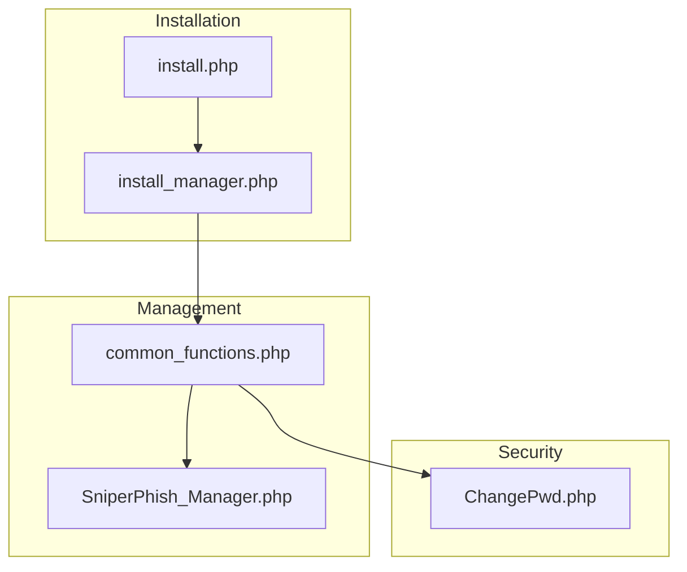
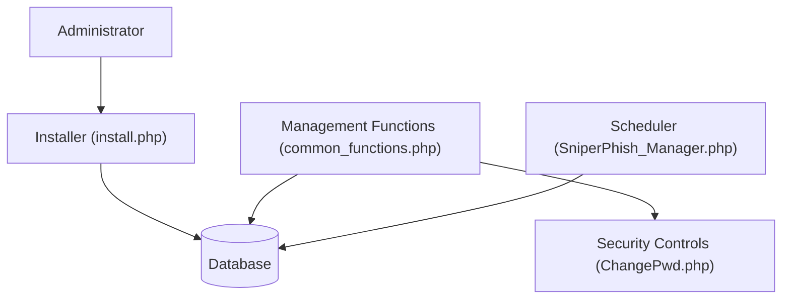
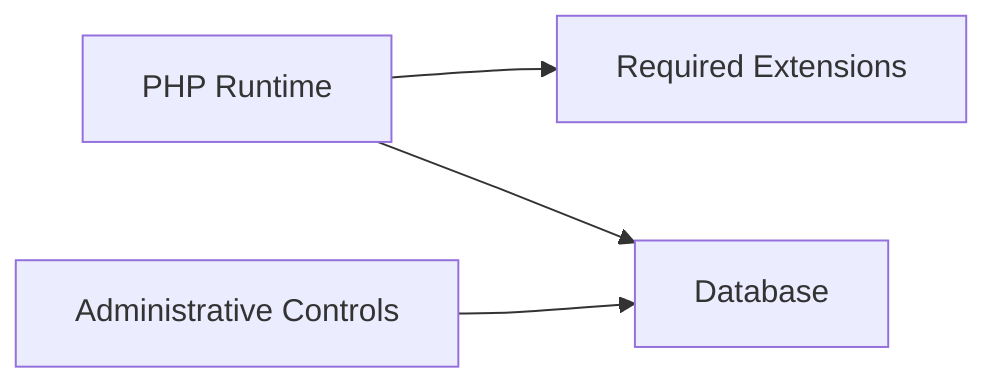

# Legal and Ethical Considerations

<cite>
**Referenced Files in This Document**
- [README.md](file://README.md)
- [install.php](file://install.php)
- [install_manager.php](file://install_manager.php)
- [common_functions.php](file://spear/manager/common_functions.php)
- [SniperPhish_Manager.php](file://spear/core/SniperPhish_Manager.php)
- [ChangePwd.php](file://spear/ChangePwd.php)
</cite>

## Table of Contents
1. [Introduction](#introduction)
2. [Project Structure](#project-structure)
3. [Core Components](#core-components)
4. [Architecture Overview](#architecture-overview)
5. [Detailed Component Analysis](#detailed-component-analysis)
6. [Dependency Analysis](#dependency-analysis)
7. [Performance Considerations](#performance-considerations)
8. [Troubleshooting Guide](#troubleshooting-guide)
9. [Conclusion](#conclusion)
10. [Appendices](#appendices)

## Introduction
This document outlines the legal and ethical considerations for responsibly operating SniperPhish. It emphasizes the critical importance of obtaining proper authorization from target organizations, restricting use to professional security assessments, and maintaining strict confidentiality of test results. It also covers liability considerations, best practices for responsible disclosure, and recommended policies for authorized testing environments. The guidance is grounded in the tool’s stated purpose and documented capabilities.

## Project Structure
SniperPhish is a web-based phishing simulation toolkit designed for penetration testers and security professionals. The repository includes:
- Installation and setup scripts
- Management and utility functions
- Core automation and scheduling components
- Front-end assets and dashboards for campaign creation and reporting

**Diagram sources**
- [install.php:1-451](file://install.php#L1-L451)
- [install_manager.php:1-784](file://install_manager.php#L1-L784)
- [common_functions.php:1-595](file://spear/manager/common_functions.php#L1-L595)
- [SniperPhish_Manager.php:1-46](file://spear/core/SniperPhish_Manager.php#L1-L46)
- [ChangePwd.php:1-36](file://spear/ChangePwd.php#L1-L36)

**Section sources**
- [README.md:11-12](file://README.md#L11-L12)
- [install.php:19-24](file://install.php#L19-L24)
- [install_manager.php:110-162](file://install_manager.php#L110-L162)

## Core Components
- Purpose and intended use: The project is explicitly described as a phishing toolkit for penetration testers and security professionals to enhance user awareness by simulating real-world phishing attacks.
- Authorization reminder: The documentation explicitly reminds users to obtain prior permission from the targeted organization to avoid legal implications.
- Professional context: The tool is positioned for professional security assessments and awareness training.

These statements establish the ethical and legal baseline for use.

**Section sources**
- [README.md:11-12](file://README.md#L11-L12)
- [README.md:46-67](file://README.md#L46-L67)

## Architecture Overview
The system architecture supports authorized, controlled testing with administrative controls and logging.

**Diagram sources**
- [install.php:19-24](file://install.php#L19-L24)
- [install_manager.php:110-162](file://install_manager.php#L110-L162)
- [common_functions.php:101-112](file://spear/manager/common_functions.php#L101-L112)
- [SniperPhish_Manager.php:8-28](file://spear/core/SniperPhish_Manager.php#L8-L28)
- [ChangePwd.php:4-9](file://spear/ChangePwd.php#L4-L9)

## Detailed Component Analysis

### Authorization and Consent
- Explicit reminder: The documentation states that the tool is designed for professional phishing exercises and that users should obtain prior permission from the targeted organization.
- Professional context: The tool is intended for penetration testers and security professionals, underscoring the necessity of formal authorization and adherence to organizational policies.

Best practices:
- Obtain written authorization from the organization before initiating any test.
- Define scope, duration, and acceptable use boundaries.
- Ensure stakeholders understand the purpose and safeguards.

**Section sources**
- [README.md:11-12](file://README.md#L11-L12)

### Authorized Testing Environments and Policies
- Installation and setup: The installer checks environment requirements and writes configuration files, indicating a controlled deployment process suitable for authorized environments.
- Logging and audit trail: Management functions include logging activities, which can support post-test review and compliance verification.

Recommended policy elements:
- Define roles and responsibilities for test execution.
- Establish governance for campaign creation, scheduling, and reporting.
- Enforce access controls and secure storage of credentials and test artifacts.

**Section sources**
- [install.php:56-86](file://install.php#L56-L86)
- [install_manager.php:110-162](file://install_manager.php#L110-L162)
- [common_functions.php:576-586](file://spear/manager/common_functions.php#L576-L586)

### Confidentiality and Data Handling
- Tracking and reporting: The system collects telemetry from phishing websites and email campaigns, which must be handled confidentially.
- Access control: Password reset flow validates tokens to prevent unauthorized access to sensitive functions.

Guidelines:
- Limit access to test data to authorized personnel only.
- Apply data minimization and retention policies.
- Secure logs and reports according to organizational standards.

**Section sources**
- [README.md:26-39](file://README.md#L26-L39)
- [common_functions.php:576-586](file://spear/manager/common_functions.php#L576-L586)
- [ChangePwd.php:4-9](file://spear/ChangePwd.php#L4-L9)

### Liability and Responsible Disclosure
- Tool purpose: The toolkit is designed for legitimate security assessments and awareness training.
- Misuse warning: The educational and defensive purposes must be prioritized; misuse for malicious activities is strongly discouraged.

Responsible disclosure practices:
- Report findings to designated stakeholders within the organization.
- Provide remediation recommendations alongside findings.
- Avoid publishing sensitive details publicly without authorization.

**Section sources**
- [README.md:11-12](file://README.md#L11-L12)
- [README.md:26-39](file://README.md#L26-L39)

### Best Practices for Campaign Execution
- Scope alignment: Ensure campaigns align with documented authorization and organizational policies.
- Anti-flood controls: Respect rate limits and anti-flood configurations to minimize unintended impact.
- Reporting and lessons learned: Use built-in reporting capabilities to derive insights for awareness and remediation.

**Section sources**
- [README.md:36-39](file://README.md#L36-L39)
- [README.md:26-32](file://README.md#L26-L32)

## Dependency Analysis
The system depends on:
- PHP runtime and required extensions for installation and operation.
- Database connectivity for storing configuration, campaigns, and telemetry.
- Administrative controls for secure access and session management.

**Diagram sources**
- [install_manager.php:22-87](file://install_manager.php#L22-L87)
- [install_manager.php:110-162](file://install_manager.php#L110-L162)
- [common_functions.php:101-112](file://spear/manager/common_functions.php#L101-L112)

**Section sources**
- [install_manager.php:22-87](file://install_manager.php#L22-L87)
- [install_manager.php:110-162](file://install_manager.php#L110-L162)
- [common_functions.php:101-112](file://spear/manager/common_functions.php#L101-L112)

## Performance Considerations
- Controlled execution: The scheduler runs continuously and executes scheduled campaigns, emphasizing the need for proper resource allocation and monitoring in authorized environments.
- Logging overhead: Logging activities can increase disk usage; configure retention policies accordingly.

[No sources needed since this section provides general guidance]

## Troubleshooting Guide
- Installation checks: The installer validates environment requirements and permissions. Resolve any reported issues before proceeding.
- Scheduler status: Use management functions to verify the status of the background process and restart if necessary.
- Session management: The system enforces idle timeouts and secure session handling to protect against unauthorized access.

**Section sources**
- [install.php:56-86](file://install.php#L56-L86)
- [install_manager.php:110-162](file://install_manager.php#L110-L162)
- [common_functions.php:23-77](file://spear/manager/common_functions.php#L23-L77)
- [common_functions.php:576-586](file://spear/manager/common_functions.php#L576-L586)

## Conclusion
SniperPhish is a powerful tool for security-awareness training and professional assessments when used responsibly. Its documentation explicitly emphasizes the need for authorization and positions it for use by qualified security professionals. By establishing clear policies, obtaining proper consent, maintaining confidentiality, and adhering to responsible disclosure practices, organizations can leverage the toolkit safely and effectively while minimizing risk.

[No sources needed since this section summarizes without analyzing specific files]

## Appendices

### References to Industry Standards and Compliance
- Professional certifications and standards commonly applied to security assessments include frameworks such as ISO/IEC 27001, NIST Cybersecurity Framework, and standards for secure software development and testing. Organizations should align their internal policies with applicable standards and regulatory requirements.

[No sources needed since this section provides general guidance]