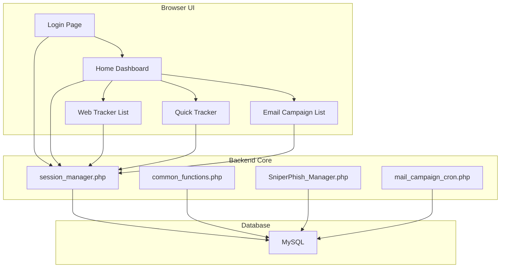
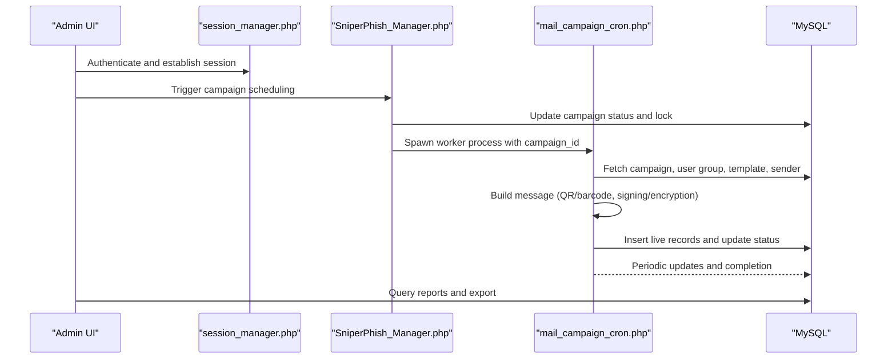
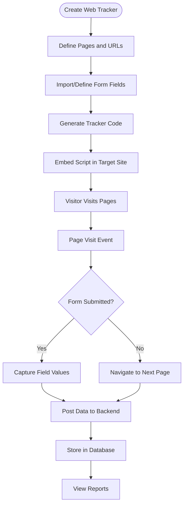
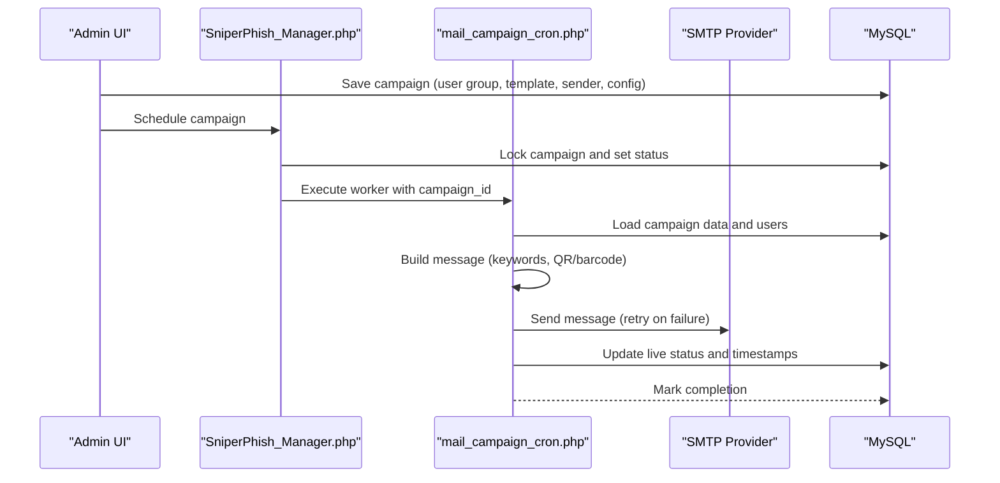
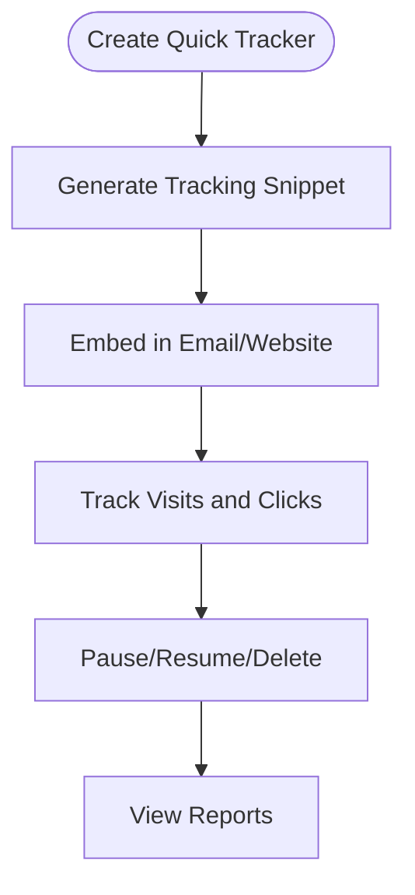
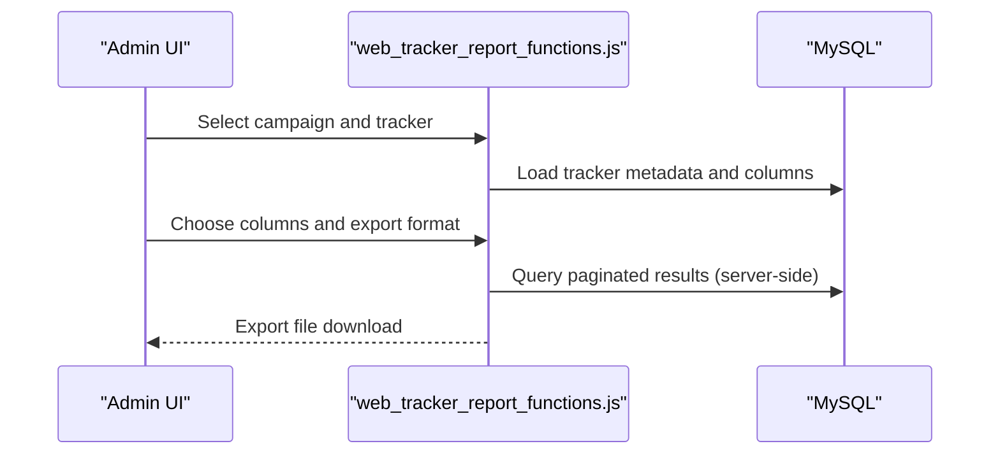
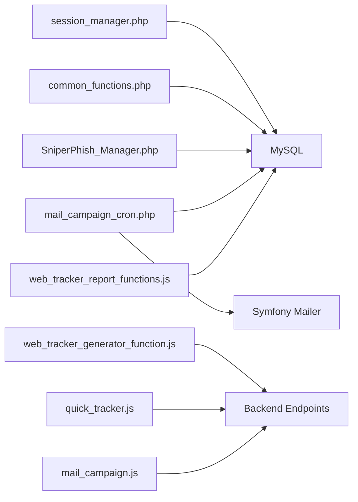

# Project Overview

<cite>
**Referenced Files in This Document**
- [README.md](file://README.md)
- [index.php](file://spear/index.php)
- [install.php](file://install.php)
- [install_manager.php](file://install_manager.php)
- [SniperPhish_Manager.php](file://spear/core/SniperPhish_Manager.php)
- [mail_campaign_cron.php](file://spear/core/mail_campaign_cron.php)
- [session_manager.php](file://spear/manager/session_manager.php)
- [common_functions.php](file://spear/manager/common_functions.php)
- [Home.php](file://spear/Home.php)
- [TrackerList.php](file://spear/TrackerList.php)
- [QuickTracker.php](file://spear/QuickTracker.php)
- [MailCampaignList.php](file://spear/MailCampaignList.php)
- [web_tracker_generator_function.js](file://spear/js/web_tracker_generator_function.js)
- [quick_tracker.js](file://spear/js/quick_tracker.js)
- [mail_campaign.js](file://spear/js/mail_campaign.js)
- [web_tracker_report_functions.js](file://spear/js/web_tracker_report_functions.js)
</cite>

## Table of Contents
1. [Introduction](#introduction)
2. [Project Structure](#project-structure)
3. [Core Components](#core-components)
4. [Architecture Overview](#architecture-overview)
5. [Detailed Component Analysis](#detailed-component-analysis)
6. [Dependency Analysis](#dependency-analysis)
7. [Performance Considerations](#performance-considerations)
8. [Troubleshooting Guide](#troubleshooting-guide)
9. [Conclusion](#conclusion)

## Introduction
SniperPhish is a comprehensive phishing simulation toolkit designed for penetration testers and security professionals. It enables realistic user awareness training by combining a web tracking system with email campaigns. Users create a web tracker to monitor visits and form submissions on phishing websites, then pair it with a mail campaign that links recipients to those sites. The platform centralizes tracking so both email engagement and web interactions are correlated under a unified dashboard. The project emphasizes responsible use and requires explicit authorization before conducting any phishing exercise.

## Project Structure
SniperPhish is a full-stack PHP web application with a MySQL backend and a modern browser-based administration interface. The application is organized into:
- Frontend pages and assets: HTML, CSS, and JavaScript for administration and reporting.
- Backend core: PHP scripts for scheduling, sending, and tracking.
- Manager modules: Session and common utilities for authentication, logging, and shared helpers.
- Installer and configuration: Setup wizard and environment checks.

**Diagram sources**
- [index.php:1-188](file://spear/index.php#L1-L188)
- [Home.php:1-169](file://spear/Home.php#L1-L169)
- [TrackerList.php:1-194](file://spear/TrackerList.php#L1-L194)
- [QuickTracker.php:1-199](file://spear/QuickTracker.php#L1-L199)
- [MailCampaignList.php:1-331](file://spear/MailCampaignList.php#L1-L331)
- [SniperPhish_Manager.php:1-46](file://spear/core/SniperPhish_Manager.php#L1-L46)
- [mail_campaign_cron.php:1-364](file://spear/core/mail_campaign_cron.php#L1-L364)
- [session_manager.php:1-244](file://spear/manager/session_manager.php#L1-L244)
- [common_functions.php:1-595](file://spear/manager/common_functions.php#L1-L595)

**Section sources**
- [README.md:11-40](file://README.md#L11-L40)
- [index.php:1-188](file://spear/index.php#L1-L188)
- [install.php:1-451](file://install.php#L1-L451)

## Core Components
- Web tracker system: Generates tracker code to monitor page visits and form submissions across multiple pages of a phishing website. It captures identifiers, IP geolocation, and user agent data, and supports per-page form field tracking.
- Email campaign management: Provides user groups, templates, sender configurations, and scheduling. It supports advanced features such as signed/encrypted messages, QR/barcode embedding, read receipts, and anti-flood controls.
- Quick tracker: A simplified tracker for rapid email or single-page web tracking, generating a ready-to-use tracking snippet.
- Combined dashboard reporting: Correlates web and email data to produce consolidated reports and timelines for a given campaign.

Practical examples:
- Awareness program: Create a web tracker for a fake portal, build an email campaign with a link to the portal, and review combined reports to measure open rates, form submissions, and replies.
- Red team assessment: Schedule a timed campaign across departments, track engagement, and export CSV/PDF reports for post-attack analysis.

**Section sources**
- [README.md:26-67](file://README.md#L26-L67)
- [web_tracker_generator_function.js:1-881](file://spear/js/web_tracker_generator_function.js#L1-L881)
- [quick_tracker.js:1-208](file://spear/js/quick_tracker.js#L1-L208)
- [mail_campaign.js:1-436](file://spear/js/mail_campaign.js#L1-L436)
- [web_tracker_report_functions.js:1-267](file://spear/js/web_tracker_report_functions.js#L1-L267)

## Architecture Overview
The system architecture consists of:
- Authentication and session management: Validates credentials, manages sessions, and ensures secure access.
- Scheduler and campaign engine: A persistent cron controller starts and supervises individual mail campaign workers.
- Email delivery pipeline: Builds and sends messages via Symfony Mailer, applies optional signing/encryption, and enforces anti-flood policies.
- Tracking endpoints: Receives hits from web trackers and quick trackers, enriches with IP geolocation, and persists data for reporting.
- Reporting and UI: Presents dashboards, tables, and export capabilities for campaign insights.

**Diagram sources**
- [session_manager.php:17-33](file://spear/manager/session_manager.php#L17-L33)
- [SniperPhish_Manager.php:18-28](file://spear/core/SniperPhish_Manager.php#L18-L28)
- [mail_campaign_cron.php:99-294](file://spear/core/mail_campaign_cron.php#L99-L294)
- [common_functions.php:87-92](file://spear/manager/common_functions.php#L87-L92)

## Detailed Component Analysis

### Web Tracker Generation and Tracking
The web tracker generator allows designing multi-page phishing sites and capturing form submissions. It supports importing HTML fields, defining per-page form fields, and generating tracker code to embed in each page. The tracker script collects identifiers, screen resolution, and IP geolocation, and posts structured data to the backend endpoint.

**Diagram sources**
- [web_tracker_generator_function.js:385-763](file://spear/js/web_tracker_generator_function.js#L385-L763)

**Section sources**
- [web_tracker_generator_function.js:1-881](file://spear/js/web_tracker_generator_function.js#L1-L881)
- [TrackerList.php:1-194](file://spear/TrackerList.php#L1-L194)

### Email Campaign Management
The email campaign module orchestrates user targeting, templating, sender configuration, and scheduling. It supports randomized intervals, retry logic, and anti-flood controls. Workers are launched by the cron controller and process messages sequentially, updating live status and handling failures.

**Diagram sources**
- [mail_campaign.js:122-193](file://spear/js/mail_campaign.js#L122-L193)
- [SniperPhish_Manager.php:23-28](file://spear/core/SniperPhish_Manager.php#L23-L28)
- [mail_campaign_cron.php:99-294](file://spear/core/mail_campaign_cron.php#L99-L294)

**Section sources**
- [mail_campaign.js:1-436](file://spear/js/mail_campaign.js#L1-L436)
- [MailCampaignList.php:1-331](file://spear/MailCampaignList.php#L1-L331)
- [SniperPhish_Manager.php:1-46](file://spear/core/SniperPhish_Manager.php#L1-L46)
- [mail_campaign_cron.php:1-364](file://spear/core/mail_campaign_cron.php#L1-L364)

### Quick Tracker
The quick tracker provides a fast way to generate a tracker for an email or a single web page. It produces a ready-to-use HTML snippet and allows managing tracker lifecycle, including pausing/resuming and data deletion.

**Diagram sources**
- [quick_tracker.js:5-49](file://spear/js/quick_tracker.js#L5-L49)

**Section sources**
- [quick_tracker.js:1-208](file://spear/js/quick_tracker.js#L1-L208)
- [QuickTracker.php:1-199](file://spear/QuickTracker.php#L1-L199)

### Combined Dashboard Reporting
The reporting module aggregates web and email data for a given campaign. Administrators can select a tracker and campaign, choose report columns, and export to CSV/PDF/HTML.

**Diagram sources**
- [web_tracker_report_functions.js:169-220](file://spear/js/web_tracker_report_functions.js#L169-L220)

**Section sources**
- [web_tracker_report_functions.js:1-267](file://spear/js/web_tracker_report_functions.js#L1-L267)
- [Home.php:1-169](file://spear/Home.php#L1-L169)

## Dependency Analysis
Key internal dependencies:
- Session and authentication depend on the database for credentials and login/logout history.
- The scheduler depends on OS-specific process detection and spawning to run campaign workers.
- Campaign workers depend on Symfony Mailer and optional cryptographic libraries for signing/encryption.
- Tracking endpoints rely on IP geolocation APIs and database storage for analytics.

**Diagram sources**
- [session_manager.php:17-33](file://spear/manager/session_manager.php#L17-L33)
- [common_functions.php:1-595](file://spear/manager/common_functions.php#L1-L595)
- [SniperPhish_Manager.php:1-46](file://spear/core/SniperPhish_Manager.php#L1-L46)
- [mail_campaign_cron.php:1-364](file://spear/core/mail_campaign_cron.php#L1-L364)
- [web_tracker_generator_function.js:1-881](file://spear/js/web_tracker_generator_function.js#L1-L881)
- [quick_tracker.js:1-208](file://spear/js/quick_tracker.js#L1-L208)
- [mail_campaign.js:1-436](file://spear/js/mail_campaign.js#L1-L436)
- [web_tracker_report_functions.js:1-267](file://spear/js/web_tracker_report_functions.js#L1-L267)

**Section sources**
- [common_functions.php:145-159](file://spear/manager/common_functions.php#L145-L159)
- [mail_campaign_cron.php:8-14](file://spear/core/mail_campaign_cron.php#L8-L14)

## Performance Considerations
- Anti-flood control: Workers pause and restart connections after a configurable number of messages to avoid rate limits.
- Retry logic: Failed sends are retried a limited number of times with small delays.
- Asynchronous processing: Campaign workers run separately from the UI to prevent blocking.
- Server-side pagination: Reporting tables use server-side processing to handle large datasets efficiently.

[No sources needed since this section provides general guidance]

## Troubleshooting Guide
- Installation prerequisites: Verify PHP version, web server configuration, and database connectivity. The installer checks permissions and environment.
- Authentication issues: Confirm credentials and session validity; ensure sessions regenerate properly.
- Campaign not sending: Check campaign status transitions, sender configuration DSN, and network connectivity. Review live status entries for errors.
- Tracking not recorded: Ensure the target page includes the tracker script and that requests include the required identifier parameter.

**Section sources**
- [install.php:143-186](file://install.php#L143-L186)
- [session_manager.php:17-33](file://spear/manager/session_manager.php#L17-L33)
- [mail_campaign_cron.php:266-294](file://spear/core/mail_campaign_cron.php#L266-L294)
- [web_tracker_generator_function.js:520-540](file://spear/js/web_tracker_generator_function.js#L520-L540)

## Conclusion
SniperPhish delivers a robust phishing simulation platform that merges web tracking and email campaigns into a cohesive workflow. Its modular design, strong reporting, and operational controls make it suitable for both user awareness programs and professional red team assessments. Always conduct phishing exercises with proper authorization and in compliance with applicable laws and organizational policies.