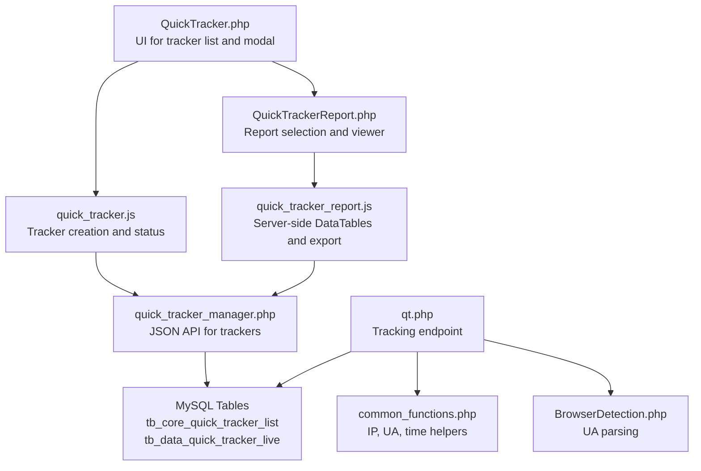
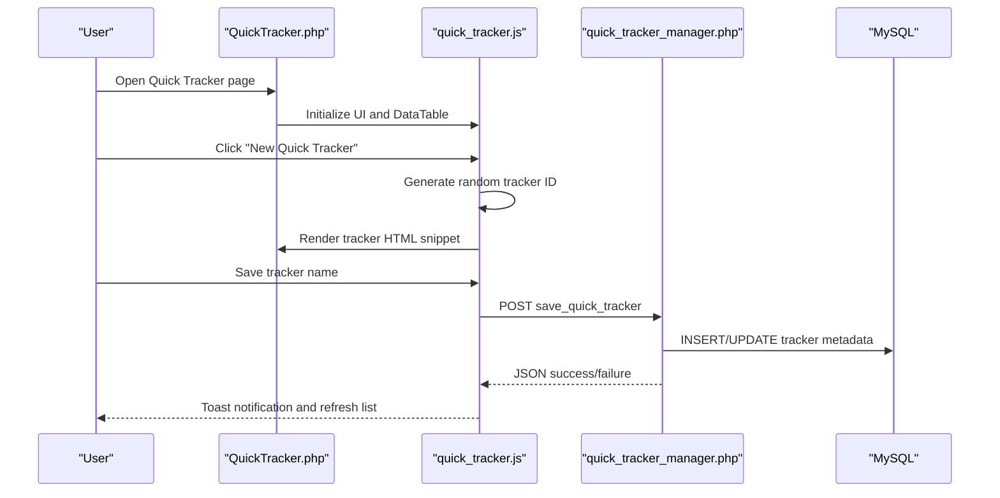
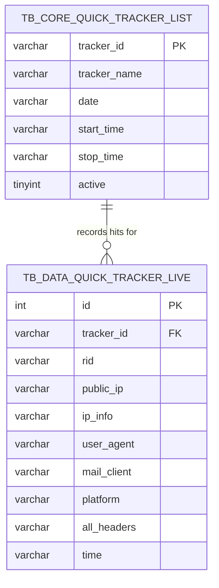
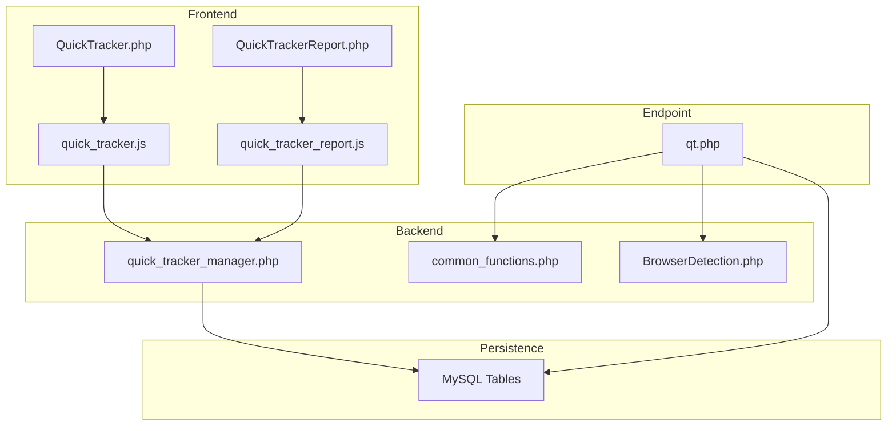
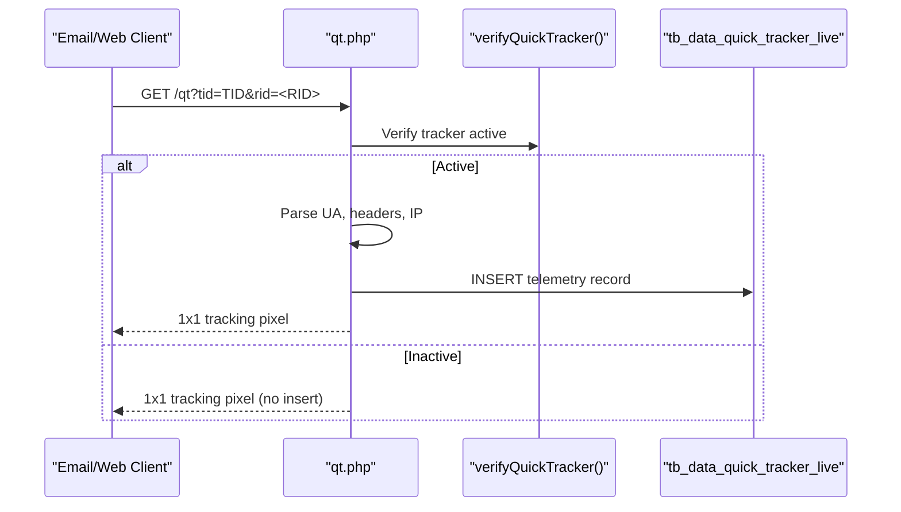
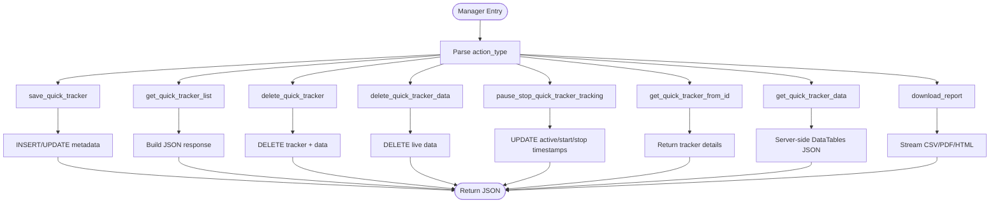
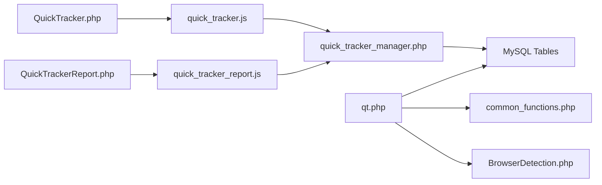

# Quick Tracker System

<cite>
**Referenced Files in This Document**
- [QuickTracker.php](file://spear/QuickTracker.php)
- [quick_tracker_manager.php](file://spear/manager/quick_tracker_manager.php)
- [qt.php](file://qt.php)
- [quick_tracker.js](file://spear/js/quick_tracker.js)
- [quick_tracker_report.js](file://spear/js/quick_tracker_report.js)
- [QuickTrackerReport.php](file://spear/QuickTrackerReport.php)
- [common_functions.php](file://spear/manager/common_functions.php)
- [install_manager.php](file://install_manager.php)
- [BrowserDetection.php](file://spear/libs/browser_detect/BrowserDetection.php)
</cite>

## Table of Contents
1. [Introduction](#introduction)
2. [Project Structure](#project-structure)
3. [Core Components](#core-components)
4. [Architecture Overview](#architecture-overview)
5. [Detailed Component Analysis](#detailed-component-analysis)
6. [Dependency Analysis](#dependency-analysis)
7. [Performance Considerations](#performance-considerations)
8. [Troubleshooting Guide](#troubleshooting-guide)
9. [Conclusion](#conclusion)
10. [Appendices](#appendices)

## Introduction
The Quick Tracker System enables rapid deployment of single-use tracking links for immediate monitoring of email opens and website visits. It provides a streamlined workflow to generate tracker code, activate/deactivate tracking, and view real-time results via a dedicated report interface. This document explains how QuickTracker.php generates tracker code, how quick_tracker_manager.php handles backend operations, and how qt.php processes tracking requests and collects telemetry. It also covers integration with the broader tracking ecosystem and offers practical examples for common use cases.

## Project Structure
The Quick Tracker feature spans frontend UI, backend managers, and a lightweight endpoint for request processing:
- Frontend UI: QuickTracker.php lists trackers and renders a modal to copy tracker HTML.
- JavaScript: quick_tracker.js orchestrates tracker creation and status updates; quick_tracker_report.js powers the reporting interface.
- Backend manager: quick_tracker_manager.php exposes actions for CRUD operations, status toggles, and report generation.
- Endpoint: qt.php validates tracker activity, captures telemetry, and serves a tracking pixel.
- Shared utilities: common_functions.php provides IP detection, UA parsing, and time formatting helpers.
- Database: install_manager.php defines the schema for tracker metadata and live data.

**Diagram sources**
- [QuickTracker.php:1-199](file://spear/QuickTracker.php#L1-L199)
- [quick_tracker.js:1-208](file://spear/js/quick_tracker.js#L1-L208)
- [QuickTrackerReport.php:1-268](file://spear/QuickTrackerReport.php#L1-L268)
- [quick_tracker_report.js:1-196](file://spear/js/quick_tracker_report.js#L1-L196)
- [quick_tracker_manager.php:1-298](file://spear/manager/quick_tracker_manager.php#L1-L298)
- [qt.php:1-63](file://qt.php#L1-L63)
- [common_functions.php:1-595](file://spear/manager/common_functions.php#L1-L595)
- [BrowserDetection.php:60-554](file://spear/libs/browser_detect/BrowserDetection.php#L60-L554)
- [install_manager.php:299-371](file://install_manager.php#L299-L371)

**Section sources**
- [QuickTracker.php:1-199](file://spear/QuickTracker.php#L1-L199)
- [quick_tracker_manager.php:1-298](file://spear/manager/quick_tracker_manager.php#L1-L298)
- [qt.php:1-63](file://qt.php#L1-L63)
- [quick_tracker.js:1-208](file://spear/js/quick_tracker.js#L1-L208)
- [quick_tracker_report.js:1-196](file://spear/js/quick_tracker_report.js#L1-L196)
- [QuickTrackerReport.php:1-268](file://spear/QuickTrackerReport.php#L1-L268)
- [common_functions.php:1-595](file://spear/manager/common_functions.php#L1-L595)
- [install_manager.php:299-371](file://install_manager.php#L299-L371)

## Core Components
- QuickTracker.php: Renders the tracker list and modal for generating tracker HTML with a single-use pixel URL embedding tracker and recipient identifiers.
- quick_tracker_manager.php: Provides JSON endpoints for saving tracker metadata, listing trackers, toggling active status, deleting trackers and data, fetching tracker data for DataTables, and exporting reports.
- qt.php: Validates tracker activity, extracts telemetry (IP, UA, headers), enriches with geolocation-like info, and inserts a record into the live data table, then serves a tracking pixel.
- quick_tracker.js: Handles UI interactions, generates random tracker IDs, builds the tracker HTML snippet, saves tracker names, toggles tracking status, and deletes trackers or data.
- quick_tracker_report.js: Loads tracker lists, selects a tracker, initializes a server-side DataTable, allows column selection, and exports reports to CSV/PDF/HTML.
- common_functions.php: Supplies shared utilities for IP resolution, browser identification, time zone conversions, and report HTML generation.
- Database schema: install_manager.php defines the core tracker list and live data tables.

**Section sources**
- [QuickTracker.php:70-168](file://spear/QuickTracker.php#L70-L168)
- [quick_tracker_manager.php:13-35](file://spear/manager/quick_tracker_manager.php#L13-L35)
- [qt.php:7-62](file://qt.php#L7-L62)
- [quick_tracker.js:5-20](file://spear/js/quick_tracker.js#L5-L20)
- [quick_tracker_report.js:83-103](file://spear/js/quick_tracker_report.js#L83-L103)
- [common_functions.php:257-331](file://spear/manager/common_functions.php#L257-L331)
- [install_manager.php:299-371](file://install_manager.php#L299-L371)

## Architecture Overview
The Quick Tracker system follows a thin-client UI pattern:
- UI triggers actions via AJAX to quick_tracker_manager.php.
- qt.php acts as the single-use endpoint that validates the tracker and records telemetry.
- Data is stored in MySQL tables and surfaced through DataTables with server-side processing.

**Diagram sources**
- [QuickTracker.php:70-168](file://spear/QuickTracker.php#L70-L168)
- [quick_tracker.js:5-49](file://spear/js/quick_tracker.js#L5-L49)
- [quick_tracker_manager.php:38-54](file://spear/manager/quick_tracker_manager.php#L38-L54)

## Detailed Component Analysis

### QuickTracker.php
Responsibilities:
- Renders the tracker list table with actions for viewing/editing, pausing/resuming, and deleting.
- Opens a modal to display a ready-to-copy HTML snippet embedding the qt.php endpoint with tracker and recipient placeholders.
- Integrates with DataTables for sorting, pagination, and search.

Key behaviors:
- Generates a random tracker ID when creating a new tracker.
- Builds the img pixel URL with tid and a placeholder rid for per-recipient tracking.
- Uses tooltips and dropdown menus for per-tracker actions.

Practical example:
- To test a single email link, copy the generated HTML snippet and embed it in a test message. When the recipient’s client loads the pixel, qt.php records telemetry if the tracker is active.

**Section sources**
- [QuickTracker.php:70-168](file://spear/QuickTracker.php#L70-L168)
- [quick_tracker.js:5-20](file://spear/js/quick_tracker.js#L5-L20)

### quick_tracker_manager.php
Responsibilities:
- Action router handling save, list, delete, pause/stop, fetch by ID, fetch data, and export report.
- Manages tracker lifecycle: create/update metadata, toggle active state with timestamps, purge data, and clean up tracker entries.
- Implements server-side DataTables processing for filtered and paginated report data.
- Supports CSV/PDF/HTML exports via a dedicated download handler.

Processing logic highlights:
- Status toggling sets start_time on first activation and stop_time on deactivation.
- Data retrieval merges flat columns and nested ip_info JSON fields for flexible filtering and search.
- Export uses TCPDF for PDF generation and direct CSV/HTML streaming.

**Section sources**
- [quick_tracker_manager.php:13-35](file://spear/manager/quick_tracker_manager.php#L13-L35)
- [quick_tracker_manager.php:86-106](file://spear/manager/quick_tracker_manager.php#L86-L106)
- [quick_tracker_manager.php:137-213](file://spear/manager/quick_tracker_manager.php#L137-L213)
- [quick_tracker_manager.php:215-285](file://spear/manager/quick_tracker_manager.php#L215-L285)

### qt.php
Responsibilities:
- Validates that a tracker exists and is active.
- Extracts and sanitizes request parameters (tracker ID and recipient ID).
- Detects browser/platform via BrowserDetection and captures headers.
- Enriches telemetry with IP geolocation-like fields by reusing existing IP info or querying external services.
- Inserts a record into the live data table and serves a tracking pixel.

Request routing and data collection:
- Reads rid and tid from query parameters and filters them.
- Verifies active status against the core tracker list.
- Captures public IP, user agent, platform, and all HTTP headers.
- Stores a millisecond-precision timestamp.

Real-time monitoring:
- The report page queries the live data table via server-side DataTables and supports export.

**Section sources**
- [qt.php:7-62](file://qt.php#L7-L62)
- [BrowserDetection.php:537-554](file://spear/libs/browser_detect/BrowserDetection.php#L537-L554)
- [common_functions.php:257-331](file://spear/manager/common_functions.php#L257-L331)

### quick_tracker.js
Responsibilities:
- Generates a random tracker ID when creating a new tracker.
- Builds the img pixel HTML snippet with the current origin and dynamic tid and placeholder rid.
- Saves tracker names to the backend and refreshes the list.
- Toggles tracker status (start/pause) and deletes trackers or data with confirmation prompts.
- Integrates with DataTables for rendering and sorting.

Usage example:
- Click “New Quick Tracker,” review the generated HTML snippet, copy it, and embed in an email or webpage for immediate tracking.

**Section sources**
- [quick_tracker.js:5-49](file://spear/js/quick_tracker.js#L5-L49)
- [quick_tracker.js:104-123](file://spear/js/quick_tracker.js#L104-L123)
- [quick_tracker.js:126-192](file://spear/js/quick_tracker.js#L126-L192)

### quick_tracker_report.js
Responsibilities:
- Loads tracker lists and allows selecting a tracker for reporting.
- Initializes a server-side DataTable to render hits with selectable columns (RID, IP, client, platform, headers, time, and IP info).
- Exports reports to CSV/PDF/HTML using the manager’s download endpoint.

Usage example:
- After activating a tracker, open the report page, select the tracker, choose columns, and export for analysis.

**Section sources**
- [quick_tracker_report.js:36-81](file://spear/js/quick_tracker_report.js#L36-L81)
- [quick_tracker_report.js:83-103](file://spear/js/quick_tracker_report.js#L83-L103)
- [quick_tracker_report.js:105-152](file://spear/js/quick_tracker_report.js#L105-L152)
- [quick_tracker_report.js:154-196](file://spear/js/quick_tracker_report.js#L154-L196)

### Database Schema
Core tables:
- tb_core_quick_tracker_list: stores tracker metadata (ID, name, timestamps, active flag).
- tb_data_quick_tracker_live: stores per-hit telemetry (tracker ID, recipient ID, IP, enriched IP info, UA, client, platform, headers, time).

**Diagram sources**
- [install_manager.php:299-371](file://install_manager.php#L299-L371)

**Section sources**
- [install_manager.php:299-371](file://install_manager.php#L299-L371)

## Architecture Overview
The system integrates UI, backend, and endpoint components to deliver single-use tracking with real-time visibility.

**Diagram sources**
- [QuickTracker.php:1-199](file://spear/QuickTracker.php#L1-L199)
- [QuickTrackerReport.php:1-268](file://spear/QuickTrackerReport.php#L1-L268)
- [quick_tracker.js:1-208](file://spear/js/quick_tracker.js#L1-L208)
- [quick_tracker_report.js:1-196](file://spear/js/quick_tracker_report.js#L1-L196)
- [quick_tracker_manager.php:1-298](file://spear/manager/quick_tracker_manager.php#L1-L298)
- [qt.php:1-63](file://qt.php#L1-L63)
- [common_functions.php:1-595](file://spear/manager/common_functions.php#L1-L595)
- [BrowserDetection.php:60-554](file://spear/libs/browser_detect/BrowserDetection.php#L60-L554)
- [install_manager.php:299-371](file://install_manager.php#L299-L371)

## Detailed Component Analysis

### Tracker Request Flow (qt.php)

**Diagram sources**
- [qt.php:21-42](file://qt.php#L21-L42)
- [qt.php:53-62](file://qt.php#L53-L62)

**Section sources**
- [qt.php:21-42](file://qt.php#L21-L42)
- [qt.php:53-62](file://qt.php#L53-L62)

### Tracker Management Flow (quick_tracker_manager.php)

**Diagram sources**
- [quick_tracker_manager.php:13-35](file://spear/manager/quick_tracker_manager.php#L13-L35)
- [quick_tracker_manager.php:38-116](file://spear/manager/quick_tracker_manager.php#L38-L116)
- [quick_tracker_manager.php:119-285](file://spear/manager/quick_tracker_manager.php#L119-L285)

**Section sources**
- [quick_tracker_manager.php:38-116](file://spear/manager/quick_tracker_manager.php#L38-L116)
- [quick_tracker_manager.php:119-285](file://spear/manager/quick_tracker_manager.php#L119-L285)

### Practical Examples

- Instant campaign creation for an individual email:
  - Generate a new tracker in QuickTracker.php, copy the HTML snippet, and embed it in a test email. When the recipient opens the email, the pixel loads and qt.php records telemetry if the tracker is active.

- Single-use tracker generation for a webpage:
  - Insert the generated img pixel into a landing page or test page. Monitor hits in the report interface.

- Immediate tracking activation:
  - From the tracker list, click “Start/Resume” to set start_time and enable data collection. Use “Pause/Stop” to halt collection.

- Rapid security assessment:
  - Deploy a temporary tracker to observe client behavior (UA, platform, headers) and geolocation-like fields upon pixel load.

- Temporary tracking deployments:
  - Use short-lived trackers by pausing or deleting after assessment. Data can be purged independently via “Delete Data.”

**Section sources**
- [quick_tracker.js:5-49](file://spear/js/quick_tracker.js#L5-L49)
- [quick_tracker.js:104-123](file://spear/js/quick_tracker.js#L104-L123)
- [quick_tracker_report.js:83-103](file://spear/js/quick_tracker_report.js#L83-L103)

## Dependency Analysis
- UI depends on quick_tracker.js and quick_tracker_report.js for interactivity.
- Managers depend on common_functions.php for IP and UA utilities.
- qt.php depends on BrowserDetection.php for UA parsing and common_functions.php for IP enrichment.
- All components write to and read from MySQL tables defined in install_manager.php.

**Diagram sources**
- [QuickTracker.php:1-199](file://spear/QuickTracker.php#L1-L199)
- [QuickTrackerReport.php:1-268](file://spear/QuickTrackerReport.php#L1-L268)
- [quick_tracker.js:1-208](file://spear/js/quick_tracker.js#L1-L208)
- [quick_tracker_report.js:1-196](file://spear/js/quick_tracker_report.js#L1-L196)
- [quick_tracker_manager.php:1-298](file://spear/manager/quick_tracker_manager.php#L1-L298)
- [qt.php:1-63](file://qt.php#L1-L63)
- [common_functions.php:1-595](file://spear/manager/common_functions.php#L1-L595)
- [BrowserDetection.php:60-554](file://spear/libs/browser_detect/BrowserDetection.php#L60-L554)
- [install_manager.php:299-371](file://install_manager.php#L299-L371)

**Section sources**
- [quick_tracker_manager.php:1-298](file://spear/manager/quick_tracker_manager.php#L1-L298)
- [qt.php:1-63](file://qt.php#L1-L63)
- [common_functions.php:1-595](file://spear/manager/common_functions.php#L1-L595)
- [install_manager.php:299-371](file://install_manager.php#L299-L371)

## Performance Considerations
- Server-side DataTables: Filtering and sorting are handled server-side to reduce payload size and improve responsiveness.
- Minimal endpoint logic: qt.php performs only essential checks and inserts, minimizing latency.
- IP enrichment reuse: Existing IP info is reused to avoid redundant external lookups.
- Time precision: Millisecond timestamps enable precise hit ordering and analysis.

[No sources needed since this section provides general guidance]

## Troubleshooting Guide
Common issues and resolutions:
- Tracker not recording hits:
  - Ensure the tracker is active in the list and that the pixel URL is embedded correctly with valid tid and rid.
  - Confirm that qt.php is reachable and that the tracker exists in the core list.

- No data in reports:
  - Verify that the tracker was started and that clients are loading the pixel (some clients block images).
  - Use the “Delete Data” action to purge stale data if needed.

- Export failures:
  - Confirm that the table has data and that the selected columns are valid.
  - Try different formats (CSV/PDF/HTML) to isolate environment-specific issues.

- Session or permission errors:
  - Ensure the session is valid and that the manager requires a valid session before processing requests.

**Section sources**
- [quick_tracker_manager.php:6-7](file://spear/manager/quick_tracker_manager.php#L6-L7)
- [quick_tracker.js:51-75](file://spear/js/quick_tracker.js#L51-L75)
- [quick_tracker_report.js:154-196](file://spear/js/quick_tracker_report.js#L154-L196)

## Conclusion
The Quick Tracker System provides a fast, efficient way to deploy single-use tracking for targeted assessments. Its modular design separates UI, backend management, and endpoint logic, enabling rapid iteration and reliable data collection. Use quick trackers for testing individual links, performing rapid security assessments, and temporary deployments, and leverage the integrated reporting for real-time insights.

[No sources needed since this section summarizes without analyzing specific files]

## Appendices

### When to Use Quick Trackers vs Full Web Campaigns
- Choose quick trackers for:
  - Rapid, single-use tests (emails, landing pages).
  - Temporary monitoring windows.
  - Low-overhead telemetry collection.
- Choose full web campaigns for:
  - Multi-stage journeys and persistent tracking.
  - Advanced targeting and automation.
  - Long-running, complex engagement scenarios.

[No sources needed since this section provides general guidance]