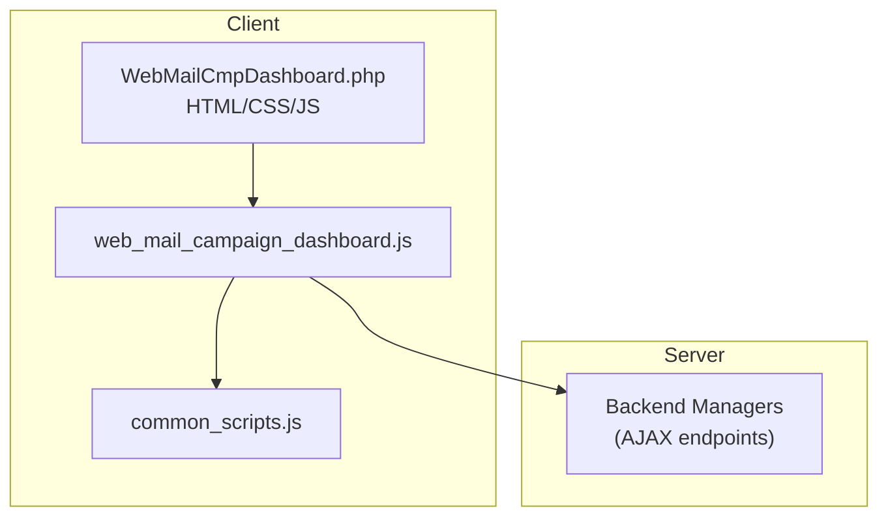
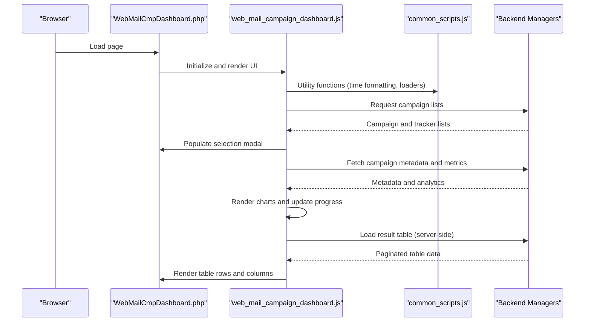
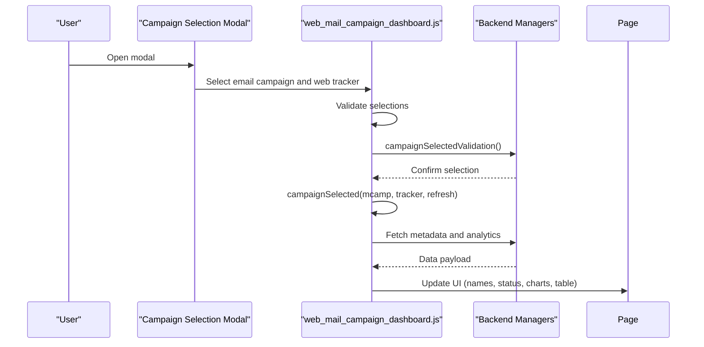
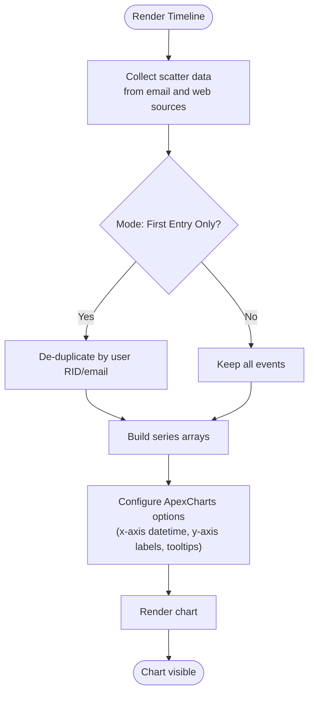
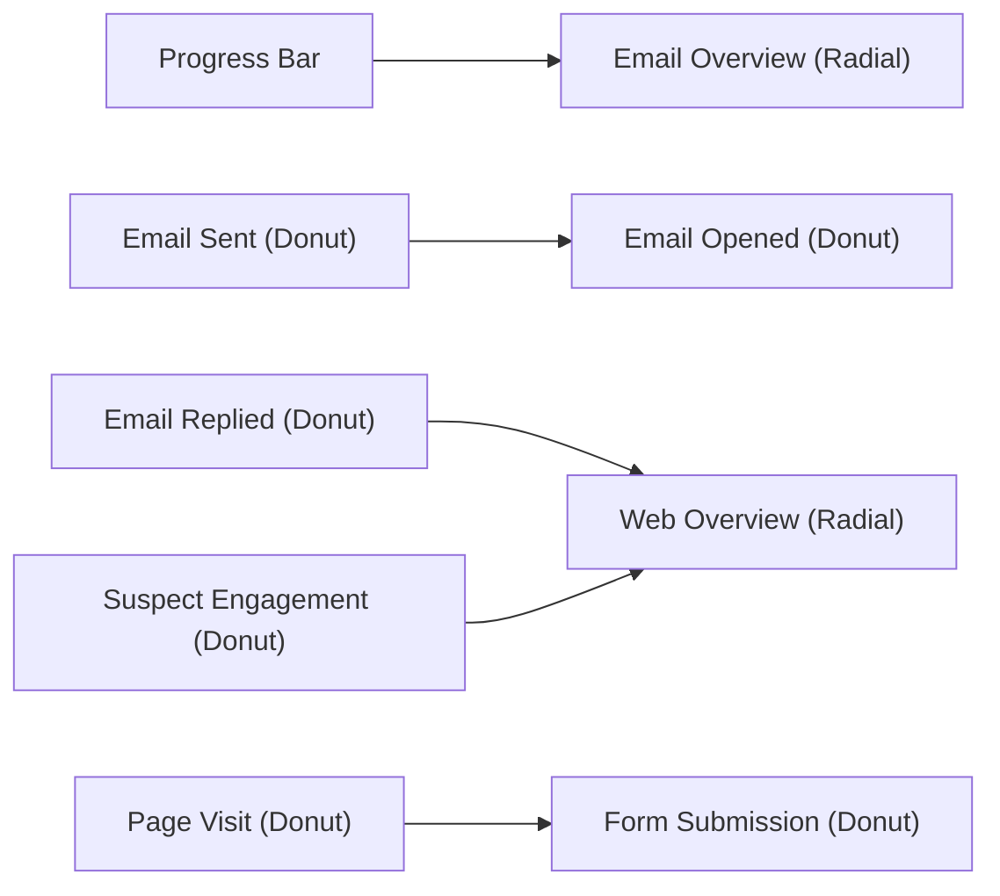
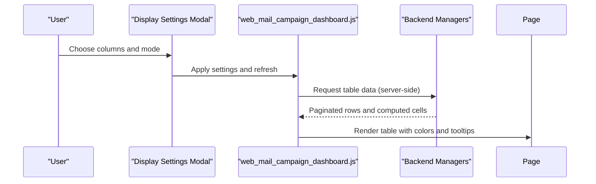
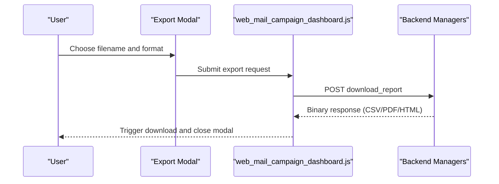
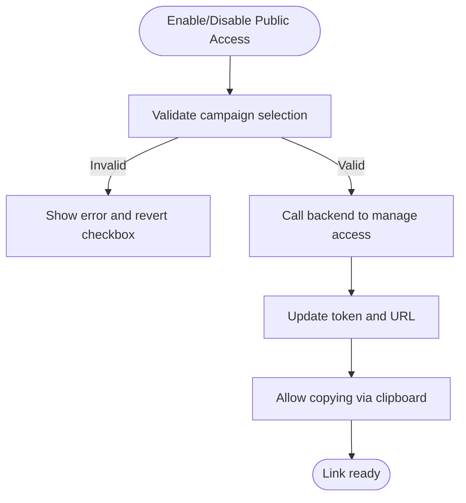
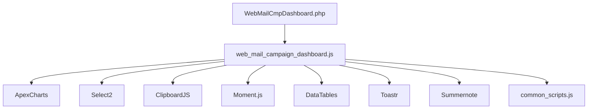

# Combined Web-Email Dashboard

<cite>
**Referenced Files in This Document**
- [WebMailCmpDashboard.php](file://spear/WebMailCmpDashboard.php)
- [web_mail_campaign_dashboard.js](file://spear/js/web_mail_campaign_dashboard.js)
- [MailCmpDashboard.php](file://spear/MailCmpDashboard.php)
- [common_scripts.js](file://spear/js/common_scripts.js)
</cite>

## Table of Contents
1. [Introduction](#introduction)
2. [Project Structure](#project-structure)
3. [Core Components](#core-components)
4. [Architecture Overview](#architecture-overview)
5. [Detailed Component Analysis](#detailed-component-analysis)
6. [Dependency Analysis](#dependency-analysis)
7. [Performance Considerations](#performance-considerations)
8. [Troubleshooting Guide](#troubleshooting-guide)
9. [Conclusion](#conclusion)
10. [Appendices](#appendices)

## Introduction
This document explains the combined web-email dashboard system designed for unified campaign monitoring and real-time analytics. It focuses on the WebMailCmpDashboard.php page and its JavaScript counterpart web_mail_campaign_dashboard.js, detailing:
- Dual-campaign selection interface for email and web trackers
- Timeline visualization powered by ApexCharts
- Integrated data display components (progress bars, pie/radial charts, and result tables)
- Dynamic chart rendering, data refresh mechanisms, and user interaction handling
- Practical examples for campaign selection workflows, dashboard customization, and real-time updates
- Layout structure and integration between web tracking data and email campaign metrics
- Export functionality supporting CSV, PDF, and HTML formats
- Guidance for interpreting combined analytics for security assessments and campaign effectiveness evaluation

## Project Structure
The dashboard is implemented as a PHP-driven page with embedded HTML/CSS/JS and leverages AJAX to communicate with backend managers. The primary runtime assets include:
- WebMailCmpDashboard.php: The main dashboard page with HTML layout, modals, and chart containers
- web_mail_campaign_dashboard.js: Client-side logic for campaign selection, data fetching, chart rendering, and table population
- MailCmpDashboard.php: Reference single-campaign email dashboard for comparison
- common_scripts.js: Shared client-side utilities (time formatting, loaders, session helpers)

**Diagram sources**
- [WebMailCmpDashboard.php:1-666](file://spear/WebMailCmpDashboard.php#L1-L666)
- [web_mail_campaign_dashboard.js:1-1566](file://spear/js/web_mail_campaign_dashboard.js#L1-L1566)
- [MailCmpDashboard.php:1-440](file://spear/MailCmpDashboard.php#L1-L440)
- [common_scripts.js:1-323](file://spear/js/common_scripts.js#L1-L323)

**Section sources**
- [WebMailCmpDashboard.php:1-666](file://spear/WebMailCmpDashboard.php#L1-L666)
- [web_mail_campaign_dashboard.js:1-1566](file://spear/js/web_mail_campaign_dashboard.js#L1-L1566)
- [MailCmpDashboard.php:1-440](file://spear/MailCmpDashboard.php#L1-L440)
- [common_scripts.js:1-323](file://spear/js/common_scripts.js#L1-L323)

## Core Components
- Dual-campaign selection modal: Allows choosing an email campaign and a web tracker, validating selections, and persisting the URL query parameters
- Timeline chart: Scatter plot showing email events (queued, sent, opened, errors) and web events (page visits, form submissions) over time
- Overview charts: Radial and donut charts for email and web metrics
- Progress bar: Visual indicator of email delivery progress
- Result table: Server-side DataTable displaying combined user-level data with customizable columns
- Export dialog: Generates CSV, PDF, or HTML reports
- Public access controls: Toggle and copy-to-clipboard for shareable links

**Section sources**
- [WebMailCmpDashboard.php:85-294](file://spear/WebMailCmpDashboard.php#L85-L294)
- [web_mail_campaign_dashboard.js:144-287](file://spear/js/web_mail_campaign_dashboard.js#L144-L287)
- [web_mail_campaign_dashboard.js:289-408](file://spear/js/web_mail_campaign_dashboard.js#L289-L408)
- [web_mail_campaign_dashboard.js:1004-1104](file://spear/js/web_mail_campaign_dashboard.js#L1004-L1104)
- [web_mail_campaign_dashboard.js:1522-1566](file://spear/js/web_mail_campaign_dashboard.js#L1522-L1566)

## Architecture Overview
The dashboard follows a client-initiated, server-driven architecture:
- On load, the page initializes UI and optionally opens the campaign selection modal
- The JavaScript selects campaigns, fetches metadata, and requests analytics data via AJAX
- Charts are rendered using ApexCharts; the result table is populated via DataTables with server-side processing
- Real-time updates are supported by refreshing the dashboard programmatically

**Diagram sources**
- [WebMailCmpDashboard.php:636-659](file://spear/WebMailCmpDashboard.php#L636-L659)
- [web_mail_campaign_dashboard.js:24-27](file://spear/js/web_mail_campaign_dashboard.js#L24-L27)
- [web_mail_campaign_dashboard.js:158-189](file://spear/js/web_mail_campaign_dashboard.js#L158-L189)
- [web_mail_campaign_dashboard.js:215-287](file://spear/js/web_mail_campaign_dashboard.js#L215-L287)
- [web_mail_campaign_dashboard.js:1041-1103](file://spear/js/web_mail_campaign_dashboard.js#L1041-L1103)

## Detailed Component Analysis

### Dual-Campaign Selection Interface
- Modal structure allows selecting an email campaign and a web tracker
- Select2 is used for searchable dropdowns
- Validation ensures both selections are made before proceeding
- On selection, the URL is updated with mcamp and tracker parameters; the dashboard loads analytics for the chosen pair

**Diagram sources**
- [WebMailCmpDashboard.php:296-375](file://spear/WebMailCmpDashboard.php#L296-L375)
- [web_mail_campaign_dashboard.js:191-213](file://spear/js/web_mail_campaign_dashboard.js#L191-L213)
- [web_mail_campaign_dashboard.js:215-287](file://spear/js/web_mail_campaign_dashboard.js#L215-L287)

**Section sources**
- [WebMailCmpDashboard.php:296-375](file://spear/WebMailCmpDashboard.php#L296-L375)
- [web_mail_campaign_dashboard.js:191-213](file://spear/js/web_mail_campaign_dashboard.js#L191-L213)
- [web_mail_campaign_dashboard.js:215-287](file://spear/js/web_mail_campaign_dashboard.js#L215-L287)

### Timeline Visualization with ApexCharts
- Scatter plot displays:
  - Email lifecycle: queued, sent, opened, errors
  - Web lifecycle: page visits, form submissions
- X-axis is datetime; Y-axis categories include labels for each event type
- Tooltip shows localized timestamps and user identifiers
- Data aggregation supports “first entry only” vs “all entries” modes

**Diagram sources**
- [web_mail_campaign_dashboard.js:410-631](file://spear/js/web_mail_campaign_dashboard.js#L410-L631)

**Section sources**
- [web_mail_campaign_dashboard.js:410-631](file://spear/js/web_mail_campaign_dashboard.js#L410-L631)

### Integrated Data Display Components
- Progress bar: Shows sent/failed counts and completion percentage
- Overview radial charts: Combined email and web engagement percentages
- Donut charts: Sent/open/replied rates and page/form submission rates
- Suspect engagement: Non-matching page visits and form submissions

**Diagram sources**
- [web_mail_campaign_dashboard.js:350-390](file://spear/js/web_mail_campaign_dashboard.js#L350-L390)
- [web_mail_campaign_dashboard.js:683-734](file://spear/js/web_mail_campaign_dashboard.js#L683-L734)
- [web_mail_campaign_dashboard.js:736-815](file://spear/js/web_mail_campaign_dashboard.js#L736-L815)
- [web_mail_campaign_dashboard.js:817-894](file://spear/js/web_mail_campaign_dashboard.js#L817-L894)
- [web_mail_campaign_dashboard.js:896-1002](file://spear/js/web_mail_campaign_dashboard.js#L896-L1002)
- [web_mail_campaign_dashboard.js:1131-1196](file://spear/js/web_mail_campaign_dashboard.js#L1131-L1196)
- [web_mail_campaign_dashboard.js:1198-1276](file://spear/js/web_mail_campaign_dashboard.js#L1198-L1276)
- [web_mail_campaign_dashboard.js:1278-1357](file://spear/js/web_mail_campaign_dashboard.js#L1278-L1357)
- [web_mail_campaign_dashboard.js:1359-1436](file://spear/js/web_mail_campaign_dashboard.js#L1359-L1436)

**Section sources**
- [web_mail_campaign_dashboard.js:350-390](file://spear/js/web_mail_campaign_dashboard.js#L350-L390)
- [web_mail_campaign_dashboard.js:683-734](file://spear/js/web_mail_campaign_dashboard.js#L683-L734)
- [web_mail_campaign_dashboard.js:736-815](file://spear/js/web_mail_campaign_dashboard.js#L736-L815)
- [web_mail_campaign_dashboard.js:817-894](file://spear/js/web_mail_campaign_dashboard.js#L817-L894)
- [web_mail_campaign_dashboard.js:896-1002](file://spear/js/web_mail_campaign_dashboard.js#L896-L1002)
- [web_mail_campaign_dashboard.js:1131-1196](file://spear/js/web_mail_campaign_dashboard.js#L1131-L1196)
- [web_mail_campaign_dashboard.js:1198-1276](file://spear/js/web_mail_campaign_dashboard.js#L1198-L1276)
- [web_mail_campaign_dashboard.js:1278-1357](file://spear/js/web_mail_campaign_dashboard.js#L1278-L1357)
- [web_mail_campaign_dashboard.js:1359-1436](file://spear/js/web_mail_campaign_dashboard.js#L1359-L1436)

### Result Table and Customization
- Server-side DataTable with customizable columns:
  - Email campaign info (user, status, open counts, headers, replies)
  - Web common info (IP, browser, platform, device)
  - Page visit info (counts, first/last visits)
  - Form submission info (counts, first/last submissions)
  - Form field data per page
- Column ordering and selection are persisted; sorting is disabled for dynamic content columns
- Reply emails can be viewed inline via a modal

**Diagram sources**
- [WebMailCmpDashboard.php:427-566](file://spear/WebMailCmpDashboard.php#L427-L566)
- [web_mail_campaign_dashboard.js:1004-1104](file://spear/js/web_mail_campaign_dashboard.js#L1004-L1104)

**Section sources**
- [WebMailCmpDashboard.php:427-566](file://spear/WebMailCmpDashboard.php#L427-L566)
- [web_mail_campaign_dashboard.js:1004-1104](file://spear/js/web_mail_campaign_dashboard.js#L1004-L1104)

### Export Functionality
- Supported formats: CSV, PDF, HTML
- Uses an XMLHttpRequest to request a generated file from the backend manager
- Automatically triggers download with appropriate filename and MIME type

**Diagram sources**
- [WebMailCmpDashboard.php:377-407](file://spear/WebMailCmpDashboard.php#L377-L407)
- [web_mail_campaign_dashboard.js:1522-1566](file://spear/js/web_mail_campaign_dashboard.js#L1522-L1566)

**Section sources**
- [WebMailCmpDashboard.php:377-407](file://spear/WebMailCmpDashboard.php#L377-L407)
- [web_mail_campaign_dashboard.js:1522-1566](file://spear/js/web_mail_campaign_dashboard.js#L1522-L1566)

### Public Access and Dashboard Link
- Toggle to enable/disable public access; generates a shareable link with a transient token
- Clipboard integration for copying the link
- Optional hiding of UI elements when accessed publicly

**Diagram sources**
- [web_mail_campaign_dashboard.js:1459-1513](file://spear/js/web_mail_campaign_dashboard.js#L1459-L1513)
- [web_mail_campaign_dashboard.js:1440-1453](file://spear/js/web_mail_campaign_dashboard.js#L1440-L1453)
- [WebMailCmpDashboard.php:568-596](file://spear/WebMailCmpDashboard.php#L568-L596)

**Section sources**
- [web_mail_campaign_dashboard.js:1459-1513](file://spear/js/web_mail_campaign_dashboard.js#L1459-L1513)
- [web_mail_campaign_dashboard.js:1440-1453](file://spear/js/web_mail_campaign_dashboard.js#L1440-L1453)
- [WebMailCmpDashboard.php:568-596](file://spear/WebMailCmpDashboard.php#L568-L596)

## Dependency Analysis
- WebMailCmpDashboard.php depends on:
  - ApexCharts (via CDN inclusion in the page)
  - Select2 for dropdowns
  - Moment.js and timezone data for localization
  - DataTables for server-side table rendering
- web_mail_campaign_dashboard.js depends on:
  - jQuery and jQuery UI
  - ApexCharts for charting
  - Select2 for column selection
  - ClipboardJS for link copying
  - Moment.js for time conversions
  - Toastr for notifications
  - Summernote for reply preview
- common_scripts.js provides shared utilities for loaders, time formatting, idle timeout, and session management

**Diagram sources**
- [WebMailCmpDashboard.php:619-665](file://spear/WebMailCmpDashboard.php#L619-L665)
- [web_mail_campaign_dashboard.js:1-10](file://spear/js/web_mail_campaign_dashboard.js#L1-L10)
- [common_scripts.js:1-323](file://spear/js/common_scripts.js#L1-L323)

**Section sources**
- [WebMailCmpDashboard.php:619-665](file://spear/WebMailCmpDashboard.php#L619-L665)
- [web_mail_campaign_dashboard.js:1-10](file://spear/js/web_mail_campaign_dashboard.js#L1-L10)
- [common_scripts.js:1-323](file://spear/js/common_scripts.js#L1-L323)

## Performance Considerations
- Server-side DataTable reduces client memory usage for large datasets
- ApexCharts renders efficiently with precomputed series; consider disabling tooltips for very dense timelines if needed
- Minimizing DOM updates during refresh improves responsiveness
- Use “first entry only” mode to reduce chart density and table rows when reviewing large campaigns
- Defer non-critical assets and avoid unnecessary redraws when switching campaigns

## Troubleshooting Guide
- Campaign not selected: The dashboard shows an error and does not render charts or tables
- Empty table: Export prompts an error; ensure at least one row exists before exporting
- Public access errors: Verify both campaigns are selected before toggling public access
- Timezone discrepancies: Ensure the browser’s timezone is set correctly; timestamps are converted using the returned timezone data
- Chart rendering issues: Confirm ApexCharts and Moment.js are loaded; check network errors for AJAX calls

**Section sources**
- [web_mail_campaign_dashboard.js:144-149](file://spear/js/web_mail_campaign_dashboard.js#L144-L149)
- [web_mail_campaign_dashboard.js:1522-1566](file://spear/js/web_mail_campaign_dashboard.js#L1522-L1566)
- [web_mail_campaign_dashboard.js:1459-1513](file://spear/js/web_mail_campaign_dashboard.js#L1459-L1513)

## Conclusion
The combined web-email dashboard integrates email and web tracking data into a cohesive, real-time monitoring solution. Its modular design—dual-campaign selection, timeline visualization, overview charts, and a customizable result table—supports both operational oversight and detailed analysis. With robust export capabilities and public sharing controls, it enables secure collaboration and reporting across teams.

## Appendices

### Practical Examples

- Campaign selection workflow
  - Open the campaign selection modal
  - Choose an email campaign and a web tracker
  - Validate and confirm; the URL updates with mcamp and tracker parameters
  - The dashboard automatically loads metadata, charts, and the result table

- Dashboard customization options
  - Adjust “Table data” mode to show first entries or all entries
  - Toggle “Check mail replies”
  - Customize columns for each category (email, web common, page visit, form submission, form field data)
  - Reorder columns within each selector; changes are applied on refresh

- Real-time data updates
  - Use the refresh button to reload charts and table data
  - The timeline updates with new events as they occur

- Interpreting combined analytics
  - Email overview: Compare sent vs. opened vs. replied to gauge engagement and deliverability
  - Web overview: Evaluate page visit and form submission rates; suspect engagement highlights non-matching activity
  - Timeline: Correlate email actions with web events to identify conversion paths and anomalies

- Security assessment tips
  - Investigate high “send error” rates and low “opened” percentages
  - Review reply counts and content for suspicious patterns
  - Monitor suspect engagement to detect potential bot or automated activity
  - Use public access judiciously and revoke when not needed

[No sources needed since this section provides general guidance]