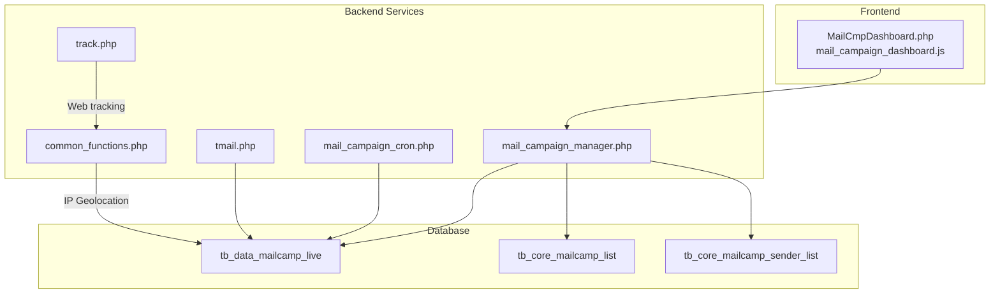
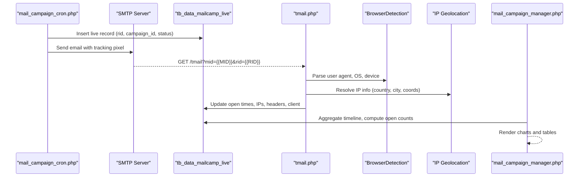
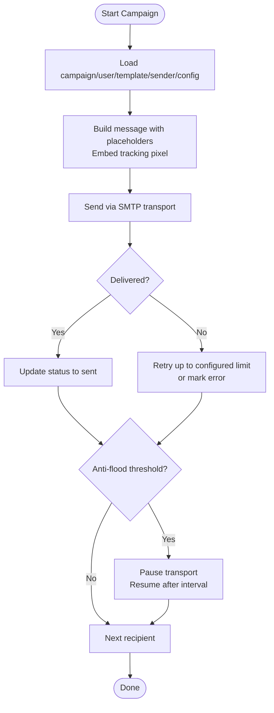
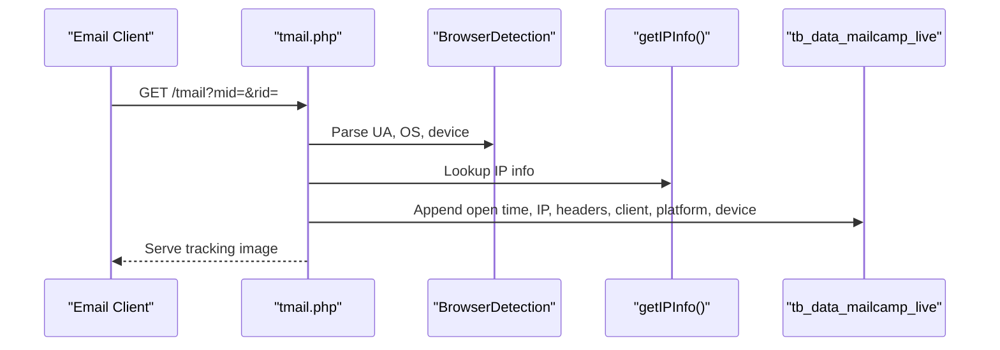
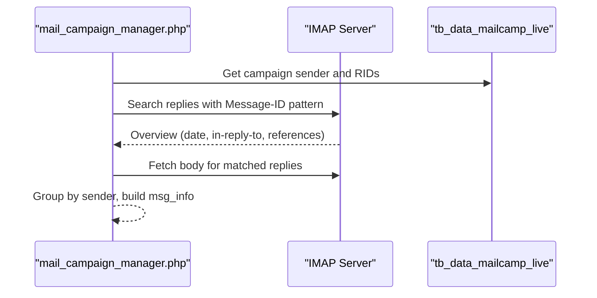
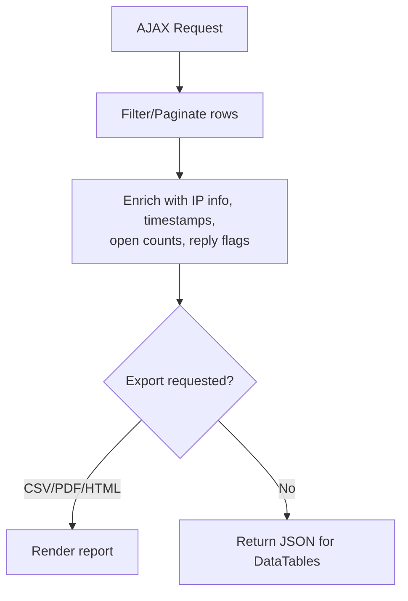
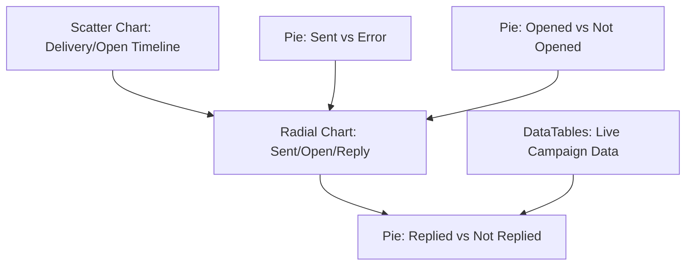
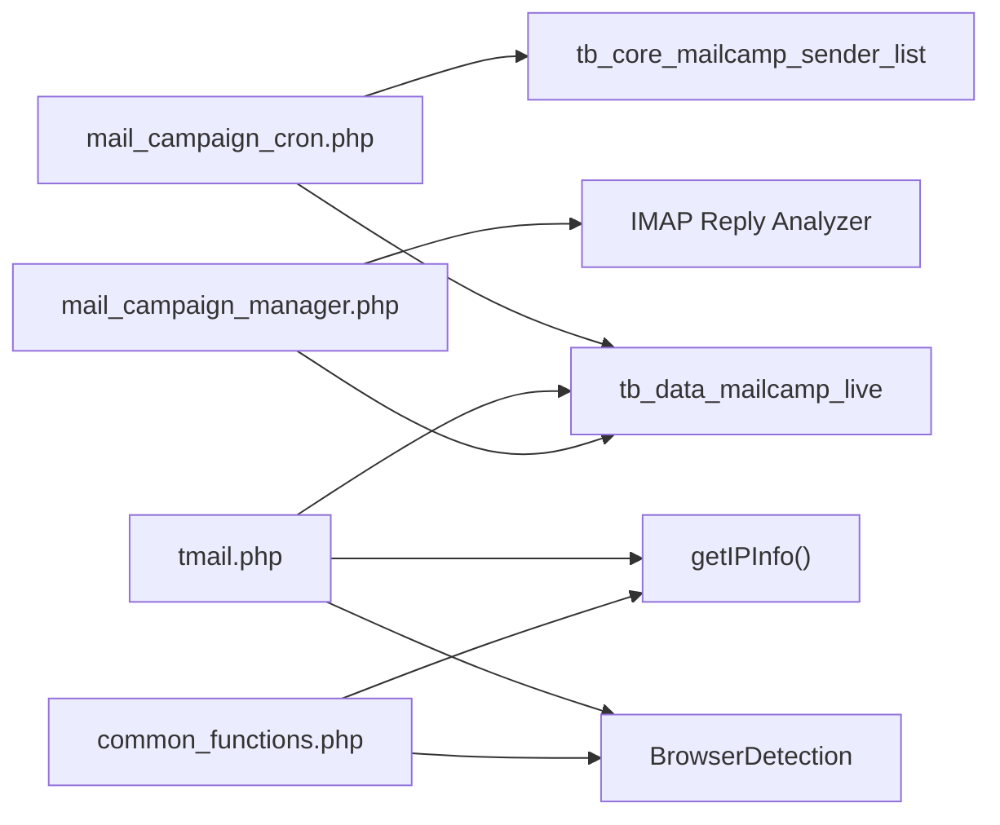
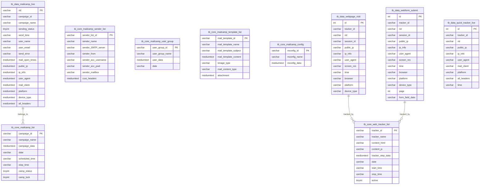

# Email Campaign Analytics

<cite>
**Referenced Files in This Document**
- [mail_campaign_cron.php](file://spear/core/mail_campaign_cron.php)
- [mail_campaign_manager.php](file://spear/manager/mail_campaign_manager.php)
- [common_functions.php](file://spear/manager/common_functions.php)
- [MailCmpDashboard.php](file://spear/MailCmpDashboard.php)
- [mail_campaign_dashboard.js](file://spear/js/mail_campaign_dashboard.js)
- [tmail.php](file://tmail.php)
- [track.php](file://track.php)
- [install_manager.php](file://install_manager.php)
</cite>

## Table of Contents
1. [Introduction](#introduction)
2. [Project Structure](#project-structure)
3. [Core Components](#core-components)
4. [Architecture Overview](#architecture-overview)
5. [Detailed Component Analysis](#detailed-component-analysis)
6. [Dependency Analysis](#dependency-analysis)
7. [Performance Considerations](#performance-considerations)
8. [Troubleshooting Guide](#troubleshooting-guide)
9. [Conclusion](#conclusion)
10. [Appendices](#appendices)

## Introduction
This document explains the email campaign analytics system in SniperPhish with a focus on email delivery tracking, engagement metrics, and response analysis. It covers how the platform collects tracking data, calculates open rates, analyzes replies, monitors delivery status, and integrates with the tracker report manager for unified analytics across email and web tracking sources. Practical examples demonstrate evaluating campaign performance, analyzing recipient engagement, identifying response patterns, and leveraging dashboard components for geographic and temporal insights. The technical implementation includes email header parsing, IP geolocation integration, and user agent analysis, along with guidance for interpreting analytics for security awareness and strategy evaluation.

## Project Structure
The email analytics system spans backend PHP services, frontend dashboards, and database schemas:
- Backend services orchestrate email campaigns, collect tracking events, and expose analytics APIs.
- Frontend dashboards visualize delivery timelines, open rates, replies, and raw event tables.
- Database stores campaign metadata, live delivery records, and tracking events.

**Diagram sources**
- [MailCmpDashboard.php:1-440](file://spear/MailCmpDashboard.php#L1-L440)
- [mail_campaign_dashboard.js:1-915](file://spear/js/mail_campaign_dashboard.js#L1-L915)
- [mail_campaign_cron.php:1-364](file://spear/core/mail_campaign_cron.php#L1-L364)
- [mail_campaign_manager.php:1-547](file://spear/manager/mail_campaign_manager.php#L1-L547)
- [common_functions.php:1-595](file://spear/manager/common_functions.php#L1-L595)
- [tmail.php:1-148](file://tmail.php#L1-L148)
- [track.php:1-88](file://track.php#L1-L88)
- [install_manager.php:287-640](file://install_manager.php#L287-L640)

**Section sources**
- [MailCmpDashboard.php:1-440](file://spear/MailCmpDashboard.php#L1-L440)
- [mail_campaign_dashboard.js:1-915](file://spear/js/mail_campaign_dashboard.js#L1-L915)
- [mail_campaign_cron.php:1-364](file://spear/core/mail_campaign_cron.php#L1-L364)
- [mail_campaign_manager.php:1-547](file://spear/manager/mail_campaign_manager.php#L1-L547)
- [common_functions.php:1-595](file://spear/manager/common_functions.php#L1-L595)
- [tmail.php:1-148](file://tmail.php#L1-L148)
- [track.php:1-88](file://track.php#L1-L88)
- [install_manager.php:287-640](file://install_manager.php#L287-L640)

## Core Components
- Email campaign orchestrator: prepares messages, injects tracking pixels, sends via SMTP, and updates delivery status.
- Tracking endpoint: records email opens, captures user agent, device type, IP geolocation, and headers.
- Analytics manager: aggregates timeline data, computes open counts, and supports export/report generation.
- Dashboard: renders charts, progress bars, and interactive tables for campaign performance.
- Reply analyzer: connects to sender mailbox to detect replies linked to campaign Message-IDs.

Key implementation references:
- Campaign orchestration and SMTP transport: [mail_campaign_cron.php:99-294](file://spear/core/mail_campaign_cron.php#L99-L294)
- Open tracking and enrichment: [tmail.php:27-108](file://tmail.php#L27-L108)
- Analytics aggregation and export: [mail_campaign_manager.php:107-151](file://spear/manager/mail_campaign_manager.php#L107-L151), [mail_campaign_manager.php:311-408](file://spear/manager/mail_campaign_manager.php#L311-L408), [mail_campaign_manager.php:410-547](file://spear/manager/mail_campaign_manager.php#L410-L547)
- IP geolocation and user agent parsing: [common_functions.php:257-321](file://spear/manager/common_functions.php#L257-L321)
- Reply detection via IMAP: [common_functions.php:368-445](file://spear/manager/common_functions.php#L368-L445)
- Dashboard rendering and metrics: [MailCmpDashboard.php:85-148](file://spear/MailCmpDashboard.php#L85-L148), [mail_campaign_dashboard.js:216-714](file://spear/js/mail_campaign_dashboard.js#L216-L714)

**Section sources**
- [mail_campaign_cron.php:99-294](file://spear/core/mail_campaign_cron.php#L99-L294)
- [tmail.php:27-108](file://tmail.php#L27-L108)
- [mail_campaign_manager.php:107-151](file://spear/manager/mail_campaign_manager.php#L107-L151)
- [mail_campaign_manager.php:311-408](file://spear/manager/mail_campaign_manager.php#L311-L408)
- [mail_campaign_manager.php:410-547](file://spear/manager/mail_campaign_manager.php#L410-L547)
- [common_functions.php:257-321](file://spear/manager/common_functions.php#L257-L321)
- [common_functions.php:368-445](file://spear/manager/common_functions.php#L368-L445)
- [MailCmpDashboard.php:85-148](file://spear/MailCmpDashboard.php#L85-L148)
- [mail_campaign_dashboard.js:216-714](file://spear/js/mail_campaign_dashboard.js#L216-L714)

## Architecture Overview
The system integrates email delivery, open tracking, and reply analysis into a unified analytics pipeline:

**Diagram sources**
- [mail_campaign_cron.php:164-294](file://spear/core/mail_campaign_cron.php#L164-L294)
- [tmail.php:27-108](file://tmail.php#L27-L108)
- [common_functions.php:257-321](file://spear/manager/common_functions.php#L257-L321)
- [mail_campaign_manager.php:346-366](file://spear/manager/mail_campaign_manager.php#L346-L366)

**Section sources**
- [mail_campaign_cron.php:164-294](file://spear/core/mail_campaign_cron.php#L164-L294)
- [tmail.php:27-108](file://tmail.php#L27-L108)
- [common_functions.php:257-321](file://spear/manager/common_functions.php#L257-L321)
- [mail_campaign_manager.php:346-366](file://spear/manager/mail_campaign_manager.php#L346-L366)

## Detailed Component Analysis

### Email Delivery Orchestration
- Loads campaign, user group, template, sender, and configuration.
- Generates unique RID per recipient and inserts a live record with initial status.
- Builds templated message with placeholders, QR/barcode embedding, and optional signing/encryption.
- Sends via configured SMTP DSN, updates status on success/error, and enforces anti-flood controls.

**Diagram sources**
- [mail_campaign_cron.php:99-294](file://spear/core/mail_campaign_cron.php#L99-L294)

**Section sources**
- [mail_campaign_cron.php:99-294](file://spear/core/mail_campaign_cron.php#L99-L294)

### Open Tracking and Enrichment
- Endpoint validates campaign activity and recipient existence.
- Captures user agent, OS, device type, public IP, and headers.
- Resolves IP geolocation (country, city, coordinates) and enriches arrays for historical tracking.
- Updates the live record with open timestamps and enriched metadata.

**Diagram sources**
- [tmail.php:27-108](file://tmail.php#L27-L108)
- [common_functions.php:257-321](file://spear/manager/common_functions.php#L257-L321)

**Section sources**
- [tmail.php:27-108](file://tmail.php#L27-L108)
- [common_functions.php:257-321](file://spear/manager/common_functions.php#L257-L321)

### Reply Analysis
- Connects to the sender’s mailbox using configured credentials.
- Searches for replies referencing the original Message-ID pattern.
- Extracts reply timestamps and bodies grouped by sender email.
- Exposes counts and content for dashboard visualization.

**Diagram sources**
- [common_functions.php:368-445](file://spear/manager/common_functions.php#L368-L445)
- [mail_campaign_manager.php:50-51](file://spear/manager/mail_campaign_manager.php#L50-L51)

**Section sources**
- [common_functions.php:368-445](file://spear/manager/common_functions.php#L368-L445)
- [mail_campaign_manager.php:50-51](file://spear/manager/mail_campaign_manager.php#L50-L51)

### Analytics Aggregation and Export
- Timeline aggregation merges delivery and open events with localized timestamps.
- Provides counts for sent, delivered, open, and reply events.
- Supports DataTables server-side processing with filtering, sorting, and pagination.
- Export to CSV/PDF/HTML with selected columns and IP/geolocation normalization.

**Diagram sources**
- [mail_campaign_manager.php:311-408](file://spear/manager/mail_campaign_manager.php#L311-L408)
- [mail_campaign_manager.php:410-547](file://spear/manager/mail_campaign_manager.php#L410-L547)

**Section sources**
- [mail_campaign_manager.php:311-408](file://spear/manager/mail_campaign_manager.php#L311-L408)
- [mail_campaign_manager.php:410-547](file://spear/manager/mail_campaign_manager.php#L410-L547)

### Dashboard Components
- Campaign timeline scatter plot: shows send status and open events over time.
- Overview radial chart: sent, opened, replied percentages.
- Pie charts: sent vs error, opened vs not opened, replied vs not replied.
- Interactive table: selectable columns, search, sort, reply view modal.

**Diagram sources**
- [MailCmpDashboard.php:112-148](file://spear/MailCmpDashboard.php#L112-L148)
- [mail_campaign_dashboard.js:257-714](file://spear/js/mail_campaign_dashboard.js#L257-L714)

**Section sources**
- [MailCmpDashboard.php:112-148](file://spear/MailCmpDashboard.php#L112-L148)
- [mail_campaign_dashboard.js:257-714](file://spear/js/mail_campaign_dashboard.js#L257-L714)

## Dependency Analysis
- mail_campaign_cron.php depends on Symfony Mailer, database configuration, and common functions for DSN, keyword filtering, and QR/barcode embedding.
- tmail.php depends on BrowserDetection, common functions for IP resolution, and updates tb_data_mailcamp_live.
- mail_campaign_manager.php orchestrates analytics queries, export, and reply retrieval.
- common_functions.php centralizes IP geolocation, user agent parsing, time conversions, and reply analysis.

**Diagram sources**
- [mail_campaign_cron.php:1-364](file://spear/core/mail_campaign_cron.php#L1-L364)
- [tmail.php:1-148](file://tmail.php#L1-L148)
- [mail_campaign_manager.php:1-547](file://spear/manager/mail_campaign_manager.php#L1-L547)
- [common_functions.php:1-595](file://spear/manager/common_functions.php#L1-L595)

**Section sources**
- [mail_campaign_cron.php:1-364](file://spear/core/mail_campaign_cron.php#L1-L364)
- [tmail.php:1-148](file://tmail.php#L1-L148)
- [mail_campaign_manager.php:1-547](file://spear/manager/mail_campaign_manager.php#L1-L547)
- [common_functions.php:1-595](file://spear/manager/common_functions.php#L1-L595)

## Performance Considerations
- Anti-flood control: periodic transport restart and pause mitigate provider throttling.
- Efficient aggregation: timestamps normalized to client timezone reduces UI conversion overhead.
- Streaming exports: CSV/PDF/HTML generated in-memory to minimize disk I/O.
- IMAP polling: reply analysis runs outside main campaign flow to avoid blocking.

[No sources needed since this section provides general guidance]

## Troubleshooting Guide
Common issues and resolutions:
- Access denied for public dashboards: ensure tk_id and campaign_id validation pass.
- No open events recorded: verify tracking pixel URL is embedded and tmail endpoint reachable.
- Reply detection fails: confirm sender mailbox credentials and IMAP search pattern alignment with Message-ID.
- Export errors: check selected columns and ensure required fields exist in tb_data_mailcamp_live.

**Section sources**
- [mail_campaign_manager.php:14-31](file://spear/manager/mail_campaign_manager.php#L14-L31)
- [tmail.php:27-108](file://tmail.php#L27-L108)
- [common_functions.php:368-445](file://spear/manager/common_functions.php#L368-L445)

## Conclusion
The email campaign analytics system integrates delivery orchestration, precise open tracking, and reply analysis into a cohesive pipeline. The dashboard provides actionable insights through timeline charts, engagement percentages, and searchable event tables. Robust data enrichment (IP geolocation, user agents) and export capabilities support both tactical campaign optimization and strategic segmentation.

[No sources needed since this section summarizes without analyzing specific files]

## Appendices

### Database Schema Highlights
- Campaign metadata and live delivery records.
- Web tracking tables for cross-source analytics.

**Diagram sources**
- [install_manager.php:287-640](file://install_manager.php#L287-L640)

**Section sources**
- [install_manager.php:287-640](file://install_manager.php#L287-L640)

### Practical Examples

- Evaluating campaign performance
  - Use the radial overview to compare sent vs opened vs replied percentages.
  - Inspect the timeline chart to identify delivery spikes and open bursts.
  - Export CSV/PDF for stakeholder reporting with selected columns.

- Analyzing recipient engagement
  - Filter the live table by device type, platform, or country to uncover engagement trends.
  - Toggle “first entry only” vs “all entries” to focus on unique vs repeated interactions.

- Identifying response patterns
  - Enable reply check to flag responders and review reply content via the modal.
  - Correlate reply occurrence with open times and geographic distribution.

- Geographic and temporal analysis
  - Use IP geolocation fields to map opens by country/city.
  - Convert timestamps to local time zones for accurate temporal comparisons.

- Security awareness assessment
  - Monitor unusual user agents or devices associated with replies.
  - Investigate high open rates from suspicious regions or transient IPs.

- Campaign optimization
  - Adjust send intervals and anti-flood settings to improve deliverability.
  - Refine templates and subject lines based on open and reply feedback.

[No sources needed since this section provides general guidance]