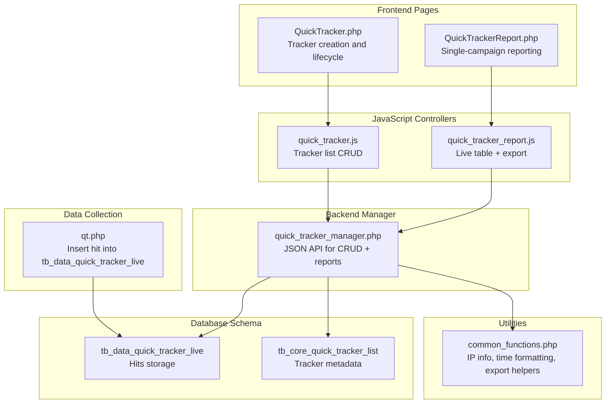
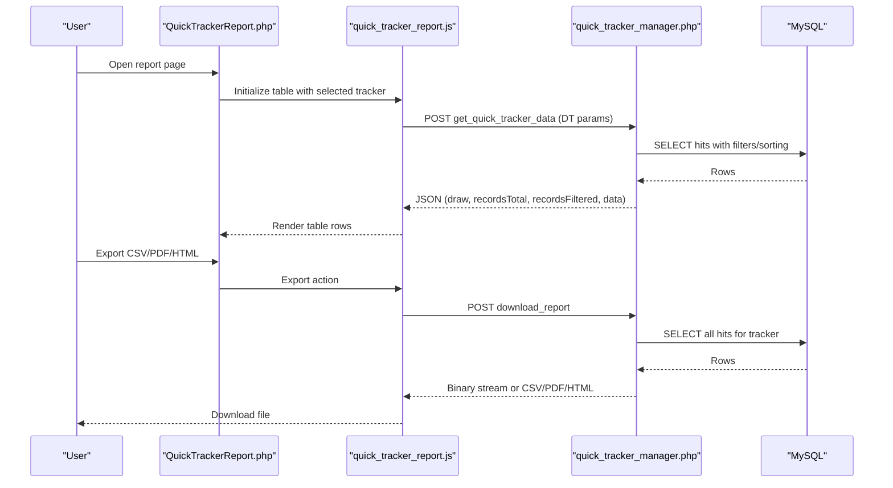
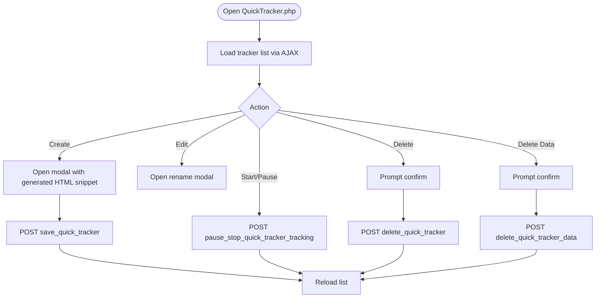
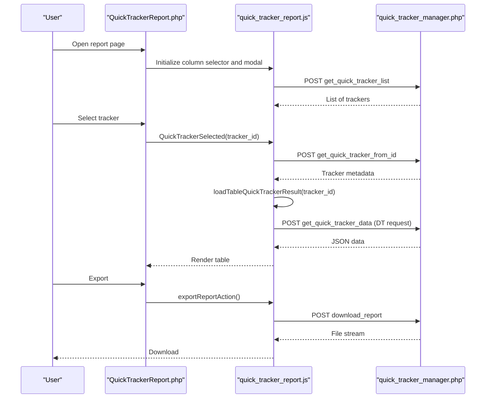
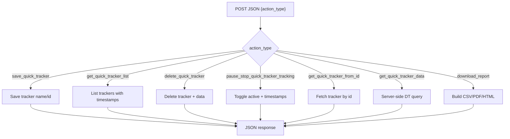
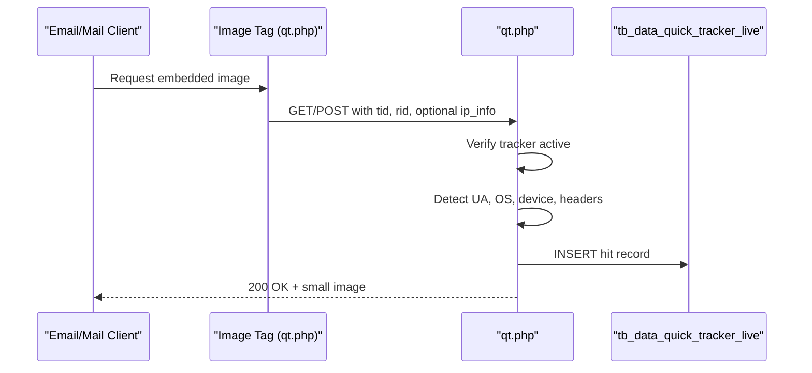
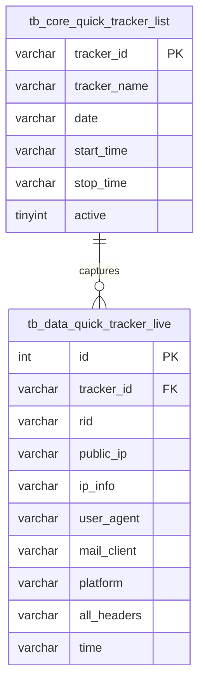
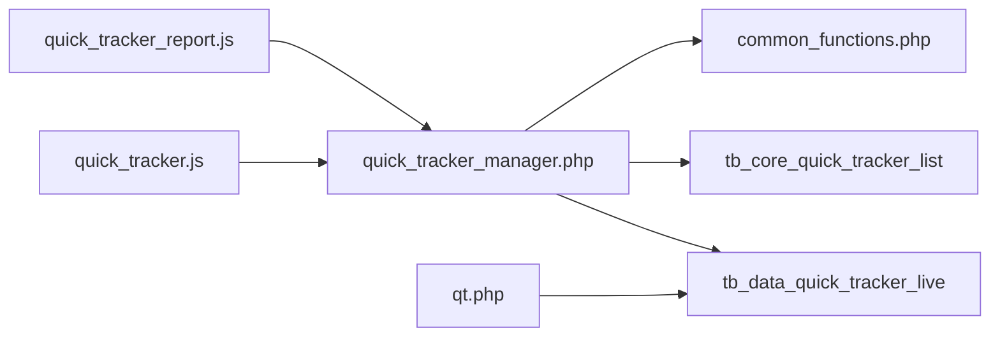

# Quick Tracker Analytics

<cite>
**Referenced Files in This Document**
- [QuickTracker.php](file://spear/QuickTracker.php)
- [QuickTrackerReport.php](file://spear/QuickTrackerReport.php)
- [quick_tracker_manager.php](file://spear/manager/quick_tracker_manager.php)
- [quick_tracker.js](file://spear/js/quick_tracker.js)
- [quick_tracker_report.js](file://spear/js/quick_tracker_report.js)
- [qt.php](file://qt.php)
- [install_manager.php](file://install_manager.php)
- [common_functions.php](file://spear/manager/common_functions.php)
- [tracker_report_manager.php](file://spear/manager/tracker_report_manager.php)
- [web_tracker_generator_list_manager.php](file://spear/manager/web_tracker_generator_list_manager.php)
</cite>

## Table of Contents
1. [Introduction](#introduction)
2. [Project Structure](#project-structure)
3. [Core Components](#core-components)
4. [Architecture Overview](#architecture-overview)
5. [Detailed Component Analysis](#detailed-component-analysis)
6. [Dependency Analysis](#dependency-analysis)
7. [Performance Considerations](#performance-considerations)
8. [Troubleshooting Guide](#troubleshooting-guide)
9. [Conclusion](#conclusion)
10. [Appendices](#appendices)

## Introduction
This document explains the Quick Tracker Analytics system for rapid, single-campaign tracking and instant reporting. It focuses on two primary assets:
- QuickTrackerReport.php: A streamlined, single-campaign reporting interface optimized for speed and simplicity.
- quick_tracker_manager.php: The backend service orchestrating data collection, filtering, sorting, and export for the quick tracker.

The system supports targeted phishing simulations, A/B testing scenarios, and rapid security assessments by minimizing overhead and enabling near real-time visibility into campaign hits.

## Project Structure
The Quick Tracker Analytics feature spans front-end pages, JavaScript controllers, and a dedicated backend manager with supporting utilities.

**Diagram sources**
- [QuickTracker.php:1-199](file://spear/QuickTracker.php#L1-L199)
- [QuickTrackerReport.php:1-268](file://spear/QuickTrackerReport.php#L1-L268)
- [quick_tracker.js:1-208](file://spear/js/quick_tracker.js#L1-L208)
- [quick_tracker_report.js:1-196](file://spear/js/quick_tracker_report.js#L1-L196)
- [quick_tracker_manager.php:1-298](file://spear/manager/quick_tracker_manager.php#L1-L298)
- [qt.php:1-63](file://qt.php#L1-L63)
- [install_manager.php:355-371](file://install_manager.php#L355-L371)
- [common_functions.php:257-595](file://spear/manager/common_functions.php#L257-L595)

**Section sources**
- [QuickTracker.php:1-199](file://spear/QuickTracker.php#L1-L199)
- [QuickTrackerReport.php:1-268](file://spear/QuickTrackerReport.php#L1-L268)
- [quick_tracker.js:1-208](file://spear/js/quick_tracker.js#L1-L208)
- [quick_tracker_report.js:1-196](file://spear/js/quick_tracker_report.js#L1-L196)
- [quick_tracker_manager.php:1-298](file://spear/manager/quick_tracker_manager.php#L1-L298)
- [qt.php:1-63](file://qt.php#L1-L63)
- [install_manager.php:355-371](file://install_manager.php#L355-L371)
- [common_functions.php:257-595](file://spear/manager/common_functions.php#L257-L595)

## Core Components
- QuickTracker.php: Provides a list of trackers with actions to start/pause/resume, rename, delete, and delete captured data. It generates a ready-to-inject HTML snippet per tracker.
- QuickTrackerReport.php: Presents a single-campaign report with live filtering, sorting, and export to CSV/PDF/HTML.
- quick_tracker_manager.php: JSON endpoint implementing tracker lifecycle and reporting APIs:
  - Tracker CRUD and status toggles
  - Live DataTable server-side processing for filtered/sorted hits
  - Export pipeline for CSV/PDF/HTML
- qt.php: Data collector endpoint invoked by tracker image tag; inserts a hit record into the live table.
- common_functions.php: Shared utilities for IP enrichment, time zone conversions, and report HTML generation.

**Section sources**
- [QuickTracker.php:71-102](file://spear/QuickTracker.php#L71-L102)
- [QuickTrackerReport.php:75-144](file://spear/QuickTrackerReport.php#L75-L144)
- [quick_tracker_manager.php:13-35](file://spear/manager/quick_tracker_manager.php#L13-L35)
- [qt.php:17-42](file://qt.php#L17-L42)
- [common_functions.php:257-595](file://spear/manager/common_functions.php#L257-L595)

## Architecture Overview
The system follows a thin-client architecture:
- Front-end pages render UI and collect user actions.
- JavaScript controllers send structured JSON requests to quick_tracker_manager.php.
- The manager executes SQL queries against MySQL, enriches data via common_functions.php, and returns JSON responses.
- qt.php captures hits and writes to tb_data_quick_tracker_live.

**Diagram sources**
- [QuickTrackerReport.php:120-151](file://spear/QuickTrackerReport.php#L120-L151)
- [quick_tracker_report.js:122-151](file://spear/js/quick_tracker_report.js#L122-L151)
- [quick_tracker_manager.php:137-213](file://spear/manager/quick_tracker_manager.php#L137-L213)
- [common_functions.php:535-574](file://spear/manager/common_functions.php#L535-L574)

## Detailed Component Analysis

### QuickTracker.php (Tracker Management)
- Purpose: Create, edit, start/pause/resume, and delete quick trackers; view tracker list with timestamps and status.
- Key behaviors:
  - Generates a tracker HTML snippet embedding an image tag pointing to qt.php with parameters tid and rid.
  - Uses DataTables for responsive listing with actions per row.
  - Integrates with quick_tracker_manager.php for CRUD operations.

**Diagram sources**
- [QuickTracker.php:71-102](file://spear/QuickTracker.php#L71-L102)
- [quick_tracker.js:5-49](file://spear/js/quick_tracker.js#L5-L49)
- [quick_tracker.js:104-123](file://spear/js/quick_tracker.js#L104-L123)
- [quick_tracker.js:51-75](file://spear/js/quick_tracker.js#L51-L75)
- [quick_tracker.js:78-101](file://spear/js/quick_tracker.js#L78-L101)

**Section sources**
- [QuickTracker.php:71-102](file://spear/QuickTracker.php#L71-L102)
- [quick_tracker.js:5-49](file://spear/js/quick_tracker.js#L5-L49)
- [quick_tracker.js:104-123](file://spear/js/quick_tracker.js#L104-L123)
- [quick_tracker.js:51-75](file://spear/js/quick_tracker.js#L51-L75)
- [quick_tracker.js:78-101](file://spear/js/quick_tracker.js#L78-L101)

### QuickTrackerReport.php (Single-Campaign Reporting)
- Purpose: Present a focused, real-time view of hits for a single tracker with configurable columns, live filtering, and export.
- Key behaviors:
  - Loads tracker list into a modal for selection.
  - Initializes a DataTable powered by server-side processing via quick_tracker_manager.php.
  - Supports CSV/PDF/HTML export with customizable column headers.

**Diagram sources**
- [QuickTrackerReport.php:162-192](file://spear/QuickTrackerReport.php#L162-L192)
- [quick_tracker_report.js:36-81](file://spear/js/quick_tracker_report.js#L36-L81)
- [quick_tracker_report.js:83-103](file://spear/js/quick_tracker_report.js#L83-L103)
- [quick_tracker_report.js:105-151](file://spear/js/quick_tracker_report.js#L105-L151)
- [quick_tracker_report.js:154-196](file://spear/js/quick_tracker_report.js#L154-L196)
- [quick_tracker_manager.php:119-135](file://spear/manager/quick_tracker_manager.php#L119-L135)
- [quick_tracker_manager.php:137-213](file://spear/manager/quick_tracker_manager.php#L137-L213)
- [quick_tracker_manager.php:215-285](file://spear/manager/quick_tracker_manager.php#L215-L285)

**Section sources**
- [QuickTrackerReport.php:75-144](file://spear/QuickTrackerReport.php#L75-L144)
- [quick_tracker_report.js:36-81](file://spear/js/quick_tracker_report.js#L36-L81)
- [quick_tracker_report.js:83-103](file://spear/js/quick_tracker_report.js#L83-L103)
- [quick_tracker_report.js:105-151](file://spear/js/quick_tracker_report.js#L105-L151)
- [quick_tracker_report.js:154-196](file://spear/js/quick_tracker_report.js#L154-L196)
- [quick_tracker_manager.php:119-135](file://spear/manager/quick_tracker_manager.php#L119-L135)
- [quick_tracker_manager.php:137-213](file://spear/manager/quick_tracker_manager.php#L137-L213)
- [quick_tracker_manager.php:215-285](file://spear/manager/quick_tracker_manager.php#L215-L285)

### quick_tracker_manager.php (Backend Processing)
- Purpose: Single JSON endpoint handling all quick tracker operations.
- Responsibilities:
  - Tracker lifecycle: save, list, delete, pause/stop, start/resume.
  - Data retrieval: server-side DataTable processing with filtering, sorting, and pagination.
  - Export: CSV/PDF/HTML generation using TCPDF and helper functions.
  - Timezone-aware formatting and IP enrichment via common_functions.php.

**Diagram sources**
- [quick_tracker_manager.php:13-35](file://spear/manager/quick_tracker_manager.php#L13-L35)
- [quick_tracker_manager.php:38-54](file://spear/manager/quick_tracker_manager.php#L38-L54)
- [quick_tracker_manager.php:56-72](file://spear/manager/quick_tracker_manager.php#L56-L72)
- [quick_tracker_manager.php:74-84](file://spear/manager/quick_tracker_manager.php#L74-L84)
- [quick_tracker_manager.php:86-106](file://spear/manager/quick_tracker_manager.php#L86-L106)
- [quick_tracker_manager.php:119-135](file://spear/manager/quick_tracker_manager.php#L119-L135)
- [quick_tracker_manager.php:137-213](file://spear/manager/quick_tracker_manager.php#L137-L213)
- [quick_tracker_manager.php:215-285](file://spear/manager/quick_tracker_manager.php#L215-L285)

**Section sources**
- [quick_tracker_manager.php:13-35](file://spear/manager/quick_tracker_manager.php#L13-L35)
- [quick_tracker_manager.php:38-54](file://spear/manager/quick_tracker_manager.php#L38-L54)
- [quick_tracker_manager.php:56-72](file://spear/manager/quick_tracker_manager.php#L56-L72)
- [quick_tracker_manager.php:74-84](file://spear/manager/quick_tracker_manager.php#L74-L84)
- [quick_tracker_manager.php:86-106](file://spear/manager/quick_tracker_manager.php#L86-L106)
- [quick_tracker_manager.php:119-135](file://spear/manager/quick_tracker_manager.php#L119-L135)
- [quick_tracker_manager.php:137-213](file://spear/manager/quick_tracker_manager.php#L137-L213)
- [quick_tracker_manager.php:215-285](file://spear/manager/quick_tracker_manager.php#L215-L285)

### qt.php (Real-Time Data Collection)
- Purpose: Lightweight endpoint to capture a single hit for a given tracker and user.
- Behavior:
  - Validates active status of the tracker.
  - Detects browser/platform/device and collects HTTP headers.
  - Inserts a record into tb_data_quick_tracker_live with IP enrichment.

**Diagram sources**
- [qt.php:17-42](file://qt.php#L17-L42)
- [install_manager.php:355-371](file://install_manager.php#L355-L371)

**Section sources**
- [qt.php:17-42](file://qt.php#L17-L42)
- [install_manager.php:355-371](file://install_manager.php#L355-L371)

### Data Model and Utilities
- Tables:
  - tb_data_quick_tracker_live: Stores hits for quick trackers.
  - tb_core_quick_tracker_list: Stores tracker metadata and status.
- Utilities:
  - IP enrichment via external API and caching across campaigns.
  - Time formatting helpers for client-localized display.
  - Export helpers for CSV/PDF/HTML.

**Diagram sources**
- [install_manager.php:355-371](file://install_manager.php#L355-L371)

**Section sources**
- [install_manager.php:355-371](file://install_manager.php#L355-L371)
- [common_functions.php:257-290](file://spear/manager/common_functions.php#L257-L290)
- [common_functions.php:535-574](file://spear/manager/common_functions.php#L535-L574)

## Dependency Analysis
- Frontend-to-backend:
  - quick_tracker.js depends on quick_tracker_manager.php for tracker CRUD and status toggles.
  - quick_tracker_report.js depends on quick_tracker_manager.php for tracker list, metadata, live data, and exports.
- Backend-to-database:
  - quick_tracker_manager.php reads/writes tb_data_quick_tracker_live and tb_core_quick_tracker_list.
  - common_functions.php provides IP enrichment and export formatting.
- Data collection:
  - qt.php writes to tb_data_quick_tracker_live and checks tracker activity.

**Diagram sources**
- [quick_tracker.js:30-49](file://spear/js/quick_tracker.js#L30-L49)
- [quick_tracker_report.js:122-151](file://spear/js/quick_tracker_report.js#L122-L151)
- [quick_tracker_manager.php:137-213](file://spear/manager/quick_tracker_manager.php#L137-L213)
- [qt.php:17-42](file://qt.php#L17-L42)
- [install_manager.php:355-371](file://install_manager.php#L355-L371)
- [common_functions.php:257-595](file://spear/manager/common_functions.php#L257-L595)

**Section sources**
- [quick_tracker.js:30-49](file://spear/js/quick_tracker.js#L30-L49)
- [quick_tracker_report.js:122-151](file://spear/js/quick_tracker_report.js#L122-L151)
- [quick_tracker_manager.php:137-213](file://spear/manager/quick_tracker_manager.php#L137-L213)
- [qt.php:17-42](file://qt.php#L17-L42)
- [install_manager.php:355-371](file://install_manager.php#L355-L371)
- [common_functions.php:257-595](file://spear/manager/common_functions.php#L257-L595)

## Performance Considerations
- Minimal overhead:
  - qt.php performs a single INSERT and returns quickly.
  - quick_tracker_manager.php uses server-side DataTable processing to limit payload size.
- Efficient queries:
  - get_quick_tracker_data applies ORDER BY and LIMIT based on DataTable parameters.
  - Filtering is applied in-memory after fetching, reducing DB complexity.
- Export optimization:
  - CSV uses memory streams; PDF uses TCPDF for streaming output.
- Timezone handling:
  - Client-localized time rendering avoids heavy client-side computations.

[No sources needed since this section provides general guidance]

## Troubleshooting Guide
- Tracker not recording hits:
  - Verify tracker is active in the list and that the image tag is correctly injected.
  - Check qt.php response and network logs for failures.
- No data in report:
  - Ensure the tracker is started and hits were captured.
  - Confirm the selected tracker matches the intended campaign.
- Export fails:
  - Ensure the table has rows and the selected format is supported.
  - Check server-side error logs for TCPDF or file permission issues.
- Time appears incorrect:
  - Confirm client timezone and time format settings in the application.

**Section sources**
- [quick_tracker_manager.php:86-106](file://spear/manager/quick_tracker_manager.php#L86-L106)
- [quick_tracker_manager.php:215-285](file://spear/manager/quick_tracker_manager.php#L215-L285)
- [qt.php:17-42](file://qt.php#L17-L42)

## Conclusion
The Quick Tracker Analytics system delivers a focused, high-performance solution for single-campaign tracking and instant reporting. Its streamlined architecture minimizes overhead, accelerates data ingestion, and enables real-time visibility with flexible export options. Use quick tracker reports for targeted assessments and rapid insights; opt for comprehensive dashboards when multi-campaign aggregation and cross-campaign comparisons are required.

[No sources needed since this section summarizes without analyzing specific files]

## Appendices

### Practical Examples

- Setup a quick tracker:
  - Navigate to the Quick Tracker page, click “New Quick Tracker,” and copy the generated HTML snippet.
  - Inject the snippet into your test email or landing page.
  - Start the tracker; monitor the report page for incoming hits.

- Real-time monitoring workflow:
  - Open QuickTrackerReport.php, select a tracker, and observe live hits in the table.
  - Filter by user agent, platform, or IP; adjust columns as needed.

- Immediate analytics access:
  - Use the export button to download CSV/PDF/HTML for offline analysis or sharing.

- Choosing between quick tracker reports and comprehensive dashboards:
  - Quick tracker reports: Ideal for single-campaign, low-latency insights with minimal overhead.
  - Comprehensive dashboards: Better suited for multi-campaign comparisons, trend analysis, and aggregated metrics.

**Section sources**
- [QuickTracker.php:71-102](file://spear/QuickTracker.php#L71-L102)
- [QuickTrackerReport.php:75-144](file://spear/QuickTrackerReport.php#L75-L144)
- [quick_tracker_report.js:154-196](file://spear/js/quick_tracker_report.js#L154-L196)
- [quick_tracker_manager.php:137-213](file://spear/manager/quick_tracker_manager.php#L137-L213)