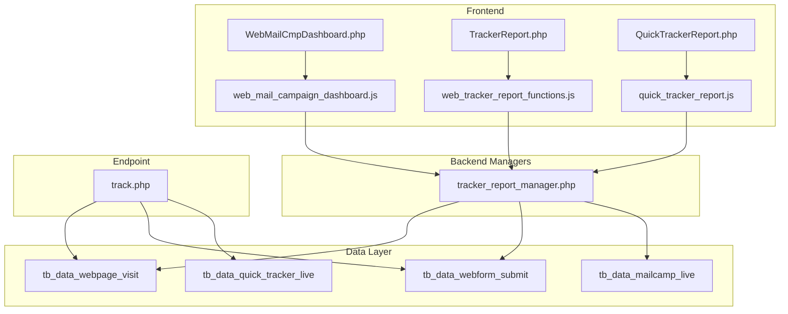
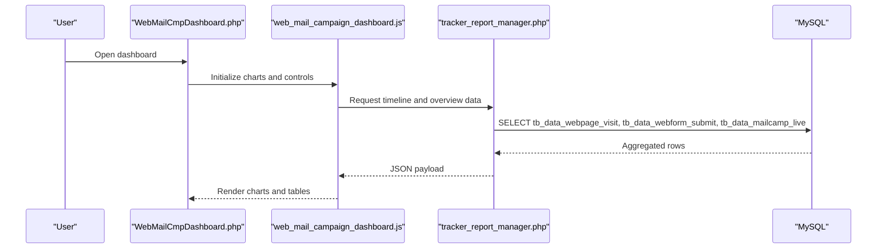
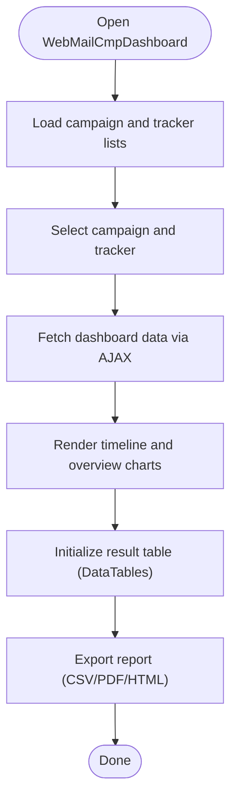
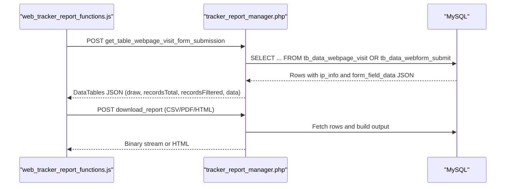
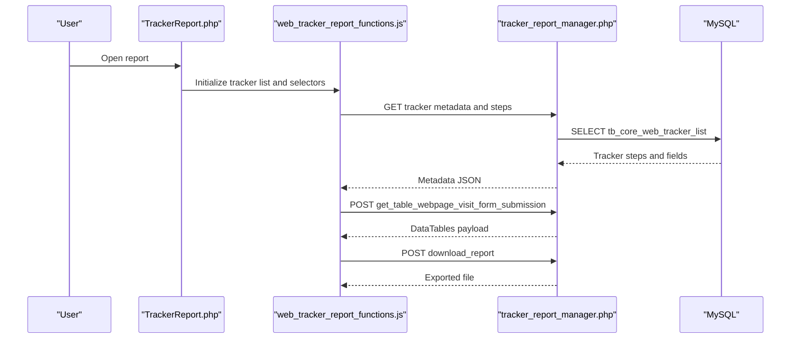
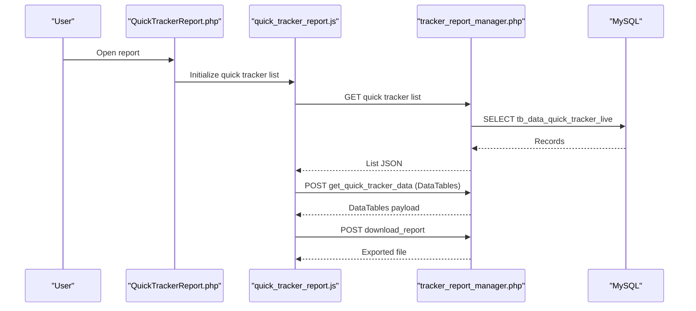
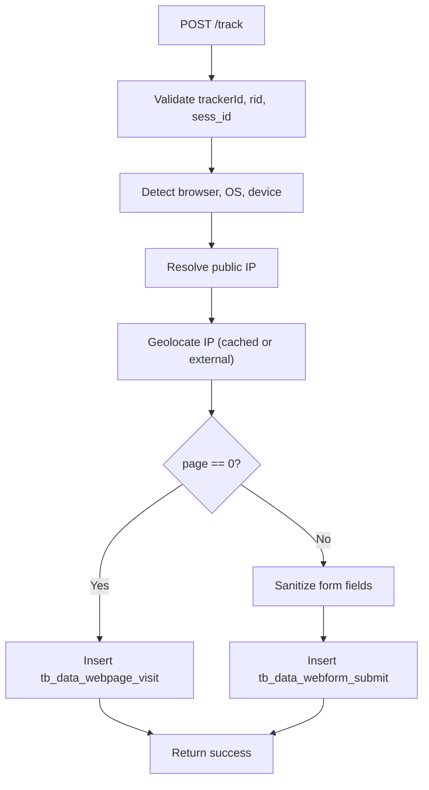
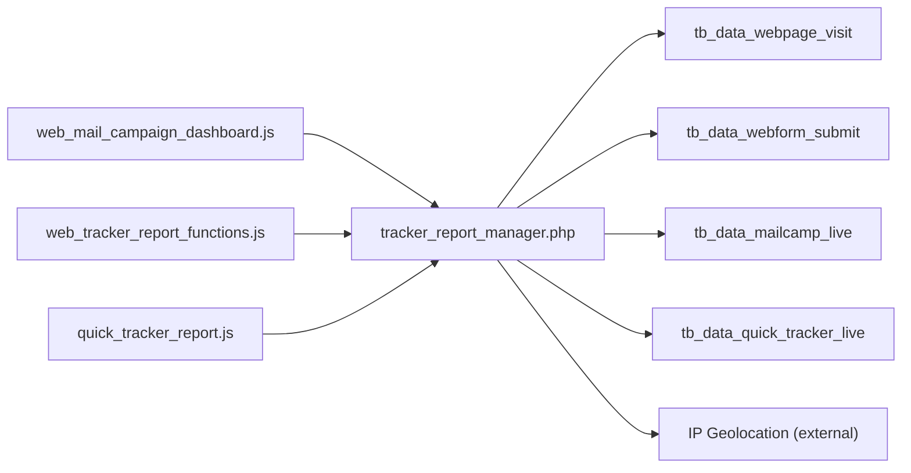

# Reporting and Analytics

<cite>
**Referenced Files in This Document**
- [WebMailCmpDashboard.php](file://spear/WebMailCmpDashboard.php)
- [tracker_report_manager.php](file://spear/manager/tracker_report_manager.php)
- [TrackerReport.php](file://spear/TrackerReport.php)
- [QuickTrackerReport.php](file://spear/QuickTrackerReport.php)
- [web_mail_campaign_dashboard.js](file://spear/js/web_mail_campaign_dashboard.js)
- [quick_tracker_report.js](file://spear/js/quick_tracker_report.js)
- [web_tracker_report_functions.js](file://spear/js/web_tracker_report_functions.js)
- [track.php](file://track.php)
- [common_functions.php](file://spear/manager/common_functions.php)
- [install_manager.php](file://install_manager.php)
</cite>

## Table of Contents
1. [Introduction](#introduction)
2. [Project Structure](#project-structure)
3. [Core Components](#core-components)
4. [Architecture Overview](#architecture-overview)
5. [Detailed Component Analysis](#detailed-component-analysis)
6. [Dependency Analysis](#dependency-analysis)
7. [Performance Considerations](#performance-considerations)
8. [Troubleshooting Guide](#troubleshooting-guide)
9. [Conclusion](#conclusion)
10. [Appendices](#appendices)

## Introduction
This document explains the reporting and analytics subsystem for unified web-email dashboards, timeline visualizations, and comprehensive tracking analytics. It focuses on:
- WebMailCmpDashboard.php for unified campaign monitoring
- tracker_report_manager.php for data aggregation and export
- TrackerReport.php for web tracking analytics
- QuickTrackerReport.php for single-campaign insights

It also covers practical examples for dashboard navigation, real-time data visualization, IP geolocation tracking, and browser detection analytics, and demonstrates how web tracking data integrates with email campaign metrics for comprehensive user behavior analysis.

## Project Structure
The reporting and analytics subsystem spans front-end pages, JavaScript visualization logic, and back-end managers that query and aggregate data from MySQL tables. Key elements:
- Front-end pages render dashboards and reports
- JavaScript handles AJAX requests, DataTables rendering, and ApexCharts visualization
- Back-end managers process requests, aggregate data, and export reports
- Track endpoint ingests web events and stores them in database tables

**Diagram sources**
- [WebMailCmpDashboard.php:1-666](file://spear/WebMailCmpDashboard.php#L1-L666)
- [TrackerReport.php:1-257](file://spear/TrackerReport.php#L1-L257)
- [QuickTrackerReport.php:1-268](file://spear/QuickTrackerReport.php#L1-L268)
- [web_mail_campaign_dashboard.js:1-800](file://spear/js/web_mail_campaign_dashboard.js#L1-L800)
- [web_tracker_report_functions.js:1-267](file://spear/js/web_tracker_report_functions.js#L1-L267)
- [quick_tracker_report.js:1-196](file://spear/js/quick_tracker_report.js#L1-L196)
- [tracker_report_manager.php:1-223](file://spear/manager/tracker_report_manager.php#L1-L223)
- [track.php:1-88](file://track.php#L1-L88)
- [install_manager.php:350-415](file://install_manager.php#L350-L415)

**Section sources**
- [WebMailCmpDashboard.php:1-666](file://spear/WebMailCmpDashboard.php#L1-L666)
- [TrackerReport.php:1-257](file://spear/TrackerReport.php#L1-L257)
- [QuickTrackerReport.php:1-268](file://spear/QuickTrackerReport.php#L1-L268)
- [web_mail_campaign_dashboard.js:1-800](file://spear/js/web_mail_campaign_dashboard.js#L1-L800)
- [web_tracker_report_functions.js:1-267](file://spear/js/web_tracker_report_functions.js#L1-L267)
- [quick_tracker_report.js:1-196](file://spear/js/quick_tracker_report.js#L1-L196)
- [tracker_report_manager.php:1-223](file://spear/manager/tracker_report_manager.php#L1-L223)
- [track.php:1-88](file://track.php#L1-L88)
- [install_manager.php:350-415](file://install_manager.php#L350-L415)

## Core Components
- Unified Web-Email Dashboard (WebMailCmpDashboard.php)
  - Provides a combined view of email campaign metrics and web tracker activity
  - Renders timeline charts, overview charts, and a result table with configurable columns
  - Supports filtering by campaign and tracker, and exporting results
- Specialized Reporting Interfaces
  - TrackerReport.php: Web tracking analytics across page visits and form submissions
  - QuickTrackerReport.php: Single-campaign insights for quick trackers
- Data Aggregation and Export (tracker_report_manager.php)
  - Implements server-side DataTables processing for filtered, paginated results
  - Exports CSV/PDF/HTML via TCPDF and custom HTML renderer
- Real-Time Tracking Endpoint (track.php)
  - Accepts page visit and form submission events
  - Detects browser/platform/device and enriches with IP geolocation
- Common Utilities (common_functions.php)
  - IP geolocation enrichment, browser detection, time zone conversions, and export helpers

**Section sources**
- [WebMailCmpDashboard.php:1-666](file://spear/WebMailCmpDashboard.php#L1-L666)
- [TrackerReport.php:1-257](file://spear/TrackerReport.php#L1-L257)
- [QuickTrackerReport.php:1-268](file://spear/QuickTrackerReport.php#L1-L268)
- [tracker_report_manager.php:1-223](file://spear/manager/tracker_report_manager.php#L1-L223)
- [track.php:1-88](file://track.php#L1-L88)
- [common_functions.php:257-290](file://spear/manager/common_functions.php#L257-L290)

## Architecture Overview
The system integrates three primary data sources:
- Email campaign live data (tb_data_mailcamp_live)
- Web page visits (tb_data_webpage_visit)
- Web form submissions (tb_data_webform_submit)

The JavaScript front-end requests aggregated data from backend managers, which query the database and return structured JSON. Visualization libraries render charts and tables. Export functionality streams downloadable files.

**Diagram sources**
- [WebMailCmpDashboard.php:1-666](file://spear/WebMailCmpDashboard.php#L1-L666)
- [web_mail_campaign_dashboard.js:392-408](file://spear/js/web_mail_campaign_dashboard.js#L392-L408)
- [tracker_report_manager.php:111-207](file://spear/manager/tracker_report_manager.php#L111-L207)
- [install_manager.php:350-415](file://install_manager.php#L350-L415)

## Detailed Component Analysis

### WebMailCmpDashboard.php
- Purpose: Unified monitoring of email campaigns and associated web trackers
- Features:
  - Campaign and tracker selection modal
  - Live timeline scatter chart (ApexCharts) combining email and web events
  - Overview charts for email and web metrics
  - Configurable result table with sortable, searchable columns
  - Export dialog supporting CSV/PDF/HTML
- Controls:
  - Refresh buttons, display settings modal, and dashboard link sharing
  - Column visibility and ordering for the result table

**Diagram sources**
- [WebMailCmpDashboard.php:1-666](file://spear/WebMailCmpDashboard.php#L1-L666)
- [web_mail_campaign_dashboard.js:144-287](file://spear/js/web_mail_campaign_dashboard.js#L144-L287)

**Section sources**
- [WebMailCmpDashboard.php:50-295](file://spear/WebMailCmpDashboard.php#L50-L295)
- [web_mail_campaign_dashboard.js:144-287](file://spear/js/web_mail_campaign_dashboard.js#L144-L287)

### tracker_report_manager.php
- Purpose: Server-side processing for TrackerReport.php and QuickTrackerReport.php
- Responsibilities:
  - DataTables server-side processing for filtered and paginated results
  - Export of CSV/PDF/HTML using TCPDF and custom HTML renderer
  - Retrieval of tracker metadata and dynamic column sets
- Data model mapping:
  - tb_data_webpage_visit for page visits
  - tb_data_webform_submit for form submissions
  - Dynamic column resolution across row fields, ip_info JSON, and form_field_data JSON

**Diagram sources**
- [web_tracker_report_functions.js:169-220](file://spear/js/web_tracker_report_functions.js#L169-L220)
- [tracker_report_manager.php:111-207](file://spear/manager/tracker_report_manager.php#L111-L207)
- [tracker_report_manager.php:25-109](file://spear/manager/tracker_report_manager.php#L25-L109)
- [install_manager.php:379-415](file://install_manager.php#L379-L415)

**Section sources**
- [tracker_report_manager.php:11-22](file://spear/manager/tracker_report_manager.php#L11-L22)
- [tracker_report_manager.php:111-207](file://spear/manager/tracker_report_manager.php#L111-L207)
- [tracker_report_manager.php:25-109](file://spear/manager/tracker_report_manager.php#L25-L109)
- [web_tracker_report_functions.js:169-220](file://spear/js/web_tracker_report_functions.js#L169-L220)

### TrackerReport.php
- Purpose: Dedicated analytics for web trackers
- Features:
  - Tracker selection modal
  - Report type selector (page visit vs. per-page form submissions)
  - Dynamic column picker with common fields and per-form field columns
  - Export dialog for CSV/PDF/HTML

**Diagram sources**
- [TrackerReport.php:1-257](file://spear/TrackerReport.php#L1-L257)
- [web_tracker_report_functions.js:222-267](file://spear/js/web_tracker_report_functions.js#L222-L267)
- [tracker_report_manager.php:209-222](file://spear/manager/tracker_report_manager.php#L209-L222)

**Section sources**
- [TrackerReport.php:50-140](file://spear/TrackerReport.php#L50-L140)
- [web_tracker_report_functions.js:222-267](file://spear/js/web_tracker_report_functions.js#L222-L267)
- [tracker_report_manager.php:209-222](file://spear/manager/tracker_report_manager.php#L209-L222)

### QuickTrackerReport.php
- Purpose: Single-campaign insights for quick trackers
- Features:
  - Quick tracker selection modal
  - Configurable columns for IP, browser, platform, headers, and timestamps
  - Server-side DataTables processing and export

**Diagram sources**
- [QuickTrackerReport.php:1-268](file://spear/QuickTrackerReport.php#L1-L268)
- [quick_tracker_report.js:83-152](file://spear/js/quick_tracker_report.js#L83-L152)
- [tracker_report_manager.php:111-207](file://spear/manager/tracker_report_manager.php#L111-L207)

**Section sources**
- [QuickTrackerReport.php:70-150](file://spear/QuickTrackerReport.php#L70-L150)
- [quick_tracker_report.js:83-152](file://spear/js/quick_tracker_report.js#L83-L152)

### Real-Time Tracking Endpoint (track.php)
- Purpose: Ingest web events and enrich with metadata
- Behavior:
  - Validates incoming requests and checks tracker status
  - Detects browser, OS, and device type
  - Enriches with IP geolocation (fallback to external service)
  - Inserts page visit or form submission records into database

**Diagram sources**
- [track.php:1-88](file://track.php#L1-L88)
- [common_functions.php:257-290](file://spear/manager/common_functions.php#L257-L290)
- [install_manager.php:379-415](file://install_manager.php#L379-L415)

**Section sources**
- [track.php:19-83](file://track.php#L19-L83)
- [common_functions.php:257-290](file://spear/manager/common_functions.php#L257-L290)

## Dependency Analysis
- Front-end to back-end:
  - WebMailCmpDashboard.js communicates with tracker_report_manager.php for timeline and overview data
  - TrackerReport.js and QuickTrackerReport.js communicate with tracker_report_manager.php for DataTables and exports
- Data dependencies:
  - tb_data_webpage_visit and tb_data_webform_submit store web events
  - tb_data_mailcamp_live stores email campaign metrics
  - tb_data_quick_tracker_live stores quick tracker hits
- External integrations:
  - IP geolocation via ipapi.co fallback
  - TCPDF for PDF generation

**Diagram sources**
- [web_mail_campaign_dashboard.js:392-408](file://spear/js/web_mail_campaign_dashboard.js#L392-L408)
- [web_tracker_report_functions.js:169-220](file://spear/js/web_tracker_report_functions.js#L169-L220)
- [quick_tracker_report.js:105-152](file://spear/js/quick_tracker_report.js#L105-L152)
- [tracker_report_manager.php:111-207](file://spear/manager/tracker_report_manager.php#L111-L207)
- [install_manager.php:379-415](file://install_manager.php#L379-L415)
- [common_functions.php:268-277](file://spear/manager/common_functions.php#L268-L277)

**Section sources**
- [web_mail_campaign_dashboard.js:392-408](file://spear/js/web_mail_campaign_dashboard.js#L392-L408)
- [web_tracker_report_functions.js:169-220](file://spear/js/web_tracker_report_functions.js#L169-L220)
- [quick_tracker_report.js:105-152](file://spear/js/quick_tracker_report.js#L105-L152)
- [tracker_report_manager.php:111-207](file://spear/manager/tracker_report_manager.php#L111-L207)
- [install_manager.php:379-415](file://install_manager.php#L379-L415)
- [common_functions.php:268-277](file://spear/manager/common_functions.php#L268-L277)

## Performance Considerations
- Server-side DataTables processing reduces payload sizes and improves responsiveness for large datasets
- Efficient column selection minimizes JSON size and rendering overhead
- Timezone conversion and client-time formatting are computed once per request and cached in memory
- Export operations stream binary content to avoid memory bloat
- IP geolocation requests are minimized by caching and external fallback only when necessary

[No sources needed since this section provides general guidance]

## Troubleshooting Guide
Common issues and resolutions:
- Session validation failures
  - Ensure session is valid before accessing reporting pages
  - Verify session_manager.php is included and validated
- Empty or missing data
  - Confirm campaign and tracker selections are valid and active
  - Check tracker status and start times
- Export failures
  - Validate selected columns and ensure non-empty table
  - Confirm file format selection and network connectivity for downloads
- IP geolocation errors
  - External service unavailability triggers fallback to cached data
  - Verify network access to ipapi.co and fallback logic

**Section sources**
- [tracker_report_manager.php:1-10](file://spear/manager/tracker_report_manager.php#L1-L10)
- [web_tracker_report_functions.js:122-166](file://spear/js/web_tracker_report_functions.js#L122-L166)
- [quick_tracker_report.js:154-196](file://spear/js/quick_tracker_report.js#L154-L196)
- [common_functions.php:268-277](file://spear/manager/common_functions.php#L268-L277)

## Conclusion
The reporting and analytics subsystem provides a unified, real-time view of web-email campaigns. It combines timeline visualizations, overview charts, and configurable result tables with robust export capabilities. The integration of web tracking data and email campaign metrics enables comprehensive user behavior analysis, while built-in IP geolocation and browser detection enhance contextual insights.

[No sources needed since this section summarizes without analyzing specific files]

## Appendices

### Practical Examples

- Dashboard navigation
  - Open WebMailCmpDashboard.php, select a mail campaign and a web tracker, then click Refresh to load charts and tables
- Real-time data visualization
  - The timeline chart displays scatter plots for email sending statuses, opens, and web events; tooltips show user details and timestamps
- IP geolocation tracking
  - IP info fields (country, city, ISP, timezone, coordinates) are populated via internal caching or external ipapi.co
- Browser detection analytics
  - Browser, OS, and device type are detected from user agents and displayed in the result tables
- Integrating web and email metrics
  - Combined views show correlation between email opens and subsequent page visits/form submissions
- Common reporting scenarios
  - Campaign performance evaluation: compare sent vs. failed counts, open rates, and reply counts
  - User engagement analysis: page visit frequency, form submission trends, and device/platform preferences
  - Security assessment metrics: unusual geographic patterns, device anomalies, and suspicious headers

[No sources needed since this section provides general guidance]