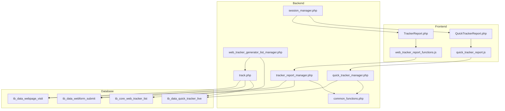
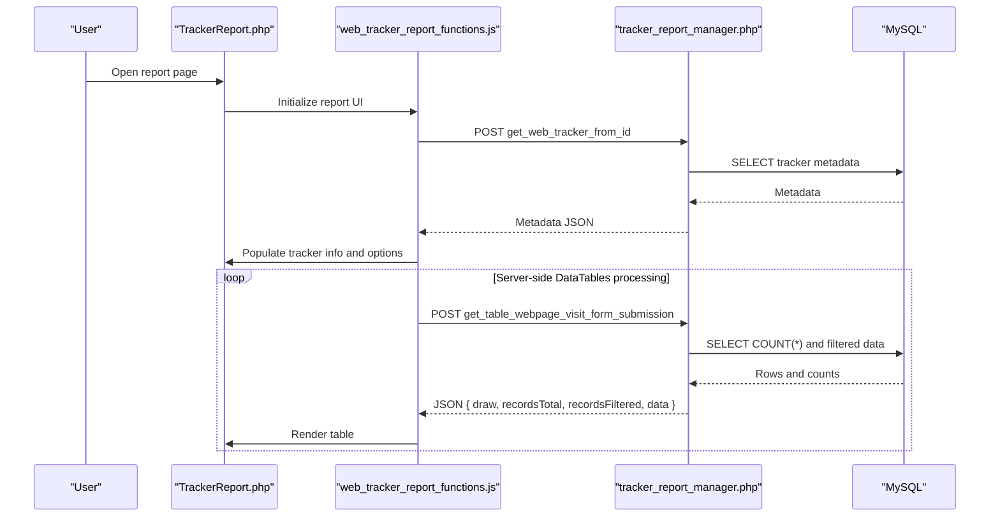
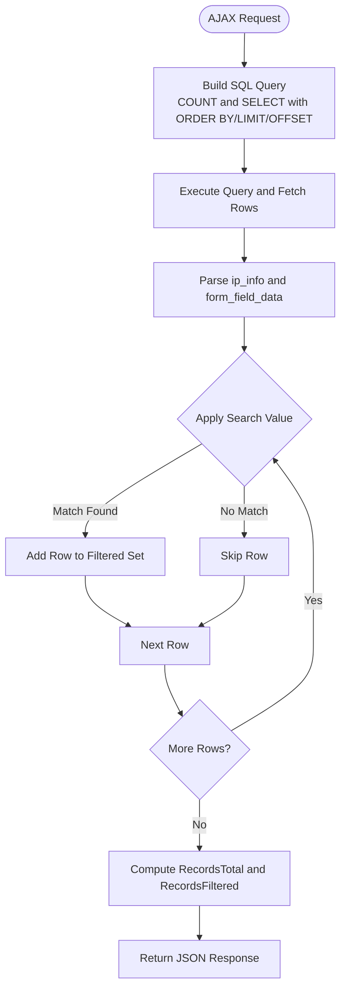
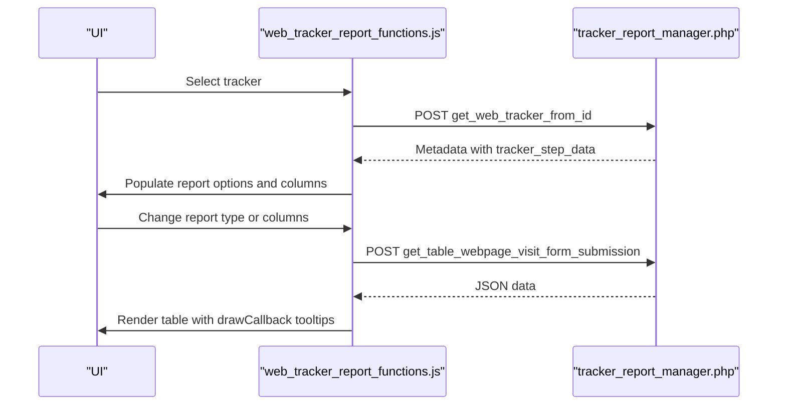
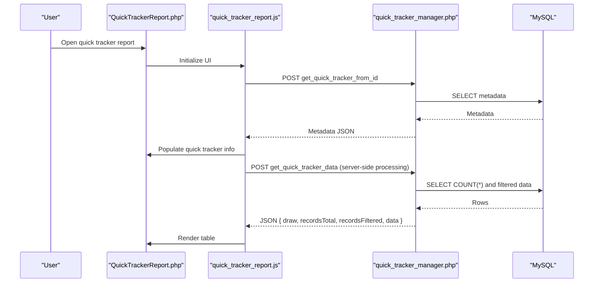
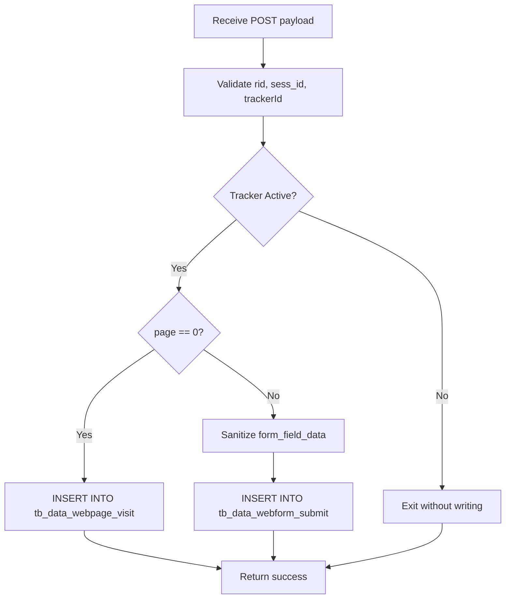
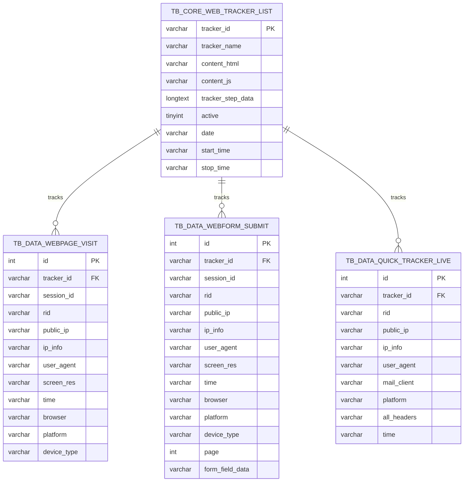
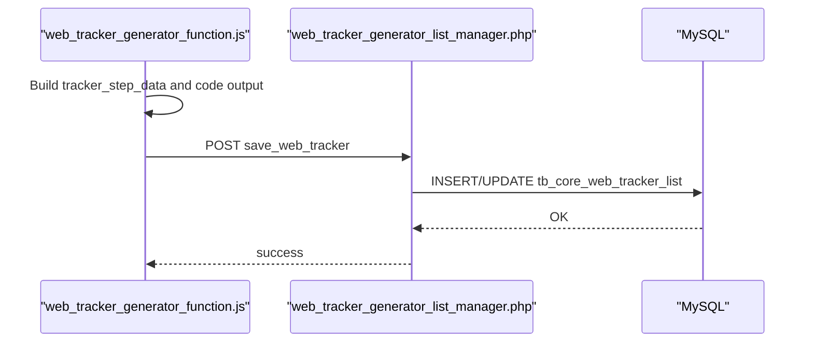
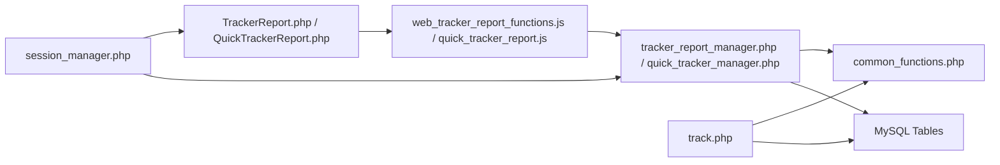

# Web Tracking Analytics

<cite>
**Referenced Files in This Document**
- [TrackerReport.php](file://spear/TrackerReport.php)
- [tracker_report_manager.php](file://spear/manager/tracker_report_manager.php)
- [web_tracker_report_functions.js](file://spear/js/web_tracker_report_functions.js)
- [QuickTrackerReport.php](file://spear/QuickTrackerReport.php)
- [quick_tracker_report.js](file://spear/js/quick_tracker_report.js)
- [quick_tracker_manager.php](file://spear/manager/quick_tracker_manager.php)
- [web_tracker_generator_list_manager.php](file://spear/manager/web_tracker_generator_list_manager.php)
- [web_tracker_generator_function.js](file://spear/js/web_tracker_generator_function.js)
- [track.php](file://track.php)
- [session_manager.php](file://spear/manager/session_manager.php)
- [common_functions.php](file://spear/manager/common_functions.php)
- [install_manager.php](file://install_manager.php)
- [README.md](file://README.md)
</cite>

## Table of Contents
1. [Introduction](#introduction)
2. [Project Structure](#project-structure)
3. [Core Components](#core-components)
4. [Architecture Overview](#architecture-overview)
5. [Detailed Component Analysis](#detailed-component-analysis)
6. [Dependency Analysis](#dependency-analysis)
7. [Performance Considerations](#performance-considerations)
8. [Troubleshooting Guide](#troubleshooting-guide)
9. [Conclusion](#conclusion)
10. [Appendices](#appendices)

## Introduction
This document explains the web tracking analytics system for page visit monitoring, form submission tracking, and behavioral analytics. It focuses on:
- TrackerReport.php for displaying comprehensive web tracking data including visitor demographics, geographic distribution, and engagement metrics
- tracker_report_manager.php for data aggregation, statistical calculations, and report generation algorithms
- web_tracker_report_functions.js for interactive chart rendering, filtering capabilities, and real-time data updates
- Practical examples for tracker configuration, data collection, and visualization
- Data models for page visits, form submissions, and quick tracker events
- Guidance on interpreting web tracking data for security assessment, user behavior analysis, and campaign effectiveness measurement

## Project Structure
The web tracking analytics spans three primary areas:
- Frontend report pages: TrackerReport.php and QuickTrackerReport.php
- Client-side report UI and interactivity: web_tracker_report_functions.js and quick_tracker_report.js
- Backend report managers: tracker_report_manager.php and quick_tracker_manager.php
- Tracker generator and runtime: web_tracker_generator_list_manager.php, web_tracker_generator_function.js, and track.php
- Shared utilities: session_manager.php and common_functions.php
- Database schema: install_manager.php defines the tracking tables

**Diagram sources**
- [TrackerReport.php:1-257](file://spear/TrackerReport.php#L1-L257)
- [QuickTrackerReport.php:1-268](file://spear/QuickTrackerReport.php#L1-L268)
- [web_tracker_report_functions.js:1-267](file://spear/js/web_tracker_report_functions.js#L1-L267)
- [quick_tracker_report.js:1-196](file://spear/js/quick_tracker_report.js#L1-L196)
- [tracker_report_manager.php:1-223](file://spear/manager/tracker_report_manager.php#L1-L223)
- [quick_tracker_manager.php:1-298](file://spear/manager/quick_tracker_manager.php#L1-L298)
- [web_tracker_generator_list_manager.php:1-220](file://spear/manager/web_tracker_generator_list_manager.php#L1-L220)
- [track.php:1-88](file://track.php#L1-L88)
- [install_manager.php:360-415](file://install_manager.php#L360-L415)

**Section sources**
- [TrackerReport.php:1-257](file://spear/TrackerReport.php#L1-L257)
- [QuickTrackerReport.php:1-268](file://spear/QuickTrackerReport.php#L1-L268)
- [web_tracker_report_functions.js:1-267](file://spear/js/web_tracker_report_functions.js#L1-L267)
- [quick_tracker_report.js:1-196](file://spear/js/quick_tracker_report.js#L1-L196)
- [tracker_report_manager.php:1-223](file://spear/manager/tracker_report_manager.php#L1-L223)
- [quick_tracker_manager.php:1-298](file://spear/manager/quick_tracker_manager.php#L1-L298)
- [web_tracker_generator_list_manager.php:1-220](file://spear/manager/web_tracker_generator_list_manager.php#L1-L220)
- [track.php:1-88](file://track.php#L1-L88)
- [install_manager.php:360-415](file://install_manager.php#L360-L415)

## Core Components
- TrackerReport.php: Renders the web tracker report UI, initializes DataTables, and loads tracker metadata and results via AJAX.
- tracker_report_manager.php: Implements server-side processing for page visits and form submissions, including sorting, filtering, pagination, and export to CSV/PDF/HTML.
- web_tracker_report_functions.js: Manages tracker selection, dynamic column selection, table rendering, export dialog, and AJAX requests to the backend.
- QuickTrackerReport.php: Provides a simplified report interface for quick tracker events (single-page tracking).
- quick_tracker_report.js: Handles quick tracker report loading, filtering, and export.
- quick_tracker_manager.php: Provides server-side processing for quick tracker live data and export.
- web_tracker_generator_list_manager.php: Saves, retrieves, and manages web tracker configurations and metadata.
- track.php: The runtime endpoint that captures page visits and form submissions, validates sessions, and writes to the appropriate tables.
- common_functions.php: Shared utilities for IP enrichment, time formatting, and export HTML generation.
- session_manager.php: Session validation and cookie management for secure access.

**Section sources**
- [TrackerReport.php:1-257](file://spear/TrackerReport.php#L1-L257)
- [tracker_report_manager.php:1-223](file://spear/manager/tracker_report_manager.php#L1-L223)
- [web_tracker_report_functions.js:1-267](file://spear/js/web_tracker_report_functions.js#L1-L267)
- [QuickTrackerReport.php:1-268](file://spear/QuickTrackerReport.php#L1-L268)
- [quick_tracker_report.js:1-196](file://spear/js/quick_tracker_report.js#L1-L196)
- [quick_tracker_manager.php:1-298](file://spear/manager/quick_tracker_manager.php#L1-L298)
- [web_tracker_generator_list_manager.php:1-220](file://spear/manager/web_tracker_generator_list_manager.php#L1-L220)
- [track.php:1-88](file://track.php#L1-L88)
- [common_functions.php:471-574](file://spear/manager/common_functions.php#L471-L574)
- [session_manager.php:35-44](file://spear/manager/session_manager.php#L35-L44)

## Architecture Overview
The system follows a client-server pattern:
- The frontend report pages render tables and charts and submit AJAX requests to backend managers.
- The backend managers query the database, apply filters and sorting, and return paginated results.
- The runtime endpoint track.php receives tracking events and persists them to the database.

**Diagram sources**
- [TrackerReport.php:1-257](file://spear/TrackerReport.php#L1-L257)
- [web_tracker_report_functions.js:222-266](file://spear/js/web_tracker_report_functions.js#L222-L266)
- [tracker_report_manager.php:109-207](file://spear/manager/tracker_report_manager.php#L109-L207)

**Section sources**
- [web_tracker_report_functions.js:169-220](file://spear/js/web_tracker_report_functions.js#L169-L220)
- [tracker_report_manager.php:109-207](file://spear/manager/tracker_report_manager.php#L109-L207)

## Detailed Component Analysis

### TrackerReport.php and tracker_report_manager.php
- TrackerReport.php sets up the UI, modal for tracker selection, and initializes DataTables. It loads tracker metadata and dynamically builds report columns based on tracker steps.
- tracker_report_manager.php implements:
  - get_web_tracker_from_id: Returns tracker metadata including step definitions for building report options.
  - get_table_webpage_visit_form_submission: Performs server-side processing for page visits and form submissions, including:
    - Sorting by supported columns
    - Filtering across selected columns
    - Pagination with draw/start/length
    - Aggregating ip_info and form_field_data into the final dataset
    - Converting timestamps to client time zone/format
  - download_report: Exports filtered data to CSV/PDF/HTML using TCPDF and a shared HTML renderer.

**Diagram sources**
- [tracker_report_manager.php:111-207](file://spear/manager/tracker_report_manager.php#L111-L207)

**Section sources**
- [TrackerReport.php:1-257](file://spear/TrackerReport.php#L1-L257)
- [tracker_report_manager.php:109-223](file://spear/manager/tracker_report_manager.php#L109-L223)

### web_tracker_report_functions.js
- Initializes Select2 dropdowns, sortable column lists, and tooltips.
- Loads tracker list into a modal and populates report options based on tracker steps.
- Builds column selections dynamically (common fields and per-page form fields).
- Uses DataTables with server-side processing to render paginated, searchable, and sortable tables.
- Handles export dialog and initiates download via XMLHttpRequest with binary response handling.

**Diagram sources**
- [web_tracker_report_functions.js:222-266](file://spear/js/web_tracker_report_functions.js#L222-L266)
- [tracker_report_manager.php:109-207](file://spear/manager/tracker_report_manager.php#L109-L207)

**Section sources**
- [web_tracker_report_functions.js:1-267](file://spear/js/web_tracker_report_functions.js#L1-L267)
- [tracker_report_manager.php:109-207](file://spear/manager/tracker_report_manager.php#L109-L207)

### QuickTrackerReport.php and quick_tracker_manager.php
- QuickTrackerReport.php mirrors the web tracker report UI for quick tracker events.
- quick_tracker_manager.php:
  - getQuickTrackerFromId: Returns quick tracker metadata.
  - getQuickTrackerData: Server-side processing for quick tracker live data with similar filtering and pagination.
  - downloadReport: Exports quick tracker data to CSV/PDF/HTML.

**Diagram sources**
- [QuickTrackerReport.php:1-268](file://spear/QuickTrackerReport.php#L1-L268)
- [quick_tracker_report.js:83-152](file://spear/js/quick_tracker_report.js#L83-L152)
- [quick_tracker_manager.php:119-213](file://spear/manager/quick_tracker_manager.php#L119-L213)

**Section sources**
- [QuickTrackerReport.php:1-268](file://spear/QuickTrackerReport.php#L1-L268)
- [quick_tracker_report.js:1-196](file://spear/js/quick_tracker_report.js#L1-L196)
- [quick_tracker_manager.php:119-298](file://spear/manager/quick_tracker_manager.php#L119-L298)

### Runtime Endpoint and Data Collection (track.php)
- Validates presence of rid and trackerId.
- Detects browser, OS, and device type.
- Enriches IP info using external service or cached data.
- Inserts page visit or form submission records into the appropriate table based on page parameter.
- Checks tracker active status before writing.

**Diagram sources**
- [track.php:19-83](file://track.php#L19-L83)

**Section sources**
- [track.php:1-88](file://track.php#L1-L88)

### Data Models and Schema
The system stores tracking data in the following tables:
- tb_data_webpage_visit: Page visit events with session, IP info, user agent, screen resolution, and device classification.
- tb_data_webform_submit: Form submission events with page number and serialized form field data.
- tb_data_quick_tracker_live: Single-page quick tracker events for rapid analysis.
- tb_core_web_tracker_list: Stores tracker metadata, steps, and activation status.

**Diagram sources**
- [install_manager.php:360-415](file://install_manager.php#L360-L415)

**Section sources**
- [install_manager.php:360-415](file://install_manager.php#L360-L415)

### Tracker Generator and Management
- web_tracker_generator_list_manager.php handles saving, retrieving, pausing/stopping, copying, and deleting web trackers.
- web_tracker_generator_function.js builds tracker step definitions, generates HTML and JS code, and saves to the backend.

**Diagram sources**
- [web_tracker_generator_function.js:727-763](file://spear/js/web_tracker_generator_function.js#L727-L763)
- [web_tracker_generator_list_manager.php:44-69](file://spear/manager/web_tracker_generator_list_manager.php#L44-L69)

**Section sources**
- [web_tracker_generator_list_manager.php:1-220](file://spear/manager/web_tracker_generator_list_manager.php#L1-L220)
- [web_tracker_generator_function.js:1-800](file://spear/js/web_tracker_generator_function.js#L1-L800)

## Dependency Analysis
- UI depends on DataTables and Select2 for rendering and selection.
- Frontend scripts depend on backend managers for server-side processing and export.
- Backend managers depend on shared utilities for time formatting and export HTML generation.
- Runtime endpoint depends on browser detection and IP enrichment utilities.
- All components enforce session validation via session_manager.php.

**Diagram sources**
- [TrackerReport.php:1-257](file://spear/TrackerReport.php#L1-L257)
- [QuickTrackerReport.php:1-268](file://spear/QuickTrackerReport.php#L1-L268)
- [web_tracker_report_functions.js:1-267](file://spear/js/web_tracker_report_functions.js#L1-L267)
- [quick_tracker_report.js:1-196](file://spear/js/quick_tracker_report.js#L1-L196)
- [tracker_report_manager.php:1-223](file://spear/manager/tracker_report_manager.php#L1-L223)
- [quick_tracker_manager.php:1-298](file://spear/manager/quick_tracker_manager.php#L1-L298)
- [common_functions.php:471-574](file://spear/manager/common_functions.php#L471-L574)
- [track.php:1-88](file://track.php#L1-L88)
- [session_manager.php:35-44](file://spear/manager/session_manager.php#L35-L44)

**Section sources**
- [session_manager.php:35-44](file://spear/manager/session_manager.php#L35-L44)
- [common_functions.php:471-574](file://spear/manager/common_functions.php#L471-L574)

## Performance Considerations
- Server-side processing: Use column indexes and ORDER BY clauses judiciously; ensure database indexes on frequently filtered columns (e.g., tracker_id, time).
- Pagination: Keep page lengths reasonable to limit payload sizes; leverage recordsTotal and recordsFiltered for accurate counters.
- Export: For large datasets, consider streaming CSV/PDF generation and limiting selected columns to reduce memory usage.
- IP enrichment: External API calls can be slow; cache ip_info when possible and handle fallbacks gracefully.
- Timezone conversions: Convert timestamps on the server to minimize client-side computation overhead.

[No sources needed since this section provides general guidance]

## Troubleshooting Guide
- Access denied: Ensure session validation passes; check session_manager.php for session creation and termination.
- No data returned: Verify tracker_id correctness and that the tracker is active; confirm runtime endpoint received rid and trackerId.
- Export fails: Confirm backend export handlers receive proper parameters and that TCPDF is available for PDF generation.
- IP enrichment errors: External service unavailability leads to fallback behavior; inspect getIPInfo and craftIPInfoArr logic.
- Timezone discrepancies: Use getTimeInfo and getInClientTime to normalize timestamps across clients.

**Section sources**
- [session_manager.php:35-44](file://spear/manager/session_manager.php#L35-L44)
- [track.php:19-83](file://track.php#L19-L83)
- [common_functions.php:257-290](file://spear/manager/common_functions.php#L257-L290)
- [common_functions.php:486-502](file://spear/manager/common_functions.php#L486-L502)

## Conclusion
The web tracking analytics system integrates a robust runtime endpoint, flexible report managers, and intuitive UIs to deliver actionable insights on page visits, form submissions, and quick tracker events. By leveraging server-side processing, standardized data models, and export capabilities, it supports security assessments, user behavior analysis, and campaign effectiveness measurement.

[No sources needed since this section summarizes without analyzing specific files]

## Appendices

### Practical Examples

- Tracker configuration
  - Use the web tracker generator to define pages, form fields, and submission buttons; save the tracker to activate it.
  - Reference: [web_tracker_generator_function.js:727-763](file://spear/js/web_tracker_generator_function.js#L727-L763), [web_tracker_generator_list_manager.php:44-69](file://spear/manager/web_tracker_generator_list_manager.php#L44-L69)

- Data collection process
  - Embed the generated tracker script on target pages; ensure URLs include rid; runtime endpoint captures visits and submissions.
  - Reference: [track.php:19-83](file://track.php#L19-L83), [README.md:46-63](file://README.md#L46-L63)

- Visualization techniques
  - Use the report UI to select columns, apply filters, and export to CSV/PDF/HTML for further analysis.
  - Reference: [web_tracker_report_functions.js:169-220](file://spear/js/web_tracker_report_functions.js#L169-L220), [tracker_report_manager.php:25-109](file://spear/manager/tracker_report_manager.php#L25-L109)

- Common reporting scenarios
  - Traffic analysis: Use page visit data grouped by country, city, ISP, and device type.
  - Conversion funnel tracking: Map form submissions across pages using page numbers and form_field_data.
  - User journey mapping: Correlate session_id across visits and submissions to reconstruct navigation paths.
  - Reference: [install_manager.php:360-415](file://install_manager.php#L360-L415), [tracker_report_manager.php:111-207](file://spear/manager/tracker_report_manager.php#L111-L207)

- Interpreting data for security assessment and campaign measurement
  - Security: Identify suspicious IPs, unusual devices, and geographic anomalies via ip_info and device_type.
  - Behavior: Analyze drop-off points using page visit vs. form submission ratios.
  - Effectiveness: Compare open rates and engagement metrics from combined web-email dashboards.
  - Reference: [common_functions.php:257-321](file://spear/manager/common_functions.php#L257-L321), [README.md:26-38](file://README.md#L26-L38)