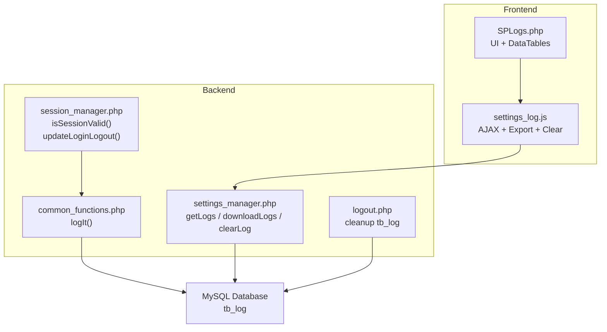
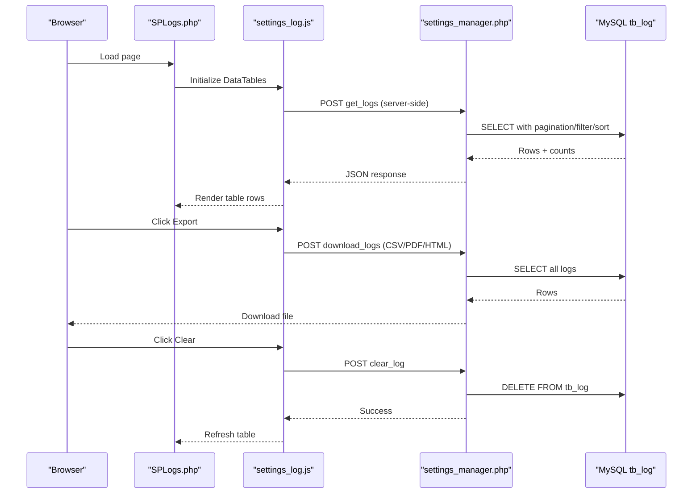
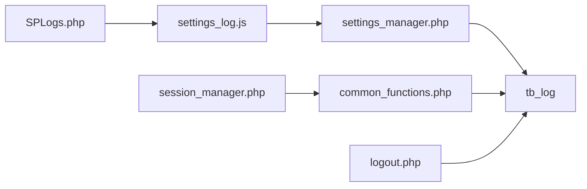

# Log Monitoring

<cite>
**Referenced Files in This Document**
- [SPLogs.php](file://spear/SPLogs.php)
- [settings_log.js](file://spear/js/settings_log.js)
- [settings_manager.php](file://spear/manager/settings_manager.php)
- [session_manager.php](file://spear/manager/session_manager.php)
- [common_functions.php](file://spear/manager/common_functions.php)
- [logout.php](file://spear/logout.php)
- [install.php](file://install.php)
- [tb_log.sql](file://install_manager.php)
</cite>

## Table of Contents
1. [Introduction](#introduction)
2. [Project Structure](#project-structure)
3. [Core Components](#core-components)
4. [Architecture Overview](#architecture-overview)
5. [Detailed Component Analysis](#detailed-component-analysis)
6. [Dependency Analysis](#dependency-analysis)
7. [Performance Considerations](#performance-considerations)
8. [Troubleshooting Guide](#troubleshooting-guide)
9. [Conclusion](#conclusion)
10. [Appendices](#appendices)

## Introduction
This document explains the log monitoring and audit trail functionality in the application. It focuses on how system logs, user activities, and administrative actions are captured, displayed, filtered, exported, and retained. It also documents the relationships with session management and authentication, and provides practical guidance for security event tracking, user activity analysis, system error identification, compliance reporting, and incident interpretation.

## Project Structure
The log monitoring feature spans front-end and back-end components:
- Front-end: A dedicated page to view and export logs, powered by a DataTables-driven interface.
- Back-end: A server-side handler that serves paginated, searchable, sortable logs and performs exports and clearing operations.
- Logging engine: A centralized logging function that records user actions with timestamps and IP addresses.
- Session and authentication: Session validation and login/logout triggers that emit audit events.

**Diagram sources**
- [SPLogs.php:1-203](file://spear/SPLogs.php#L1-L203)
- [settings_log.js:1-105](file://spear/js/settings_log.js#L1-L105)
- [settings_manager.php:1-474](file://spear/manager/settings_manager.php#L1-L474)
- [session_manager.php:1-244](file://spear/manager/session_manager.php#L1-L244)
- [common_functions.php:575-586](file://spear/manager/common_functions.php#L575-L586)
- [logout.php:1-20](file://spear/logout.php#L1-L20)

**Section sources**
- [SPLogs.php:1-203](file://spear/SPLogs.php#L1-L203)
- [settings_log.js:1-105](file://spear/js/settings_log.js#L1-L105)
- [settings_manager.php:1-474](file://spear/manager/settings_manager.php#L1-L474)
- [session_manager.php:1-244](file://spear/manager/session_manager.php#L1-L244)
- [common_functions.php:575-586](file://spear/manager/common_functions.php#L575-L586)
- [logout.php:1-20](file://spear/logout.php#L1-L20)

## Core Components
- Log display page: Provides a searchable, sortable table of audit events with export and clear capabilities.
- Server-side log handler: Implements server-side pagination, filtering, sorting, and export to CSV/PDF/HTML.
- Centralized logger: Captures user actions with username, log message, client IP, and timestamp.
- Session and authentication hooks: Emits login/logout events and participates in log retention cleanup.

Key responsibilities:
- SPLogs.php: Renders the UI, initializes DataTables, and wires up modal actions for export and clear.
- settings_log.js: Configures DataTables AJAX endpoint, handles export requests, and clears logs.
- settings_manager.php: Implements getLogs, downloadLogs, and clearLog endpoints.
- common_functions.php: Provides logIt() to persist audit events.
- session_manager.php: Validates sessions and emits login/logout events via logIt().
- logout.php: Performs cleanup by keeping the latest N log entries.

**Section sources**
- [SPLogs.php:1-203](file://spear/SPLogs.php#L1-L203)
- [settings_log.js:1-105](file://spear/js/settings_log.js#L1-L105)
- [settings_manager.php:358-472](file://spear/manager/settings_manager.php#L358-L472)
- [common_functions.php:575-586](file://spear/manager/common_functions.php#L575-L586)
- [session_manager.php:35-73](file://spear/manager/session_manager.php#L35-L73)
- [logout.php:1-20](file://spear/logout.php#L1-L20)

## Architecture Overview
The log monitoring pipeline integrates UI, AJAX, server-side processing, and persistence.

**Diagram sources**
- [SPLogs.php:1-203](file://spear/SPLogs.php#L1-L203)
- [settings_log.js:1-105](file://spear/js/settings_log.js#L1-L105)
- [settings_manager.php:358-472](file://spear/manager/settings_manager.php#L358-L472)

## Detailed Component Analysis

### Log Display Page (SPLogs.php)
- Initializes DataTables with server-side processing.
- Provides “Clear Log” and “Export Log” actions via modals.
- Renders columns: ID, Username, Log, IP, Date Time.

Operational notes:
- The page enforces session validity before rendering.
- The table is ordered by ID descending to show newest entries first.

**Section sources**
- [SPLogs.php:1-203](file://spear/SPLogs.php#L1-L203)

### Front-End Data Fetching and Actions (settings_log.js)
- DataTables configuration:
  - Server-side processing with AJAX to settings_manager.
  - Columns: id, username, log, ip, date.
  - Sorting defaults to descending by ID.
  - Pagination menu options: 20, 50, 100, 500, 1000, All.
- Export action:
  - Sends POST with action_type download_logs and file_format.
  - Receives binary response and triggers a download.
- Clear action:
  - Sends POST with action_type clear_log.
  - On success, reloads the table.

Filtering and sorting:
- Supports global search across username, log, and ip.
- Sortable by username, log, ip, date.

**Section sources**
- [settings_log.js:1-105](file://spear/js/settings_log.js#L1-L105)

### Server-Side Handler (settings_manager.php)
- Endpoints:
  - get_logs: Paginates, filters, sorts logs, and returns JSON for DataTables.
  - download_logs: Exports all logs to CSV, PDF, or HTML.
  - clear_log: Deletes all log entries.
- Filtering and sorting:
  - Global search applies to username, log, ip.
  - Sortable columns validated against allowed list.
- Export:
  - CSV: Uses fputcsv and sets appropriate headers.
  - PDF: Uses TCPDF to render HTML table and stream inline.
  - HTML: Streams HTML content.

Data model mapping:
- The handler selects username, log, ip, date from tb_log and converts dates to client time zone.

**Section sources**
- [settings_manager.php:358-472](file://spear/manager/settings_manager.php#L358-L472)

### Centralized Logger (common_functions.php)
- logIt(message, username):
  - Persists a log entry with username, message, client IP, and formatted timestamp.
  - Uses the global entry_time and retrieves public IP.
  - Inserts into tb_log.

Audit coverage:
- Emits login/logout events via session_manager’s updateLoginLogout.

**Section sources**
- [common_functions.php:575-586](file://spear/manager/common_functions.php#L575-L586)

### Session Management and Audit Hooks (session_manager.php)
- Session validation:
  - isSessionValid checks session and refreshes expiry.
- Login/logout audit:
  - updateLoginLogout updates tb_main last_login/last_logout and calls logIt for login/logout.
- Cookie and time zone:
  - Stores client time zone in a cookie for display conversions.

**Section sources**
- [session_manager.php:35-73](file://spear/manager/session_manager.php#L35-L73)

### Log Retention and Cleanup (logout.php)
- On logout, keeps only the latest 1000 log entries by deleting older ones.
- Uses a subquery to select the latest IDs and retains them.

**Section sources**
- [logout.php:1-20](file://spear/logout.php#L1-L20)

### Database Schema (tb_log)
- Columns:
  - id: auto-increment primary key.
  - username: actor identifier.
  - log: textual description of the event.
  - ip: client IP address.
  - date: timestamp string in d-m-Y h:i A format.

Creation script reference:
- The table is created during installation.

**Section sources**
- [tb_log.sql:465-471](file://install_manager.php#L465-L471)

## Dependency Analysis
- UI depends on DataTables and custom scripts.
- Front-end relies on settings_manager.php for server-side processing.
- Logging depends on common_functions.php and session context.
- Retention depends on logout.php and tb_log structure.

**Diagram sources**
- [SPLogs.php:1-203](file://spear/SPLogs.php#L1-L203)
- [settings_log.js:1-105](file://spear/js/settings_log.js#L1-L105)
- [settings_manager.php:1-474](file://spear/manager/settings_manager.php#L1-L474)
- [session_manager.php:1-244](file://spear/manager/session_manager.php#L1-L244)
- [common_functions.php:575-586](file://spear/manager/common_functions.php#L575-L586)
- [logout.php:1-20](file://spear/logout.php#L1-L20)

**Section sources**
- [SPLogs.php:1-203](file://spear/SPLogs.php#L1-L203)
- [settings_log.js:1-105](file://spear/js/settings_log.js#L1-L105)
- [settings_manager.php:1-474](file://spear/manager/settings_manager.php#L1-L474)
- [session_manager.php:1-244](file://spear/manager/session_manager.php#L1-L244)
- [common_functions.php:575-586](file://spear/manager/common_functions.php#L575-L586)
- [logout.php:1-20](file://spear/logout.php#L1-L20)

## Performance Considerations
- Server-side pagination: The get_logs endpoint uses LIMIT/OFFSET to avoid loading all rows at once.
- Indexing: Consider adding indexes on username, log, ip, and date for faster filtering and sorting.
- Export size: download_logs loads all rows into memory; large datasets may increase memory usage.
- Retention: logout.php keeps only the latest 1000 entries; adjust this threshold based on storage capacity and audit requirements.
- Time zone conversions: Converting dates for display adds overhead; cache or precompute where feasible.

[No sources needed since this section provides general guidance]

## Troubleshooting Guide
Common tasks and resolutions:
- Logs not appearing:
  - Verify session validity and that logIt is invoked for relevant actions.
  - Confirm tb_log exists and is writable.
- Export fails:
  - Ensure download_logs receives a valid file_format and that TCPDF is available for PDF export.
- Clear log fails:
  - Check database permissions and that clear_log executes successfully.
- Retention not working:
  - Ensure logout.php runs and that the subquery retains the latest 1000 entries.

Security and compliance:
- Monitor login/logout events for suspicious patterns.
- Filter by username/ip/date to investigate unauthorized access attempts.
- Export logs for compliance audits and retain according to policy.

**Section sources**
- [settings_manager.php:416-472](file://spear/manager/settings_manager.php#L416-L472)
- [logout.php:1-20](file://spear/logout.php#L1-L20)

## Conclusion
The log monitoring system provides a robust foundation for tracking system activity, user actions, and administrative changes. It offers real-time visibility via a searchable, sortable UI, supports export for external analysis, and enforces retention policies. Integrating session and authentication hooks ensures comprehensive audit coverage suitable for security monitoring and compliance reporting.

[No sources needed since this section summarizes without analyzing specific files]

## Appendices

### Log Entry Fields and Formats
- Fields stored in tb_log:
  - username: actor identifier.
  - log: human-readable event description.
  - ip: client IP address.
  - date: timestamp string in d-m-Y h:i A format.

Timestamp handling:
- The application sets a global formatted timestamp and uses it consistently for log entries.

Session and authentication integration:
- Login and logout events are emitted via logIt, enabling audit trails for authentication lifecycle.

**Section sources**
- [common_functions.php:575-586](file://spear/manager/common_functions.php#L575-L586)
- [session_manager.php:58-73](file://spear/manager/session_manager.php#L58-L73)
- [logout.php:11-13](file://spear/logout.php#L11-L13)

### Filtering and Export Capabilities
- Filtering:
  - Global search across username, log, ip.
  - Sortable columns: username, log, ip, date.
- Export:
  - CSV, PDF, HTML formats.
  - Filename includes a timestamp derived from the global entry_time.

**Section sources**
- [settings_manager.php:358-414](file://spear/manager/settings_manager.php#L358-L414)
- [settings_manager.php:416-462](file://spear/manager/settings_manager.php#L416-L462)
- [settings_log.js:51-87](file://spear/js/settings_log.js#L51-L87)

### Log Retention and Storage Optimization
- Retention policy:
  - Keeps the latest 1000 entries by ID.
- Rotation procedure:
  - Executed on logout to limit growth.
- Storage optimization:
  - Consider archiving old logs externally and purging based on compliance requirements.

**Section sources**
- [logout.php:11-13](file://spear/logout.php#L11-L13)

### Interpretation Guidance for Security Incidents and Troubleshooting
- Security event tracking:
  - Investigate frequent failed login attempts, unusual IPs, and concurrent sessions.
- User activity analysis:
  - Track administrative actions and configuration changes.
- System error identification:
  - Correlate timestamps with application errors and export logs for analysis.
- Compliance reporting:
  - Use export to CSV/PDF/HTML for regulatory submissions.

[No sources needed since this section provides general guidance]