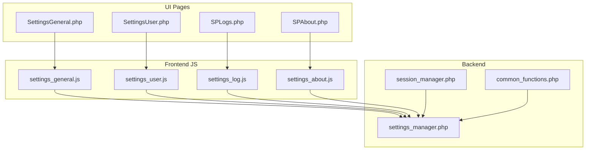
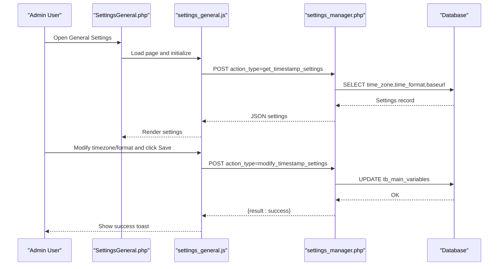
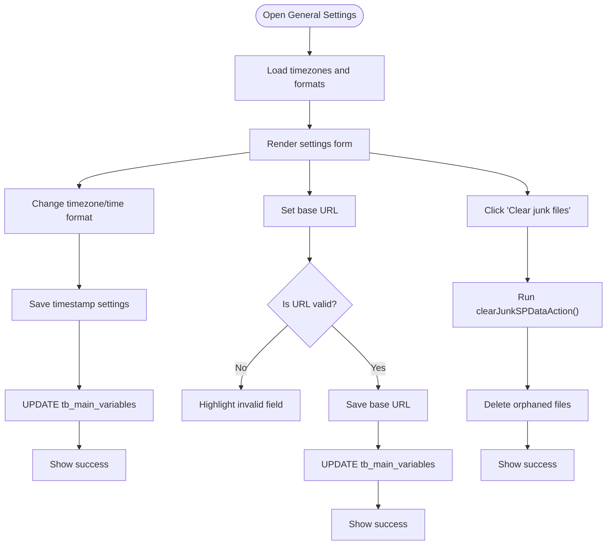
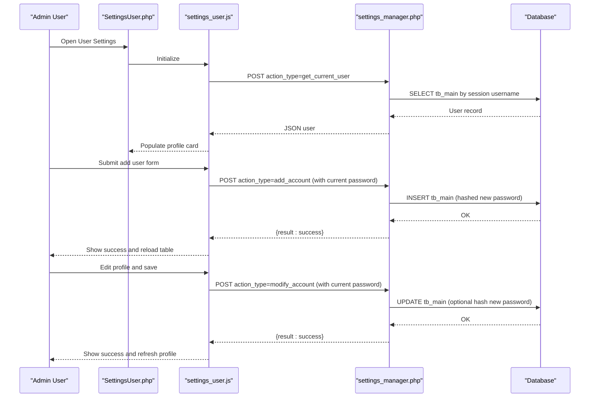
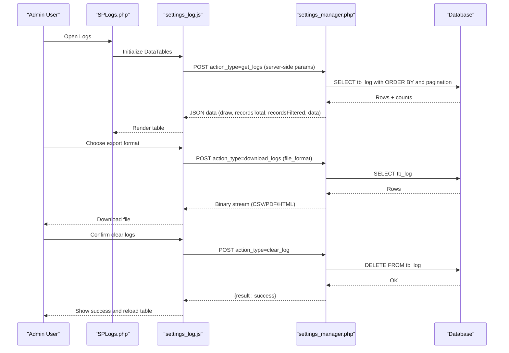
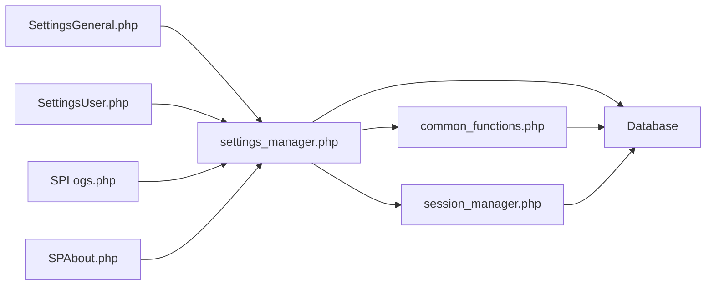

# System Administration

<cite>
**Referenced Files in This Document**
- [SPLogs.php](file://spear/SPLogs.php)
- [SettingsGeneral.php](file://spear/SettingsGeneral.php)
- [SettingsUser.php](file://spear/SettingsUser.php)
- [settings_manager.php](file://spear/manager/settings_manager.php)
- [settings_general.js](file://spear/js/settings_general.js)
- [settings_user.js](file://spear/js/settings_user.js)
- [settings_log.js](file://spear/js/settings_log.js)
- [session_manager.php](file://spear/manager/session_manager.php)
- [common_functions.php](file://spear/manager/common_functions.php)
- [z_menu.php](file://spear/z_menu.php)
- [SPAbout.php](file://spear/SPAbout.php)
- [settings_about.js](file://spear/js/settings_about.js)
- [install.php](file://install.php)
- [install_manager.php](file://install_manager.php)
</cite>

## Table of Contents
1. [Introduction](#introduction)
2. [Project Structure](#project-structure)
3. [Core Components](#core-components)
4. [Architecture Overview](#architecture-overview)
5. [Detailed Component Analysis](#detailed-component-analysis)
6. [Dependency Analysis](#dependency-analysis)
7. [Performance Considerations](#performance-considerations)
8. [Troubleshooting Guide](#troubleshooting-guide)
9. [Conclusion](#conclusion)
10. [Appendices](#appendices)

## Introduction
This document explains the system administration capabilities of the platform with a focus on user management, global settings configuration, log monitoring, and system maintenance. It documents the backend settings manager and the frontend UIs for general settings, user management, and logs, and clarifies how authentication and session management integrate with security policies. Practical guidance is provided for provisioning users, adjusting system parameters, analyzing logs, performing maintenance tasks, and checking system updates.

## Project Structure
The system admin UIs are standard PHP pages that include shared assets and rely on a centralized settings manager backend. Authentication and session management are enforced via session checks and login flows. The menu exposes settings pages for general configuration, user management, logs, and about information.

**Diagram sources**
- [SettingsGeneral.php:1-194](file://spear/SettingsGeneral.php#L1-L194)
- [SettingsUser.php:1-377](file://spear/SettingsUser.php#L1-L377)
- [SPLogs.php:1-203](file://spear/SPLogs.php#L1-L203)
- [SPAbout.php:1-145](file://spear/SPAbout.php#L1-L145)
- [settings_general.js:1-412](file://spear/js/settings_general.js#L1-L412)
- [settings_user.js:1-274](file://spear/js/settings_user.js#L1-L274)
- [settings_log.js:1-105](file://spear/js/settings_log.js#L1-L105)
- [settings_about.js:1-60](file://spear/js/settings_about.js#L1-L60)
- [session_manager.php:1-244](file://spear/manager/session_manager.php#L1-L244)
- [settings_manager.php:1-474](file://spear/manager/settings_manager.php#L1-L474)
- [common_functions.php:1-595](file://spear/manager/common_functions.php#L1-L595)

**Section sources**
- [SettingsGeneral.php:1-194](file://spear/SettingsGeneral.php#L1-L194)
- [SettingsUser.php:1-377](file://spear/SettingsUser.php#L1-L377)
- [SPLogs.php:1-203](file://spear/SPLogs.php#L1-L203)
- [SPAbout.php:1-145](file://spear/SPAbout.php#L1-L145)
- [z_menu.php:153-159](file://spear/z_menu.php#L153-L159)

## Core Components
- General Settings UI: Allows configuring timezone/time format, base URL, and clearing junk data.
- User Management UI: Lists admin accounts, supports adding/modifying/deleting users, and updating current user profile.
- Logs UI: Displays audit trail events, supports filtering/searching, exporting, and clearing logs.
- Settings Manager Backend: Implements actions for user CRUD, timestamp/base URL settings, log retrieval/export/clear, and junk data cleanup.
- Session and Security: Enforces session validity, manages login/logout history, and writes audit logs.

**Section sources**
- [settings_manager.php:16-50](file://spear/manager/settings_manager.php#L16-L50)
- [session_manager.php:35-44](file://spear/manager/session_manager.php#L35-L44)
- [common_functions.php:576-586](file://spear/manager/common_functions.php#L576-L586)

## Architecture Overview
The admin UIs post JSON payloads to the settings manager endpoint, which validates sessions, applies requested actions, and returns structured responses. Audit logging is performed centrally for login/logout and other administrative actions.

**Diagram sources**
- [SettingsGeneral.php:68-145](file://spear/SettingsGeneral.php#L68-L145)
- [settings_general.js:349-367](file://spear/js/settings_general.js#L349-L367)
- [settings_manager.php:186-202](file://spear/manager/settings_manager.php#L186-L202)
- [common_functions.php:471-502](file://spear/manager/common_functions.php#L471-L502)

## Detailed Component Analysis

### General Settings: SettingsGeneral.php and settings_manager.php
- Purpose: Configure display timezone and time format, set the base URL for trackers, and clean up junk data.
- Key backend actions:
  - Get and modify timestamp settings.
  - Get base URL and update it.
  - Clear junk data across uploads, attachments, payloads, and host files.
- Frontend behavior:
  - Loads available timezones and formats.
  - Validates base URL before saving.
  - Provides a “clear junk” operation.

**Diagram sources**
- [SettingsGeneral.php:70-142](file://spear/SettingsGeneral.php#L70-L142)
- [settings_general.js:244-274](file://spear/js/settings_general.js#L244-L274)
- [settings_general.js:369-394](file://spear/js/settings_general.js#L369-L394)
- [settings_general.js:396-412](file://spear/js/settings_general.js#L396-L412)
- [settings_manager.php:172-184](file://spear/manager/settings_manager.php#L172-L184)
- [settings_manager.php:186-195](file://spear/manager/settings_manager.php#L186-L195)
- [settings_manager.php:206-310](file://spear/manager/settings_manager.php#L206-L310)

**Section sources**
- [SettingsGeneral.php:70-142](file://spear/SettingsGeneral.php#L70-L142)
- [settings_general.js:326-347](file://spear/js/settings_general.js#L326-L347)
- [settings_general.js:369-394](file://spear/js/settings_general.js#L369-L394)
- [settings_general.js:396-412](file://spear/js/settings_general.js#L396-L412)
- [settings_manager.php:172-184](file://spear/manager/settings_manager.php#L172-L184)
- [settings_manager.php:186-195](file://spear/manager/settings_manager.php#L186-L195)
- [settings_manager.php:206-310](file://spear/manager/settings_manager.php#L206-L310)

### User Management: SettingsUser.php and settings_manager.php
- Purpose: Manage administrative accounts, update current user profile, and enforce authorization via current password verification.
- Key backend actions:
  - Get current user info and user list.
  - Add, modify, and delete accounts.
  - Authorization check ensures only correct current password allows modifications.
- Frontend behavior:
  - Displays current user avatar, name, username, email, creation date, and last login.
  - Supports adding new admin users with avatar selection and password validation.
  - Allows editing profile and changing password with confirmation checks.

**Diagram sources**
- [SettingsUser.php:69-126](file://spear/SettingsUser.php#L69-L126)
- [settings_user.js:6-28](file://spear/js/settings_user.js#L6-L28)
- [settings_user.js:30-96](file://spear/js/settings_user.js#L30-L96)
- [settings_user.js:98-156](file://spear/js/settings_user.js#L98-L156)
- [settings_manager.php:54-70](file://spear/manager/settings_manager.php#L54-L70)
- [settings_manager.php:88-105](file://spear/manager/settings_manager.php#L88-L105)
- [settings_manager.php:108-132](file://spear/manager/settings_manager.php#L108-L132)
- [settings_manager.php:134-146](file://spear/manager/settings_manager.php#L134-L146)

**Section sources**
- [SettingsUser.php:69-126](file://spear/SettingsUser.php#L69-L126)
- [settings_user.js:6-28](file://spear/js/settings_user.js#L6-L28)
- [settings_user.js:30-96](file://spear/js/settings_user.js#L30-L96)
- [settings_user.js:98-156](file://spear/js/settings_user.js#L98-L156)
- [settings_manager.php:54-70](file://spear/manager/settings_manager.php#L54-L70)
- [settings_manager.php:88-105](file://spear/manager/settings_manager.php#L88-L105)
- [settings_manager.php:108-132](file://spear/manager/settings_manager.php#L108-L132)
- [settings_manager.php:134-146](file://spear/manager/settings_manager.php#L134-L146)

### Logs Monitoring: SPLogs.php and settings_manager.php
- Purpose: Display audit trail events, export logs, and clear logs.
- Key backend actions:
  - Paginated and searchable log retrieval with DataTables server-side processing.
  - Export logs to CSV/PDF/HTML.
  - Clear logs table.
- Frontend behavior:
  - Initializes DataTables with AJAX to fetch logs.
  - Provides export dialog and confirmation for clearing logs.

**Diagram sources**
- [SPLogs.php:78-101](file://spear/SPLogs.php#L78-L101)
- [settings_log.js:8-49](file://spear/js/settings_log.js#L8-L49)
- [settings_log.js:51-87](file://spear/js/settings_log.js#L51-L87)
- [settings_log.js:89-105](file://spear/js/settings_log.js#L89-L105)
- [settings_manager.php:359-414](file://spear/manager/settings_manager.php#L359-L414)
- [settings_manager.php:416-463](file://spear/manager/settings_manager.php#L416-L463)
- [settings_manager.php:465-472](file://spear/manager/settings_manager.php#L465-L472)

**Section sources**
- [SPLogs.php:78-101](file://spear/SPLogs.php#L78-L101)
- [settings_log.js:8-49](file://spear/js/settings_log.js#L8-L49)
- [settings_log.js:51-87](file://spear/js/settings_log.js#L51-L87)
- [settings_log.js:89-105](file://spear/js/settings_log.js#L89-L105)
- [settings_manager.php:359-414](file://spear/manager/settings_manager.php#L359-L414)
- [settings_manager.php:416-463](file://spear/manager/settings_manager.php#L416-L463)
- [settings_manager.php:465-472](file://spear/manager/settings_manager.php#L465-L472)

### About Page and System Information
- Purpose: Display current version and provide update checking against a remote endpoint.
- Behavior:
  - Renders version from backend.
  - Checks for newer versions and displays a message with a download link when available.

**Section sources**
- [SPAbout.php:68-89](file://spear/SPAbout.php#L68-L89)
- [settings_about.js:1-18](file://spear/js/settings_about.js#L1-L18)
- [common_functions.php:591-593](file://spear/manager/common_functions.php#L591-L593)

## Dependency Analysis
- Authentication and session:
  - Session validation enforces access to admin pages.
  - Login/logout updates history and triggers audit logging.
- Settings manager orchestrates:
  - User CRUD operations with current-password authorization.
  - Global settings persistence for timezone/time format and base URL.
  - Log retrieval/export/clear and junk data cleanup.
- Shared utilities:
  - Timezone conversion helpers and logging utility centralize common logic.

**Diagram sources**
- [settings_manager.php:1-50](file://spear/manager/settings_manager.php#L1-L50)
- [session_manager.php:35-44](file://spear/manager/session_manager.php#L35-L44)
- [common_functions.php:471-502](file://spear/manager/common_functions.php#L471-L502)

**Section sources**
- [settings_manager.php:1-50](file://spear/manager/settings_manager.php#L1-L50)
- [session_manager.php:35-44](file://spear/manager/session_manager.php#L35-L44)
- [common_functions.php:471-502](file://spear/manager/common_functions.php#L471-L502)

## Performance Considerations
- Logging scale: Large log tables can impact query performance. Use periodic log rotation and retention policies.
- Export operations: CSV/PDF/HTML exports pull full datasets; consider limiting export ranges or implementing server-side filters.
- Junk cleanup: Regular cleanup reduces filesystem clutter and frees storage; schedule periodic runs.
- Timezone conversions: Rendering timestamps in client time involves per-row conversions; batch rendering and caching can help.

[No sources needed since this section provides general guidance]

## Troubleshooting Guide
- Access denied or redirected to login:
  - Ensure session is valid and not expired. Session validation is enforced at page entry.
- Password change fails:
  - Current password must be correct; otherwise, the operation is rejected.
- Base URL update fails:
  - Verify URL format; the frontend validates the URL before submission.
- Logs not appearing:
  - Confirm audit logging is enabled and that the database connection is healthy.
- Installation prerequisites:
  - Review requirement checks for PHP version, extensions, and directory permissions during installation.

**Section sources**
- [session_manager.php:35-44](file://spear/manager/session_manager.php#L35-L44)
- [settings_manager.php:134-146](file://spear/manager/settings_manager.php#L134-L146)
- [settings_general.js:369-377](file://spear/js/settings_general.js#L369-L377)
- [install.php:150-172](file://install.php#L150-L172)
- [install_manager.php:22-87](file://install_manager.php#L22-L87)

## Conclusion
The system provides a cohesive admin interface for managing users, configuring global settings, monitoring logs, and maintaining system hygiene. The backend settings manager centralizes persistence and validation, while session and security utilities ensure controlled access and auditability. Administrators can provision users, adjust system parameters, analyze logs, and perform maintenance tasks efficiently.

[No sources needed since this section summarizes without analyzing specific files]

## Appendices

### Administrative Tasks and Procedures
- User provisioning:
  - Use the user management UI to add new admin accounts. Provide name, username, email, avatar, and a strong password. Confirm with current password.
- System parameter adjustment:
  - Adjust timezone and time format in general settings. Set the base URL for trackers and validate it before saving.
- Log analysis:
  - Use the logs UI to filter, sort, and export entries. Clear logs after archival or incident review.
- Maintenance:
  - Periodically clear junk data to remove orphaned files and optimize storage.
  - Monitor logs for anomalies and rotate or archive as needed.
- Updates:
  - Use the about page to check for newer versions and follow the provided download link when available.

**Section sources**
- [SettingsUser.php:90-125](file://spear/SettingsUser.php#L90-L125)
- [settings_user.js:30-96](file://spear/js/settings_user.js#L30-L96)
- [SettingsGeneral.php:70-142](file://spear/SettingsGeneral.php#L70-L142)
- [settings_general.js:369-394](file://spear/js/settings_general.js#L369-L394)
- [SPLogs.php:78-101](file://spear/SPLogs.php#L78-L101)
- [settings_log.js:51-87](file://spear/js/settings_log.js#L51-L87)
- [SPAbout.php:82-86](file://spear/SPAbout.php#L82-L86)
- [settings_about.js:1-18](file://spear/js/settings_about.js#L1-L18)

### Security Policies and Authentication Integration
- Session enforcement:
  - Pages require a valid session; otherwise, redirection to the home page occurs.
- Audit logging:
  - Login/logout and other administrative actions are logged with username, IP, and timestamp.
- Authorization for sensitive operations:
  - Modifying user profiles and passwords requires current password verification.

**Section sources**
- [session_manager.php:35-44](file://spear/manager/session_manager.php#L35-L44)
- [session_manager.php:58-73](file://spear/manager/session_manager.php#L58-L73)
- [common_functions.php:576-586](file://spear/manager/common_functions.php#L576-L586)
- [settings_manager.php:134-146](file://spear/manager/settings_manager.php#L134-L146)

### Database Schema Notes (Relevant Tables)
- tb_main: Stores admin accounts, credentials, profile, and login/logout history.
- tb_main_variables: Stores global settings such as timezone, time format, and base URL.
- tb_log: Stores audit trail entries for administrative actions.
- tb_store: Stores reusable configurations/templates.

**Section sources**
- [install_manager.php:476-491](file://install_manager.php#L476-L491)
- [install_manager.php:507-517](file://install_manager.php#L507-L517)
- [install_manager.php:462-471](file://install_manager.php#L462-L471)
- [install_manager.php:537-545](file://install_manager.php#L537-L545)