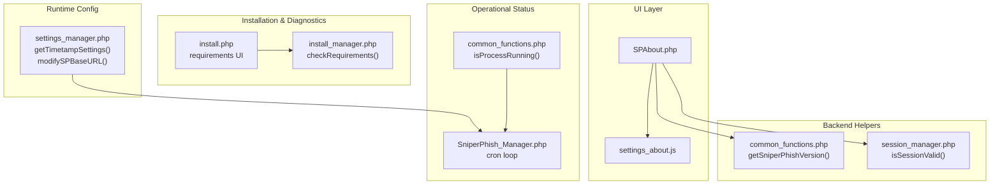
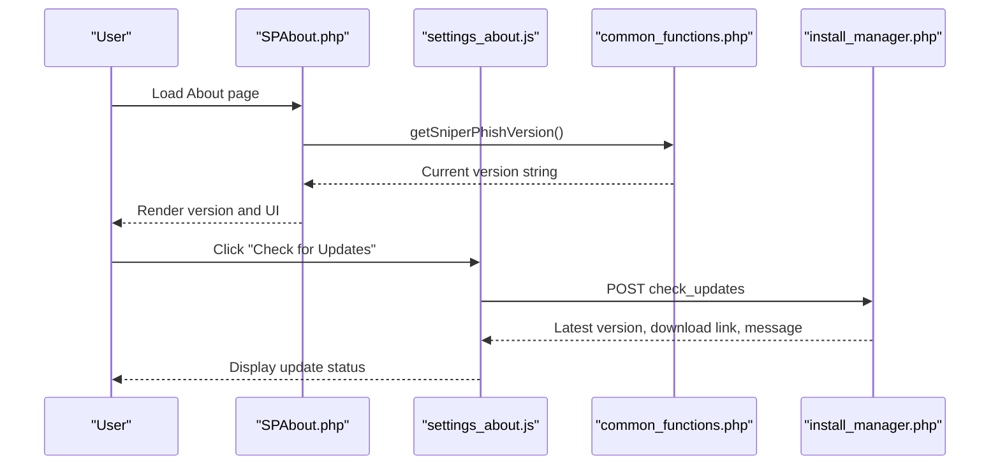
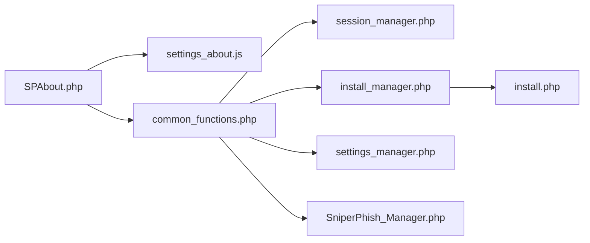

# System Information

<cite>
**Referenced Files in This Document**
- [SPAbout.php](file://spear/SPAbout.php)
- [settings_about.js](file://spear/js/settings_about.js)
- [common_functions.php](file://spear/manager/common_functions.php)
- [install_manager.php](file://install_manager.php)
- [install.php](file://install.php)
- [settings_manager.php](file://spear/manager/settings_manager.php)
- [SniperPhish_Manager.php](file://spear/core/SniperPhish_Manager.php)
- [session_manager.php](file://spear/manager/session_manager.php)
- [README.md](file://README.md)
</cite>

## Table of Contents
1. [Introduction](#introduction)
2. [Project Structure](#project-structure)
3. [Core Components](#core-components)
4. [Architecture Overview](#architecture-overview)
5. [Detailed Component Analysis](#detailed-component-analysis)
6. [Dependency Analysis](#dependency-analysis)
7. [Performance Considerations](#performance-considerations)
8. [Troubleshooting Guide](#troubleshooting-guide)
9. [Conclusion](#conclusion)

## Introduction
This document explains how system information is presented and managed within the application, focusing on the SPAbout.php page and its supporting infrastructure. It covers version details, system status, operational metrics, health indicators, resource utilization displays, configuration summaries, and diagnostic capabilities. It also documents the version checking mechanism, dependency verification, system capability reporting, and the relationships with the installation manager and configuration systems.

## Project Structure
The system information display centers around a dedicated About page that renders version metadata, deployment details, and update checks. Supporting components include:
- Frontend page and scripts for rendering and interacting with system info
- Backend helpers for version retrieval and system capability reporting
- Installation manager for pre-installation requirements verification
- Session and settings managers for runtime configuration and diagnostics
- Core cron manager for operational status

**Diagram sources**
- [SPAbout.php](file://spear/SPAbout.php)
- [settings_about.js](file://spear/js/settings_about.js)
- [common_functions.php](file://spear/manager/common_functions.php)
- [install_manager.php](file://install_manager.php)
- [install.php](file://install.php)
- [settings_manager.php](file://spear/manager/settings_manager.php)
- [SniperPhish_Manager.php](file://spear/core/SniperPhish_Manager.php)
- [session_manager.php](file://spear/manager/session_manager.php)

**Section sources**
- [SPAbout.php](file://spear/SPAbout.php)
- [settings_about.js](file://spear/js/settings_about.js)
- [common_functions.php](file://spear/manager/common_functions.php)
- [install_manager.php](file://install_manager.php)
- [install.php](file://install.php)
- [settings_manager.php](file://spear/manager/settings_manager.php)
- [SniperPhish_Manager.php](file://spear/core/SniperPhish_Manager.php)
- [session_manager.php](file://spear/manager/session_manager.php)

## Core Components
- SPAbout.php: Renders the About page, injects current version, and wires the update check button.
- settings_about.js: Implements the client-side update check logic and version comparison.
- common_functions.php: Provides getSniperPhishVersion() and system capability helpers (OS detection, process checks).
- install_manager.php: Performs system requirements verification during installation.
- install.php: Presents installation requirements to the user and triggers checks.
- settings_manager.php: Manages configuration settings such as base URL and timestamps.
- SniperPhish_Manager.php: Runs the core cron loop and maintains operational status.
- session_manager.php: Validates sessions and integrates with operational checks.

**Section sources**
- [SPAbout.php](file://spear/SPAbout.php)
- [settings_about.js](file://spear/js/settings_about.js)
- [common_functions.php](file://spear/manager/common_functions.php)
- [install_manager.php](file://install_manager.php)
- [install.php](file://install.php)
- [settings_manager.php](file://spear/manager/settings_manager.php)
- [SniperPhish_Manager.php](file://spear/core/SniperPhish_Manager.php)
- [session_manager.php](file://spear/manager/session_manager.php)

## Architecture Overview
The system information pipeline integrates frontend UI, backend helpers, and runtime services:

**Diagram sources**
- [SPAbout.php](file://spear/SPAbout.php)
- [settings_about.js](file://spear/js/settings_about.js)
- [common_functions.php](file://spear/manager/common_functions.php)
- [install_manager.php](file://install_manager.php)

## Detailed Component Analysis

### SPAbout.php: System Metadata and Deployment Details
- Session validation ensures only authenticated users see system info.
- Version display is injected via a call to getSniperPhishVersion().
- Update check button triggers client-side logic to compare local version against remote data.
- Includes UI for displaying current version and update availability.

Implementation highlights:
- Session guard: [SPAbout.php](file://spear/SPAbout.php)
- Version injection: [SPAbout.php](file://spear/SPAbout.php)
- Update UI and script inclusion: [SPAbout.php](file://spear/SPAbout.php)

**Section sources**
- [SPAbout.php](file://spear/SPAbout.php)

### settings_about.js: Version Checking and Comparison
- Sends a POST request to the update endpoint to fetch latest version metadata.
- Compares the current version with the remote version using a semantic-like comparator.
- Displays actionable messages indicating whether an update is available or if the latest version is in use.

Key behaviors:
- Remote update check: [settings_about.js](file://spear/js/settings_about.js)
- Version comparison logic: [settings_about.js](file://spear/js/settings_about.js)

**Section sources**
- [settings_about.js](file://spear/js/settings_about.js)

### common_functions.php: Version Retrieval and System Capability Reporting
- getSniperPhishVersion(): Returns the current application version string.
- OS detection and binary path resolution for cron processes.
- Process existence checks for the core cron service.
- Helper functions for server variable management and logging.

Relevant functions:
- Version retrieval: [common_functions.php](file://spear/manager/common_functions.php)
- OS detection and process checks: [common_functions.php](file://spear/manager/common_functions.php)
- Server variables: [common_functions.php](file://spear/manager/common_functions.php)

**Section sources**
- [common_functions.php](file://spear/manager/common_functions.php)

### Installation Manager and Requirements Verification
- checkRequirements(): Verifies PHP version, required extensions, filesystem permissions, and OS-specific command availability.
- Returns structured results indicating pass/fail and detailed messages for each requirement.
- install.php: Renders requirements in the UI and triggers checks via AJAX.

Operational flow:
- Requirement checks: [install_manager.php](file://install_manager.php)
- UI presentation and AJAX calls: [install.php](file://install.php)

**Section sources**
- [install_manager.php](file://install_manager.php)
- [install.php](file://install.php)

### Runtime Configuration and Operational Metrics
- settings_manager.php: Exposes endpoints to retrieve and modify timestamp settings and base URL, which influence system diagnostics and reporting.
- SniperPhish_Manager.php: Core cron loop that orchestrates scheduled tasks and maintains operational status.
- session_manager.php: Integrates session validation with operational checks (e.g., ensuring the cron process is running).

Endpoints and processes:
- Timestamp and base URL management: [settings_manager.php](file://spear/manager/settings_manager.php)
- Cron loop and process registration: [SniperPhish_Manager.php](file://spear/core/SniperPhish_Manager.php)
- Session validation and process checks: [session_manager.php](file://spear/manager/session_manager.php)

**Section sources**
- [settings_manager.php](file://spear/manager/settings_manager.php)
- [SniperPhish_Manager.php](file://spear/core/SniperPhish_Manager.php)
- [session_manager.php](file://spear/manager/session_manager.php)

### System Health Indicators and Diagnostics
- Process health: isProcessRunning() determines if the core cron process is active.
- Base URL and server protocol: setServerVariables()/getServerVariable() provide deployment context for diagnostics.
- Logging: logIt() records administrative actions for auditability.

Health and diagnostics:
- Process monitoring: [common_functions.php](file://spear/manager/common_functions.php)
- Server variables: [common_functions.php](file://spear/manager/common_functions.php)
- Logging: [common_functions.php](file://spear/manager/common_functions.php)

**Section sources**
- [common_functions.php](file://spear/manager/common_functions.php)

## Dependency Analysis
The system information display depends on:
- Frontend: SPAbout.php and settings_about.js
- Backend helpers: common_functions.php for version and capability reporting
- Installation subsystem: install_manager.php and install.php for pre-deployment checks
- Runtime configuration: settings_manager.php for base URL and timestamp settings
- Operational status: SniperPhish_Manager.php and session_manager.php for process health

**Diagram sources**
- [SPAbout.php](file://spear/SPAbout.php)
- [settings_about.js](file://spear/js/settings_about.js)
- [common_functions.php](file://spear/manager/common_functions.php)
- [install_manager.php](file://install_manager.php)
- [install.php](file://install.php)
- [settings_manager.php](file://spear/manager/settings_manager.php)
- [SniperPhish_Manager.php](file://spear/core/SniperPhish_Manager.php)
- [session_manager.php](file://spear/manager/session_manager.php)

**Section sources**
- [SPAbout.php](file://spear/SPAbout.php)
- [settings_about.js](file://spear/js/settings_about.js)
- [common_functions.php](file://spear/manager/common_functions.php)
- [install_manager.php](file://install_manager.php)
- [install.php](file://install.php)
- [settings_manager.php](file://spear/manager/settings_manager.php)
- [SniperPhish_Manager.php](file://spear/core/SniperPhish_Manager.php)
- [session_manager.php](file://spear/manager/session_manager.php)

## Performance Considerations
- Update checks are lightweight client-side requests and should be cached appropriately at the CDN or reverse proxy level if frequently accessed.
- Version retrieval is a simple string output and has negligible overhead.
- Requirements checks during installation are synchronous and should be optimized to minimize perceived latency.

## Troubleshooting Guide
Common informational queries and resolutions:
- Version history tracking: The current version is embedded in the UI via getSniperPhishVersion(). For historical tracking, consult external release notes or SCM history.
- System requirements verification: Use the installation wizard to review requirements and fix any failing items (PHP version, extensions, permissions).
- License information display: The project README indicates the license; include this in system documentation as needed.
- Deployment environment details: Base URL and server protocol are stored in the database and can be retrieved/updated via settings endpoints.

Diagnostics:
- Verify cron process status using the session manager’s integration with process checks.
- Confirm base URL correctness using settings endpoints.
- Review logs for administrative actions and errors.

**Section sources**
- [README.md](file://README.md)
- [install.php](file://install.php)
- [install_manager.php](file://install_manager.php)
- [settings_manager.php](file://spear/manager/settings_manager.php)
- [session_manager.php](file://spear/manager/session_manager.php)
- [common_functions.php](file://spear/manager/common_functions.php)

## Conclusion
The system information display in SPAbout.php aggregates version metadata, deployment context, and update status through a cohesive set of frontend and backend components. Together with the installation manager, configuration system, and operational cron, it provides administrators with a clear view of the system’s state, requirements compliance, and configuration. This enables efficient troubleshooting and informed decision-making for upgrades and maintenance.