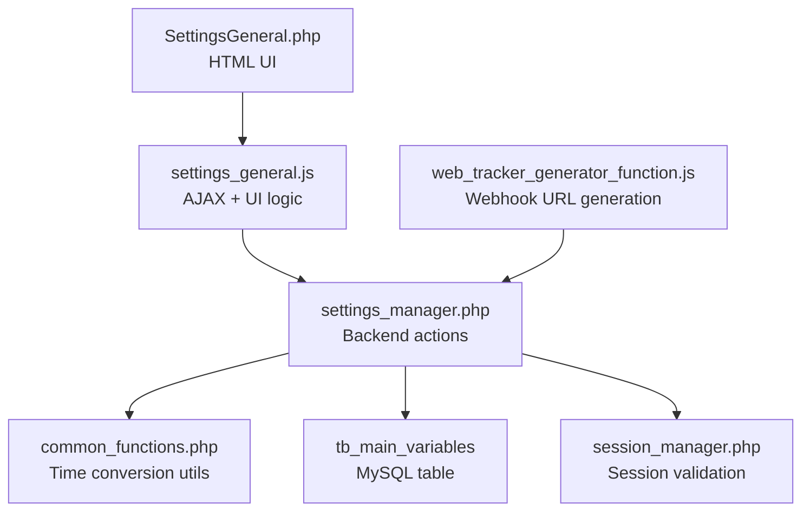
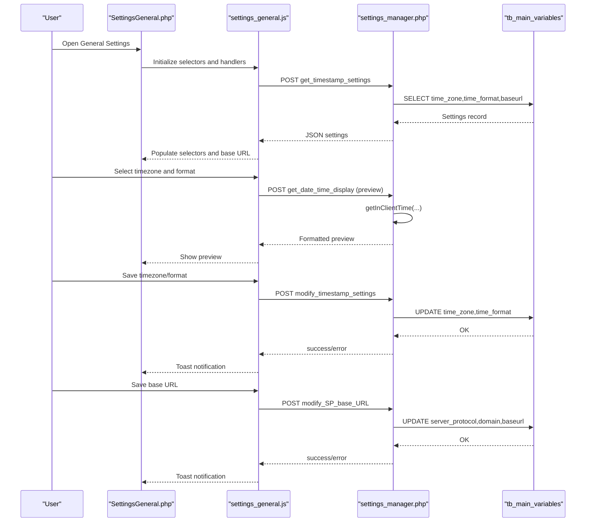
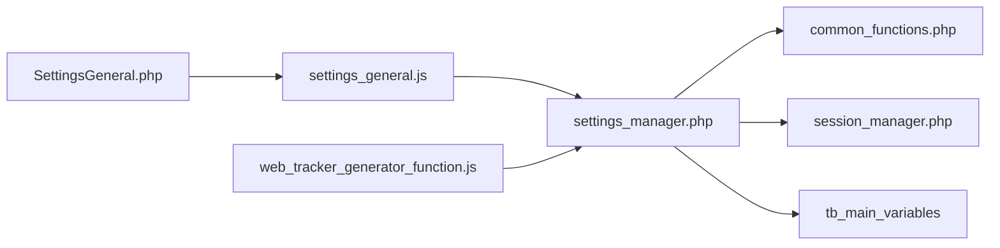
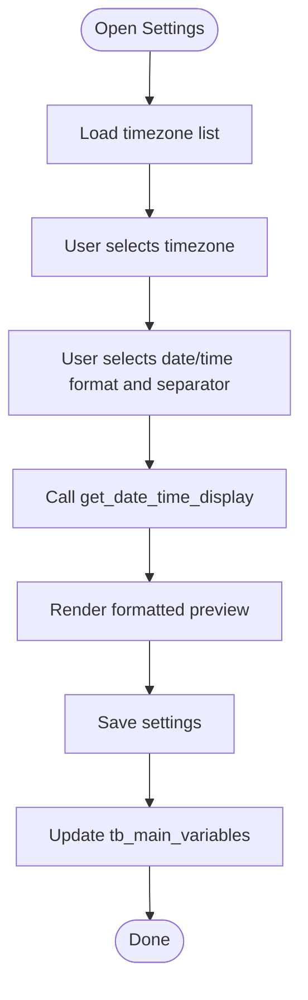
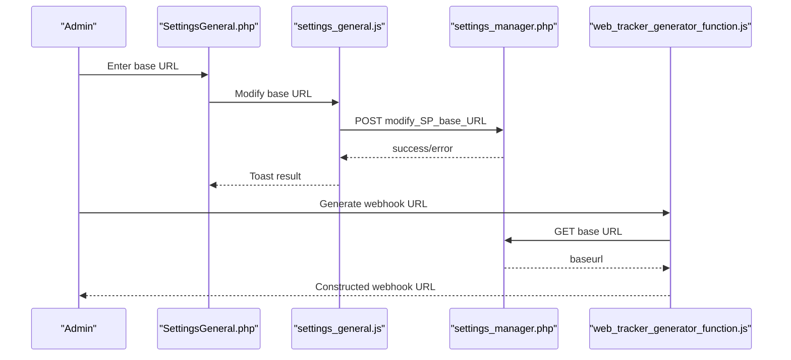

# System Settings

<cite>
**Referenced Files in This Document**
- [SettingsGeneral.php](file://spear/SettingsGeneral.php)
- [settings_manager.php](file://spear/manager/settings_manager.php)
- [settings_general.js](file://spear/js/settings_general.js)
- [common_functions.php](file://spear/manager/common_functions.php)
- [session_manager.php](file://spear/manager/session_manager.php)
- [install_manager.php](file://install_manager.php)
- [web_tracker_generator_function.js](file://spear/js/web_tracker_generator_function.js)
</cite>

## Table of Contents
1. [Introduction](#introduction)
2. [Project Structure](#project-structure)
3. [Core Components](#core-components)
4. [Architecture Overview](#architecture-overview)
5. [Detailed Component Analysis](#detailed-component-analysis)
6. [Dependency Analysis](#dependency-analysis)
7. [Performance Considerations](#performance-considerations)
8. [Troubleshooting Guide](#troubleshooting-guide)
9. [Conclusion](#conclusion)
10. [Appendices](#appendices)

## Introduction
This document explains the system settings configuration for global system parameters and operational preferences in the application. It focuses on:
- Timezone configuration and display formatting
- Base URL management for webhook routing
- Persistence and validation mechanisms
- Practical configuration tasks such as regional settings, URL base configuration, junk data cleanup, and system optimization
- Guidance for different deployment environments and performance considerations

The documentation is designed for system administrators and production engineers who need to tune the system effectively.

## Project Structure
The settings system spans frontend UI, JavaScript handlers, and backend PHP managers. The key components are:
- Frontend UI: SettingsGeneral.php provides the user interface for timezone, time format, base URL, and junk data cleanup.
- JavaScript: settings_general.js handles UI interactions, timezone selection, format preview, and AJAX requests to the backend.
- Backend: settings_manager.php persists settings to the database and validates inputs.
- Shared utilities: common_functions.php provides time conversion helpers and shared functions used across the system.
- Session management: session_manager.php ensures authenticated access and session lifecycle.
- Database: install_manager.php defines the tb_main_variables table that stores global settings.

**Diagram sources**
- [SettingsGeneral.php:1-194](file://spear/SettingsGeneral.php#L1-L194)
- [settings_general.js:1-412](file://spear/js/settings_general.js#L1-L412)
- [settings_manager.php:1-474](file://spear/manager/settings_manager.php#L1-L474)
- [common_functions.php:1-595](file://spear/manager/common_functions.php#L1-L595)
- [session_manager.php:1-244](file://spear/manager/session_manager.php#L1-L244)
- [install_manager.php:510-517](file://install_manager.php#L510-L517)
- [web_tracker_generator_function.js:112-126](file://spear/js/web_tracker_generator_function.js#L112-L126)

**Section sources**
- [SettingsGeneral.php:1-194](file://spear/SettingsGeneral.php#L1-L194)
- [settings_general.js:1-412](file://spear/js/settings_general.js#L1-L412)
- [settings_manager.php:1-474](file://spear/manager/settings_manager.php#L1-L474)
- [common_functions.php:1-595](file://spear/manager/common_functions.php#L1-L595)
- [session_manager.php:1-244](file://spear/manager/session_manager.php#L1-L244)
- [install_manager.php:510-517](file://install_manager.php#L510-L517)
- [web_tracker_generator_function.js:112-126](file://spear/js/web_tracker_generator_function.js#L112-L126)

## Core Components
- SettingsGeneral.php: Provides the UI for timezone selection, date/time format customization, base URL configuration, and junk data cleanup.
- settings_general.js: Implements timezone options, format preview, and AJAX calls to save settings and trigger cleanup.
- settings_manager.php: Backend handler for saving timezone/format, retrieving current settings, updating base URL, and clearing junk data.
- common_functions.php: Supplies time conversion utilities used by the display system and logs.
- session_manager.php: Enforces session validation and manages cookies for client-side time zone awareness.
- install_manager.php: Defines the tb_main_variables table schema storing global settings.

Key responsibilities:
- Persist and retrieve global settings from tb_main_variables
- Convert timestamps to client-local time for display
- Validate and sanitize inputs for base URL updates
- Provide a cleanup routine for orphaned files and records

**Section sources**
- [SettingsGeneral.php:70-142](file://spear/SettingsGeneral.php#L70-L142)
- [settings_general.js:24-323](file://spear/js/settings_general.js#L24-L323)
- [settings_manager.php:28-214](file://spear/manager/settings_manager.php#L28-L214)
- [common_functions.php:471-520](file://spear/manager/common_functions.php#L471-L520)
- [session_manager.php:35-56](file://spear/manager/session_manager.php#L35-L56)
- [install_manager.php:510-517](file://install_manager.php#L510-L517)

## Architecture Overview
The settings architecture follows a layered approach:
- UI layer: SettingsGeneral.php renders controls for timezone, format, and base URL.
- Script layer: settings_general.js binds UI events, constructs payloads, and calls settings_manager.php endpoints.
- Service layer: settings_manager.php validates sessions, parses JSON payloads, and executes database updates.
- Utility layer: common_functions.php provides time conversion helpers used by display logic and logs.
- Persistence: tb_main_variables stores time_zone, time_format, server_protocol, domain, and baseurl.

**Diagram sources**
- [SettingsGeneral.php:70-142](file://spear/SettingsGeneral.php#L70-L142)
- [settings_general.js:299-367](file://spear/js/settings_general.js#L299-L367)
- [settings_manager.php:28-202](file://spear/manager/settings_manager.php#L28-L202)
- [common_functions.php:471-520](file://spear/manager/common_functions.php#L471-L520)
- [install_manager.php:510-517](file://install_manager.php#L510-L517)

## Detailed Component Analysis

### SettingsGeneral.php: UI Controls and Layout
- Timezone and time format controls:
  - Timezone dropdown populated by JavaScript with a curated list of zones.
  - Date format, separator, and time format dropdowns with live preview.
- Base URL section:
  - Text input for base URL with a “generate from current domain” shortcut.
  - Save button triggers base URL update.
- Junk data cleanup:
  - Button to clear orphaned files and records.

Implementation highlights:
- Uses select2 for dropdowns and moment-timezone for timezone handling.
- Calls settings_manager.php endpoints via AJAX for all actions.

**Section sources**
- [SettingsGeneral.php:70-142](file://spear/SettingsGeneral.php#L70-L142)
- [settings_general.js:24-323](file://spear/js/settings_general.js#L24-L323)

### settings_general.js: Timezone Selection, Format Preview, and AJAX
- Timezone options:
  - Curated list of timezones with localized labels.
  - Generates option list using moment.tz.names() filtered to the curated set.
- Format preview:
  - Builds preview strings for selected date/time formats and separators.
  - Sends a preview request to settings_manager.php to render formatted time.
- Save operations:
  - modifyTimeStampSettings: sends timezone and combined date/time format to backend.
  - modifySPBaseURL: validates URL and updates base URL.
  - clearJunkSPData: triggers cleanup routine.

Validation and UX:
- isValidURL is used to validate base URL input.
- Live feedback via toast notifications for success/error.

**Section sources**
- [settings_general.js:24-323](file://spear/js/settings_general.js#L24-L323)
- [settings_general.js:326-394](file://spear/js/settings_general.js#L326-L394)
- [settings_general.js:396-412](file://spear/js/settings_general.js#L396-L412)

### settings_manager.php: Backend Actions and Validation
- Authentication:
  - Requires a valid session; otherwise denies access.
- Actions:
  - modify_timestamp_settings: updates time_zone and time_format in tb_main_variables.
  - get_timestamp_settings: retrieves current settings for UI population.
  - get_date_time_display: previews formatted time given a timezone and format string.
  - modify_SP_base_URL: updates server_protocol, domain, and baseurl.
  - clear_junk_SP_data: cleans orphaned files and records across uploads and sniperhost directories.
- Utilities:
  - Uses common_functions.php for time conversions and URL parsing.

Persistence and validation:
- Updates are executed via prepared statements to prevent SQL injection.
- Base URL parsing ensures scheme and host are extracted and stored separately.

**Section sources**
- [settings_manager.php:28-214](file://spear/manager/settings_manager.php#L28-L214)
- [settings_manager.php:162-214](file://spear/manager/settings_manager.php#L162-L214)

### common_functions.php: Time Conversion and Helpers
- getTimeInfo: loads client timezone and format, composes a combined format string.
- getInClientTime: converts microseconds timestamp to client-local formatted string.
- getInClientTime_FD: converts standard date-time strings to client-local format.
- getServerVariable/setServerVariables: manage server protocol/domain/baseurl for internal use.

These functions underpin the display system and ensure consistent time presentation across the UI.

**Section sources**
- [common_functions.php:471-520](file://spear/manager/common_functions.php#L471-L520)
- [common_functions.php:170-185](file://spear/manager/common_functions.php#L170-L185)

### session_manager.php: Session Validation and Cookies
- Validates session and enforces session lifetime.
- Sets a c_data cookie containing user info and client timezone for client-side rendering.

This ensures the UI displays times consistently with the logged-in user’s configured timezone.

**Section sources**
- [session_manager.php:35-56](file://spear/manager/session_manager.php#L35-L56)

### Database Schema: tb_main_variables
- Columns:
  - id (primary key)
  - server_protocol
  - domain
  - baseurl
  - time_zone
  - time_format

This table centralizes global system parameters persisted by settings_manager.php.

**Section sources**
- [install_manager.php:510-517](file://install_manager.php#L510-L517)

### Webhook Routing and Base URL Integration
- Base URL is used by tracker generators to construct webhook endpoints.
- The UI allows selecting “use base URL” or “current domain” for webhook URL generation.
- Validation checks the webhook endpoint by posting a test payload to /track.

Practical implications:
- Ensure baseurl is reachable from targets’ networks.
- Use HTTPS for production deployments to avoid mixed content issues.

**Section sources**
- [SettingsGeneral.php:113-127](file://spear/SettingsGeneral.php#L113-L127)
- [web_tracker_generator_function.js:112-126](file://spear/js/web_tracker_generator_function.js#L112-L126)
- [web_tracker_generator_function.js:852-879](file://spear/js/web_tracker_generator_function.js#L852-L879)

## Dependency Analysis
- SettingsGeneral.php depends on:
  - settings_general.js for UI logic and AJAX.
  - settings_manager.php for backend operations.
- settings_general.js depends on:
  - settings_manager.php for persistence.
  - moment-timezone for timezone and preview.
- settings_manager.php depends on:
  - common_functions.php for time conversion.
  - session_manager.php for authentication.
  - tb_main_variables for persistence.
- web_tracker_generator_function.js depends on:
  - settings_manager.php to fetch base URL for webhook generation.

**Diagram sources**
- [SettingsGeneral.php:1-194](file://spear/SettingsGeneral.php#L1-L194)
- [settings_general.js:1-412](file://spear/js/settings_general.js#L1-L412)
- [settings_manager.php:1-474](file://spear/manager/settings_manager.php#L1-L474)
- [common_functions.php:1-595](file://spear/manager/common_functions.php#L1-L595)
- [session_manager.php:1-244](file://spear/manager/session_manager.php#L1-L244)
- [web_tracker_generator_function.js:112-126](file://spear/js/web_tracker_generator_function.js#L112-L126)

**Section sources**
- [SettingsGeneral.php:1-194](file://spear/SettingsGeneral.php#L1-L194)
- [settings_general.js:1-412](file://spear/js/settings_general.js#L1-L412)
- [settings_manager.php:1-474](file://spear/manager/settings_manager.php#L1-L474)
- [common_functions.php:1-595](file://spear/manager/common_functions.php#L1-L595)
- [session_manager.php:1-244](file://spear/manager/session_manager.php#L1-L244)
- [web_tracker_generator_function.js:112-126](file://spear/js/web_tracker_generator_function.js#L112-L126)

## Performance Considerations
- Timezone and format preview:
  - Preview requests compute formatted time server-side; keep the preview interval reasonable to avoid excessive calls.
- Base URL updates:
  - Updating base URL is a single database write; ensure the endpoint is validated before frequent saves.
- Junk data cleanup:
  - Cleanup scans multiple directories and deletes orphaned files; schedule during low-traffic periods.
- Display system:
  - Converting timestamps to client time is O(n) per record; batch operations where possible.

[No sources needed since this section provides general guidance]

## Troubleshooting Guide
Common issues and resolutions:
- Access denied when saving settings:
  - Ensure a valid session exists; session_manager.php enforces session validation.
- Base URL not saving:
  - Verify URL format; settings_general.js validates the URL before sending to settings_manager.php.
- Timezone/format not reflected:
  - Confirm settings_manager.php updated tb_main_variables and that common_functions.php is loading the latest values.
- Junk data cleanup fails:
  - Check filesystem permissions for uploads/sniperhost directories; ensure the web server can delete files.

**Section sources**
- [session_manager.php:6-7](file://spear/manager/session_manager.php#L6-L7)
- [settings_general.js:369-394](file://spear/js/settings_general.js#L369-L394)
- [settings_manager.php:172-184](file://spear/manager/settings_manager.php#L172-L184)
- [settings_manager.php:205-214](file://spear/manager/settings_manager.php#L205-L214)

## Conclusion
The system settings configuration provides a robust foundation for managing global parameters:
- Timezone and display formatting are persisted and applied consistently across the UI.
- Base URL management centralizes webhook routing for trackers.
- Persistence uses secure, prepared statements with validation.
- Cleanup routines help maintain system hygiene.

For production, ensure base URL reachability, schedule cleanup during off-hours, and monitor logs for validation failures.

[No sources needed since this section summarizes without analyzing specific files]

## Appendices

### A. Timezone Selection and Format Preview Flow

**Diagram sources**
- [settings_general.js:24-323](file://spear/js/settings_general.js#L24-L323)
- [settings_manager.php:163-170](file://spear/manager/settings_manager.php#L163-L170)

### B. Base URL Management and Webhook Routing

**Diagram sources**
- [SettingsGeneral.php:113-127](file://spear/SettingsGeneral.php#L113-L127)
- [settings_general.js:369-394](file://spear/js/settings_general.js#L369-L394)
- [settings_manager.php:172-184](file://spear/manager/settings_manager.php#L172-L184)
- [web_tracker_generator_function.js:112-126](file://spear/js/web_tracker_generator_function.js#L112-L126)

### C. Junk Data Cleanup Operations
- Removes orphaned tracker images, attachments, mail body files, payload uploads, sniperhost files, and stale access control entries.
- Scans directories and compares IDs against database records to determine deletions.

**Section sources**
- [settings_manager.php:205-310](file://spear/manager/settings_manager.php#L205-L310)

### D. Recommended Deployment Settings
- Development:
  - Use HTTP base URL for local testing; ensure CORS and mixed content policies are acceptable.
- Staging:
  - Enable HTTPS; verify base URL reaches staging endpoints.
- Production:
  - Use HTTPS base URL; restrict access to admin endpoints; schedule junk cleanup during maintenance windows.

[No sources needed since this section provides general guidance]