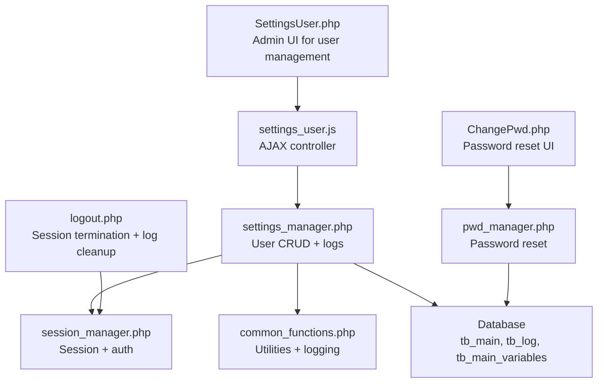
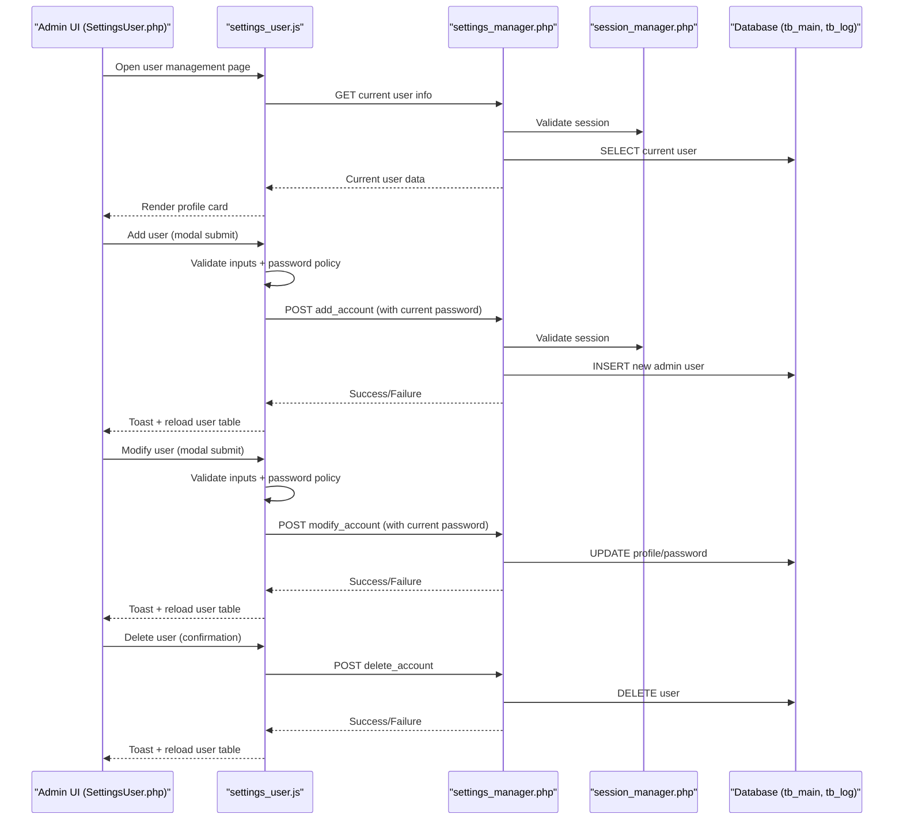
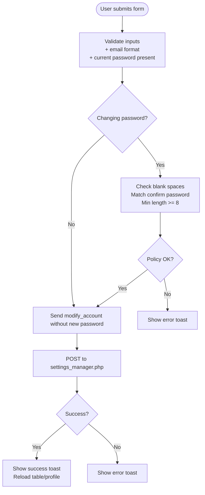
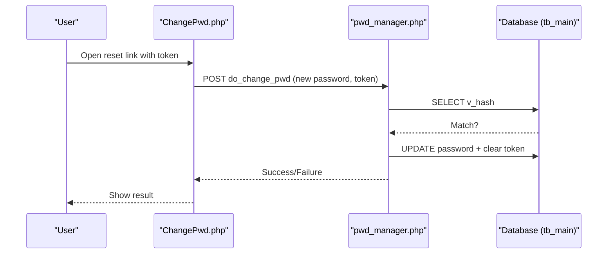
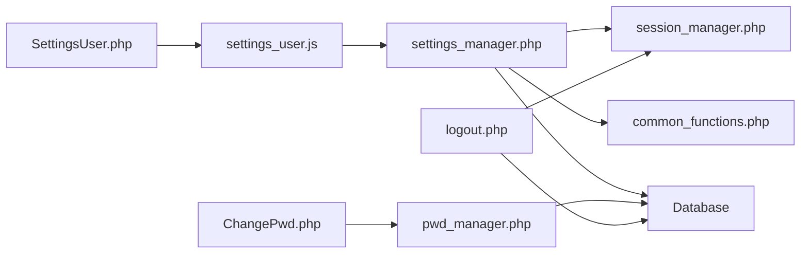

# User Management

<cite>
**Referenced Files in This Document**
- [SettingsUser.php](file://spear/SettingsUser.php)
- [settings_user.js](file://spear/js/settings_user.js)
- [settings_manager.php](file://spear/manager/settings_manager.php)
- [session_manager.php](file://spear/manager/session_manager.php)
- [pwd_manager.php](file://spear/manager/pwd_manager.php)
- [ChangePwd.php](file://spear/ChangePwd.php)
- [common_functions.php](file://spear/manager/common_functions.php)
- [install_manager.php](file://install_manager.php)
- [logout.php](file://spear/logout.php)
</cite>

## Table of Contents
1. [Introduction](#introduction)
2. [Project Structure](#project-structure)
3. [Core Components](#core-components)
4. [Architecture Overview](#architecture-overview)
5. [Detailed Component Analysis](#detailed-component-analysis)
6. [Dependency Analysis](#dependency-analysis)
7. [Performance Considerations](#performance-considerations)
8. [Troubleshooting Guide](#troubleshooting-guide)
9. [Conclusion](#conclusion)
10. [Appendices](#appendices)

## Introduction
This document explains the administrative user provisioning and access control capabilities implemented in the application. It focuses on the SettingsUser.php interface and its backend handlers, detailing how administrators can create, modify, and delete administrative accounts, enforce password policies, and manage account status. It also covers integration with session management, authentication, and audit logging for user actions. Guidance is provided for onboarding, role-based access control, password reset procedures, and deactivation workflows, along with security considerations and best practices.

## Project Structure
The user management functionality spans a front-end page, a JavaScript controller, and a PHP backend handler. Supporting modules handle session lifecycle, authentication, password reset, and audit logging.

**Diagram sources**
- [SettingsUser.php:1-377](file://spear/SettingsUser.php#L1-L377)
- [settings_user.js:1-274](file://spear/js/settings_user.js#L1-L274)
- [settings_manager.php:1-474](file://spear/manager/settings_manager.php#L1-L474)
- [session_manager.php:1-244](file://spear/manager/session_manager.php#L1-L244)
- [pwd_manager.php:1-99](file://spear/manager/pwd_manager.php#L1-L99)
- [ChangePwd.php:1-135](file://spear/ChangePwd.php#L1-L135)
- [common_functions.php:576-586](file://spear/manager/common_functions.php#L576-L586)
- [logout.php:1-19](file://spear/logout.php#L1-L19)

**Section sources**
- [SettingsUser.php:1-377](file://spear/SettingsUser.php#L1-L377)
- [settings_user.js:1-274](file://spear/js/settings_user.js#L1-L274)
- [settings_manager.php:1-50](file://spear/manager/settings_manager.php#L1-L50)
- [session_manager.php:1-244](file://spear/manager/session_manager.php#L1-L244)
- [pwd_manager.php:1-99](file://spear/manager/pwd_manager.php#L1-L99)
- [ChangePwd.php:1-135](file://spear/ChangePwd.php#L1-L135)
- [common_functions.php:576-586](file://spear/manager/common_functions.php#L576-L586)
- [logout.php:1-19](file://spear/logout.php#L1-L19)

## Core Components
- SettingsUser.php: Admin UI for listing, adding, editing, and deleting administrative users. It initializes DataTables and renders modals for user actions.
- settings_user.js: Front-end controller that validates inputs, enforces password policy, and posts actions to the backend via AJAX.
- settings_manager.php: Backend handler for user CRUD operations, current user retrieval, and audit log management. It validates sessions and performs database updates.
- session_manager.php: Session lifecycle management, login/logout tracking, cookie population, and re-login validation.
- pwd_manager.php and ChangePwd.php: Password reset workflow including token generation, validation, and password change.
- common_functions.php: Utility functions including audit logging (tb_log) and time zone conversions.
- logout.php: Terminates sessions and prunes audit logs to a bounded size.

Key responsibilities:
- Provisioning: Create new administrative users with avatar selection, email, and password.
- Modification: Update profile details and optionally change passwords with authorization checks.
- Deletion: Remove administrative accounts with safeguards against deleting the primary admin.
- Authentication: Enforce current-password verification for sensitive operations.
- Audit logging: Record user actions and system events for compliance and monitoring.

**Section sources**
- [SettingsUser.php:90-175](file://spear/SettingsUser.php#L90-L175)
- [settings_user.js:30-96](file://spear/js/settings_user.js#L30-L96)
- [settings_manager.php:88-160](file://spear/manager/settings_manager.php#L88-L160)
- [session_manager.php:35-44](file://spear/manager/session_manager.php#L35-L44)
- [pwd_manager.php:24-99](file://spear/manager/pwd_manager.php#L24-L99)
- [ChangePwd.php:102-132](file://spear/ChangePwd.php#L102-L132)
- [common_functions.php:576-586](file://spear/manager/common_functions.php#L576-L586)
- [logout.php:1-19](file://spear/logout.php#L1-L19)

## Architecture Overview
The user management flow integrates UI, client-side validation, and server-side processing with session and audit controls.

**Diagram sources**
- [SettingsUser.php:1-377](file://spear/SettingsUser.php#L1-L377)
- [settings_user.js:6-28](file://spear/js/settings_user.js#L6-L28)
- [settings_manager.php:17-26](file://spear/manager/settings_manager.php#L17-L26)
- [session_manager.php:35-44](file://spear/manager/session_manager.php#L35-L44)

## Detailed Component Analysis

### SettingsUser.php (Admin UI)
- Initializes session validation and loads the user management page.
- Provides:
  - Current user profile card with avatar, name, username, email, and account creation date.
  - “Create New Admin” button to open the add user modal.
  - A table listing all administrative users with actions (edit/view, delete for non-admin users).
  - Modals for adding and editing users, including avatar selection, name, username, email, password fields, and current password confirmation.

Operational notes:
- Uses DataTables for rendering and sorting.
- Integrates with settings_user.js for AJAX operations.

**Section sources**
- [SettingsUser.php:24-175](file://spear/SettingsUser.php#L24-L175)
- [SettingsUser.php:194-242](file://spear/SettingsUser.php#L194-L242)

### settings_user.js (Front-end Controller)
Responsibilities:
- Fetch current user details and populate the profile card.
- Add user:
  - Validates name, username, email format, current password presence, and enforces password policy.
  - Sends add_account request to settings_manager.php.
- Modify user:
  - Validates name/email/current password and enforces password policy when changing password.
  - Sends modify_account request to settings_manager.php.
- Delete user:
  - Confirms deletion and sends delete_account request to settings_manager.php.
- Password policy enforcement:
  - Checks for leading/trailing spaces, confirms password match, and minimum length.

**Diagram sources**
- [settings_user.js:30-96](file://spear/js/settings_user.js#L30-L96)
- [settings_user.js:98-156](file://spear/js/settings_user.js#L98-L156)
- [settings_user.js:244-274](file://spear/js/settings_user.js#L244-L274)

**Section sources**
- [settings_user.js:6-28](file://spear/js/settings_user.js#L6-L28)
- [settings_user.js:30-96](file://spear/js/settings_user.js#L30-L96)
- [settings_user.js:98-156](file://spear/js/settings_user.js#L98-L156)
- [settings_user.js:158-176](file://spear/js/settings_user.js#L158-L176)
- [settings_user.js:183-192](file://spear/js/settings_user.js#L183-L192)
- [settings_user.js:194-242](file://spear/js/settings_user.js#L194-L242)
- [settings_user.js:244-274](file://spear/js/settings_user.js#L244-L274)

### settings_manager.php (Backend Handler)
Core operations:
- getCurrentUser: Returns current user profile with formatted timestamps.
- getUserList: Returns all administrative users with formatted timestamps and last login.
- addAccount:
  - Checks for duplicate usernames.
  - Verifies current password via isCurrentPwdCorrect.
  - Hashes new password with SHA-256 and inserts into tb_main.
- modifyAccount:
  - Verifies current password.
  - Updates profile fields; if new password provided, hashes and updates.
  - Refreshes c_data cookie for the current user.
- deleteAccount:
  - Prevents deletion of the primary admin account (id=1).
  - Deletes the selected user otherwise.
- Logs management:
  - getLogs: Server-side DataTables endpoint for tb_log.
  - downloadLogs: CSV/PDF/HTML export of logs.
  - clearLog: Truncates tb_log.

Security and validation:
- All user operations are gated by session validation.
- Passwords are hashed with SHA-256 before storage.
- Current password verification is enforced for sensitive operations.

**Section sources**
- [settings_manager.php:54-70](file://spear/manager/settings_manager.php#L54-L70)
- [settings_manager.php:72-86](file://spear/manager/settings_manager.php#L72-L86)
- [settings_manager.php:88-105](file://spear/manager/settings_manager.php#L88-L105)
- [settings_manager.php:108-132](file://spear/manager/settings_manager.php#L108-L132)
- [settings_manager.php:134-146](file://spear/manager/settings_manager.php#L134-L146)
- [settings_manager.php:148-160](file://spear/manager/settings_manager.php#L148-L160)
- [settings_manager.php:359-414](file://spear/manager/settings_manager.php#L359-L414)
- [settings_manager.php:416-472](file://spear/manager/settings_manager.php#L416-L472)

### session_manager.php (Session and Authentication)
- Validates sessions and refreshes expiry.
- Creates and regenerates sessions with secure cookie parameters.
- Tracks login/logout history in tb_main and logs events to tb_log.
- Provides re-login validation and cookie population for client info.

Integration with user management:
- Settings pages require isSessionValid to pass.
- Login/logout updates last_login/last_logout fields.
- Audit events logged for account login/logout.

**Section sources**
- [session_manager.php:35-44](file://spear/manager/session_manager.php#L35-L44)
- [session_manager.php:215-234](file://spear/manager/session_manager.php#L215-L234)
- [session_manager.php:58-73](file://spear/manager/session_manager.php#L58-L73)
- [session_manager.php:198-213](file://spear/manager/session_manager.php#L198-L213)

### Password Reset Workflow (pwd_manager.php + ChangePwd.php)
- pwd_manager.php:
  - sendPwdReset: Generates a token and stores it with a timestamp; sends reset email.
  - doChangePwd: Validates token and updates password after hashing with SHA-256.
- ChangePwd.php:
  - UI for entering new password and confirming it.
  - Submits to pwd_manager.php with token and new password.

**Diagram sources**
- [ChangePwd.php:102-132](file://spear/ChangePwd.php#L102-L132)
- [pwd_manager.php:79-99](file://spear/manager/pwd_manager.php#L79-L99)

**Section sources**
- [pwd_manager.php:24-43](file://spear/manager/pwd_manager.php#L24-L43)
- [pwd_manager.php:56-65](file://spear/manager/pwd_manager.php#L56-L65)
- [pwd_manager.php:67-75](file://spear/manager/pwd_manager.php#L67-L75)
- [pwd_manager.php:79-99](file://spear/manager/pwd_manager.php#L79-L99)
- [ChangePwd.php:102-132](file://spear/ChangePwd.php#L102-L132)

### Audit Logging (tb_log)
- common_functions.php provides logIt to insert records into tb_log with username, log message, IP, and timestamp.
- settings_manager.php uses logIt for login/logout events.
- logout.php prunes tb_log to keep the latest 1000 entries.

**Section sources**
- [common_functions.php:576-586](file://spear/manager/common_functions.php#L576-L586)
- [session_manager.php:64-69](file://spear/manager/session_manager.php#L64-L69)
- [logout.php:11-13](file://spear/logout.php#L11-L13)

## Dependency Analysis
- SettingsUser.php depends on settings_user.js for UI logic and DataTables.
- settings_user.js posts to settings_manager.php for all user operations.
- settings_manager.php depends on session_manager.php for session validation and on common_functions.php for logging utilities.
- pwd_manager.php depends on session_manager.php and db.php for token handling and database operations.
- logout.php depends on session_manager.php and db.php for session termination and log pruning.

**Diagram sources**
- [SettingsUser.php:1-377](file://spear/SettingsUser.php#L1-L377)
- [settings_user.js:1-274](file://spear/js/settings_user.js#L1-L274)
- [settings_manager.php:1-474](file://spear/manager/settings_manager.php#L1-L474)
- [session_manager.php:1-244](file://spear/manager/session_manager.php#L1-L244)
- [pwd_manager.php:1-99](file://spear/manager/pwd_manager.php#L1-L99)
- [ChangePwd.php:1-135](file://spear/ChangePwd.php#L1-L135)
- [common_functions.php:576-586](file://spear/manager/common_functions.php#L576-L586)
- [logout.php:1-19](file://spear/logout.php#L1-L19)

**Section sources**
- [settings_manager.php:1-50](file://spear/manager/settings_manager.php#L1-L50)
- [session_manager.php:1-244](file://spear/manager/session_manager.php#L1-L244)
- [pwd_manager.php:1-99](file://spear/manager/pwd_manager.php#L1-L99)
- [ChangePwd.php:1-135](file://spear/ChangePwd.php#L1-L135)
- [common_functions.php:576-586](file://spear/manager/common_functions.php#L576-L586)
- [logout.php:1-19](file://spear/logout.php#L1-L19)

## Performance Considerations
- DataTables server-side processing is used for user lists and logs, reducing client-side overhead and improving responsiveness for large datasets.
- Session cookie parameters are configured for security and performance; regenerate ID on re-login to mitigate session fixation risks.
- Audit log pruning keeps the tb_log table bounded, preventing unbounded growth.

[No sources needed since this section provides general guidance]

## Troubleshooting Guide
Common issues and resolutions:
- Access denied on user management pages:
  - Ensure isSessionValid passes; otherwise, the session may have expired or been terminated.
  - Verify that the user has administrative privileges and that the session is active.
- Password policy failures:
  - Leading/trailing spaces are rejected; ensure passwords are trimmed before submission.
  - Confirm passwords must match and meet minimum length requirements.
- Authorization failures during add/modify:
  - Current password must be correct; otherwise, operations are rejected.
- Deletion failures:
  - Deleting the primary admin account is blocked; select another user to delete.
- Password reset not received:
  - Ensure the contact email exists and the token is valid; tokens expire after two days.
- Audit logs not appearing:
  - Verify log entries are inserted on login/logout and that prune logic runs on logout.

**Section sources**
- [settings_user.js:244-274](file://spear/js/settings_user.js#L244-L274)
- [settings_manager.php:88-105](file://spear/manager/settings_manager.php#L88-L105)
- [settings_manager.php:108-132](file://spear/manager/settings_manager.php#L108-L132)
- [settings_manager.php:148-160](file://spear/manager/settings_manager.php#L148-L160)
- [pwd_manager.php:24-43](file://spear/manager/pwd_manager.php#L24-L43)
- [pwd_manager.php:101-112](file://spear/manager/pwd_manager.php#L101-L112)
- [logout.php:11-13](file://spear/logout.php#L11-L13)

## Conclusion
The user management subsystem provides a secure, auditable, and user-friendly mechanism for administrative provisioning and access control. It enforces strong password policies, requires current-password authorization for sensitive operations, and maintains comprehensive audit logs. Integration with session management ensures robust authentication and session lifecycle control. Administrators can onboard new users, manage roles and permissions, reset passwords, and deactivate accounts while maintaining compliance and operational visibility.

[No sources needed since this section summarizes without analyzing specific files]

## Appendices

### Administrative Tasks and Workflows
- User Onboarding:
  - Use the “Create New Admin” modal to enter name, username, email, avatar, and password.
  - Confirm with current password to authorize the operation.
  - The new user is stored with a hashed password and associated metadata.
- Role-Based Access Control:
  - Administrative users are managed via tb_main; additional access control for dashboards is handled by tb_access_ctrl.
  - Use manageDashboardAccess/getAccessInfo endpoints to enable/disable public access for campaigns and trackers.
- Password Reset Procedures:
  - Initiate reset via pwd_manager; a token is generated and emailed to the contact address.
  - Users change password via ChangePwd.php using the token.
- Account Deactivation:
  - Use the delete action to remove administrative accounts; the primary admin account cannot be deleted.

**Section sources**
- [settings_manager.php:148-160](file://spear/manager/settings_manager.php#L148-L160)
- [session_manager.php:146-195](file://spear/manager/session_manager.php#L146-L195)
- [pwd_manager.php:24-43](file://spear/manager/pwd_manager.php#L24-L43)
- [ChangePwd.php:102-132](file://spear/ChangePwd.php#L102-L132)

### Security Considerations
- Password Hashing:
  - Passwords are hashed with SHA-256 before storage.
- Session Validation:
  - Sessions are validated centrally; cookies are configured with HttpOnly and SameSite.
  - Session regeneration on re-login mitigates session fixation.
- Audit Logging:
  - All login/logout events are recorded in tb_log with IP and timestamp.
  - Logout prunes tb_log to a bounded size to prevent excessive growth.
- Token Expiration:
  - Password reset tokens expire after two days to reduce risk.

**Section sources**
- [settings_manager.php:88-105](file://spear/manager/settings_manager.php#L88-L105)
- [session_manager.php:215-234](file://spear/manager/session_manager.php#L215-L234)
- [session_manager.php:64-69](file://spear/manager/session_manager.php#L64-L69)
- [logout.php:11-13](file://spear/logout.php#L11-L13)
- [pwd_manager.php:61-65](file://spear/manager/pwd_manager.php#L61-L65)

### Best Practices for Secure Administrative Access
- Enforce strong password policies at creation and modification.
- Require current-password confirmation for any sensitive change.
- Regularly review and prune audit logs.
- Monitor login/logout activity and investigate anomalies.
- Limit administrative access to trusted individuals and rotate credentials periodically.

[No sources needed since this section provides general guidance]